# 一分K 5>10>20>60 站上MA200 · 近一週前100

請直接開這個 Markdown，GitHub 會顯示圖。

- 成交 **415**　勝 **98**　勝率 **24%**　單筆期望 **-0.18%**
- 把每筆淨報酬加總 **-72.81%**（不是資金曲線；每天最多同時一百檔）

規則：一分K **MA5>MA10>MA20>MA60** 且收盤**站上 MA200**，條件剛成立才通知／進場。

### 每日訊號

| 日期 | 筆數 |
| --- | ---: |
| 2026-08-17 | 86 |
| 2026-08-18 | 70 |
| 2026-08-19 | 79 |
| 2026-08-20 | 91 |
| 2026-08-21 | 89 |

### 出場

| 原因 | 筆數 |
| --- | ---: |
| `lost_align` | 408 |
| `session_flat` | 7 |

## 抽樣圖

### #1 2027.TW 大成鋼　08-17 09:12　+3.41%

進場 `49.05`　出場 `50.80`　lost_align

5/10/20/60 `49.03` / `49.02` / `48.35` / `47.58`　MA200 `47.40`

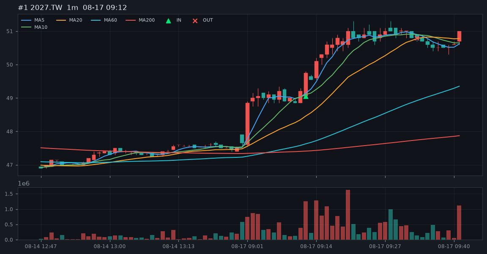

### #2 3081.TWO 聯亞　08-17 09:12　+0.41%

進場 `2635.00`　出場 `2650.00`　lost_align

5/10/20/60 `2677.00` / `2585.00` / `2534.50` / `2529.00`　MA200 `2624.57`

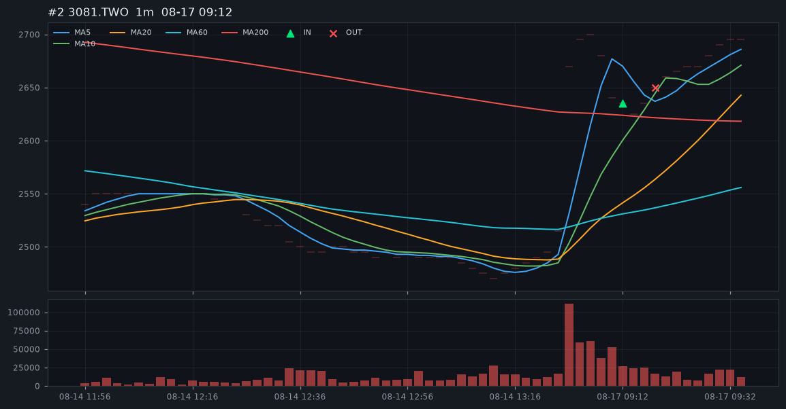

### #3 6182.TWO 合晶　08-17 09:12　-1.05%

進場 `112.50`　出場 `111.50`　lost_align

5/10/20/60 `112.80` / `112.40` / `111.50` / `110.54`　MA200 `112.36`

### #4 3406.TW 玉晶光　08-17 09:14　-2.89%

進場 `660.00`　出場 `642.00`　lost_align

5/10/20/60 `653.00` / `652.00` / `638.40` / `623.60`　MA200 `621.91`

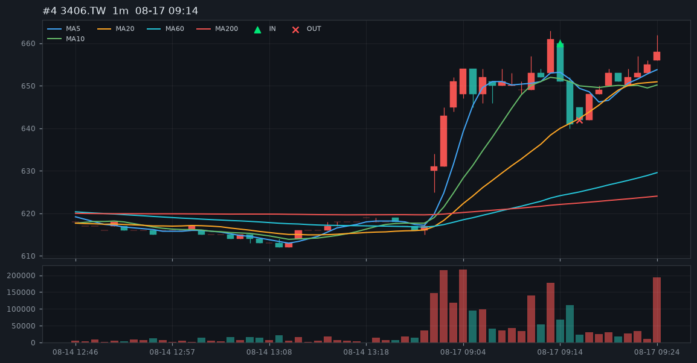

### #5 3443.TW 創意　08-17 09:38　+5.05%

進場 `5570.00`　出場 `5860.00`　lost_align

5/10/20/60 `5542.00` / `5539.50` / `5518.50` / `5481.83`　MA200 `5551.90`

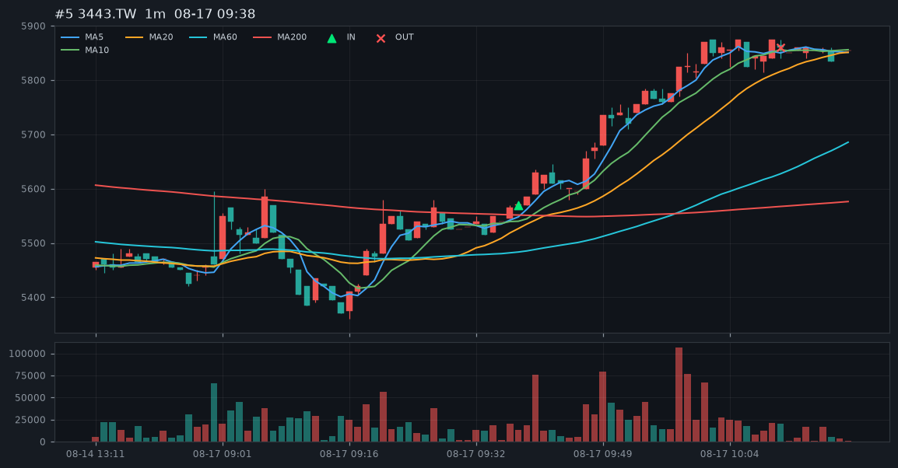

### #6 5536.TWO 聖暉*　08-18 09:11　-0.93%

進場 `914.00`　出場 `907.00`　lost_align

5/10/20/60 `913.00` / `912.60` / `908.95` / `905.62`　MA200 `906.65`

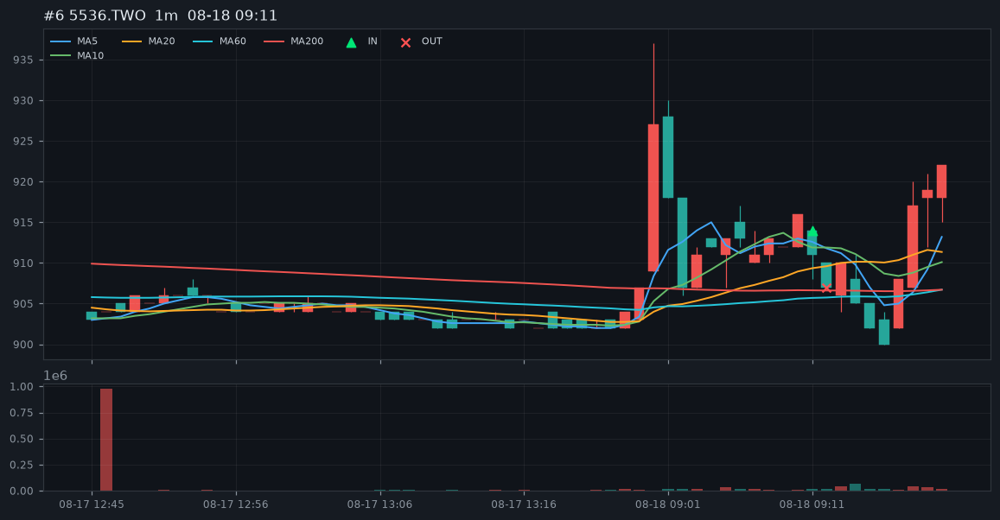

### #7 2359.TW 所羅門　08-18 09:12　-0.72%

進場 `179.00`　出場 `178.00`　lost_align

5/10/20/60 `177.60` / `175.60` / `175.38` / `175.11`　MA200 `175.02`

### #8 3529.TWO 力旺　08-18 09:12　-0.57%

進場 `2465.00`　出場 `2455.00`　lost_align

5/10/20/60 `2467.00` / `2443.50` / `2416.00` / `2398.75`　MA200 `2447.70`

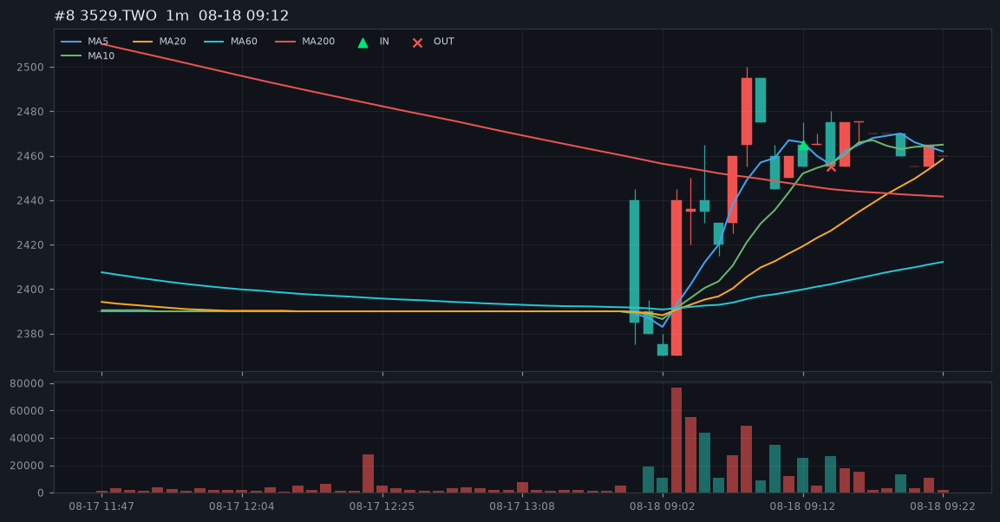

### #9 2368.TW 金像電　08-18 09:14　+5.18%

進場 `1030.00`　出場 `1085.00`　lost_align

5/10/20/60 `1018.00` / `1017.50` / `1017.00` / `1015.17`　MA200 `1015.40`

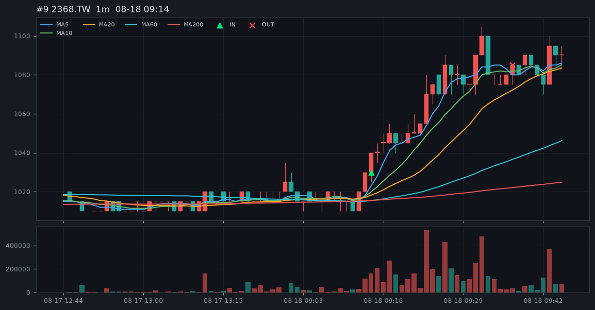

### #10 3450.TW 聯鈞　08-18 09:17　-2.08%

進場 `573.00`　出場 `562.00`　lost_align

5/10/20/60 `577.00` / `575.50` / `570.95` / `547.20`　MA200 `521.99`

### #11 8021.TW 尖點　08-18 09:17　-2.55%

進場 `438.50`　出場 `428.00`　lost_align

5/10/20/60 `436.70` / `433.80` / `433.10` / `423.53`　MA200 `420.38`

### #12 3081.TWO 聯亞　08-18 09:18　+4.60%

進場 `2835.00`　出場 `2970.00`　lost_align

5/10/20/60 `2826.00` / `2818.50` / `2818.00` / `2795.58`　MA200 `2663.47`

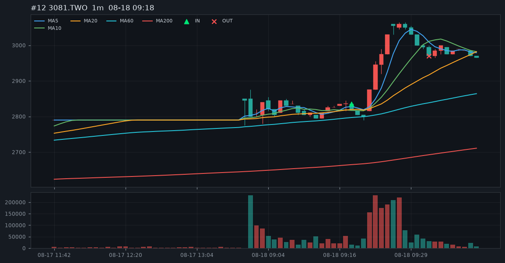

### #13 8996.TW 高力　08-18 09:25　-2.18%

進場 `1240.00`　出場 `1215.00`　lost_align

5/10/20/60 `1235.00` / `1233.00` / `1232.00` / `1225.08`　MA200 `1225.53`

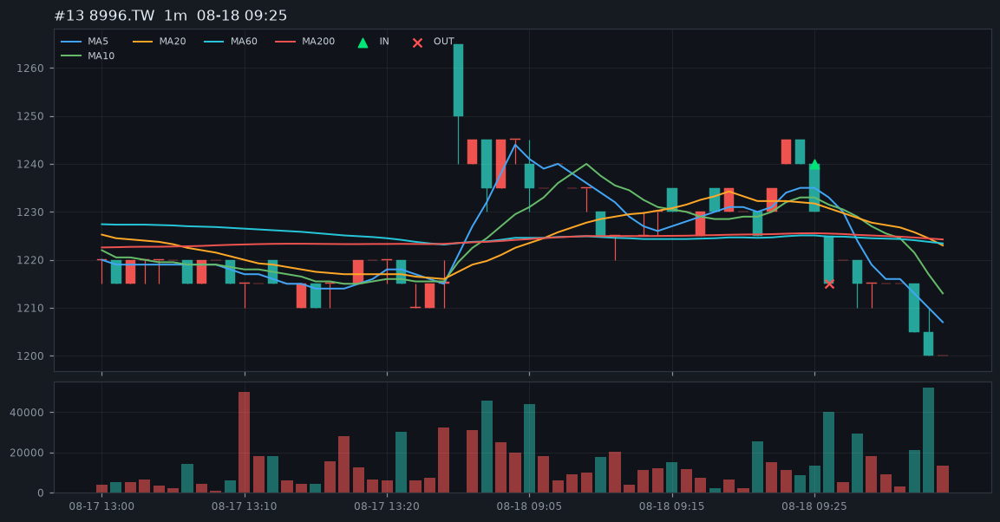

### #14 2481.TW 強茂　08-19 09:11　-1.86%

進場 `147.00`　出場 `144.50`　lost_align

5/10/20/60 `144.60` / `141.80` / `140.72` / `140.53`　MA200 `141.49`

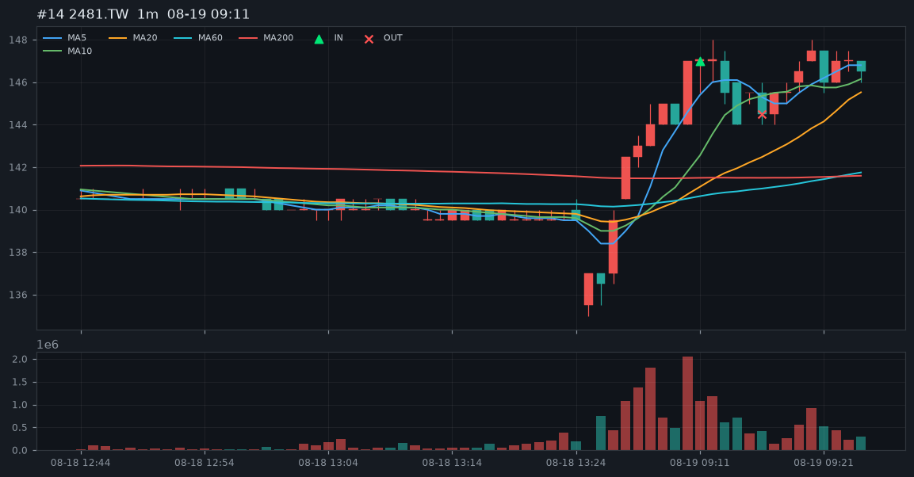

### #15 6223.TWO 旺矽　08-19 09:11　+1.80%

進場 `5345.00`　出場 `5450.00`　lost_align

5/10/20/60 `5326.00` / `5235.00` / `5234.50` / `5229.33`　MA200 `5278.82`

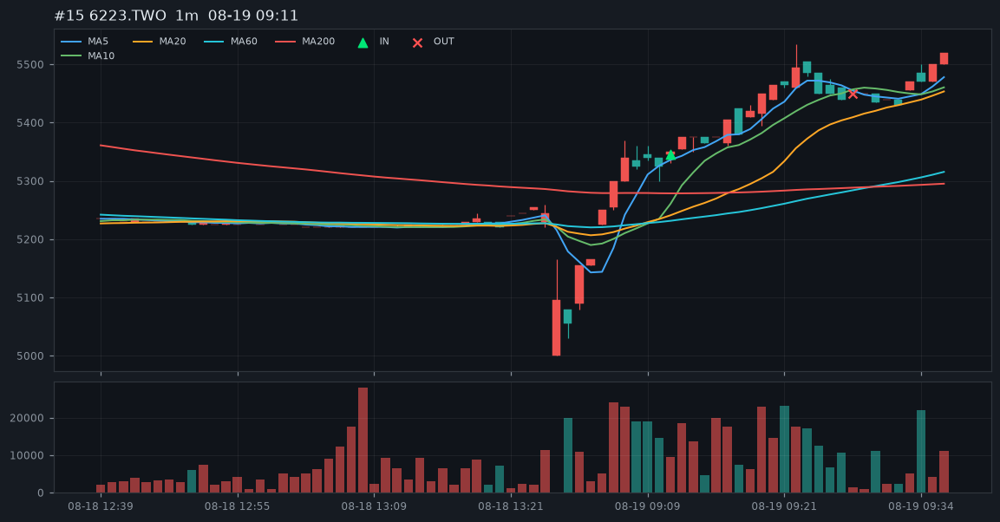

### #16 8261.TW 富鼎　08-19 09:11　-0.41%

進場 `199.00`　出場 `198.50`　lost_align

5/10/20/60 `195.30` / `189.95` / `188.38` / `188.23`　MA200 `189.83`

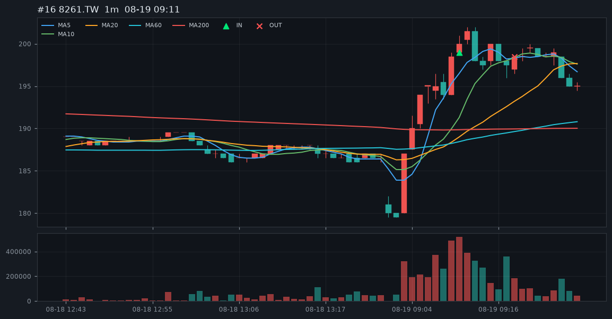

### #17 2324.TW 仁寶　08-20 09:11　-0.54%

進場 `39.85`　出場 `39.70`　lost_align

5/10/20/60 `39.36` / `39.34` / `39.33` / `39.22`　MA200 `38.76`

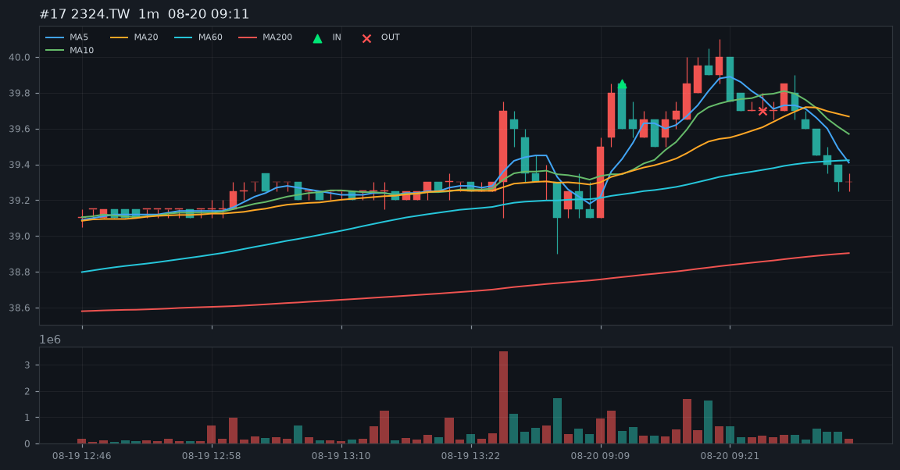

### #18 2634.TW 漢翔　08-20 09:11　-0.02%

進場 `70.30`　出場 `70.40`　lost_align

5/10/20/60 `70.48` / `70.47` / `69.75` / `69.29`　MA200 `69.61`

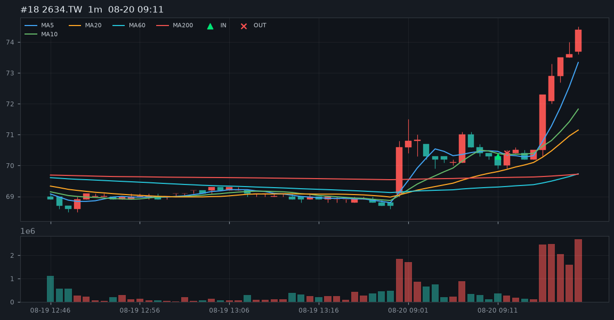

### #19 2357.TW 華碩　08-20 09:12　-0.16%

進場 `924.00`　出場 `924.00`　lost_align

5/10/20/60 `925.00` / `924.70` / `921.75` / `918.47`　MA200 `913.30`

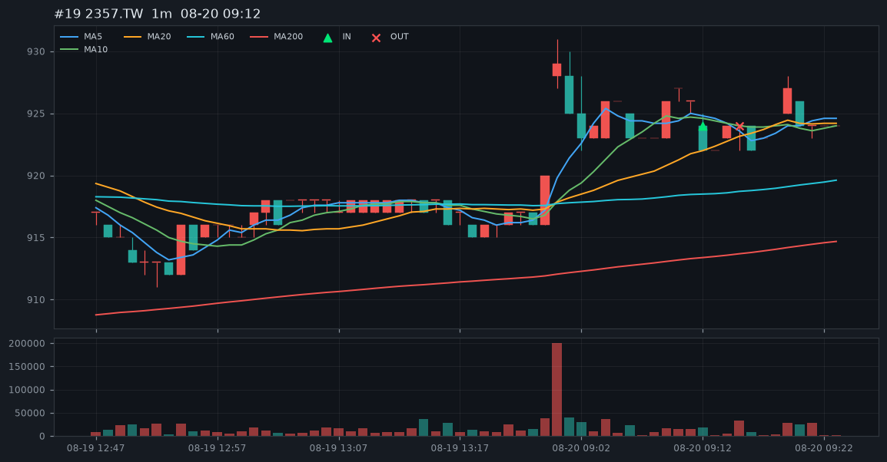

### #20 4971.TWO IET-KY　08-20 10:07　+6.29%

進場 `543.00`　出場 `578.00`　lost_align

5/10/20/60 `531.60` / `528.30` / `525.15` / `519.38`　MA200 `529.54`

### #21 2486.TW 一詮　08-20 12:05　+5.22%

進場 `232.50`　出場 `245.00`　lost_align

5/10/20/60 `231.40` / `230.35` / `230.30` / `229.91`　MA200 `231.90`

### #22 2426.TW 鼎元　08-21 09:11　-0.28%

進場 `82.20`　出場 `82.10`　lost_align

5/10/20/60 `82.14` / `82.10` / `78.81` / `76.14`　MA200 `75.20`

### #23 2603.TW 長榮　08-21 09:13　-1.74%

進場 `252.50`　出場 `248.50`　lost_align

5/10/20/60 `251.40` / `251.25` / `249.22` / `246.55`　MA200 `244.59`

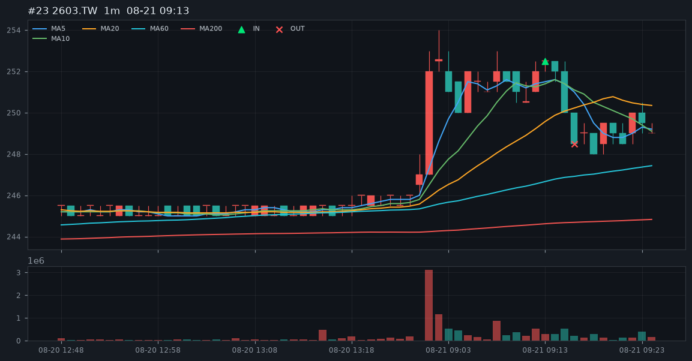

### #24 3006.TW 晶豪科　08-21 09:13　+0.44%

進場 `249.50`　出場 `251.00`　lost_align

5/10/20/60 `248.60` / `248.25` / `248.20` / `247.57`　MA200 `246.75`

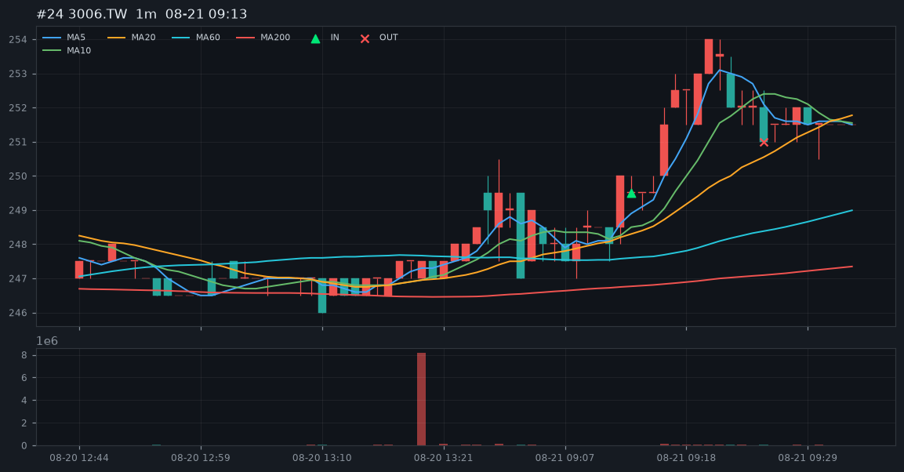

## 全部成交

| # | 日期 | 代號 | 名稱 | 進場 | 出場 | 淨% | 原因 |
| ---: | --- | --- | --- | ---: | ---: | ---: | --- |
| 1 | 2026-08-17 | 2027.TW | 大成鋼 | 49.05 | 50.80 | +3.41% | lost_align |
| 2 | 2026-08-17 | 3081.TWO | 聯亞 | 2635.00 | 2650.00 | +0.41% | lost_align |
| 3 | 2026-08-17 | 6182.TWO | 合晶 | 112.50 | 111.50 | -1.05% | lost_align |
| 4 | 2026-08-17 | 2359.TW | 所羅門 | 174.50 | 175.00 | +0.13% | lost_align |
| 5 | 2026-08-17 | 2615.TW | 萬海 | 93.80 | 95.30 | +1.44% | lost_align |
| 6 | 2026-08-17 | 3406.TW | 玉晶光 | 660.00 | 642.00 | -2.89% | lost_align |
| 7 | 2026-08-17 | 2609.TW | 陽明 | 52.50 | 54.00 | +2.70% | lost_align |
| 8 | 2026-08-17 | 3105.TWO | 穩懋 | 394.50 | 395.50 | +0.09% | lost_align |
| 9 | 2026-08-17 | 6446.TW | 藥華藥 | 1515.00 | 1520.00 | +0.17% | lost_align |
| 10 | 2026-08-17 | 4958.TW | 臻鼎-KY | 511.00 | 506.00 | -1.14% | lost_align |
| 11 | 2026-08-17 | 5483.TWO | 中美晶 | 188.50 | 187.50 | -0.69% | lost_align |
| 12 | 2026-08-17 | 1301.TW | 台塑 | 60.90 | 60.80 | -0.32% | lost_align |
| 13 | 2026-08-17 | 1303.TW | 南亞 | 209.00 | 208.00 | -0.64% | lost_align |
| 14 | 2026-08-17 | 2486.TW | 一詮 | 237.00 | 237.00 | -0.16% | lost_align |
| 15 | 2026-08-17 | 3045.TW | 台灣大 | 109.00 | 109.00 | -0.16% | lost_align |
| 16 | 2026-08-17 | 6187.TWO | 萬潤 | 1310.00 | 1315.00 | +0.22% | lost_align |
| 17 | 2026-08-17 | 2409.TW | 友達 | 26.55 | 26.60 | +0.03% | lost_align |
| 18 | 2026-08-17 | 6669.TW | 緯穎 | 6615.00 | 6700.00 | +1.12% | lost_align |
| 19 | 2026-08-17 | 2382.TW | 廣達 | 333.00 | 334.50 | +0.29% | lost_align |
| 20 | 2026-08-17 | 2383.TW | 台光電 | 6190.00 | 6180.00 | -0.32% | lost_align |
| 21 | 2026-08-17 | 3711.TW | 日月光投控 | 635.00 | 631.00 | -0.79% | lost_align |
| 22 | 2026-08-17 | 8046.TW | 南電 | 1340.00 | 1335.00 | -0.53% | lost_align |
| 23 | 2026-08-17 | 2344.TW | 華邦電 | 186.50 | 185.00 | -0.96% | lost_align |
| 24 | 2026-08-17 | 2408.TW | 南亞科 | 531.00 | 526.00 | -1.10% | lost_align |
| 25 | 2026-08-17 | 2449.TW | 京元電子 | 252.00 | 251.50 | -0.36% | lost_align |
| 26 | 2026-08-17 | 3042.TW | 晶技 | 188.50 | 186.00 | -1.49% | lost_align |
| 27 | 2026-08-17 | 3363.TWO | 上詮 | 594.00 | 591.00 | -0.67% | lost_align |
| 28 | 2026-08-17 | 2308.TW | 台達電 | 1945.00 | 1930.00 | -0.93% | lost_align |
| 29 | 2026-08-17 | 3008.TW | 大立光 | 5065.00 | 5040.00 | -0.65% | lost_align |
| 30 | 2026-08-17 | 2303.TW | 聯電 | 123.00 | 122.00 | -0.97% | lost_align |
| 31 | 2026-08-17 | 2455.TW | 全新 | 417.00 | 417.00 | -0.16% | session_flat |
| 32 | 2026-08-17 | 6488.TWO | 環球晶 | 1025.00 | 1020.00 | -0.65% | lost_align |
| 33 | 2026-08-17 | 2618.TW | 長榮航 | 41.00 | 41.00 | -0.16% | lost_align |
| 34 | 2026-08-17 | 6442.TW | 光聖 | 1585.00 | 1585.00 | -0.16% | lost_align |
| 35 | 2026-08-17 | 8150.TW | 南茂 | 93.20 | 93.00 | -0.37% | lost_align |
| 36 | 2026-08-17 | 3037.TW | 欣興 | 1105.00 | 1115.00 | +0.74% | lost_align |
| 37 | 2026-08-17 | 2603.TW | 長榮 | 228.50 | 230.00 | +0.50% | lost_align |
| 38 | 2026-08-17 | 3532.TW | 台勝科 | 356.00 | 353.00 | -1.00% | lost_align |
| 39 | 2026-08-17 | 3443.TW | 創意 | 5570.00 | 5860.00 | +5.05% | lost_align |
| 40 | 2026-08-17 | 3189.TW | 景碩 | 902.00 | 909.00 | +0.62% | lost_align |
| 41 | 2026-08-17 | 6805.TW | 富世達 | 1855.00 | 1920.00 | +3.34% | lost_align |
| 42 | 2026-08-17 | 6147.TWO | 頎邦 | 169.50 | 168.50 | -0.75% | lost_align |
| 43 | 2026-08-17 | 6214.TW | 精誠 | 174.00 | 174.00 | -0.16% | lost_align |
| 44 | 2026-08-17 | 2360.TW | 致茂 | 2340.00 | 2350.00 | +0.27% | lost_align |
| 45 | 2026-08-17 | 2634.TW | 漢翔 | 70.20 | 70.00 | -0.44% | lost_align |
| 46 | 2026-08-17 | 6173.TWO | 信昌電 | 211.00 | 218.00 | +3.16% | lost_align |
| 47 | 2026-08-17 | 7769.TW | 鴻勁 | 6745.00 | 6710.00 | -0.68% | lost_align |
| 48 | 2026-08-17 | 2481.TW | 強茂 | 137.50 | 137.50 | -0.16% | lost_align |
| 49 | 2026-08-17 | 6239.TW | 力成 | 278.50 | 278.50 | -0.16% | lost_align |
| 50 | 2026-08-17 | 8299.TWO | 群聯 | 2100.00 | 2100.00 | -0.16% | lost_align |
| 51 | 2026-08-17 | 5289.TWO | 宜鼎 | 1515.00 | 1505.00 | -0.82% | lost_align |
| 52 | 2026-08-17 | 3017.TW | 奇鋐 | 3215.00 | 3205.00 | -0.47% | lost_align |
| 53 | 2026-08-17 | 3481.TW | 群創 | 50.40 | 50.20 | -0.56% | lost_align |
| 54 | 2026-08-17 | 3533.TW | 嘉澤 | 1715.00 | 1705.00 | -0.74% | lost_align |
| 55 | 2026-08-17 | 2313.TW | 華通 | 214.50 | 214.00 | -0.39% | lost_align |
| 56 | 2026-08-17 | 2345.TW | 智邦 | 2315.00 | 2295.00 | -1.02% | lost_align |
| 57 | 2026-08-17 | 2301.TW | 光寶科 | 269.50 | 269.50 | -0.16% | lost_align |
| 58 | 2026-08-17 | 2327.TW | 國巨* | 617.00 | 616.00 | -0.32% | lost_align |
| 59 | 2026-08-17 | 2368.TW | 金像電 | 1015.00 | 1020.00 | +0.33% | lost_align |
| 60 | 2026-08-17 | 3260.TWO | 威剛 | 402.50 | 402.00 | -0.28% | lost_align |
| 61 | 2026-08-17 | 2049.TW | 上銀 | 383.00 | 383.50 | -0.03% | lost_align |
| 62 | 2026-08-17 | 2464.TW | 盟立 | 194.00 | 193.50 | -0.42% | lost_align |
| 63 | 2026-08-17 | 2330.TW | 台積電 | 2405.00 | 2405.00 | -0.16% | lost_align |
| 64 | 2026-08-17 | 2395.TW | 研華 | 672.00 | 671.00 | -0.31% | lost_align |
| 65 | 2026-08-17 | 2884.TW | 玉山金 | 37.45 | 37.35 | -0.43% | lost_align |
| 66 | 2026-08-17 | 2890.TW | 永豐金 | 39.70 | 39.95 | +0.47% | lost_align |
| 67 | 2026-08-17 | 2886.TW | 兆豐金 | 46.20 | 46.20 | -0.16% | lost_align |
| 68 | 2026-08-17 | 2887.TW | 台新新光金 | 37.55 | 37.50 | -0.29% | lost_align |
| 69 | 2026-08-17 | 2379.TW | 瑞昱 | 718.00 | 718.00 | -0.16% | lost_align |
| 70 | 2026-08-17 | 6770.TW | 力積電 | 75.30 | 75.20 | -0.29% | lost_align |
| 71 | 2026-08-17 | 8996.TW | 高力 | 1230.00 | 1230.00 | -0.16% | lost_align |
| 72 | 2026-08-17 | 6510.TWO | 精測 | 2925.00 | 2920.00 | -0.33% | lost_align |
| 73 | 2026-08-17 | 8033.TW | 雷虎 | 194.00 | 193.00 | -0.68% | lost_align |
| 74 | 2026-08-17 | 2882.TW | 國泰金 | 98.20 | 98.50 | +0.15% | lost_align |
| 75 | 2026-08-17 | 3231.TW | 緯創 | 187.00 | 186.50 | -0.43% | lost_align |
| 76 | 2026-08-17 | 2356.TW | 英業達 | 66.60 | 66.60 | -0.16% | lost_align |
| 77 | 2026-08-17 | 2881.TW | 富邦金 | 125.00 | 125.00 | -0.16% | lost_align |
| 78 | 2026-08-17 | 6515.TW | 穎崴 | 6680.00 | 6625.00 | -0.98% | lost_align |
| 79 | 2026-08-17 | 2357.TW | 華碩 | 942.00 | 942.00 | -0.16% | lost_align |
| 80 | 2026-08-17 | 3665.TW | 貿聯-KY | 2140.00 | 2135.00 | -0.39% | lost_align |
| 81 | 2026-08-17 | 2454.TW | 聯發科 | 4065.00 | 4065.00 | -0.16% | lost_align |
| 82 | 2026-08-17 | 5371.TWO | 中光電 | 88.00 | 87.80 | -0.39% | lost_align |
| 83 | 2026-08-17 | 2492.TW | 華新科 | 293.50 | 293.00 | -0.33% | lost_align |
| 84 | 2026-08-17 | 2324.TW | 仁寶 | 41.70 | 41.70 | -0.16% | lost_align |
| 85 | 2026-08-17 | 2377.TW | 微星 | 151.00 | 150.50 | -0.49% | lost_align |
| 86 | 2026-08-17 | 4938.TW | 和碩 | 90.30 | 90.20 | -0.27% | lost_align |
| 87 | 2026-08-18 | 5536.TWO | 聖暉* | 914.00 | 907.00 | -0.93% | lost_align |
| 88 | 2026-08-18 | 2359.TW | 所羅門 | 179.00 | 178.00 | -0.72% | lost_align |
| 89 | 2026-08-18 | 3529.TWO | 力旺 | 2465.00 | 2455.00 | -0.57% | lost_align |
| 90 | 2026-08-18 | 8358.TWO | 金居 | 432.50 | 431.00 | -0.51% | lost_align |
| 91 | 2026-08-18 | 1815.TWO | 富喬 | 102.00 | 101.50 | -0.65% | lost_align |
| 92 | 2026-08-18 | 2368.TW | 金像電 | 1030.00 | 1085.00 | +5.18% | lost_align |
| 93 | 2026-08-18 | 2345.TW | 智邦 | 2330.00 | 2330.00 | -0.16% | lost_align |
| 94 | 2026-08-18 | 2408.TW | 南亞科 | 544.00 | 544.00 | -0.16% | lost_align |
| 95 | 2026-08-18 | 5351.TWO | 鈺創 | 138.50 | 137.00 | -1.24% | lost_align |
| 96 | 2026-08-18 | 8039.TW | 台虹 | 272.50 | 283.50 | +3.88% | lost_align |
| 97 | 2026-08-18 | 3037.TW | 欣興 | 1140.00 | 1170.00 | +2.47% | lost_align |
| 98 | 2026-08-18 | 3105.TWO | 穩懋 | 401.00 | 395.50 | -1.53% | lost_align |
| 99 | 2026-08-18 | 3450.TW | 聯鈞 | 573.00 | 562.00 | -2.08% | lost_align |
| 100 | 2026-08-18 | 3665.TW | 貿聯-KY | 2165.00 | 2265.00 | +4.46% | lost_align |
| 101 | 2026-08-18 | 6505.TW | 台塑化 | 75.00 | 74.80 | -0.43% | lost_align |
| 102 | 2026-08-18 | 7750.TW | 新代 | 2475.00 | 2465.00 | -0.56% | lost_align |
| 103 | 2026-08-18 | 8021.TW | 尖點 | 438.50 | 428.00 | -2.55% | lost_align |
| 104 | 2026-08-18 | 3081.TWO | 聯亞 | 2835.00 | 2970.00 | +4.60% | lost_align |
| 105 | 2026-08-18 | 6182.TWO | 合晶 | 125.50 | 126.50 | +0.64% | lost_align |
| 106 | 2026-08-18 | 3008.TW | 大立光 | 5200.00 | 5215.00 | +0.13% | lost_align |
| 107 | 2026-08-18 | 5483.TWO | 中美晶 | 190.50 | 192.50 | +0.89% | lost_align |
| 108 | 2026-08-18 | 6274.TWO | 台燿 | 1610.00 | 1595.00 | -1.09% | lost_align |
| 109 | 2026-08-18 | 2059.TW | 川湖 | 14475.00 | 14795.00 | +2.05% | lost_align |
| 110 | 2026-08-18 | 3532.TW | 台勝科 | 385.50 | 396.00 | +2.56% | lost_align |
| 111 | 2026-08-18 | 2486.TW | 一詮 | 243.50 | 245.50 | +0.66% | lost_align |
| 112 | 2026-08-18 | 3653.TW | 健策 | 5455.00 | 5355.00 | -1.99% | lost_align |
| 113 | 2026-08-18 | 7769.TW | 鴻勁 | 6725.00 | 6705.00 | -0.46% | lost_align |
| 114 | 2026-08-18 | 2303.TW | 聯電 | 123.00 | 122.50 | -0.57% | lost_align |
| 115 | 2026-08-18 | 6442.TW | 光聖 | 1670.00 | 1660.00 | -0.76% | lost_align |
| 116 | 2026-08-18 | 8046.TW | 南電 | 1345.00 | 1330.00 | -1.28% | lost_align |
| 117 | 2026-08-18 | 8996.TW | 高力 | 1240.00 | 1215.00 | -2.18% | lost_align |
| 118 | 2026-08-18 | 2360.TW | 致茂 | 2380.00 | 2375.00 | -0.37% | lost_align |
| 119 | 2026-08-18 | 2455.TW | 全新 | 425.00 | 427.00 | +0.31% | lost_align |
| 120 | 2026-08-18 | 3189.TW | 景碩 | 925.00 | 909.00 | -1.89% | lost_align |
| 121 | 2026-08-18 | 3406.TW | 玉晶光 | 678.00 | 675.00 | -0.60% | lost_align |
| 122 | 2026-08-18 | 2344.TW | 華邦電 | 189.00 | 187.50 | -0.95% | lost_align |
| 123 | 2026-08-18 | 2603.TW | 長榮 | 241.50 | 241.00 | -0.37% | lost_align |
| 124 | 2026-08-18 | 2609.TW | 陽明 | 56.90 | 56.50 | -0.86% | lost_align |
| 125 | 2026-08-18 | 2615.TW | 萬海 | 106.00 | 105.00 | -1.10% | lost_align |
| 126 | 2026-08-18 | 3455.TWO | 由田 | 262.50 | 260.50 | -0.92% | lost_align |
| 127 | 2026-08-18 | 3374.TWO | 精材 | 316.50 | 315.50 | -0.48% | lost_align |
| 128 | 2026-08-18 | 4971.TWO | IET-KY | 580.00 | 571.00 | -1.71% | lost_align |
| 129 | 2026-08-18 | 2634.TW | 漢翔 | 74.50 | 74.70 | +0.11% | lost_align |
| 130 | 2026-08-18 | 2881.TW | 富邦金 | 125.50 | 125.50 | -0.16% | lost_align |
| 131 | 2026-08-18 | 2313.TW | 華通 | 213.00 | 211.50 | -0.86% | lost_align |
| 132 | 2026-08-18 | 2395.TW | 研華 | 674.00 | 670.00 | -0.75% | lost_align |
| 133 | 2026-08-18 | 6488.TWO | 環球晶 | 1105.00 | 1105.00 | -0.16% | lost_align |
| 134 | 2026-08-18 | 2492.TW | 華新科 | 299.50 | 294.00 | -2.00% | lost_align |
| 135 | 2026-08-18 | 5425.TWO | 台半 | 92.40 | 92.90 | +0.38% | lost_align |
| 136 | 2026-08-18 | 6672.TW | 騰輝電子-KY | 283.50 | 292.00 | +2.84% | lost_align |
| 137 | 2026-08-18 | 1303.TW | 南亞 | 203.00 | 201.50 | -0.90% | lost_align |
| 138 | 2026-08-18 | 6805.TW | 富世達 | 1945.00 | 1925.00 | -1.19% | lost_align |
| 139 | 2026-08-18 | 2301.TW | 光寶科 | 272.50 | 276.00 | +1.12% | lost_align |
| 140 | 2026-08-18 | 6531.TW | 愛普* | 890.00 | 918.00 | +2.99% | lost_align |
| 141 | 2026-08-18 | 2481.TW | 強茂 | 145.00 | 143.50 | -1.19% | lost_align |
| 142 | 2026-08-18 | 3443.TW | 創意 | 5860.00 | 5840.00 | -0.50% | lost_align |
| 143 | 2026-08-18 | 2383.TW | 台光電 | 6375.00 | 6360.00 | -0.40% | lost_align |
| 144 | 2026-08-18 | 6147.TWO | 頎邦 | 167.50 | 167.00 | -0.46% | lost_align |
| 145 | 2026-08-18 | 2887.TW | 台新新光金 | 37.20 | 37.15 | -0.29% | lost_align |
| 146 | 2026-08-18 | 3481.TW | 群創 | 50.10 | 50.00 | -0.36% | lost_align |
| 147 | 2026-08-18 | 6446.TW | 藥華藥 | 1405.00 | 1400.00 | -0.52% | lost_align |
| 148 | 2026-08-18 | 2377.TW | 微星 | 147.50 | 149.00 | +0.86% | lost_align |
| 149 | 2026-08-18 | 2357.TW | 華碩 | 914.00 | 913.00 | -0.27% | lost_align |
| 150 | 2026-08-18 | 2330.TW | 台積電 | 2385.00 | 2380.00 | -0.37% | lost_align |
| 151 | 2026-08-18 | 3167.TW | 大量 | 770.00 | 770.00 | -0.16% | session_flat |
| 152 | 2026-08-18 | 2308.TW | 台達電 | 1835.00 | 1830.00 | -0.43% | lost_align |
| 153 | 2026-08-18 | 2409.TW | 友達 | 26.55 | 26.45 | -0.54% | lost_align |
| 154 | 2026-08-18 | 2382.TW | 廣達 | 326.00 | 325.50 | -0.31% | lost_align |
| 155 | 2026-08-18 | 3042.TW | 晶技 | 180.00 | 179.00 | -0.72% | lost_align |
| 156 | 2026-08-18 | 3231.TW | 緯創 | 181.50 | 181.00 | -0.44% | lost_align |
| 157 | 2026-08-19 | 2481.TW | 強茂 | 147.00 | 144.50 | -1.86% | lost_align |
| 158 | 2026-08-19 | 6223.TWO | 旺矽 | 5345.00 | 5450.00 | +1.80% | lost_align |
| 159 | 2026-08-19 | 8261.TW | 富鼎 | 199.00 | 198.50 | -0.41% | lost_align |
| 160 | 2026-08-19 | 3034.TW | 聯詠 | 509.00 | 503.00 | -1.34% | lost_align |
| 161 | 2026-08-19 | 3042.TW | 晶技 | 181.00 | 182.00 | +0.39% | lost_align |
| 162 | 2026-08-19 | 5425.TWO | 台半 | 96.30 | 96.80 | +0.36% | lost_align |
| 163 | 2026-08-19 | 2395.TW | 研華 | 688.00 | 686.00 | -0.45% | lost_align |
| 164 | 2026-08-19 | 3653.TW | 健策 | 5280.00 | 5440.00 | +2.87% | lost_align |
| 165 | 2026-08-19 | 2379.TW | 瑞昱 | 718.00 | 717.00 | -0.30% | lost_align |
| 166 | 2026-08-19 | 2492.TW | 華新科 | 292.50 | 297.50 | +1.55% | lost_align |
| 167 | 2026-08-19 | 2486.TW | 一詮 | 242.50 | 241.50 | -0.57% | lost_align |
| 168 | 2026-08-19 | 3045.TW | 台灣大 | 112.50 | 112.50 | -0.16% | lost_align |
| 169 | 2026-08-19 | 3189.TW | 景碩 | 892.00 | 885.00 | -0.94% | lost_align |
| 170 | 2026-08-19 | 8039.TW | 台虹 | 282.50 | 281.00 | -0.69% | lost_align |
| 171 | 2026-08-19 | 3017.TW | 奇鋐 | 3040.00 | 3065.00 | +0.66% | lost_align |
| 172 | 2026-08-19 | 1815.TWO | 富喬 | 97.80 | 97.60 | -0.36% | lost_align |
| 173 | 2026-08-19 | 2327.TW | 國巨* | 587.00 | 581.00 | -1.18% | lost_align |
| 174 | 2026-08-19 | 2464.TW | 盟立 | 185.00 | 184.00 | -0.70% | lost_align |
| 175 | 2026-08-19 | 6446.TW | 藥華藥 | 1395.00 | 1395.00 | -0.16% | lost_align |
| 176 | 2026-08-19 | 5351.TWO | 鈺創 | 127.00 | 125.00 | -1.73% | lost_align |
| 177 | 2026-08-19 | 6451.TW | 訊芯-KY | 445.00 | 444.50 | -0.27% | lost_align |
| 178 | 2026-08-19 | 3044.TW | 健鼎 | 496.00 | 495.50 | -0.26% | lost_align |
| 179 | 2026-08-19 | 6274.TWO | 台燿 | 1545.00 | 1560.00 | +0.81% | lost_align |
| 180 | 2026-08-19 | 2449.TW | 京元電子 | 237.00 | 236.00 | -0.58% | lost_align |
| 181 | 2026-08-19 | 6187.TWO | 萬潤 | 1315.00 | 1310.00 | -0.54% | lost_align |
| 182 | 2026-08-19 | 7769.TW | 鴻勁 | 6625.00 | 6625.00 | -0.16% | lost_align |
| 183 | 2026-08-19 | 6669.TW | 緯穎 | 6390.00 | 6345.00 | -0.86% | lost_align |
| 184 | 2026-08-19 | 6239.TW | 力成 | 266.50 | 266.00 | -0.35% | lost_align |
| 185 | 2026-08-19 | 3450.TW | 聯鈞 | 587.00 | 586.00 | -0.33% | lost_align |
| 186 | 2026-08-19 | 2609.TW | 陽明 | 57.10 | 57.00 | -0.34% | lost_align |
| 187 | 2026-08-19 | 3008.TW | 大立光 | 5315.00 | 5310.00 | -0.25% | lost_align |
| 188 | 2026-08-19 | 6515.TW | 穎崴 | 6435.00 | 6380.00 | -1.01% | lost_align |
| 189 | 2026-08-19 | 2049.TW | 上銀 | 371.50 | 373.50 | +0.38% | lost_align |
| 190 | 2026-08-19 | 2605.TW | 新興 | 36.25 | 36.10 | -0.57% | lost_align |
| 191 | 2026-08-19 | 3406.TW | 玉晶光 | 697.00 | 693.00 | -0.73% | lost_align |
| 192 | 2026-08-19 | 4971.TWO | IET-KY | 571.00 | 564.00 | -1.39% | lost_align |
| 193 | 2026-08-19 | 3090.TW | 日電貿 | 171.00 | 176.50 | +3.06% | lost_align |
| 194 | 2026-08-19 | 2368.TW | 金像電 | 1085.00 | 1080.00 | -0.62% | lost_align |
| 195 | 2026-08-19 | 2603.TW | 長榮 | 236.50 | 236.00 | -0.37% | lost_align |
| 196 | 2026-08-19 | 2382.TW | 廣達 | 324.50 | 324.00 | -0.31% | lost_align |
| 197 | 2026-08-19 | 6672.TW | 騰輝電子-KY | 287.50 | 285.50 | -0.86% | lost_align |
| 198 | 2026-08-19 | 2884.TW | 玉山金 | 38.15 | 38.15 | -0.16% | lost_align |
| 199 | 2026-08-19 | 2615.TW | 萬海 | 103.00 | 103.00 | -0.16% | lost_align |
| 200 | 2026-08-19 | 5289.TWO | 宜鼎 | 1465.00 | 1470.00 | +0.18% | lost_align |
| 201 | 2026-08-19 | 2301.TW | 光寶科 | 273.00 | 279.00 | +2.04% | lost_align |
| 202 | 2026-08-19 | 2357.TW | 華碩 | 906.00 | 905.00 | -0.27% | lost_align |
| 203 | 2026-08-19 | 3231.TW | 緯創 | 179.50 | 179.00 | -0.44% | lost_align |
| 204 | 2026-08-19 | 2376.TW | 技嘉 | 347.50 | 347.50 | -0.16% | lost_align |
| 205 | 2026-08-19 | 6442.TW | 光聖 | 1555.00 | 1555.00 | -0.16% | lost_align |
| 206 | 2026-08-19 | 2409.TW | 友達 | 26.25 | 26.20 | -0.35% | lost_align |
| 207 | 2026-08-19 | 2317.TW | 鴻海 | 246.50 | 246.50 | -0.16% | lost_align |
| 208 | 2026-08-19 | 3260.TWO | 威剛 | 386.00 | 390.00 | +0.88% | lost_align |
| 209 | 2026-08-19 | 3374.TWO | 精材 | 302.50 | 302.50 | -0.16% | lost_align |
| 210 | 2026-08-19 | 5347.TWO | 世界 | 150.50 | 150.50 | -0.16% | lost_align |
| 211 | 2026-08-19 | 2337.TW | 旺宏 | 119.00 | 119.00 | -0.16% | lost_align |
| 212 | 2026-08-19 | 2330.TW | 台積電 | 2350.00 | 2350.00 | -0.16% | lost_align |
| 213 | 2026-08-19 | 3037.TW | 欣興 | 1120.00 | 1120.00 | -0.16% | lost_align |
| 214 | 2026-08-19 | 8358.TWO | 金居 | 411.50 | 410.50 | -0.40% | lost_align |
| 215 | 2026-08-19 | 6147.TWO | 頎邦 | 161.50 | 162.50 | +0.46% | lost_align |
| 216 | 2026-08-19 | 8299.TWO | 群聯 | 1965.00 | 1955.00 | -0.67% | lost_align |
| 217 | 2026-08-19 | 3006.TW | 晶豪科 | 243.00 | 242.50 | -0.37% | lost_align |
| 218 | 2026-08-19 | 3105.TWO | 穩懋 | 366.50 | 366.00 | -0.30% | lost_align |
| 219 | 2026-08-19 | 2313.TW | 華通 | 207.00 | 208.00 | +0.32% | lost_align |
| 220 | 2026-08-19 | 3481.TW | 群創 | 47.70 | 47.55 | -0.47% | lost_align |
| 221 | 2026-08-19 | 2303.TW | 聯電 | 116.00 | 116.00 | -0.16% | lost_align |
| 222 | 2026-08-19 | 2454.TW | 聯發科 | 3860.00 | 3855.00 | -0.29% | lost_align |
| 223 | 2026-08-19 | 3711.TW | 日月光投控 | 590.00 | 589.00 | -0.33% | lost_align |
| 224 | 2026-08-19 | 3533.TW | 嘉澤 | 1610.00 | 1610.00 | -0.16% | lost_align |
| 225 | 2026-08-19 | 8996.TW | 高力 | 1150.00 | 1140.00 | -1.03% | lost_align |
| 226 | 2026-08-19 | 2324.TW | 仁寶 | 38.80 | 39.10 | +0.61% | lost_align |
| 227 | 2026-08-19 | 3665.TW | 貿聯-KY | 2155.00 | 2170.00 | +0.54% | lost_align |
| 228 | 2026-08-19 | 2885.TW | 元大金 | 62.90 | 62.60 | -0.64% | lost_align |
| 229 | 2026-08-19 | 2887.TW | 台新新光金 | 36.55 | 36.55 | -0.16% | lost_align |
| 230 | 2026-08-19 | 3532.TW | 台勝科 | 352.00 | 349.50 | -0.87% | lost_align |
| 231 | 2026-08-19 | 2891.TW | 中信金 | 65.00 | 65.00 | -0.16% | lost_align |
| 232 | 2026-08-19 | 2360.TW | 致茂 | 2130.00 | 2130.00 | -0.16% | lost_align |
| 233 | 2026-08-19 | 5483.TWO | 中美晶 | 177.50 | 176.50 | -0.72% | lost_align |
| 234 | 2026-08-19 | 4958.TW | 臻鼎-KY | 462.00 | 459.50 | -0.70% | lost_align |
| 235 | 2026-08-19 | 2344.TW | 華邦電 | 168.00 | 168.00 | -0.16% | lost_align |
| 236 | 2026-08-20 | 2324.TW | 仁寶 | 39.85 | 39.70 | -0.54% | lost_align |
| 237 | 2026-08-20 | 2634.TW | 漢翔 | 70.30 | 70.40 | -0.02% | lost_align |
| 238 | 2026-08-20 | 2357.TW | 華碩 | 924.00 | 924.00 | -0.16% | lost_align |
| 239 | 2026-08-20 | 3231.TW | 緯創 | 182.00 | 181.00 | -0.71% | lost_align |
| 240 | 2026-08-20 | 2049.TW | 上銀 | 384.00 | 391.00 | +1.66% | lost_align |
| 241 | 2026-08-20 | 3362.TWO | 先進光 | 189.50 | 188.00 | -0.95% | lost_align |
| 242 | 2026-08-20 | 2313.TW | 華通 | 221.50 | 218.50 | -1.51% | lost_align |
| 243 | 2026-08-20 | 2317.TW | 鴻海 | 247.50 | 246.50 | -0.56% | lost_align |
| 244 | 2026-08-20 | 3661.TW | 世芯-KY | 3790.00 | 3755.00 | -1.08% | lost_align |
| 245 | 2026-08-20 | 2464.TW | 盟立 | 186.00 | 184.00 | -1.24% | lost_align |
| 246 | 2026-08-20 | 8021.TW | 尖點 | 416.50 | 411.00 | -1.48% | lost_align |
| 247 | 2026-08-20 | 3443.TW | 創意 | 5450.00 | 5375.00 | -1.54% | lost_align |
| 248 | 2026-08-20 | 6239.TW | 力成 | 267.00 | 265.00 | -0.91% | lost_align |
| 249 | 2026-08-20 | 6669.TW | 緯穎 | 6430.00 | 6335.00 | -1.64% | lost_align |
| 250 | 2026-08-20 | 8358.TWO | 金居 | 422.00 | 420.00 | -0.63% | lost_align |
| 251 | 2026-08-20 | 2330.TW | 台積電 | 2365.00 | 2365.00 | -0.16% | lost_align |
| 252 | 2026-08-20 | 3665.TW | 貿聯-KY | 2225.00 | 2210.00 | -0.83% | lost_align |
| 253 | 2026-08-20 | 6531.TW | 愛普* | 884.00 | 879.00 | -0.73% | lost_align |
| 254 | 2026-08-20 | 2408.TW | 南亞科 | 520.00 | 520.00 | -0.16% | lost_align |
| 255 | 2026-08-20 | 3081.TWO | 聯亞 | 2745.00 | 2730.00 | -0.71% | lost_align |
| 256 | 2026-08-20 | 3045.TW | 台灣大 | 113.00 | 113.50 | +0.28% | lost_align |
| 257 | 2026-08-20 | 6274.TWO | 台燿 | 1540.00 | 1535.00 | -0.48% | lost_align |
| 258 | 2026-08-20 | 3105.TWO | 穩懋 | 369.50 | 366.50 | -0.97% | lost_align |
| 259 | 2026-08-20 | 6451.TW | 訊芯-KY | 430.50 | 423.50 | -1.79% | lost_align |
| 260 | 2026-08-20 | 3653.TW | 健策 | 5480.00 | 5485.00 | -0.07% | lost_align |
| 261 | 2026-08-20 | 2344.TW | 華邦電 | 178.00 | 177.50 | -0.44% | lost_align |
| 262 | 2026-08-20 | 2615.TW | 萬海 | 108.50 | 107.50 | -1.08% | lost_align |
| 263 | 2026-08-20 | 2609.TW | 陽明 | 59.40 | 59.30 | -0.33% | lost_align |
| 264 | 2026-08-20 | 3293.TWO | 鈊象 | 761.00 | 764.00 | +0.23% | lost_align |
| 265 | 2026-08-20 | 3167.TW | 大量 | 701.00 | 734.00 | +4.55% | lost_align |
| 266 | 2026-08-20 | 5483.TWO | 中美晶 | 181.00 | 180.00 | -0.71% | lost_align |
| 267 | 2026-08-20 | 3006.TW | 晶豪科 | 249.50 | 248.00 | -0.76% | lost_align |
| 268 | 2026-08-20 | 6442.TW | 光聖 | 1560.00 | 1570.00 | +0.48% | lost_align |
| 269 | 2026-08-20 | 2337.TW | 旺宏 | 122.00 | 121.50 | -0.57% | lost_align |
| 270 | 2026-08-20 | 6223.TWO | 旺矽 | 5375.00 | 5350.00 | -0.63% | lost_align |
| 271 | 2026-08-20 | 2455.TW | 全新 | 404.00 | 402.00 | -0.66% | lost_align |
| 272 | 2026-08-20 | 2603.TW | 長榮 | 246.00 | 244.50 | -0.77% | lost_align |
| 273 | 2026-08-20 | 3037.TW | 欣興 | 1130.00 | 1135.00 | +0.28% | lost_align |
| 274 | 2026-08-20 | 6187.TWO | 萬潤 | 1290.00 | 1285.00 | -0.55% | lost_align |
| 275 | 2026-08-20 | 2360.TW | 致茂 | 2165.00 | 2150.00 | -0.85% | lost_align |
| 276 | 2026-08-20 | 3008.TW | 大立光 | 5550.00 | 5620.00 | +1.10% | lost_align |
| 277 | 2026-08-20 | 3450.TW | 聯鈞 | 566.00 | 563.00 | -0.69% | lost_align |
| 278 | 2026-08-20 | 6173.TWO | 信昌電 | 217.00 | 216.00 | -0.62% | lost_align |
| 279 | 2026-08-20 | 4971.TWO | IET-KY | 543.00 | 578.00 | +6.29% | lost_align |
| 280 | 2026-08-20 | 6805.TW | 富世達 | 1815.00 | 1815.00 | -0.16% | lost_align |
| 281 | 2026-08-20 | 8046.TW | 南電 | 1200.00 | 1195.00 | -0.58% | lost_align |
| 282 | 2026-08-20 | 6488.TWO | 環球晶 | 989.00 | 981.00 | -0.97% | lost_align |
| 283 | 2026-08-20 | 3260.TWO | 威剛 | 397.50 | 397.00 | -0.29% | lost_align |
| 284 | 2026-08-20 | 3090.TW | 日電貿 | 177.00 | 175.50 | -1.01% | lost_align |
| 285 | 2026-08-20 | 2383.TW | 台光電 | 5890.00 | 5880.00 | -0.33% | lost_align |
| 286 | 2026-08-20 | 4958.TW | 臻鼎-KY | 458.00 | 455.50 | -0.71% | lost_align |
| 287 | 2026-08-20 | 3189.TW | 景碩 | 839.00 | 836.00 | -0.52% | lost_align |
| 288 | 2026-08-20 | 3042.TW | 晶技 | 183.00 | 182.00 | -0.71% | lost_align |
| 289 | 2026-08-20 | 2881.TW | 富邦金 | 128.00 | 127.50 | -0.55% | lost_align |
| 290 | 2026-08-20 | 3711.TW | 日月光投控 | 579.00 | 585.00 | +0.88% | lost_align |
| 291 | 2026-08-20 | 2308.TW | 台達電 | 1725.00 | 1740.00 | +0.71% | lost_align |
| 292 | 2026-08-20 | 2486.TW | 一詮 | 232.50 | 245.00 | +5.22% | lost_align |
| 293 | 2026-08-20 | 2359.TW | 所羅門 | 159.00 | 158.50 | -0.47% | lost_align |
| 294 | 2026-08-20 | 2368.TW | 金像電 | 1020.00 | 1015.00 | -0.65% | lost_align |
| 295 | 2026-08-20 | 5536.TWO | 聖暉* | 870.00 | 873.00 | +0.18% | lost_align |
| 296 | 2026-08-20 | 1815.TWO | 富喬 | 105.00 | 105.00 | -0.16% | lost_align |
| 297 | 2026-08-20 | 2345.TW | 智邦 | 2105.00 | 2100.00 | -0.40% | lost_align |
| 298 | 2026-08-20 | 2891.TW | 中信金 | 63.00 | 62.90 | -0.32% | lost_align |
| 299 | 2026-08-20 | 2303.TW | 聯電 | 114.00 | 114.50 | +0.28% | lost_align |
| 300 | 2026-08-20 | 2327.TW | 國巨* | 560.00 | 561.00 | +0.02% | lost_align |
| 301 | 2026-08-20 | 2377.TW | 微星 | 140.50 | 140.00 | -0.52% | lost_align |
| 302 | 2026-08-20 | 2409.TW | 友達 | 25.90 | 25.85 | -0.35% | lost_align |
| 303 | 2026-08-20 | 2449.TW | 京元電子 | 234.50 | 235.00 | +0.05% | lost_align |
| 304 | 2026-08-20 | 5289.TWO | 宜鼎 | 1510.00 | 1510.00 | -0.16% | lost_align |
| 305 | 2026-08-20 | 6147.TWO | 頎邦 | 161.50 | 163.50 | +1.08% | lost_align |
| 306 | 2026-08-20 | 6182.TWO | 合晶 | 109.00 | 109.00 | -0.16% | lost_align |
| 307 | 2026-08-20 | 8299.TWO | 群聯 | 1995.00 | 2000.00 | +0.09% | lost_align |
| 308 | 2026-08-20 | 3481.TW | 群創 | 46.20 | 46.10 | -0.38% | lost_align |
| 309 | 2026-08-20 | 6770.TW | 力積電 | 67.20 | 67.20 | -0.16% | lost_align |
| 310 | 2026-08-20 | 2395.TW | 研華 | 681.00 | 680.00 | -0.31% | lost_align |
| 311 | 2026-08-20 | 8996.TW | 高力 | 1120.00 | 1115.00 | -0.61% | lost_align |
| 312 | 2026-08-20 | 2478.TW | 大毅 | 128.50 | 128.00 | -0.55% | lost_align |
| 313 | 2026-08-20 | 2481.TW | 強茂 | 139.00 | 138.50 | -0.52% | lost_align |
| 314 | 2026-08-20 | 3211.TWO | 順達 | 355.00 | 354.00 | -0.44% | lost_align |
| 315 | 2026-08-20 | 3532.TW | 台勝科 | 342.00 | 339.00 | -1.04% | lost_align |
| 316 | 2026-08-20 | 3533.TW | 嘉澤 | 1600.00 | 1590.00 | -0.79% | lost_align |
| 317 | 2026-08-20 | 1802.TW | 台玻 | 57.80 | 57.90 | +0.01% | lost_align |
| 318 | 2026-08-20 | 7769.TW | 鴻勁 | 6425.00 | 6490.00 | +0.85% | session_flat |
| 319 | 2026-08-20 | 8039.TW | 台虹 | 282.00 | 280.00 | -0.87% | lost_align |
| 320 | 2026-08-20 | 3374.TWO | 精材 | 302.50 | 302.00 | -0.33% | lost_align |
| 321 | 2026-08-20 | 2376.TW | 技嘉 | 344.50 | 343.50 | -0.45% | lost_align |
| 322 | 2026-08-20 | 5425.TWO | 台半 | 89.40 | 89.70 | +0.18% | lost_align |
| 323 | 2026-08-20 | 3034.TW | 聯詠 | 525.00 | 524.00 | -0.35% | lost_align |
| 324 | 2026-08-20 | 2059.TW | 川湖 | 14120.00 | 14110.00 | -0.23% | session_flat |
| 325 | 2026-08-20 | 2382.TW | 廣達 | 326.50 | 327.00 | -0.01% | session_flat |
| 326 | 2026-08-20 | 3017.TW | 奇鋐 | 2980.00 | 2980.00 | -0.16% | session_flat |
| 327 | 2026-08-21 | 2426.TW | 鼎元 | 82.20 | 82.10 | -0.28% | lost_align |
| 328 | 2026-08-21 | 2603.TW | 長榮 | 252.50 | 248.50 | -1.74% | lost_align |
| 329 | 2026-08-21 | 3006.TW | 晶豪科 | 249.50 | 251.00 | +0.44% | lost_align |
| 330 | 2026-08-21 | 3665.TW | 貿聯-KY | 2290.00 | 2330.00 | +1.59% | lost_align |
| 331 | 2026-08-21 | 6213.TW | 聯茂 | 525.00 | 528.00 | +0.41% | lost_align |
| 332 | 2026-08-21 | 8299.TWO | 群聯 | 2030.00 | 2025.00 | -0.41% | lost_align |
| 333 | 2026-08-21 | 2637.TW | 慧洋-KY | 100.00 | 100.50 | +0.34% | lost_align |
| 334 | 2026-08-21 | 2887.TW | 台新新光金 | 36.25 | 36.15 | -0.44% | lost_align |
| 335 | 2026-08-21 | 3081.TWO | 聯亞 | 2805.00 | 2800.00 | -0.34% | lost_align |
| 336 | 2026-08-21 | 4971.TWO | IET-KY | 596.00 | 588.00 | -1.50% | lost_align |
| 337 | 2026-08-21 | 2330.TW | 台積電 | 2385.00 | 2385.00 | -0.16% | lost_align |
| 338 | 2026-08-21 | 2454.TW | 聯發科 | 3745.00 | 3785.00 | +0.91% | lost_align |
| 339 | 2026-08-21 | 2881.TW | 富邦金 | 128.50 | 129.00 | +0.23% | lost_align |
| 340 | 2026-08-21 | 3443.TW | 創意 | 5650.00 | 5730.00 | +1.26% | lost_align |
| 341 | 2026-08-21 | 4979.TWO | 華星光 | 593.00 | 591.00 | -0.50% | lost_align |
| 342 | 2026-08-21 | 2344.TW | 華邦電 | 178.50 | 179.00 | +0.12% | lost_align |
| 343 | 2026-08-21 | 2882.TW | 國泰金 | 97.70 | 97.60 | -0.26% | lost_align |
| 344 | 2026-08-21 | 3260.TWO | 威剛 | 403.50 | 404.00 | -0.04% | lost_align |
| 345 | 2026-08-21 | 5351.TWO | 鈺創 | 121.50 | 121.00 | -0.57% | lost_align |
| 346 | 2026-08-21 | 6770.TW | 力積電 | 67.50 | 67.10 | -0.75% | lost_align |
| 347 | 2026-08-21 | 2408.TW | 南亞科 | 526.00 | 527.00 | +0.03% | lost_align |
| 348 | 2026-08-21 | 4967.TW | 十銓 | 268.50 | 271.50 | +0.96% | lost_align |
| 349 | 2026-08-21 | 4991.TWO | 環宇-KY | 516.00 | 508.00 | -1.71% | lost_align |
| 350 | 2026-08-21 | 6442.TW | 光聖 | 1580.00 | 1550.00 | -2.06% | lost_align |
| 351 | 2026-08-21 | 2303.TW | 聯電 | 115.50 | 114.50 | -1.03% | lost_align |
| 352 | 2026-08-21 | 2357.TW | 華碩 | 913.00 | 912.00 | -0.27% | lost_align |
| 353 | 2026-08-21 | 3491.TWO | 昇達科 | 1340.00 | 1335.00 | -0.53% | lost_align |
| 354 | 2026-08-21 | 3711.TW | 日月光投控 | 591.00 | 586.00 | -1.01% | lost_align |
| 355 | 2026-08-21 | 2455.TW | 全新 | 404.50 | 402.00 | -0.78% | lost_align |
| 356 | 2026-08-21 | 6278.TW | 台表科 | 184.00 | 186.00 | +0.93% | lost_align |
| 357 | 2026-08-21 | 1303.TW | 南亞 | 187.50 | 186.00 | -0.96% | lost_align |
| 358 | 2026-08-21 | 3163.TWO | 波若威 | 736.00 | 736.00 | -0.16% | lost_align |
| 359 | 2026-08-21 | 3441.TWO | 聯一光 | 99.50 | 98.20 | -1.47% | lost_align |
| 360 | 2026-08-21 | 5274.TWO | 信驊 | 15650.00 | 15650.00 | -0.16% | lost_align |
| 361 | 2026-08-21 | 2313.TW | 華通 | 218.50 | 218.00 | -0.39% | lost_align |
| 362 | 2026-08-21 | 3532.TW | 台勝科 | 338.50 | 340.50 | +0.43% | lost_align |
| 363 | 2026-08-21 | 6672.TW | 騰輝電子-KY | 288.50 | 289.00 | +0.01% | lost_align |
| 364 | 2026-08-21 | 2615.TW | 萬海 | 119.50 | 123.00 | +2.77% | lost_align |
| 365 | 2026-08-21 | 2891.TW | 中信金 | 63.80 | 63.60 | -0.47% | lost_align |
| 366 | 2026-08-21 | 8039.TW | 台虹 | 278.00 | 278.50 | +0.02% | lost_align |
| 367 | 2026-08-21 | 1815.TWO | 富喬 | 110.50 | 109.50 | -1.06% | lost_align |
| 368 | 2026-08-21 | 5289.TWO | 宜鼎 | 1570.00 | 1560.00 | -0.80% | lost_align |
| 369 | 2026-08-21 | 8358.TWO | 金居 | 425.00 | 421.50 | -0.98% | lost_align |
| 370 | 2026-08-21 | 6173.TWO | 信昌電 | 222.50 | 222.50 | -0.16% | lost_align |
| 371 | 2026-08-21 | 6531.TW | 愛普* | 917.00 | 912.00 | -0.71% | lost_align |
| 372 | 2026-08-21 | 3533.TW | 嘉澤 | 1610.00 | 1630.00 | +1.08% | lost_align |
| 373 | 2026-08-21 | 2308.TW | 台達電 | 1750.00 | 1750.00 | -0.16% | lost_align |
| 374 | 2026-08-21 | 2449.TW | 京元電子 | 235.00 | 233.50 | -0.80% | lost_align |
| 375 | 2026-08-21 | 6669.TW | 緯穎 | 6325.00 | 6395.00 | +0.95% | lost_align |
| 376 | 2026-08-21 | 3374.TWO | 精材 | 306.50 | 305.00 | -0.65% | lost_align |
| 377 | 2026-08-21 | 3529.TWO | 力旺 | 2240.00 | 2230.00 | -0.61% | lost_align |
| 378 | 2026-08-21 | 7769.TW | 鴻勁 | 6530.00 | 6490.00 | -0.77% | lost_align |
| 379 | 2026-08-21 | 2609.TW | 陽明 | 63.50 | 63.10 | -0.79% | lost_align |
| 380 | 2026-08-21 | 3661.TW | 世芯-KY | 3745.00 | 3740.00 | -0.29% | lost_align |
| 381 | 2026-08-21 | 6274.TWO | 台燿 | 1565.00 | 1560.00 | -0.48% | lost_align |
| 382 | 2026-08-21 | 2484.TW | 希華 | 77.50 | 76.80 | -1.06% | lost_align |
| 383 | 2026-08-21 | 3008.TW | 大立光 | 5580.00 | 5535.00 | -0.97% | lost_align |
| 384 | 2026-08-21 | 2327.TW | 國巨* | 560.00 | 561.00 | +0.02% | lost_align |
| 385 | 2026-08-21 | 6223.TWO | 旺矽 | 5650.00 | 5640.00 | -0.34% | lost_align |
| 386 | 2026-08-21 | 3042.TW | 晶技 | 194.50 | 198.00 | +1.64% | lost_align |
| 387 | 2026-08-21 | 3105.TWO | 穩懋 | 379.50 | 377.50 | -0.69% | lost_align |
| 388 | 2026-08-21 | 6446.TW | 藥華藥 | 1385.00 | 1375.00 | -0.88% | lost_align |
| 389 | 2026-08-21 | 2317.TW | 鴻海 | 245.50 | 245.00 | -0.36% | lost_align |
| 390 | 2026-08-21 | 2451.TW | 創見 | 308.00 | 308.00 | -0.16% | lost_align |
| 391 | 2026-08-21 | 3450.TW | 聯鈞 | 559.00 | 554.00 | -1.05% | lost_align |
| 392 | 2026-08-21 | 3481.TW | 群創 | 45.75 | 45.65 | -0.38% | lost_align |
| 393 | 2026-08-21 | 6830.TW | 汎銓 | 433.00 | 442.50 | +2.03% | lost_align |
| 394 | 2026-08-21 | 2301.TW | 光寶科 | 263.50 | 264.00 | +0.03% | lost_align |
| 395 | 2026-08-21 | 2360.TW | 致茂 | 2125.00 | 2115.00 | -0.63% | lost_align |
| 396 | 2026-08-21 | 3653.TW | 健策 | 5490.00 | 5480.00 | -0.34% | lost_align |
| 397 | 2026-08-21 | 8046.TW | 南電 | 1170.00 | 1175.00 | +0.27% | lost_align |
| 398 | 2026-08-21 | 2486.TW | 一詮 | 246.00 | 245.00 | -0.57% | lost_align |
| 399 | 2026-08-21 | 2383.TW | 台光電 | 5915.00 | 5915.00 | -0.16% | lost_align |
| 400 | 2026-08-21 | 3231.TW | 緯創 | 178.00 | 177.50 | -0.44% | lost_align |
| 401 | 2026-08-21 | 2382.TW | 廣達 | 325.00 | 324.50 | -0.31% | lost_align |
| 402 | 2026-08-21 | 6451.TW | 訊芯-KY | 427.00 | 426.50 | -0.28% | lost_align |
| 403 | 2026-08-21 | 2059.TW | 川湖 | 13900.00 | 13850.00 | -0.52% | lost_align |
| 404 | 2026-08-21 | 3037.TW | 欣興 | 1100.00 | 1090.00 | -1.07% | lost_align |
| 405 | 2026-08-21 | 3189.TW | 景碩 | 832.00 | 826.00 | -0.88% | lost_align |
| 406 | 2026-08-21 | 2337.TW | 旺宏 | 121.00 | 120.50 | -0.57% | lost_align |
| 407 | 2026-08-21 | 8996.TW | 高力 | 1120.00 | 1115.00 | -0.61% | lost_align |
| 408 | 2026-08-21 | 6182.TWO | 合晶 | 105.00 | 104.50 | -0.64% | lost_align |
| 409 | 2026-08-21 | 2481.TW | 強茂 | 133.50 | 133.00 | -0.53% | lost_align |
| 410 | 2026-08-21 | 3211.TWO | 順達 | 351.50 | 350.50 | -0.44% | lost_align |
| 411 | 2026-08-21 | 2492.TW | 華新科 | 266.50 | 266.00 | -0.35% | lost_align |
| 412 | 2026-08-21 | 4958.TW | 臻鼎-KY | 439.50 | 439.00 | -0.27% | lost_align |
| 413 | 2026-08-21 | 6147.TWO | 頎邦 | 157.00 | 157.00 | -0.16% | lost_align |
| 414 | 2026-08-21 | 6187.TWO | 萬潤 | 1180.00 | 1185.00 | +0.26% | lost_align |
| 415 | 2026-08-21 | 3167.TW | 大量 | 729.00 | 729.00 | -0.16% | session_flat |

## 規則
- 一分K：MA5>MA10>MA20>MA60 多頭排列，且收盤站上 MA200。
- 只在條件剛成立那一根通知／進場（前一根尚未同時滿足）。
- 每日成交額前 100（上市+上櫃），預設去掉 ETF。09:10 前不進，13:20 平倉。
- 出場：收盤跌破 MA200，或 MA5 跌破 MA10。下一根開盤進場，單邊 8bps。
- Yahoo 一分K 約 7 日。學習用，不是下單建議。
