# 南亞科一分均線回測

請直接開這個 Markdown（GitHub 會顯示圖）。htmlpreview 常常把圖擋掉。

- 成交 **15**　勝率 **13%**　淨損益 **-8.37%**　期望 **-0.56%**

南亞科一分圖同款均線 MA5/10/20/60/120/200。進場是短均剛扇開，不是 436 末端。

## 累計淨損益

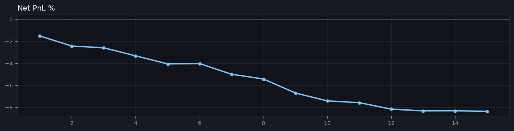

## #1 2408.TW　08-14 12:57　-1.52%

進場 `516.00`　出場 `509.00`　跌破MA20

MA5/10/20 `509.80` / `507.70` / `506.75`　離200 `0.88%`

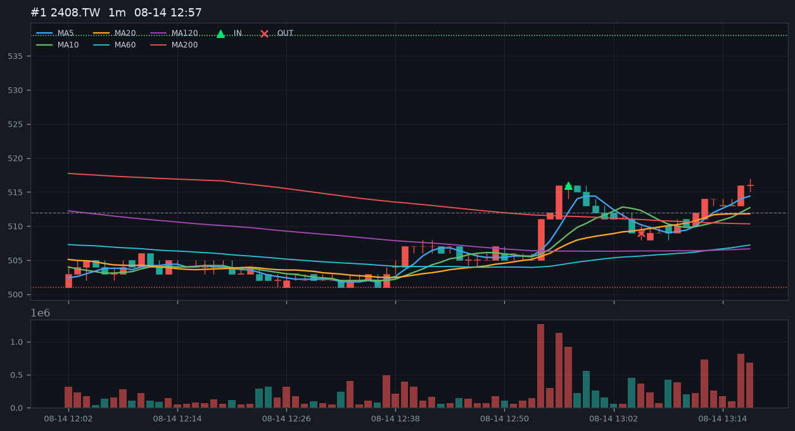

## #2 2408.TW　08-17 10:48　-0.92%

進場 `528.00`　出場 `524.00`　跌破MA20

MA5/10/20 `525.40` / `523.90` / `523.50`　離200 `2.30%`

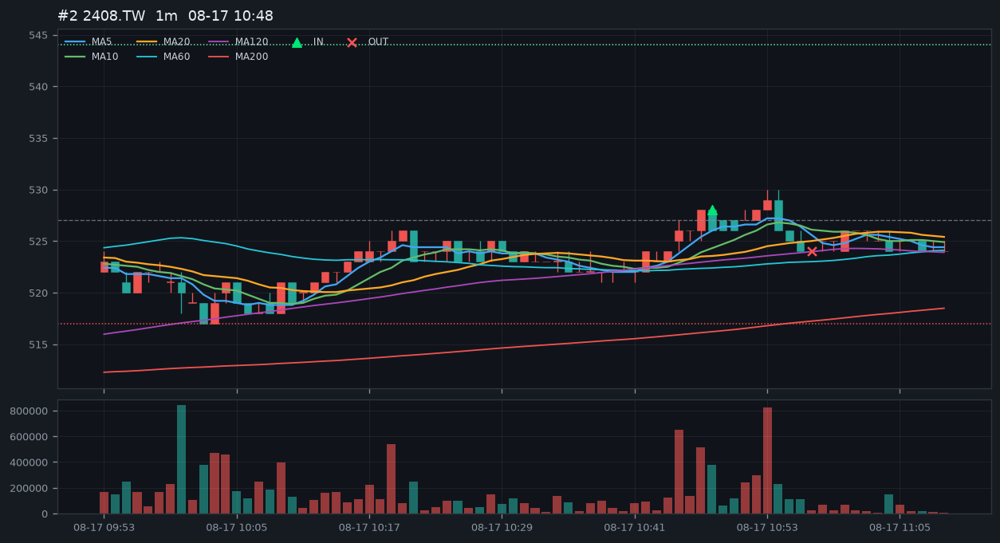

## #3 2408.TW　08-20 12:12　-0.16%

進場 `517.00`　出場 `517.00`　跌破MA20

MA5/10/20 `514.40` / `512.70` / `512.00`　離200 `0.93%`

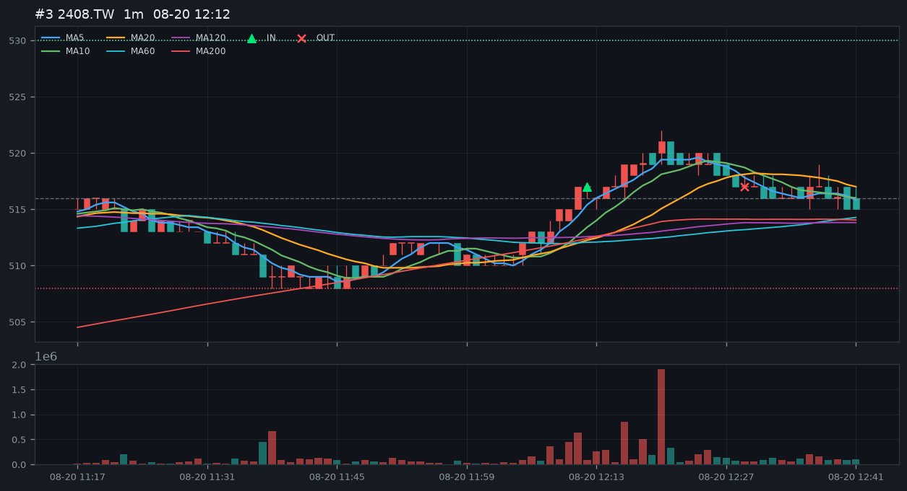

## #4 2408.TW　08-21 09:18　-0.73%

進場 `526.00`　出場 `523.00`　跌破MA20

MA5/10/20 `521.60` / `519.00` / `518.25`　離200 `2.22%`

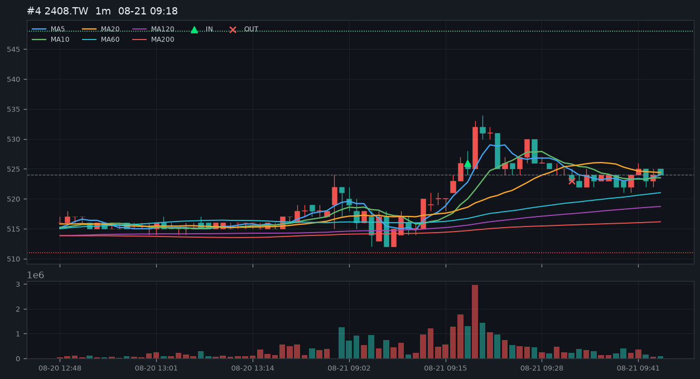

## #5 2408.TW　08-21 12:50　-0.73%

進場 `524.00`　出場 `521.00`　跌破MA20

MA5/10/20 `522.60` / `521.40` / `521.30`　離200 `0.70%`

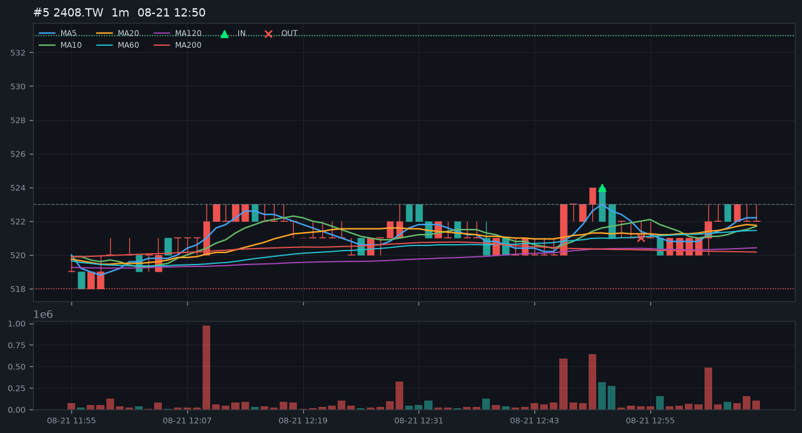

## #6 2408.TW　08-21 13:15　+0.03%

進場 `525.00`　出場 `526.00`　收盤平

MA5/10/20 `522.80` / `522.40` / `521.90`　離200 `0.94%`

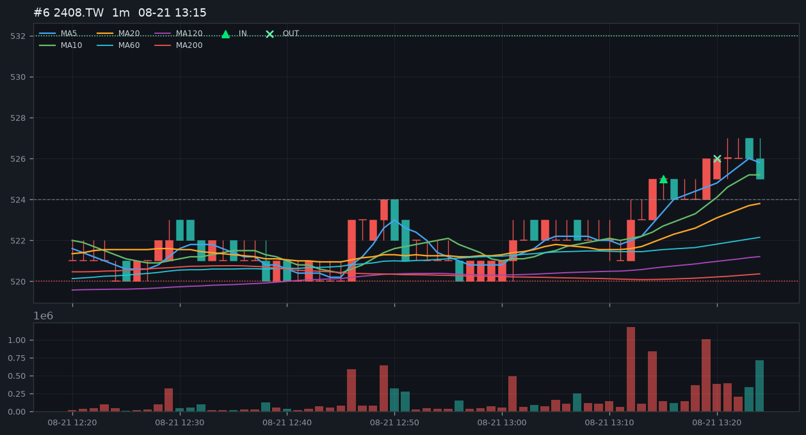

## #7 2344.TW　08-14 12:57　-0.97%

進場 `184.50`　出場 `183.00`　跌破MA20

MA5/10/20 `183.00` / `182.65` / `182.47`　離200 `0.45%`

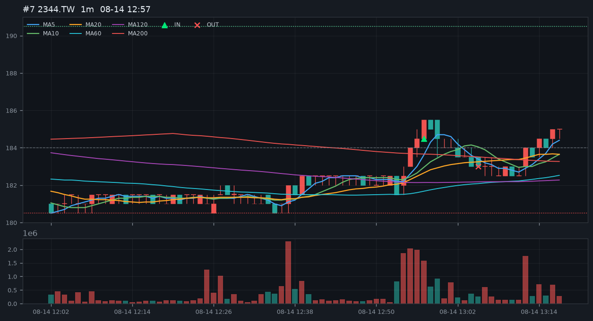

## #8 2344.TW　08-17 10:52　-0.43%

進場 `185.00`　出場 `184.50`　跌破MA20

MA5/10/20 `184.80` / `184.45` / `184.28`　離200 `1.00%`

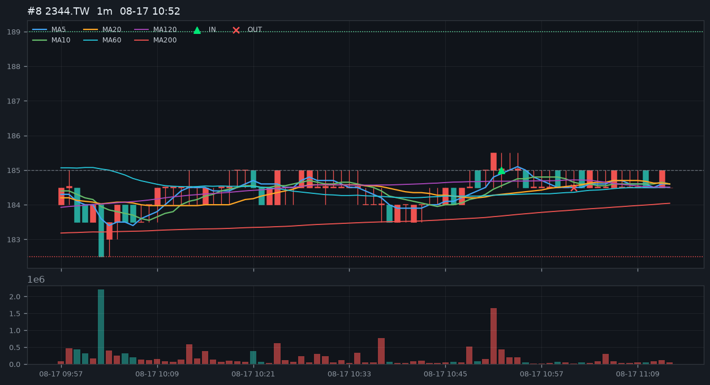

## #9 2344.TW　08-21 09:18　-1.27%

進場 `179.50`　出場 `177.50`　跌破MA20

MA5/10/20 `177.80` / `177.15` / `176.80`　離200 `2.61%`

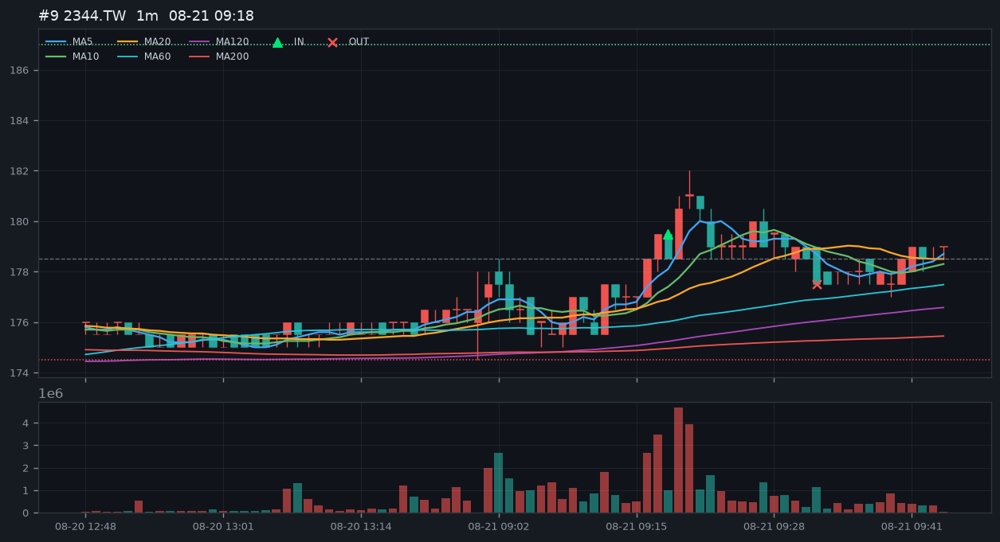

## #10 2344.TW　08-21 10:56　-0.72%

進場 `179.50`　出場 `178.50`　跌破MA20

MA5/10/20 `178.50` / `177.90` / `177.38`　離200 `1.59%`

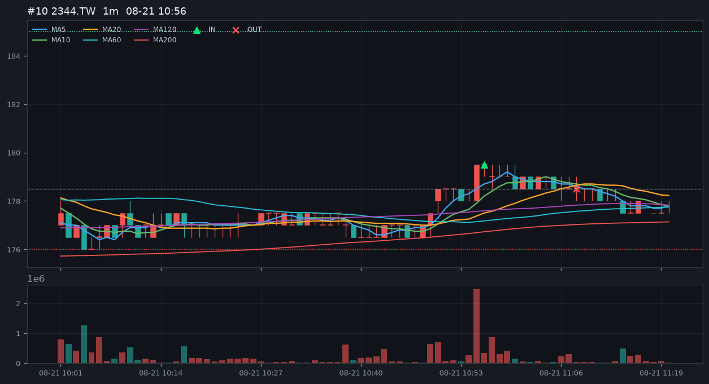

## #11 2344.TW　08-21 13:15　-0.16%

進場 `180.50`　出場 `180.50`　收盤平

MA5/10/20 `180.30` / `180.00` / `179.82`　離200 `1.41%`

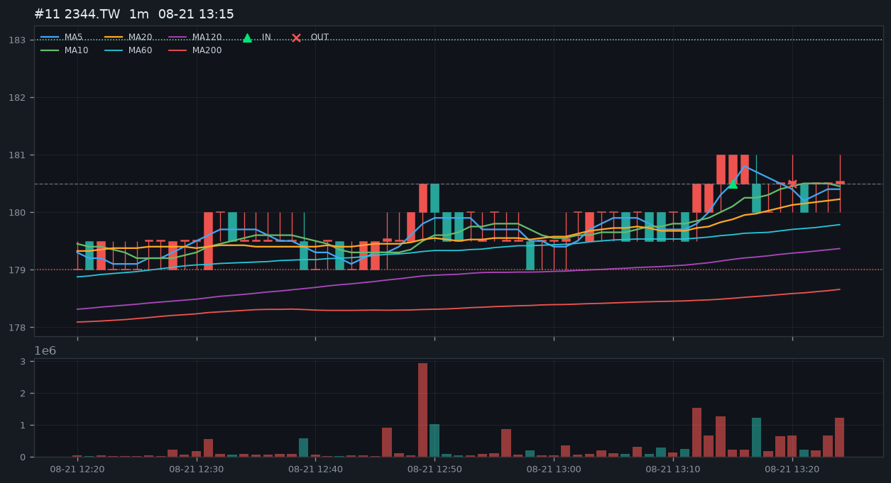

## #12 2303.TW　08-21 10:30　-0.59%

進場 `116.50`　出場 `116.00`　跌破MA20

MA5/10/20 `115.80` / `115.65` / `115.45`　離200 `2.16%`

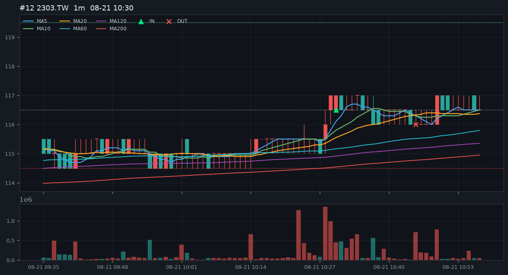

## #13 2330.TW　08-21 09:16　-0.16%

進場 `2385.00`　出場 `2385.00`　跌破MA20

MA5/10/20 `2377.00` / `2374.50` / `2373.25`　離200 `1.10%`

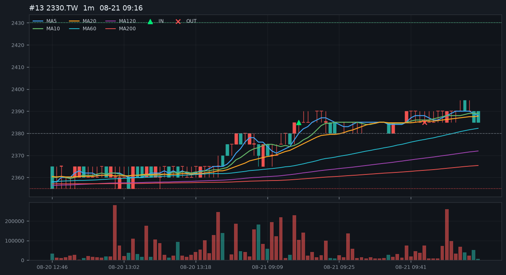

## #14 NQ=F　08-19 08:46　+0.01%

進場 `29701.00`　出場 `29709.00`　跌破MA20

MA5/10/20 `29678.35` / `29667.25` / `29625.45`　離200 `0.50%`

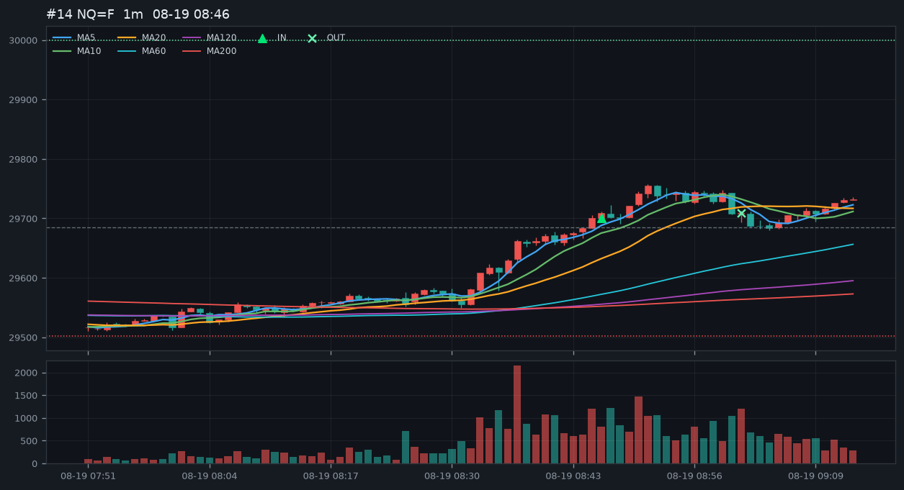

## #15 NQ=F　08-21 11:41　-0.04%

進場 `29454.00`　出場 `29446.75`　跌破MA20

MA5/10/20 `29428.90` / `29411.15` / `29383.71`　離200 `0.24%`

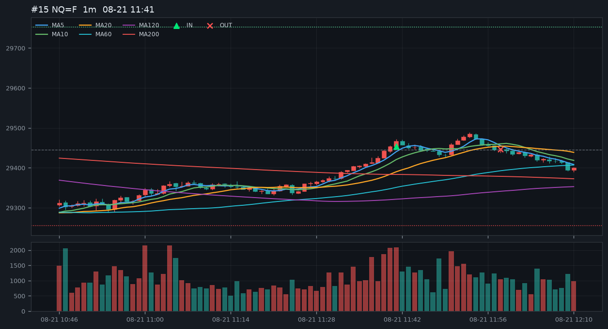
