# 台股一分K · 跌破 MA200

成交額前 100、濾掉 ETF 與股價 600 以上。一分K MA5<MA10<MA20 空頭排列，當根收盤跌破 MA200 做空；13:00 後不再進場。K 棒漲紅跌綠。

- 回測 **918** 筆 · 下圖最近 20 筆
- 勝率 10.7% · 平均 -0.59%
- 2026-08-17 · 週成交額前 100 · 排除 ETF 與股價 > 600 · Yahoo 近 7d 一分K

## 1. 大聯大 [3702.TW](https://tw.stock.yahoo.com/quote/3702.TW)

- 價格 110.50 -0.89%　成交額排名 #85 · 12.19 億
- 1分跌破 12:59　收 110.50 < MA200 110.93
- 1分 MA5 110.80 < MA10 110.85 < MA20 111.12　MA20/MA200 差 0.2%
- 五分收盤 / MA200　110.50 < 118.63（-6.9%）
- 回補 13:00 111.00（站回200 · 1 分）

**一分 K**

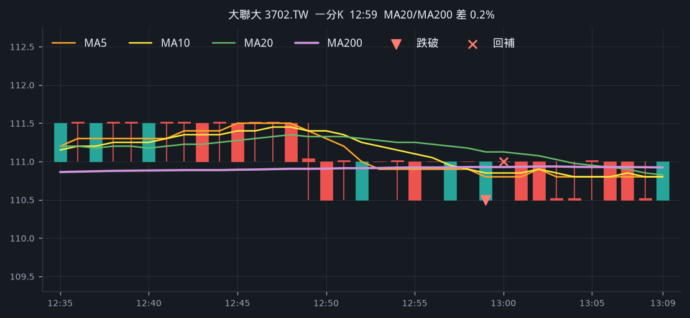

**五分 K（對照）**

## 2. 日電貿 [3090.TW](https://tw.stock.yahoo.com/quote/3090.TW)

- 價格 166.00 -0.74%　成交額排名 #73 · 14.60 億
- 1分跌破 12:59　收 166.00 < MA200 166.13
- 1分 MA5 166.10 < MA10 166.30 < MA20 166.65　MA20/MA200 差 0.3%
- 五分收盤 / MA200　166.00 < 172.69（-3.9%）
- 回補 13:01 166.50（站回200 · 2 分）

**一分 K**

**五分 K（對照）**

## 3. 仁寶 [2324.TW](https://tw.stock.yahoo.com/quote/2324.TW)

- 價格 41.50 -0.56%　成交額排名 #7 · 109.55 億
- 1分跌破 12:59　收 41.50 < MA200 41.53
- 1分 MA5 41.54 < MA10 41.54 < MA20 41.63　MA20/MA200 差 0.2%
- 五分收盤 / MA200　41.50 > 41.18（+0.8%）
- 回補 13:01 41.55（站回200 · 2 分）

**一分 K**

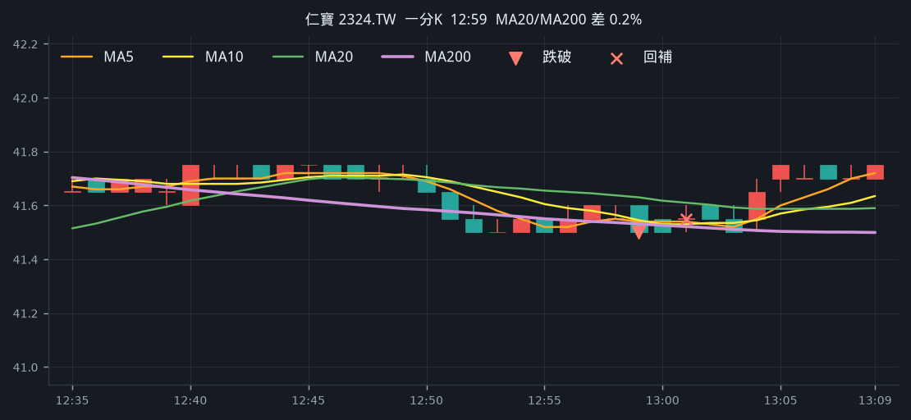

**五分 K（對照）**

## 4. 寶雅* [5904.TWO](https://tw.stock.yahoo.com/quote/5904.TWO)

- 價格 76.20 -0.43%　成交額排名 #93 · 11.15 億
- 1分跌破 12:58　收 76.20 < MA200 76.23
- 1分 MA5 76.26 < MA10 76.28 < MA20 76.33　MA20/MA200 差 0.1%
- 五分收盤 / MA200　76.10 < 80.13（-5.0%）
- 回補 13:09 76.20（站回200 · 11 分）

**一分 K**

**五分 K（對照）**

## 5. 大聯大 [3702.TW](https://tw.stock.yahoo.com/quote/3702.TW)

- 價格 110.50 -0.89%　成交額排名 #85 · 12.19 億
- 1分跌破 12:57　收 110.50 < MA200 110.92
- 1分 MA5 110.90 < MA10 110.95 < MA20 111.20　MA20/MA200 差 0.3%
- 五分收盤 / MA200　110.50 < 118.63（-6.9%）
- 回補 12:58 111.00（站回200 · 1 分）

**一分 K**

**五分 K（對照）**

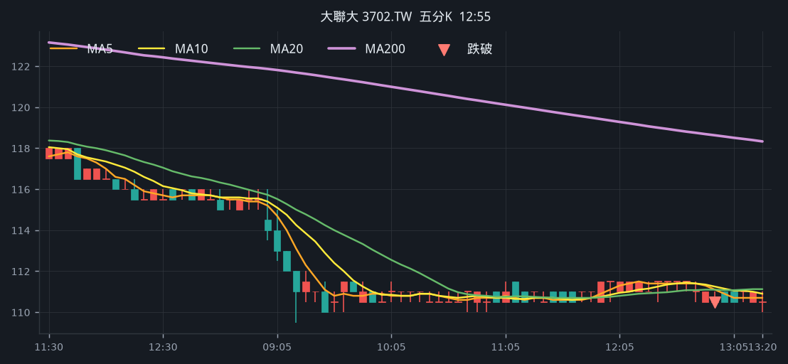

## 6. 緯創 [3231.TW](https://tw.stock.yahoo.com/quote/3231.TW)

- 價格 186.00 -0.70%　成交額排名 #11 · 96.87 億
- 1分跌破 12:57　收 186.00 < MA200 186.41
- 1分 MA5 186.50 < MA10 186.60 < MA20 186.72　MA20/MA200 差 0.2%
- 五分收盤 / MA200　186.00 < 193.26（-3.8%）
- 回補 13:01 186.50（站回200 · 4 分）

**一分 K**

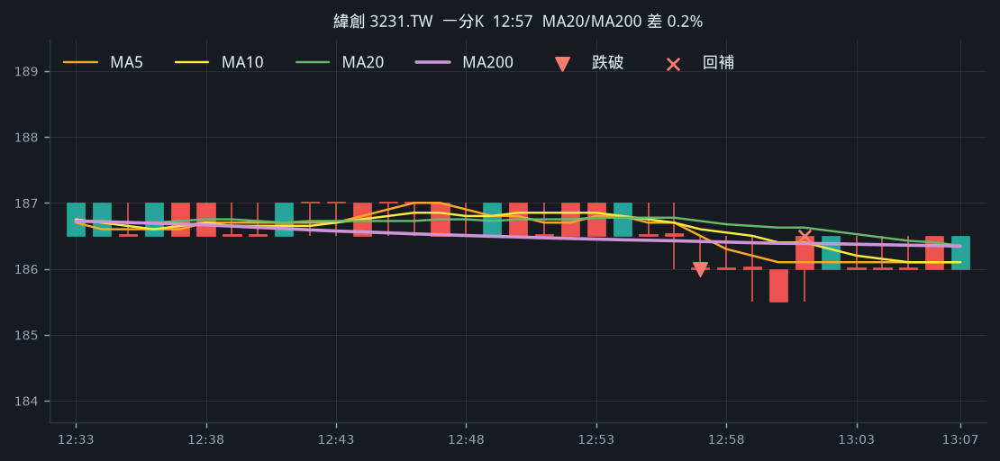

**五分 K（對照）**

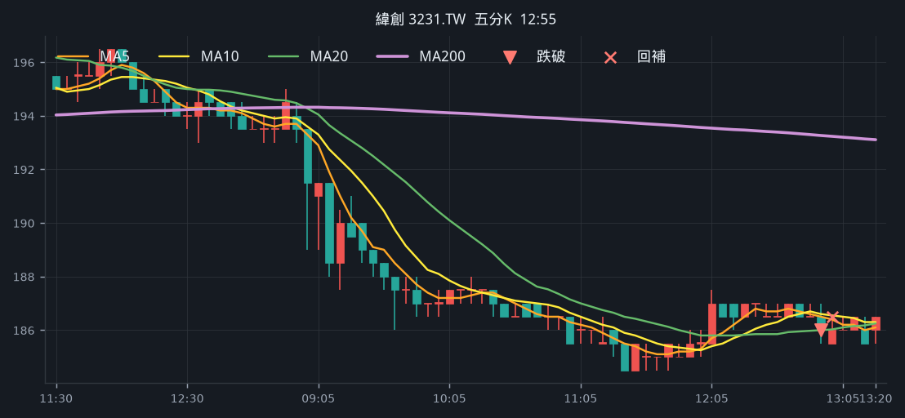

## 7. 友達 [2409.TW](https://tw.stock.yahoo.com/quote/2409.TW)

- 價格 26.95 -0.81%　成交額排名 #20 · 80.17 億
- 1分跌破 12:57　收 26.95 < MA200 27.00
- 1分 MA5 27.00 < MA10 27.07 < MA20 27.11　MA20/MA200 差 0.4%
- 五分收盤 / MA200　26.95 > 26.32（+2.4%）
- 回補 13:00 27.05（站回200 · 3 分）

**一分 K**

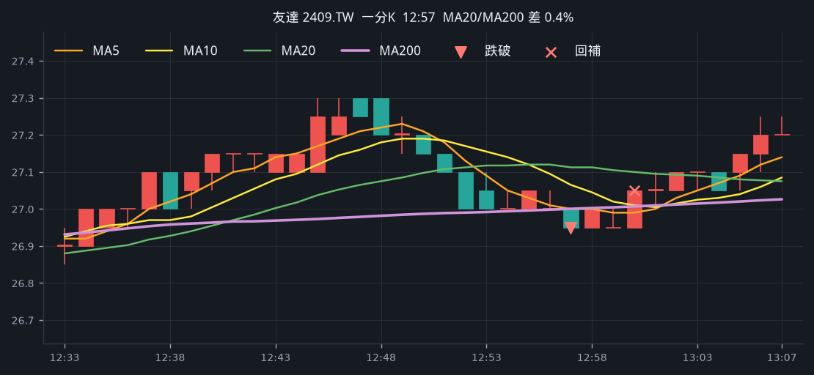

**五分 K（對照）**

## 8. 寶雅* [5904.TWO](https://tw.stock.yahoo.com/quote/5904.TWO)

- 價格 76.20 -0.57%　成交額排名 #93 · 11.15 億
- 1分跌破 12:56　收 76.20 < MA200 76.23
- 1分 MA5 76.28 < MA10 76.30 < MA20 76.34　MA20/MA200 差 0.1%
- 五分收盤 / MA200　76.10 < 80.13（-5.0%）
- 回補 12:57 76.30（站回200 · 1 分）

**一分 K**

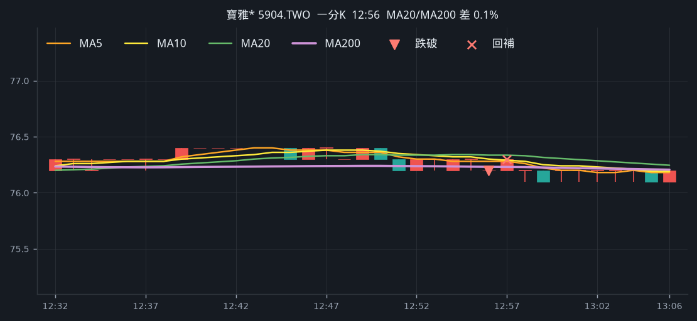

**五分 K（對照）**

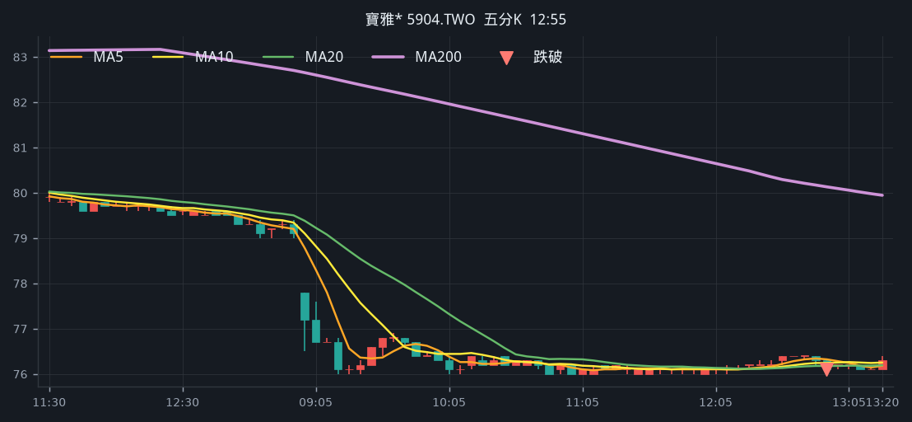

## 9. 十銓 [4967.TW](https://tw.stock.yahoo.com/quote/4967.TW)

- 價格 265.50 +0.13%　成交額排名 #97 · 9.92 億
- 1分跌破 12:56　收 265.50 < MA200 265.75
- 1分 MA5 265.90 < MA10 266.05 < MA20 266.10　MA20/MA200 差 0.1%
- 五分收盤 / MA200　265.50 < 276.22（-3.9%）
- 回補 13:24 264.00（收盤 · 28 分）

**一分 K**

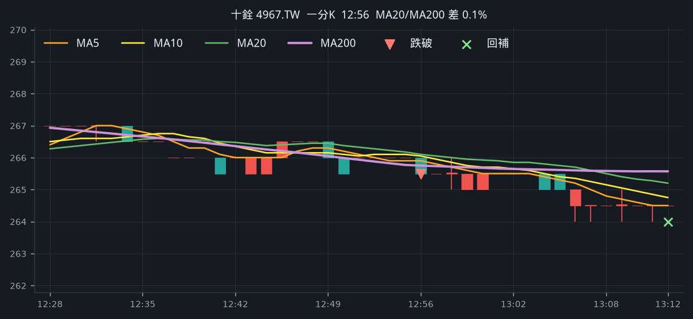

**五分 K（對照）**

## 10. 大毅 [2478.TW](https://tw.stock.yahoo.com/quote/2478.TW)

- 價格 125.00 -0.83%　成交額排名 —
- 1分跌破 12:56　收 125.00 < MA200 125.23
- 1分 MA5 125.50 < MA10 125.55 < MA20 125.60　MA20/MA200 差 0.3%
- 五分收盤 / MA200　126.00 < 129.29（-2.5%）
- 回補 12:57 125.50（站回200 · 1 分）

**一分 K**

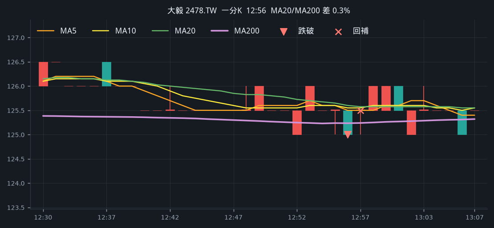

**五分 K（對照）**

## 11. 英業達 [2356.TW](https://tw.stock.yahoo.com/quote/2356.TW)

- 價格 66.40 -0.74%　成交額排名 #46 · 24.34 億
- 1分跌破 12:56　收 66.40 < MA200 66.43
- 1分 MA5 66.44 < MA10 66.53 < MA20 66.60　MA20/MA200 差 0.3%
- 五分收盤 / MA200　66.60 < 68.96（-3.4%）
- 回補 12:57 66.60（站回200 · 1 分）

**一分 K**

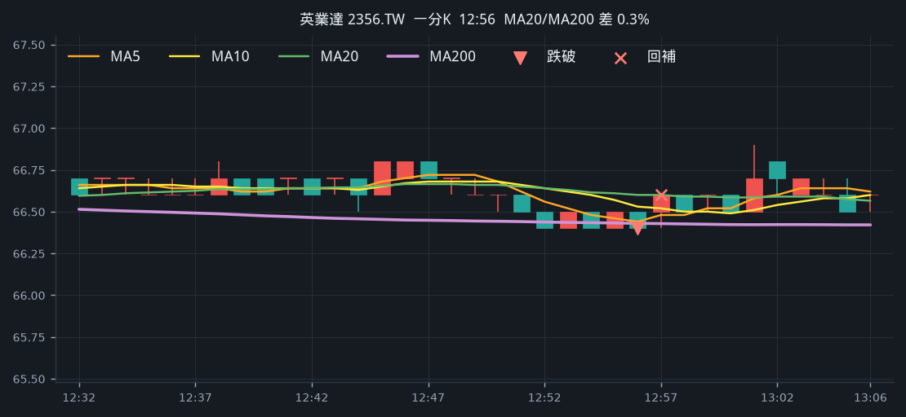

**五分 K（對照）**

## 12. 華通 [2313.TW](https://tw.stock.yahoo.com/quote/2313.TW)

- 價格 212.00 -0.67%　成交額排名 #39 · 29.39 億
- 1分跌破 12:56　收 212.00 < MA200 212.46
- 1分 MA5 212.30 < MA10 212.45 < MA20 212.50　MA20/MA200 差 0.0%
- 五分收盤 / MA200　211.50 < 213.63（-1.0%）
- 回補 13:01 212.50（站回200 · 5 分）

**一分 K**

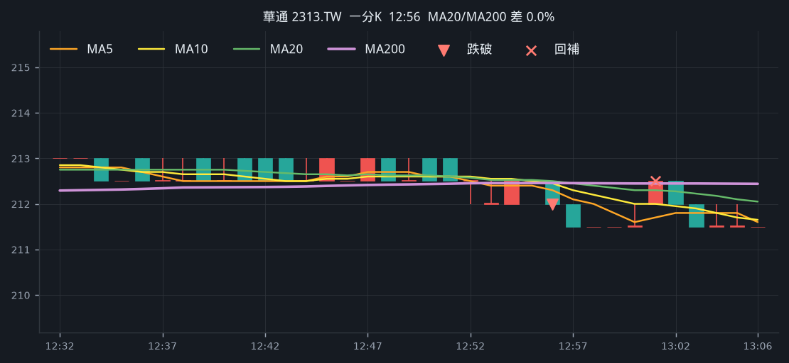

**五分 K（對照）**

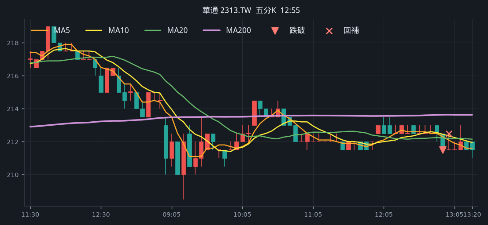

## 13. 日電貿 [3090.TW](https://tw.stock.yahoo.com/quote/3090.TW)

- 價格 166.00 -0.74%　成交額排名 #73 · 14.60 億
- 1分跌破 12:55　收 166.00 < MA200 166.09
- 1分 MA5 166.40 < MA10 166.50 < MA20 166.85　MA20/MA200 差 0.5%
- 五分收盤 / MA200　166.00 < 172.69（-3.9%）
- 回補 12:58 166.50（站回200 · 3 分）

**一分 K**

**五分 K（對照）**

## 14. 英業達 [2356.TW](https://tw.stock.yahoo.com/quote/2356.TW)

- 價格 66.40 -0.59%　成交額排名 #46 · 24.34 億
- 1分跌破 12:54　收 66.40 < MA200 66.43
- 1分 MA5 66.48 < MA10 66.60 < MA20 66.61　MA20/MA200 差 0.3%
- 五分收盤 / MA200　66.40 < 68.97（-3.7%）
- 回補 12:55 66.50（站回200 · 1 分）

**一分 K**

**五分 K（對照）**

## 15. 大聯大 [3702.TW](https://tw.stock.yahoo.com/quote/3702.TW)

- 價格 110.50 -0.89%　成交額排名 #85 · 12.19 億
- 1分跌破 12:52　收 110.50 < MA200 110.91
- 1分 MA5 111.00 < MA10 111.25 < MA20 111.30　MA20/MA200 差 0.3%
- 五分收盤 / MA200　111.00 < 118.69（-6.5%）
- 回補 12:53 111.00（站回200 · 1 分）

**一分 K**

**五分 K（對照）**

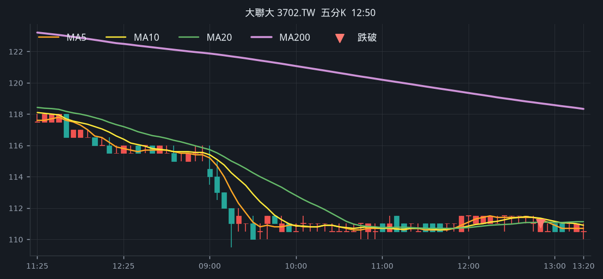

## 16. 廣達 [2382.TW](https://tw.stock.yahoo.com/quote/2382.TW)

- 價格 333.00 -0.59%　成交額排名 #10 · 99.02 億
- 1分跌破 12:52　收 333.00 < MA200 333.36
- 1分 MA5 333.20 < MA10 333.25 < MA20 333.50　MA20/MA200 差 0.0%
- 五分收盤 / MA200　333.50 > 327.31（+1.9%）
- 回補 12:53 333.50（站回200 · 1 分）

**一分 K**

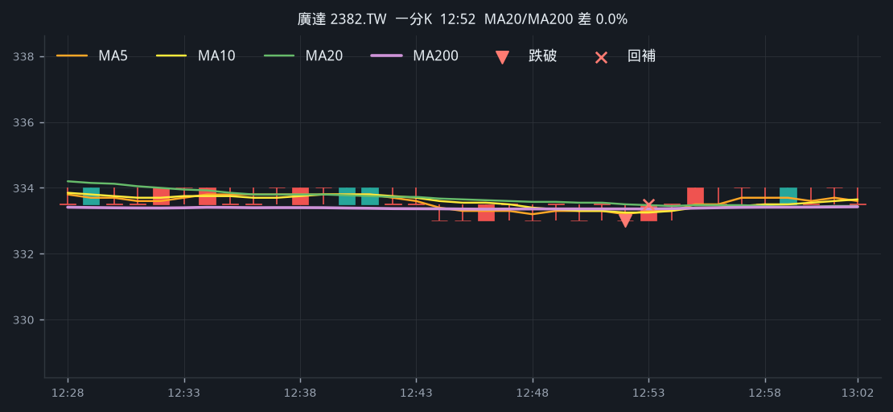

**五分 K（對照）**

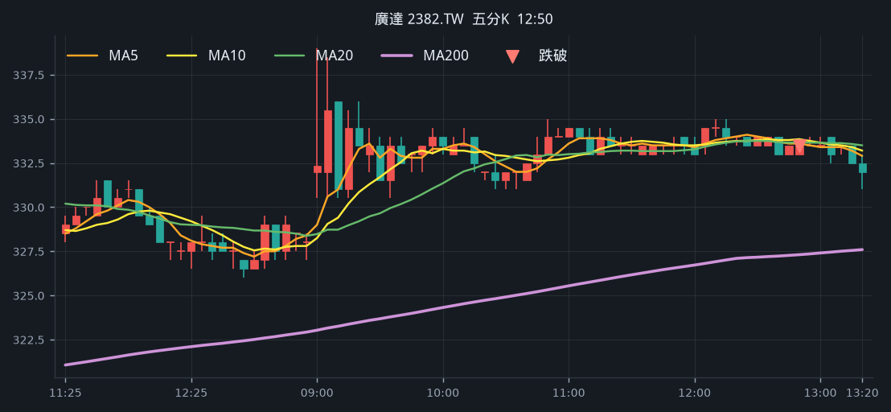

## 17. 光寶科 [2301.TW](https://tw.stock.yahoo.com/quote/2301.TW)

- 價格 267.00 +0.13%　成交額排名 #22 · 60.61 億
- 1分跌破 12:50　收 267.00 < MA200 267.36
- 1分 MA5 267.20 < MA10 267.25 < MA20 267.52　MA20/MA200 差 0.1%
- 五分收盤 / MA200　266.50 > 265.98（+0.2%）
- 回補 13:20 265.50（到期 · 30 分）

**一分 K**

**五分 K（對照）**

## 18. 力成 [6239.TW](https://tw.stock.yahoo.com/quote/6239.TW)

- 價格 278.00 -0.61%　成交額排名 #48 · 21.70 億
- 1分跌破 12:48　收 278.00 < MA200 278.12
- 1分 MA5 278.40 < MA10 278.50 < MA20 278.55　MA20/MA200 差 0.2%
- 五分收盤 / MA200　278.00 < 282.29（-1.5%）
- 回補 13:11 278.50（站回200 · 23 分）

**一分 K**

**五分 K（對照）**

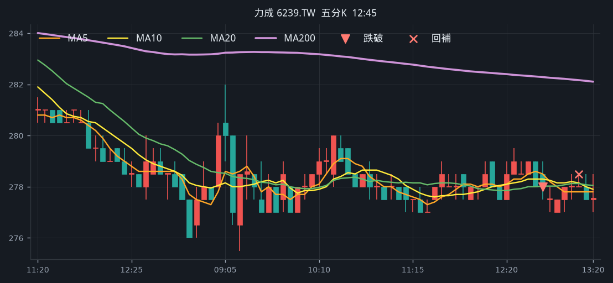

## 19. 頎邦 [6147.TWO](https://tw.stock.yahoo.com/quote/6147.TWO)

- 價格 168.00 -0.73%　成交額排名 #26 · 55.50 億
- 1分跌破 12:48　收 168.00 < MA200 168.34
- 1分 MA5 168.20 < MA10 168.40 < MA20 168.78　MA20/MA200 差 0.3%
- 五分收盤 / MA200　168.00 > 163.27（+2.9%）
- 回補 13:03 168.50（站回200 · 15 分）

**一分 K**

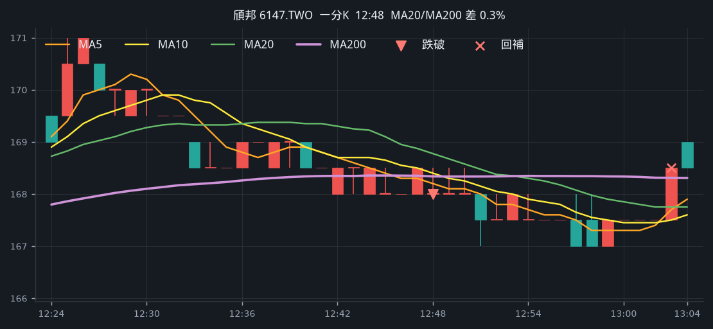

**五分 K（對照）**

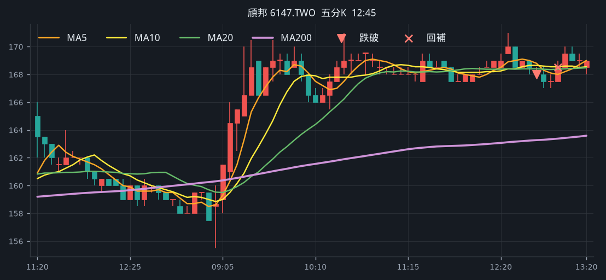

## 20. 健鼎 [3044.TW](https://tw.stock.yahoo.com/quote/3044.TW)

- 價格 485.50 -0.54%　成交額排名 #82 · 12.80 億
- 1分跌破 12:48　收 485.50 < MA200 485.63
- 1分 MA5 485.70 < MA10 485.80 < MA20 486.23　MA20/MA200 差 0.1%
- 五分收盤 / MA200　485.00 < 489.90（-1.0%）
- 回補 13:04 486.00（站回200 · 15 分）

**一分 K**

**五分 K（對照）**

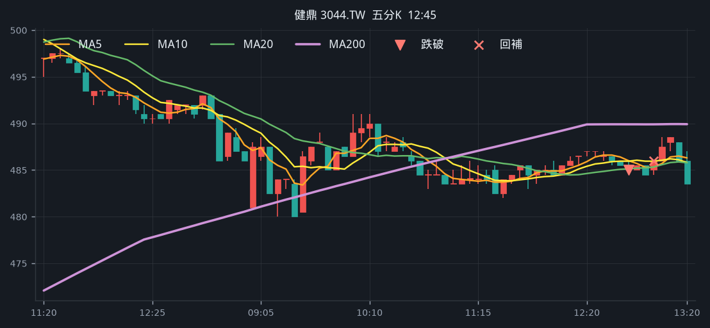

