# 台股一分K 5/10/20 空頭排列 · 跌破 MA200 做空

2026-08-17 · 週成交額前 100 · 排除 ETF 與股價 > 600 · Yahoo 近 7d 一分K

- 918 筆 · 勝率 10.7% · 平均 -0.59%
- 圖：漲紅跌綠；一分 K 只切跌破附近，縱軸對準 MA20/MA200。

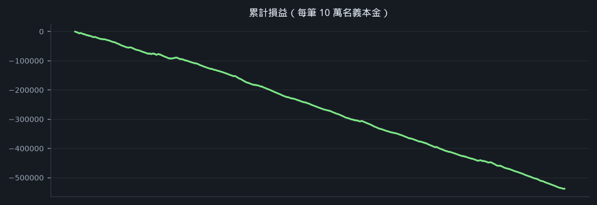

## 899. 大聯大 [3702.TW](https://tw.stock.yahoo.com/quote/3702.TW)

- 08-17 12:59 → 08-17 13:00 · 持有 1 分 · -0.89%
- 進場 110.50 / 回補 111.00 / MA200 110.93
- MA5 110.80 < MA10 110.85 < MA20 111.12

**一分 K**

**五分 K（對照）**

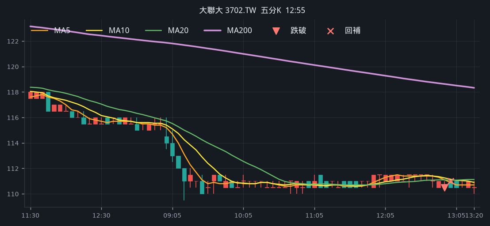

## 900. 日電貿 [3090.TW](https://tw.stock.yahoo.com/quote/3090.TW)

- 08-17 12:59 → 08-17 13:01 · 持有 2 分 · -0.74%
- 進場 166.00 / 回補 166.50 / MA200 166.13
- MA5 166.10 < MA10 166.30 < MA20 166.65

**一分 K**

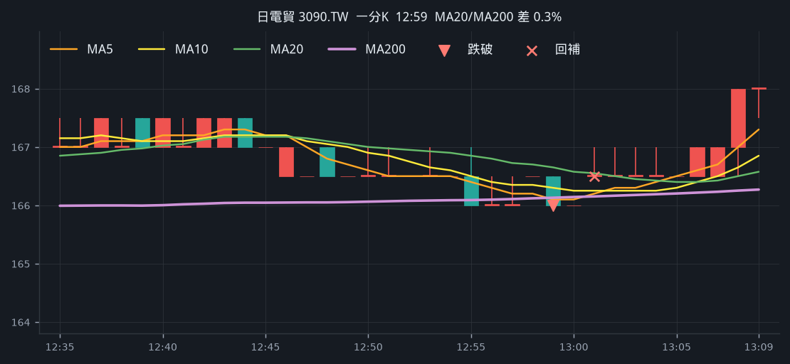

**五分 K（對照）**

## 901. 仁寶 [2324.TW](https://tw.stock.yahoo.com/quote/2324.TW)

- 08-17 12:59 → 08-17 13:01 · 持有 2 分 · -0.56%
- 進場 41.50 / 回補 41.55 / MA200 41.53
- MA5 41.54 < MA10 41.54 < MA20 41.63

**一分 K**

**五分 K（對照）**

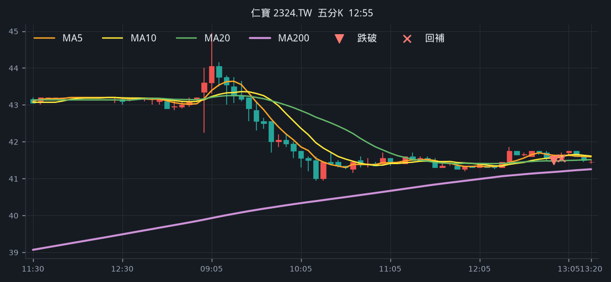

## 902. 寶雅* [5904.TWO](https://tw.stock.yahoo.com/quote/5904.TWO)

- 08-17 12:58 → 08-17 13:09 · 持有 11 分 · -0.43%
- 進場 76.20 / 回補 76.20 / MA200 76.23
- MA5 76.26 < MA10 76.28 < MA20 76.33

**一分 K**

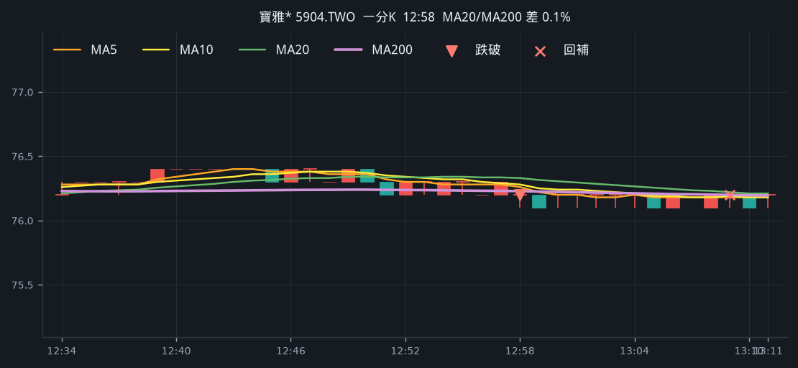

**五分 K（對照）**

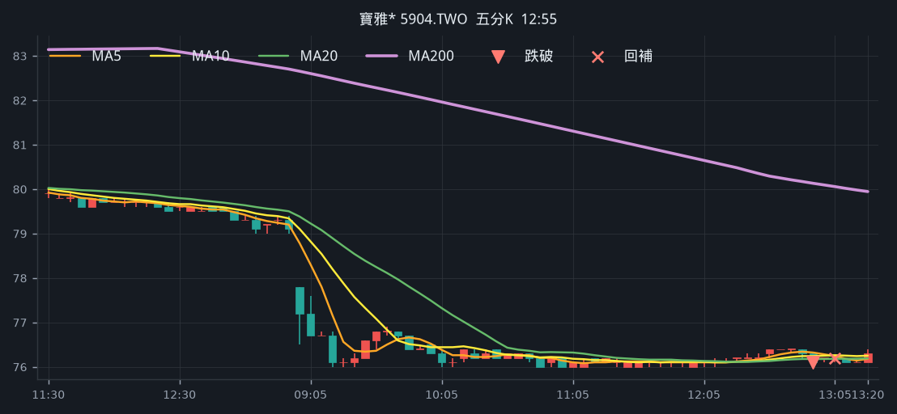

## 903. 大聯大 [3702.TW](https://tw.stock.yahoo.com/quote/3702.TW)

- 08-17 12:57 → 08-17 12:58 · 持有 1 分 · -0.89%
- 進場 110.50 / 回補 111.00 / MA200 110.92
- MA5 110.90 < MA10 110.95 < MA20 111.20

**一分 K**

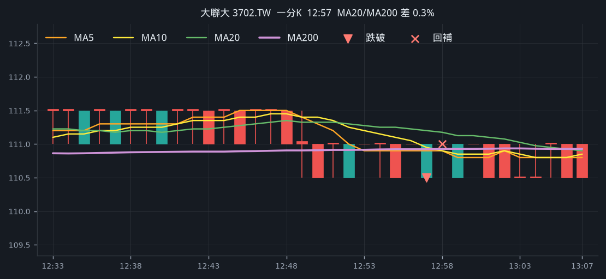

**五分 K（對照）**

## 904. 緯創 [3231.TW](https://tw.stock.yahoo.com/quote/3231.TW)

- 08-17 12:57 → 08-17 13:01 · 持有 4 分 · -0.70%
- 進場 186.00 / 回補 186.50 / MA200 186.41
- MA5 186.50 < MA10 186.60 < MA20 186.72

**一分 K**

**五分 K（對照）**

## 905. 友達 [2409.TW](https://tw.stock.yahoo.com/quote/2409.TW)

- 08-17 12:57 → 08-17 13:00 · 持有 3 分 · -0.81%
- 進場 26.95 / 回補 27.05 / MA200 27.00
- MA5 27.00 < MA10 27.07 < MA20 27.11

**一分 K**

**五分 K（對照）**

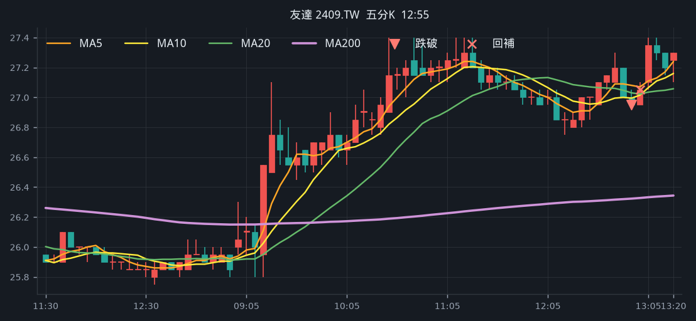

## 906. 寶雅* [5904.TWO](https://tw.stock.yahoo.com/quote/5904.TWO)

- 08-17 12:56 → 08-17 12:57 · 持有 1 分 · -0.57%
- 進場 76.20 / 回補 76.30 / MA200 76.23
- MA5 76.28 < MA10 76.30 < MA20 76.34

**一分 K**

**五分 K（對照）**

## 907. 十銓 [4967.TW](https://tw.stock.yahoo.com/quote/4967.TW)

- 08-17 12:56 → 08-17 13:24 · 持有 28 分 · +0.13%
- 進場 265.50 / 回補 264.00 / MA200 265.75
- MA5 265.90 < MA10 266.05 < MA20 266.10

**一分 K**

**五分 K（對照）**

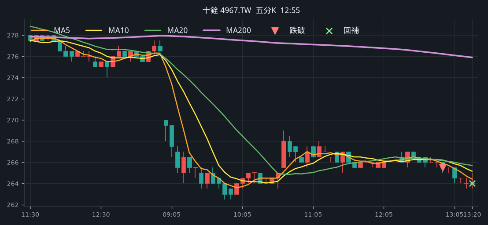

## 908. 大毅 [2478.TW](https://tw.stock.yahoo.com/quote/2478.TW)

- 08-17 12:56 → 08-17 12:57 · 持有 1 分 · -0.83%
- 進場 125.00 / 回補 125.50 / MA200 125.23
- MA5 125.50 < MA10 125.55 < MA20 125.60

**一分 K**

**五分 K（對照）**

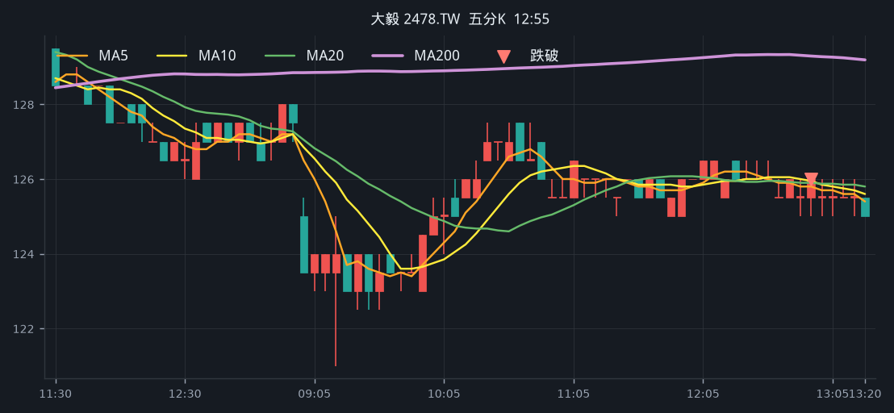

## 909. 英業達 [2356.TW](https://tw.stock.yahoo.com/quote/2356.TW)

- 08-17 12:56 → 08-17 12:57 · 持有 1 分 · -0.74%
- 進場 66.40 / 回補 66.60 / MA200 66.43
- MA5 66.44 < MA10 66.53 < MA20 66.60

**一分 K**

**五分 K（對照）**

## 910. 華通 [2313.TW](https://tw.stock.yahoo.com/quote/2313.TW)

- 08-17 12:56 → 08-17 13:01 · 持有 5 分 · -0.67%
- 進場 212.00 / 回補 212.50 / MA200 212.46
- MA5 212.30 < MA10 212.45 < MA20 212.50

**一分 K**

**五分 K（對照）**

## 911. 日電貿 [3090.TW](https://tw.stock.yahoo.com/quote/3090.TW)

- 08-17 12:55 → 08-17 12:58 · 持有 3 分 · -0.74%
- 進場 166.00 / 回補 166.50 / MA200 166.09
- MA5 166.40 < MA10 166.50 < MA20 166.85

**一分 K**

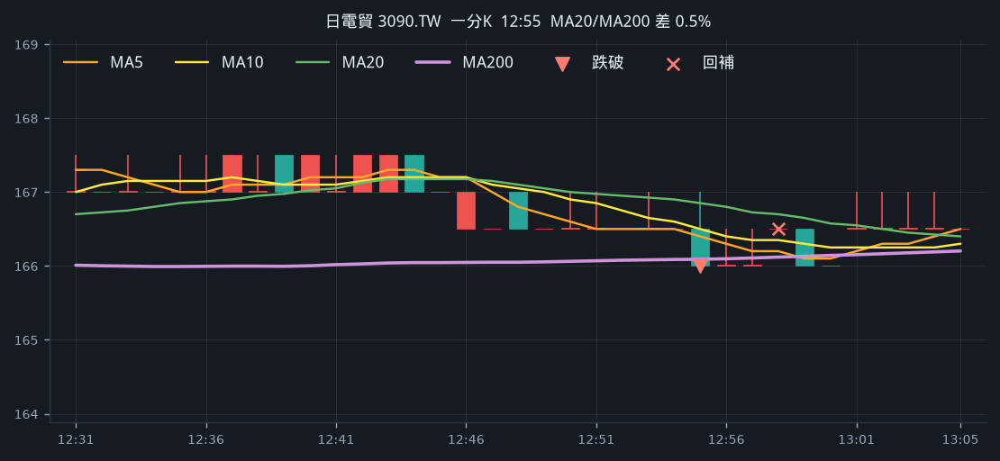

**五分 K（對照）**

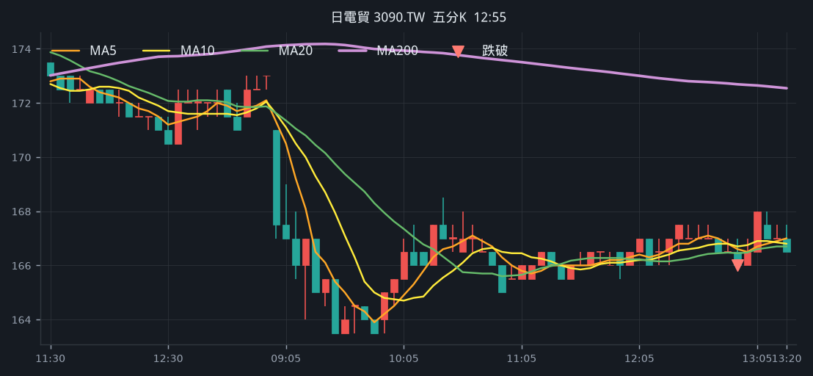

## 912. 英業達 [2356.TW](https://tw.stock.yahoo.com/quote/2356.TW)

- 08-17 12:54 → 08-17 12:55 · 持有 1 分 · -0.59%
- 進場 66.40 / 回補 66.50 / MA200 66.43
- MA5 66.48 < MA10 66.60 < MA20 66.61

**一分 K**

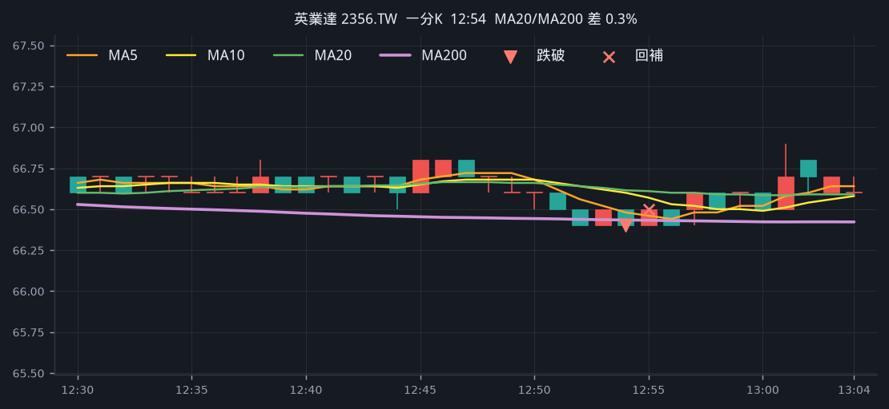

**五分 K（對照）**

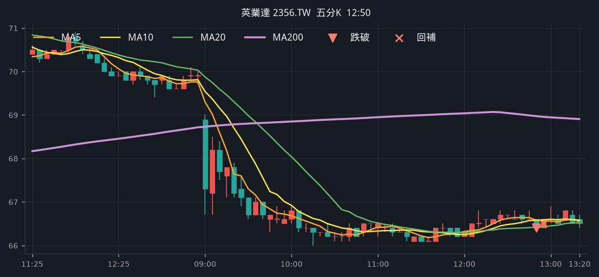

## 913. 大聯大 [3702.TW](https://tw.stock.yahoo.com/quote/3702.TW)

- 08-17 12:52 → 08-17 12:53 · 持有 1 分 · -0.89%
- 進場 110.50 / 回補 111.00 / MA200 110.91
- MA5 111.00 < MA10 111.25 < MA20 111.30

**一分 K**

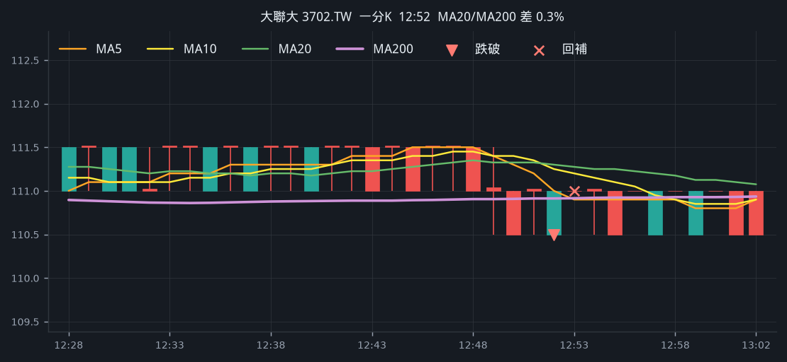

**五分 K（對照）**

## 914. 廣達 [2382.TW](https://tw.stock.yahoo.com/quote/2382.TW)

- 08-17 12:52 → 08-17 12:53 · 持有 1 分 · -0.59%
- 進場 333.00 / 回補 333.50 / MA200 333.36
- MA5 333.20 < MA10 333.25 < MA20 333.50

**一分 K**

**五分 K（對照）**

## 915. 光寶科 [2301.TW](https://tw.stock.yahoo.com/quote/2301.TW)

- 08-17 12:50 → 08-17 13:20 · 持有 30 分 · +0.13%
- 進場 267.00 / 回補 265.50 / MA200 267.36
- MA5 267.20 < MA10 267.25 < MA20 267.52

**一分 K**

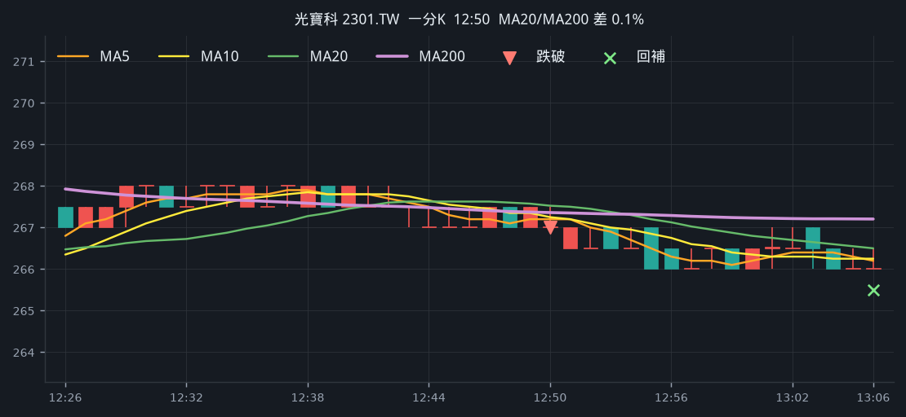

**五分 K（對照）**

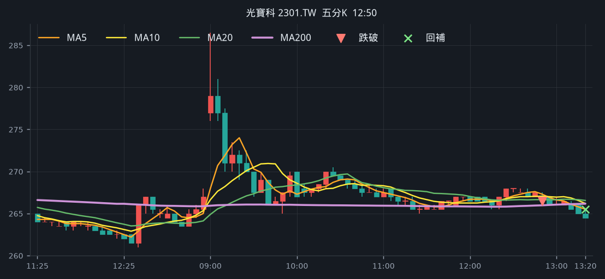

## 916. 力成 [6239.TW](https://tw.stock.yahoo.com/quote/6239.TW)

- 08-17 12:48 → 08-17 13:11 · 持有 23 分 · -0.61%
- 進場 278.00 / 回補 278.50 / MA200 278.12
- MA5 278.40 < MA10 278.50 < MA20 278.55

**一分 K**

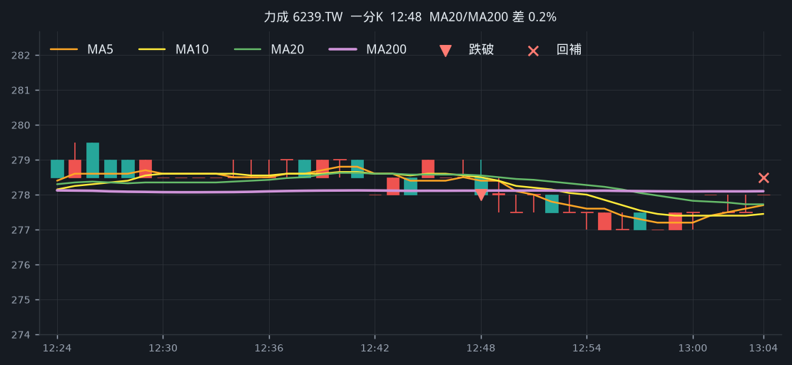

**五分 K（對照）**

## 917. 頎邦 [6147.TWO](https://tw.stock.yahoo.com/quote/6147.TWO)

- 08-17 12:48 → 08-17 13:03 · 持有 15 分 · -0.73%
- 進場 168.00 / 回補 168.50 / MA200 168.34
- MA5 168.20 < MA10 168.40 < MA20 168.78

**一分 K**

**五分 K（對照）**

## 918. 健鼎 [3044.TW](https://tw.stock.yahoo.com/quote/3044.TW)

- 08-17 12:48 → 08-17 13:04 · 持有 15 分 · -0.54%
- 進場 485.50 / 回補 486.00 / MA200 485.63
- MA5 485.70 < MA10 485.80 < MA20 486.23

**一分 K**

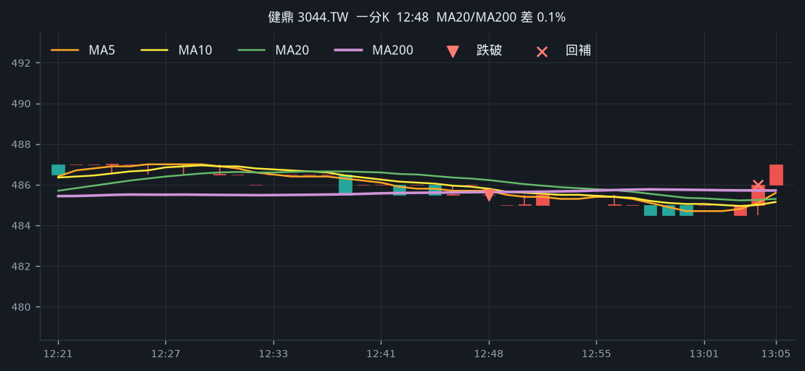

**五分 K（對照）**

