# 台股一分K · 跌破 MA200

成交額前 100、濾掉 ETF 與股價 600 以上。一分K MA5<MA10<MA20 空頭排列，當根收盤跌破 MA200 做空；13:00 後不再進場。K 棒漲紅跌綠。

- 回測 **913** 筆 · 下圖最近 20 筆
- 勝率 11.7% · 平均 -0.57%
- 2026-09-04 · 週成交額前 100 · 排除 ETF 與股價 > 600 · Yahoo 近 7d 一分K

## 1. 欣銓 [3264.TWO](https://tw.stock.yahoo.com/quote/3264.TWO)

- 價格 227.00 -0.88%　成交額排名 #99 · 60.27 億
- 1分跌破 12:57　收 227.00 < MA200 227.33
- 1分 MA5 227.50 < MA10 227.75 < MA20 227.80　MA20/MA200 差 0.2%
- 五分收盤 / MA200　228.00 < 232.34（-1.9%）
- 回補 12:59 228.00（站回200 · 2 分）

**一分 K**

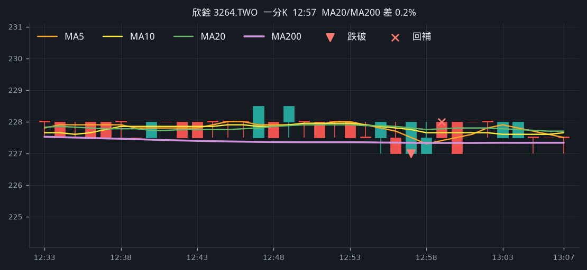

**五分 K（對照）**

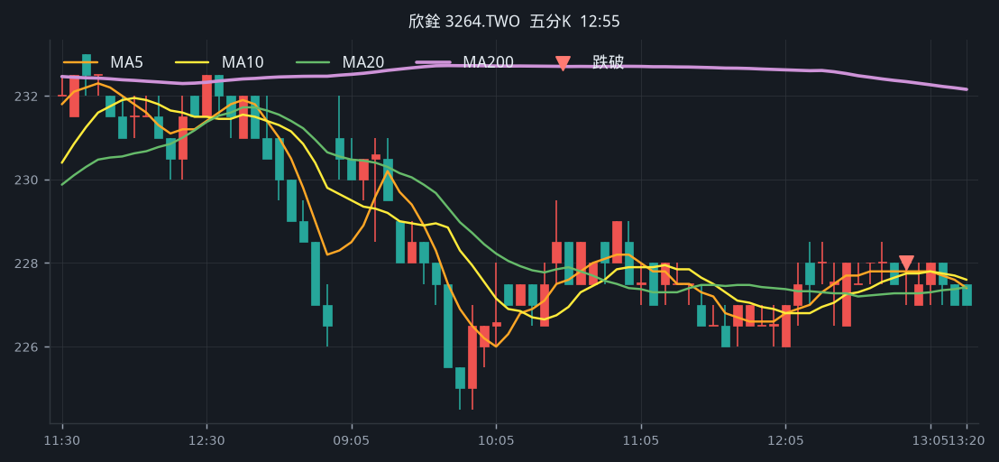

## 2. 台虹 [8039.TW](https://tw.stock.yahoo.com/quote/8039.TW)

- 價格 301.50 -0.93%　成交額排名 #13 · 547.37 億
- 1分跌破 12:56　收 301.50 < MA200 302.85
- 1分 MA5 303.30 < MA10 303.55 < MA20 305.02　MA20/MA200 差 0.7%
- 五分收盤 / MA200　301.00 < 310.30（-3.0%）
- 回補 13:00 303.00（站回200 · 4 分）

**一分 K**

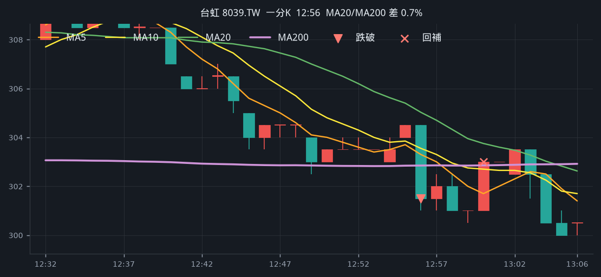

**五分 K（對照）**

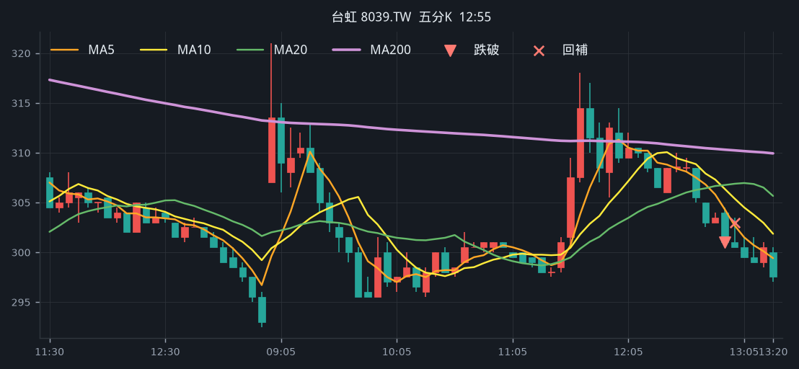

## 3. 矽力*-KY [6415.TW](https://tw.stock.yahoo.com/quote/6415.TW)

- 價格 422.50 -0.55%　成交額排名 #76 · 90.79 億
- 1分跌破 12:53　收 422.50 < MA200 422.70
- 1分 MA5 422.60 < MA10 423.50 < MA20 424.10　MA20/MA200 差 0.3%
- 五分收盤 / MA200　423.00 < 423.33（-0.1%）
- 回補 12:54 423.00（站回200 · 1 分）

**一分 K**

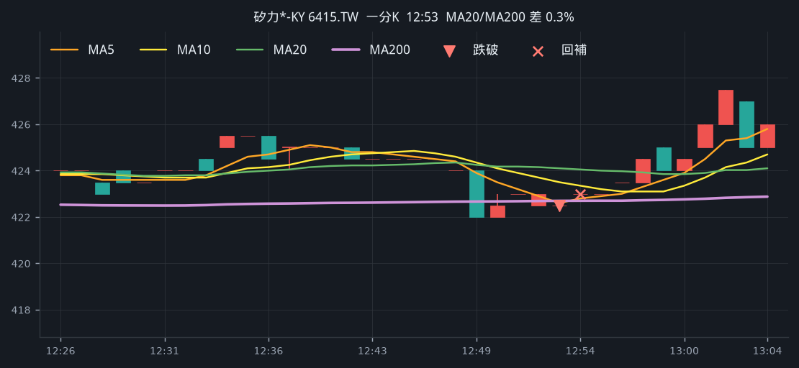

**五分 K（對照）**

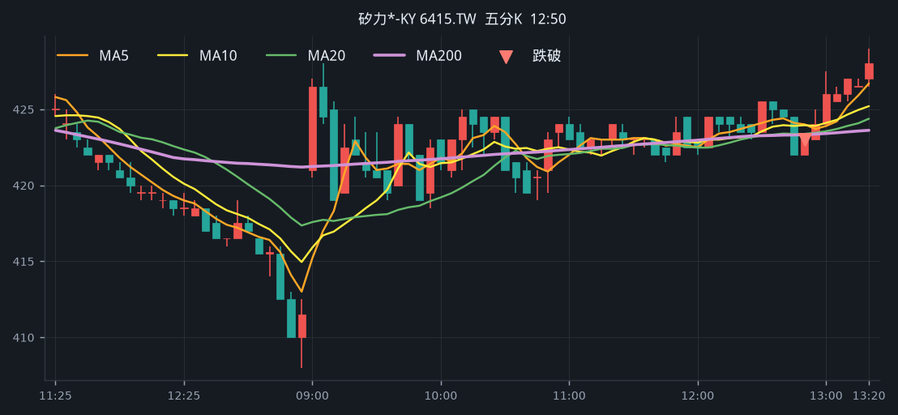

## 4. 富邦金 [2881.TW](https://tw.stock.yahoo.com/quote/2881.TW)

- 價格 150.00 -0.77%　成交額排名 #47 · 150.01 億
- 1分跌破 12:53　收 150.00 < MA200 150.01
- 1分 MA5 150.30 < MA10 150.35 < MA20 150.40　MA20/MA200 差 0.3%
- 五分收盤 / MA200　150.50 > 145.82（+3.2%）
- 回補 12:54 150.50（站回200 · 1 分）

**一分 K**

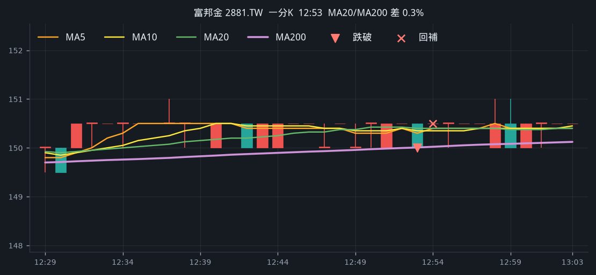

**五分 K（對照）**

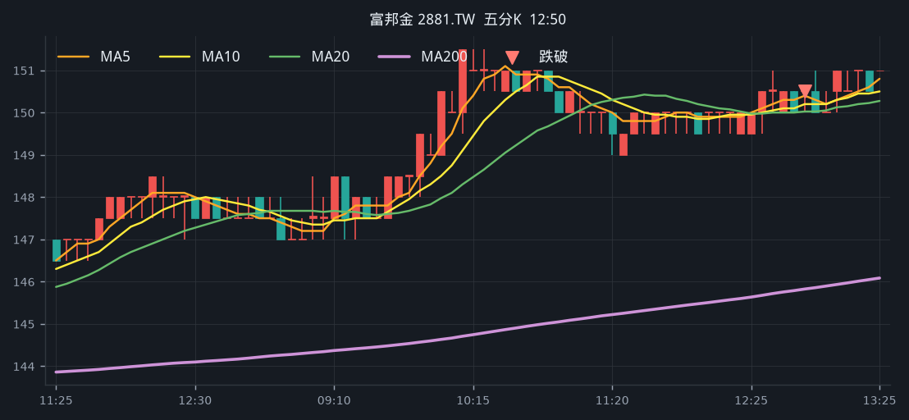

## 5. 亞泰金屬 [6727.TWO](https://tw.stock.yahoo.com/quote/6727.TWO)

- 價格 546.00 +0.77%　成交額排名 #97 · 61.06 億
- 1分跌破 12:50　收 546.00 < MA200 548.59
- 1分 MA5 550.00 < MA10 550.80 < MA20 551.10　MA20/MA200 差 0.5%
- 五分收盤 / MA200　538.00 < 569.28（-5.5%）
- 回補 12:52 539.45（停利 · 2 分）

**一分 K**

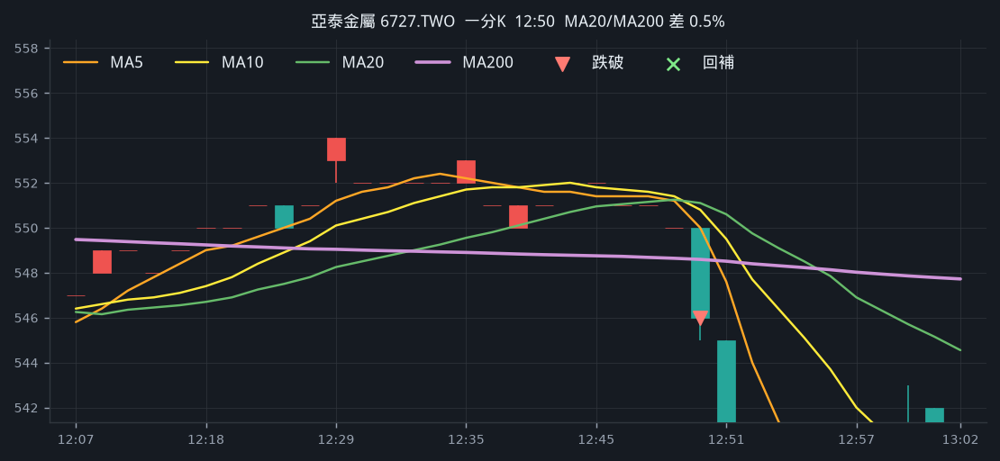

**五分 K（對照）**

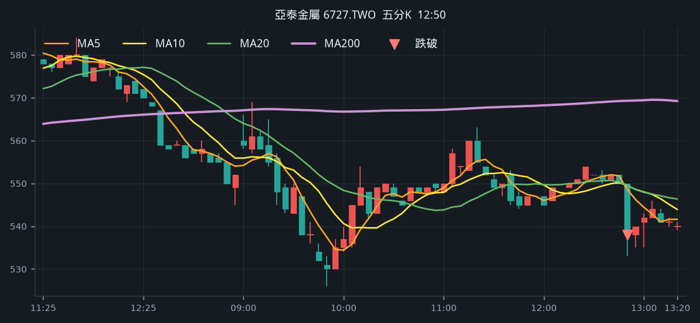

## 6. 群創 [3481.TW](https://tw.stock.yahoo.com/quote/3481.TW)

- 價格 48.40 -0.95%　成交額排名 #14 · 520.43 億
- 1分跌破 12:48　收 48.40 < MA200 48.51
- 1分 MA5 48.51 < MA10 48.54 < MA20 48.56　MA20/MA200 差 0.1%
- 五分收盤 / MA200　48.40 < 49.42（-2.1%）
- 回補 12:53 48.65（站回200 · 5 分）

**一分 K**

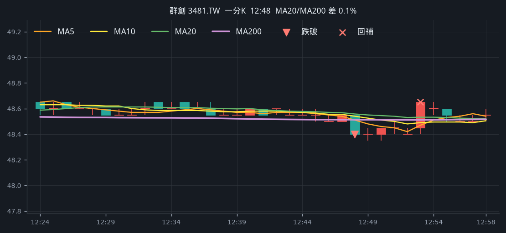

**五分 K（對照）**

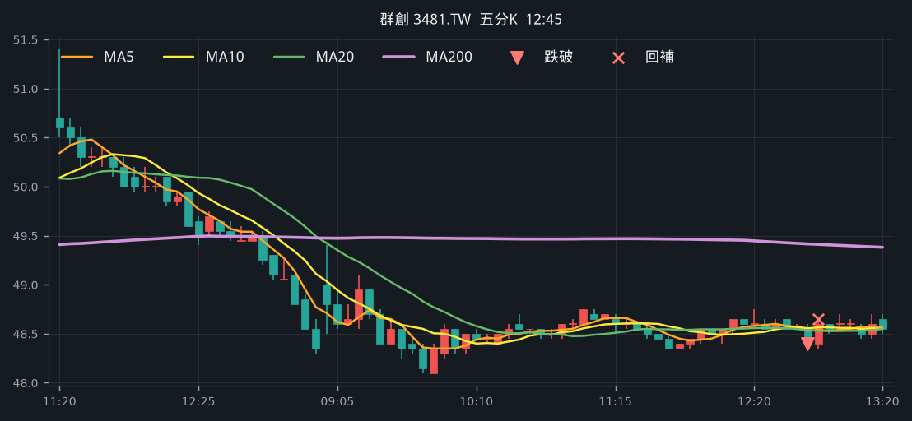

## 7. 友達 [2409.TW](https://tw.stock.yahoo.com/quote/2409.TW)

- 價格 26.65 -0.62%　成交額排名 #30 · 261.41 億
- 1分跌破 12:47　收 26.65 < MA200 26.69
- 1分 MA5 26.69 < MA10 26.70 < MA20 26.73　MA20/MA200 差 0.2%
- 五分收盤 / MA200　26.60 < 26.81（-0.8%）
- 回補 12:53 26.70（站回200 · 6 分）

**一分 K**

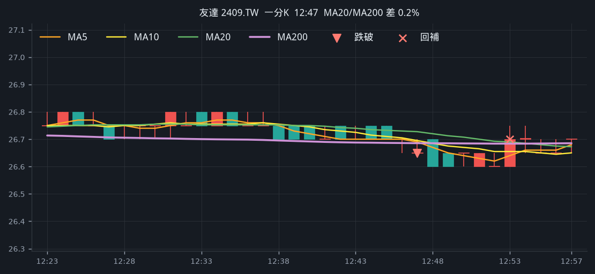

**五分 K（對照）**

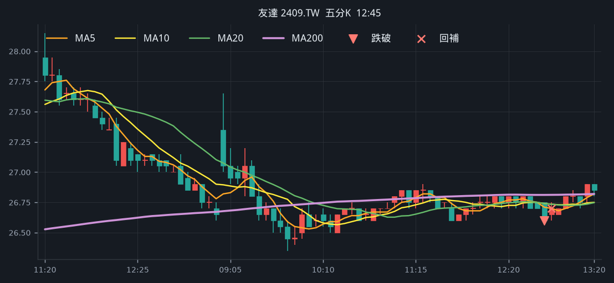

## 8. 群創 [3481.TW](https://tw.stock.yahoo.com/quote/3481.TW)

- 價格 48.50 -0.54%　成交額排名 #14 · 520.43 億
- 1分跌破 12:46　收 48.50 < MA200 48.51
- 1分 MA5 48.55 < MA10 48.55 < MA20 48.57　MA20/MA200 差 0.1%
- 五分收盤 / MA200　48.40 < 49.42（-2.1%）
- 回補 12:47 48.55（站回200 · 1 分）

**一分 K**

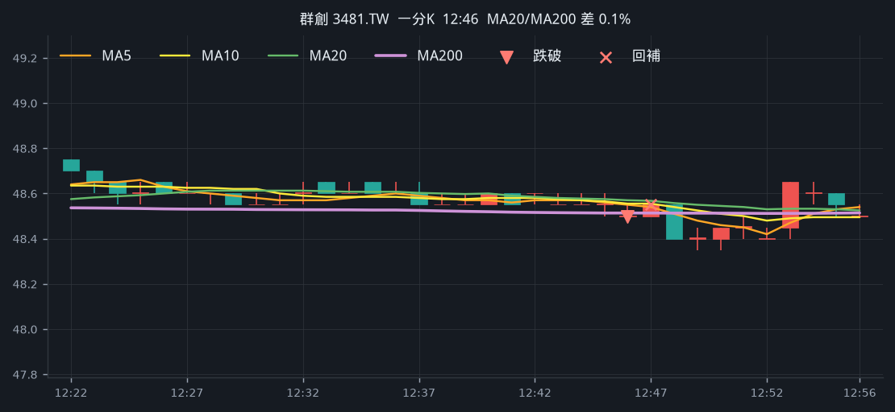

**五分 K（對照）**

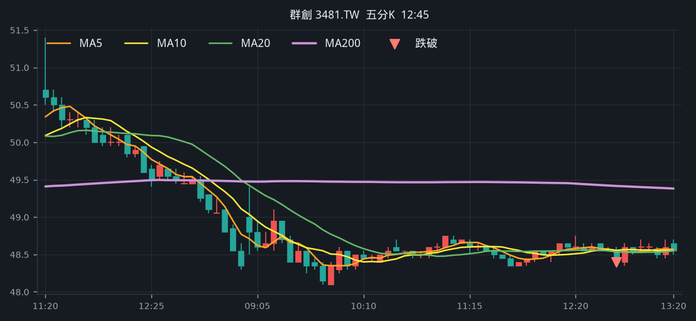

## 9. 聯詠 [3034.TW](https://tw.stock.yahoo.com/quote/3034.TW)

- 價格 522.00 -0.63%　成交額排名 #73 · 93.63 億
- 1分跌破 12:46　收 522.00 < MA200 522.59
- 1分 MA5 522.60 < MA10 522.70 < MA20 522.75　MA20/MA200 差 0.0%
- 五分收盤 / MA200　521.00 < 537.66（-3.1%）
- 回補 13:11 523.00（站回200 · 22 分）

**一分 K**

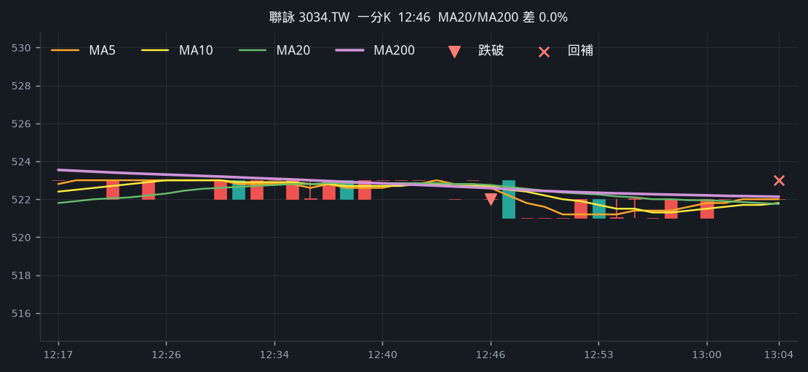

**五分 K（對照）**

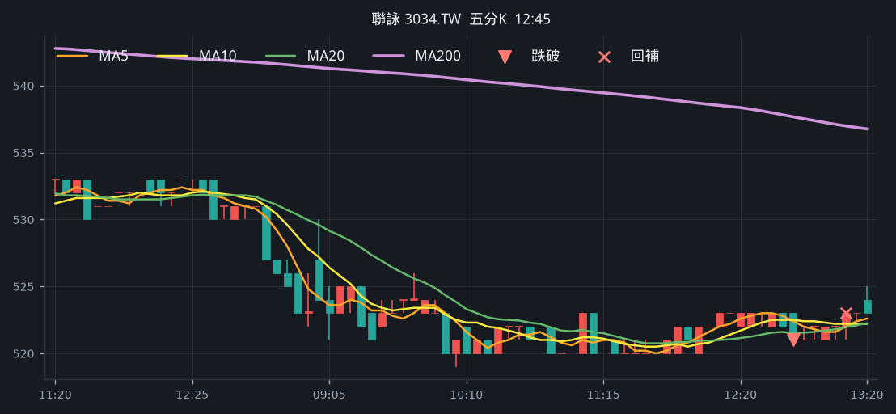

## 10. 力成 [6239.TW](https://tw.stock.yahoo.com/quote/6239.TW)

- 價格 274.50 -0.62%　成交額排名 #45 · 158.34 億
- 1分跌破 12:45　收 274.50 < MA200 274.75
- 1分 MA5 274.70 < MA10 274.80 < MA20 274.98　MA20/MA200 差 0.1%
- 五分收盤 / MA200　275.00 < 279.87（-1.7%）
- 回補 12:46 275.00（站回200 · 1 分）

**一分 K**

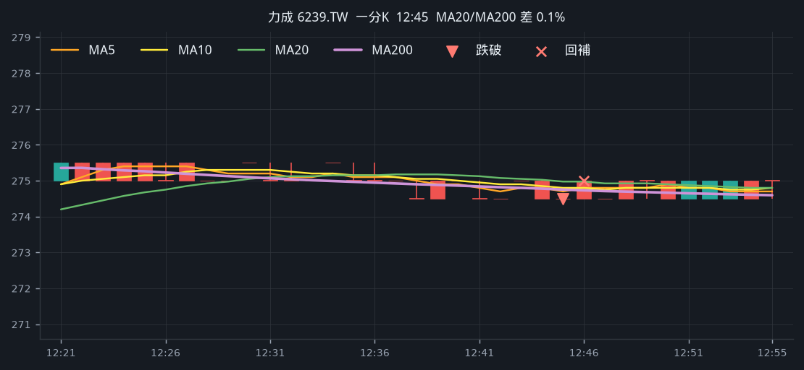

**五分 K（對照）**

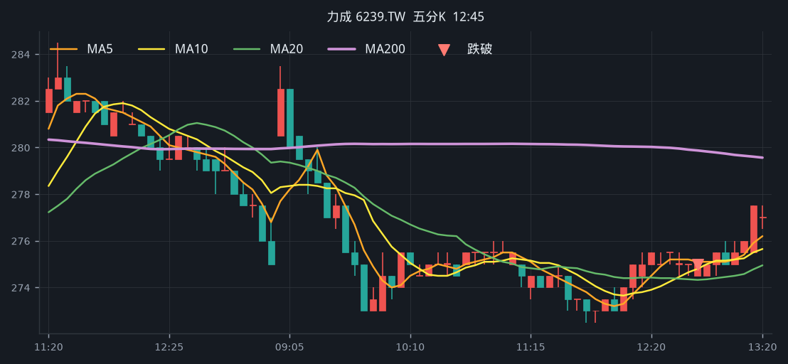

## 11. 晶技 [3042.TW](https://tw.stock.yahoo.com/quote/3042.TW)

- 價格 172.00 -0.73%　成交額排名 #69 · 102.72 億
- 1分跌破 12:43　收 172.00 < MA200 172.31
- 1分 MA5 172.20 < MA10 172.40 < MA20 172.47　MA20/MA200 差 0.1%
- 五分收盤 / MA200　171.50 < 178.72（-4.0%）
- 回補 12:49 172.50（站回200 · 6 分）

**一分 K**

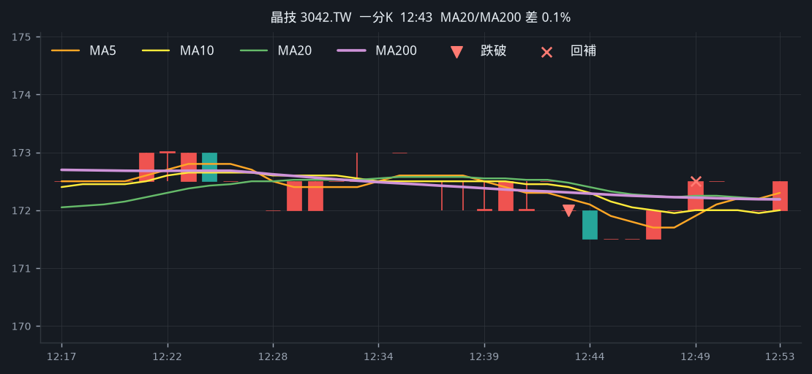

**五分 K（對照）**

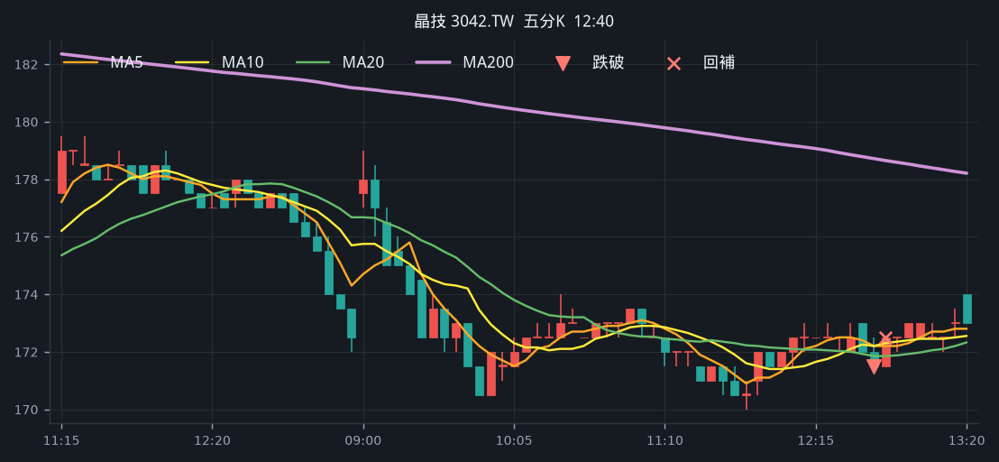

## 12. 力成 [6239.TW](https://tw.stock.yahoo.com/quote/6239.TW)

- 價格 274.50 -0.62%　成交額排名 #45 · 158.34 億
- 1分跌破 12:41　收 274.50 < MA200 274.84
- 1分 MA5 274.80 < MA10 274.95 < MA20 275.12　MA20/MA200 差 0.1%
- 五分收盤 / MA200　275.00 < 279.91（-1.8%）
- 回補 12:43 275.00（站回200 · 2 分）

**一分 K**

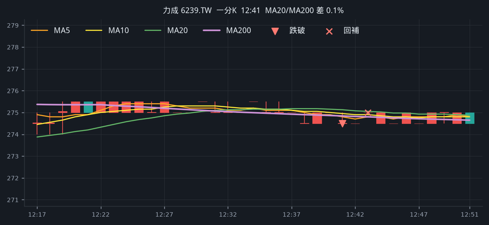

**五分 K（對照）**

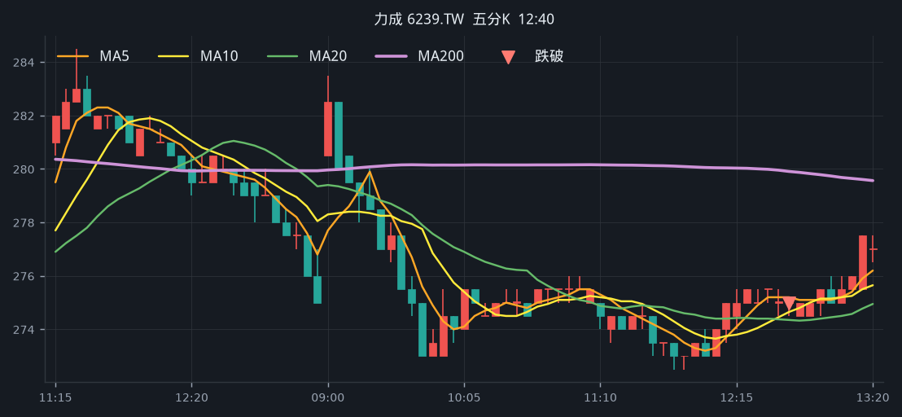

## 13. 晶技 [3042.TW](https://tw.stock.yahoo.com/quote/3042.TW)

- 價格 172.00 -0.73%　成交額排名 #69 · 102.72 億
- 1分跌破 12:41　收 172.00 < MA200 172.34
- 1分 MA5 172.30 < MA10 172.45 < MA20 172.53　MA20/MA200 差 0.1%
- 五分收盤 / MA200　171.50 < 178.72（-4.0%）
- 回補 12:42 172.50（站回200 · 1 分）

**一分 K**

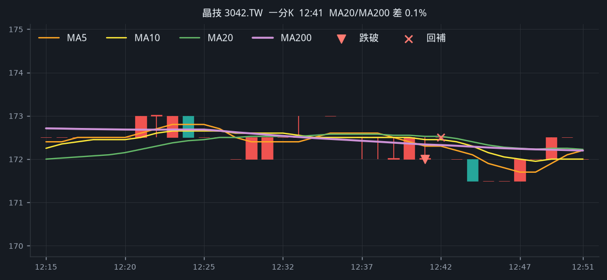

**五分 K（對照）**

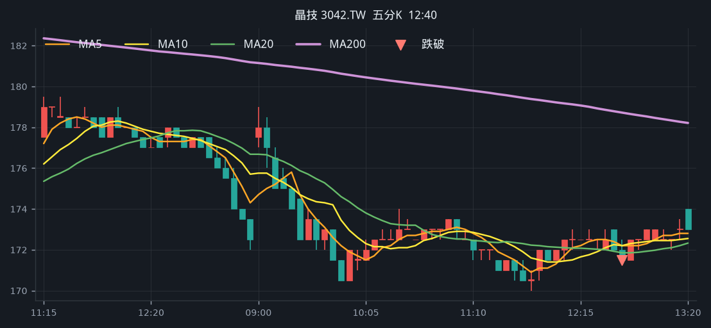

## 14. 創見 [2451.TW](https://tw.stock.yahoo.com/quote/2451.TW)

- 價格 282.50 -0.61%　成交額排名 —
- 1分跌破 12:40　收 282.50 < MA200 282.87
- 1分 MA5 282.60 < MA10 282.70 < MA20 282.75　MA20/MA200 差 -0.0%
- 五分收盤 / MA200　282.50 < 291.96（-3.2%）
- 回補 12:41 283.00（站回200 · 1 分）

**一分 K**

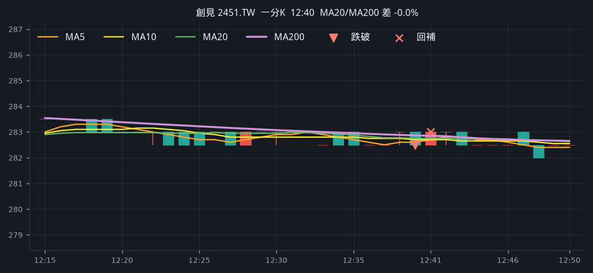

**五分 K（對照）**

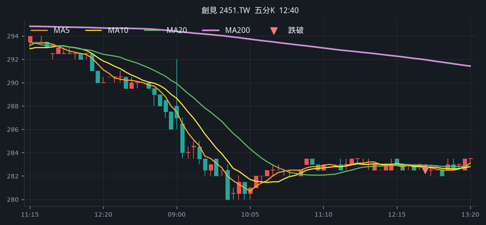

## 15. 國泰金 [2882.TW](https://tw.stock.yahoo.com/quote/2882.TW)

- 價格 113.50 -0.88%　成交額排名 #39 · 178.26 億
- 1分跌破 12:39　收 113.50 < MA200 113.88
- 1分 MA5 113.60 < MA10 113.65 < MA20 113.70　MA20/MA200 差 -0.2%
- 五分收盤 / MA200　113.50 > 111.56（+1.7%）
- 回補 12:41 114.00（站回200 · 2 分）

**一分 K**

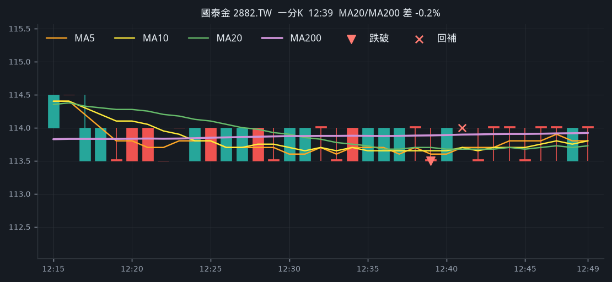

**五分 K（對照）**

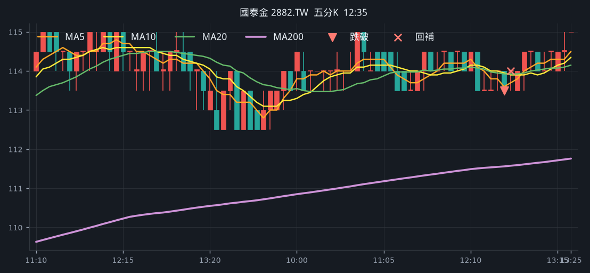

## 16. 力成 [6239.TW](https://tw.stock.yahoo.com/quote/6239.TW)

- 價格 274.50 -0.62%　成交額排名 #45 · 158.34 億
- 1分跌破 12:38　收 274.50 < MA200 274.90
- 1分 MA5 275.00 < MA10 275.05 < MA20 275.18　MA20/MA200 差 0.1%
- 五分收盤 / MA200　275.00 < 279.95（-1.8%）
- 回補 12:39 275.00（站回200 · 1 分）

**一分 K**

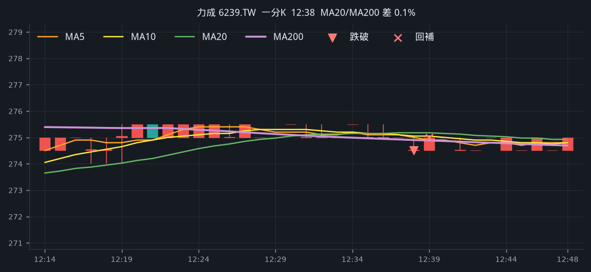

**五分 K（對照）**

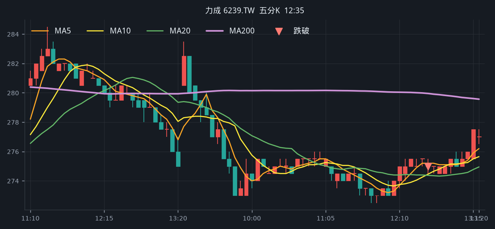

## 17. 聯詠 [3034.TW](https://tw.stock.yahoo.com/quote/3034.TW)

- 價格 522.00 -0.63%　成交額排名 #73 · 93.63 億
- 1分跌破 12:38　收 522.00 < MA200 522.91
- 1分 MA5 522.60 < MA10 522.70 < MA20 522.85　MA20/MA200 差 -0.0%
- 五分收盤 / MA200　523.00 < 537.97（-2.8%）
- 回補 12:39 523.00（站回200 · 1 分）

**一分 K**

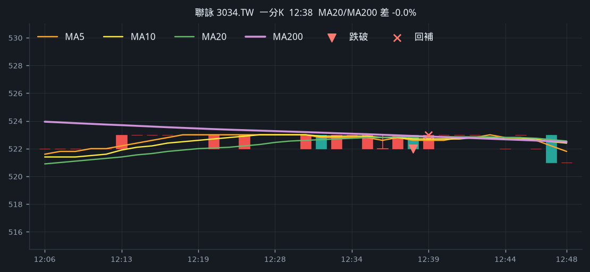

**五分 K（對照）**

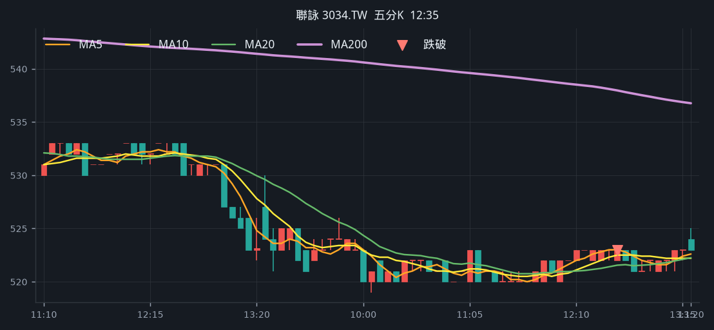

## 18. 中華電 [2412.TW](https://tw.stock.yahoo.com/quote/2412.TW)

- 價格 137.50 -0.80%　成交額排名 #83 · 73.23 億
- 1分跌破 12:37　收 137.50 < MA200 137.69
- 1分 MA5 137.60 < MA10 137.75 < MA20 137.80　MA20/MA200 差 0.1%
- 五分收盤 / MA200　138.00 > 136.84（+0.8%）
- 回補 12:39 138.00（站回200 · 2 分）

**一分 K**

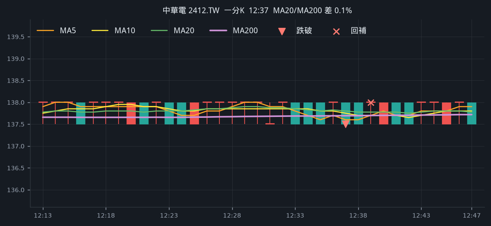

**五分 K（對照）**

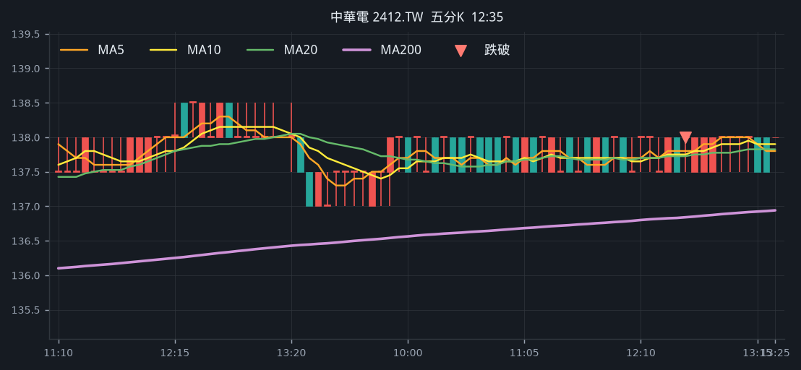

## 19. 國泰金 [2882.TW](https://tw.stock.yahoo.com/quote/2882.TW)

- 價格 113.50 -0.88%　成交額排名 #39 · 178.26 億
- 1分跌破 12:33　收 113.50 < MA200 113.88
- 1分 MA5 113.60 < MA10 113.65 < MA20 113.78　MA20/MA200 差 -0.1%
- 五分收盤 / MA200　114.00 > 111.55（+2.2%）
- 回補 12:34 114.00（站回200 · 1 分）

**一分 K**

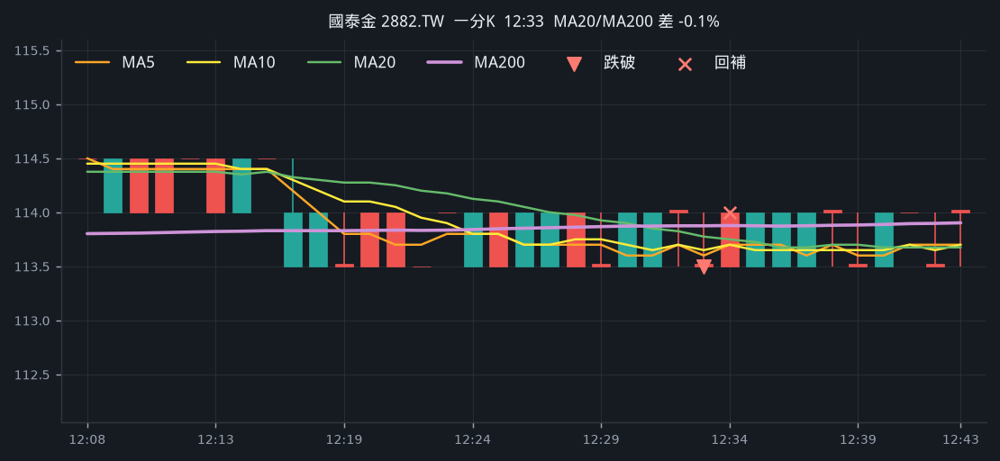

**五分 K（對照）**

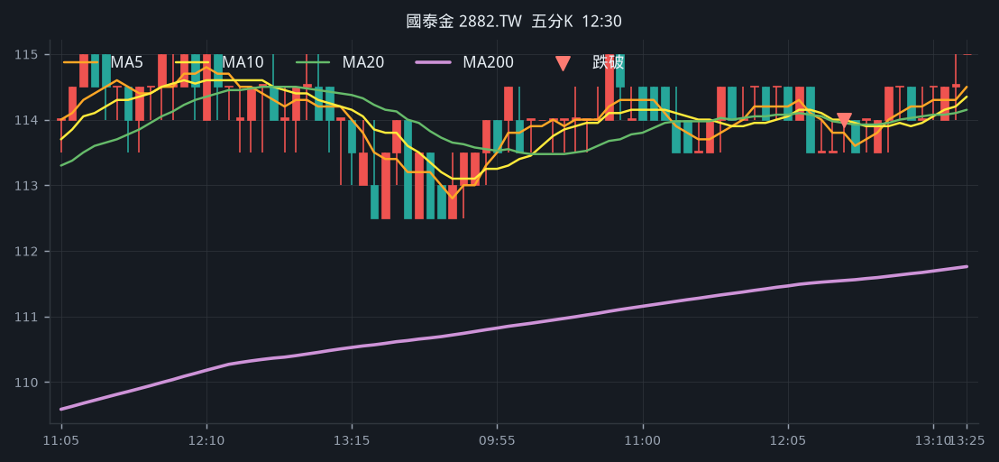

## 20. 富邦金 [2881.TW](https://tw.stock.yahoo.com/quote/2881.TW)

- 價格 149.50 -1.10%　成交額排名 #47 · 150.01 億
- 1分跌破 12:30　收 149.50 < MA200 149.71
- 1分 MA5 149.80 < MA10 149.85 < MA20 149.90　MA20/MA200 差 0.1%
- 五分收盤 / MA200　150.50 > 145.68（+3.3%）
- 回補 12:31 150.50（站回200 · 1 分）

**一分 K**

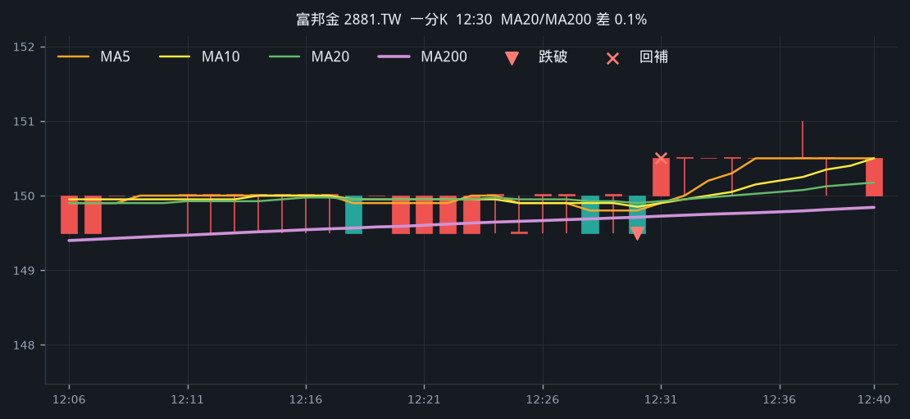

**五分 K（對照）**

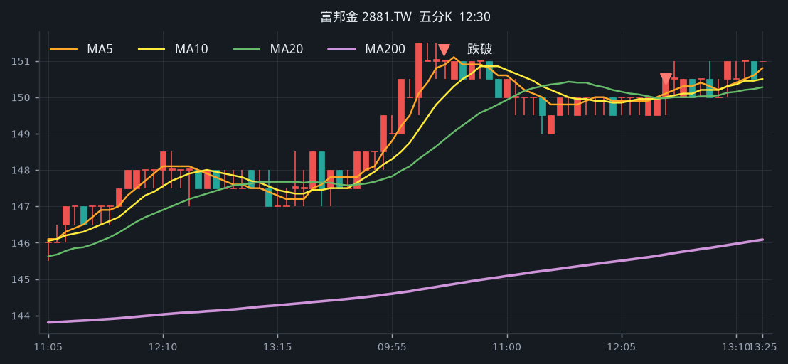

