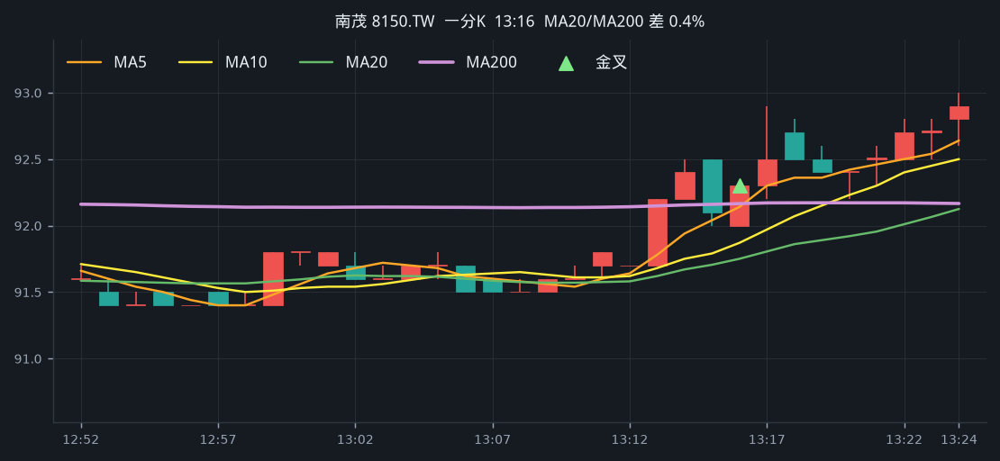
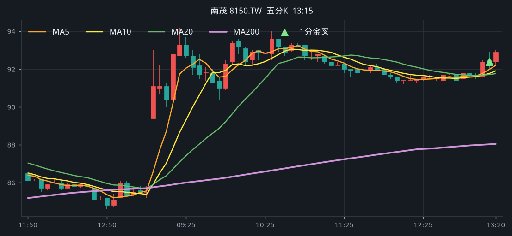
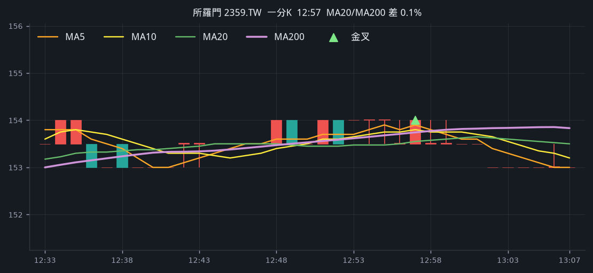
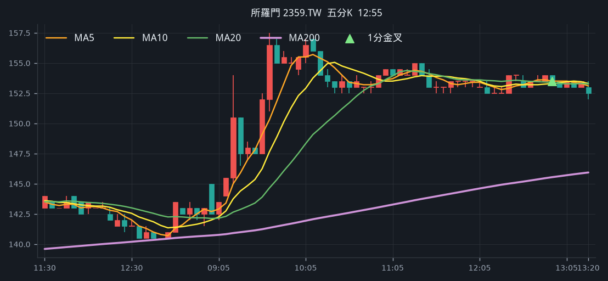
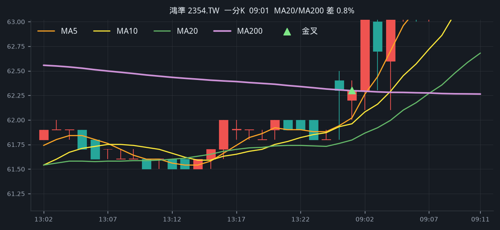
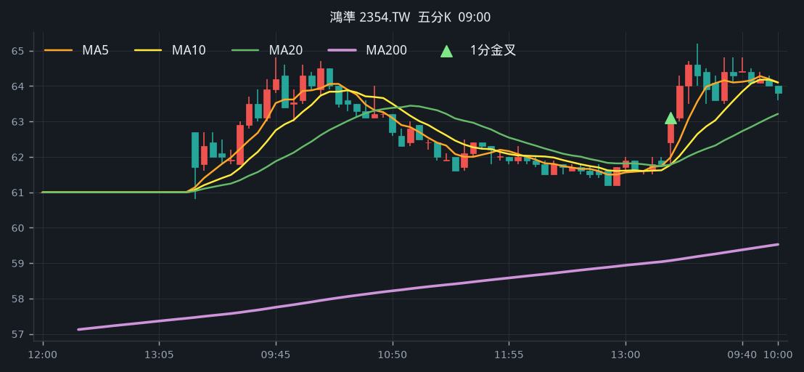

# 回測 2026-08-10（週一）· 一分K剛站上 MA200

用 2026-08-10（週一）當天上市＋上櫃成交額前 100（盤後），濾掉 ETF 與收盤價 650 以上。一分K MA5>MA10>MA20 且拉開（MA5−MA20 ≥ 0.2%），MA20 與 MA200 差距 ≤ 1.5%，且當日這根收盤剛站上 MA200；含該金叉的五分K收盤也必須高於五分 MA200。

- 命中 **8** 檔
- 掃描時間 2026-08-17 18:48:24（台北）
- 排行 2026-08-10 盤後成交額
- 前 100 → 濾掉股價 43、ETF 5 → 掃描 52 → 均線糾結 12 → MA20離MA200太遠 1 → 五分MA200底下 1

## 1. 南亞 [1303.TW](https://tw.stock.yahoo.com/quote/1303.TW)

- 價格 185.00 -1.60%　成交額排名 #7　198.49 億
- 1分金叉 09:50　收 187.00 > MA200 186.61
- 1分 MA5 187.90 > MA10 187.15 > MA20 185.72　MA20/MA200 差 0.5%
- 五分收盤 / MA200　187.00 > 177.72（+5.2%）

**一分 K**

**五分 K（對照）**

## 2. 日月光投控 [3711.TW](https://tw.stock.yahoo.com/quote/3711.TW)

- 價格 630.00 +7.69%　成交額排名 #9　179.60 億
- 1分金叉 13:17　收 629.00 > MA200 628.00
- 1分 MA5 629.40 > MA10 627.60 > MA20 624.75　MA20/MA200 差 0.5%
- 五分收盤 / MA200　627.00 > 602.18（+4.1%）

**一分 K**

**五分 K（對照）**

## 3. 臻鼎-KY [4958.TW](https://tw.stock.yahoo.com/quote/4958.TW)

- 價格 470.50 -0.53%　成交額排名 #12　163.56 億
- 1分金叉 10:02　收 477.50 > MA200 476.55
- 1分 MA5 476.90 > MA10 476.10 > MA20 474.98　MA20/MA200 差 0.3%
- 五分收盤 / MA200　477.00 > 474.31（+0.6%）

**一分 K**

**五分 K（對照）**

## 4. 威剛 [3260.TWO](https://tw.stock.yahoo.com/quote/3260.TWO)

- 價格 411.00 -1.20%　成交額排名 #55　47.31 億
- 1分金叉 10:07　收 420.50 > MA200 420.03
- 1分 MA5 421.10 > MA10 420.40 > MA20 419.90　MA20/MA200 差 0.0%
- 五分收盤 / MA200　420.50 > 412.08（+2.0%）

**一分 K**

**五分 K（對照）**

## 5. 南茂 [8150.TW](https://tw.stock.yahoo.com/quote/8150.TW)

- 價格 92.90 +7.65%　成交額排名 #67　36.22 億
- 1分金叉 13:16　收 92.30 > MA200 92.17
- 1分 MA5 92.14 > MA10 91.87 > MA20 91.75　MA20/MA200 差 0.4%
- 五分收盤 / MA200　92.40 > 88.03（+5.0%）

**一分 K**

**五分 K（對照）**

## 6. 晶技 [3042.TW](https://tw.stock.yahoo.com/quote/3042.TW)

- 價格 180.50 +7.44%　成交額排名 #90　25.42 億
- 1分金叉 12:42　收 180.00 > MA200 177.12
- 1分 MA5 176.70 > MA10 175.95 > MA20 175.03　MA20/MA200 差 1.2%
- 五分收盤 / MA200　181.00 > 174.49（+3.7%）

**一分 K**

**五分 K（對照）**

## 7. 所羅門 [2359.TW](https://tw.stock.yahoo.com/quote/2359.TW)

- 價格 153.50 +6.97%　成交額排名 #91　24.83 億
- 1分金叉 12:57　收 154.00 > MA200 153.74
- 1分 MA5 153.90 > MA10 153.80 > MA20 153.55　MA20/MA200 差 0.1%
- 五分收盤 / MA200　153.50 > 145.54（+5.5%）

**一分 K**

**五分 K（對照）**

## 8. 鴻準 [2354.TW](https://tw.stock.yahoo.com/quote/2354.TW)

- 價格 63.10 +2.10%　成交額排名 #93　23.98 億
- 1分金叉 09:01　收 62.30 > MA200 62.30
- 1分 MA5 62.02 > MA10 61.96 > MA20 61.79　MA20/MA200 差 0.8%
- 五分收盤 / MA200　63.10 > 59.07（+6.8%）

**一分 K**

**五分 K（對照）**

