# 回測 2026-08-10（週一）· 一分K剛站上 MA200

用 2026-08-10（週一）當天上市＋上櫃成交額前 100（盤後），濾掉 ETF 與收盤價 650 以上。一分K MA5>MA10>MA20 且拉開（MA5−MA20 ≥ 0.2%），MA20 與 MA200 差距 ≤ 1.5%，且當天第一根收盤剛站上 MA200（開盤跳空不算）；含該金叉的五分K收盤也必須高於五分 MA200。

- 命中 **8** 檔
- 掃描時間 2026-08-17 20:28:36（台北）
- 排行 2026-08-10 盤後成交額
- 前 100 → 濾掉股價 43、ETF 5 → 掃描 52 → 均線糾結 10 → MA20離MA200太遠 1 → 五分MA200底下 2

## 1. 南亞 [1303.TW](https://tw.stock.yahoo.com/quote/1303.TW)

- 價格 185.00 -1.60%　成交額排名 #7　198.49 億
- 1分金叉 09:44　收 187.00 > MA200 186.56
- 1分 MA5 185.90 > MA10 185.25 > MA20 184.78　MA20/MA200 差 1.0%
- 五分收盤 / MA200　187.00 > 177.54（+5.3%）

**一分 K**

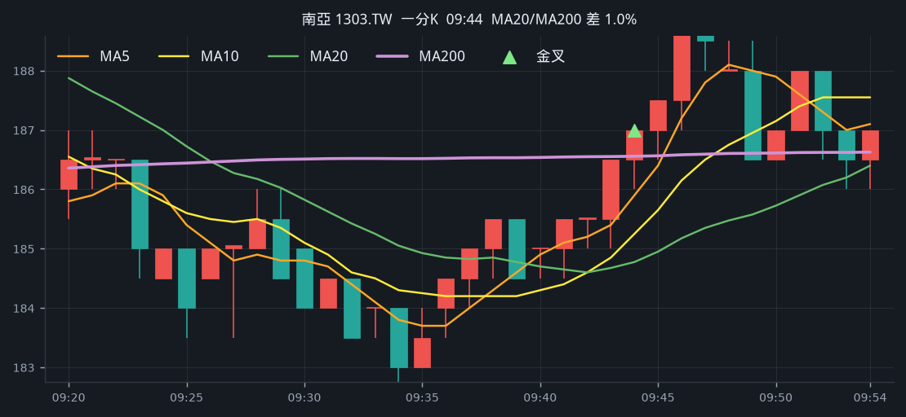

**五分 K（對照）**

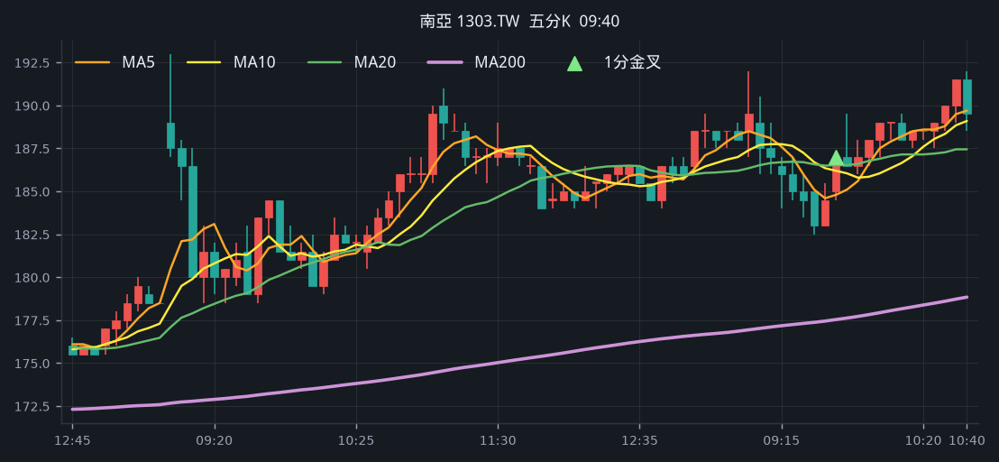

## 2. 日月光投控 [3711.TW](https://tw.stock.yahoo.com/quote/3711.TW)

- 價格 630.00 +7.69%　成交額排名 #9　179.60 億
- 1分金叉 13:14　收 629.00 > MA200 628.14
- 1分 MA5 627.00 > MA10 625.80 > MA20 623.40　MA20/MA200 差 0.8%
- 五分收盤 / MA200　629.00 > 602.10（+4.5%）

**一分 K**

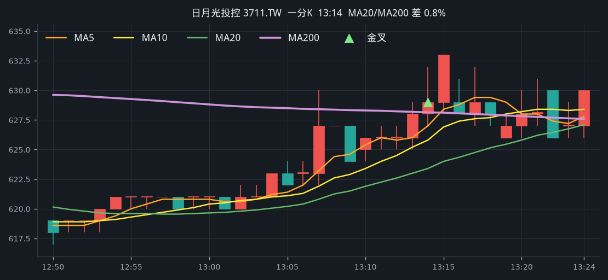

**五分 K（對照）**

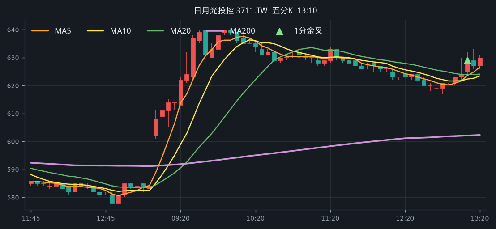

## 3. 臻鼎-KY [4958.TW](https://tw.stock.yahoo.com/quote/4958.TW)

- 價格 470.50 -0.53%　成交額排名 #12　163.56 億
- 1分金叉 10:00　收 477.50 > MA200 476.61
- 1分 MA5 476.50 > MA10 475.65 > MA20 474.60　MA20/MA200 差 0.4%
- 五分收盤 / MA200　477.00 > 474.31（+0.6%）

**一分 K**

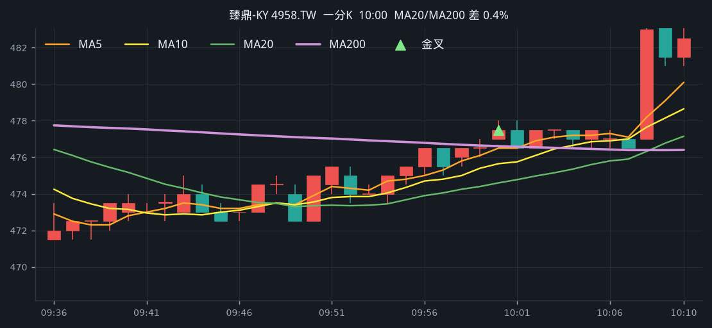

**五分 K（對照）**

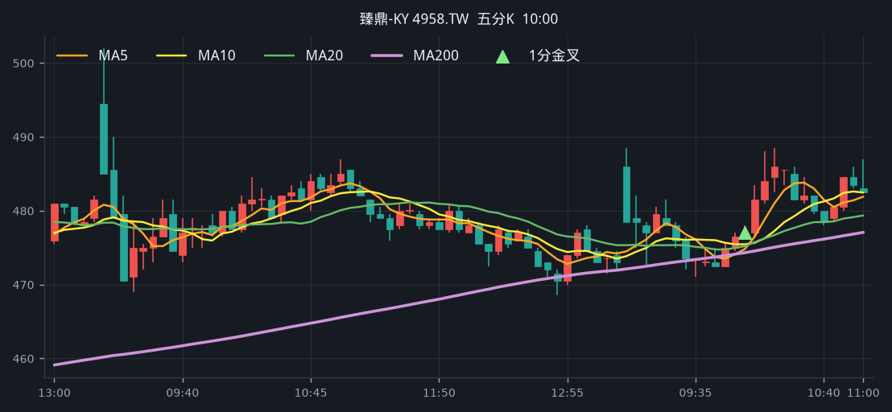

## 4. 鈺創 [5351.TWO](https://tw.stock.yahoo.com/quote/5351.TWO)

- 價格 114.00 +9.62%　成交額排名 #50　50.13 億
- 1分金叉 09:05　收 105.50 > MA200 105.10
- 1分 MA5 104.80 > MA10 104.15 > MA20 103.88　MA20/MA200 差 1.2%
- 五分收盤 / MA200　106.50 > 98.08（+8.6%）

**一分 K**

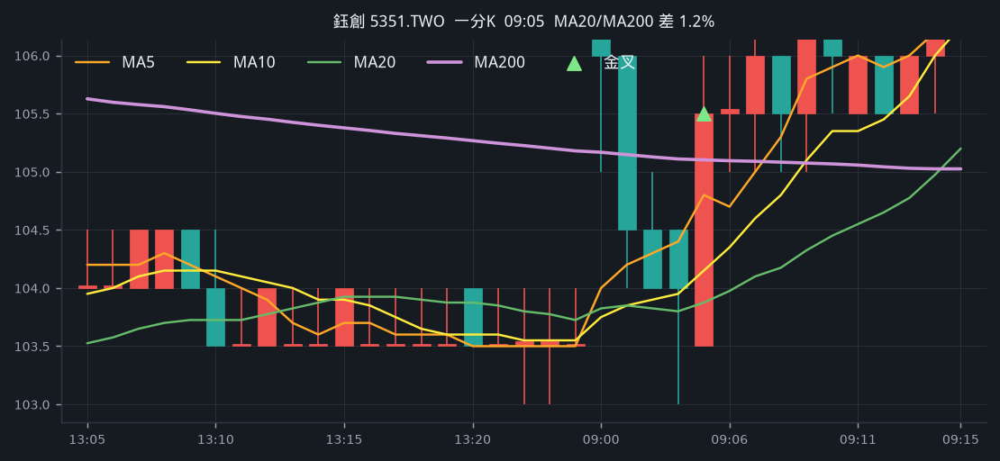

**五分 K（對照）**

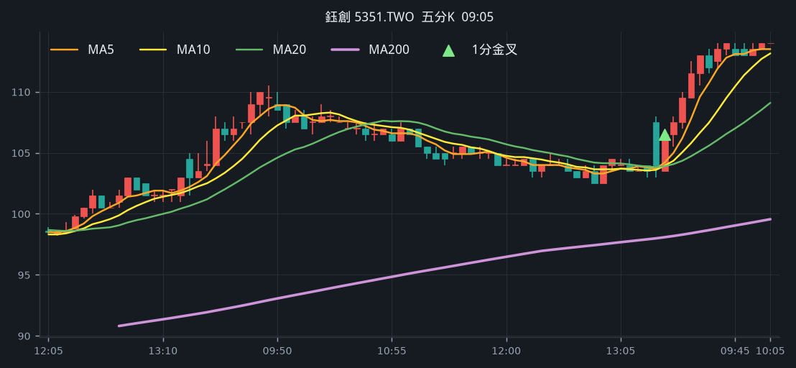

## 5. 威剛 [3260.TWO](https://tw.stock.yahoo.com/quote/3260.TWO)

- 價格 411.00 -1.20%　成交額排名 #55　47.31 億
- 1分金叉 10:07　收 420.50 > MA200 420.03
- 1分 MA5 421.10 > MA10 420.40 > MA20 419.90　MA20/MA200 差 0.0%
- 五分收盤 / MA200　420.50 > 412.08（+2.0%）

**一分 K**

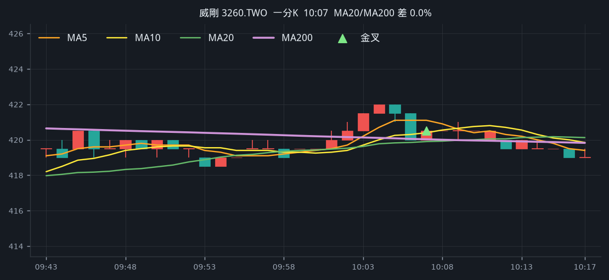

**五分 K（對照）**

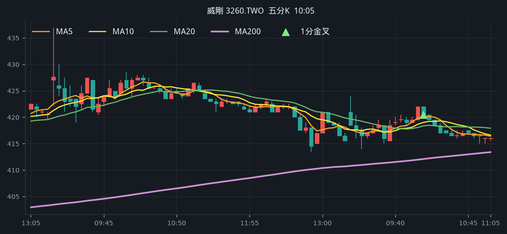

## 6. 上銀 [2049.TW](https://tw.stock.yahoo.com/quote/2049.TW)

- 價格 387.00 +0.00%　成交額排名 #70　34.63 億
- 1分金叉 09:44　收 385.50 > MA200 385.15
- 1分 MA5 383.80 > MA10 382.85 > MA20 380.40　MA20/MA200 差 1.2%
- 五分收盤 / MA200　385.50 > 366.23（+5.3%）

**一分 K**

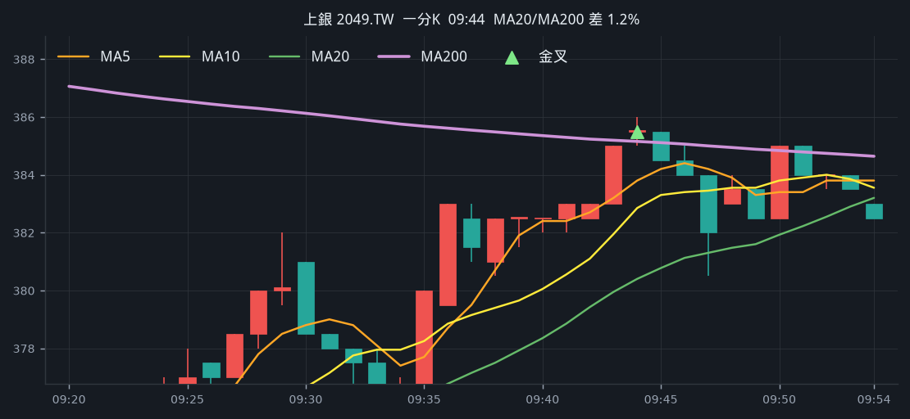

**五分 K（對照）**

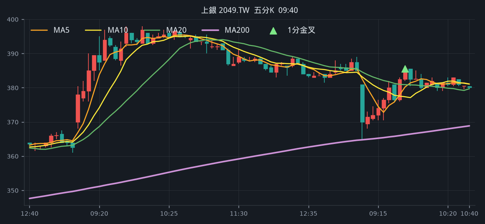

## 7. 盟立 [2464.TW](https://tw.stock.yahoo.com/quote/2464.TW)

- 價格 180.00 +3.75%　成交額排名 #78　30.29 億
- 1分金叉 12:11　收 180.50 > MA200 180.20
- 1分 MA5 180.50 > MA10 179.95 > MA20 179.75　MA20/MA200 差 0.3%
- 五分收盤 / MA200　180.00 > 175.59（+2.5%）

**一分 K**

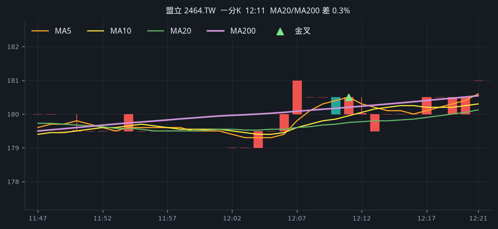

**五分 K（對照）**

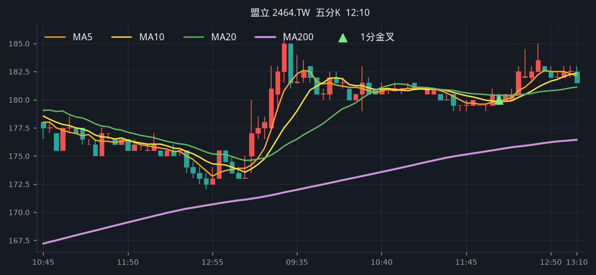

## 8. 晶技 [3042.TW](https://tw.stock.yahoo.com/quote/3042.TW)

- 價格 180.50 +7.44%　成交額排名 #90　25.42 億
- 1分金叉 12:42　收 180.00 > MA200 177.12
- 1分 MA5 176.70 > MA10 175.95 > MA20 175.03　MA20/MA200 差 1.2%
- 五分收盤 / MA200　181.00 > 174.49（+3.7%）

**一分 K**

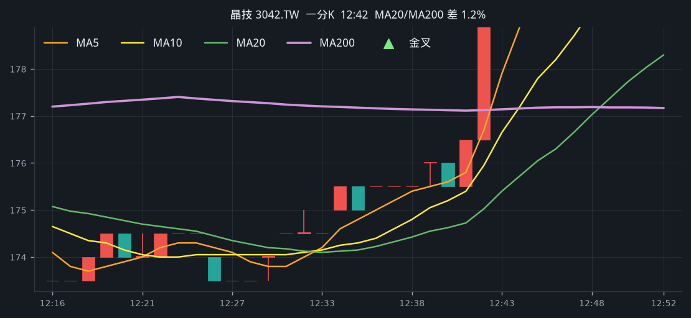

**五分 K（對照）**

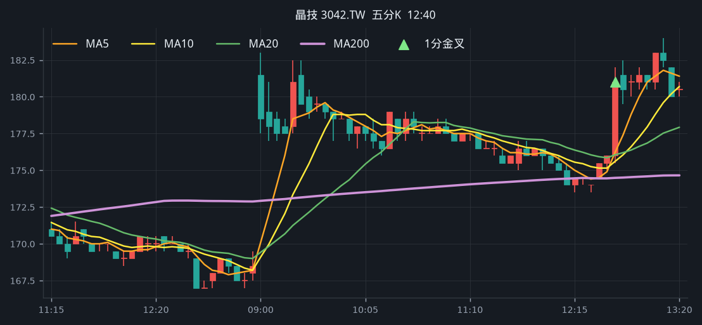

