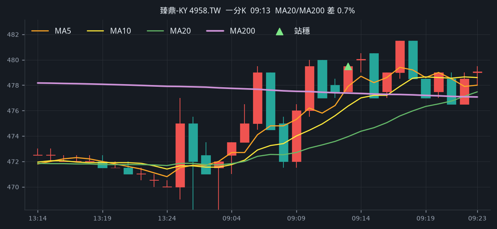
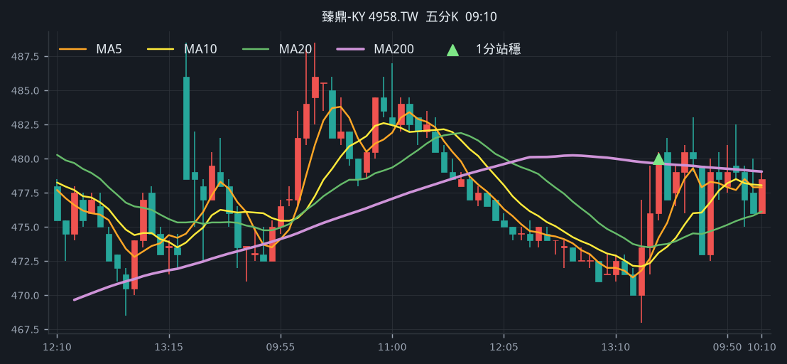
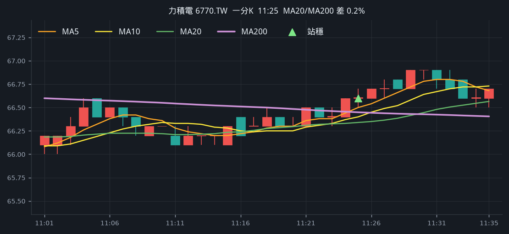
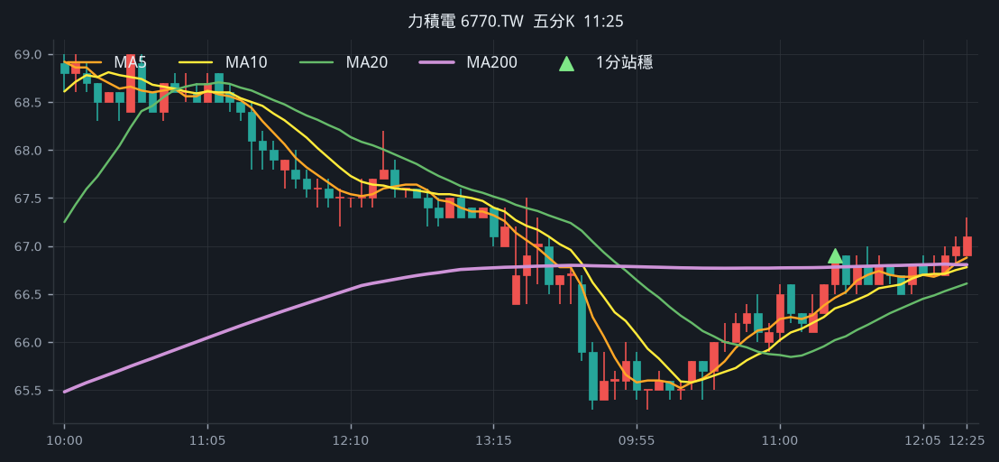
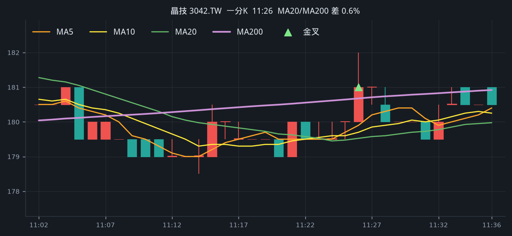
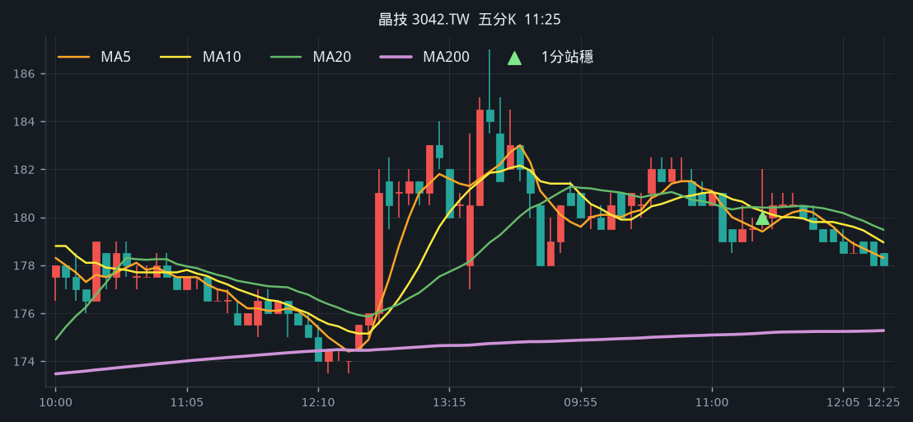
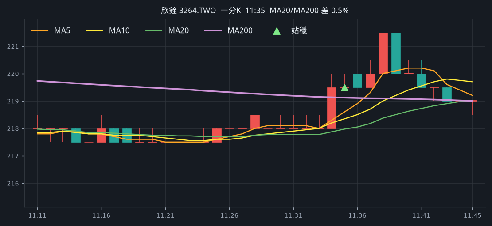
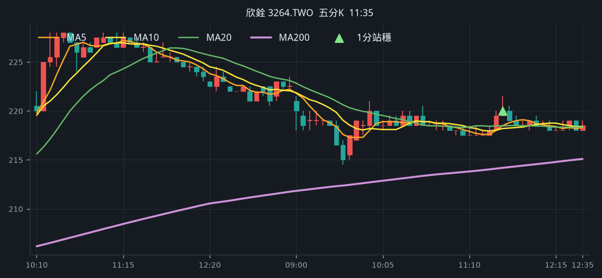

# 回測 2026-08-11（週二）· 一分K站穩 MA200

用 2026-08-11（週二）當天上市＋上櫃成交額前 100（盤後），濾掉 ETF、金融股與收盤價 650 以上。一分K MA5>MA10>MA20 且拉開（MA5−MA20 ≥ 0.2%），MA20 與 MA200 差距 ≤ 1.5%，且當天第一根剛站上 MA200、連續兩根收盤站穩再通知（開盤跳空不算）；含該根的五分K收盤也必須高於五分 MA200。

- 命中 **19** 檔
- 掃描時間 2026-08-17 20:44:05（台北）
- 排行 2026-08-11 盤後成交額
- 前 100 → 濾掉股價 39、ETF 5、金融 2 → 掃描 54 → 均線糾結 7 → MA20離MA200太遠 2 → 五分MA200底下 7

## 1. 華邦電 [2344.TW](https://tw.stock.yahoo.com/quote/2344.TW)

- 價格 178.00 -0.84%　成交額排名 #5　344.63 億
- 1分站穩 10:48　收 177.50 > MA200 177.36
- 1分 MA5 176.90 > MA10 176.40 > MA20 176.22　MA20/MA200 差 0.6%
- 五分收盤 / MA200　178.00 > 170.63（+4.3%）

**一分 K**

**五分 K（對照）**

## 2. 旺宏 [2337.TW](https://tw.stock.yahoo.com/quote/2337.TW)

- 價格 132.50 -0.75%　成交額排名 #7　194.45 億
- 1分站穩 12:29　收 132.50 > MA200 132.17
- 1分 MA5 132.20 > MA10 132.00 > MA20 131.88　MA20/MA200 差 0.2%
- 五分收盤 / MA200　132.50 > 128.36（+3.2%）

**一分 K**

**五分 K（對照）**

## 3. 南亞 [1303.TW](https://tw.stock.yahoo.com/quote/1303.TW)

- 價格 190.00 +2.70%　成交額排名 #9　187.58 億
- 1分站穩 10:35　收 183.50 > MA200 183.10
- 1分 MA5 183.00 > MA10 182.30 > MA20 181.28　MA20/MA200 差 1.0%
- 五分收盤 / MA200　184.00 > 181.94（+1.1%）

**一分 K**

**五分 K（對照）**

## 4. 臻鼎-KY [4958.TW](https://tw.stock.yahoo.com/quote/4958.TW)

- 價格 490.00 +4.14%　成交額排名 #12　161.28 億
- 1分站穩 09:13　收 479.50 > MA200 477.38
- 1分 MA5 477.90 > MA10 476.35 > MA20 473.95　MA20/MA200 差 0.7%
- 五分收盤 / MA200　480.00 > 479.65（+0.1%）

**一分 K**

**五分 K（對照）**

## 5. 光寶科 [2301.TW](https://tw.stock.yahoo.com/quote/2301.TW)

- 價格 268.50 -1.10%　成交額排名 #16　131.47 億
- 1分站穩 13:00　收 269.00 > MA200 268.32
- 1分 MA5 268.30 > MA10 267.75 > MA20 267.60　MA20/MA200 差 0.3%
- 五分收盤 / MA200　268.50 > 260.96（+2.9%）

**一分 K**

**五分 K（對照）**

## 6. 聯電 [2303.TW](https://tw.stock.yahoo.com/quote/2303.TW)

- 價格 123.00 +0.00%　成交額排名 #24　97.53 億
- 1分站穩 09:15　收 123.50 > MA200 122.34
- 1分 MA5 122.80 > MA10 122.35 > MA20 122.15　MA20/MA200 差 0.2%
- 五分收盤 / MA200　123.00 > 120.23（+2.3%）

**一分 K**

**五分 K（對照）**

## 7. 南茂 [8150.TW](https://tw.stock.yahoo.com/quote/8150.TW)

- 價格 99.00 +6.57%　成交額排名 #25　96.35 億
- 1分站穩 10:48　收 92.90 > MA200 92.42
- 1分 MA5 92.56 > MA10 92.37 > MA20 92.17　MA20/MA200 差 0.3%
- 五分收盤 / MA200　92.70 > 88.59（+4.6%）

**一分 K**

**五分 K（對照）**

## 8. 力積電 [6770.TW](https://tw.stock.yahoo.com/quote/6770.TW)

- 價格 67.00 -0.89%　成交額排名 #31　73.64 億
- 1分站穩 11:25　收 66.60 > MA200 66.45
- 1分 MA5 66.50 > MA10 66.40 > MA20 66.34　MA20/MA200 差 0.2%
- 五分收盤 / MA200　66.90 > 66.78（+0.2%）

**一分 K**

**五分 K（對照）**

## 9. 精材 [3374.TWO](https://tw.stock.yahoo.com/quote/3374.TWO)

- 價格 334.00 -0.89%　成交額排名 #38　65.77 億
- 1分站穩 10:45　收 338.00 > MA200 333.98
- 1分 MA5 335.10 > MA10 334.10 > MA20 332.18　MA20/MA200 差 0.5%
- 五分收盤 / MA200　334.50 > 320.81（+4.3%）

**一分 K**

**五分 K（對照）**

## 10. 新盛力 [4931.TWO](https://tw.stock.yahoo.com/quote/4931.TWO)

- 價格 255.00 +7.14%　成交額排名 #48　53.42 億
- 1分站穩 12:37　收 254.00 > MA200 253.00
- 1分 MA5 252.30 > MA10 251.55 > MA20 250.97　MA20/MA200 差 0.8%
- 五分收盤 / MA200　254.50 > 232.10（+9.7%）

**一分 K**

**五分 K（對照）**

## 11. 盟立 [2464.TW](https://tw.stock.yahoo.com/quote/2464.TW)

- 價格 187.50 +4.17%　成交額排名 #51　50.39 億
- 1分站穩 12:05　收 188.00 > MA200 187.11
- 1分 MA5 187.10 > MA10 186.65 > MA20 186.38　MA20/MA200 差 0.4%
- 五分收盤 / MA200　188.00 > 179.94（+4.5%）

**一分 K**

**五分 K（對照）**

## 12. 世界 [5347.TWO](https://tw.stock.yahoo.com/quote/5347.TWO)

- 價格 158.00 +0.32%　成交額排名 #57　41.41 億
- 1分站穩 10:31　收 157.00 > MA200 156.80
- 1分 MA5 156.40 > MA10 156.20 > MA20 155.72　MA20/MA200 差 0.7%
- 五分收盤 / MA200　157.50 > 152.43（+3.3%）

**一分 K**

**五分 K（對照）**

## 13. 強茂 [2481.TW](https://tw.stock.yahoo.com/quote/2481.TW)

- 價格 141.50 +2.91%　成交額排名 #62　34.34 億
- 1分站穩 10:31　收 138.50 > MA200 138.39
- 1分 MA5 138.30 > MA10 138.25 > MA20 137.57　MA20/MA200 差 0.6%
- 五分收盤 / MA200　139.50 > 136.72（+2.0%）

**一分 K**

**五分 K（對照）**

## 14. 啟碁 [6285.TW](https://tw.stock.yahoo.com/quote/6285.TW)

- 價格 254.00 -0.78%　成交額排名 #80　25.58 億
- 1分站穩 10:23　收 256.00 > MA200 254.35
- 1分 MA5 254.40 > MA10 253.85 > MA20 253.38　MA20/MA200 差 0.4%
- 五分收盤 / MA200　256.00 > 248.57（+3.0%）

**一分 K**

**五分 K（對照）**

## 15. 晶技 [3042.TW](https://tw.stock.yahoo.com/quote/3042.TW)

- 價格 179.00 -0.83%　成交額排名 #87　22.08 億
- 1分站穩 11:27　收 181.00 > MA200 180.71
- 1分 MA5 180.20 > MA10 179.85 > MA20 179.57　MA20/MA200 差 0.6%
- 五分收盤 / MA200　180.00 > 175.17（+2.8%）

**一分 K**

**五分 K（對照）**

## 16. 矽力*-KY [6415.TW](https://tw.stock.yahoo.com/quote/6415.TW)

- 價格 466.50 +0.32%　成交額排名 #89　21.38 億
- 1分站穩 10:34　收 466.00 > MA200 465.90
- 1分 MA5 465.50 > MA10 464.75 > MA20 464.07　MA20/MA200 差 0.4%
- 五分收盤 / MA200　466.00 > 448.71（+3.9%）

**一分 K**

**五分 K（對照）**

## 17. 大毅 [2478.TW](https://tw.stock.yahoo.com/quote/2478.TW)

- 價格 121.00 -0.82%　成交額排名 #93　20.89 億
- 1分站穩 10:40　收 124.50 > MA200 122.72
- 1分 MA5 123.10 > MA10 122.25 > MA20 121.85　MA20/MA200 差 0.7%
- 五分收盤 / MA200　124.50 > 119.62（+4.1%）

**一分 K**

**五分 K（對照）**

## 18. 欣銓 [3264.TWO](https://tw.stock.yahoo.com/quote/3264.TWO)

- 價格 219.50 -1.35%　成交額排名 #94　20.80 億
- 1分站穩 11:35　收 219.50 > MA200 219.12
- 1分 MA5 218.60 > MA10 218.35 > MA20 217.97　MA20/MA200 差 0.5%
- 五分收盤 / MA200　220.00 > 214.19（+2.7%）

**一分 K**

**五分 K（對照）**

## 19. 德宏 [5475.TWO](https://tw.stock.yahoo.com/quote/5475.TWO)

- 價格 135.00 +8.00%　成交額排名 #96　20.68 億
- 1分站穩 11:34　收 133.00 > MA200 132.85
- 1分 MA5 132.90 > MA10 132.80 > MA20 132.28　MA20/MA200 差 0.4%
- 五分收盤 / MA200　133.00 > 126.35（+5.3%）

**一分 K**

**五分 K（對照）**

