# 回測 2026-08-11（週二）· 一分K剛站上 MA200

用 2026-08-11（週二）當天上市＋上櫃成交額前 100（盤後），濾掉 ETF 與收盤價 650 以上。一分K MA5>MA10>MA20 且拉開（MA5−MA20 ≥ 0.2%），MA20 與 MA200 差距 ≤ 1.5%，且當日這根收盤剛站上 MA200；含該金叉的五分K收盤也必須高於五分 MA200。

- 命中 **18** 檔
- 掃描時間 2026-08-17 18:48:32（台北）
- 排行 2026-08-11 盤後成交額
- 前 100 → 濾掉股價 39、ETF 5 → 掃描 56 → 均線糾結 16 → MA20離MA200太遠 2 → 五分MA200底下 6

## 1. 南亞科 [2408.TW](https://tw.stock.yahoo.com/quote/2408.TW)

- 價格 489.00 -2.59%　成交額排名 #1　556.26 億
- 1分金叉 13:23　收 485.50 > MA200 485.43
- 1分 MA5 485.30 > MA10 485.10 > MA20 484.32　MA20/MA200 差 0.2%
- 五分收盤 / MA200　486.50 > 475.04（+2.4%）

**一分 K**

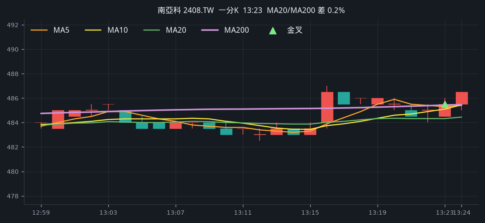

**五分 K（對照）**

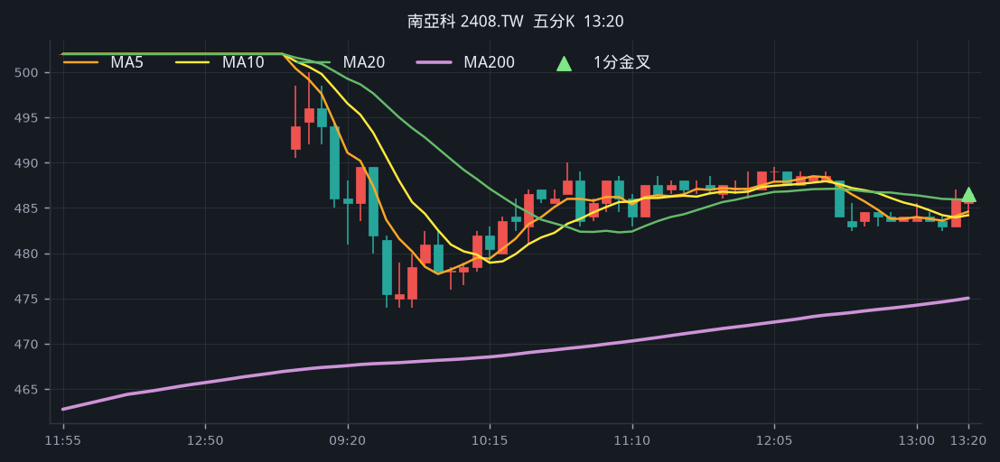

## 2. 華邦電 [2344.TW](https://tw.stock.yahoo.com/quote/2344.TW)

- 價格 178.00 -0.84%　成交額排名 #5　344.63 億
- 1分金叉 10:47　收 177.50 > MA200 177.37
- 1分 MA5 176.60 > MA10 176.20 > MA20 176.12　MA20/MA200 差 0.7%
- 五分收盤 / MA200　178.00 > 170.63（+4.3%）

**一分 K**

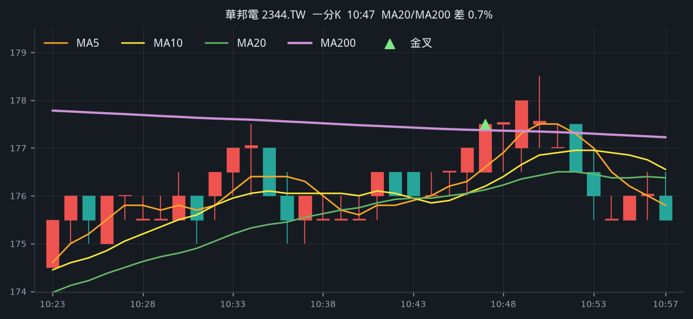

**五分 K（對照）**

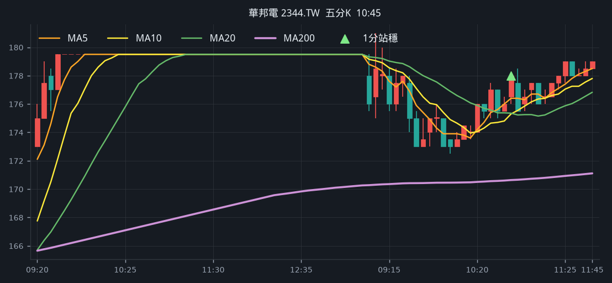

## 3. 旺宏 [2337.TW](https://tw.stock.yahoo.com/quote/2337.TW)

- 價格 132.50 -0.75%　成交額排名 #7　194.45 億
- 1分金叉 12:28　收 132.50 > MA200 132.19
- 1分 MA5 132.10 > MA10 131.95 > MA20 131.82　MA20/MA200 差 0.3%
- 五分收盤 / MA200　132.50 > 128.36（+3.2%）

**一分 K**

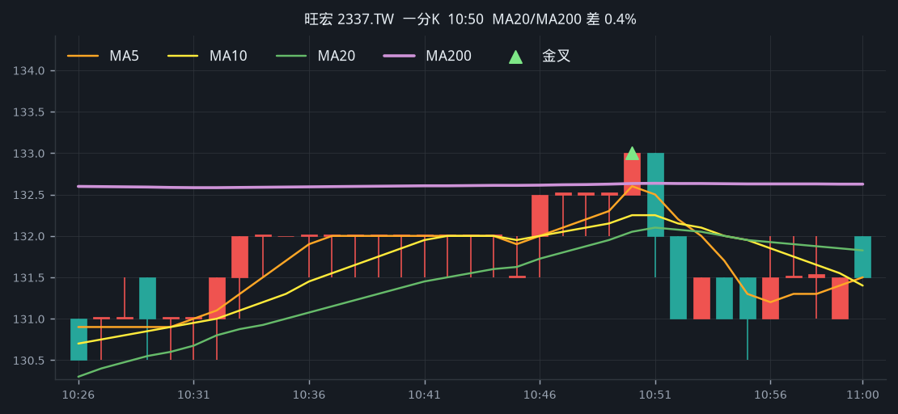

**五分 K（對照）**

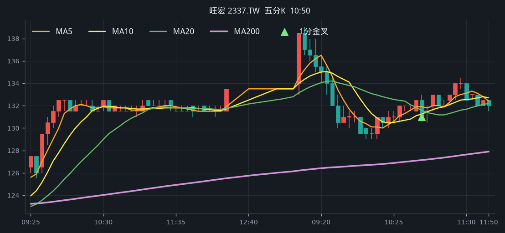

## 4. 南亞 [1303.TW](https://tw.stock.yahoo.com/quote/1303.TW)

- 價格 190.00 +2.70%　成交額排名 #9　187.58 億
- 1分金叉 11:11　收 182.50 > MA200 182.25
- 1分 MA5 182.50 > MA10 182.40 > MA20 181.70　MA20/MA200 差 0.3%
- 五分收盤 / MA200　183.00 > 182.16（+0.5%）

**一分 K**

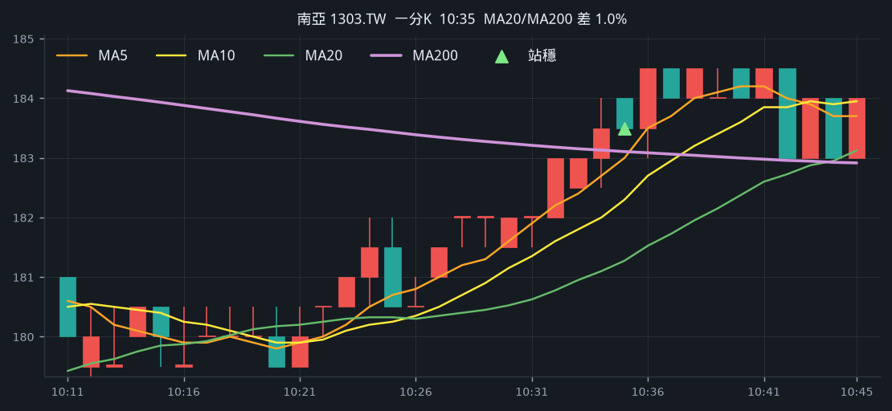

**五分 K（對照）**

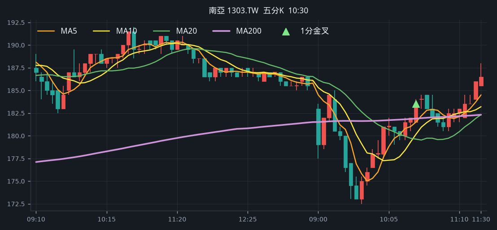

## 5. 光寶科 [2301.TW](https://tw.stock.yahoo.com/quote/2301.TW)

- 價格 268.50 -1.10%　成交額排名 #16　131.47 億
- 1分金叉 13:06　收 268.50 > MA200 268.36
- 1分 MA5 268.60 > MA10 268.55 > MA20 267.98　MA20/MA200 差 0.1%
- 五分收盤 / MA200　267.50 > 261.03（+2.5%）

**一分 K**

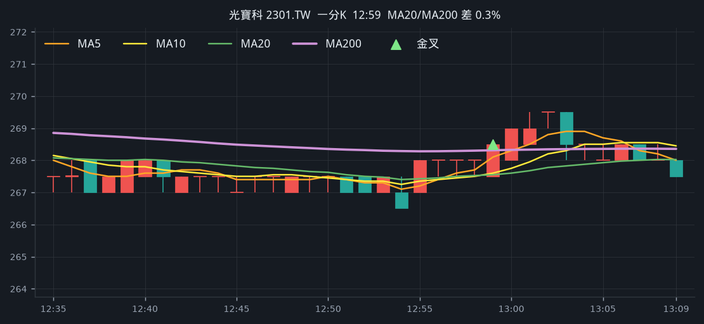

**五分 K（對照）**

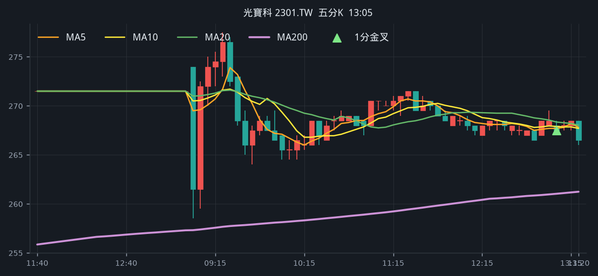

## 6. 友達 [2409.TW](https://tw.stock.yahoo.com/quote/2409.TW)

- 價格 26.10 -3.33%　成交額排名 #18　122.84 億
- 1分金叉 09:04　收 27.05 > MA200 27.00
- 1分 MA5 27.08 > MA10 27.04 > MA20 27.02　MA20/MA200 差 0.1%
- 五分收盤 / MA200　27.05 > 25.11（+7.7%）

**一分 K**

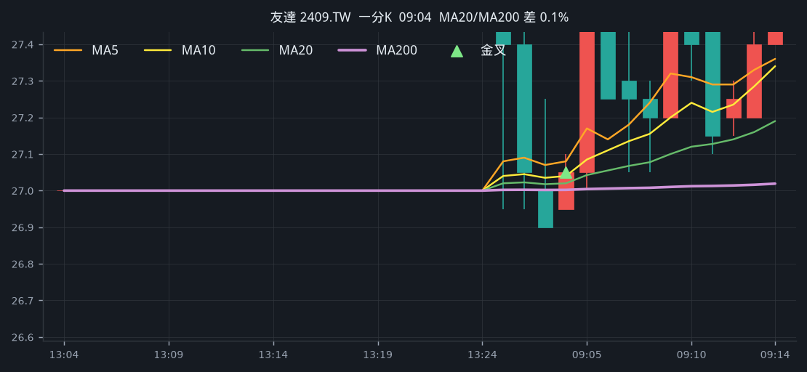

**五分 K（對照）**

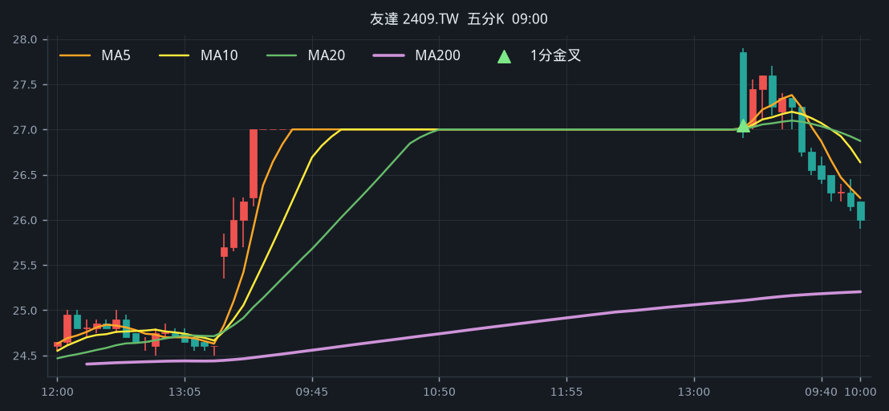

## 7. 力成 [6239.TW](https://tw.stock.yahoo.com/quote/6239.TW)

- 價格 282.50 -2.08%　成交額排名 #20　112.84 億
- 1分金叉 11:06　收 283.50 > MA200 283.50
- 1分 MA5 281.60 > MA10 280.45 > MA20 279.90　MA20/MA200 差 1.3%
- 五分收盤 / MA200　282.50 > 271.82（+3.9%）

**一分 K**

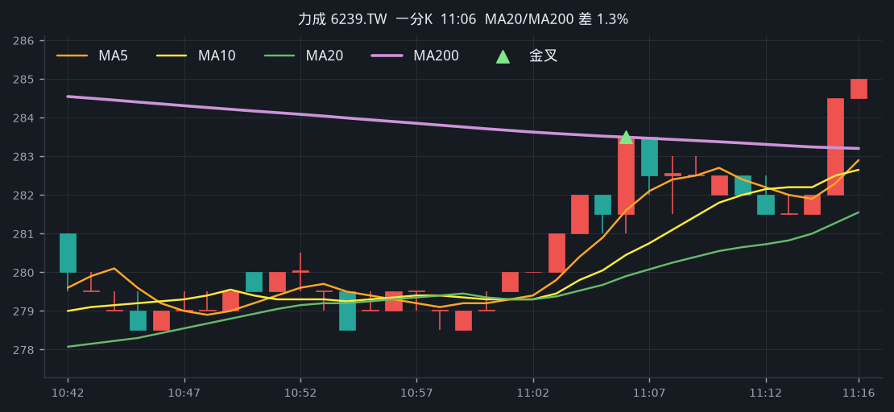

**五分 K（對照）**

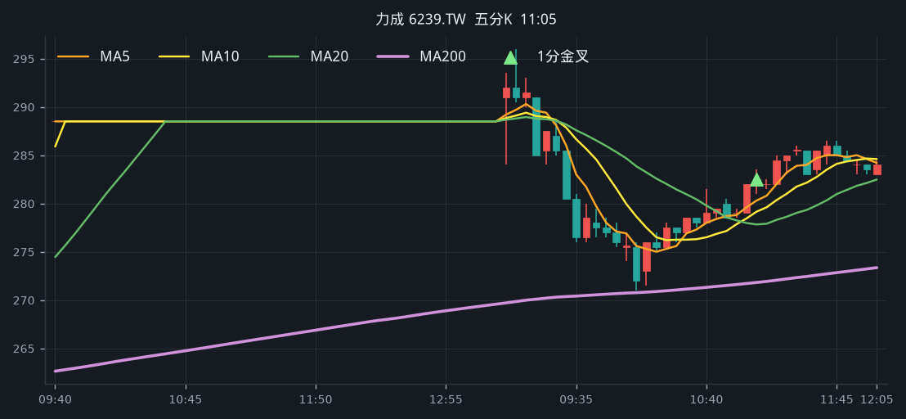

## 8. 聯電 [2303.TW](https://tw.stock.yahoo.com/quote/2303.TW)

- 價格 123.00 +0.00%　成交額排名 #24　97.53 億
- 1分金叉 11:13　收 122.00 > MA200 121.73
- 1分 MA5 121.90 > MA10 121.75 > MA20 121.55　MA20/MA200 差 0.1%
- 五分收盤 / MA200　122.00 > 120.03（+1.6%）

**一分 K**

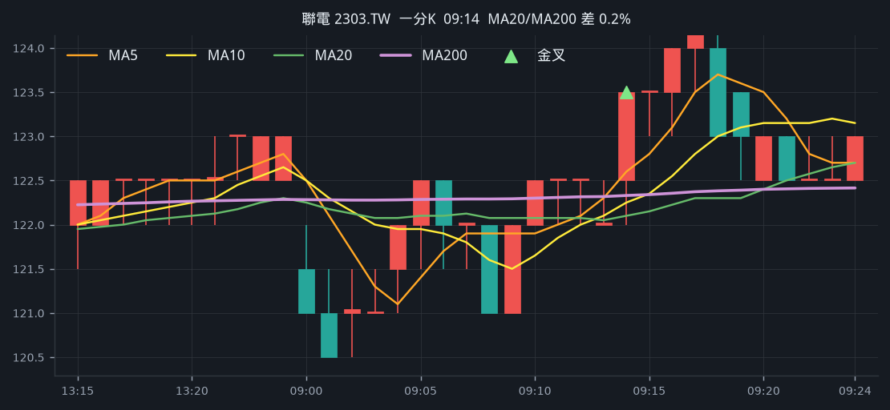

**五分 K（對照）**

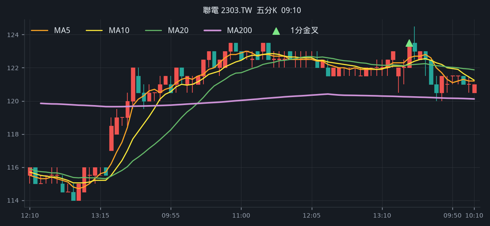

## 9. 南茂 [8150.TW](https://tw.stock.yahoo.com/quote/8150.TW)

- 價格 99.00 +6.57%　成交額排名 #25　96.35 億
- 1分金叉 10:47　收 93.30 > MA200 92.41
- 1分 MA5 92.44 > MA10 92.29 > MA20 92.10　MA20/MA200 差 0.3%
- 五分收盤 / MA200　92.70 > 88.59（+4.6%）

**一分 K**

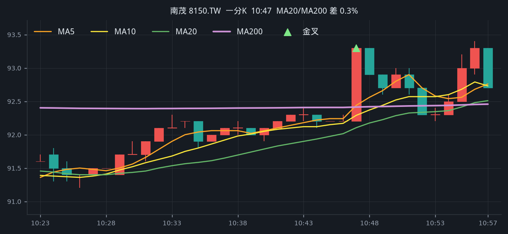

**五分 K（對照）**

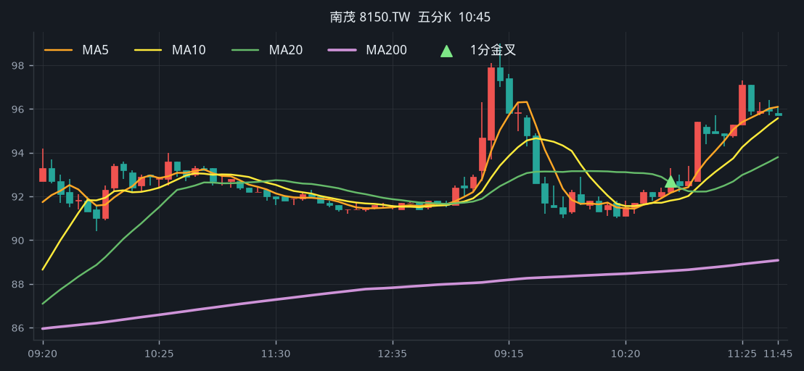

## 10. 精材 [3374.TWO](https://tw.stock.yahoo.com/quote/3374.TWO)

- 價格 334.00 -0.89%　成交額排名 #38　65.77 億
- 1分金叉 10:44　收 336.00 > MA200 333.98
- 1分 MA5 334.20 > MA10 333.70 > MA20 331.73　MA20/MA200 差 0.7%
- 五分收盤 / MA200　336.00 > 320.75（+4.8%）

**一分 K**

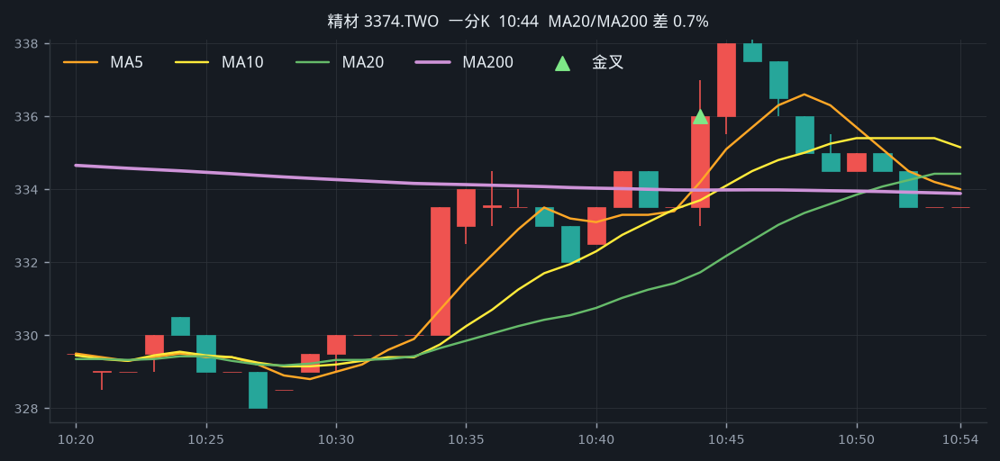

**五分 K（對照）**

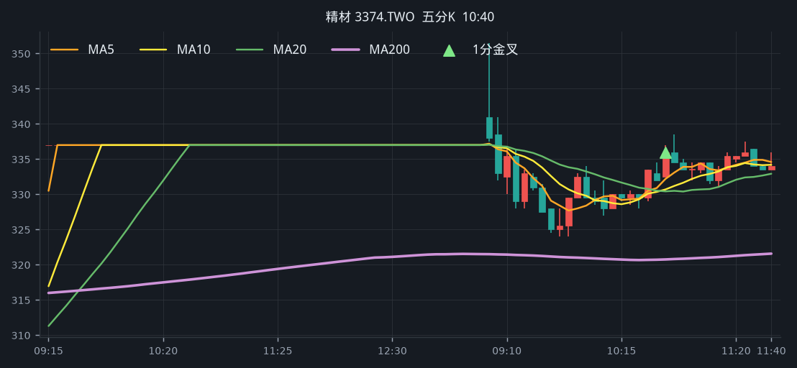

## 11. 新盛力 [4931.TWO](https://tw.stock.yahoo.com/quote/4931.TWO)

- 價格 255.00 +7.14%　成交額排名 #48　53.42 億
- 1分金叉 12:36　收 253.00 > MA200 252.93
- 1分 MA5 251.60 > MA10 251.25 > MA20 250.78　MA20/MA200 差 0.9%
- 五分收盤 / MA200　254.50 > 232.10（+9.7%）

**一分 K**

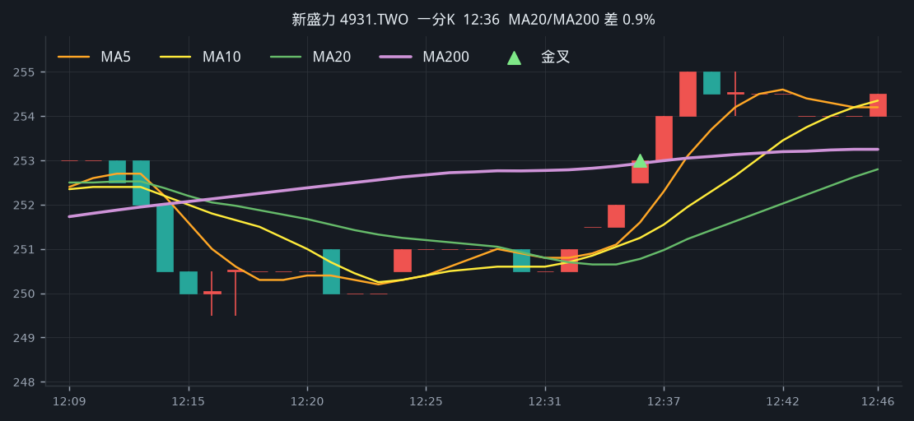

**五分 K（對照）**

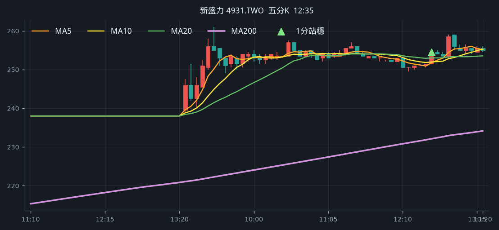

## 12. 盟立 [2464.TW](https://tw.stock.yahoo.com/quote/2464.TW)

- 價格 187.50 +4.17%　成交額排名 #51　50.39 億
- 1分金叉 12:04　收 188.00 > MA200 187.08
- 1分 MA5 186.70 > MA10 186.45 > MA20 186.25　MA20/MA200 差 0.4%
- 五分收盤 / MA200　188.00 > 179.85（+4.5%）

**一分 K**

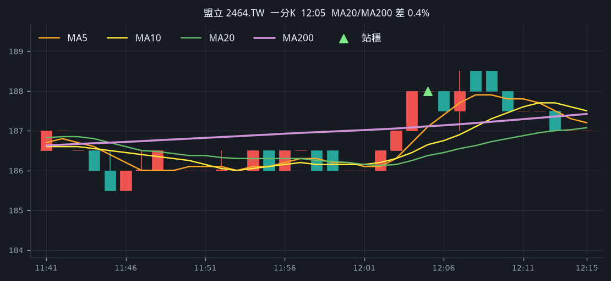

**五分 K（對照）**

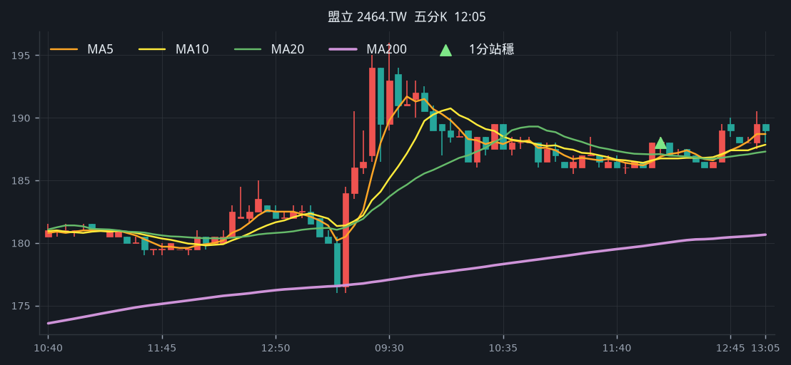

## 13. 世界 [5347.TWO](https://tw.stock.yahoo.com/quote/5347.TWO)

- 價格 158.00 +0.32%　成交額排名 #57　41.41 億
- 1分金叉 10:30　收 157.00 > MA200 156.80
- 1分 MA5 156.20 > MA10 156.05 > MA20 155.60　MA20/MA200 差 0.8%
- 五分收盤 / MA200　157.50 > 152.43（+3.3%）

**一分 K**

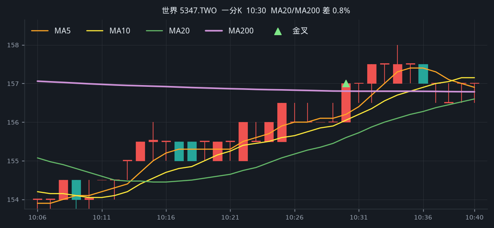

**五分 K（對照）**

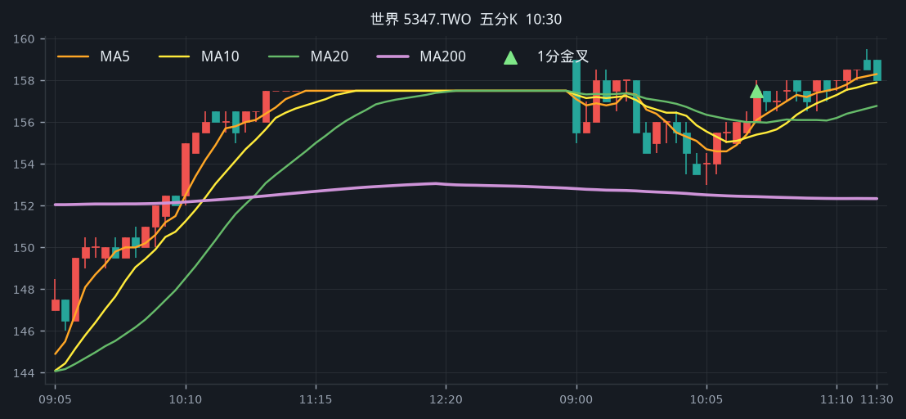

## 14. 強茂 [2481.TW](https://tw.stock.yahoo.com/quote/2481.TW)

- 價格 141.50 +2.91%　成交額排名 #62　34.34 億
- 1分金叉 10:30　收 139.00 > MA200 138.39
- 1分 MA5 138.20 > MA10 138.15 > MA20 137.50　MA20/MA200 差 0.6%
- 五分收盤 / MA200　139.50 > 136.72（+2.0%）

**一分 K**

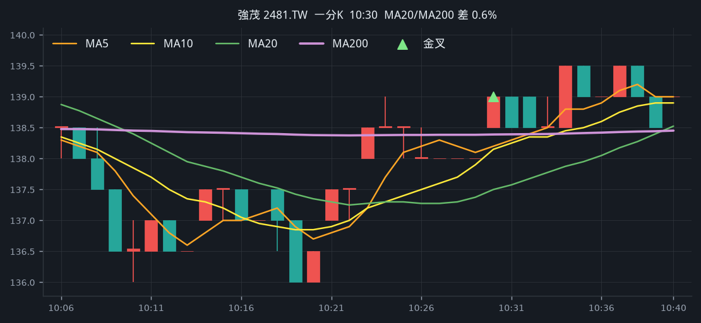

**五分 K（對照）**

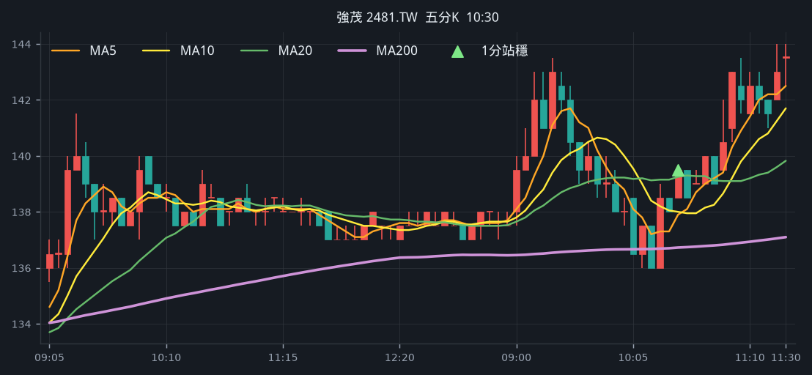

## 15. 啟碁 [6285.TW](https://tw.stock.yahoo.com/quote/6285.TW)

- 價格 254.00 -0.78%　成交額排名 #80　25.58 億
- 1分金叉 10:22　收 254.50 > MA200 254.35
- 1分 MA5 253.90 > MA10 253.60 > MA20 253.22　MA20/MA200 差 0.4%
- 五分收盤 / MA200　256.00 > 248.57（+3.0%）

**一分 K**

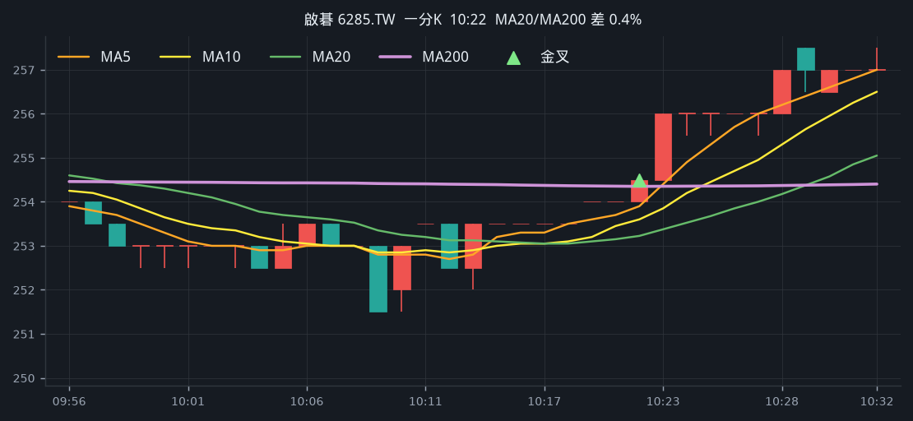

**五分 K（對照）**

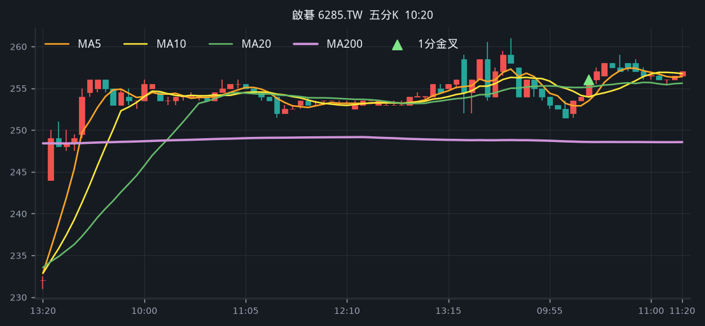

## 16. 矽力*-KY [6415.TW](https://tw.stock.yahoo.com/quote/6415.TW)

- 價格 466.50 +0.32%　成交額排名 #89　21.38 億
- 1分金叉 11:23　收 466.00 > MA200 465.81
- 1分 MA5 465.10 > MA10 464.55 > MA20 464.10　MA20/MA200 差 0.4%
- 五分收盤 / MA200　466.50 > 449.58（+3.8%）

**一分 K**

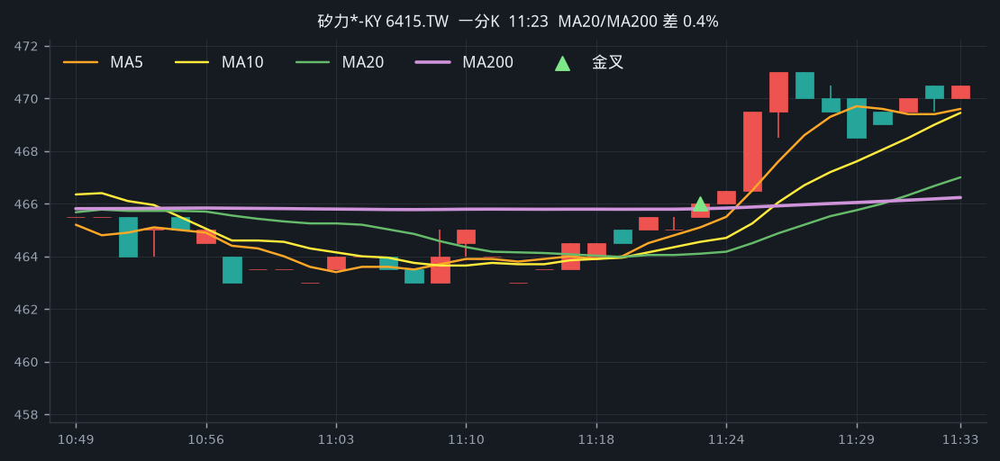

**五分 K（對照）**

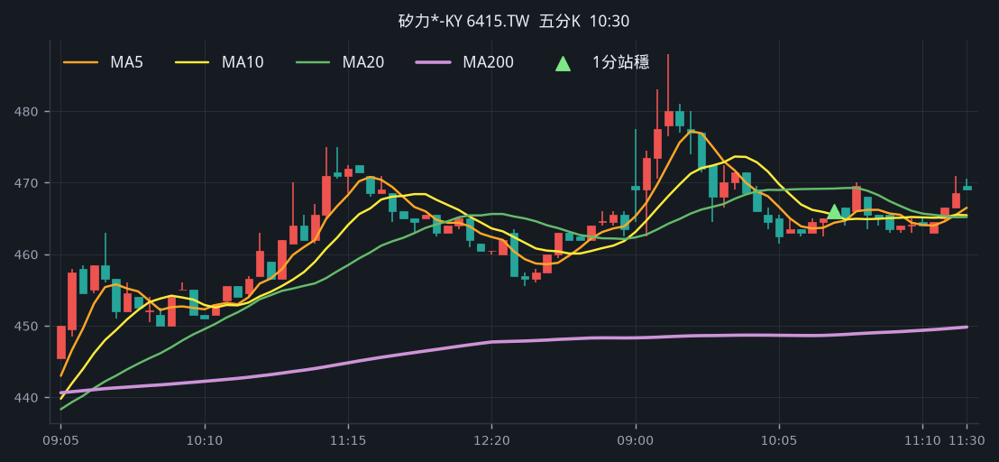

## 17. 大毅 [2478.TW](https://tw.stock.yahoo.com/quote/2478.TW)

- 價格 121.00 -0.82%　成交額排名 #93　20.89 億
- 1分金叉 11:12　收 123.50 > MA200 123.22
- 1分 MA5 123.60 > MA10 123.50 > MA20 123.35　MA20/MA200 差 0.1%
- 五分收盤 / MA200　123.00 > 119.67（+2.8%）

**一分 K**

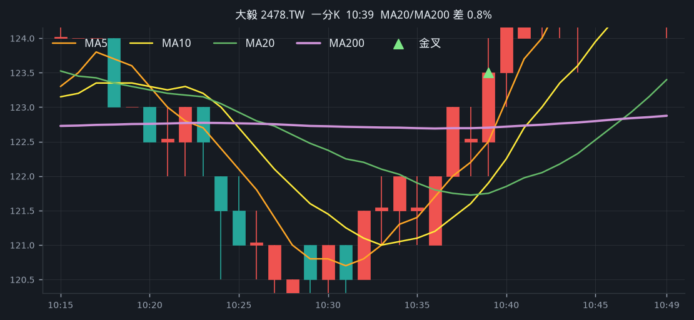

**五分 K（對照）**

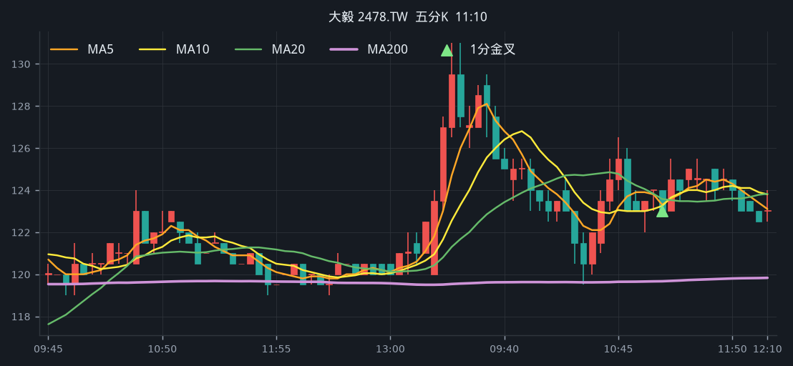

## 18. 德宏 [5475.TWO](https://tw.stock.yahoo.com/quote/5475.TWO)

- 價格 135.00 +8.00%　成交額排名 #96　20.68 億
- 1分金叉 11:33　收 133.00 > MA200 132.80
- 1分 MA5 132.80 > MA10 132.70 > MA20 132.20　MA20/MA200 差 0.5%
- 五分收盤 / MA200　133.00 > 126.35（+5.3%）

**一分 K**

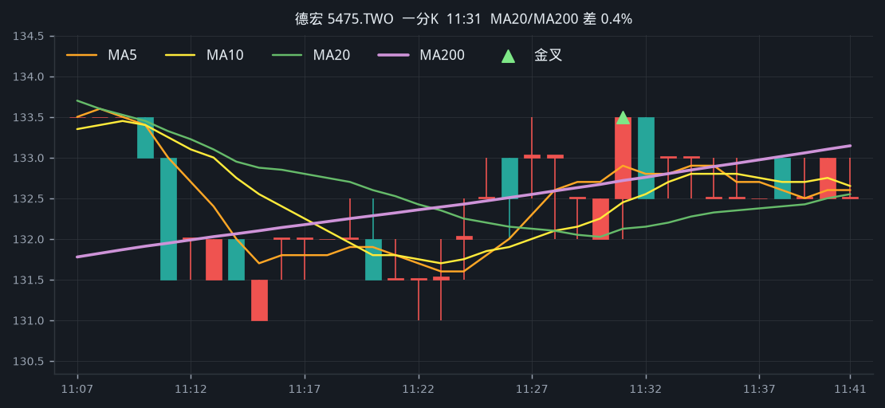

**五分 K（對照）**

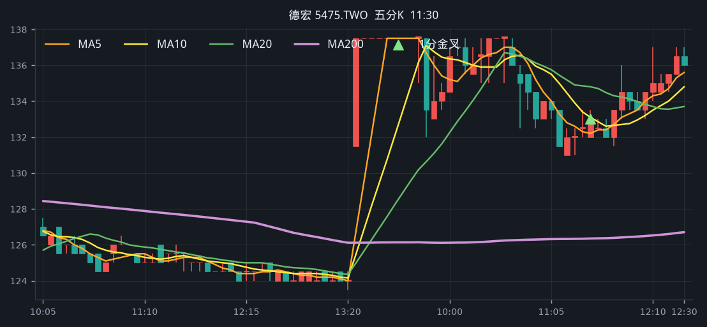

