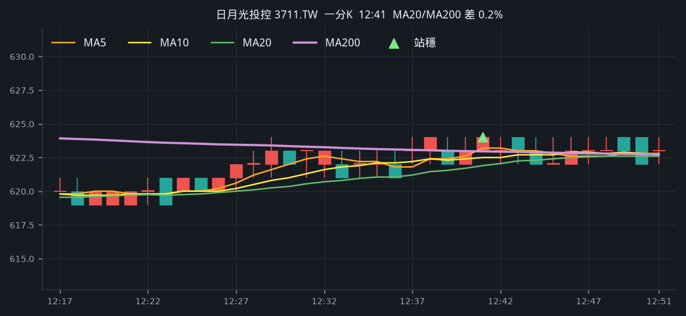
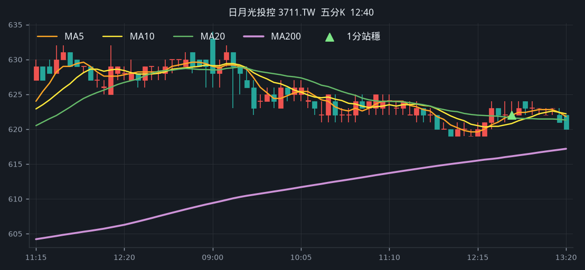
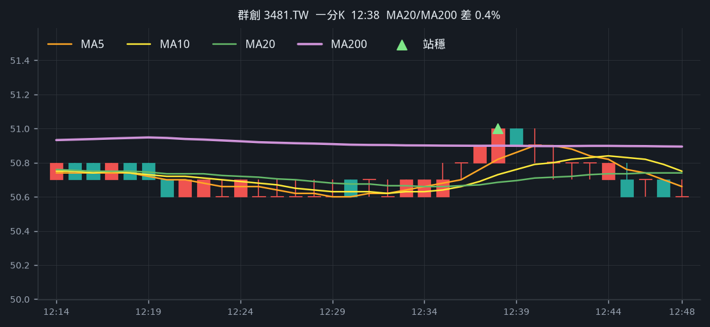
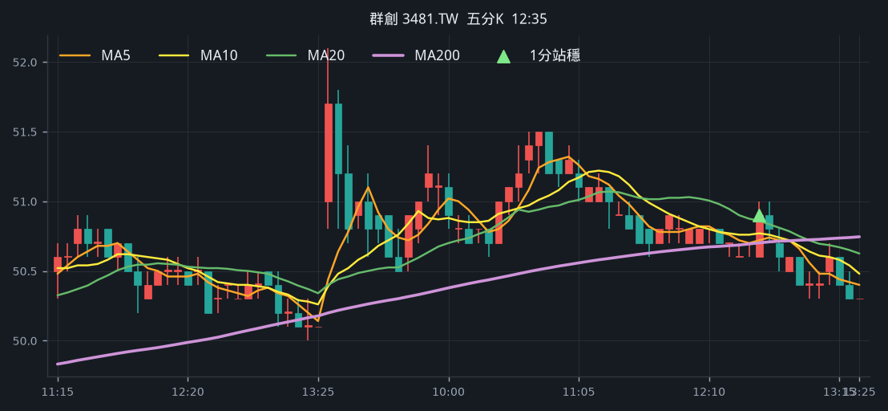
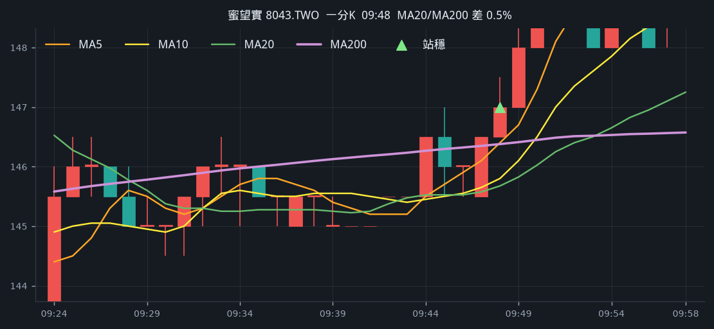
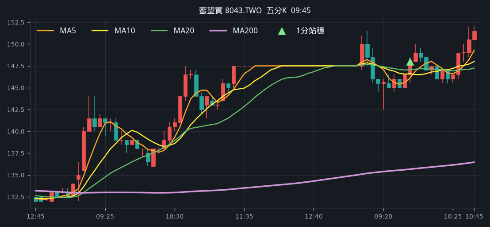
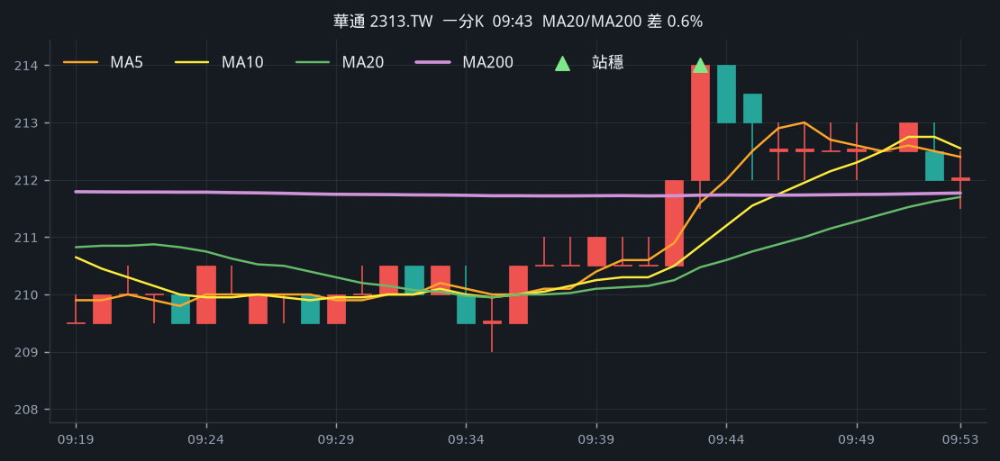
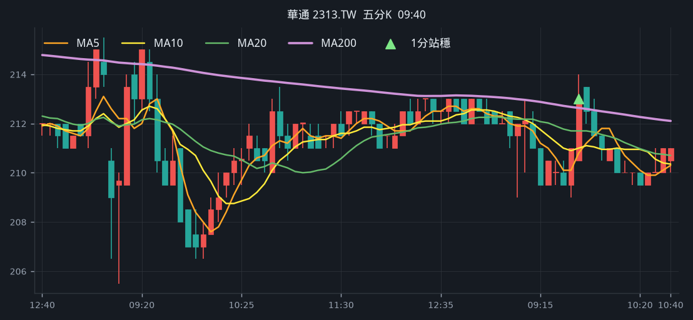

# 回測 2026-08-12（週三）· 一分K站穩 MA200

用 2026-08-12（週三）當天上市＋上櫃成交額前 100（盤後），濾掉 ETF 與收盤價 650 以上。一分K MA5>MA10>MA20 且拉開（MA5−MA20 ≥ 0.2%），MA20 與 MA200 差距 ≤ 1.5%，且當天第一根剛站上 MA200、連續兩根收盤站穩再通知（開盤跳空不算）；含該根的五分K收盤也必須高於五分 MA200。

- 命中 **21** 檔
- 掃描時間 2026-08-17 20:37:03（台北）
- 排行 2026-08-12 盤後成交額
- 前 100 → 濾掉股價 39、ETF 5 → 掃描 56 → 均線糾結 5 → MA20離MA200太遠 1 → 五分MA200底下 4

## 1. 華邦電 [2344.TW](https://tw.stock.yahoo.com/quote/2344.TW)

- 價格 177.00 -0.56%　成交額排名 #3　376.54 億
- 1分站穩 13:15　收 178.50 > MA200 177.89
- 1分 MA5 177.70 > MA10 176.40 > MA20 175.95　MA20/MA200 差 1.1%
- 五分收盤 / MA200　177.00 > 175.13（+1.1%）

**一分 K**

**五分 K（對照）**

## 2. 國巨* [2327.TW](https://tw.stock.yahoo.com/quote/2327.TW)

- 價格 602.00 -2.43%　成交額排名 #4　343.47 億
- 1分站穩 10:29　收 615.00 > MA200 613.40
- 1分 MA5 613.80 > MA10 612.80 > MA20 612.00　MA20/MA200 差 0.2%
- 五分收盤 / MA200　615.00 > 577.09（+6.6%）

**一分 K**

**五分 K（對照）**

## 3. 華新科 [2492.TW](https://tw.stock.yahoo.com/quote/2492.TW)

- 價格 288.00 -4.16%　成交額排名 #9　198.65 億
- 1分站穩 10:33　收 297.50 > MA200 297.13
- 1分 MA5 296.30 > MA10 295.30 > MA20 294.27　MA20/MA200 差 1.0%
- 五分收盤 / MA200　300.00 > 270.06（+11.1%）

**一分 K**

**五分 K（對照）**

## 4. 南亞 [1303.TW](https://tw.stock.yahoo.com/quote/1303.TW)

- 價格 189.00 -0.53%　成交額排名 #14　149.66 億
- 1分站穩 11:21　收 190.00 > MA200 189.80
- 1分 MA5 189.80 > MA10 189.40 > MA20 189.20　MA20/MA200 差 0.3%
- 五分收盤 / MA200　191.00 > 185.70（+2.9%）

**一分 K**

**五分 K（對照）**

## 5. 日月光投控 [3711.TW](https://tw.stock.yahoo.com/quote/3711.TW)

- 價格 621.00 -1.27%　成交額排名 #21　108.31 億
- 1分站穩 12:41　收 624.00 > MA200 622.96
- 1分 MA5 623.20 > MA10 622.50 > MA20 621.90　MA20/MA200 差 0.2%
- 五分收盤 / MA200　622.00 > 616.11（+1.0%）

**一分 K**

**五分 K（對照）**

## 6. 群創 [3481.TW](https://tw.stock.yahoo.com/quote/3481.TW)

- 價格 50.40 +0.60%　成交額排名 #23　96.43 億
- 1分站穩 12:38　收 51.00 > MA200 50.90
- 1分 MA5 50.82 > MA10 50.73 > MA20 50.68　MA20/MA200 差 0.4%
- 五分收盤 / MA200　50.90 > 50.70（+0.4%）

**一分 K**

**五分 K（對照）**

## 7. 廣達 [2382.TW](https://tw.stock.yahoo.com/quote/2382.TW)

- 價格 325.50 +3.17%　成交額排名 #27　93.53 億
- 1分站穩 12:34　收 325.00 > MA200 322.62
- 1分 MA5 322.50 > MA10 321.50 > MA20 320.60　MA20/MA200 差 0.6%
- 五分收盤 / MA200　325.00 > 310.51（+4.7%）

**一分 K**

**五分 K（對照）**

## 8. 技嘉 [2376.TW](https://tw.stock.yahoo.com/quote/2376.TW)

- 價格 375.50 +7.13%　成交額排名 #39　67.13 億
- 1分站穩 12:38　收 375.50 > MA200 375.40
- 1分 MA5 374.80 > MA10 374.30 > MA20 373.75　MA20/MA200 差 0.4%
- 五分收盤 / MA200　375.50 > 353.18（+6.3%）

**一分 K**

**五分 K（對照）**

## 9. 盟立 [2464.TW](https://tw.stock.yahoo.com/quote/2464.TW)

- 價格 196.50 +4.80%　成交額排名 #46　57.38 億
- 1分站穩 09:18　收 190.50 > MA200 187.39
- 1分 MA5 188.20 > MA10 187.65 > MA20 187.30　MA20/MA200 差 0.0%
- 五分收盤 / MA200　192.50 > 181.12（+6.3%）

**一分 K**

**五分 K（對照）**

## 10. 英業達 [2356.TW](https://tw.stock.yahoo.com/quote/2356.TW)

- 價格 69.00 +5.99%　成交額排名 #49　55.17 億
- 1分站穩 12:12　收 69.00 > MA200 68.60
- 1分 MA5 68.60 > MA10 68.42 > MA20 68.32　MA20/MA200 差 0.4%
- 五分收盤 / MA200　68.90 > 65.71（+4.9%）

**一分 K**

**五分 K（對照）**

## 11. 順達 [3211.TWO](https://tw.stock.yahoo.com/quote/3211.TWO)

- 價格 412.00 +3.00%　成交額排名 #50　54.68 億
- 1分站穩 09:21　收 400.50 > MA200 400.07
- 1分 MA5 399.90 > MA10 398.90 > MA20 398.65　MA20/MA200 差 0.4%
- 五分收盤 / MA200　398.00 > 369.12（+7.8%）

**一分 K**

**五分 K（對照）**

## 12. 頎邦 [6147.TWO](https://tw.stock.yahoo.com/quote/6147.TWO)

- 價格 156.50 -3.10%　成交額排名 #63　41.55 億
- 1分站穩 10:23　收 158.50 > MA200 158.19
- 1分 MA5 158.50 > MA10 158.25 > MA20 157.62　MA20/MA200 差 0.4%
- 五分收盤 / MA200　160.00 > 152.19（+5.1%）

**一分 K**

**五分 K（對照）**

## 13. 力成 [6239.TW](https://tw.stock.yahoo.com/quote/6239.TW)

- 價格 281.50 -0.35%　成交額排名 #66　39.47 億
- 1分站穩 10:28　收 284.00 > MA200 283.37
- 1分 MA5 282.90 > MA10 282.35 > MA20 282.05　MA20/MA200 差 0.5%
- 五分收盤 / MA200　285.00 > 277.47（+2.7%）

**一分 K**

**五分 K（對照）**

## 14. 華新 [1605.TW](https://tw.stock.yahoo.com/quote/1605.TW)

- 價格 40.00 +4.44%　成交額排名 #68　37.96 億
- 1分站穩 12:38　收 40.25 > MA200 40.19
- 1分 MA5 40.14 > MA10 40.10 > MA20 40.01　MA20/MA200 差 0.4%
- 五分收盤 / MA200　40.25 > 37.48（+7.4%）

**一分 K**

**五分 K（對照）**

## 15. 日電貿 [3090.TW](https://tw.stock.yahoo.com/quote/3090.TW)

- 價格 170.50 -2.29%　成交額排名 #73　35.15 億
- 1分站穩 09:50　收 174.00 > MA200 173.16
- 1分 MA5 172.80 > MA10 172.35 > MA20 171.90　MA20/MA200 差 0.7%
- 五分收盤 / MA200　174.00 > 159.82（+8.9%）

**一分 K**

**五分 K（對照）**

## 16. 精材 [3374.TWO](https://tw.stock.yahoo.com/quote/3374.TWO)

- 價格 330.00 -1.20%　成交額排名 #74　34.89 億
- 1分站穩 10:17　收 336.50 > MA200 332.60
- 1分 MA5 333.40 > MA10 332.95 > MA20 332.35　MA20/MA200 差 0.1%
- 五分收盤 / MA200　335.00 > 325.23（+3.0%）

**一分 K**

**五分 K（對照）**

## 17. 蜜望實 [8043.TWO](https://tw.stock.yahoo.com/quote/8043.TWO)

- 價格 147.50 +0.00%　成交額排名 #82　29.56 億
- 1分站穩 09:48　收 147.00 > MA200 146.38
- 1分 MA5 146.40 > MA10 145.80 > MA20 145.68　MA20/MA200 差 0.5%
- 五分收盤 / MA200　148.00 > 135.66（+9.1%）

**一分 K**

**五分 K（對照）**

## 18. 華通 [2313.TW](https://tw.stock.yahoo.com/quote/2313.TW)

- 價格 209.00 -1.18%　成交額排名 #83　28.57 億
- 1分站穩 09:43　收 214.00 > MA200 211.73
- 1分 MA5 211.60 > MA10 210.85 > MA20 210.47　MA20/MA200 差 0.6%
- 五分收盤 / MA200　213.00 > 212.63（+0.2%）

**一分 K**

**五分 K（對照）**

## 19. 上詮 [3363.TWO](https://tw.stock.yahoo.com/quote/3363.TWO)

- 價格 630.00 +3.96%　成交額排名 #84　27.71 億
- 1分站穩 12:13　收 629.00 > MA200 628.83
- 1分 MA5 627.40 > MA10 626.70 > MA20 625.75　MA20/MA200 差 0.5%
- 五分收盤 / MA200　629.00 > 618.09（+1.8%）

**一分 K**

**五分 K（對照）**

## 20. 晶技 [3042.TW](https://tw.stock.yahoo.com/quote/3042.TW)

- 價格 181.50 +1.40%　成交額排名 #89　24.19 億
- 1分站穩 09:50　收 182.00 > MA200 179.29
- 1分 MA5 179.20 > MA10 178.30 > MA20 177.47　MA20/MA200 差 1.0%
- 五分收盤 / MA200　181.50 > 175.88（+3.2%）

**一分 K**

**五分 K（對照）**

## 21. 強茂 [2481.TW](https://tw.stock.yahoo.com/quote/2481.TW)

- 價格 139.00 -1.77%　成交額排名 #97　21.51 億
- 1分站穩 10:33　收 141.50 > MA200 141.18
- 1分 MA5 141.20 > MA10 141.00 > MA20 140.80　MA20/MA200 差 0.3%
- 五分收盤 / MA200　141.50 > 138.16（+2.4%）

**一分 K**

**五分 K（對照）**

