# 回測 2026-08-12（週三）· 一分K剛站上 MA200

用 2026-08-12（週三）當天上市＋上櫃成交額前 100（盤後），濾掉 ETF 與收盤價 650 以上。一分K MA5>MA10>MA20 且拉開（MA5−MA20 ≥ 0.2%），MA20 與 MA200 差距 ≤ 1.5%，且當日這根收盤剛站上 MA200；含該金叉的五分K收盤也必須高於五分 MA200。

- 命中 **21** 檔
- 掃描時間 2026-08-17 18:48:49（台北）
- 排行 2026-08-12 盤後成交額
- 前 100 → 濾掉股價 39、ETF 5 → 掃描 56 → 均線糾結 11 → MA20離MA200太遠 1 → 五分MA200底下 5

## 1. 南亞科 [2408.TW](https://tw.stock.yahoo.com/quote/2408.TW)

- 價格 482.50 -1.33%　成交額排名 #2　460.90 億
- 1分金叉 13:16　收 486.00 > MA200 485.57
- 1分 MA5 485.50 > MA10 483.75 > MA20 482.90　MA20/MA200 差 0.5%
- 五分收盤 / MA200　485.00 > 484.00（+0.2%）

**一分 K**

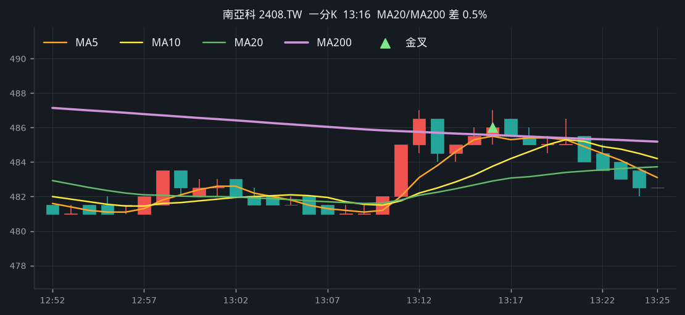

**五分 K（對照）**

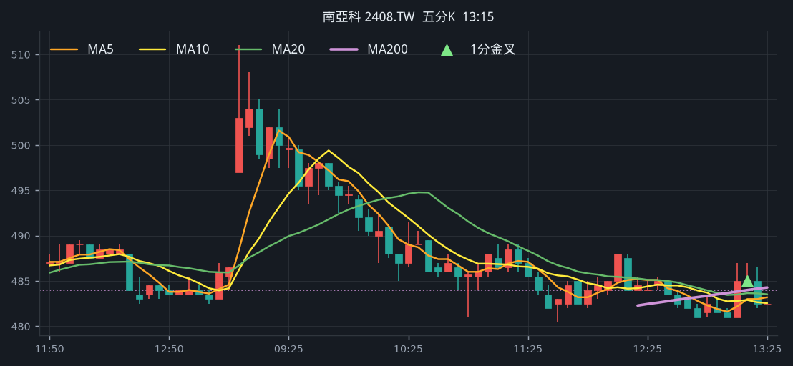

## 2. 華邦電 [2344.TW](https://tw.stock.yahoo.com/quote/2344.TW)

- 價格 177.00 -0.56%　成交額排名 #3　376.54 億
- 1分金叉 13:14　收 178.50 > MA200 177.91
- 1分 MA5 177.10 > MA10 176.05 > MA20 175.78　MA20/MA200 差 1.2%
- 五分收盤 / MA200　178.50 > 175.07（+2.0%）

**一分 K**

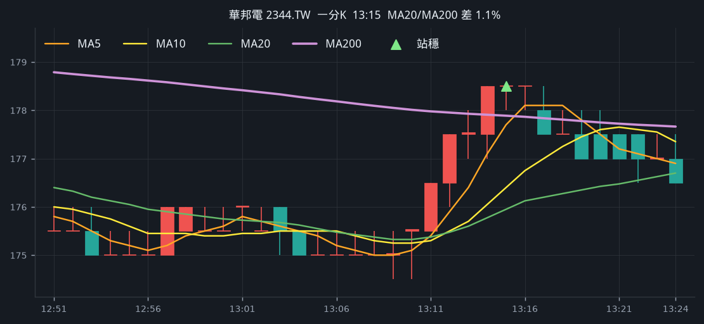

**五分 K（對照）**

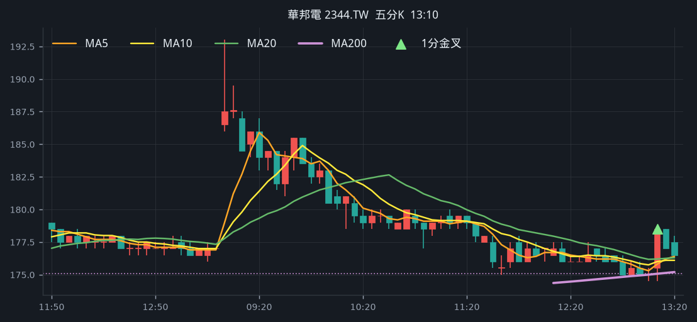

## 3. 國巨* [2327.TW](https://tw.stock.yahoo.com/quote/2327.TW)

- 價格 602.00 -2.43%　成交額排名 #4　343.47 億
- 1分金叉 10:28　收 615.00 > MA200 613.42
- 1分 MA5 613.20 > MA10 612.60 > MA20 611.90　MA20/MA200 差 0.2%
- 五分收盤 / MA200　615.00 > 577.09（+6.6%）

**一分 K**

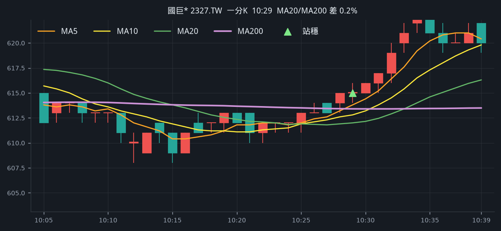

**五分 K（對照）**

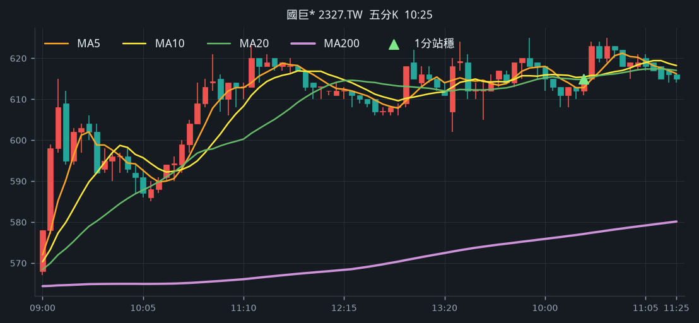

## 4. 臻鼎-KY [4958.TW](https://tw.stock.yahoo.com/quote/4958.TW)

- 價格 471.50 -3.78%　成交額排名 #6　251.21 億
- 1分金叉 10:00　收 484.50 > MA200 482.44
- 1分 MA5 478.80 > MA10 477.85 > MA20 476.95　MA20/MA200 差 1.1%
- 五分收盤 / MA200　480.00 > 479.20（+0.2%）

**一分 K**

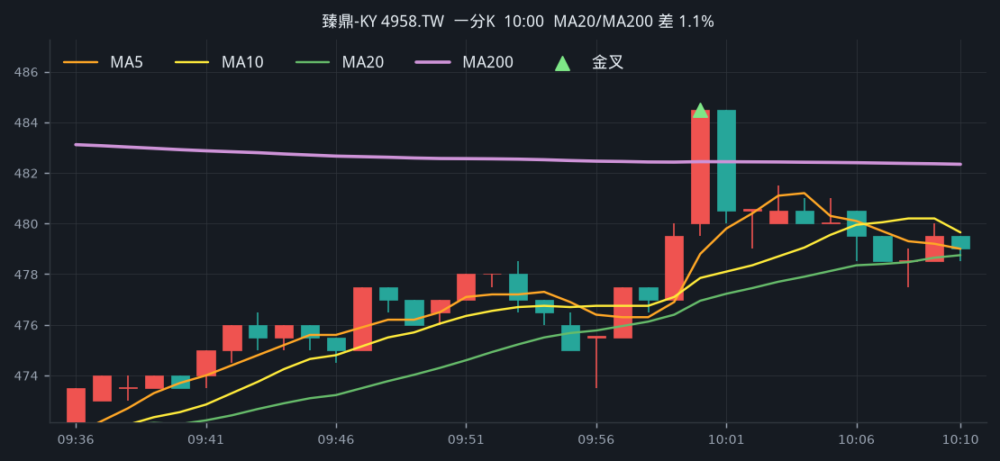

**五分 K（對照）**

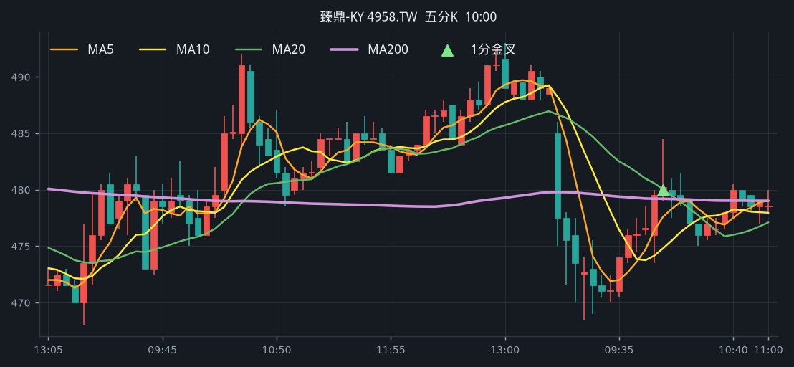

## 5. 華新科 [2492.TW](https://tw.stock.yahoo.com/quote/2492.TW)

- 價格 288.00 -4.16%　成交額排名 #9　198.65 億
- 1分金叉 10:32　收 297.50 > MA200 297.14
- 1分 MA5 295.80 > MA10 294.85 > MA20 294.07　MA20/MA200 差 1.0%
- 五分收盤 / MA200　300.00 > 270.06（+11.1%）

**一分 K**

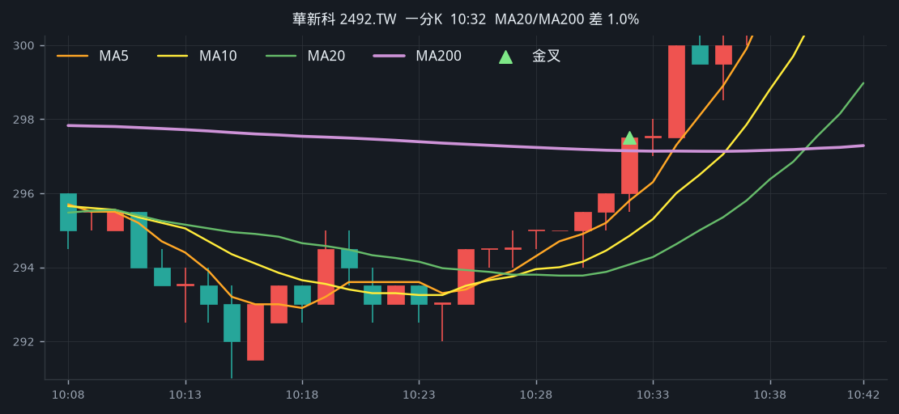

**五分 K（對照）**

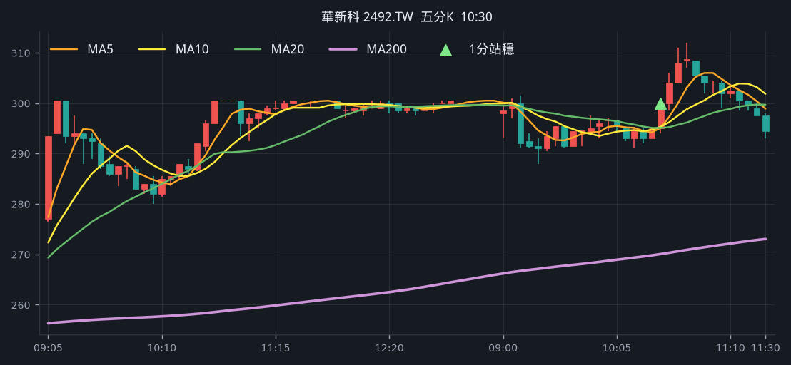

## 6. 南亞 [1303.TW](https://tw.stock.yahoo.com/quote/1303.TW)

- 價格 189.00 -0.53%　成交額排名 #14　149.66 億
- 1分金叉 11:23　收 190.50 > MA200 189.82
- 1分 MA5 189.90 > MA10 189.60 > MA20 189.38　MA20/MA200 差 0.2%
- 五分收盤 / MA200　191.00 > 185.70（+2.9%）

**一分 K**

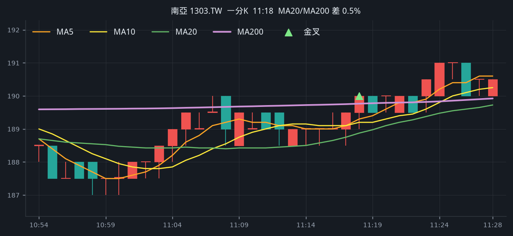

**五分 K（對照）**

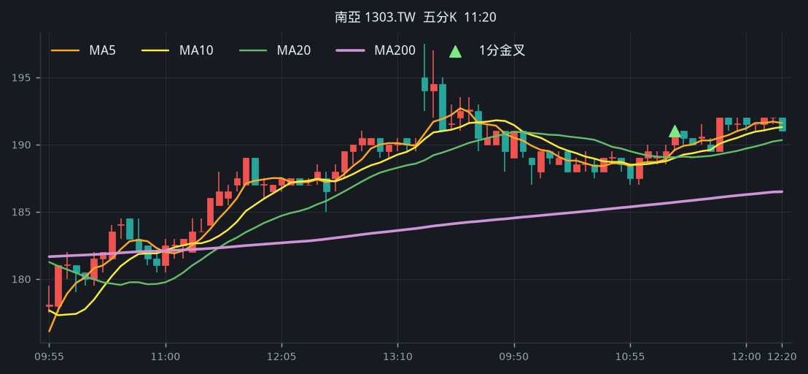

## 7. 廣達 [2382.TW](https://tw.stock.yahoo.com/quote/2382.TW)

- 價格 325.50 +3.17%　成交額排名 #27　93.53 億
- 1分金叉 12:33　收 323.50 > MA200 322.62
- 1分 MA5 321.60 > MA10 321.00 > MA20 320.35　MA20/MA200 差 0.7%
- 五分收盤 / MA200　325.00 > 310.51（+4.7%）

**一分 K**

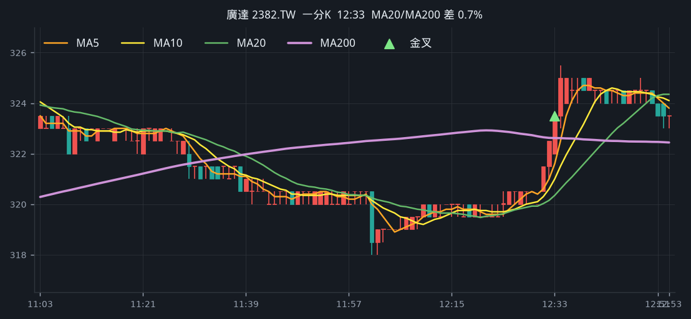

**五分 K（對照）**

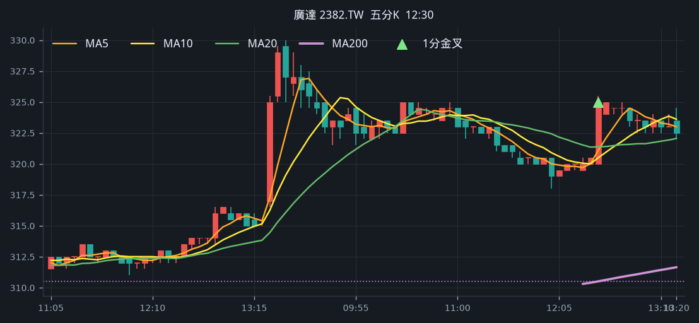

## 8. 微星 [2377.TW](https://tw.stock.yahoo.com/quote/2377.TW)

- 價格 169.00 +9.74%　成交額排名 #34　76.75 億
- 1分金叉 09:01　收 158.50 > MA200 153.48
- 1分 MA5 154.20 > MA10 153.65 > MA20 153.57　MA20/MA200 差 0.1%
- 五分收盤 / MA200　162.00 > 153.82（+5.3%）

**一分 K**

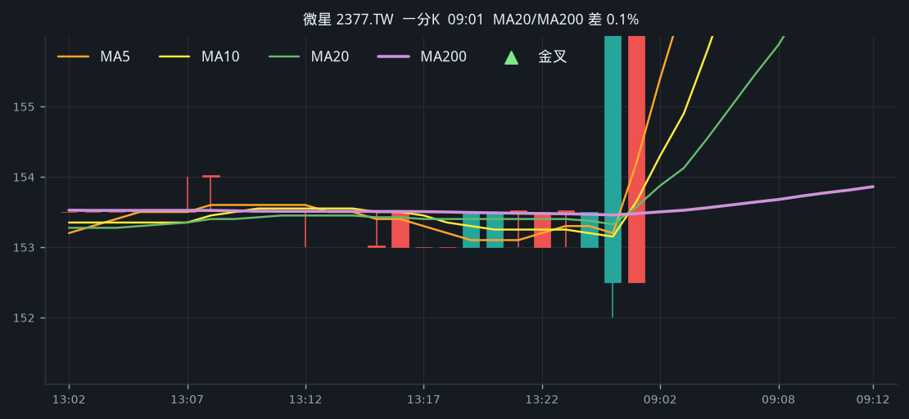

**五分 K（對照）**

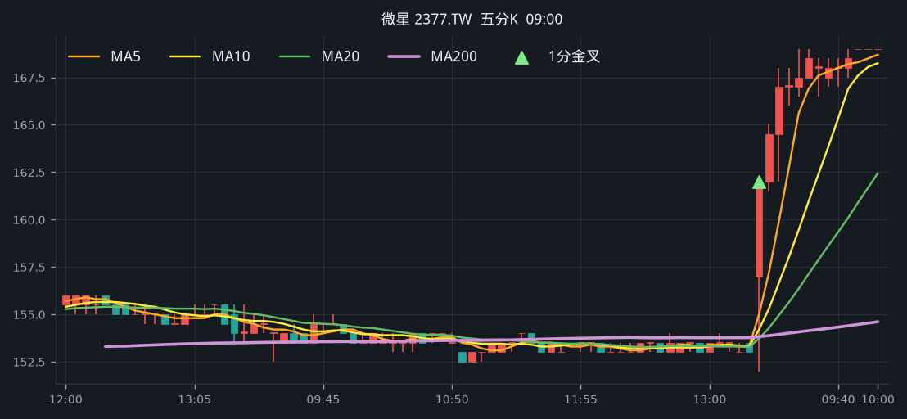

## 9. 技嘉 [2376.TW](https://tw.stock.yahoo.com/quote/2376.TW)

- 價格 375.50 +7.13%　成交額排名 #39　67.13 億
- 1分金叉 12:37　收 375.50 > MA200 375.37
- 1分 MA5 374.40 > MA10 374.15 > MA20 373.60　MA20/MA200 差 0.5%
- 五分收盤 / MA200　375.50 > 353.18（+6.3%）

**一分 K**

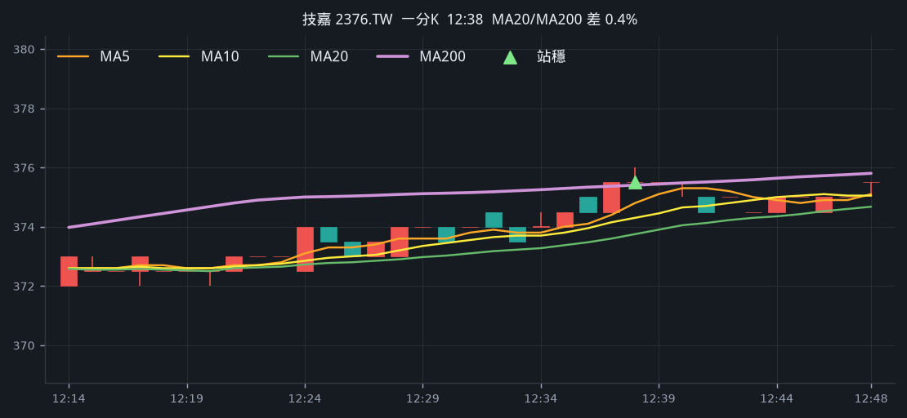

**五分 K（對照）**

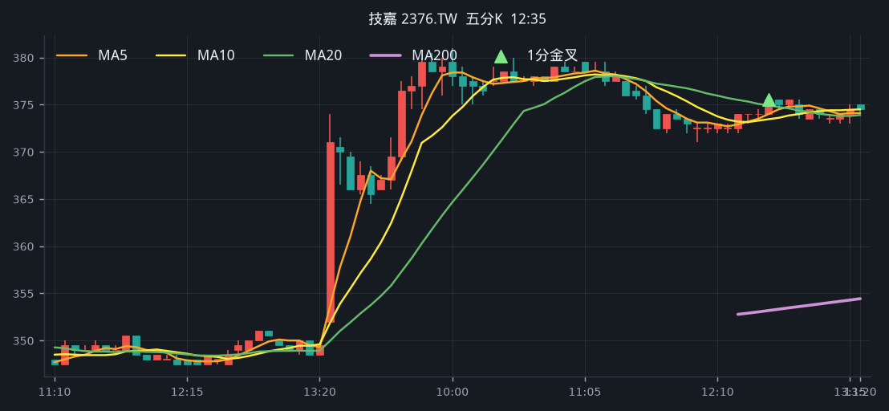

## 10. 盟立 [2464.TW](https://tw.stock.yahoo.com/quote/2464.TW)

- 價格 196.50 +4.80%　成交額排名 #46　57.38 億
- 1分金叉 09:17　收 189.00 > MA200 187.38
- 1分 MA5 187.60 > MA10 187.25 > MA20 187.18　MA20/MA200 差 0.1%
- 五分收盤 / MA200　192.50 > 181.12（+6.3%）

**一分 K**

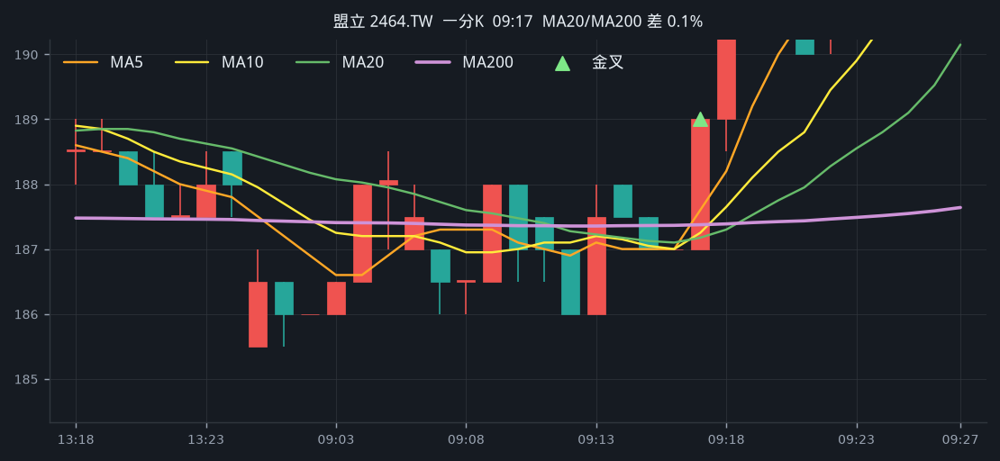

**五分 K（對照）**

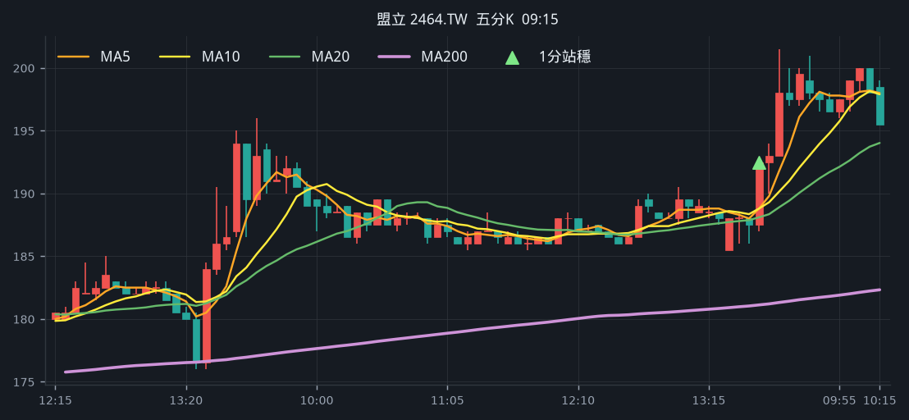

## 11. 英業達 [2356.TW](https://tw.stock.yahoo.com/quote/2356.TW)

- 價格 69.00 +5.99%　成交額排名 #49　55.17 億
- 1分金叉 12:11　收 68.70 > MA200 68.58
- 1分 MA5 68.48 > MA10 68.33 > MA20 68.29　MA20/MA200 差 0.4%
- 五分收盤 / MA200　68.90 > 65.71（+4.9%）

**一分 K**

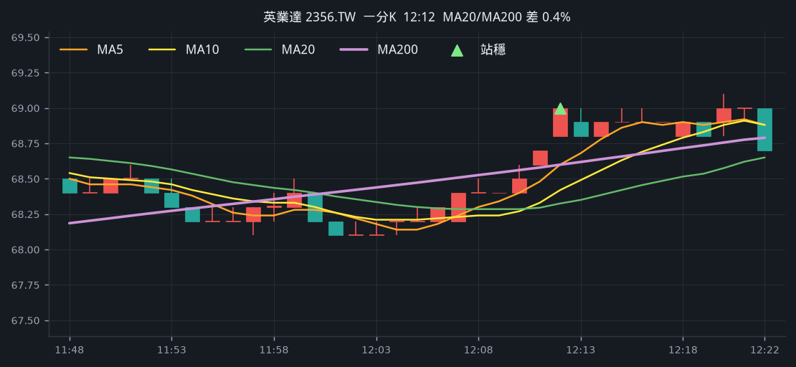

**五分 K（對照）**

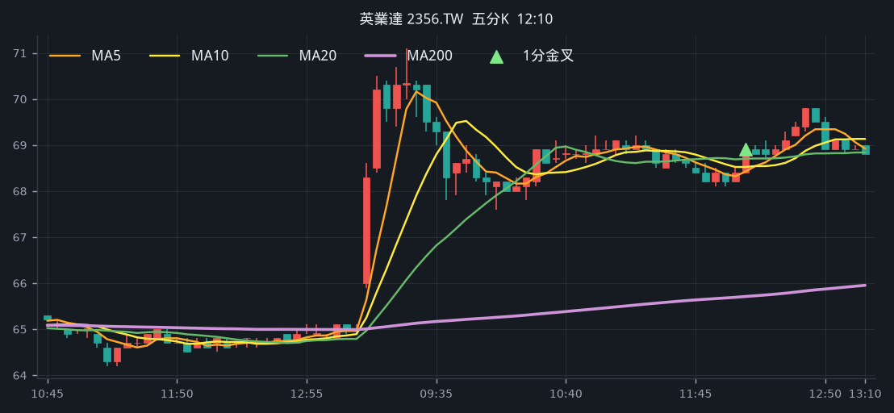

## 12. 順達 [3211.TWO](https://tw.stock.yahoo.com/quote/3211.TWO)

- 價格 412.00 +3.00%　成交額排名 #50　54.68 億
- 1分金叉 10:18　收 399.50 > MA200 399.40
- 1分 MA5 399.40 > MA10 397.70 > MA20 396.10　MA20/MA200 差 0.8%
- 五分收盤 / MA200　405.50 > 371.55（+9.1%）

**一分 K**

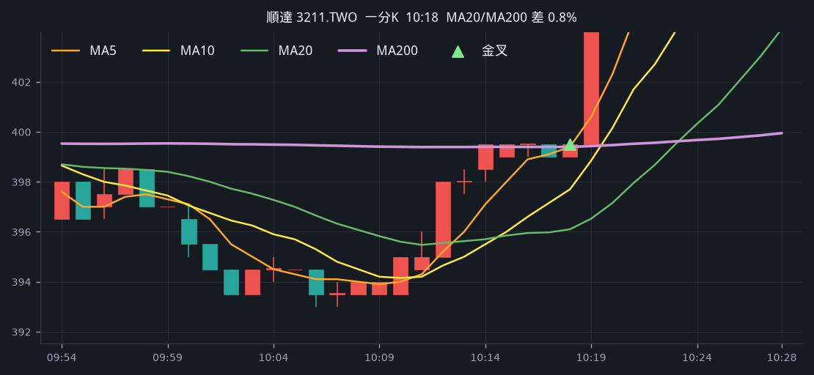

**五分 K（對照）**

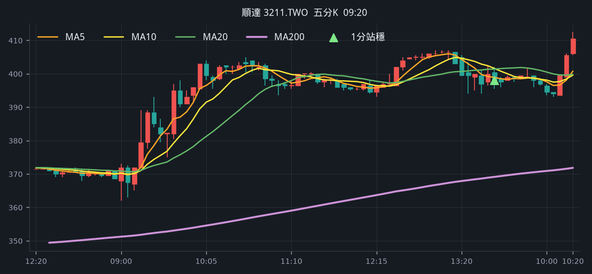

## 13. 頎邦 [6147.TWO](https://tw.stock.yahoo.com/quote/6147.TWO)

- 價格 156.50 -3.10%　成交額排名 #63　41.55 億
- 1分金叉 12:51　收 158.50 > MA200 158.22
- 1分 MA5 158.30 > MA10 158.00 > MA20 157.88　MA20/MA200 差 0.2%
- 五分收盤 / MA200　158.00 > 153.40（+3.0%）

**一分 K**

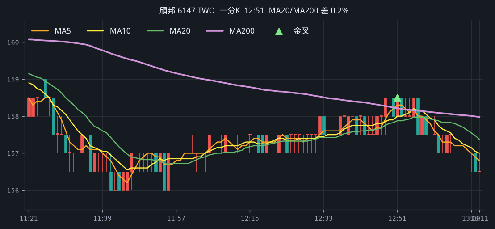

**五分 K（對照）**

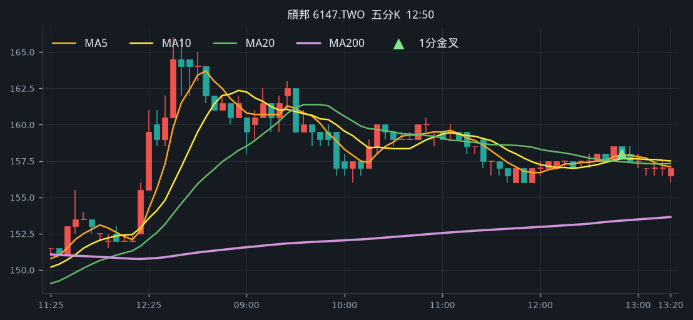

## 14. 力成 [6239.TW](https://tw.stock.yahoo.com/quote/6239.TW)

- 價格 281.50 -0.35%　成交額排名 #66　39.47 億
- 1分金叉 12:40　收 283.00 > MA200 282.91
- 1分 MA5 282.80 > MA10 282.55 > MA20 282.18　MA20/MA200 差 0.3%
- 五分收盤 / MA200　283.00 > 279.85（+1.1%）

**一分 K**

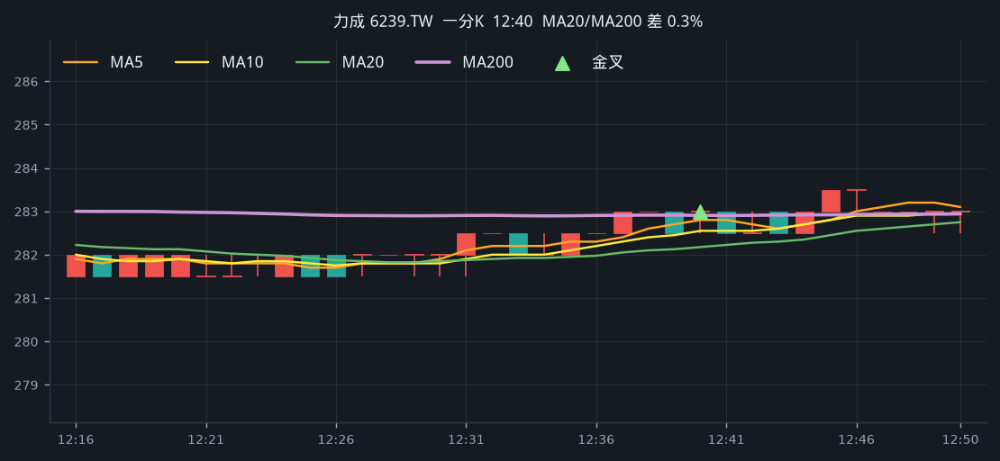

**五分 K（對照）**

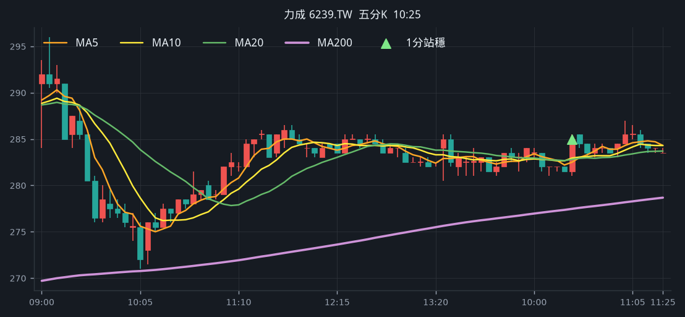

## 15. 華新 [1605.TW](https://tw.stock.yahoo.com/quote/1605.TW)

- 價格 40.00 +4.44%　成交額排名 #68　37.96 億
- 1分金叉 12:37　收 40.20 > MA200 40.19
- 1分 MA5 40.10 > MA10 40.08 > MA20 39.99　MA20/MA200 差 0.5%
- 五分收盤 / MA200　40.25 > 37.48（+7.4%）

**一分 K**

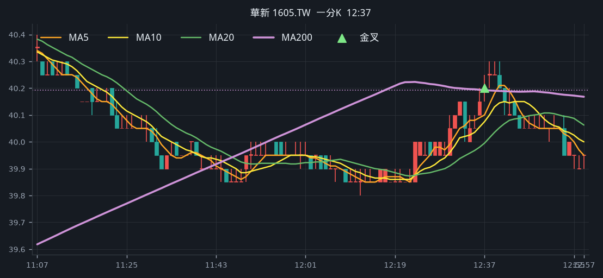

**五分 K（對照）**

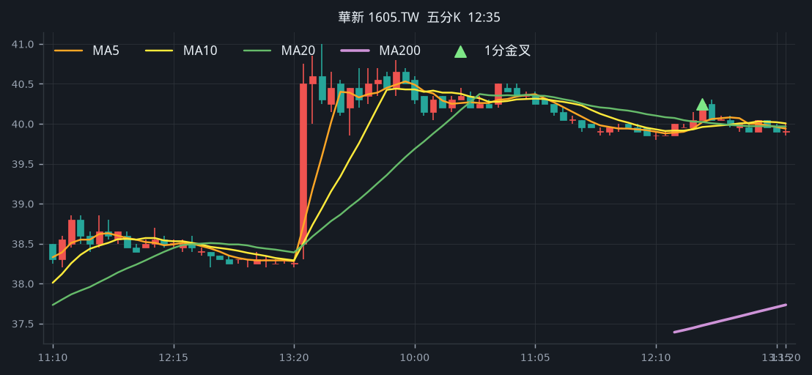

## 16. 日電貿 [3090.TW](https://tw.stock.yahoo.com/quote/3090.TW)

- 價格 170.50 -2.29%　成交額排名 #73　35.15 億
- 1分金叉 10:32　收 174.00 > MA200 173.43
- 1分 MA5 172.70 > MA10 172.20 > MA20 171.85　MA20/MA200 差 0.9%
- 五分收盤 / MA200　174.50 > 160.69（+8.6%）

**一分 K**

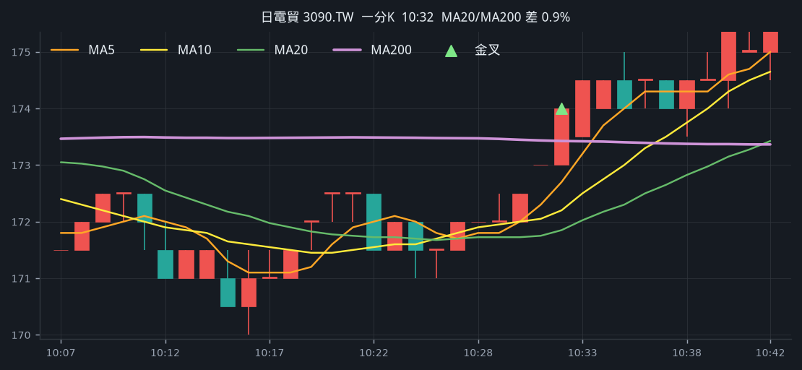

**五分 K（對照）**

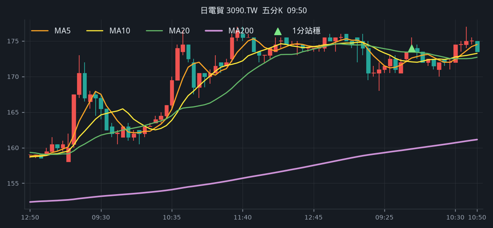

## 17. 精材 [3374.TWO](https://tw.stock.yahoo.com/quote/3374.TWO)

- 價格 330.00 -1.20%　成交額排名 #74　34.89 億
- 1分金叉 12:46　收 332.50 > MA200 331.30
- 1分 MA5 331.50 > MA10 331.15 > MA20 330.32　MA20/MA200 差 0.3%
- 五分收盤 / MA200　333.50 > 328.06（+1.7%）

**一分 K**

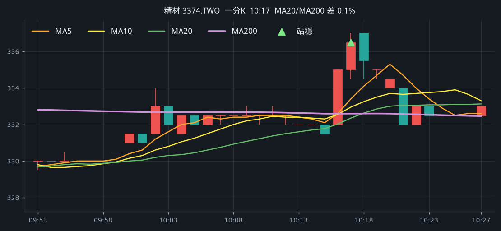

**五分 K（對照）**

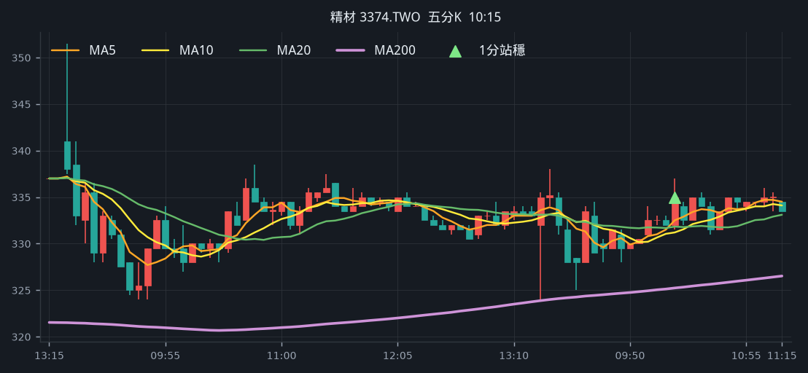

## 18. 上詮 [3363.TWO](https://tw.stock.yahoo.com/quote/3363.TWO)

- 價格 630.00 +3.96%　成交額排名 #84　27.71 億
- 1分金叉 12:25　收 630.00 > MA200 629.62
- 1分 MA5 628.80 > MA10 628.70 > MA20 627.40　MA20/MA200 差 0.4%
- 五分收盤 / MA200　631.00 > 618.48（+2.0%）

**一分 K**

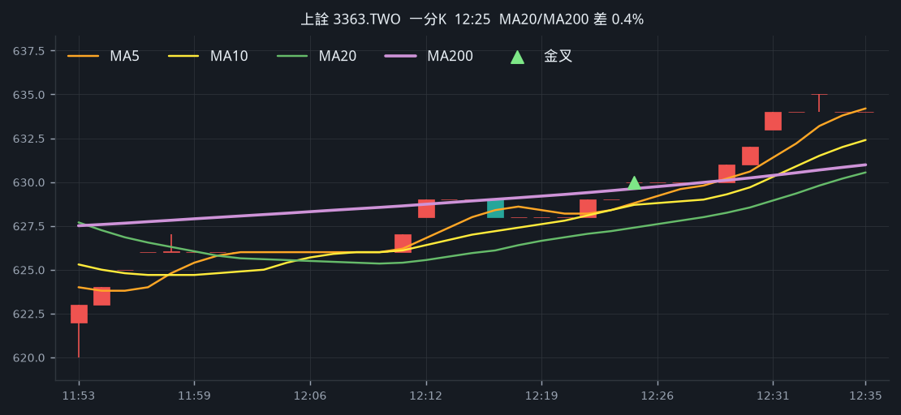

**五分 K（對照）**

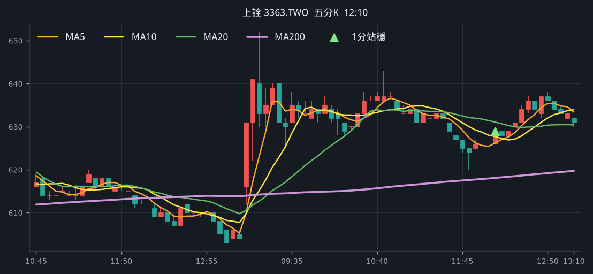

## 19. 中信金 [2891.TW](https://tw.stock.yahoo.com/quote/2891.TW)

- 價格 66.60 -0.30%　成交額排名 #87　26.01 億
- 1分金叉 12:36　收 66.20 > MA200 66.00
- 1分 MA5 66.08 > MA10 66.00 > MA20 65.94　MA20/MA200 差 0.1%
- 五分收盤 / MA200　66.20 > 65.95（+0.4%）

**一分 K**

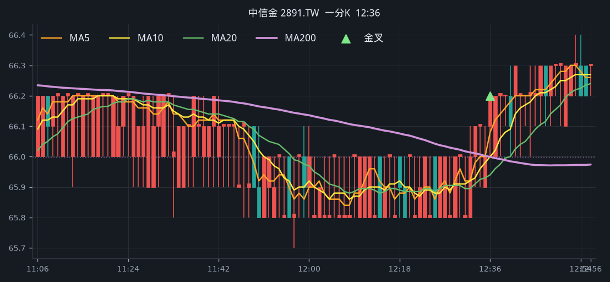

**五分 K（對照）**

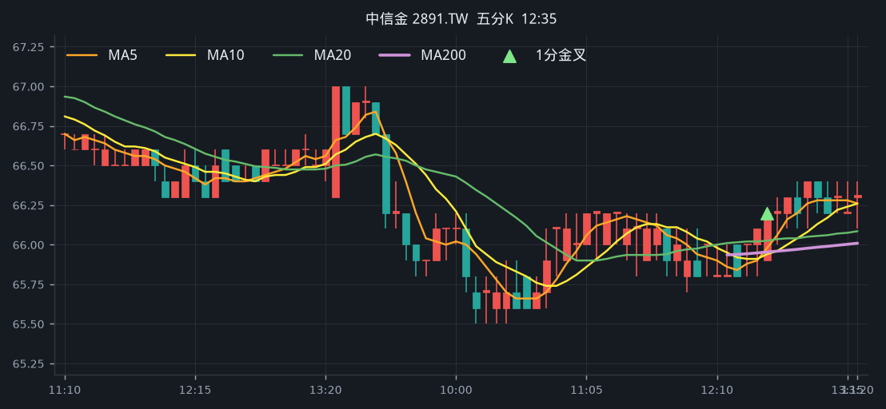

## 20. 晶技 [3042.TW](https://tw.stock.yahoo.com/quote/3042.TW)

- 價格 181.50 +1.40%　成交額排名 #89　24.19 億
- 1分金叉 13:10　收 180.00 > MA200 179.63
- 1分 MA5 179.70 > MA10 179.50 > MA20 179.28　MA20/MA200 差 0.2%
- 五分收盤 / MA200　178.50 > 177.26（+0.7%）

**一分 K**

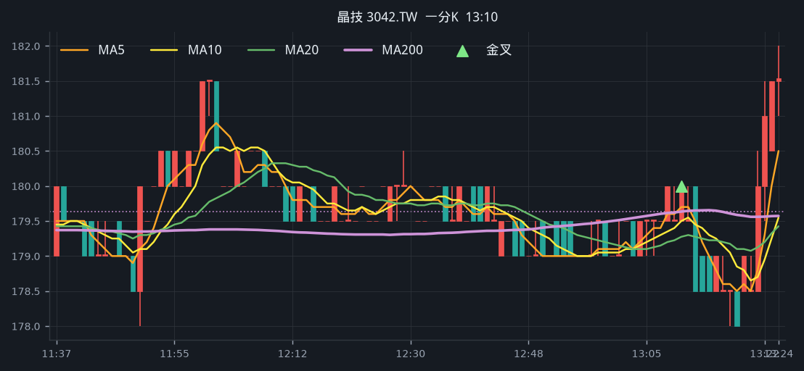

**五分 K（對照）**

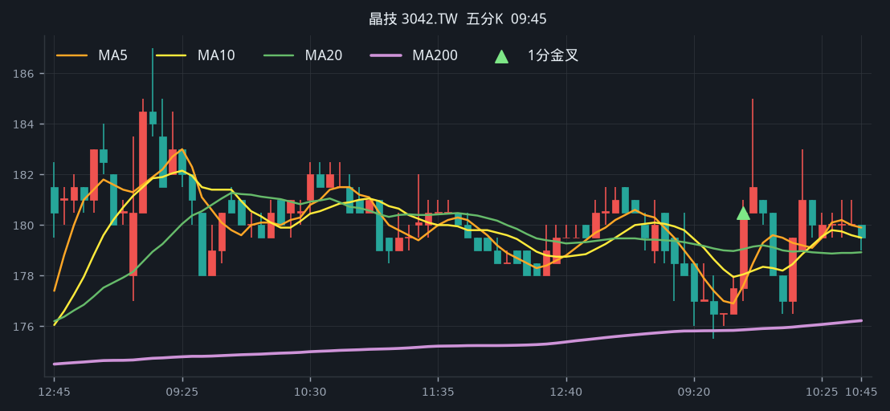

## 21. 強茂 [2481.TW](https://tw.stock.yahoo.com/quote/2481.TW)

- 價格 139.00 -1.77%　成交額排名 #97　21.51 億
- 1分金叉 10:32　收 141.50 > MA200 141.19
- 1分 MA5 141.10 > MA10 140.90 > MA20 140.70　MA20/MA200 差 0.3%
- 五分收盤 / MA200　141.50 > 138.16（+2.4%）

**一分 K**

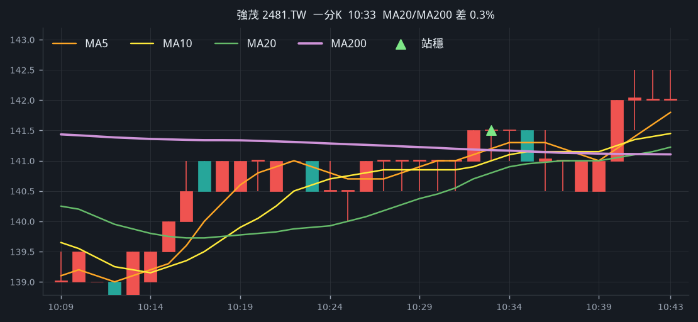

**五分 K（對照）**

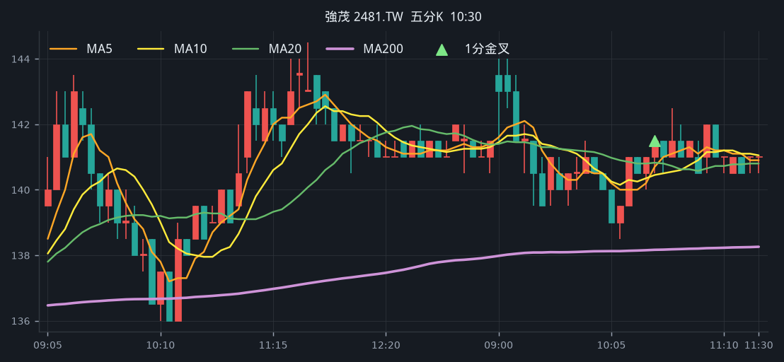

