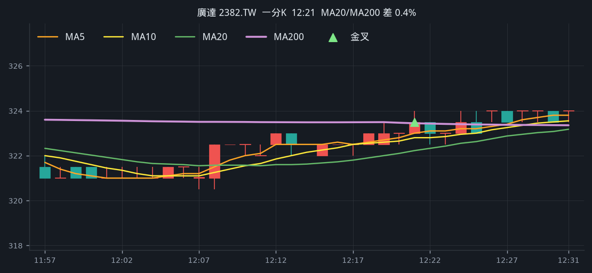
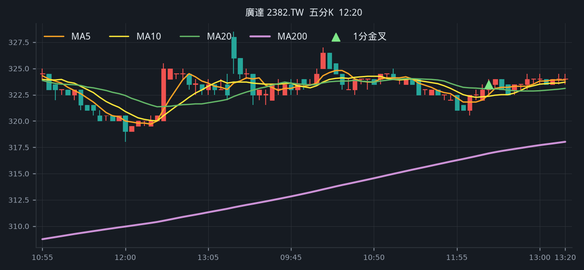
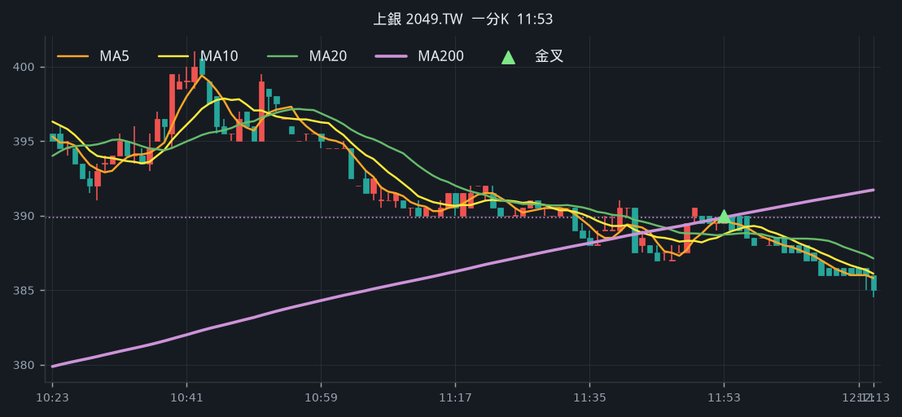
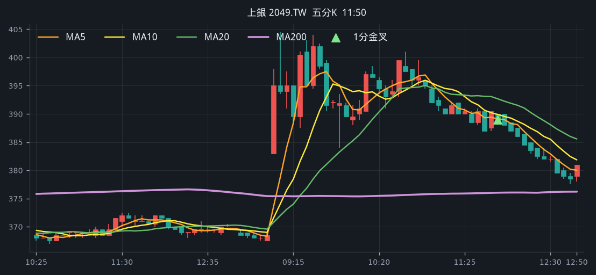

# 回測 2026-08-13（週四）· 一分K剛站上 MA200

用 2026-08-13（週四）當天上市＋上櫃成交額前 100（盤後），濾掉 ETF 與收盤價 650 以上。一分K MA5>MA10>MA20 且拉開（MA5−MA20 ≥ 0.2%），MA20 與 MA200 差距 ≤ 1.5%，且當天第一根收盤剛站上 MA200（開盤跳空不算）；含該金叉的五分K收盤也必須高於五分 MA200。

- 命中 **15** 檔
- 掃描時間 2026-08-17 20:29:11（台北）
- 排行 2026-08-13 盤後成交額
- 前 100 → 濾掉股價 42、ETF 6 → 掃描 52 → 均線糾結 11 → MA20離MA200太遠 0 → 五分MA200底下 2

## 1. 力積電 [6770.TW](https://tw.stock.yahoo.com/quote/6770.TW)

- 價格 74.90 +1.63%　成交額排名 #5　353.99 億
- 1分金叉 12:28　收 75.30 > MA200 74.93
- 1分 MA5 74.84 > MA10 74.62 > MA20 74.35　MA20/MA200 差 0.8%
- 五分收盤 / MA200　75.40 > 70.42（+7.1%）

**一分 K**

**五分 K（對照）**

## 2. 南亞 [1303.TW](https://tw.stock.yahoo.com/quote/1303.TW)

- 價格 189.00 +0.00%　成交額排名 #14　182.12 億
- 1分金叉 10:15　收 190.00 > MA200 189.77
- 1分 MA5 188.40 > MA10 188.25 > MA20 187.53　MA20/MA200 差 1.2%
- 五分收盤 / MA200　191.00 > 187.26（+2.0%）

**一分 K**

**五分 K（對照）**

## 3. 緯創 [3231.TW](https://tw.stock.yahoo.com/quote/3231.TW)

- 價格 197.00 +1.81%　成交額排名 #22　142.34 億
- 1分金叉 12:52　收 197.00 > MA200 196.53
- 1分 MA5 196.10 > MA10 195.55 > MA20 195.45　MA20/MA200 差 0.5%
- 五分收盤 / MA200　197.00 > 192.94（+2.1%）

**一分 K**

**五分 K（對照）**

## 4. 微星 [2377.TW](https://tw.stock.yahoo.com/quote/2377.TW)

- 價格 168.00 -0.59%　成交額排名 #33　86.79 億
- 1分金叉 09:27　收 170.00 > MA200 168.81
- 1分 MA5 167.90 > MA10 167.45 > MA20 166.88　MA20/MA200 差 1.1%
- 五分收盤 / MA200　169.00 > 158.10（+6.9%）

**一分 K**

**五分 K（對照）**

## 5. 健鼎 [3044.TW](https://tw.stock.yahoo.com/quote/3044.TW)

- 價格 495.00 +1.96%　成交額排名 #44　71.05 億
- 1分金叉 11:37　收 493.00 > MA200 492.96
- 1分 MA5 491.80 > MA10 491.25 > MA20 490.35　MA20/MA200 差 0.5%
- 五分收盤 / MA200　493.50 > 449.62（+9.8%）

**一分 K**

**五分 K（對照）**

## 6. 京元電子 [2449.TW](https://tw.stock.yahoo.com/quote/2449.TW)

- 價格 253.50 -2.12%　成交額排名 #46　70.28 億
- 1分金叉 10:54　收 257.50 > MA200 257.47
- 1分 MA5 256.20 > MA10 255.60 > MA20 255.38　MA20/MA200 差 0.8%
- 五分收盤 / MA200　257.50 > 249.89（+3.0%）

**一分 K**

**五分 K（對照）**

## 7. 廣達 [2382.TW](https://tw.stock.yahoo.com/quote/2382.TW)

- 價格 325.00 -0.15%　成交額排名 #50　63.79 億
- 1分金叉 12:21　收 323.50 > MA200 323.44
- 1分 MA5 323.00 > MA10 322.80 > MA20 322.23　MA20/MA200 差 0.4%
- 五分收盤 / MA200　323.50 > 316.92（+2.1%）

**一分 K**

**五分 K（對照）**

## 8. 上銀 [2049.TW](https://tw.stock.yahoo.com/quote/2049.TW)

- 價格 381.00 +3.25%　成交額排名 #60　51.78 億
- 1分金叉 11:53　收 390.00 > MA200 389.88
- 1分 MA5 389.80 > MA10 388.75 > MA20 388.73　MA20/MA200 差 0.3%
- 五分收盤 / MA200　389.00 > 376.02（+3.5%）

**一分 K**

**五分 K（對照）**

## 9. 英業達 [2356.TW](https://tw.stock.yahoo.com/quote/2356.TW)

- 價格 68.80 -0.29%　成交額排名 #61　50.88 億
- 1分金叉 12:35　收 69.60 > MA200 69.58
- 1分 MA5 69.52 > MA10 69.44 > MA20 69.29　MA20/MA200 差 0.4%
- 五分收盤 / MA200　69.60 > 67.19（+3.6%）

**一分 K**

**五分 K（對照）**

## 10. 精材 [3374.TWO](https://tw.stock.yahoo.com/quote/3374.TWO)

- 價格 325.00 -1.52%　成交額排名 #67　44.51 億
- 1分金叉 09:22　收 333.00 > MA200 331.19
- 1分 MA5 330.40 > MA10 329.80 > MA20 328.88　MA20/MA200 差 0.7%
- 五分收盤 / MA200　333.50 > 328.92（+1.4%）

**一分 K**

**五分 K（對照）**

## 11. 順達 [3211.TWO](https://tw.stock.yahoo.com/quote/3211.TWO)

- 價格 406.50 -1.33%　成交額排名 #74　38.13 億
- 1分金叉 09:27　收 413.00 > MA200 411.75
- 1分 MA5 411.30 > MA10 410.60 > MA20 410.43　MA20/MA200 差 0.3%
- 五分收盤 / MA200　412.00 > 383.95（+7.3%）

**一分 K**

**五分 K（對照）**

## 12. 晶技 [3042.TW](https://tw.stock.yahoo.com/quote/3042.TW)

- 價格 186.50 +2.75%　成交額排名 #81　34.85 億
- 1分金叉 12:47　收 187.00 > MA200 186.92
- 1分 MA5 186.40 > MA10 186.10 > MA20 185.68　MA20/MA200 差 0.7%
- 五分收盤 / MA200　187.50 > 181.02（+3.6%）

**一分 K**

**五分 K（對照）**

## 13. 上詮 [3363.TWO](https://tw.stock.yahoo.com/quote/3363.TWO)

- 價格 600.00 -4.76%　成交額排名 #83　33.80 億
- 1分金叉 09:25　收 634.00 > MA200 631.42
- 1分 MA5 629.20 > MA10 626.70 > MA20 624.70　MA20/MA200 差 1.1%
- 五分收盤 / MA200　626.00 > 620.88（+0.8%）

**一分 K**

**五分 K（對照）**

## 14. 盟立 [2464.TW](https://tw.stock.yahoo.com/quote/2464.TW)

- 價格 196.00 -0.25%　成交額排名 #84　33.69 億
- 1分金叉 09:26　收 199.50 > MA200 199.08
- 1分 MA5 197.80 > MA10 197.05 > MA20 196.18　MA20/MA200 差 1.5%
- 五分收盤 / MA200　197.50 > 186.97（+5.6%）

**一分 K**

**五分 K（對照）**

## 15. 聯茂 [6213.TW](https://tw.stock.yahoo.com/quote/6213.TW)

- 價格 469.00 +1.08%　成交額排名 #87　32.52 億
- 1分金叉 10:56　收 463.00 > MA200 462.51
- 1分 MA5 461.00 > MA10 458.15 > MA20 455.65　MA20/MA200 差 1.5%
- 五分收盤 / MA200　464.50 > 437.77（+6.1%）

**一分 K**

**五分 K（對照）**

