# 回測 2026-08-13（週四）· 一分K站穩 MA200

用 2026-08-13（週四）當天上市＋上櫃成交額前 100（盤後），濾掉 ETF、金融股與收盤價 650 以上。一分K MA5>MA10>MA20 且拉開（MA5−MA20 ≥ 0.2%），MA20 與 MA200 差距 ≤ 1.5%，且當天第一根剛站上 MA200、連續兩根收盤站穩再通知（開盤跳空不算）；含該根的五分K收盤也必須高於五分 MA200。

- 命中 **18** 檔
- 掃描時間 2026-08-17 20:44:36（台北）
- 排行 2026-08-13 盤後成交額
- 前 100 → 濾掉股價 42、ETF 6、金融 3 → 掃描 49 → 均線糾結 5 → MA20離MA200太遠 0 → 五分MA200底下 2

## 1. 力積電 [6770.TW](https://tw.stock.yahoo.com/quote/6770.TW)

- 價格 74.90 +1.63%　成交額排名 #5　353.99 億
- 1分站穩 12:29　收 75.40 > MA200 74.93
- 1分 MA5 74.94 > MA10 74.72 > MA20 74.43　MA20/MA200 差 0.7%
- 五分收盤 / MA200　75.40 > 70.42（+7.1%）

**一分 K**

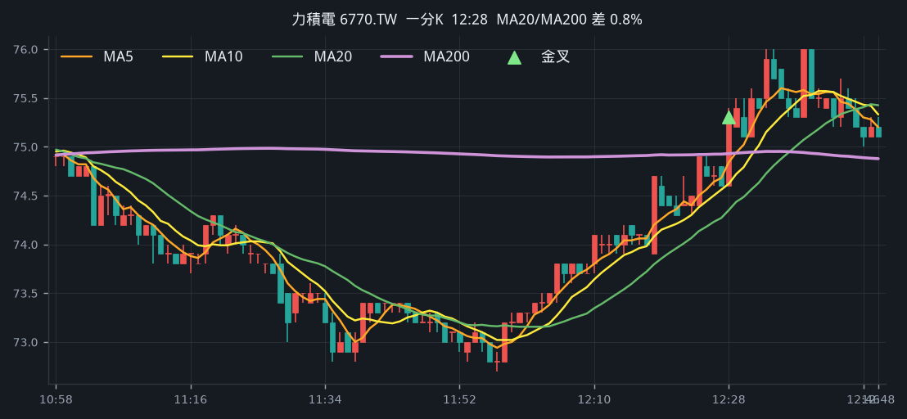

**五分 K（對照）**

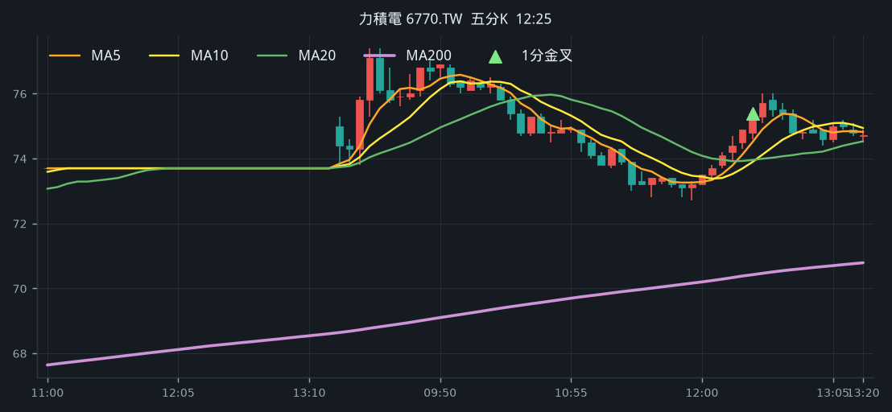

## 2. 臻鼎-KY [4958.TW](https://tw.stock.yahoo.com/quote/4958.TW)

- 價格 477.50 +1.27%　成交額排名 #12　204.32 億
- 1分站穩 10:53　收 480.00 > MA200 479.78
- 1分 MA5 479.50 > MA10 478.95 > MA20 478.30　MA20/MA200 差 0.3%
- 五分收盤 / MA200　479.50 > 478.94（+0.1%）

**一分 K**

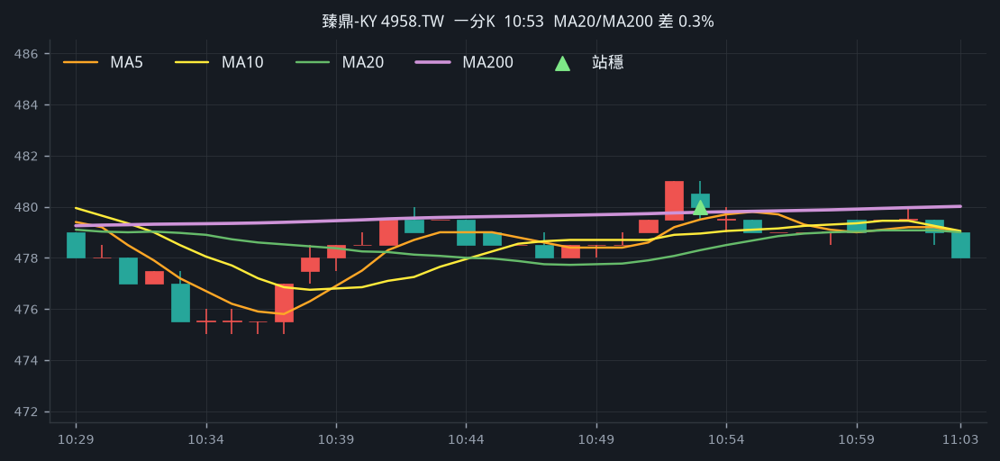

**五分 K（對照）**

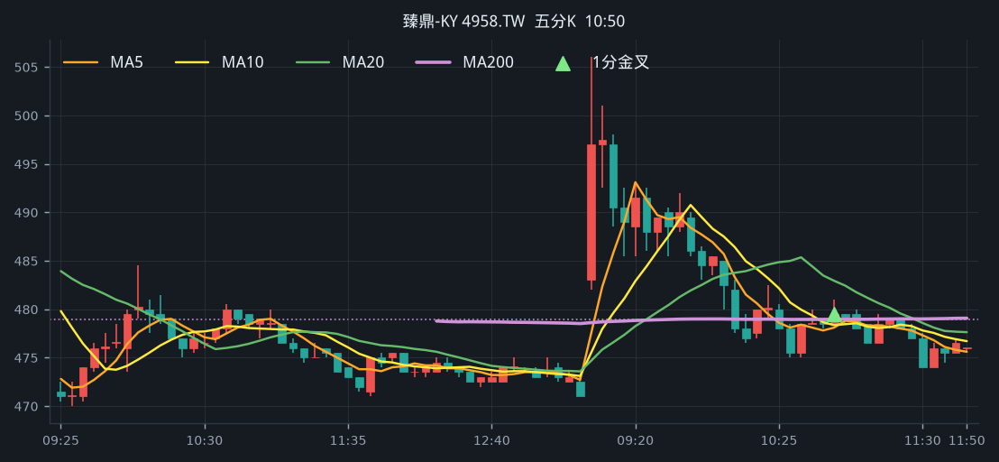

## 3. 金居 [8358.TWO](https://tw.stock.yahoo.com/quote/8358.TWO)

- 價格 421.00 +0.60%　成交額排名 #13　203.39 億
- 1分站穩 11:54　收 427.00 > MA200 425.67
- 1分 MA5 426.20 > MA10 425.70 > MA20 425.10　MA20/MA200 差 0.1%
- 五分收盤 / MA200　427.00 > 389.58（+9.6%）

**一分 K**

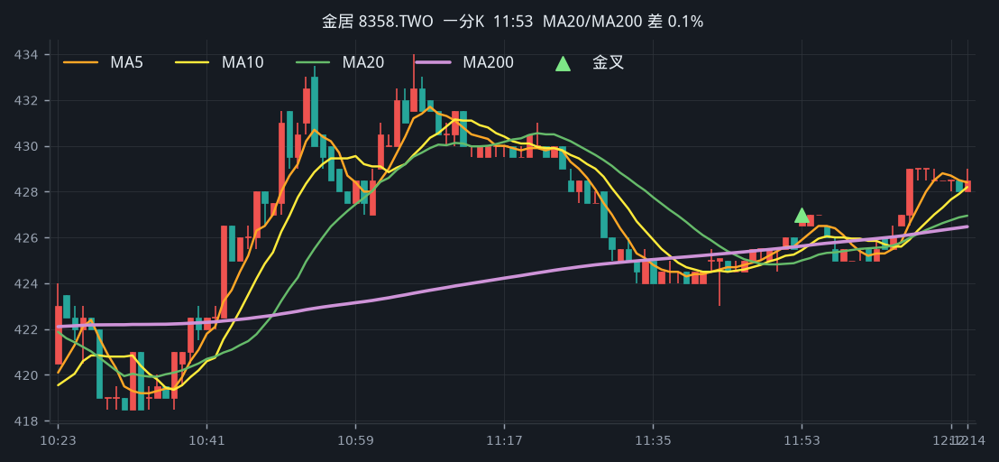

**五分 K（對照）**

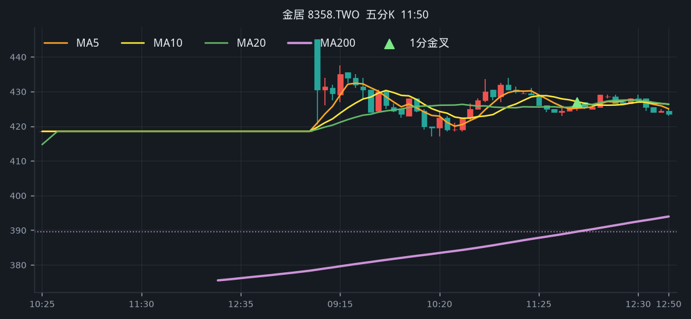

## 4. 南亞 [1303.TW](https://tw.stock.yahoo.com/quote/1303.TW)

- 價格 189.00 +0.00%　成交額排名 #14　182.12 億
- 1分站穩 10:16　收 191.50 > MA200 189.78
- 1分 MA5 189.10 > MA10 188.60 > MA20 187.72　MA20/MA200 差 1.1%
- 五分收盤 / MA200　191.00 > 187.26（+2.0%）

**一分 K**

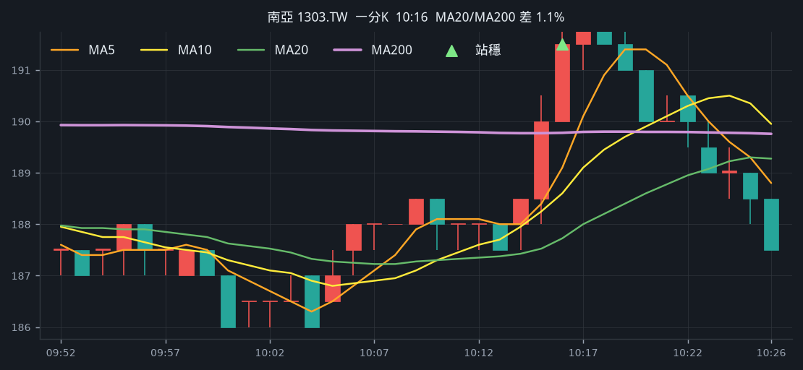

**五分 K（對照）**

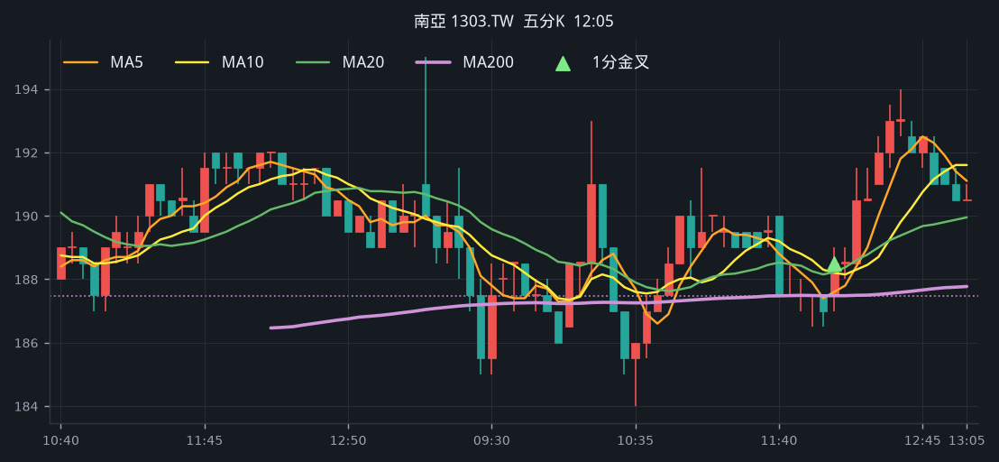

## 5. 中美晶 [5483.TWO](https://tw.stock.yahoo.com/quote/5483.TWO)

- 價格 187.50 +1.35%　成交額排名 #21　145.67 億
- 1分站穩 11:49　收 193.00 > MA200 192.97
- 1分 MA5 192.70 > MA10 192.40 > MA20 192.20　MA20/MA200 差 0.4%
- 五分收盤 / MA200　193.00 > 177.04（+9.0%）

**一分 K**

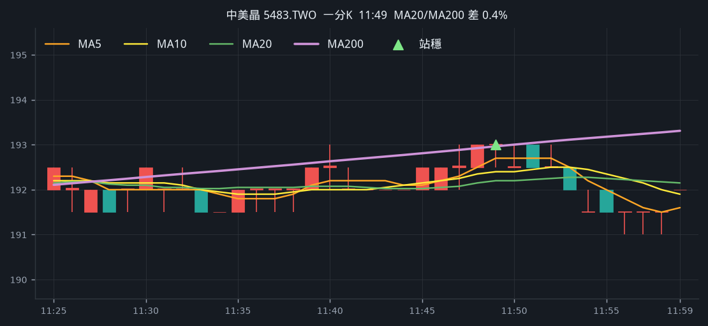

**五分 K（對照）**

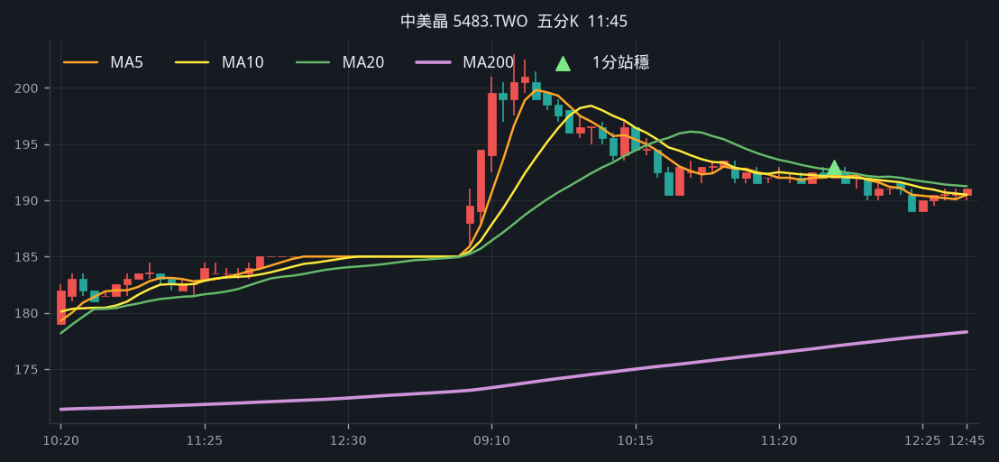

## 6. 緯創 [3231.TW](https://tw.stock.yahoo.com/quote/3231.TW)

- 價格 197.00 +1.81%　成交額排名 #22　142.34 億
- 1分站穩 12:53　收 197.00 > MA200 196.53
- 1分 MA5 196.30 > MA10 195.80 > MA20 195.53　MA20/MA200 差 0.5%
- 五分收盤 / MA200　197.00 > 192.94（+2.1%）

**一分 K**

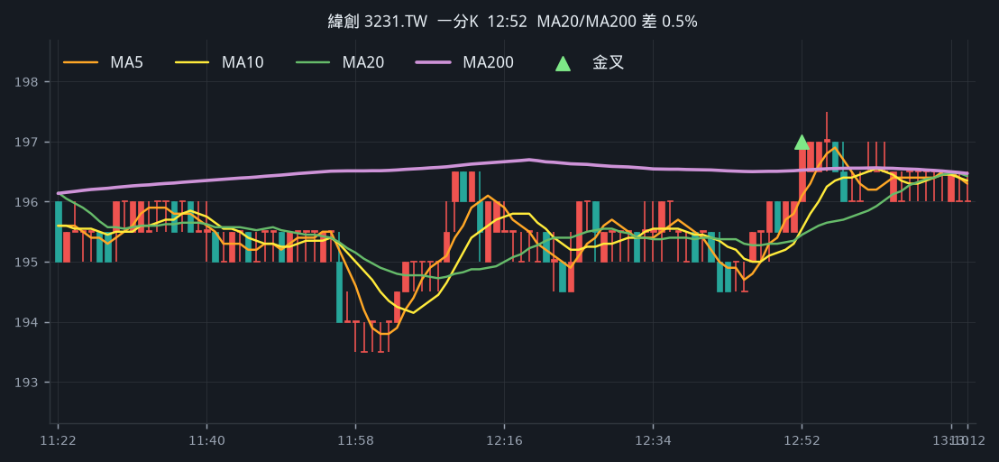

**五分 K（對照）**

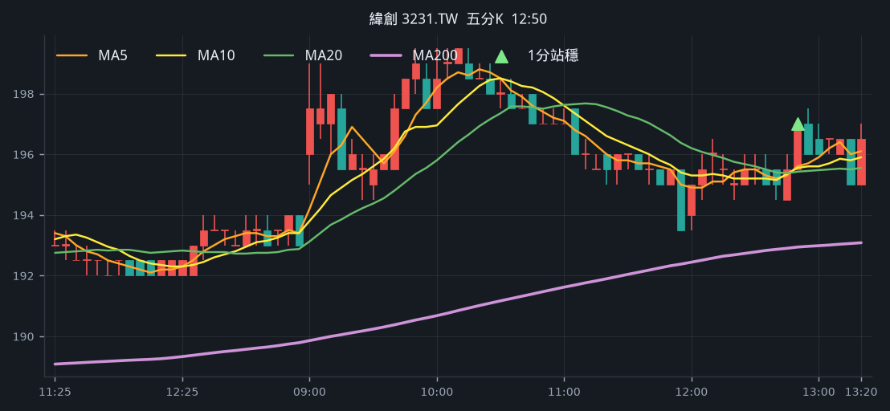

## 7. 日月光投控 [3711.TW](https://tw.stock.yahoo.com/quote/3711.TW)

- 價格 626.00 +0.81%　成交額排名 #24　121.84 億
- 1分站穩 12:53　收 628.00 > MA200 627.95
- 1分 MA5 628.00 > MA10 626.50 > MA20 625.90　MA20/MA200 差 0.3%
- 五分收盤 / MA200　627.00 > 626.00（+0.2%）

**一分 K**

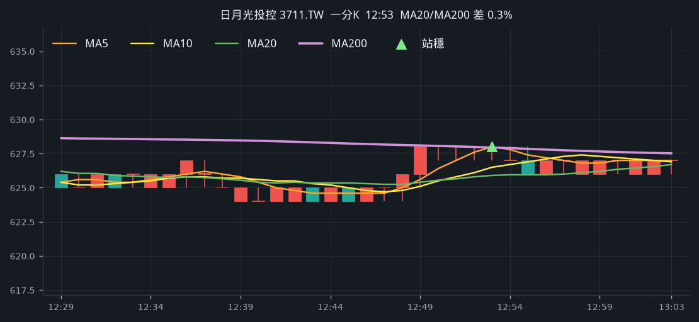

**五分 K（對照）**

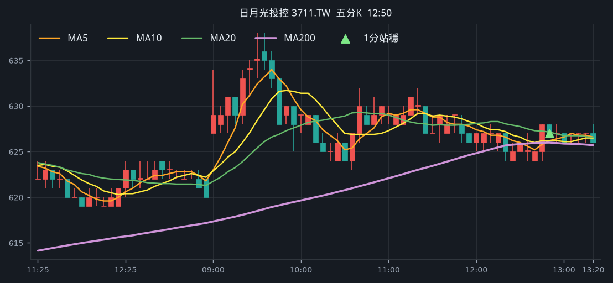

## 8. 微星 [2377.TW](https://tw.stock.yahoo.com/quote/2377.TW)

- 價格 168.00 -0.59%　成交額排名 #33　86.79 億
- 1分站穩 09:28　收 170.00 > MA200 168.81
- 1分 MA5 168.40 > MA10 167.75 > MA20 166.93　MA20/MA200 差 1.1%
- 五分收盤 / MA200　169.00 > 158.10（+6.9%）

**一分 K**

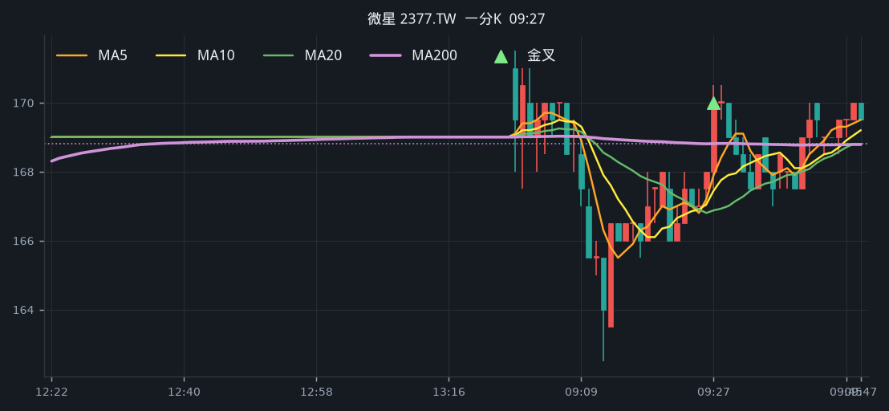

**五分 K（對照）**

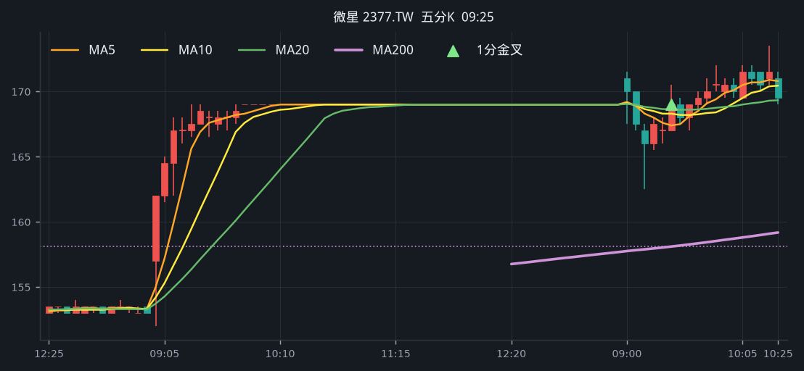

## 9. 健鼎 [3044.TW](https://tw.stock.yahoo.com/quote/3044.TW)

- 價格 495.00 +1.96%　成交額排名 #44　71.05 億
- 1分站穩 11:38　收 494.00 > MA200 493.00
- 1分 MA5 492.50 > MA10 491.70 > MA20 490.60　MA20/MA200 差 0.5%
- 五分收盤 / MA200　493.50 > 449.62（+9.8%）

**一分 K**

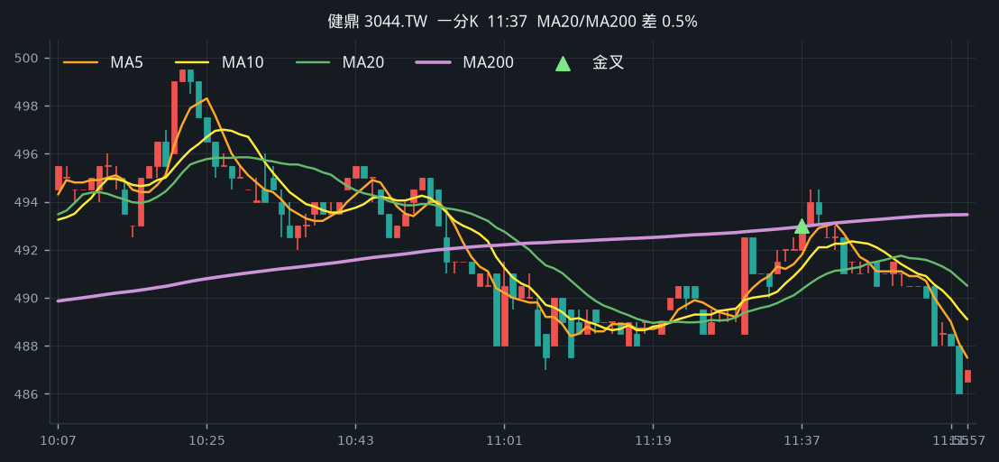

**五分 K（對照）**

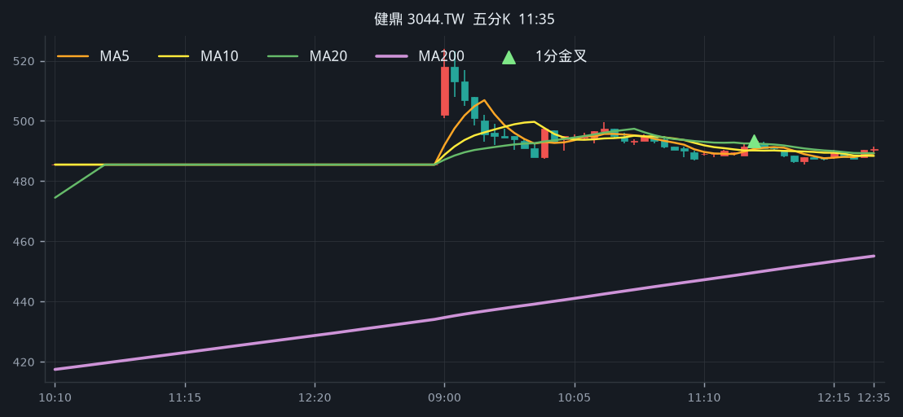

## 10. 京元電子 [2449.TW](https://tw.stock.yahoo.com/quote/2449.TW)

- 價格 253.50 -2.12%　成交額排名 #46　70.28 億
- 1分站穩 10:55　收 257.50 > MA200 257.49
- 1分 MA5 256.80 > MA10 255.80 > MA20 255.57　MA20/MA200 差 0.7%
- 五分收盤 / MA200　257.00 > 249.95（+2.8%）

**一分 K**

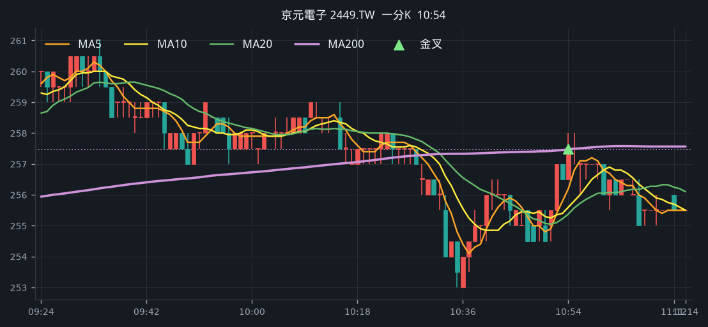

**五分 K（對照）**

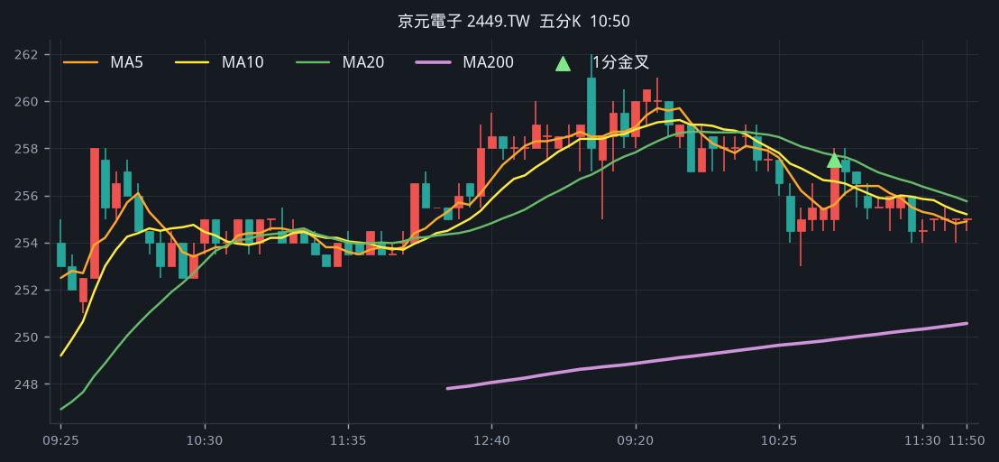

## 11. 英業達 [2356.TW](https://tw.stock.yahoo.com/quote/2356.TW)

- 價格 68.80 -0.29%　成交額排名 #61　50.88 億
- 1分站穩 12:36　收 69.70 > MA200 69.57
- 1分 MA5 69.56 > MA10 69.48 > MA20 69.33　MA20/MA200 差 0.4%
- 五分收盤 / MA200　69.60 > 67.19（+3.6%）

**一分 K**

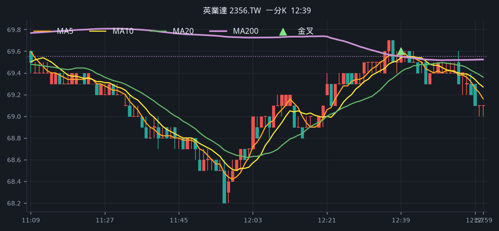

**五分 K（對照）**

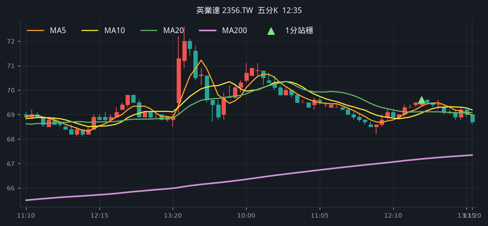

## 12. 精材 [3374.TWO](https://tw.stock.yahoo.com/quote/3374.TWO)

- 價格 325.00 -1.52%　成交額排名 #67　44.51 億
- 1分站穩 09:23　收 333.00 > MA200 331.19
- 1分 MA5 331.00 > MA10 330.45 > MA20 328.93　MA20/MA200 差 0.7%
- 五分收盤 / MA200　333.50 > 328.92（+1.4%）

**一分 K**

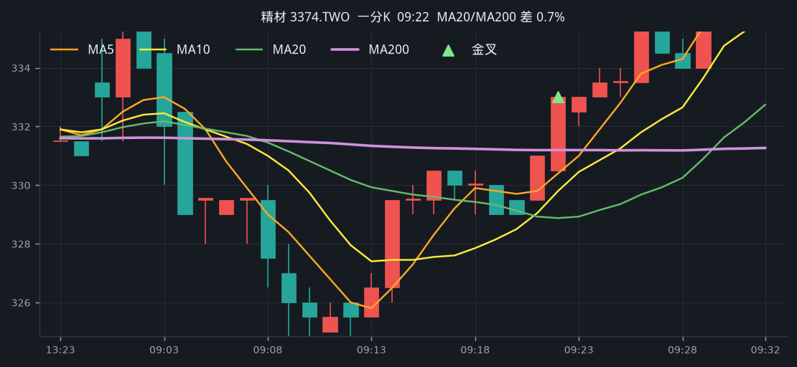

**五分 K（對照）**

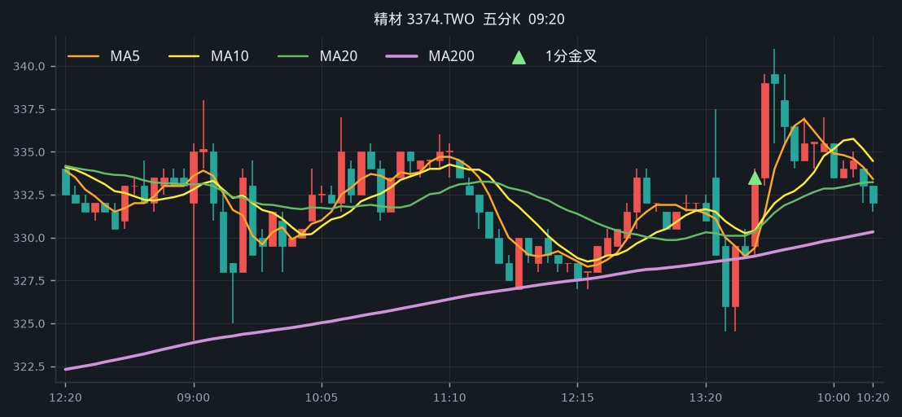

## 13. 欣銓 [3264.TWO](https://tw.stock.yahoo.com/quote/3264.TWO)

- 價格 230.50 +6.47%　成交額排名 #71　38.74 億
- 1分站穩 12:19　收 232.50 > MA200 231.69
- 1分 MA5 231.80 > MA10 231.65 > MA20 231.30　MA20/MA200 差 0.2%
- 五分收盤 / MA200　232.50 > 222.96（+4.3%）

**一分 K**

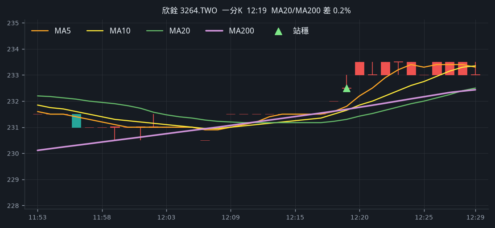

**五分 K（對照）**

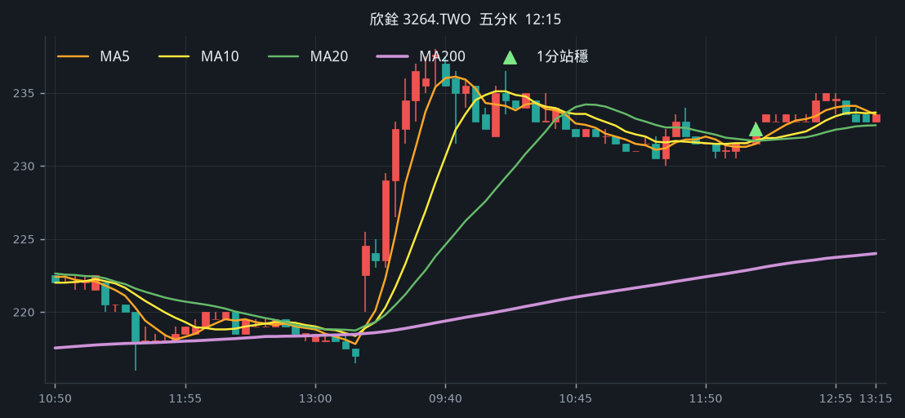

## 14. 順達 [3211.TWO](https://tw.stock.yahoo.com/quote/3211.TWO)

- 價格 406.50 -1.33%　成交額排名 #74　38.13 億
- 1分站穩 09:28　收 413.00 > MA200 411.75
- 1分 MA5 411.80 > MA10 410.75 > MA20 410.57　MA20/MA200 差 0.3%
- 五分收盤 / MA200　412.00 > 383.95（+7.3%）

**一分 K**

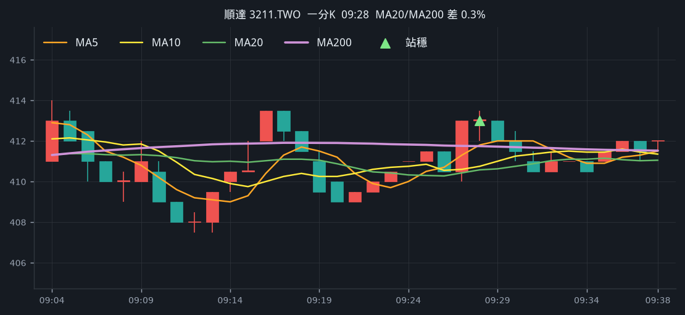

**五分 K（對照）**

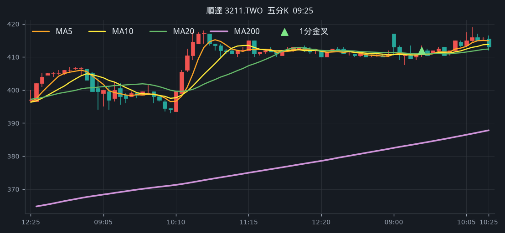

## 15. 晶技 [3042.TW](https://tw.stock.yahoo.com/quote/3042.TW)

- 價格 186.50 +2.75%　成交額排名 #81　34.85 億
- 1分站穩 12:48　收 187.50 > MA200 186.91
- 1分 MA5 186.70 > MA10 186.25 > MA20 185.82　MA20/MA200 差 0.6%
- 五分收盤 / MA200　187.50 > 181.02（+3.6%）

**一分 K**

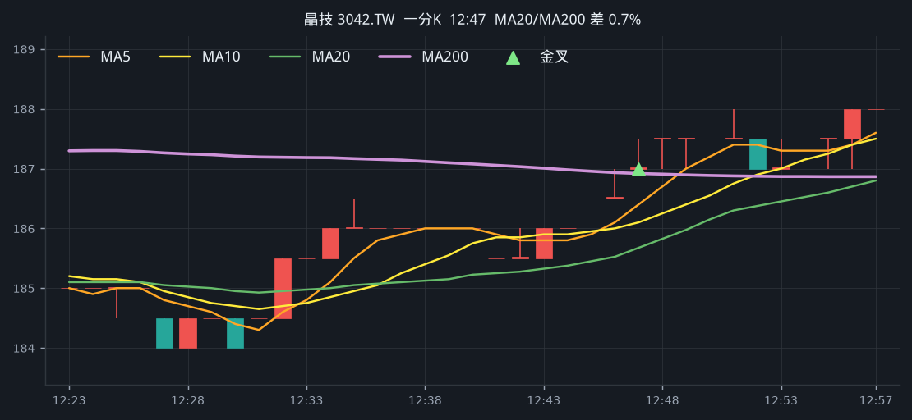

**五分 K（對照）**

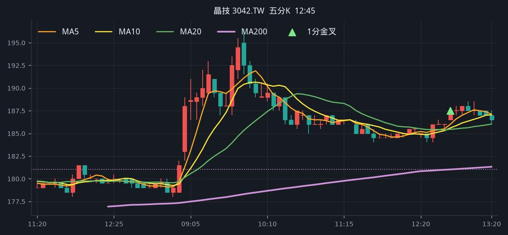

## 16. 上詮 [3363.TWO](https://tw.stock.yahoo.com/quote/3363.TWO)

- 價格 600.00 -4.76%　成交額排名 #83　33.80 億
- 1分站穩 09:26　收 632.00 > MA200 631.40
- 1分 MA5 630.00 > MA10 627.90 > MA20 624.90　MA20/MA200 差 1.0%
- 五分收盤 / MA200　626.00 > 620.88（+0.8%）

**一分 K**

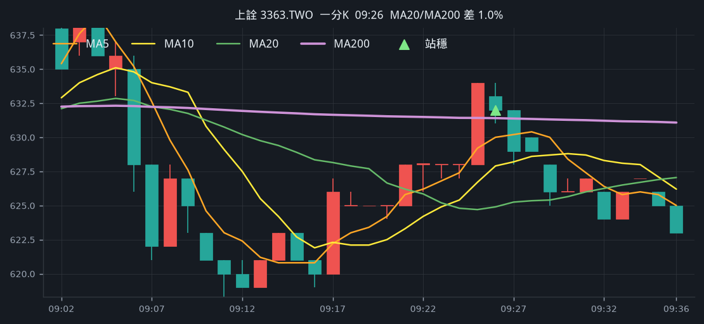

**五分 K（對照）**

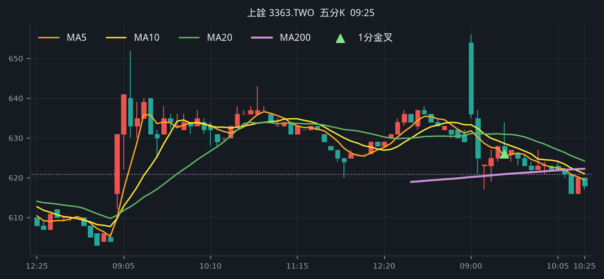

## 17. 盟立 [2464.TW](https://tw.stock.yahoo.com/quote/2464.TW)

- 價格 196.00 -0.25%　成交額排名 #84　33.69 億
- 1分站穩 11:48　收 196.50 > MA200 195.19
- 1分 MA5 195.20 > MA10 194.65 > MA20 194.20　MA20/MA200 差 0.5%
- 五分收盤 / MA200　196.50 > 189.56（+3.7%）

**一分 K**

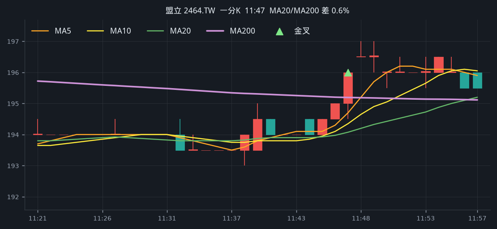

**五分 K（對照）**

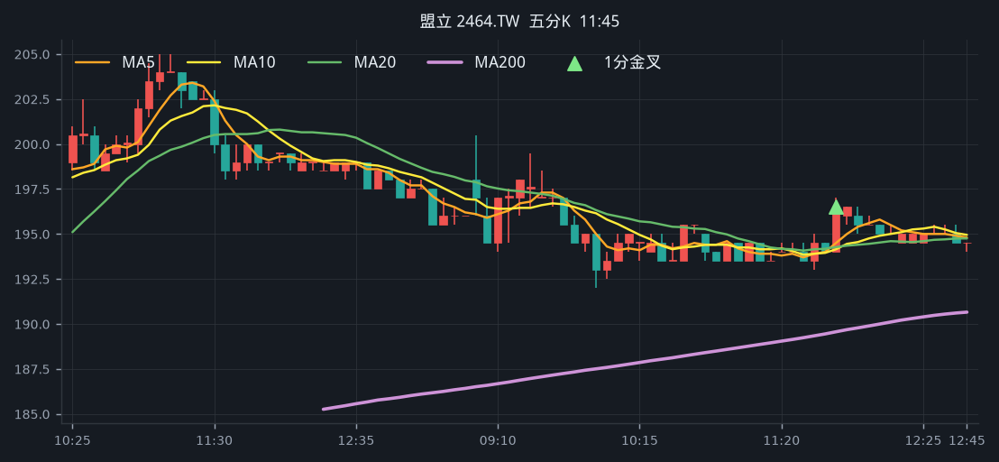

## 18. 聯茂 [6213.TW](https://tw.stock.yahoo.com/quote/6213.TW)

- 價格 469.00 +1.08%　成交額排名 #87　32.52 億
- 1分站穩 10:58　收 464.50 > MA200 462.60
- 1分 MA5 462.10 > MA10 459.60 > MA20 455.98　MA20/MA200 差 1.4%
- 五分收盤 / MA200　464.50 > 437.77（+6.1%）

**一分 K**

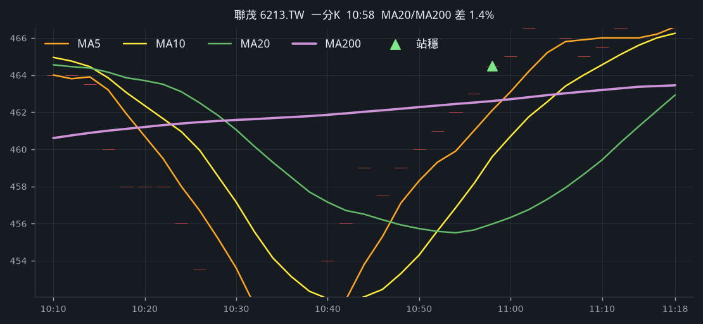

**五分 K（對照）**

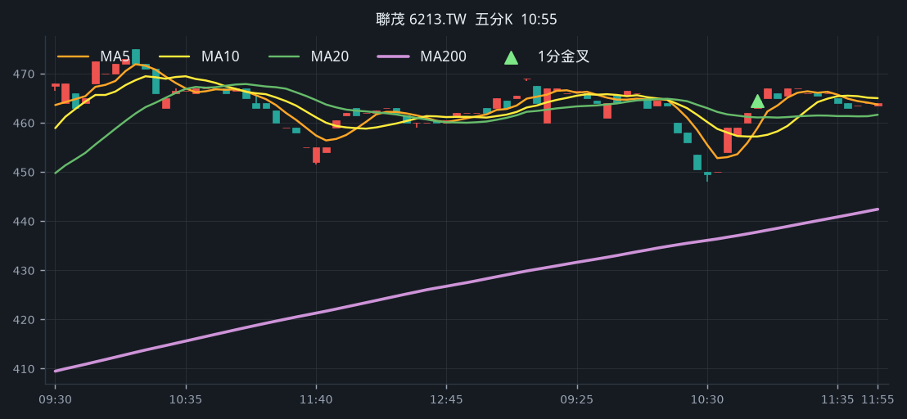

