# 回測 2026-08-14 · 一分K剛站上 MA200

用 2026-08-14 當天上市＋上櫃成交額前 100（盤後），濾掉 ETF 與收盤價 650 以上。一分K MA5>MA10>MA20，且當日這根收盤剛站上 MA200；含該金叉的五分K收盤也必須高於五分 MA200。

- 命中 **24** 檔
- 掃描時間 2026-08-17 13:51:39（台北）
- 排行 2026-08-14 盤後成交額
- 前 100 → 濾掉股價 37、ETF 8 → 掃描 55 → 五分MA200底下 9

## 1. 南亞科 [2408.TW](https://tw.stock.yahoo.com/quote/2408.TW)

- 價格 512.00 -0.39%　成交額排名 #1　544.19 億
- 1分金叉 12:55　收 512.00 > MA200 511.53
- 1分 MA5 507.80 > MA10 506.60 > MA20 506.00
- 五分收盤 / MA200　513.00 > 501.92

**一分 K**

**五分 K（對照）**

## 2. 華邦電 [2344.TW](https://tw.stock.yahoo.com/quote/2344.TW)

- 價格 183.50 +3.67%　成交額排名 #5　447.51 億
- 1分金叉 12:55　收 184.00 > MA200 183.69
- 1分 MA5 182.60 > MA10 182.45 > MA20 182.30
- 五分收盤 / MA200　184.50 > 180.09

**一分 K**

**五分 K（對照）**

## 3. 金居 [8358.TWO](https://tw.stock.yahoo.com/quote/8358.TWO)

- 價格 428.50 +1.78%　成交額排名 #13　192.68 億
- 1分金叉 09:53　收 425.50 > MA200 424.41
- 1分 MA5 422.90 > MA10 421.65 > MA20 419.65
- 五分收盤 / MA200　429.50 > 399.71

**一分 K**

**五分 K（對照）**

## 4. 仁寶 [2324.TW](https://tw.stock.yahoo.com/quote/2324.TW)

- 價格 43.20 +9.92%　成交額排名 #16　173.09 億
- 1分金叉 13:20　收 43.20 > MA200 43.15
- 1分 MA5 43.09 > MA10 43.06 > MA20 43.02
- 五分收盤 / MA200　43.20 > 39.85

**一分 K**

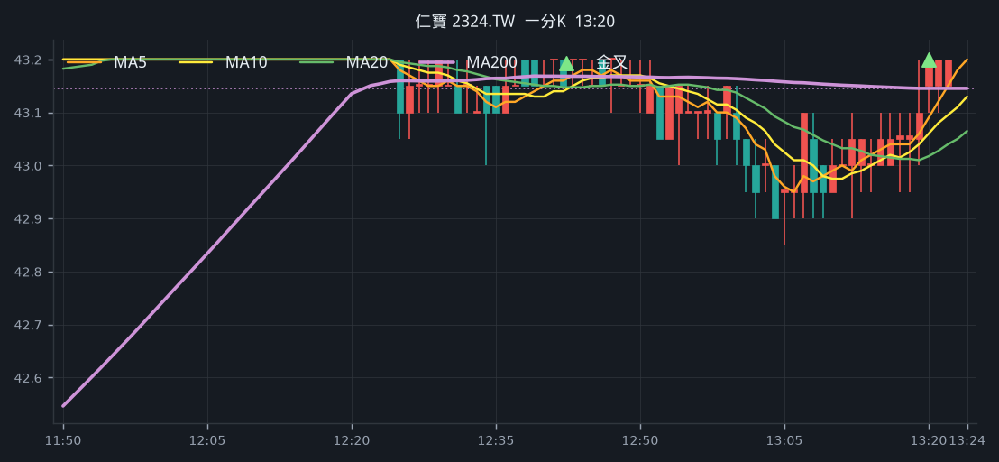

**五分 K（對照）**

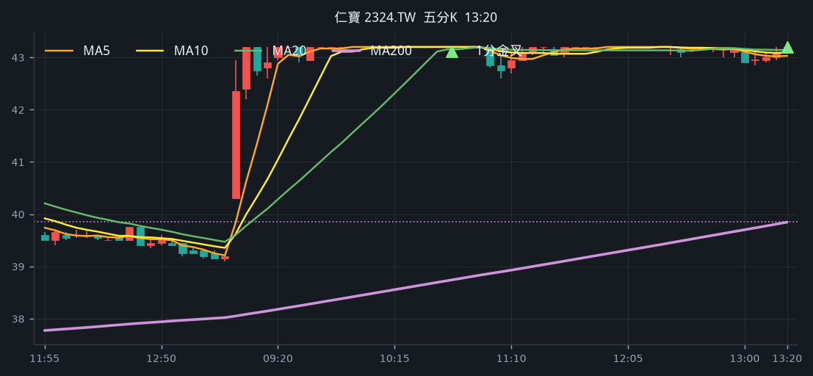

## 5. 華新科 [2492.TW](https://tw.stock.yahoo.com/quote/2492.TW)

- 價格 302.50 -4.42%　成交額排名 #20　153.67 億
- 1分金叉 11:25　收 313.50 > MA200 313.18
- 1分 MA5 311.20 > MA10 309.30 > MA20 306.85
- 五分收盤 / MA200　312.50 > 301.75

**一分 K**

**五分 K（對照）**

## 6. 廣達 [2382.TW](https://tw.stock.yahoo.com/quote/2382.TW)

- 價格 327.50 +0.77%　成交額排名 #24　146.03 億
- 1分金叉 11:43　收 330.50 > MA200 329.59
- 1分 MA5 329.80 > MA10 329.70 > MA20 329.43
- 五分收盤 / MA200　330.50 > 321.33

**一分 K**

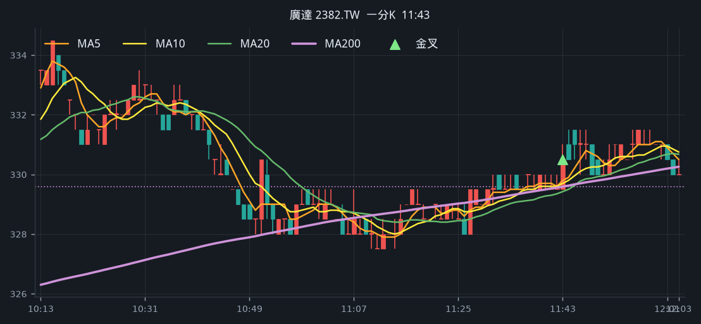

**五分 K（對照）**

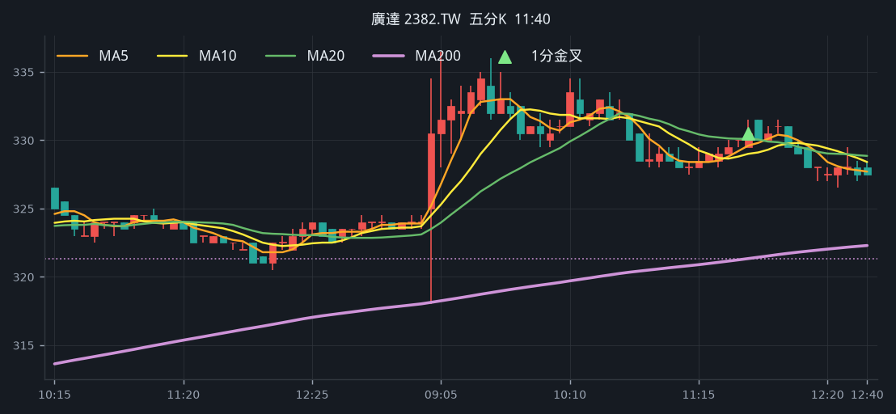

## 7. 聯電 [2303.TW](https://tw.stock.yahoo.com/quote/2303.TW)

- 價格 121.00 -2.81%　成交額排名 #25　140.65 億
- 1分金叉 10:07　收 124.50 > MA200 124.03
- 1分 MA5 124.30 > MA10 123.90 > MA20 123.80
- 五分收盤 / MA200　124.00 > 123.26

**一分 K**

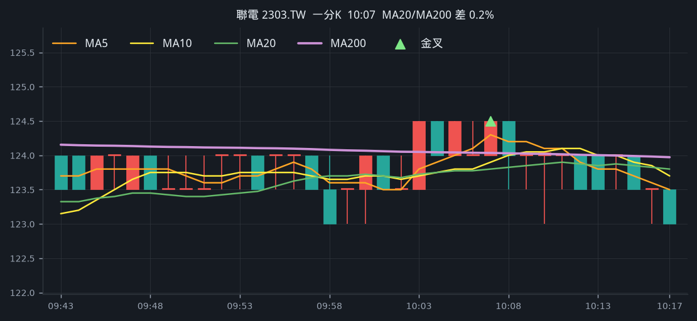

**五分 K（對照）**

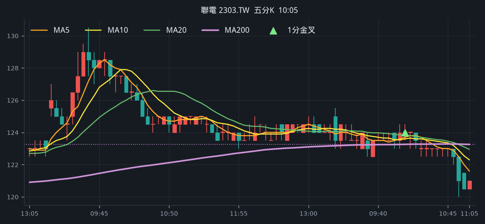

## 8. 合晶 [6182.TWO](https://tw.stock.yahoo.com/quote/6182.TWO)

- 價格 111.50 -1.33%　成交額排名 #26　140.39 億
- 1分金叉 11:26　收 115.00 > MA200 114.86
- 1分 MA5 114.20 > MA10 113.95 > MA20 113.85
- 五分收盤 / MA200　115.00 > 104.34

**一分 K**

**五分 K（對照）**

## 9. 光寶科 [2301.TW](https://tw.stock.yahoo.com/quote/2301.TW)

- 價格 267.00 -0.93%　成交額排名 #43　57.82 億
- 1分金叉 12:42　收 266.00 > MA200 265.46
- 1分 MA5 265.10 > MA10 263.20 > MA20 262.68
- 五分收盤 / MA200　267.00 > 266.03

**一分 K**

**五分 K（對照）**

## 10. 技嘉 [2376.TW](https://tw.stock.yahoo.com/quote/2376.TW)

- 價格 397.50 +1.02%　成交額排名 #46　56.57 億
- 1分金叉 12:52　收 393.50 > MA200 393.43
- 1分 MA5 393.30 > MA10 392.85 > MA20 392.00
- 五分收盤 / MA200　394.00 > 376.73

**一分 K**

**五分 K（對照）**

## 11. 漢翔 [2634.TW](https://tw.stock.yahoo.com/quote/2634.TW)

- 價格 70.60 +9.97%　成交額排名 #48　54.32 億
- 1分金叉 09:28　收 64.20 > MA200 63.90
- 1分 MA5 63.76 > MA10 63.67 > MA20 63.65
- 五分收盤 / MA200　64.70 > 62.14

**一分 K**

**五分 K（對照）**

## 12. 台勝科 [3532.TW](https://tw.stock.yahoo.com/quote/3532.TW)

- 價格 356.00 +3.79%　成交額排名 #50　53.15 億
- 1分金叉 12:38　收 347.00 > MA200 345.48
- 1分 MA5 345.60 > MA10 345.45 > MA20 344.68
- 五分收盤 / MA200　349.00 > 316.88

**一分 K**

**五分 K（對照）**

## 13. 中美晶 [5483.TWO](https://tw.stock.yahoo.com/quote/5483.TWO)

- 價格 188.00 +0.27%　成交額排名 #52　47.93 億
- 1分金叉 13:22　收 187.50 > MA200 187.36
- 1分 MA5 187.40 > MA10 187.05 > MA20 186.10
- 五分收盤 / MA200　187.50 > 183.54

**一分 K**

**五分 K（對照）**

## 14. 所羅門 [2359.TW](https://tw.stock.yahoo.com/quote/2359.TW)

- 價格 159.50 +1.59%　成交額排名 #58　42.34 億
- 1分金叉 09:01　收 159.00 > MA200 157.00
- 1分 MA5 157.30 > MA10 157.15 > MA20 157.07
- 五分收盤 / MA200　163.00 > 148.31

**一分 K**

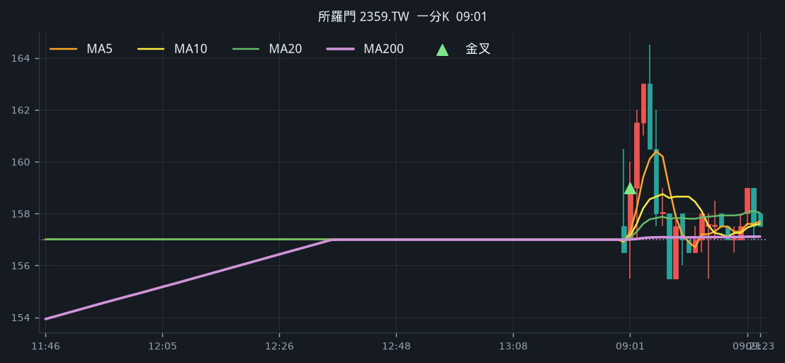

**五分 K（對照）**

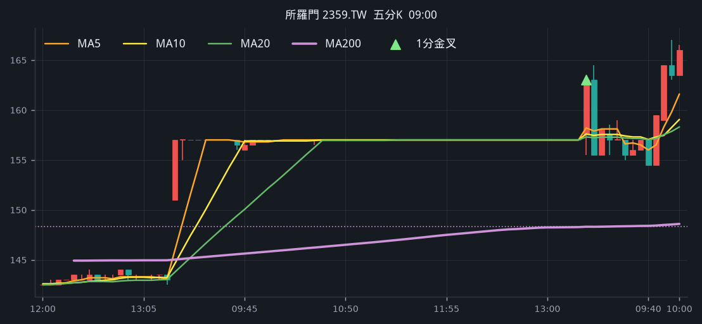

## 15. 英業達 [2356.TW](https://tw.stock.yahoo.com/quote/2356.TW)

- 價格 69.90 +1.60%　成交額排名 #59　42.32 億
- 1分金叉 11:51　收 70.70 > MA200 70.68
- 1分 MA5 70.54 > MA10 70.50 > MA20 70.45
- 五分收盤 / MA200　70.80 > 68.29

**一分 K**

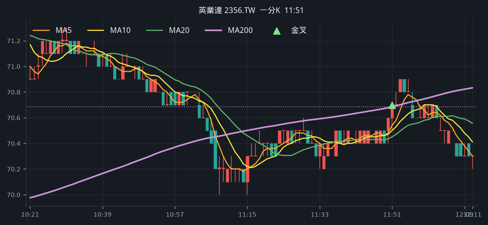

**五分 K（對照）**

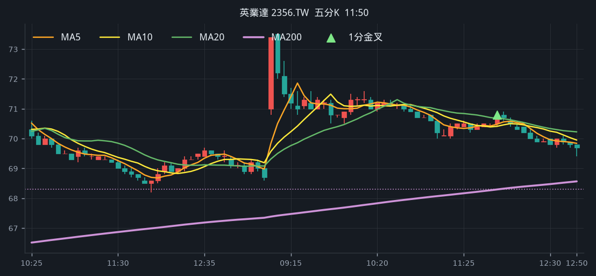

## 16. 力成 [6239.TW](https://tw.stock.yahoo.com/quote/6239.TW)

- 價格 278.00 -1.77%　成交額排名 #60　42.03 億
- 1分金叉 09:56　收 285.00 > MA200 284.86
- 1分 MA5 285.10 > MA10 285.05 > MA20 284.55
- 五分收盤 / MA200　285.50 > 284.51

**一分 K**

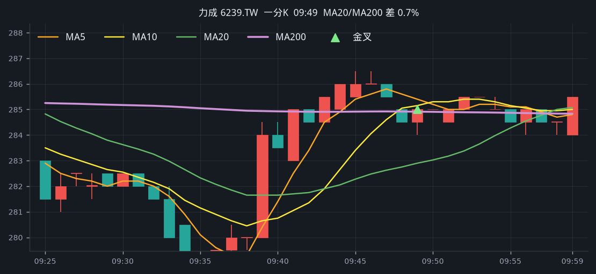

**五分 K（對照）**

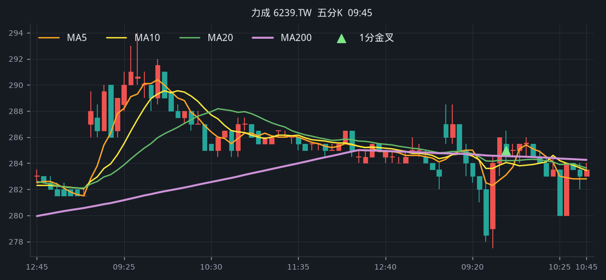

## 17. 南茂 [8150.TW](https://tw.stock.yahoo.com/quote/8150.TW)

- 價格 91.90 -1.08%　成交額排名 #69　37.03 億
- 1分金叉 09:04　收 94.60 > MA200 94.23
- 1分 MA5 94.66 > MA10 93.78 > MA20 93.44
- 五分收盤 / MA200　94.60 > 94.00

**一分 K**

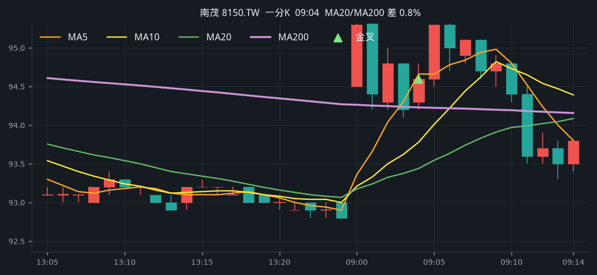

**五分 K（對照）**

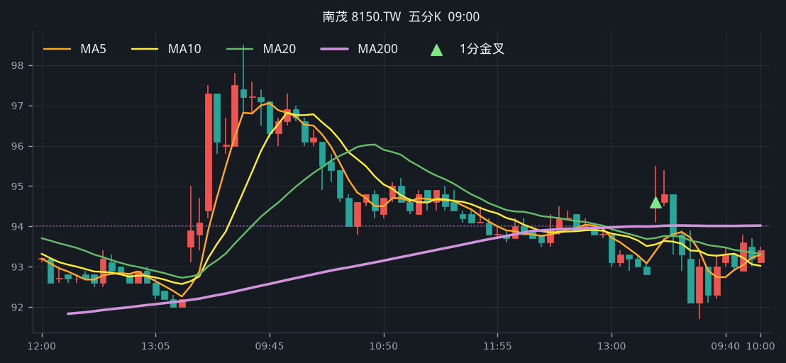

## 18. 頎邦 [6147.TWO](https://tw.stock.yahoo.com/quote/6147.TWO)

- 價格 157.50 -4.26%　成交額排名 #76　34.36 億
- 1分金叉 11:23　收 163.50 > MA200 162.40
- 1分 MA5 163.50 > MA10 161.85 > MA20 160.28
- 五分收盤 / MA200　163.50 > 159.19

**一分 K**

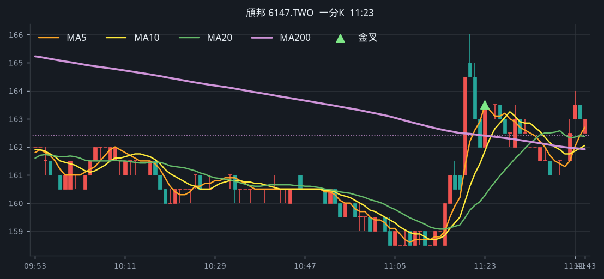

**五分 K（對照）**

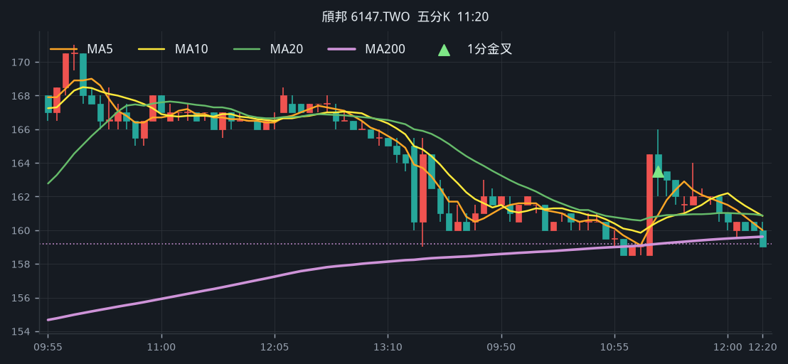

## 19. 中光電 [5371.TWO](https://tw.stock.yahoo.com/quote/5371.TWO)

- 價格 90.10 +4.40%　成交額排名 #77　33.04 億
- 1分金叉 10:33　收 86.70 > MA200 86.31
- 1分 MA5 86.40 > MA10 86.14 > MA20 86.00
- 五分收盤 / MA200　86.60 > 85.65

**一分 K**

**五分 K（對照）**

## 20. 長榮 [2603.TW](https://tw.stock.yahoo.com/quote/2603.TW)

- 價格 219.00 +1.62%　成交額排名 #82　29.22 億
- 1分金叉 09:22　收 216.00 > MA200 214.69
- 1分 MA5 214.50 > MA10 214.05 > MA20 213.62
- 五分收盤 / MA200　216.50 > 215.15

**一分 K**

**五分 K（對照）**

## 21. 玉晶光 [3406.TW](https://tw.stock.yahoo.com/quote/3406.TW)

- 價格 615.00 -2.23%　成交額排名 #84　28.05 億
- 1分金叉 10:38　收 623.00 > MA200 620.93
- 1分 MA5 619.20 > MA10 616.70 > MA20 612.80
- 五分收盤 / MA200　624.00 > 570.25

**一分 K**

**五分 K（對照）**

## 22. 健鼎 [3044.TW](https://tw.stock.yahoo.com/quote/3044.TW)

- 價格 488.00 -1.41%　成交額排名 #86　26.87 億
- 1分金叉 09:28　收 493.00 > MA200 490.80
- 1分 MA5 491.70 > MA10 491.65 > MA20 491.57
- 五分收盤 / MA200　494.00 > 461.56

**一分 K**

**五分 K（對照）**

## 23. 萬海 [2615.TW](https://tw.stock.yahoo.com/quote/2615.TW)

- 價格 90.60 +3.54%　成交額排名 #94　25.07 億
- 1分金叉 09:22　收 87.70 > MA200 87.56
- 1分 MA5 87.50 > MA10 87.43 > MA20 87.33
- 五分收盤 / MA200　87.90 > 87.24

**一分 K**

**五分 K（對照）**

## 24. 宏致 [3605.TW](https://tw.stock.yahoo.com/quote/3605.TW)

- 價格 131.50 -0.38%　成交額排名 #95　24.99 億
- 1分金叉 13:17　收 132.50 > MA200 132.35
- 1分 MA5 132.20 > MA10 131.50 > MA20 131.10
- 五分收盤 / MA200　131.50 > 124.56

**一分 K**

**五分 K（對照）**

