# 回測 2026-08-14（週五）· 一分K站穩 MA200

用 2026-08-14（週五）當天上市＋上櫃成交額前 100（盤後），濾掉 ETF 與收盤價 650 以上。一分K MA5>MA10>MA20 且拉開（MA5−MA20 ≥ 0.2%），MA20 與 MA200 差距 ≤ 1.5%，且當天第一根剛站上 MA200、連續兩根收盤站穩再通知（開盤跳空不算）；含該根的五分K收盤也必須高於五分 MA200。

- 命中 **17** 檔
- 掃描時間 2026-08-17 20:37:29（台北）
- 排行 2026-08-14 盤後成交額
- 前 100 → 濾掉股價 37、ETF 8 → 掃描 55 → 均線糾結 4 → MA20離MA200太遠 1 → 五分MA200底下 5

## 1. 南亞科 [2408.TW](https://tw.stock.yahoo.com/quote/2408.TW)

- 價格 512.00 -0.39%　成交額排名 #1　544.19 億
- 1分站穩 12:56　收 516.00 > MA200 511.49
- 1分 MA5 509.80 > MA10 507.70 > MA20 506.75　MA20/MA200 差 0.9%
- 五分收盤 / MA200　513.00 > 501.92（+2.2%）

**一分 K**

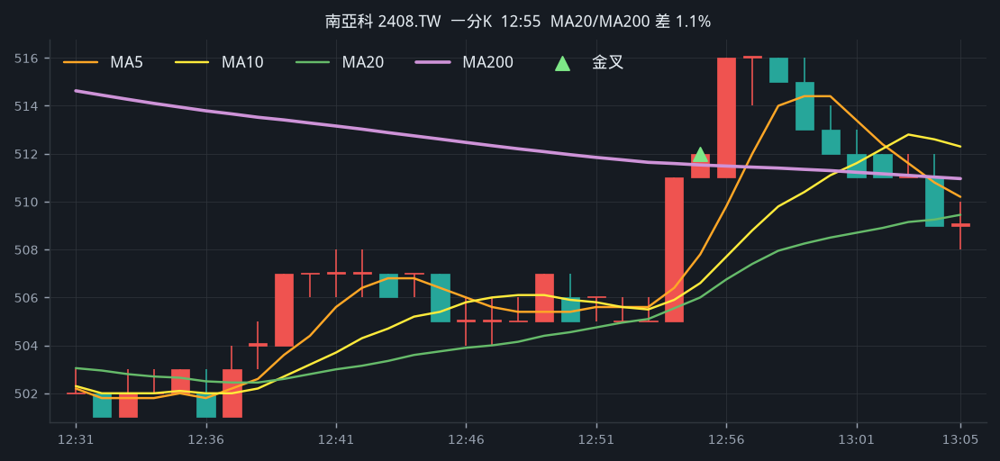

**五分 K（對照）**

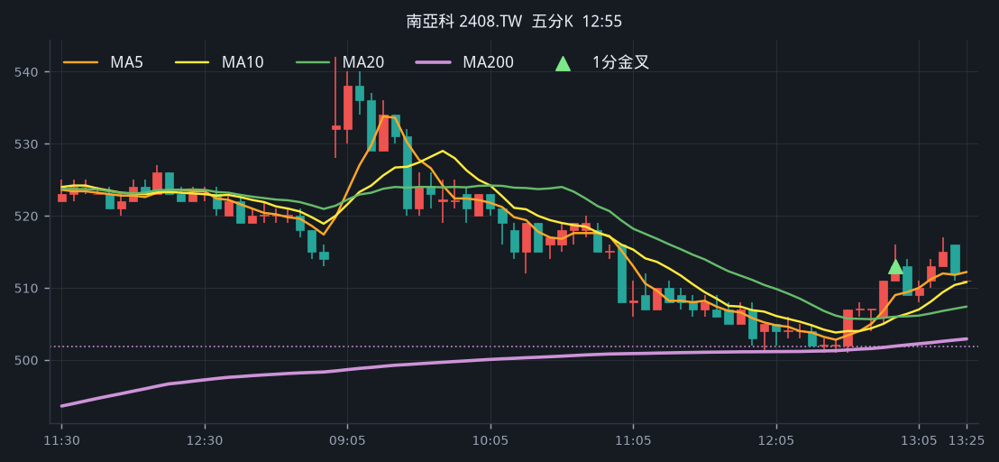

## 2. 華邦電 [2344.TW](https://tw.stock.yahoo.com/quote/2344.TW)

- 價格 183.50 +3.67%　成交額排名 #5　447.51 億
- 1分站穩 12:56　收 184.50 > MA200 183.68
- 1分 MA5 183.00 > MA10 182.65 > MA20 182.47　MA20/MA200 差 0.7%
- 五分收盤 / MA200　184.50 > 180.09（+2.5%）

**一分 K**

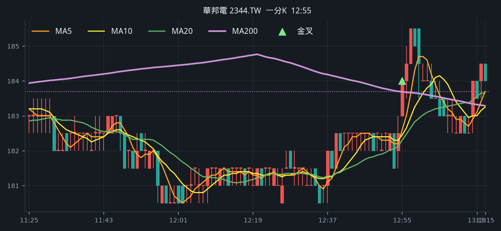

**五分 K（對照）**

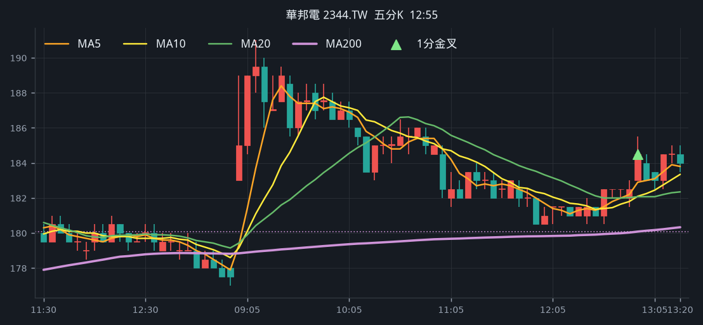

## 3. 金居 [8358.TWO](https://tw.stock.yahoo.com/quote/8358.TWO)

- 價格 428.50 +1.78%　成交額排名 #13　192.68 億
- 1分站穩 09:54　收 429.50 > MA200 424.41
- 1分 MA5 424.80 > MA10 422.50 > MA20 420.40　MA20/MA200 差 0.9%
- 五分收盤 / MA200　429.50 > 399.71（+7.5%）

**一分 K**

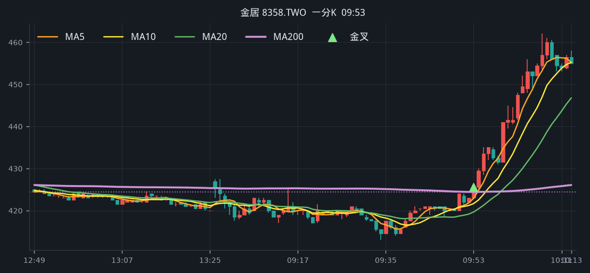

**五分 K（對照）**

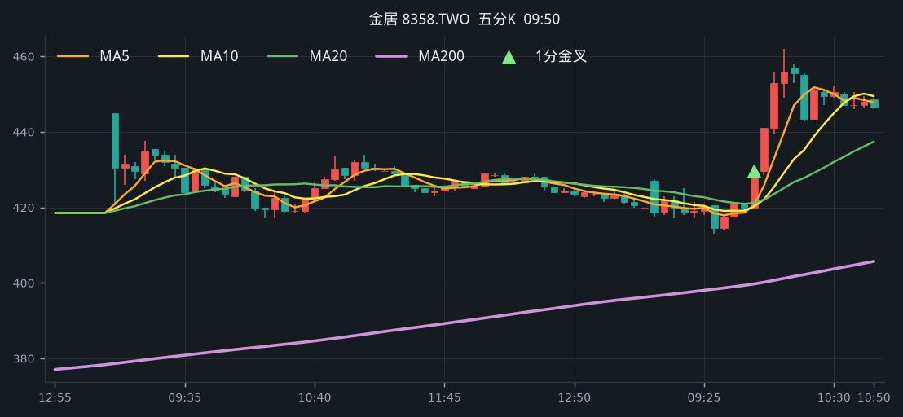

## 4. 華新科 [2492.TW](https://tw.stock.yahoo.com/quote/2492.TW)

- 價格 302.50 -4.42%　成交額排名 #20　153.67 億
- 1分站穩 09:42　收 318.50 > MA200 315.76
- 1分 MA5 315.70 > MA10 314.30 > MA20 312.60　MA20/MA200 差 1.0%
- 五分收盤 / MA200　319.50 > 297.01（+7.6%）

**一分 K**

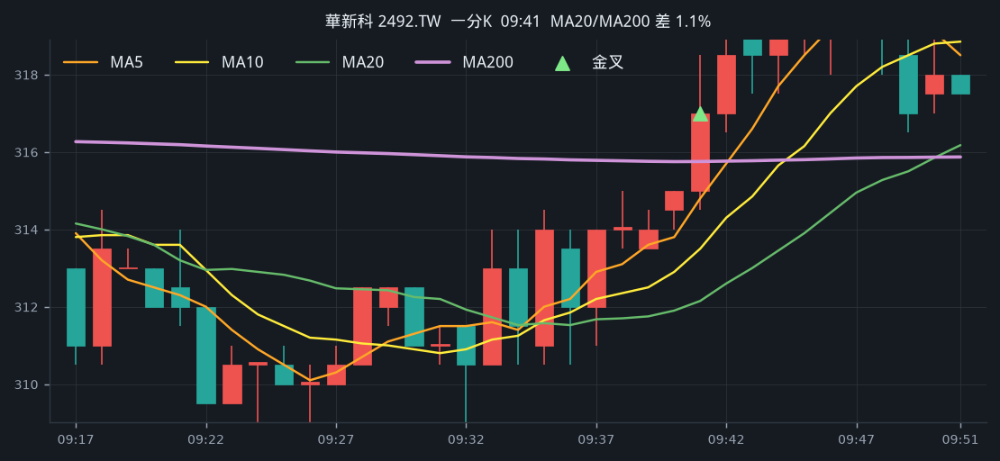

**五分 K（對照）**

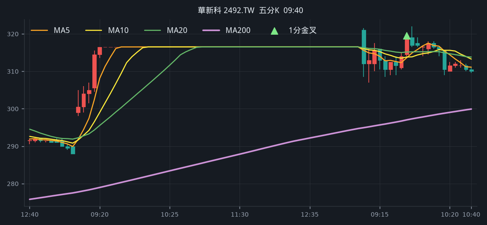

## 5. 合晶 [6182.TWO](https://tw.stock.yahoo.com/quote/6182.TWO)

- 價格 111.50 -1.33%　成交額排名 #26　140.39 億
- 1分站穩 11:27　收 115.00 > MA200 114.86
- 1分 MA5 114.50 > MA10 114.05 > MA20 113.88　MA20/MA200 差 0.9%
- 五分收盤 / MA200　115.00 > 104.34（+10.2%）

**一分 K**

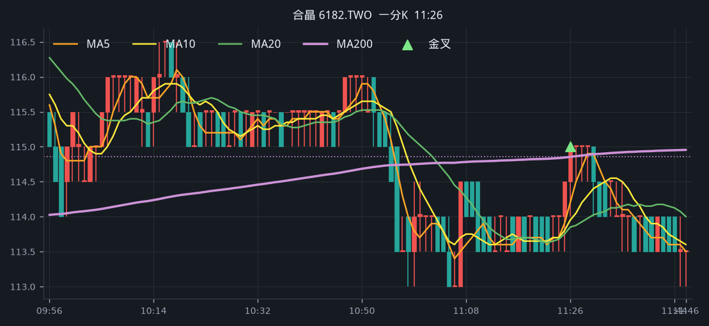

**五分 K（對照）**

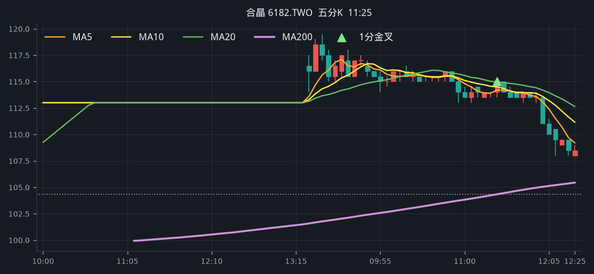

## 6. 光寶科 [2301.TW](https://tw.stock.yahoo.com/quote/2301.TW)

- 價格 267.00 -0.93%　成交額排名 #43　57.82 億
- 1分站穩 12:43　收 266.00 > MA200 265.44
- 1分 MA5 265.80 > MA10 263.65 > MA20 262.85　MA20/MA200 差 1.0%
- 五分收盤 / MA200　267.00 > 266.03（+0.4%）

**一分 K**

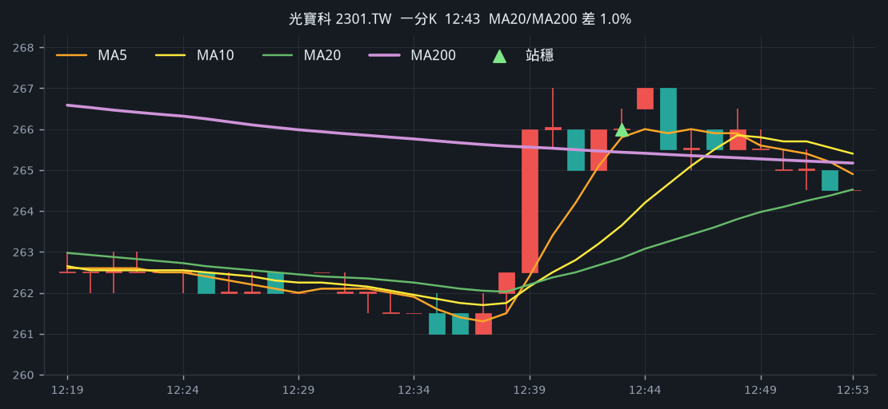

**五分 K（對照）**

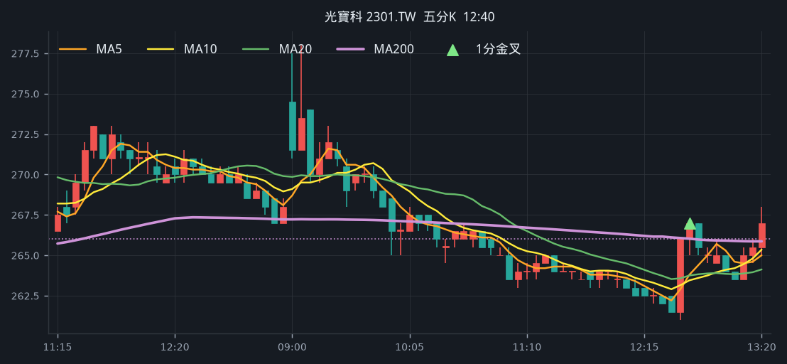

## 7. 技嘉 [2376.TW](https://tw.stock.yahoo.com/quote/2376.TW)

- 價格 397.50 +1.02%　成交額排名 #46　56.57 億
- 1分站穩 09:39　收 392.50 > MA200 390.48
- 1分 MA5 390.90 > MA10 389.95 > MA20 389.50　MA20/MA200 差 0.3%
- 五分收盤 / MA200　392.50 > 367.92（+6.7%）

**一分 K**

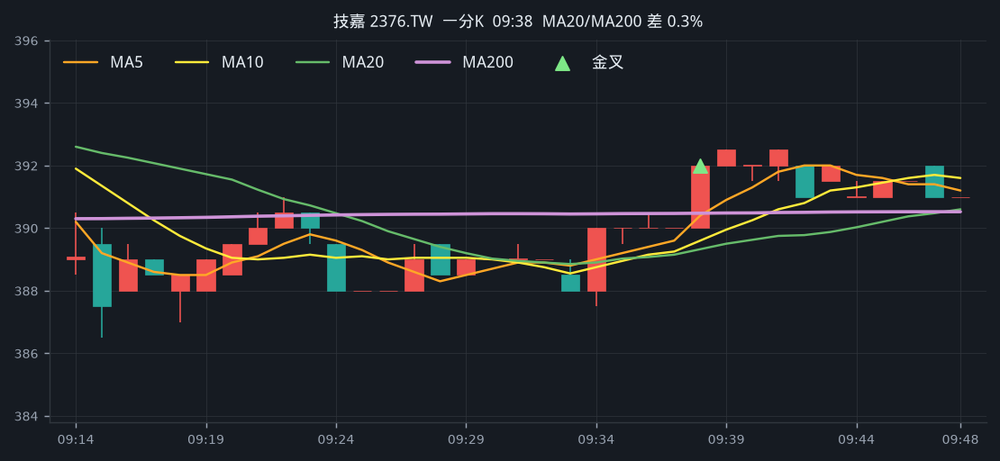

**五分 K（對照）**

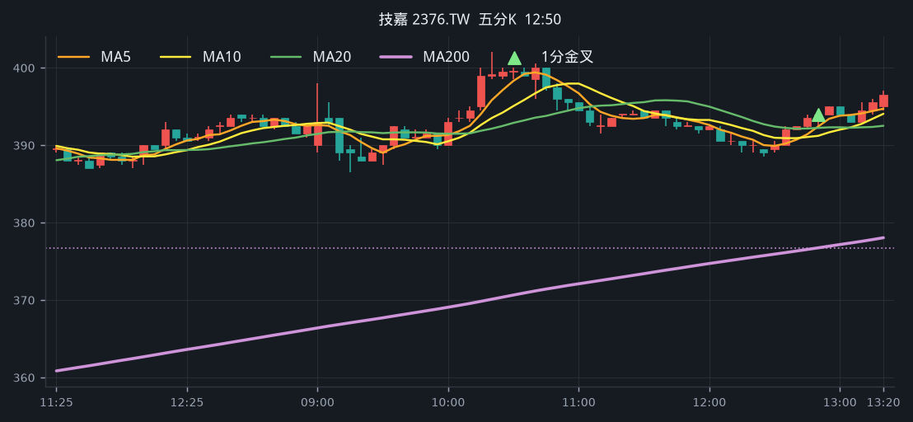

## 8. 漢翔 [2634.TW](https://tw.stock.yahoo.com/quote/2634.TW)

- 價格 70.60 +9.97%　成交額排名 #48　54.32 億
- 1分站穩 09:29　收 64.70 > MA200 63.90
- 1分 MA5 63.98 > MA10 63.80 > MA20 63.70　MA20/MA200 差 0.3%
- 五分收盤 / MA200　64.70 > 62.14（+4.1%）

**一分 K**

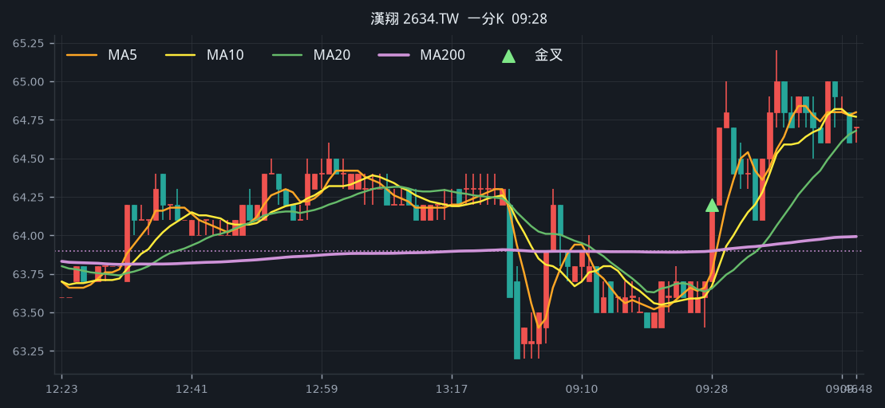

**五分 K（對照）**

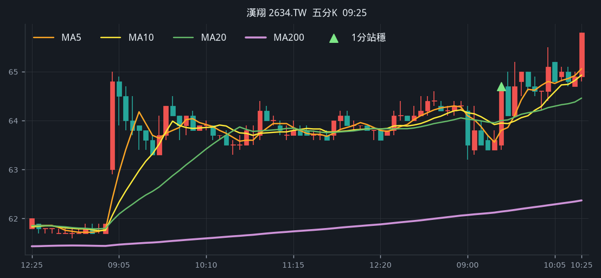

## 9. 台勝科 [3532.TW](https://tw.stock.yahoo.com/quote/3532.TW)

- 價格 356.00 +3.79%　成交額排名 #50　53.15 億
- 1分站穩 12:35　收 345.50 > MA200 345.29
- 1分 MA5 345.30 > MA10 345.00 > MA20 344.55　MA20/MA200 差 0.2%
- 五分收盤 / MA200　349.00 > 316.88（+10.1%）

**一分 K**

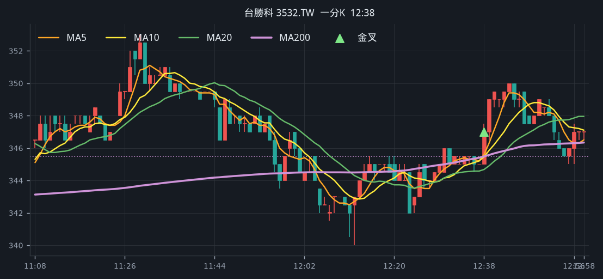

**五分 K（對照）**

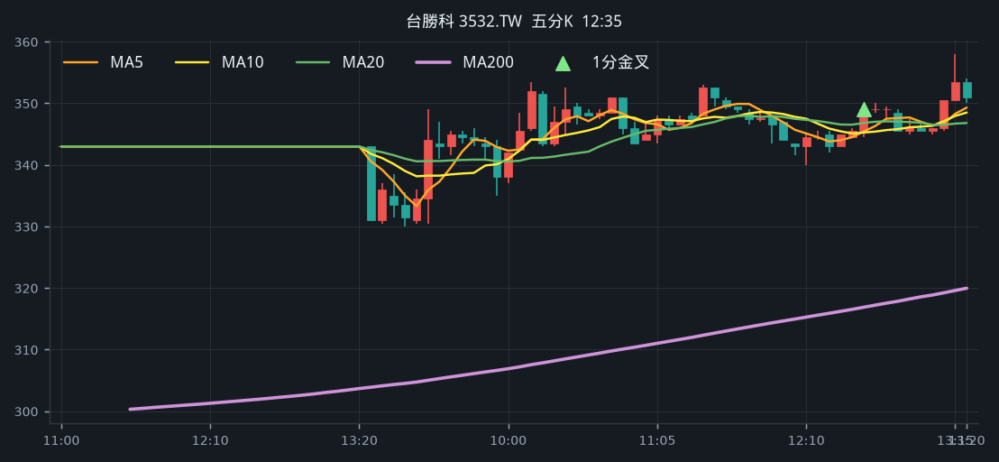

## 10. 中美晶 [5483.TWO](https://tw.stock.yahoo.com/quote/5483.TWO)

- 價格 188.00 +0.27%　成交額排名 #52　47.93 億
- 1分站穩 13:20　收 188.00 > MA200 187.38
- 1分 MA5 187.30 > MA10 186.80 > MA20 185.88　MA20/MA200 差 0.8%
- 五分收盤 / MA200　187.50 > 183.54（+2.2%）

**一分 K**

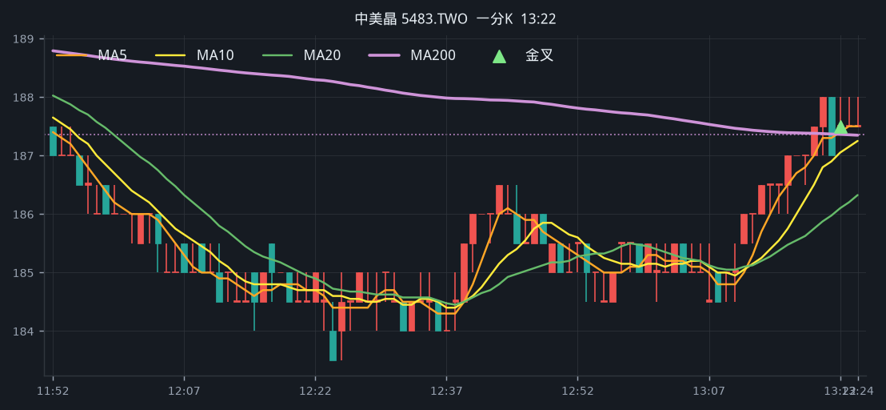

**五分 K（對照）**

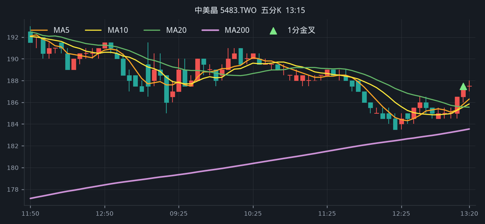

## 11. 中光電 [5371.TWO](https://tw.stock.yahoo.com/quote/5371.TWO)

- 價格 90.10 +4.40%　成交額排名 #77　33.04 億
- 1分站穩 10:31　收 86.40 > MA200 86.30
- 1分 MA5 86.18 > MA10 86.00 > MA20 85.94　MA20/MA200 差 0.4%
- 五分收盤 / MA200　86.60 > 85.65（+1.1%）

**一分 K**

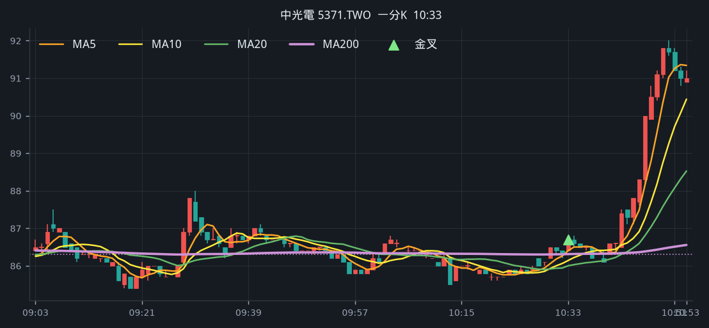

**五分 K（對照）**

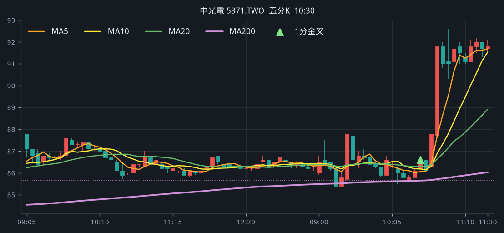

## 12. 長榮 [2603.TW](https://tw.stock.yahoo.com/quote/2603.TW)

- 價格 219.00 +1.62%　成交額排名 #82　29.22 億
- 1分站穩 09:23　收 216.00 > MA200 214.69
- 1分 MA5 214.80 > MA10 214.35 > MA20 213.78　MA20/MA200 差 0.4%
- 五分收盤 / MA200　216.50 > 215.15（+0.6%）

**一分 K**

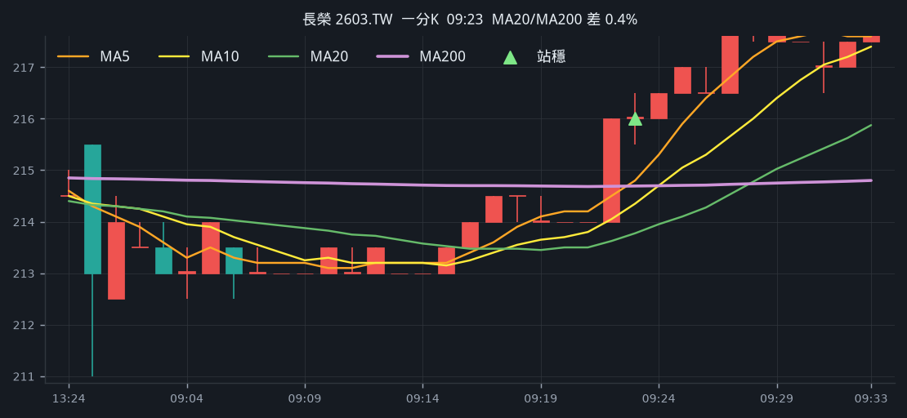

**五分 K（對照）**

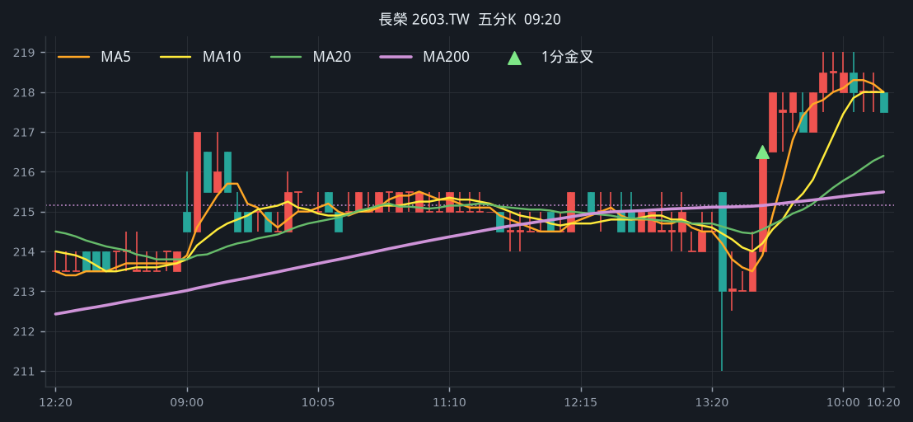

## 13. 玉晶光 [3406.TW](https://tw.stock.yahoo.com/quote/3406.TW)

- 價格 615.00 -2.23%　成交額排名 #84　28.05 億
- 1分站穩 10:39　收 624.00 > MA200 621.01
- 1分 MA5 620.60 > MA10 618.20 > MA20 613.55　MA20/MA200 差 1.2%
- 五分收盤 / MA200　624.00 > 570.25（+9.4%）

**一分 K**

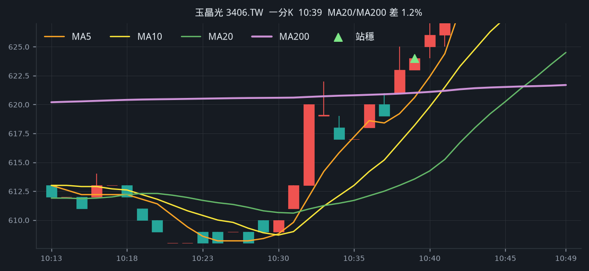

**五分 K（對照）**

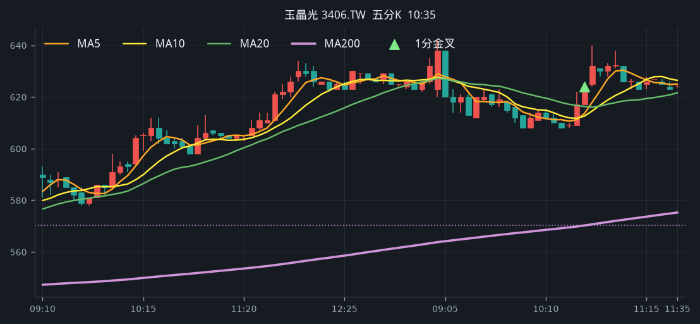

## 14. 健鼎 [3044.TW](https://tw.stock.yahoo.com/quote/3044.TW)

- 價格 488.00 -1.41%　成交額排名 #86　26.87 億
- 1分站穩 09:07　收 496.00 > MA200 491.21
- 1分 MA5 494.40 > MA10 492.80 > MA20 491.48　MA20/MA200 差 0.1%
- 五分收盤 / MA200　494.50 > 459.84（+7.5%）

**一分 K**

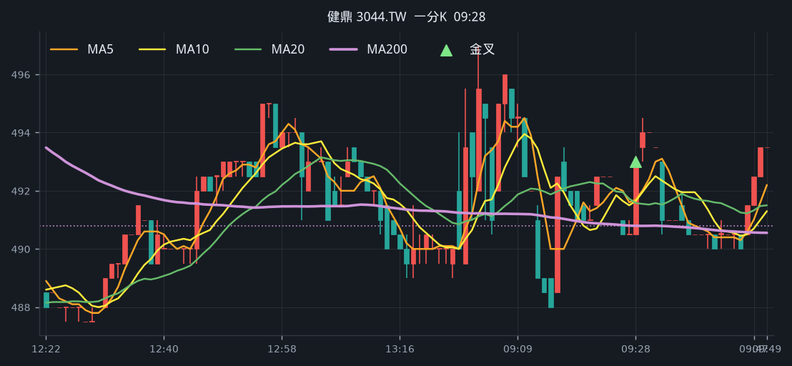

**五分 K（對照）**

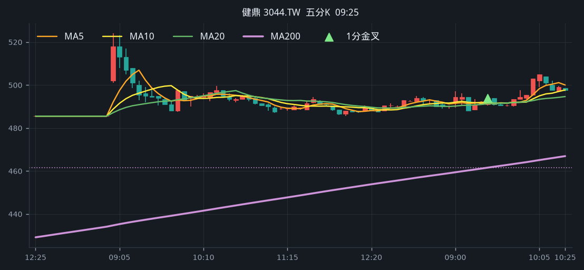

## 15. 長榮航太 [2645.TW](https://tw.stock.yahoo.com/quote/2645.TW)

- 價格 200.00 +9.89%　成交額排名 #92　25.77 億
- 1分站穩 10:25　收 184.00 > MA200 182.63
- 1分 MA5 183.10 > MA10 182.70 > MA20 182.45　MA20/MA200 差 0.1%
- 五分收盤 / MA200　184.50 > 184.41（+0.0%）

**一分 K**

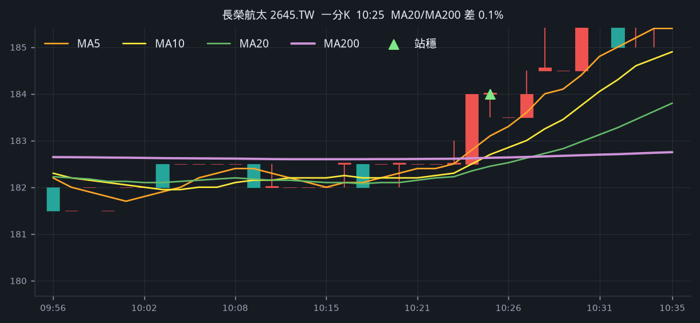

**五分 K（對照）**

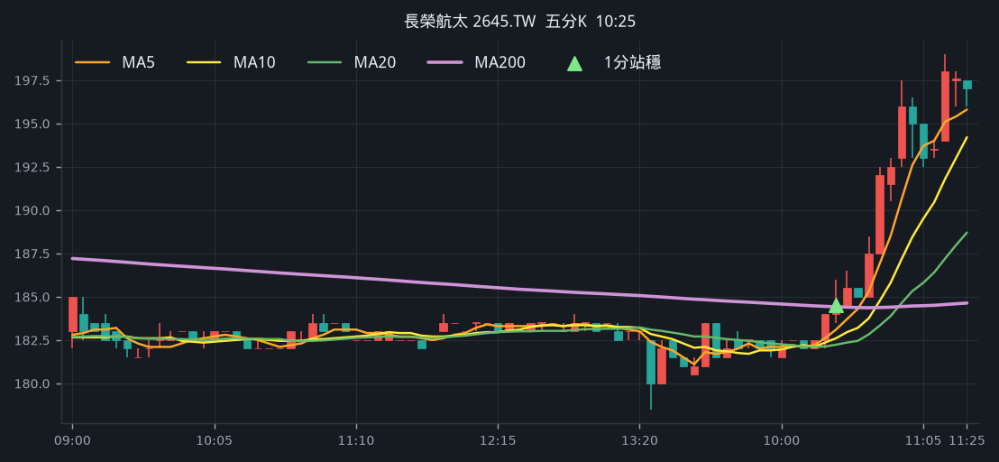

## 16. 萬海 [2615.TW](https://tw.stock.yahoo.com/quote/2615.TW)

- 價格 90.60 +3.54%　成交額排名 #94　25.07 億
- 1分站穩 09:23　收 87.80 > MA200 87.56
- 1分 MA5 87.58 > MA10 87.48 > MA20 87.36　MA20/MA200 差 0.2%
- 五分收盤 / MA200　87.90 > 87.24（+0.8%）

**一分 K**

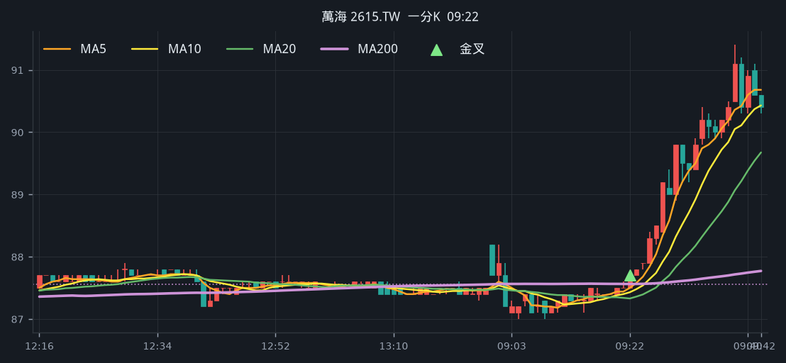

**五分 K（對照）**

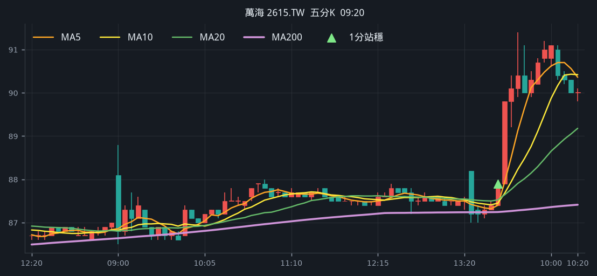

## 17. 宏致 [3605.TW](https://tw.stock.yahoo.com/quote/3605.TW)

- 價格 131.50 -0.38%　成交額排名 #95　24.99 億
- 1分站穩 09:25　收 135.00 > MA200 131.93
- 1分 MA5 132.80 > MA10 132.15 > MA20 131.78　MA20/MA200 差 0.1%
- 五分收盤 / MA200　134.50 > 119.28（+12.8%）

**一分 K**

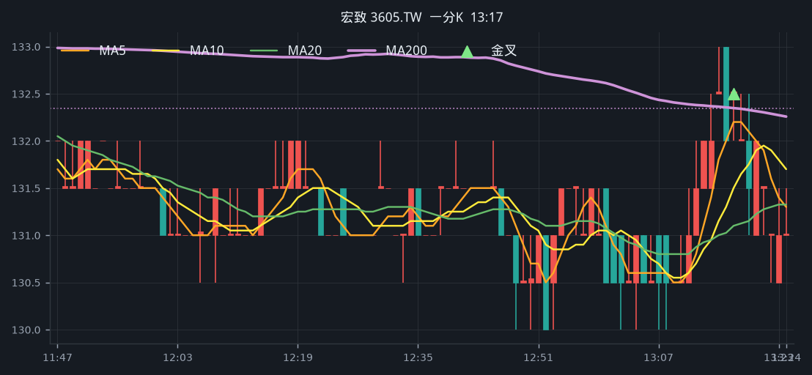

**五分 K（對照）**

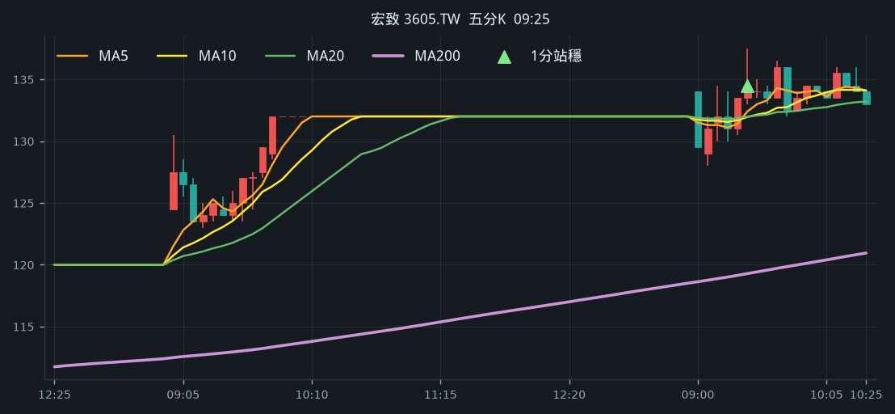

