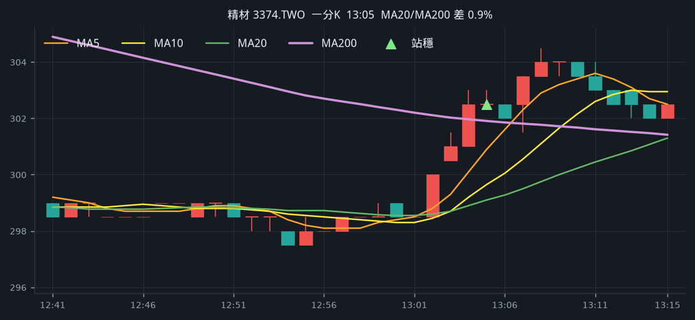
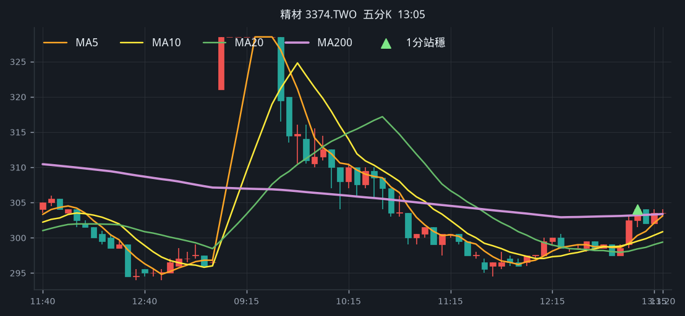
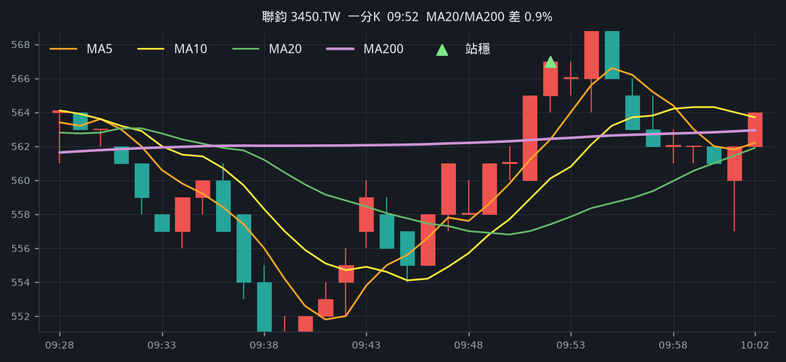
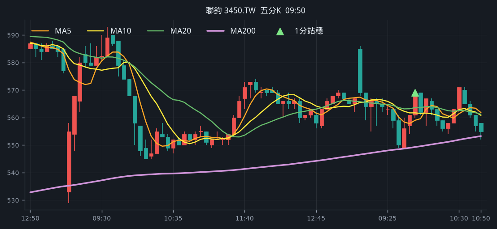
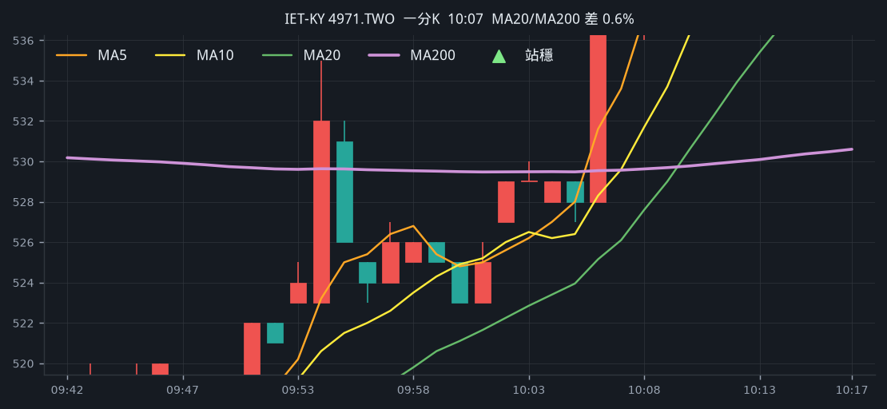
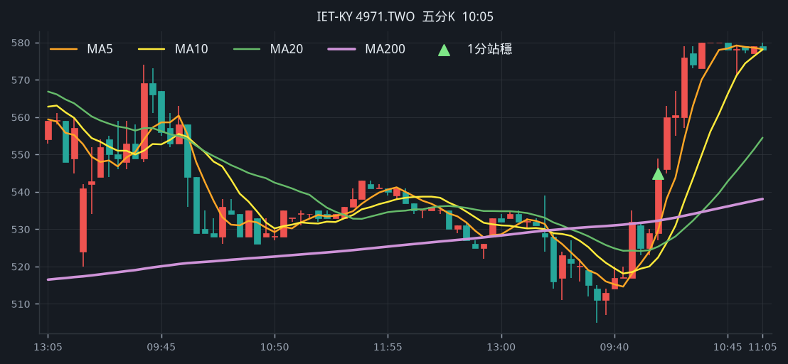
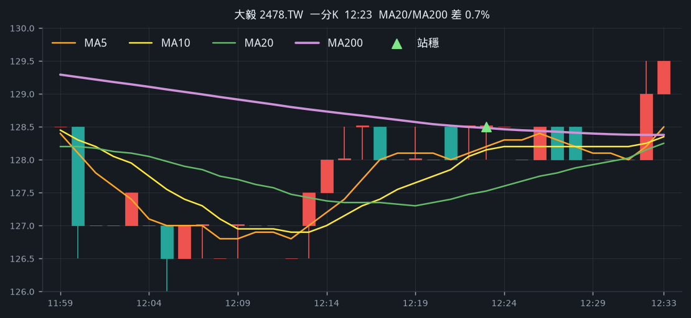
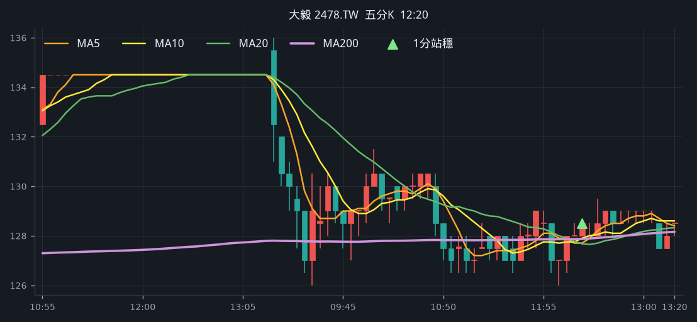
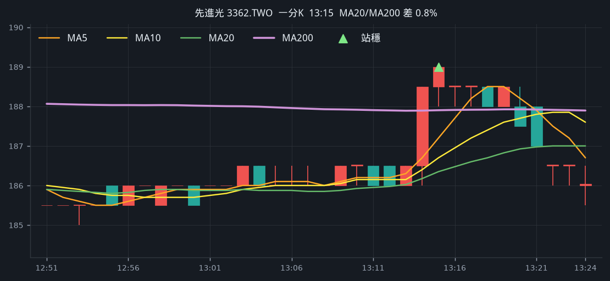
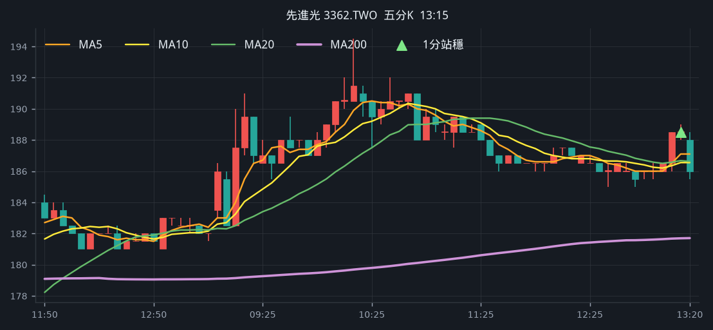

# 回測 2026-08-20（週四）· 一分K站穩 MA200

用 2026-08-20（週四）當天上市＋上櫃成交額前 100（盤後），濾掉 ETF、金融股與收盤價 650 以上。一分K MA5>MA10>MA20 且拉開（MA5−MA20 ≥ 0.4%），MA20 與 MA200 差距 0.4%～1.0%，從 200 下面穿上、連續兩根收盤站穩，時間 09:10 以後（開盤跳空不算）；含該根的五分K收盤也必須高於五分 MA200。

- 命中 **5** 檔
- 掃描時間 2026-08-23 01:24:24（台北）
- 排行 2026-08-20 盤後成交額
- 前 100 → 濾掉股價 38、ETF 5、金融 3 → 掃描 54 → 均線糾結 0 → MA20/MA200不符 0 → 五分MA200底下 8

## 1. 精材 [3374.TWO](https://tw.stock.yahoo.com/quote/3374.TWO)

- 價格 303.50 +1.51%　成交額排名 #27　87.15 億
- 1分站穩 13:05　收 302.50 > MA200 301.91
- 1分 MA5 300.90 > MA10 299.65 > MA20 299.10　MA20/MA200 差 0.9%
- 五分收盤 / MA200　304.00 > 303.19（+0.3%）

**一分 K**

**五分 K（對照）**

## 2. 聯鈞 [3450.TW](https://tw.stock.yahoo.com/quote/3450.TW)

- 價格 553.00 -2.47%　成交額排名 #37　72.24 億
- 1分站穩 09:52　收 567.00 > MA200 562.43
- 1分 MA5 562.40 > MA10 560.10 > MA20 557.40　MA20/MA200 差 0.9%
- 五分收盤 / MA200　569.00 > 549.29（+3.6%）

**一分 K**

**五分 K（對照）**

## 3. IET-KY [4971.TWO](https://tw.stock.yahoo.com/quote/4971.TWO)

- 價格 580.00 +9.85%　成交額排名 #79　27.50 億
- 1分站穩 10:07　收 539.00 > MA200 529.57
- 1分 MA5 533.60 > MA10 529.60 > MA20 526.10　MA20/MA200 差 0.6%
- 五分收盤 / MA200　545.00 > 532.26（+2.4%）

**一分 K**

**五分 K（對照）**

## 4. 大毅 [2478.TW](https://tw.stock.yahoo.com/quote/2478.TW)

- 價格 128.50 -4.46%　成交額排名 #94　23.73 億
- 1分站穩 12:23　收 128.50 > MA200 128.48
- 1分 MA5 128.20 > MA10 128.15 > MA20 127.53　MA20/MA200 差 0.7%
- 五分收盤 / MA200　128.50 > 127.87（+0.5%）

**一分 K**

**五分 K（對照）**

## 5. 先進光 [3362.TWO](https://tw.stock.yahoo.com/quote/3362.TWO)

- 價格 186.00 +2.48%　成交額排名 #95　23.08 億
- 1分站穩 13:15　收 189.00 > MA200 187.90
- 1分 MA5 187.20 > MA10 186.70 > MA20 186.35　MA20/MA200 差 0.8%
- 五分收盤 / MA200　188.50 > 181.69（+3.7%）

**一分 K**

**五分 K（對照）**

