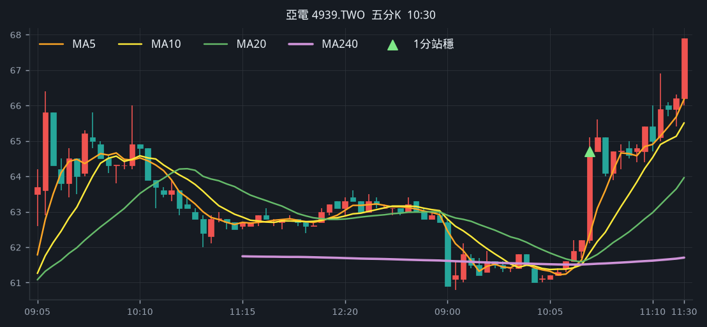
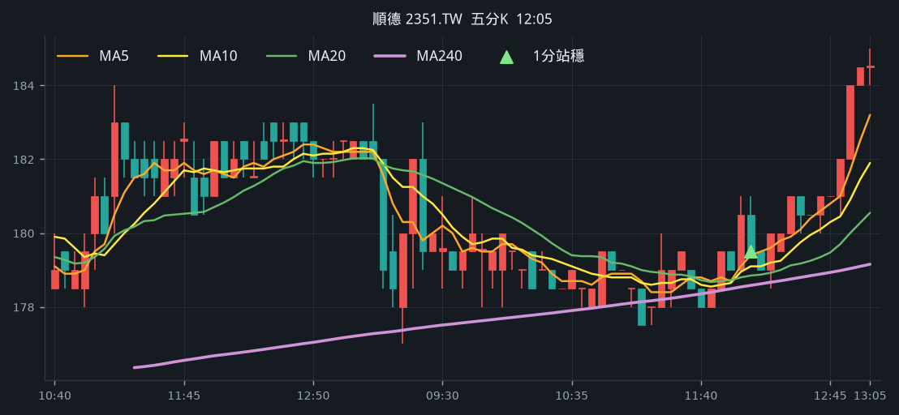
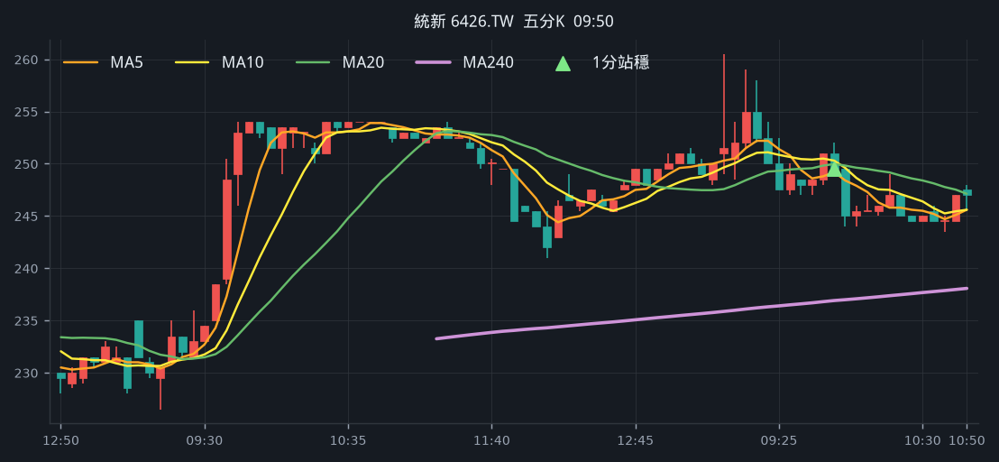
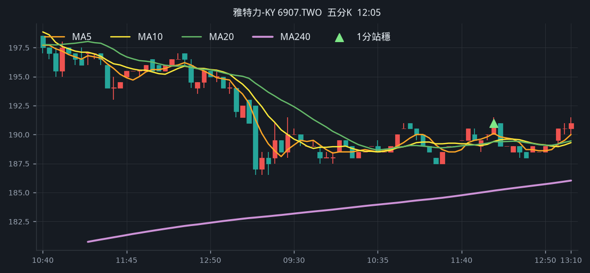
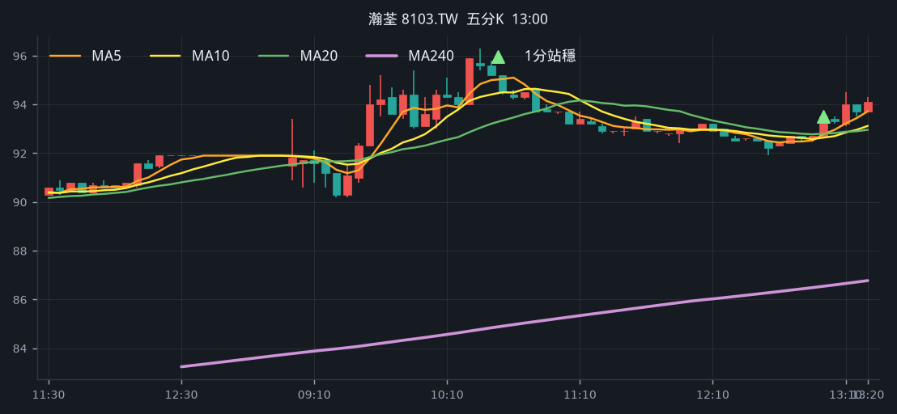
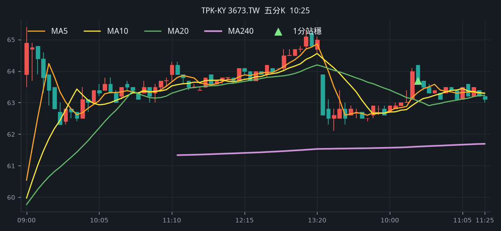

# 回測 2026-08-21（週五）· 一分K站穩 MA240

用 2026-08-21（週五）當天上市＋上櫃成交額前 223（盤後），濾掉 ETF、金融股與收盤價 650 以上。一分K MA5>MA10>MA20 且拉開（MA5−MA20 ≥ 0.4%），MA20 與 MA240 差距 0.4%～1.0%，從 240 下面穿上、連續兩根收盤站穩，時間 09:10 以後（開盤跳空不算）；含該根的五分K收盤也必須高於五分 MA240。

- 命中 **9** 檔
- 掃描時間 2026-08-25 00:44:46（台北）
- 排行 2026-08-21 盤後成交額；另含週四前200多出的 23 檔
- 前 223 → 濾掉股價 57、ETF 18、金融 13 → 掃描 135 → 均線糾結 0 → MA20/MA240不符 0 → 五分MA240底下 4

## 1. 台虹 [8039.TW](https://tw.stock.yahoo.com/quote/8039.TW)

- 價格 282.00 -0.35%　成交額排名 #7　195.25 億
- 1分站穩 10:17　收 276.50 > MA240 276.35
- 1分 MA5 275.80 > MA10 274.60 > MA20 273.65　MA20/MA240 差 1.0%
- 五分收盤 / MA240　279.50 > 275.06（+1.6%）

**一分 K**

**五分 K（對照）**

## 2. 聯一光 [3441.TWO](https://tw.stock.yahoo.com/quote/3441.TWO)

- 價格 107.00 +9.97%　成交額排名 #53　48.64 億
- 1分站穩 12:35　收 99.60 > MA240 98.32
- 1分 MA5 98.40 > MA10 98.01 > MA20 97.52　MA20/MA240 差 0.8%
- 五分收盤 / MA240　98.80 > 91.51（+8.0%）

**一分 K**

**五分 K（對照）**

## 3. 先進光 [3362.TWO](https://tw.stock.yahoo.com/quote/3362.TWO)

- 價格 194.50 +4.57%　成交額排名 #110　17.02 億
- 1分站穩 10:52　收 185.50 > MA240 185.05
- 1分 MA5 185.20 > MA10 184.60 > MA20 183.80　MA20/MA240 差 0.7%
- 五分收盤 / MA240　185.00 > 181.58（+1.9%）

**一分 K**

**五分 K（對照）**

## 4. 亞電 [4939.TWO](https://tw.stock.yahoo.com/quote/4939.TWO)

- 價格 66.50 +6.06%　成交額排名 #112　16.47 億
- 1分站穩 10:31　收 63.10 > MA240 62.39
- 1分 MA5 62.36 > MA10 62.16 > MA20 61.83　MA20/MA240 差 0.9%
- 五分收盤 / MA240　64.70 > 61.52（+5.2%）

**一分 K**

**五分 K（對照）**

## 5. 順德 [2351.TW](https://tw.stock.yahoo.com/quote/2351.TW)

- 價格 183.50 -0.81%　成交額排名 #141　11.99 億
- 1分站穩 12:05　收 180.50 > MA240 180.21
- 1分 MA5 179.70 > MA10 179.45 > MA20 178.95　MA20/MA240 差 0.7%
- 五分收盤 / MA240　179.50 > 178.58（+0.5%）

**一分 K**

**五分 K（對照）**

## 6. 統新 [6426.TW](https://tw.stock.yahoo.com/quote/6426.TW)

- 價格 241.00 -3.60%　成交額排名 #151　10.63 億
- 1分站穩 09:50　收 251.50 > MA240 250.45
- 1分 MA5 249.90 > MA10 248.95 > MA20 248.45　MA20/MA240 差 0.8%
- 五分收盤 / MA240　249.50 > 236.91（+5.3%）

**一分 K**

**五分 K（對照）**

## 7. 雅特力-KY [6907.TWO](https://tw.stock.yahoo.com/quote/6907.TWO)

- 價格 194.00 +0.78%　成交額排名 #176　8.42 億
- 1分站穩 12:08　收 191.50 > MA240 191.32
- 1分 MA5 190.80 > MA10 190.25 > MA20 189.97　MA20/MA240 差 0.7%
- 五分收盤 / MA240　191.00 > 185.15（+3.2%）

**一分 K**

**五分 K（對照）**

## 8. 瀚荃 [8103.TW](https://tw.stock.yahoo.com/quote/8103.TW)

- 價格 94.00 +2.29%　成交額排名 #189　6.46 億
- 1分站穩 13:04　收 93.50 > MA240 93.14
- 1分 MA5 93.16 > MA10 92.92 > MA20 92.75　MA20/MA240 差 0.4%
- 五分收盤 / MA240　93.50 > 86.54（+8.0%）

**一分 K**

**五分 K（對照）**

## 9. TPK-KY [3673.TW](https://tw.stock.yahoo.com/quote/3673.TW)

- 價格 65.10 +9.41%　成交額排名 #190　7.49 億
- 1分站穩 10:25　收 63.90 > MA240 63.56
- 1分 MA5 63.60 > MA10 63.38 > MA20 63.17　MA20/MA240 差 0.6%
- 五分收盤 / MA240　63.70 > 61.61（+3.4%）

**一分 K**

**五分 K（對照）**

