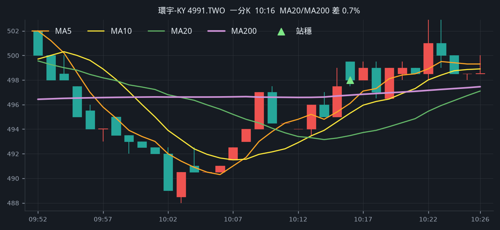
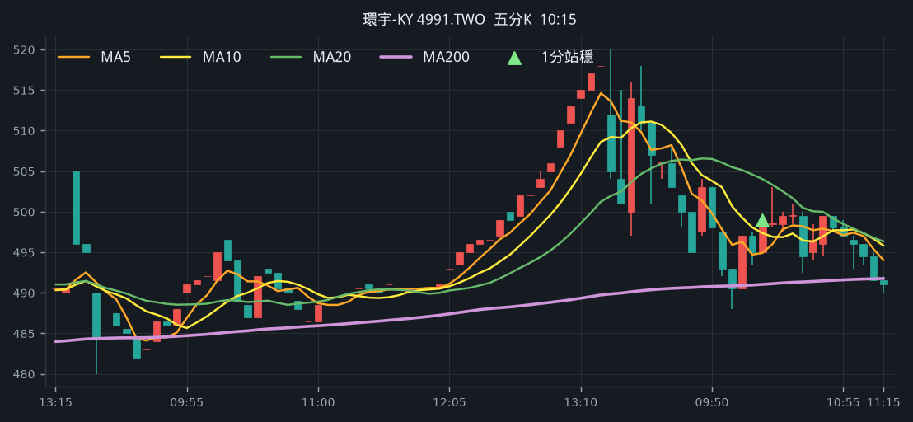

# 回測 2026-08-21（週五）· 一分K站穩 MA200

用 2026-08-21（週五）當天上市＋上櫃成交額前 100（盤後），濾掉 ETF、金融股與收盤價 650 以上。一分K MA5>MA10>MA20 且拉開（MA5−MA20 ≥ 0.4%），MA20 與 MA200 差距 0.4%～1.0%，從 200 下面穿上、連續兩根收盤站穩，時間 09:10 以後（開盤跳空不算）；含該根的五分K收盤也必須高於五分 MA200。

- 命中 **3** 檔
- 掃描時間 2026-08-21 21:27:29（台北）
- 排行 2026-08-21 盤後成交額
- 前 100 → 濾掉股價 36、ETF 5、金融 5 → 掃描 54 → 均線糾結 0 → MA20/MA200不符 0 → 五分MA200底下 4

## 1. 台虹 [8039.TW](https://tw.stock.yahoo.com/quote/8039.TW)

- 價格 282.00 -0.35%　成交額排名 #7　195.25 億
- 1分站穩 10:17　收 276.50 > MA200 276.21
- 1分 MA5 275.80 > MA10 274.60 > MA20 273.65　MA20/MA200 差 0.9%
- 五分收盤 / MA200　279.50 > 276.47（+1.1%）

**一分 K**

**五分 K（對照）**

## 2. 聯一光 [3441.TWO](https://tw.stock.yahoo.com/quote/3441.TWO)

- 價格 107.00 +9.97%　成交額排名 #53　48.64 億
- 1分站穩 12:35　收 99.60 > MA200 98.42
- 1分 MA5 98.40 > MA10 98.01 > MA20 97.52　MA20/MA200 差 0.9%
- 五分收盤 / MA200　98.80 > 92.04（+7.3%）

**一分 K**

**五分 K（對照）**

## 3. 環宇-KY [4991.TWO](https://tw.stock.yahoo.com/quote/4991.TWO)

- 價格 481.00 -7.50%　成交額排名 #61　42.78 億
- 1分站穩 10:16　收 498.00 > MA200 496.76
- 1分 MA5 496.10 > MA10 495.30 > MA20 493.48　MA20/MA200 差 0.7%
- 五分收盤 / MA200　499.00 > 491.03（+1.6%）

**一分 K**

**五分 K（對照）**

