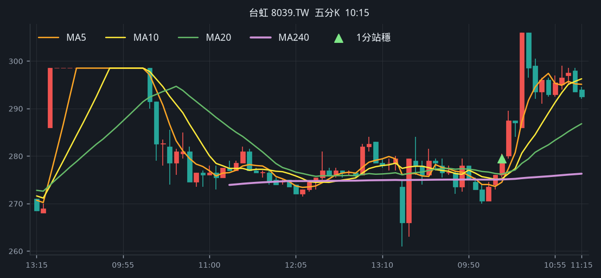
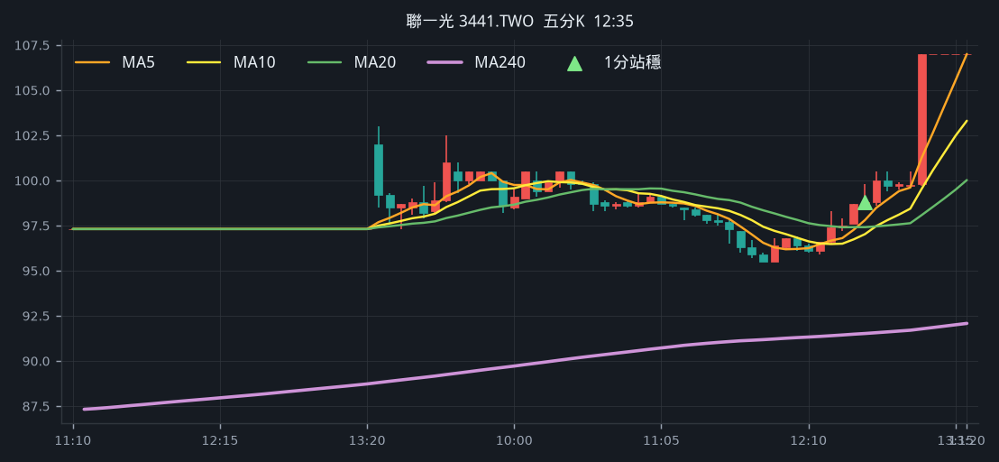
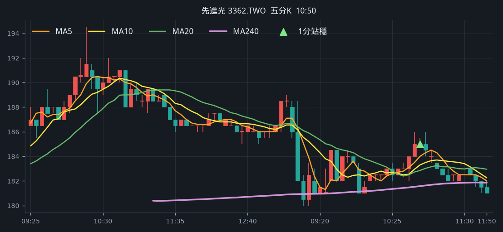

# 回測 2026-08-21（週五）· 一分K站穩 MA240

用 2026-08-21（週五）當天上市＋上櫃成交額前 100（盤後），濾掉 ETF、金融股與收盤價 650 以上。一分K MA5>MA10>MA20 且拉開（MA5−MA20 ≥ 0.4%），MA20 與 MA240 差距 0.4%～1.0%，從 240 下面穿上、連續兩根收盤站穩，時間 09:10 以後（開盤跳空不算）；含該根的五分K收盤也必須高於五分 MA240。

- 命中 **3** 檔
- 掃描時間 2026-08-25 00:28:59（台北）
- 排行 2026-08-21 盤後成交額；盤中名單另含週四前100多出的 18 檔
- 前 100 → 濾掉股價 40、ETF 6、金融 5 → 掃描 67 → 均線糾結 0 → MA20/MA240不符 0 → 五分MA240底下 4

## 1. 台虹 [8039.TW](https://tw.stock.yahoo.com/quote/8039.TW)

- 價格 282.00 -0.35%　成交額排名 #7　195.25 億
- 1分站穩 10:17　收 276.50 > MA240 276.35
- 1分 MA5 275.80 > MA10 274.60 > MA20 273.65　MA20/MA240 差 1.0%
- 五分收盤 / MA240　279.50 > 275.06（+1.6%）

**一分 K**

**五分 K（對照）**

## 2. 聯一光 [3441.TWO](https://tw.stock.yahoo.com/quote/3441.TWO)

- 價格 107.00 +9.97%　成交額排名 #53　48.64 億
- 1分站穩 12:35　收 99.60 > MA240 98.32
- 1分 MA5 98.40 > MA10 98.01 > MA20 97.52　MA20/MA240 差 0.8%
- 五分收盤 / MA240　98.80 > 91.51（+8.0%）

**一分 K**

**五分 K（對照）**

## 3. 先進光 [3362.TWO](https://tw.stock.yahoo.com/quote/3362.TWO)

- 價格 186.00 +2.48%　成交額排名 #95　23.08 億
- 1分站穩 10:52　收 185.50 > MA240 185.05
- 1分 MA5 185.20 > MA10 184.60 > MA20 183.80　MA20/MA240 差 0.7%
- 五分收盤 / MA240　185.00 > 181.58（+1.9%）

**一分 K**

**五分 K（對照）**

