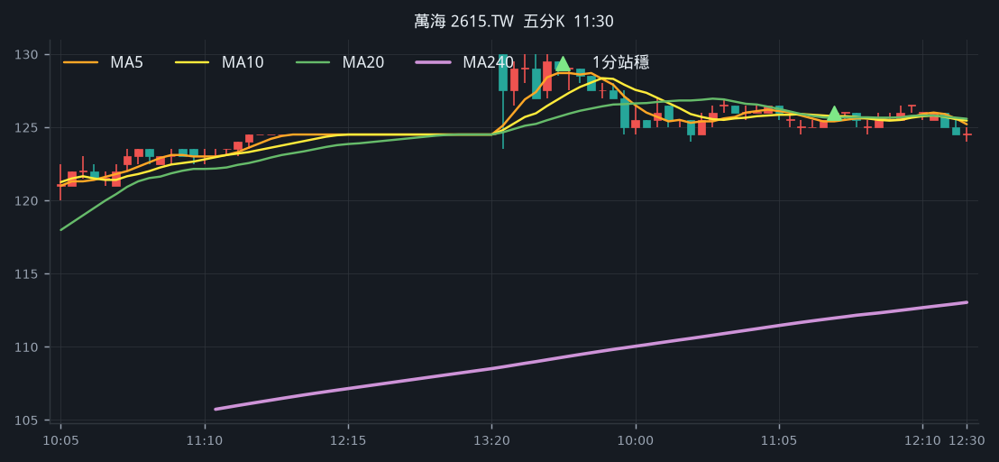
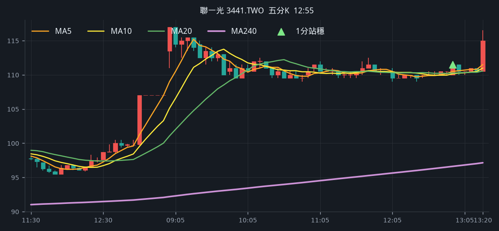
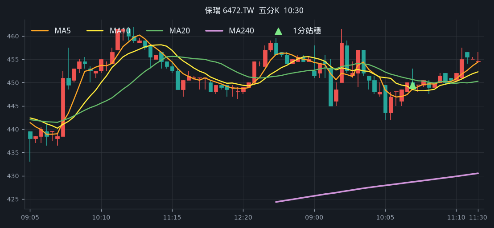
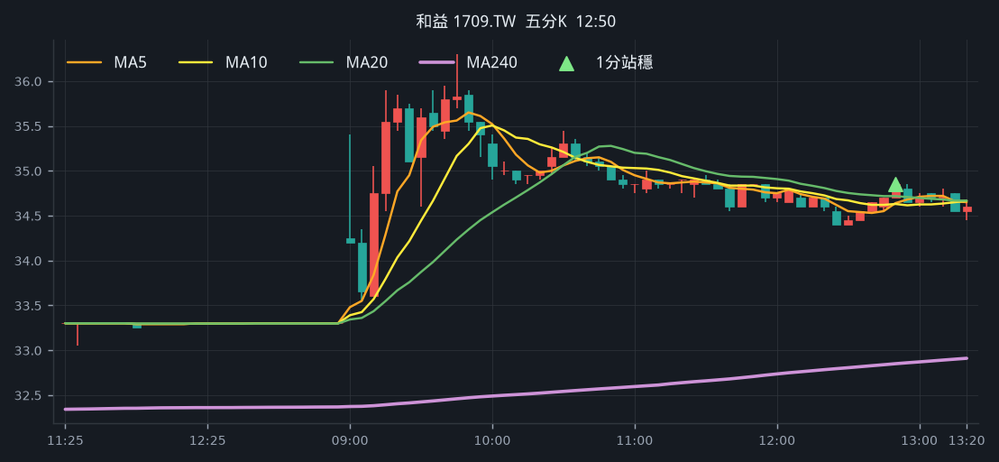
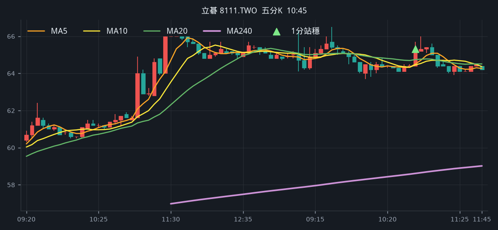

# 回測 2026-08-24（週一）· 一分K站穩 MA240

用 2026-08-24（週一）當天上市＋上櫃成交額前 200（盤後），濾掉 ETF、金融股與收盤價 650 以上。一分K MA5>MA10>MA20 且拉開（MA5−MA20 ≥ 0.4%），MA20 與 MA240 差距 0.4%～1.0%，從 240 下面穿上、連續兩根收盤站穩，時間 09:10 以後（開盤跳空不算）；含該根的五分K收盤也必須高於五分 MA240。

- 命中 **5** 檔
- 掃描時間 2026-08-25 00:45:01（台北）
- 排行 2026-08-24 盤後成交額
- 前 200 → 濾掉股價 52、ETF 17、金融 12 → 掃描 119 → 均線糾結 0 → MA20/MA240不符 0 → 五分MA240底下 0

## 1. 萬海 [2615.TW](https://tw.stock.yahoo.com/quote/2615.TW)

- 價格 124.50 +0.00%　成交額排名 #17　113.12 億
- 1分站穩 11:31　收 126.00 > MA240 125.77
- 1分 MA5 125.70 > MA10 125.35 > MA20 125.17　MA20/MA240 差 0.5%
- 五分收盤 / MA240　126.00 > 111.96（+12.5%）

**一分 K**

**五分 K（對照）**

## 2. 聯一光 [3441.TWO](https://tw.stock.yahoo.com/quote/3441.TWO)

- 價格 112.50 +5.14%　成交額排名 #64　31.43 億
- 1分站穩 12:59　收 111.50 > MA240 111.08
- 1分 MA5 111.00 > MA10 110.70 > MA20 110.40　MA20/MA240 差 0.6%
- 五分收盤 / MA240　111.50 > 96.62（+15.4%）

**一分 K**

**五分 K（對照）**

## 3. 保瑞 [6472.TW](https://tw.stock.yahoo.com/quote/6472.TW)

- 價格 453.00 -0.44%　成交額排名 #157　9.40 億
- 1分站穩 10:31　收 452.00 > MA240 451.97
- 1分 MA5 450.90 > MA10 449.60 > MA20 448.35　MA20/MA240 差 0.8%
- 五分收盤 / MA240　449.50 > 428.66（+4.9%）

**一分 K**

**五分 K（對照）**

## 4. 和益 [1709.TW](https://tw.stock.yahoo.com/quote/1709.TW)

- 價格 34.65 +4.05%　成交額排名 #180　7.22 億
- 1分站穩 12:52　收 34.85 > MA240 34.82
- 1分 MA5 34.76 > MA10 34.68 > MA20 34.60　MA20/MA240 差 0.6%
- 五分收盤 / MA240　34.85 > 32.85（+6.1%）

**一分 K**

**五分 K（對照）**

## 5. 立碁 [8111.TWO](https://tw.stock.yahoo.com/quote/8111.TWO)

- 價格 63.10 -2.92%　成交額排名 #189　6.52 億
- 1分站穩 10:48　收 65.30 > MA240 64.96
- 1分 MA5 64.90 > MA10 64.67 > MA20 64.46　MA20/MA240 差 0.8%
- 五分收盤 / MA240　65.30 > 58.61（+11.4%）

**一分 K**

**五分 K（對照）**

