# 回測 2026-08-25（週二）· 一分K上 MA240

用 2026-08-25（週二）當天上市＋上櫃成交額前 200（盤後），濾掉 ETF、金融股與收盤價 650 以上。一分K MA5>MA10>MA20，收盤剛從 MA240 下面穿上就通知。隔夜跳空不算。五分K只當對照。

- 命中 **71** 檔
- 掃描時間 2026-08-25 12:28:49（台北）
- 排行 2026-08-24 證交所/櫃買成交額（2026-08-25 尚未公布）
- 前 200 → 濾掉股價 52、ETF 17、金融 12 → 掃描 119

## 1. 南亞科 [2408.TW](https://tw.stock.yahoo.com/quote/2408.TW)

- 價格 501.00 -5.11%　成交額排名 #1　372.19 億
- 1分站上 12:03　收 492.50 > MA240 491.38
- 1分 MA5 490.00 > MA10 488.75 > MA20 487.90
- 五分收盤 / MA240（對照）　492.00 > 506.89（-2.9%）

**一分 K**

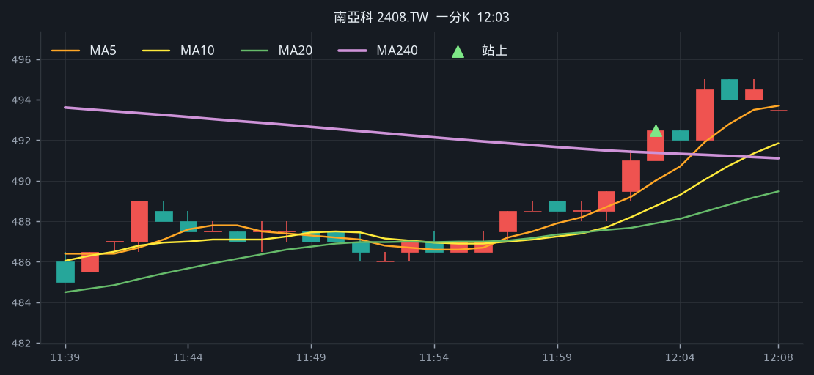

**五分 K（對照）**

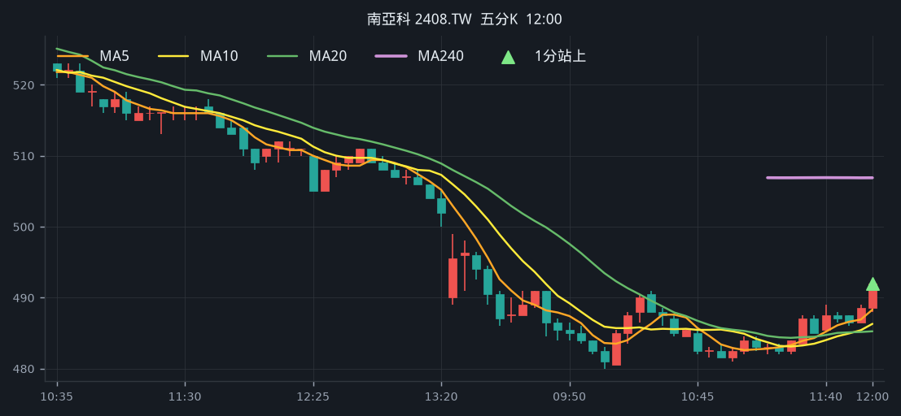

## 2. 聯電 [2303.TW](https://tw.stock.yahoo.com/quote/2303.TW)

- 價格 123.50 +6.01%　成交額排名 #3　244.86 億
- 1分站上 11:46　收 122.00 > MA240 121.99
- 1分 MA5 122.00 > MA10 121.85 > MA20 121.78
- 五分收盤 / MA240（對照）　122.00 > 118.07（+3.3%）

**一分 K**

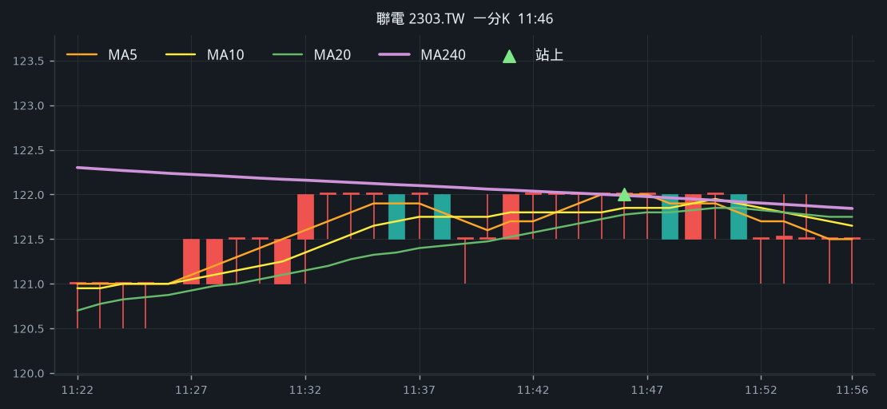

**五分 K（對照）**

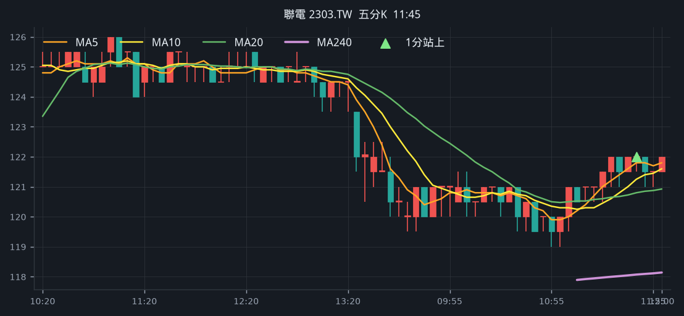

## 3. 華邦電 [2344.TW](https://tw.stock.yahoo.com/quote/2344.TW)

- 價格 177.00 -2.21%　成交額排名 #4　178.90 億
- 1分站上 12:02　收 172.50 > MA240 172.17
- 1分 MA5 171.90 > MA10 171.60 > MA20 171.50
- 五分收盤 / MA240（對照）　172.50 > 174.79（-1.3%）

**一分 K**

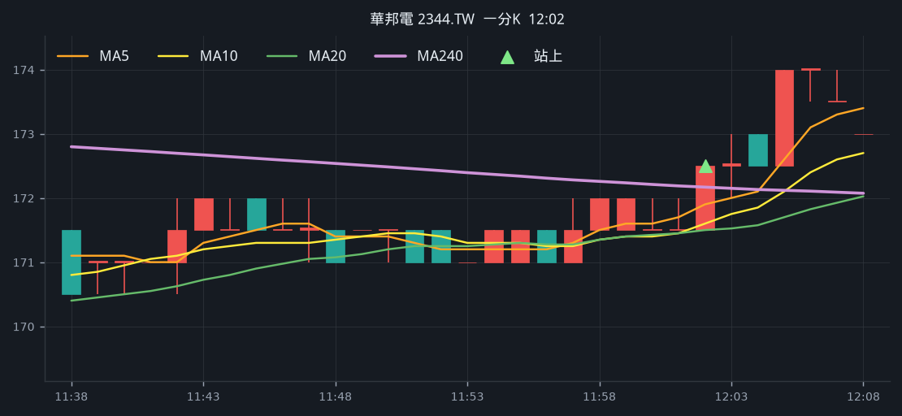

**五分 K（對照）**

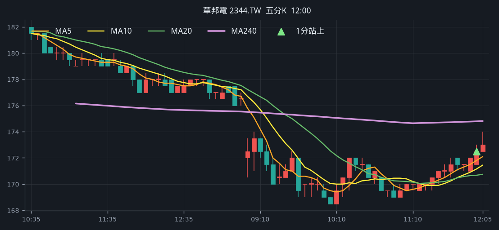

## 4. 台虹 [8039.TW](https://tw.stock.yahoo.com/quote/8039.TW)

- 價格 265.00 -6.03%　成交額排名 #5　141.17 億
- 1分站上 09:17　收 275.50 > MA240 275.02
- 1分 MA5 273.20 > MA10 269.40 > MA20 266.68
- 五分收盤 / MA240（對照）　273.00 > 279.74（-2.4%）

**一分 K**

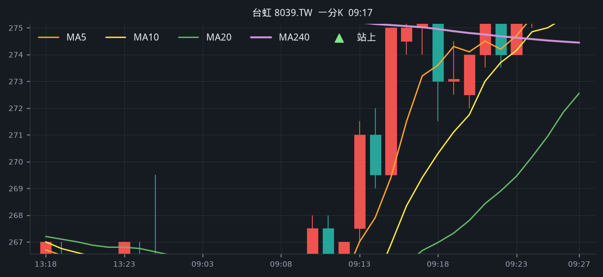

**五分 K（對照）**

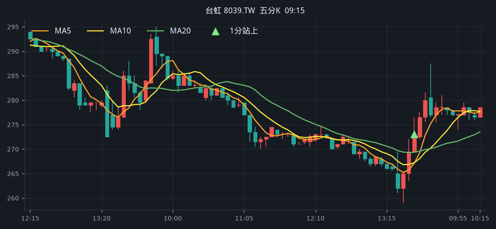

## 5. 南亞 [1303.TW](https://tw.stock.yahoo.com/quote/1303.TW)

- 價格 180.00 -6.25%　成交額排名 #7　136.08 億
- 1分站上 09:52　收 181.00 > MA240 180.86
- 1分 MA5 180.30 > MA10 179.00 > MA20 178.47
- 五分收盤 / MA240（對照）　181.50 > 187.99（-3.5%）

**一分 K**

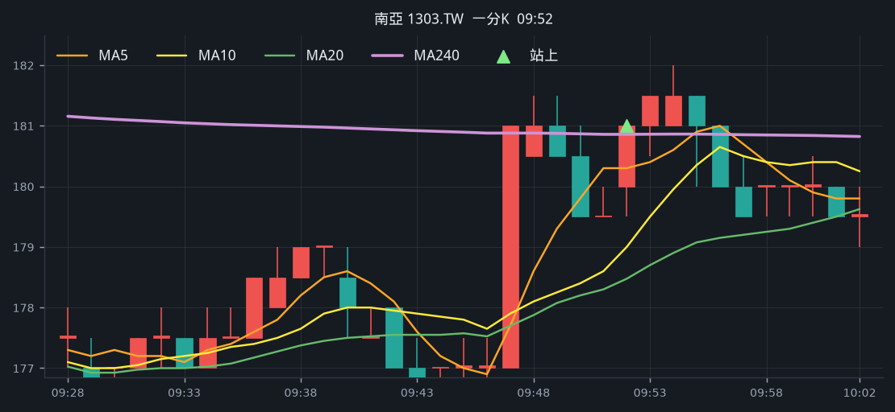

**五分 K（對照）**

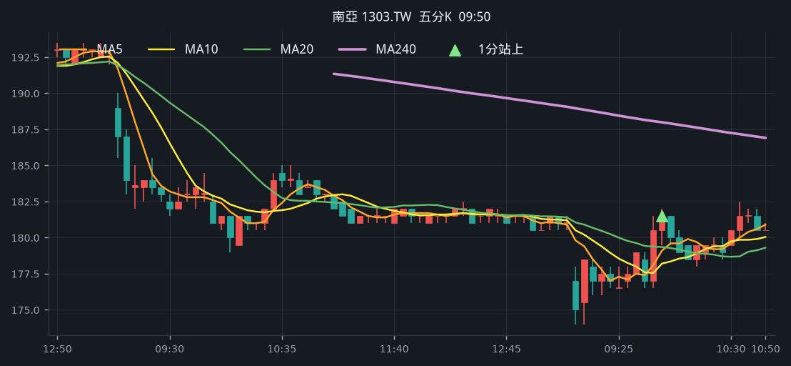

## 6. 光寶科 [2301.TW](https://tw.stock.yahoo.com/quote/2301.TW)

- 價格 287.00 +9.96%　成交額排名 #11　125.90 億
- 1分站上 09:44　收 286.50 > MA240 286.28
- 1分 MA5 284.80 > MA10 284.65 > MA20 284.25
- 五分收盤 / MA240（對照）　286.50 > 273.47（+4.8%）

**一分 K**

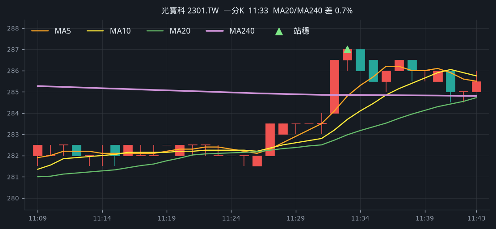

**五分 K（對照）**

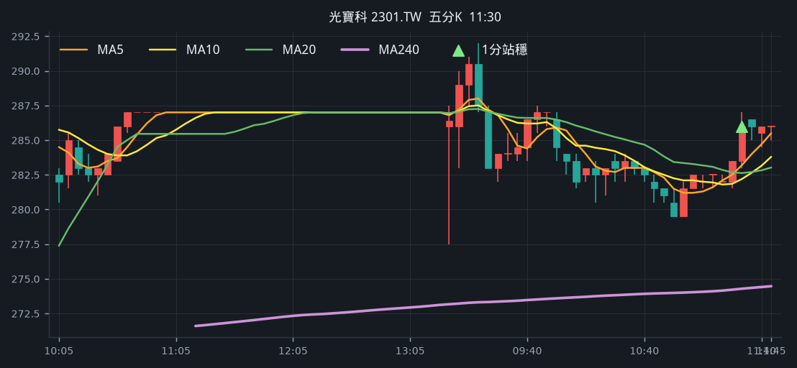

## 7. 萬海 [2615.TW](https://tw.stock.yahoo.com/quote/2615.TW)

- 價格 124.50 +0.00%　成交額排名 #17　113.12 億
- 1分站上 09:05　收 126.00 > MA240 125.59
- 1分 MA5 126.20 > MA10 125.35 > MA20 124.90
- 五分收盤 / MA240（對照）　125.50 > 114.15（+9.9%）

**一分 K**

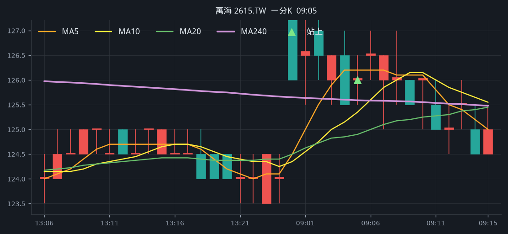

**五分 K（對照）**

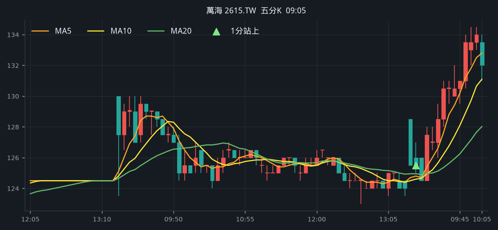

## 8. 聯茂 [6213.TW](https://tw.stock.yahoo.com/quote/6213.TW)

- 價格 482.50 -5.95%　成交額排名 #25　85.97 億
- 1分站上 09:01　收 492.00 > MA240 489.80
- 1分 MA5 484.10 > MA10 481.75 > MA20 481.35
- 五分收盤 / MA240（對照）　492.00 > 499.88（-1.6%）

**一分 K**

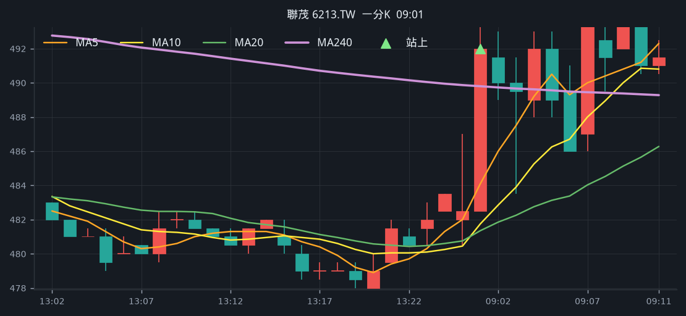

**五分 K（對照）**

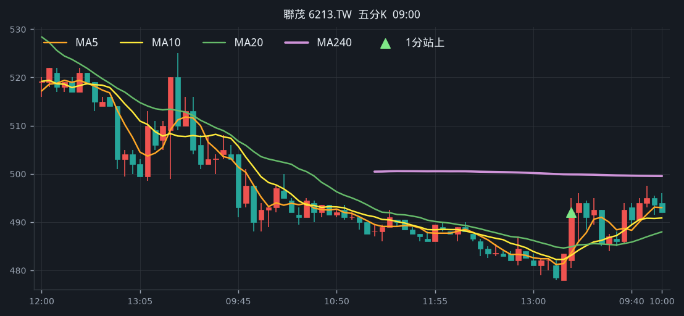

## 9. 華星光 [4979.TWO](https://tw.stock.yahoo.com/quote/4979.TWO)

- 價格 547.00 -5.20%　成交額排名 #30　76.52 億
- 1分站上 10:22　收 556.00 > MA240 555.54
- 1分 MA5 548.40 > MA10 545.70 > MA20 543.80
- 五分收盤 / MA240（對照）　559.00 > 551.39（+1.4%）

**一分 K**

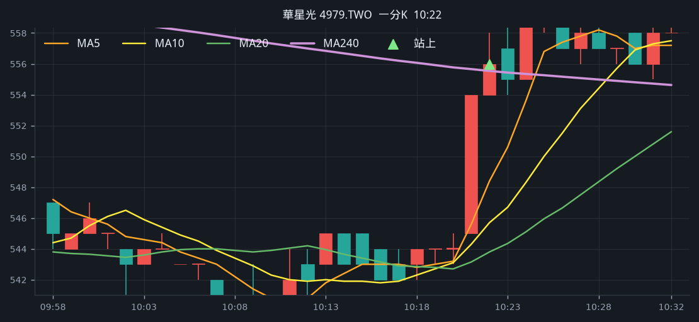

**五分 K（對照）**

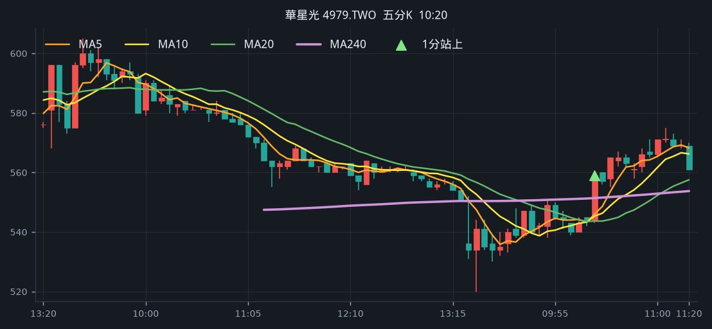

## 10. 富喬 [1815.TWO](https://tw.stock.yahoo.com/quote/1815.TWO)

- 價格 107.50 -4.02%　成交額排名 #31　74.15 億
- 1分站上 11:33　收 106.00 > MA240 105.83
- 1分 MA5 105.20 > MA10 104.85 > MA20 104.70
- 五分收盤 / MA240（對照）　106.00 > 105.26（+0.7%）

**一分 K**

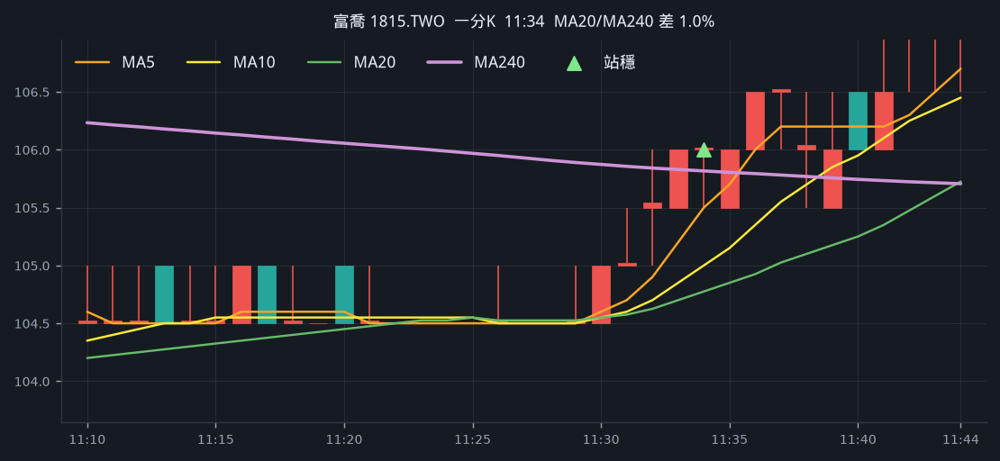

**五分 K（對照）**

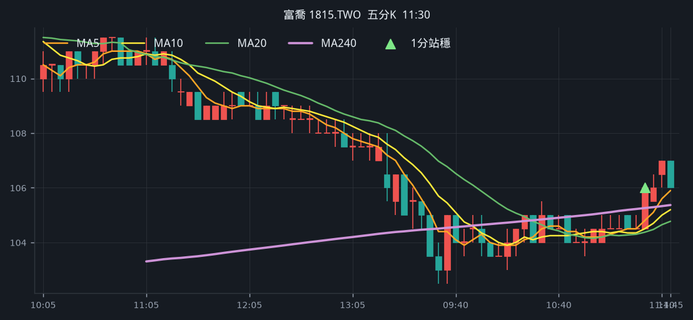

## 11. 中美晶 [5483.TWO](https://tw.stock.yahoo.com/quote/5483.TWO)

- 價格 181.50 +3.12%　成交額排名 #33　60.23 億
- 1分站上 12:06　收 179.50 > MA240 179.45
- 1分 MA5 179.10 > MA10 178.80 > MA20 178.57
- 五分收盤 / MA240（對照）　179.50 > 178.96（+0.3%）

**一分 K**

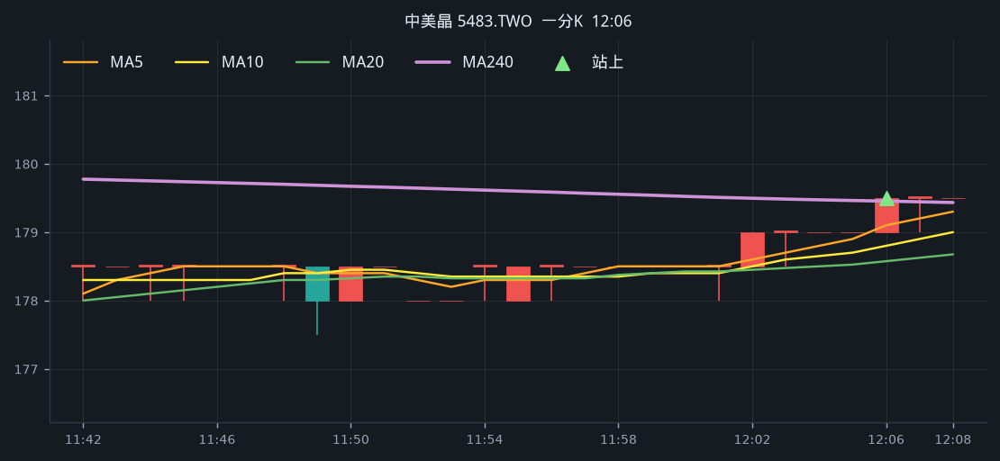

**五分 K（對照）**

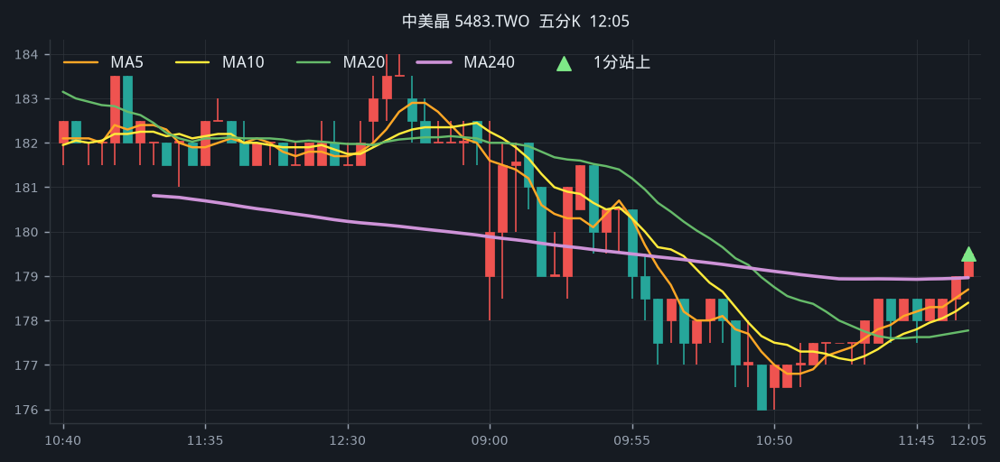

## 12. 金居 [8358.TWO](https://tw.stock.yahoo.com/quote/8358.TWO)

- 價格 417.00 -4.36%　成交額排名 #34　58.27 億
- 1分站上 12:06　收 410.00 > MA240 407.46
- 1分 MA5 408.00 > MA10 407.35 > MA20 406.25
- 五分收盤 / MA240（對照）　409.00 > 416.86（-1.9%）

**一分 K**

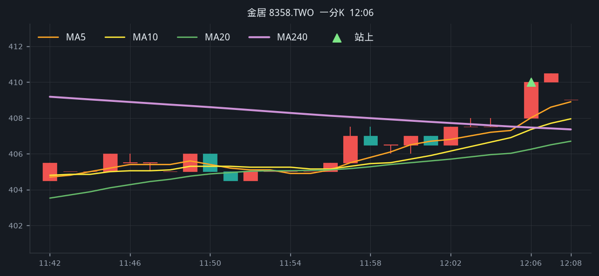

**五分 K（對照）**

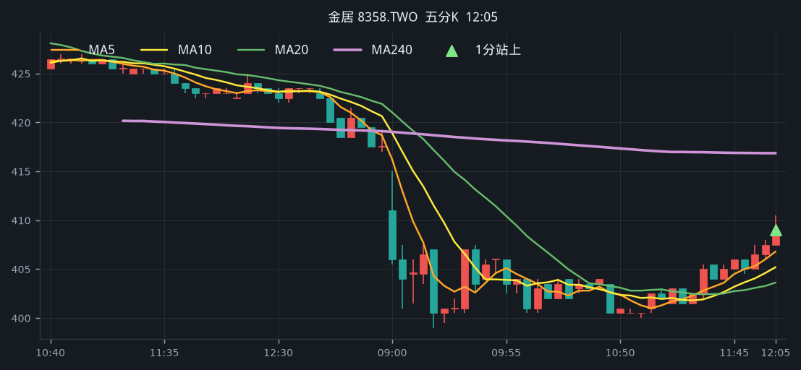

## 13. 鴻海 [2317.TW](https://tw.stock.yahoo.com/quote/2317.TW)

- 價格 243.50 -0.81%　成交額排名 #36　57.92 億
- 1分站上 12:06　收 241.00 > MA240 240.59
- 1分 MA5 240.30 > MA10 240.05 > MA20 239.88
- 五分收盤 / MA240（對照）　241.00 > 244.41（-1.4%）

**一分 K**

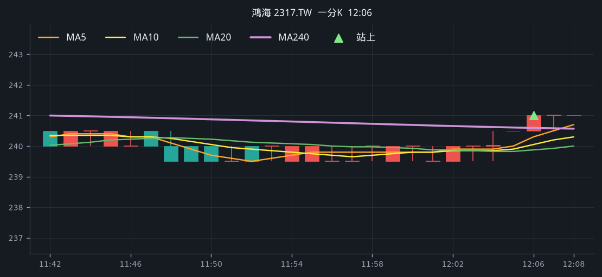

**五分 K（對照）**

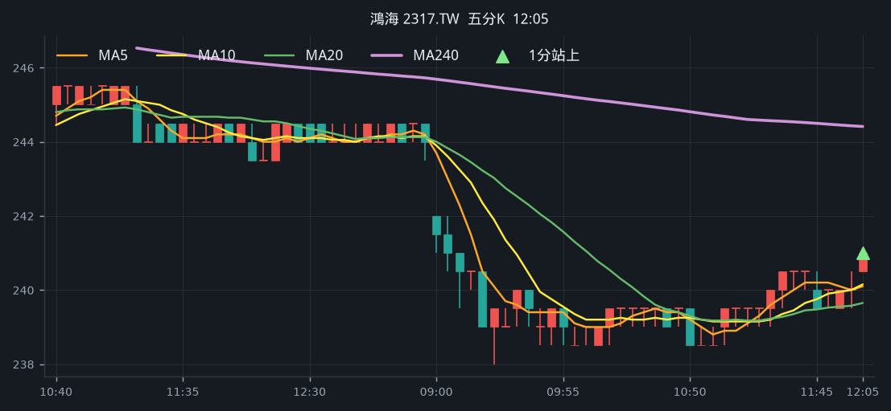

## 14. 群創 [3481.TW](https://tw.stock.yahoo.com/quote/3481.TW)

- 價格 45.45 -1.30%　成交額排名 #38　56.72 億
- 1分站上 09:05　收 46.65 > MA240 46.19
- 1分 MA5 46.36 > MA10 46.04 > MA20 45.87
- 五分收盤 / MA240（對照）　46.45 > 46.63（-0.4%）

**一分 K**

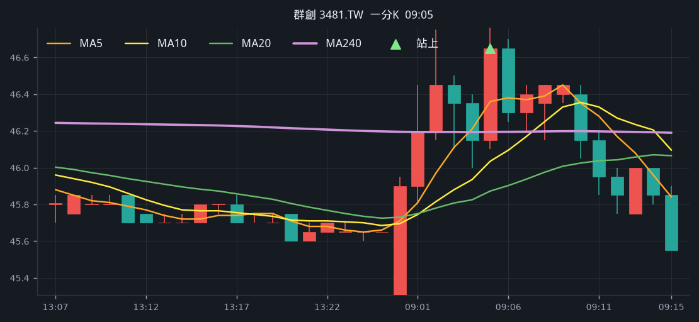

**五分 K（對照）**

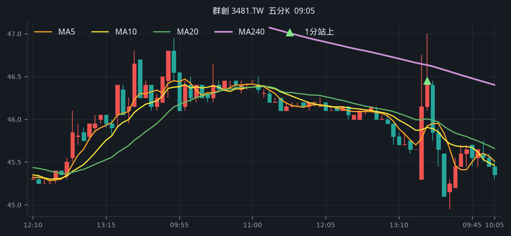

## 15. 長榮 [2603.TW](https://tw.stock.yahoo.com/quote/2603.TW)

- 價格 250.50 -0.40%　成交額排名 #39　56.70 億
- 1分站上 09:48　收 251.00 > MA240 250.95
- 1分 MA5 250.00 > MA10 249.95 > MA20 249.57
- 五分收盤 / MA240（對照）　251.00 > 245.70（+2.2%）

**一分 K**

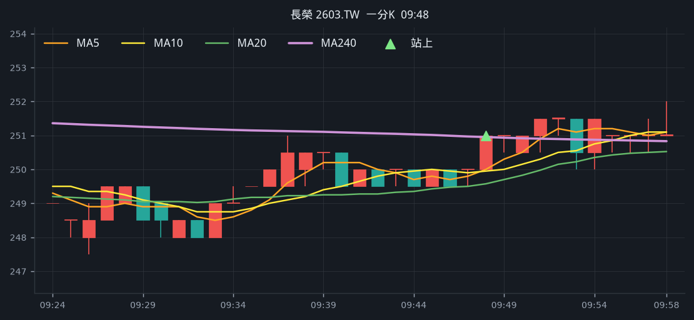

**五分 K（對照）**

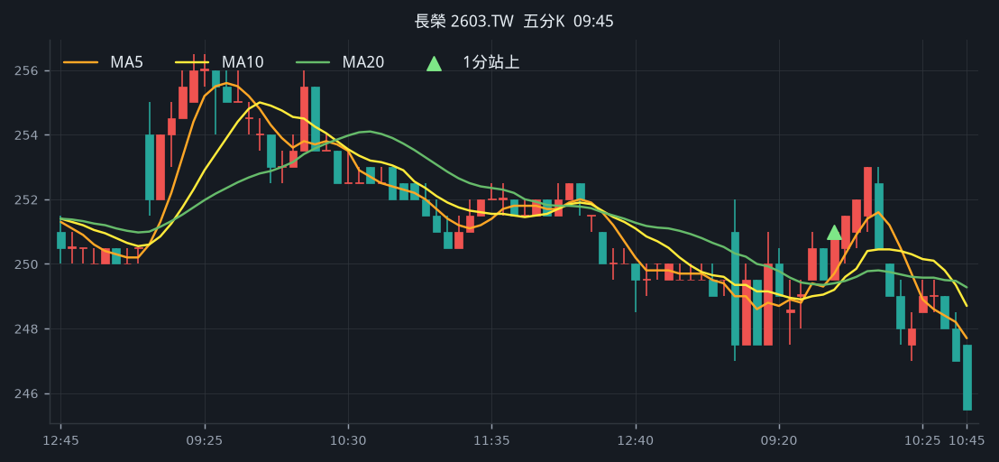

## 16. 臻鼎-KY [4958.TW](https://tw.stock.yahoo.com/quote/4958.TW)

- 價格 435.50 -1.25%　成交額排名 #40　56.28 億
- 1分站上 11:42　收 431.50 > MA240 431.03
- 1分 MA5 429.90 > MA10 429.70 > MA20 427.85
- 五分收盤 / MA240（對照）　432.00 > 446.02（-3.1%）

**一分 K**

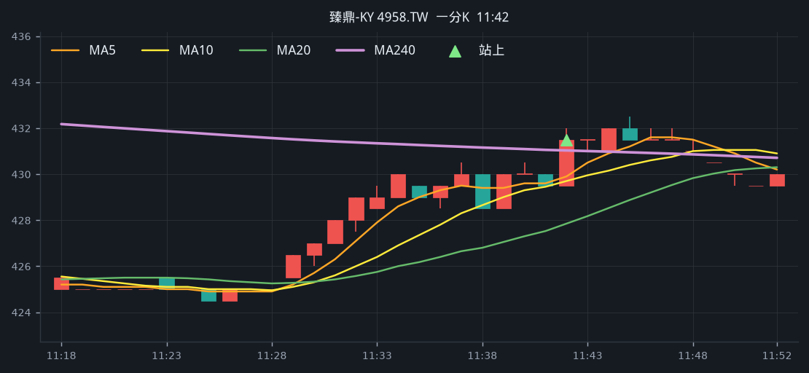

**五分 K（對照）**

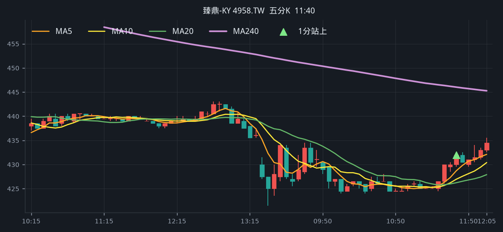

## 17. 聯鈞 [3450.TW](https://tw.stock.yahoo.com/quote/3450.TW)

- 價格 507.00 -7.99%　成交額排名 #41　55.29 億
- 1分站上 11:33　收 500.00 > MA240 499.87
- 1分 MA5 498.40 > MA10 497.40 > MA20 497.32
- 五分收盤 / MA240（對照）　501.00 > 543.08（-7.7%）

**一分 K**

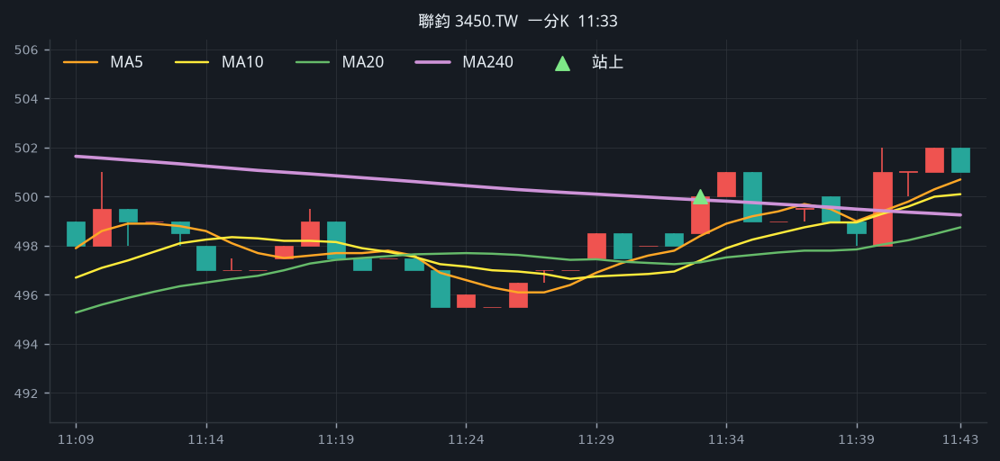

**五分 K（對照）**

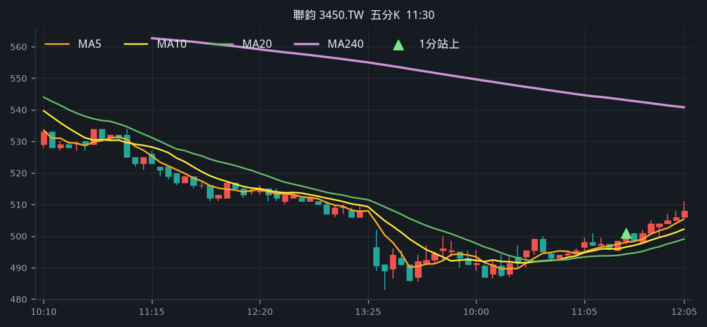

## 18. 鼎元 [2426.TW](https://tw.stock.yahoo.com/quote/2426.TW)

- 價格 82.60 +0.49%　成交額排名 #42　54.85 億
- 1分站上 09:39　收 84.20 > MA240 84.17
- 1分 MA5 83.58 > MA10 83.24 > MA20 82.91
- 五分收盤 / MA240（對照）　84.20 > 76.83（+9.6%）

**一分 K**

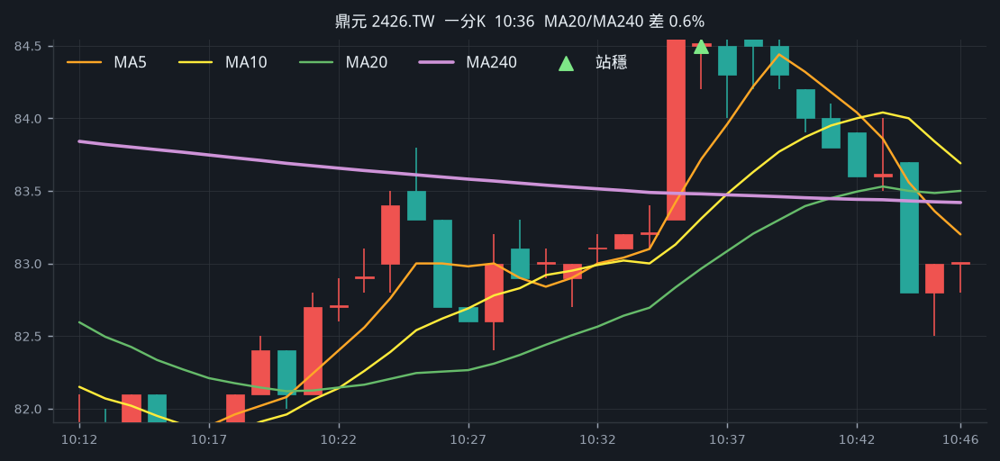

**五分 K（對照）**

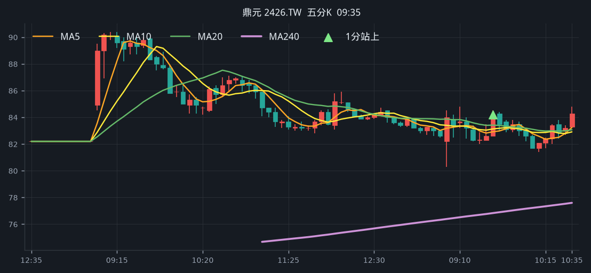

## 19. 旺宏 [2337.TW](https://tw.stock.yahoo.com/quote/2337.TW)

- 價格 124.00 +1.22%　成交額排名 #47　50.05 億
- 1分站上 12:06　收 120.00 > MA240 119.88
- 1分 MA5 119.60 > MA10 119.20 > MA20 118.90
- 五分收盤 / MA240（對照）　119.50 > 121.15（-1.4%）

**一分 K**

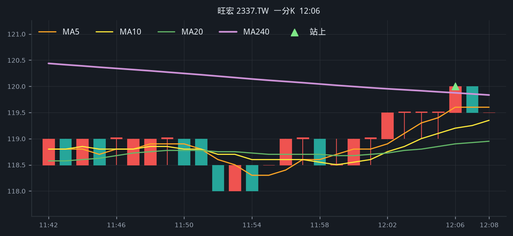

**五分 K（對照）**

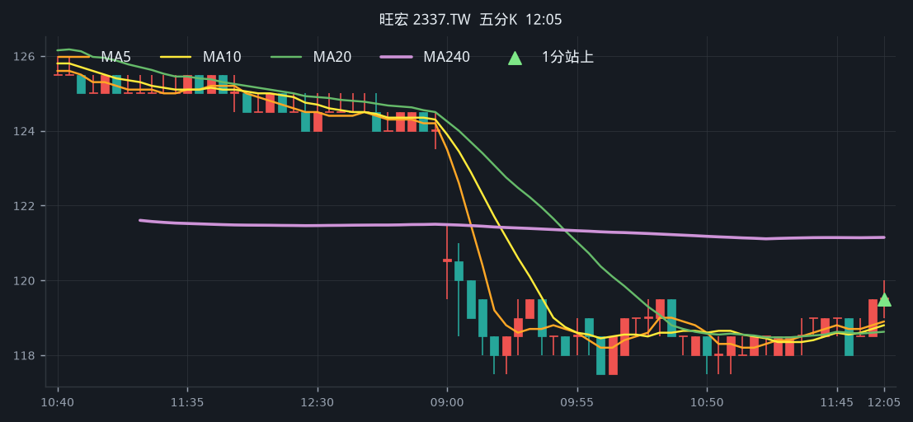

## 20. 日月光投控 [3711.TW](https://tw.stock.yahoo.com/quote/3711.TW)

- 價格 592.00 +0.85%　成交額排名 #51　46.45 億
- 1分站上 12:06　收 579.00 > MA240 578.45
- 1分 MA5 577.20 > MA10 576.60 > MA20 575.80
- 五分收盤 / MA240（對照）　578.00 > 584.39（-1.1%）

**一分 K**

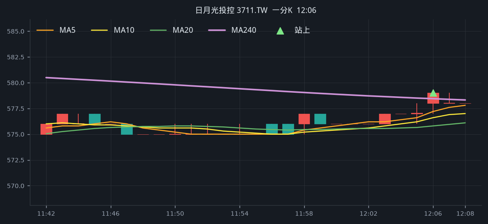

**五分 K（對照）**

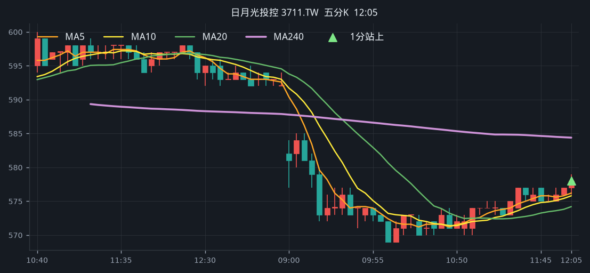

## 21. 穩懋 [3105.TWO](https://tw.stock.yahoo.com/quote/3105.TWO)

- 價格 355.00 -4.83%　成交額排名 #52　42.83 億
- 1分站上 09:48　收 359.50 > MA240 359.15
- 1分 MA5 358.50 > MA10 358.05 > MA20 356.93
- 五分收盤 / MA240（對照）　360.00 > 366.69（-1.8%）

**一分 K**

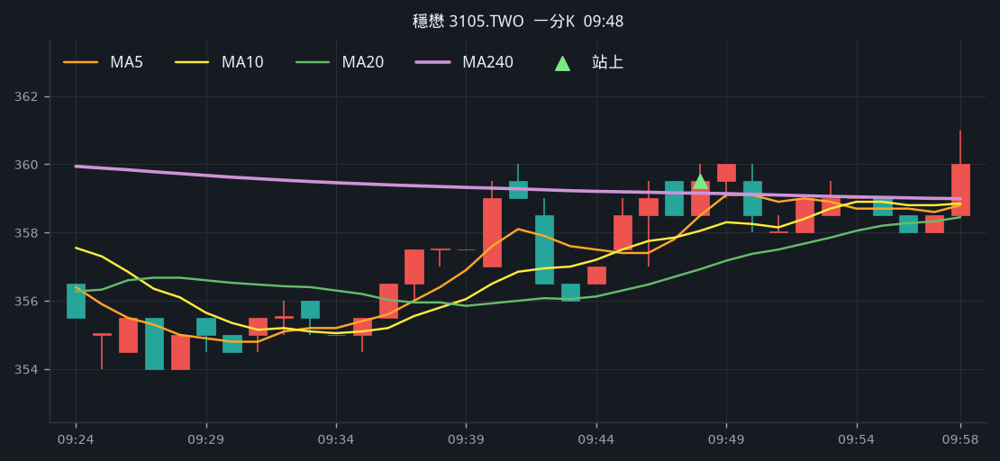

**五分 K（對照）**

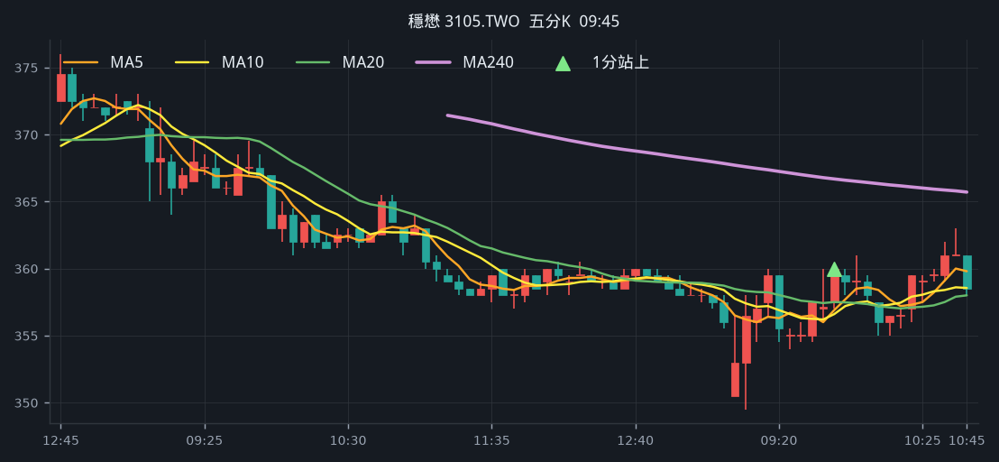

## 22. 緯創 [3231.TW](https://tw.stock.yahoo.com/quote/3231.TW)

- 價格 175.50 +0.00%　成交額排名 #58　35.57 億
- 1分站上 11:29　收 175.50 > MA240 175.19
- 1分 MA5 175.00 > MA10 174.85 > MA20 174.53
- 五分收盤 / MA240（對照）　175.50 > 177.39（-1.1%）

**一分 K**

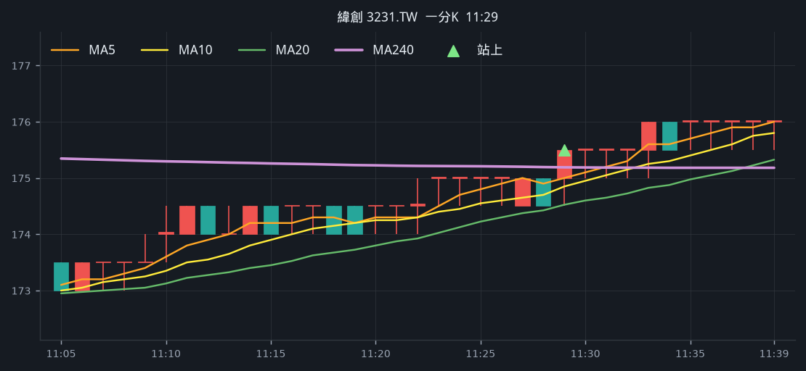

**五分 K（對照）**

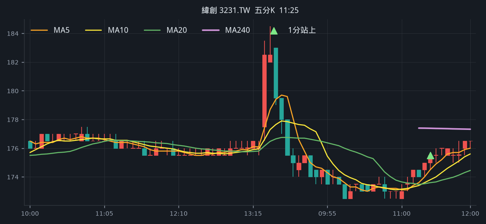

## 23. 一詮 [2486.TW](https://tw.stock.yahoo.com/quote/2486.TW)

- 價格 249.00 +2.26%　成交額排名 #60　34.97 億
- 1分站上 11:21　收 248.00 > MA240 247.99
- 1分 MA5 247.90 > MA10 247.80 > MA20 247.72
- 五分收盤 / MA240（對照）　247.50 > 241.82（+2.3%）

**一分 K**

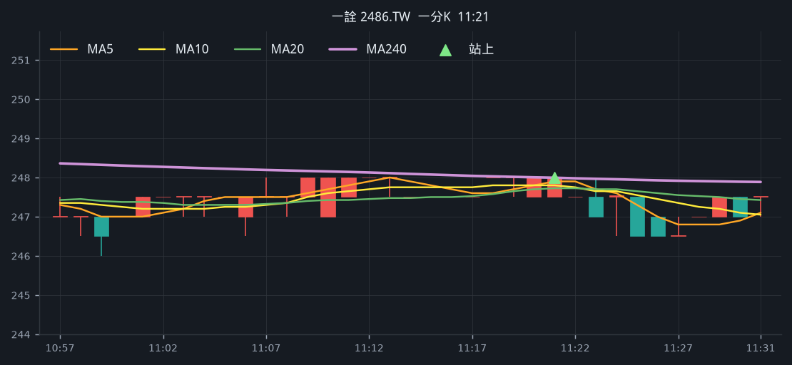

**五分 K（對照）**

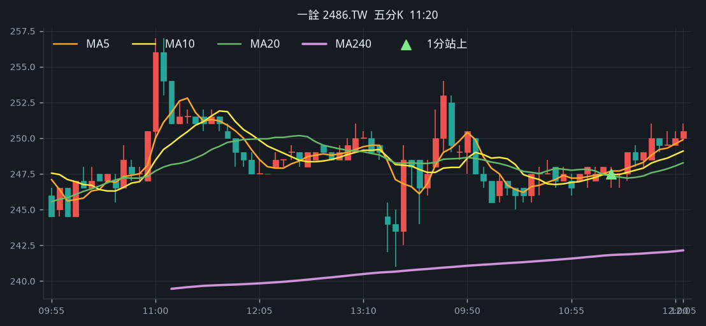

## 24. 聯一光 [3441.TWO](https://tw.stock.yahoo.com/quote/3441.TWO)

- 價格 112.50 +5.14%　成交額排名 #64　31.43 億
- 1分站上 11:36　收 111.50 > MA240 111.02
- 1分 MA5 111.00 > MA10 110.60 > MA20 110.28
- 五分收盤 / MA240（對照）　110.00 > 100.56（+9.4%）

**一分 K**

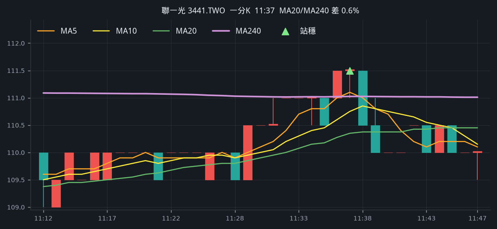

**五分 K（對照）**

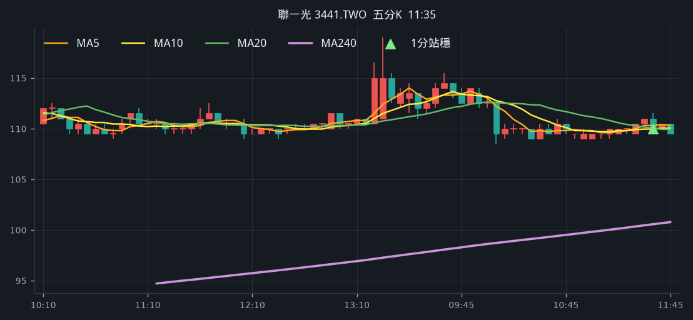

## 25. 華新科 [2492.TW](https://tw.stock.yahoo.com/quote/2492.TW)

- 價格 265.00 -0.38%　成交額排名 #66　31.21 億
- 1分站上 12:06　收 258.50 > MA240 257.62
- 1分 MA5 257.40 > MA10 256.90 > MA20 256.30
- 五分收盤 / MA240（對照）　257.50 > 273.71（-5.9%）

**一分 K**

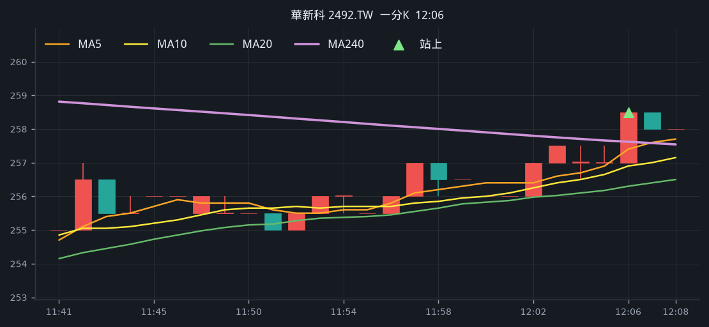

**五分 K（對照）**

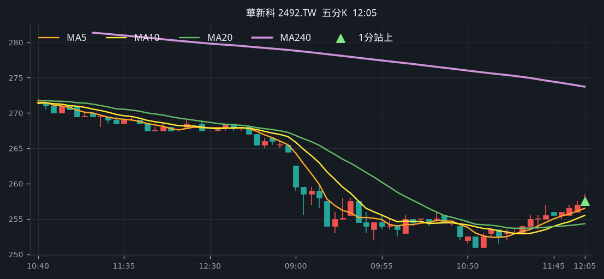

## 26. 順達 [3211.TWO](https://tw.stock.yahoo.com/quote/3211.TWO)

- 價格 326.00 -6.99%　成交額排名 #68　27.88 億
- 1分站上 12:02　收 325.00 > MA240 324.33
- 1分 MA5 323.80 > MA10 323.10 > MA20 322.90
- 五分收盤 / MA240（對照）　324.00 > 347.81（-6.8%）

**一分 K**

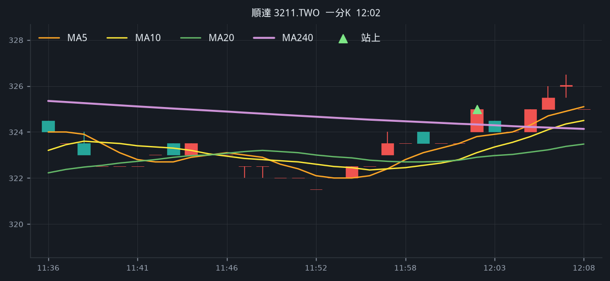

**五分 K（對照）**

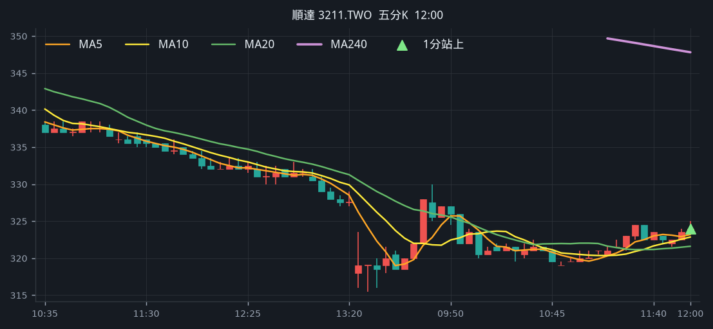

## 27. 瑞軒 [2489.TW](https://tw.stock.yahoo.com/quote/2489.TW)

- 價格 36.90 +3.51%　成交額排名 #74　26.74 億
- 1分站上 10:15　收 37.25 > MA240 37.12
- 1分 MA5 36.75 > MA10 36.56 > MA20 36.20
- 五分收盤 / MA240（對照）　37.95 > 33.87（+12.1%）

**一分 K**

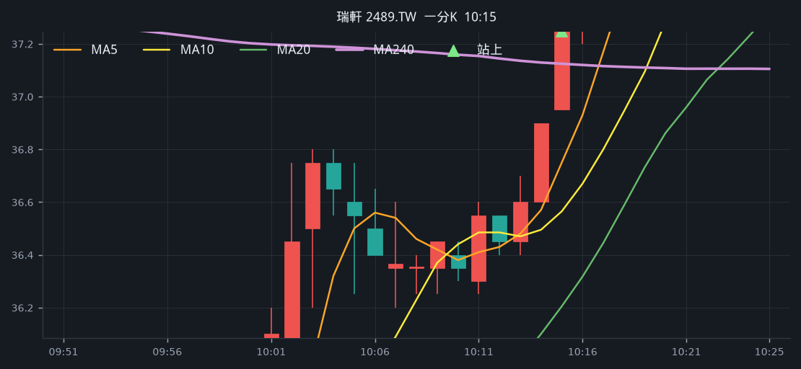

**五分 K（對照）**

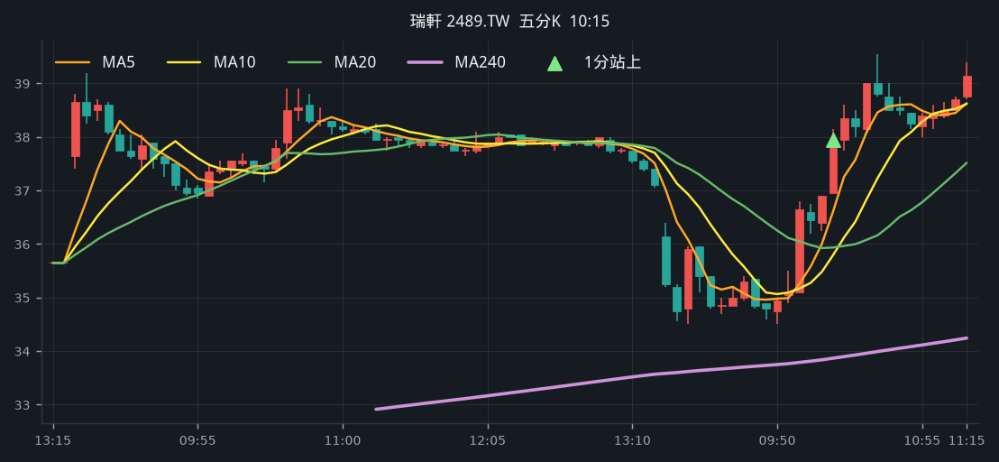

## 28. 汎銓 [6830.TW](https://tw.stock.yahoo.com/quote/6830.TW)

- 價格 446.50 -3.35%　成交額排名 #76　24.62 億
- 1分站上 10:32　收 456.50 > MA240 456.36
- 1分 MA5 453.30 > MA10 451.60 > MA20 451.18
- 五分收盤 / MA240（對照）　457.00 > 436.15（+4.8%）

**一分 K**

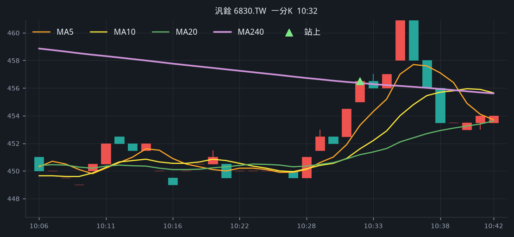

**五分 K（對照）**

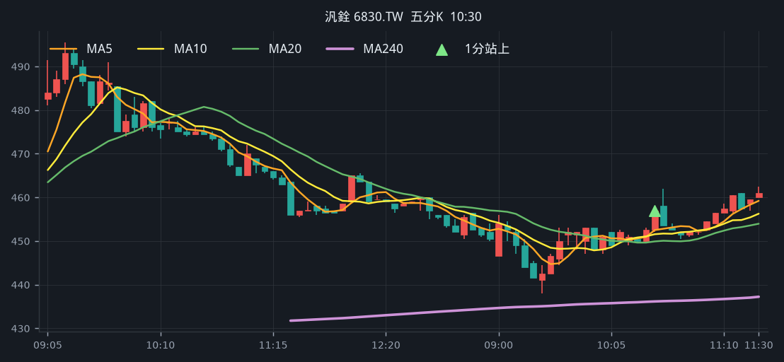

## 29. 力成 [6239.TW](https://tw.stock.yahoo.com/quote/6239.TW)

- 價格 269.50 +0.75%　成交額排名 #80　23.39 億
- 1分站上 12:06　收 264.00 > MA240 263.99
- 1分 MA5 263.70 > MA10 263.30 > MA20 262.85
- 五分收盤 / MA240（對照）　263.50 > 265.81（-0.9%）

**一分 K**

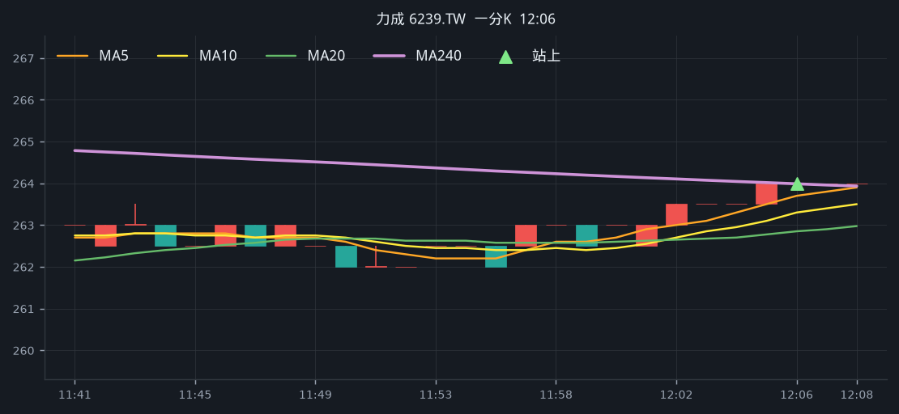

**五分 K（對照）**

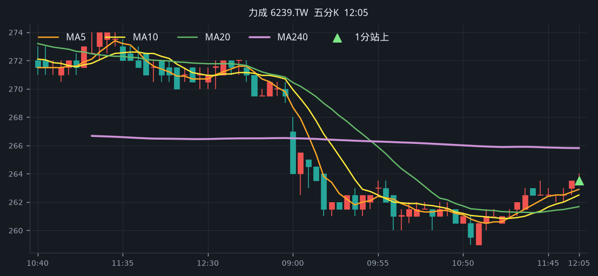

## 30. 頎邦 [6147.TWO](https://tw.stock.yahoo.com/quote/6147.TWO)

- 價格 157.00 +0.32%　成交額排名 #81　22.72 億
- 1分站上 10:55　收 156.50 > MA240 156.40
- 1分 MA5 154.90 > MA10 154.50 > MA20 154.00
- 五分收盤 / MA240（對照）　155.50 > 159.39（-2.4%）

**一分 K**

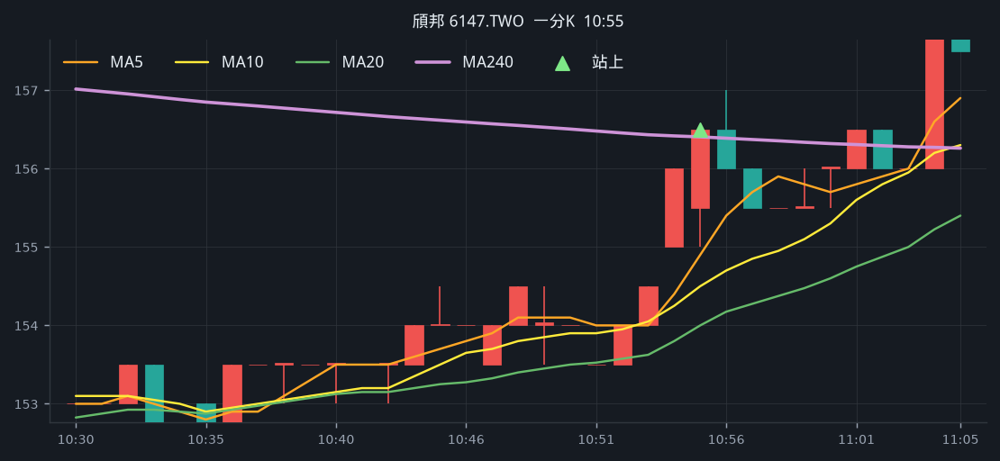

**五分 K（對照）**

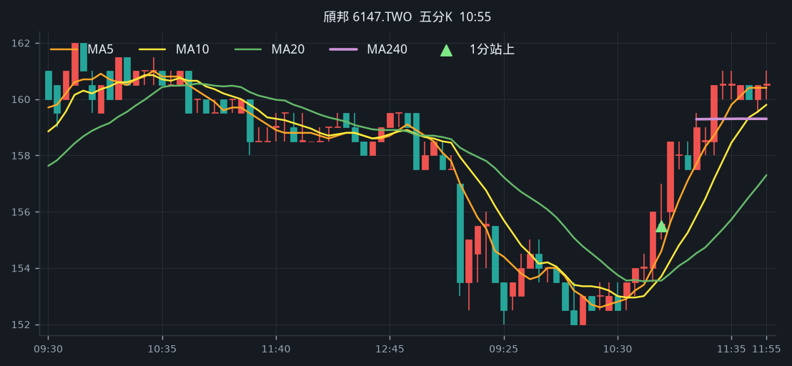

## 31. 慧洋-KY [2637.TW](https://tw.stock.yahoo.com/quote/2637.TW)

- 價格 97.10 -4.80%　成交額排名 #83　21.96 億
- 1分站上 09:01　收 99.60 > MA240 98.93
- 1分 MA5 97.88 > MA10 97.41 > MA20 97.24
- 五分收盤 / MA240（對照）　101.00 > 95.37（+5.9%）

**一分 K**

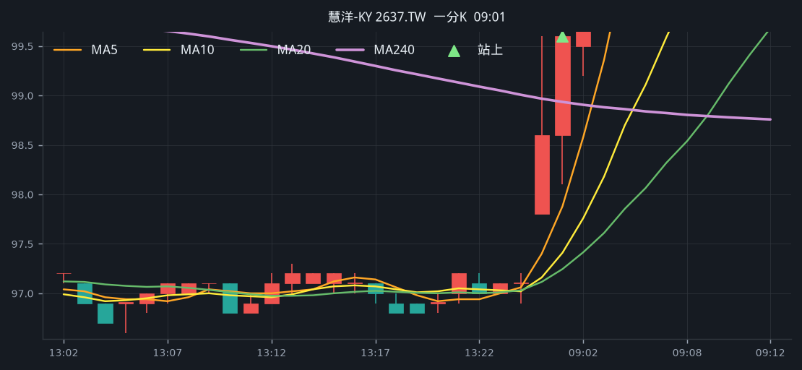

**五分 K（對照）**

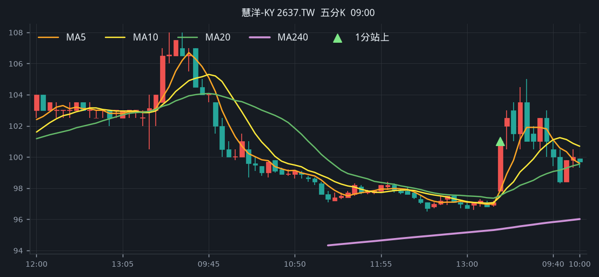

## 32. 晶技 [3042.TW](https://tw.stock.yahoo.com/quote/3042.TW)

- 價格 177.50 -6.58%　成交額排名 #85　21.88 億
- 1分站上 11:54　收 177.50 > MA240 177.24
- 1分 MA5 177.00 > MA10 176.90 > MA20 176.65
- 五分收盤 / MA240（對照）　177.50 > 184.67（-3.9%）

**一分 K**

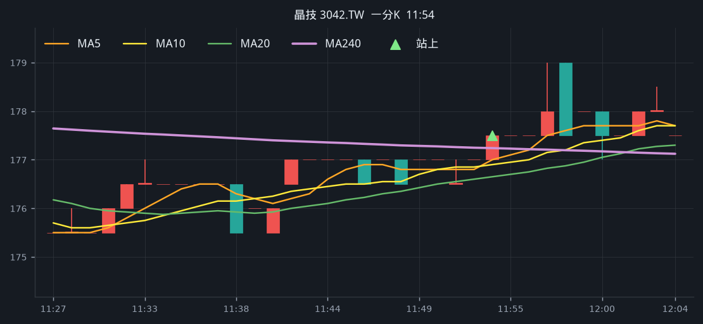

**五分 K（對照）**

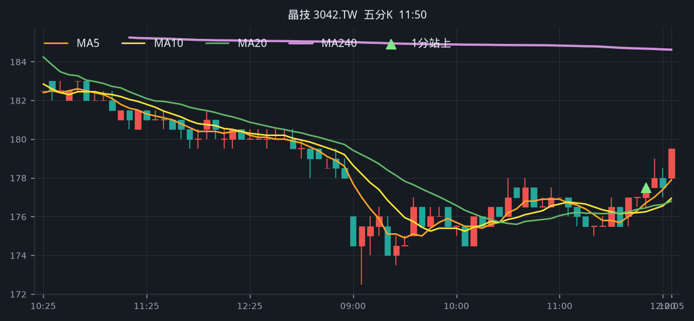

## 33. 聯詠 [3034.TW](https://tw.stock.yahoo.com/quote/3034.TW)

- 價格 542.00 +2.26%　成交額排名 #86　21.46 億
- 1分站上 11:09　收 543.00 > MA240 542.34
- 1分 MA5 541.60 > MA10 541.10 > MA20 539.95
- 五分收盤 / MA240（對照）　543.00 > 530.50（+2.4%）

**一分 K**

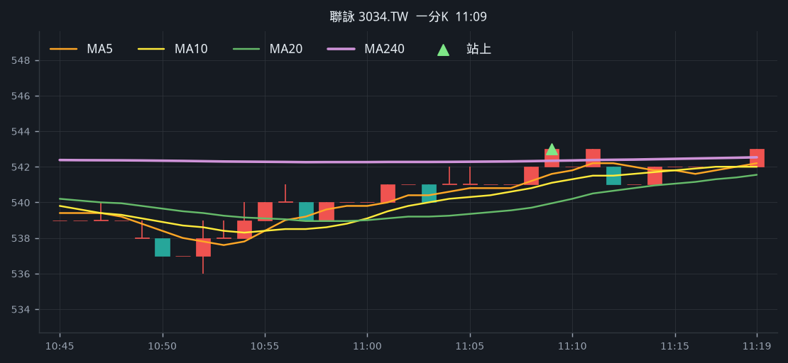

**五分 K（對照）**

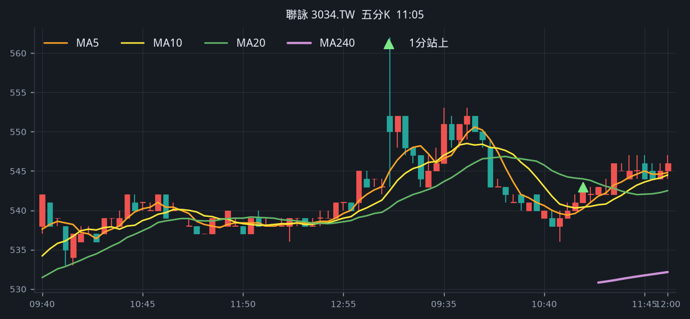

## 34. 新盛力 [4931.TWO](https://tw.stock.yahoo.com/quote/4931.TWO)

- 價格 252.00 -10.00%　成交額排名 #87　20.84 億
- 1分站上 09:09　收 257.50 > MA240 257.38
- 1分 MA5 254.80 > MA10 254.65 > MA20 253.32
- 五分收盤 / MA240（對照）　257.50 > 265.79（-3.1%）

**一分 K**

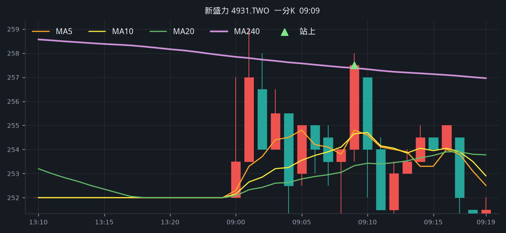

**五分 K（對照）**

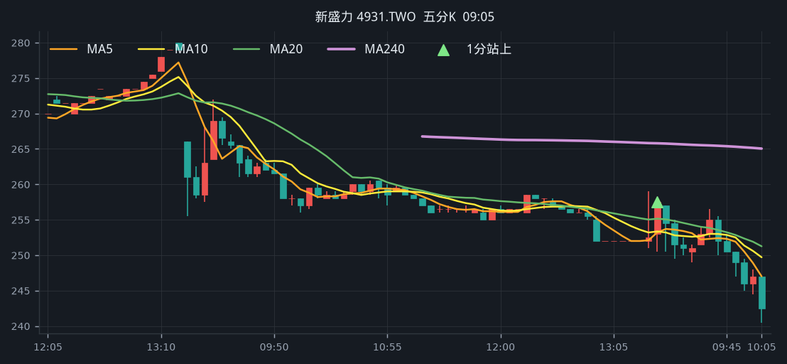

## 35. 環宇-KY [4991.TWO](https://tw.stock.yahoo.com/quote/4991.TWO)

- 價格 435.00 -9.56%　成交額排名 #88　19.88 億
- 1分站上 12:06　收 435.50 > MA240 434.32
- 1分 MA5 432.90 > MA10 432.05 > MA20 430.75
- 五分收盤 / MA240（對照）　435.00 > 474.29（-8.3%）

**一分 K**

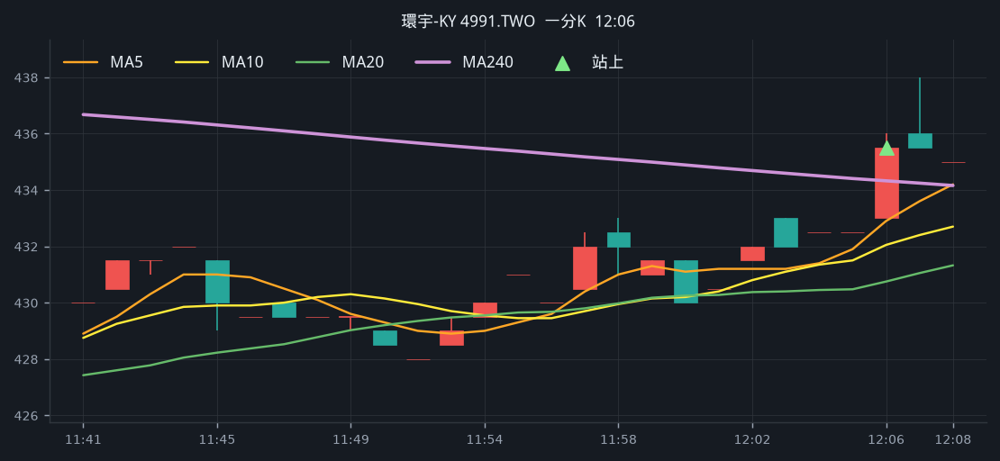

**五分 K（對照）**

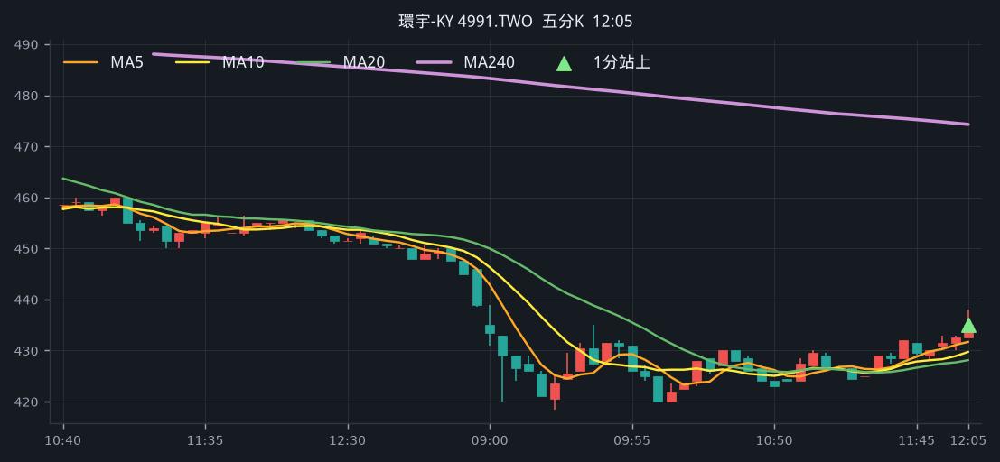

## 36. 良維 [6290.TWO](https://tw.stock.yahoo.com/quote/6290.TWO)

- 價格 229.00 +8.27%　成交額排名 #91　19.49 億
- 1分站上 10:17　收 226.50 > MA240 225.77
- 1分 MA5 225.70 > MA10 223.90 > MA20 222.50
- 五分收盤 / MA240（對照）　227.50 > 219.30（+3.7%）

**一分 K**

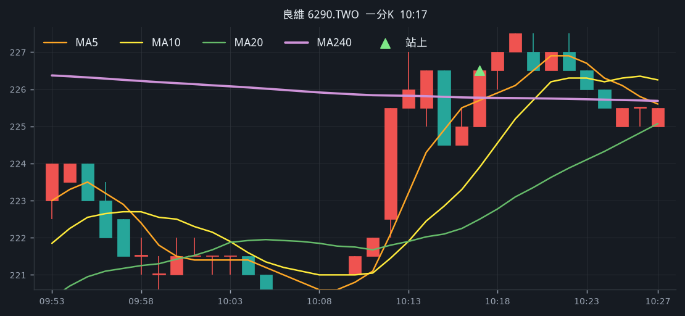

**五分 K（對照）**

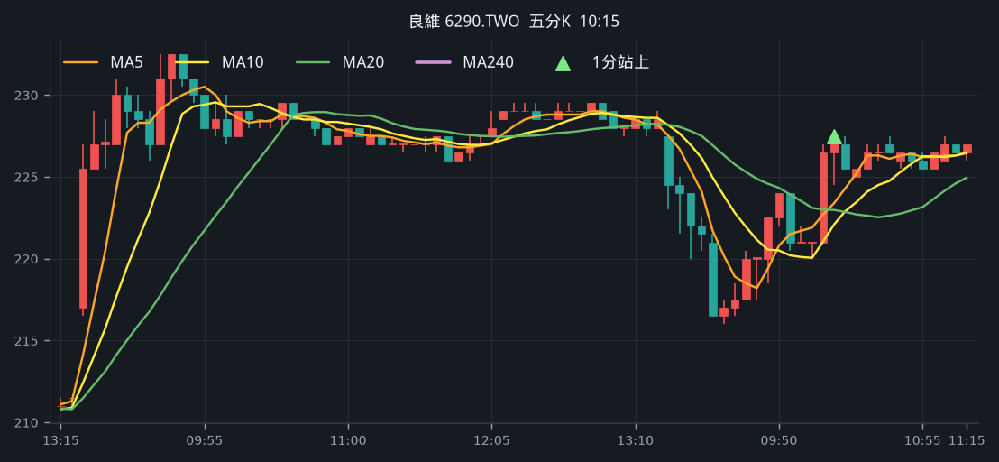

## 37. 精材 [3374.TWO](https://tw.stock.yahoo.com/quote/3374.TWO)

- 價格 302.50 -1.31%　成交額排名 #92　19.29 億
- 1分站上 12:03　收 297.50 > MA240 296.19
- 1分 MA5 296.10 > MA10 295.50 > MA20 295.20
- 五分收盤 / MA240（對照）　299.00 > 302.52（-1.2%）

**一分 K**

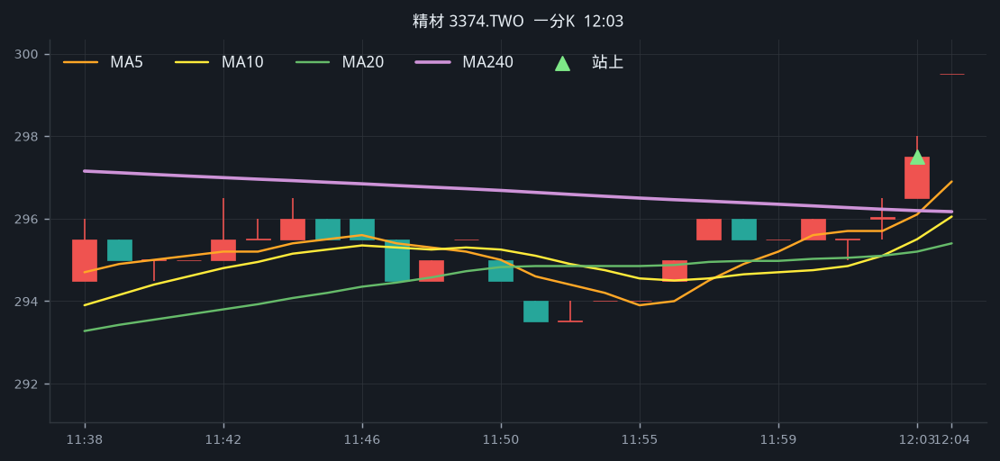

**五分 K（對照）**

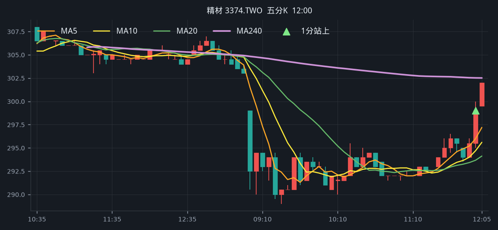

## 38. 台化 [1326.TW](https://tw.stock.yahoo.com/quote/1326.TW)

- 價格 57.10 -4.99%　成交額排名 #94　19.09 億
- 1分站上 09:17　收 57.10 > MA240 57.01
- 1分 MA5 56.90 > MA10 56.89 > MA20 56.81
- 五分收盤 / MA240（對照）　57.20 > 58.36（-2.0%）

**一分 K**

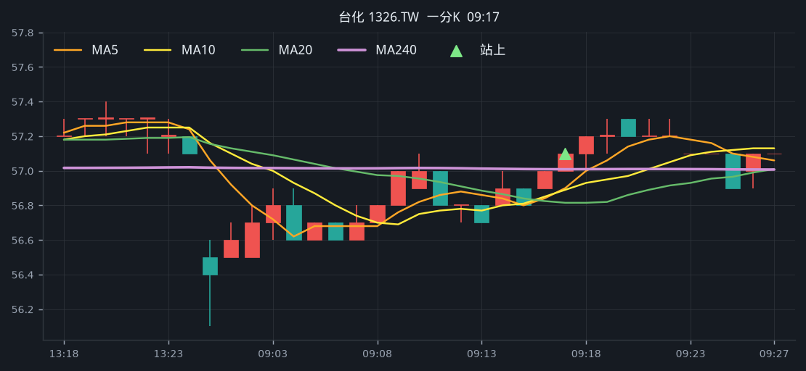

**五分 K（對照）**

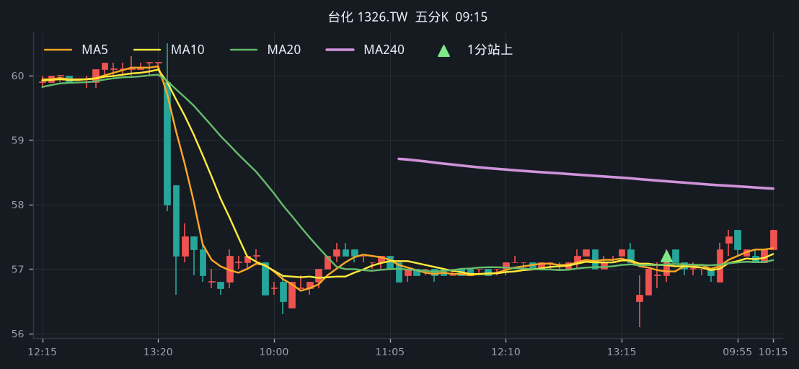

## 39. 廣達 [2382.TW](https://tw.stock.yahoo.com/quote/2382.TW)

- 價格 325.00 +1.09%　成交額排名 #95　18.65 億
- 1分站上 09:05　收 324.00 > MA240 323.83
- 1分 MA5 324.30 > MA10 324.25 > MA20 324.18
- 五分收盤 / MA240（對照）　323.00 > 325.15（-0.7%）

**一分 K**

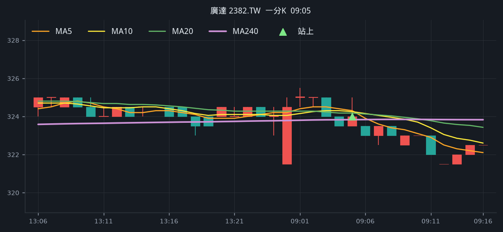

**五分 K（對照）**

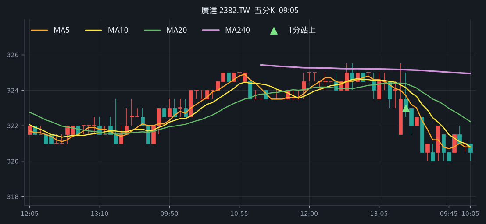

## 40. 世界 [5347.TWO](https://tw.stock.yahoo.com/quote/5347.TWO)

- 價格 151.00 -0.33%　成交額排名 #99　18.28 億
- 1分站上 12:03　收 149.50 > MA240 149.37
- 1分 MA5 148.90 > MA10 148.75 > MA20 148.62
- 五分收盤 / MA240（對照）　149.50 > 151.01（-1.0%）

**一分 K**

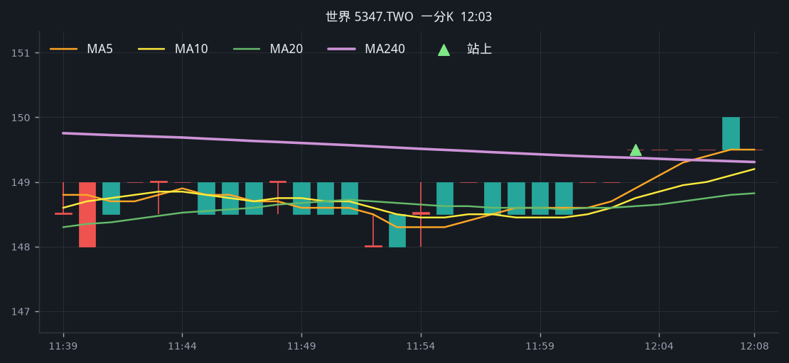

**五分 K（對照）**

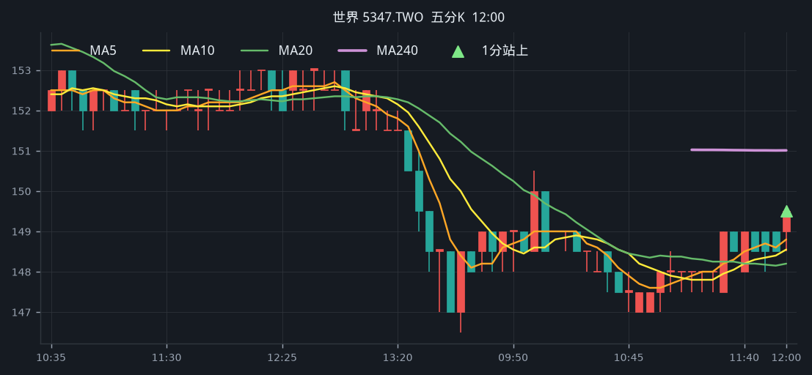

## 41. 信昌電 [6173.TWO](https://tw.stock.yahoo.com/quote/6173.TWO)

- 價格 203.00 -4.25%　成交額排名 #103　17.47 億
- 1分站上 12:05　收 197.00 > MA240 196.98
- 1分 MA5 196.90 > MA10 196.75 > MA20 196.12
- 五分收盤 / MA240（對照）　198.00 > 211.07（-6.2%）

**一分 K**

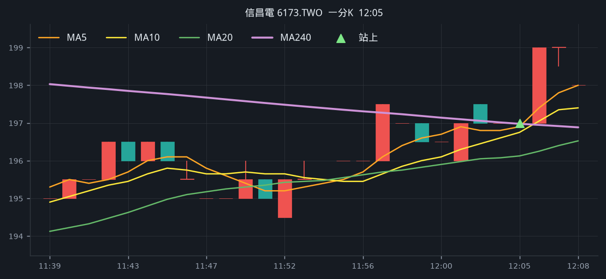

**五分 K（對照）**

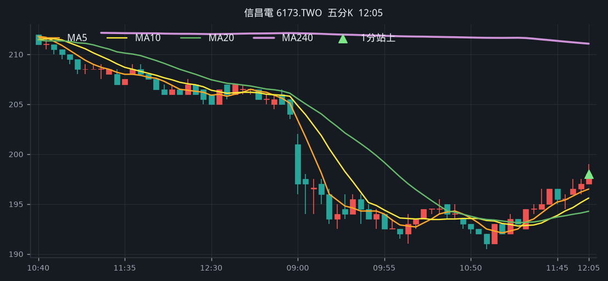

## 42. 亞電 [4939.TWO](https://tw.stock.yahoo.com/quote/4939.TWO)

- 價格 65.20 -1.95%　成交額排名 #108　16.43 億
- 1分站上 09:16　收 66.50 > MA240 66.20
- 1分 MA5 65.64 > MA10 64.87 > MA20 64.65
- 五分收盤 / MA240（對照）　66.00 > 63.56（+3.8%）

**一分 K**

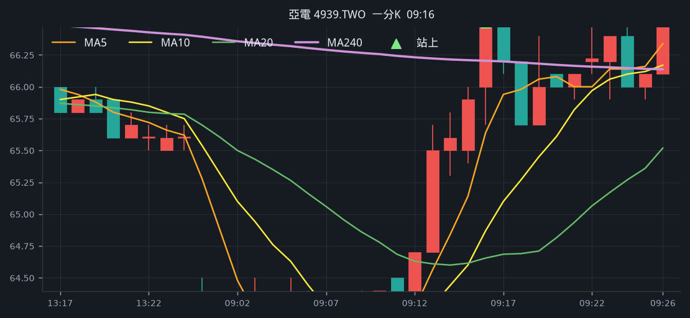

**五分 K（對照）**

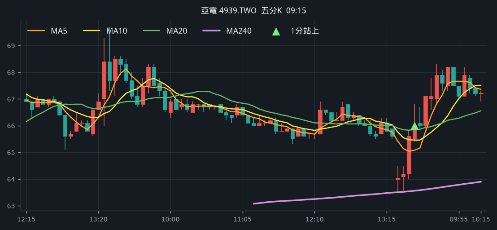

## 43. 台表科 [6278.TW](https://tw.stock.yahoo.com/quote/6278.TW)

- 價格 179.00 -4.28%　成交額排名 #111　15.63 億
- 1分站上 11:58　收 175.50 > MA240 175.48
- 1分 MA5 174.60 > MA10 174.35 > MA20 174.20
- 五分收盤 / MA240（對照）　175.50 > 179.49（-2.2%）

**一分 K**

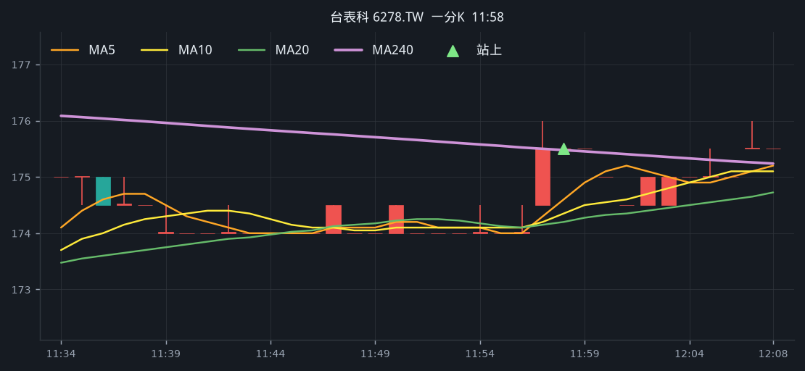

**五分 K（對照）**

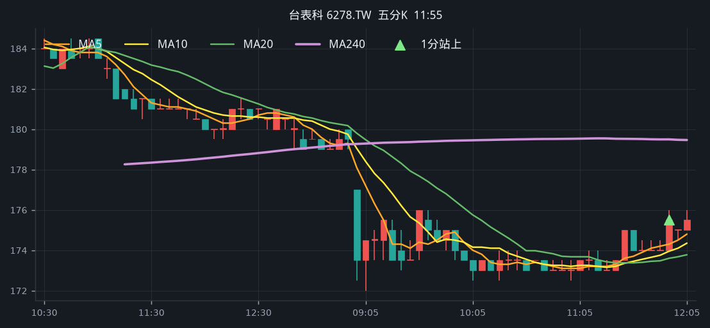

## 44. 健鼎 [3044.TW](https://tw.stock.yahoo.com/quote/3044.TW)

- 價格 450.00 -1.96%　成交額排名 #118　13.90 億
- 1分站上 10:21　收 450.00 > MA240 449.68
- 1分 MA5 449.90 > MA10 449.60 > MA20 449.57
- 五分收盤 / MA240（對照）　451.50 > 472.14（-4.4%）

**一分 K**

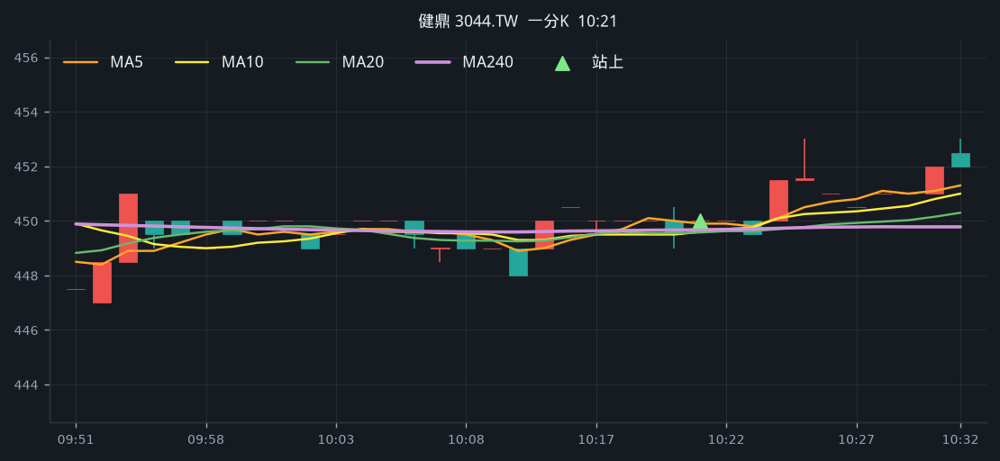

**五分 K（對照）**

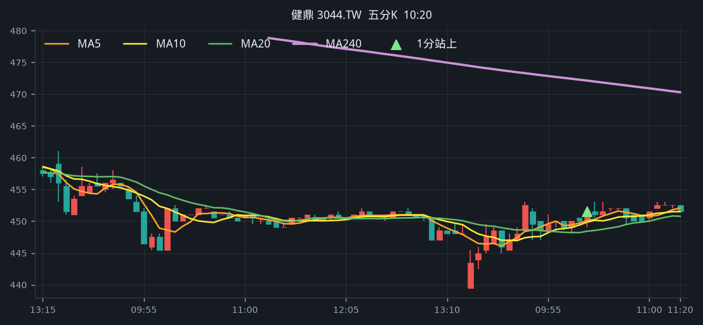

## 45. 尖點 [8021.TW](https://tw.stock.yahoo.com/quote/8021.TW)

- 價格 388.50 -2.14%　成交額排名 #121　12.91 億
- 1分站上 09:38　收 396.50 > MA240 393.21
- 1分 MA5 390.70 > MA10 389.00 > MA20 386.18
- 五分收盤 / MA240（對照）　396.50 > 401.26（-1.2%）

**一分 K**

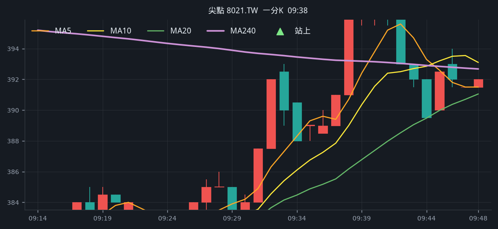

**五分 K（對照）**

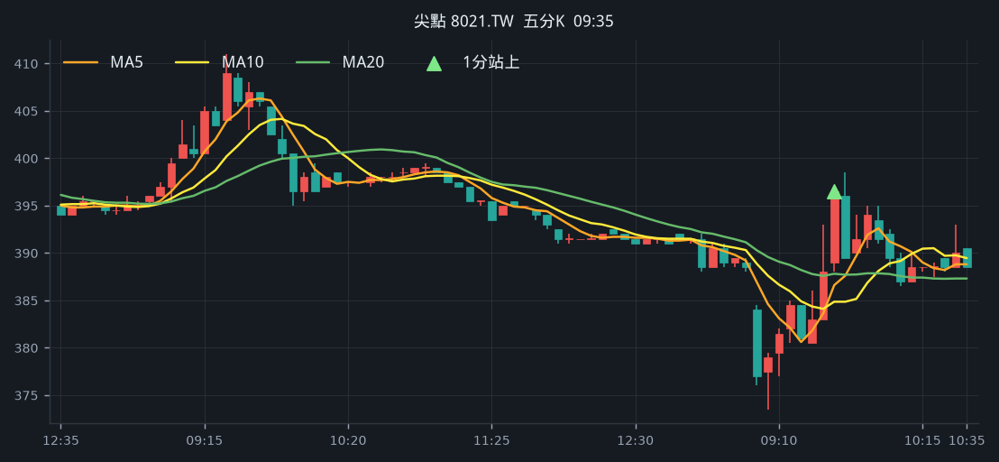

## 46. 強茂 [2481.TW](https://tw.stock.yahoo.com/quote/2481.TW)

- 價格 134.00 +0.75%　成交額排名 #123　12.77 億
- 1分站上 11:57　收 132.50 > MA240 132.35
- 1分 MA5 132.10 > MA10 132.05 > MA20 132.03
- 五分收盤 / MA240（對照）　132.50 > 135.33（-2.1%）

**一分 K**

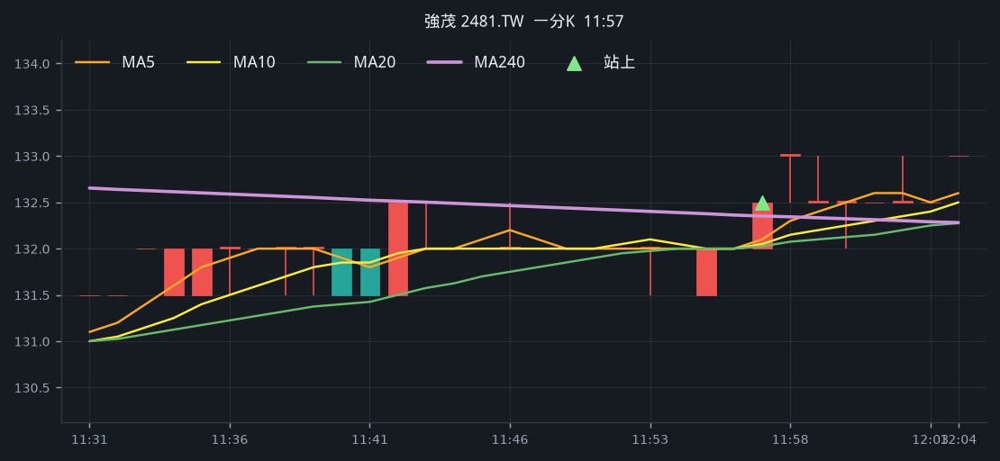

**五分 K（對照）**

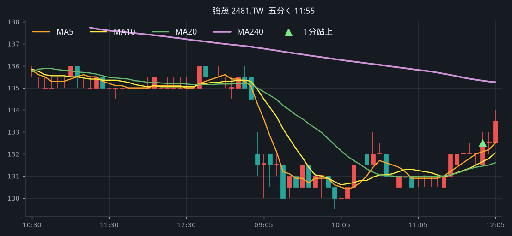

## 47. 光環 [3234.TWO](https://tw.stock.yahoo.com/quote/3234.TWO)

- 價格 166.00 +9.93%　成交額排名 #124　12.20 億
- 1分站上 10:49　收 165.00 > MA240 164.85
- 1分 MA5 164.20 > MA10 164.10 > MA20 164.00
- 五分收盤 / MA240（對照）　165.00 > 152.82（+8.0%）

**一分 K**

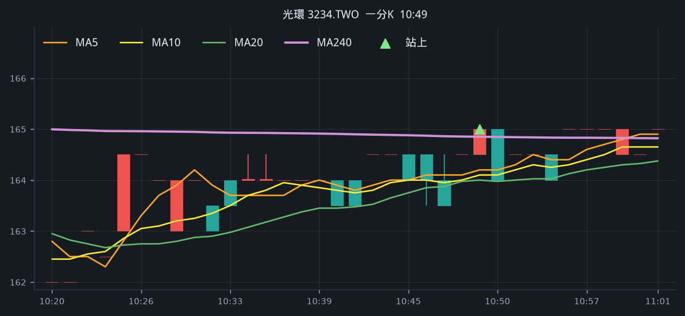

**五分 K（對照）**

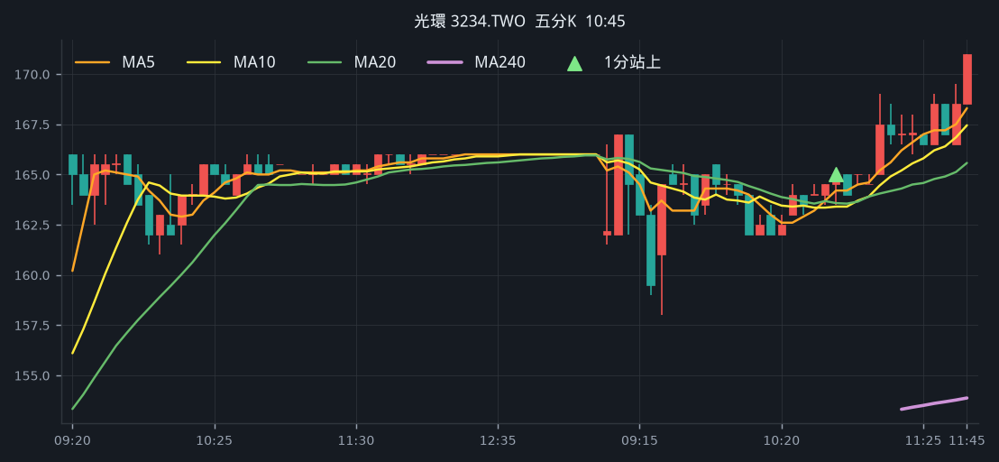

## 48. 華新 [1605.TW](https://tw.stock.yahoo.com/quote/1605.TW)

- 價格 38.10 +2.14%　成交額排名 #125　12.17 億
- 1分站上 11:10　收 37.95 > MA240 37.94
- 1分 MA5 37.89 > MA10 37.83 > MA20 37.81
- 五分收盤 / MA240（對照）　37.90 > 37.25（+1.8%）

**一分 K**

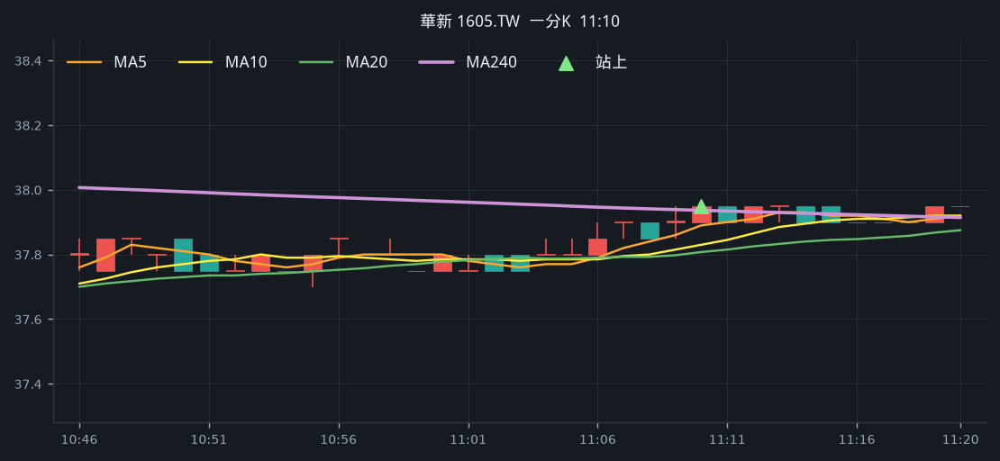

**五分 K（對照）**

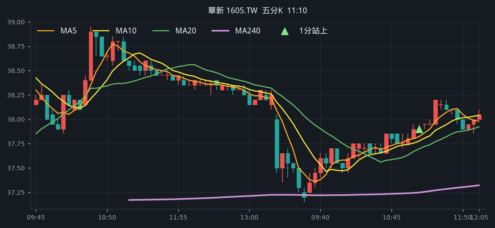

## 49. 全新 [2455.TW](https://tw.stock.yahoo.com/quote/2455.TW)

- 價格 381.50 -6.03%　成交額排名 #126　12.02 億
- 1分站上 10:44　收 393.00 > MA240 392.96
- 1分 MA5 392.70 > MA10 391.25 > MA20 388.12
- 五分收盤 / MA240（對照）　393.00 > 398.80（-1.5%）

**一分 K**

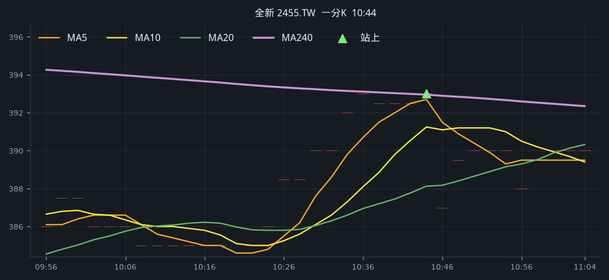

**五分 K（對照）**

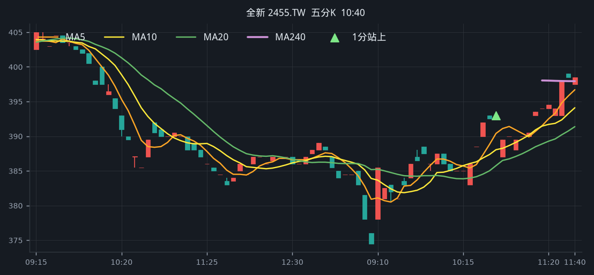

## 50. 台泥 [1101.TW](https://tw.stock.yahoo.com/quote/1101.TW)

- 價格 24.70 -0.60%　成交額排名 #127　11.74 億
- 1分站上 10:00　收 24.85 > MA240 24.81
- 1分 MA5 24.77 > MA10 24.74 > MA20 24.67
- 五分收盤 / MA240（對照）　24.70 > 24.61（+0.4%）

**一分 K**

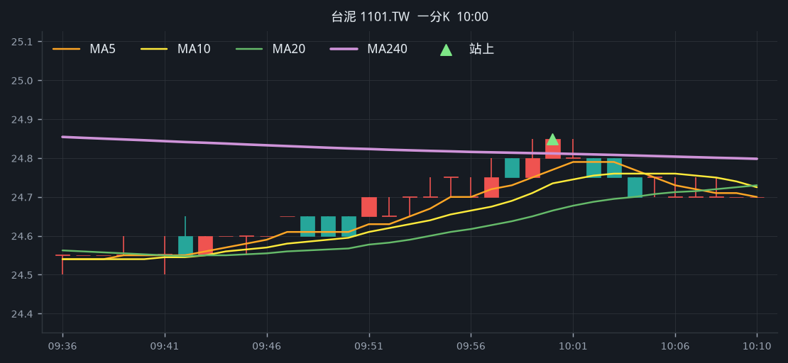

**五分 K（對照）**

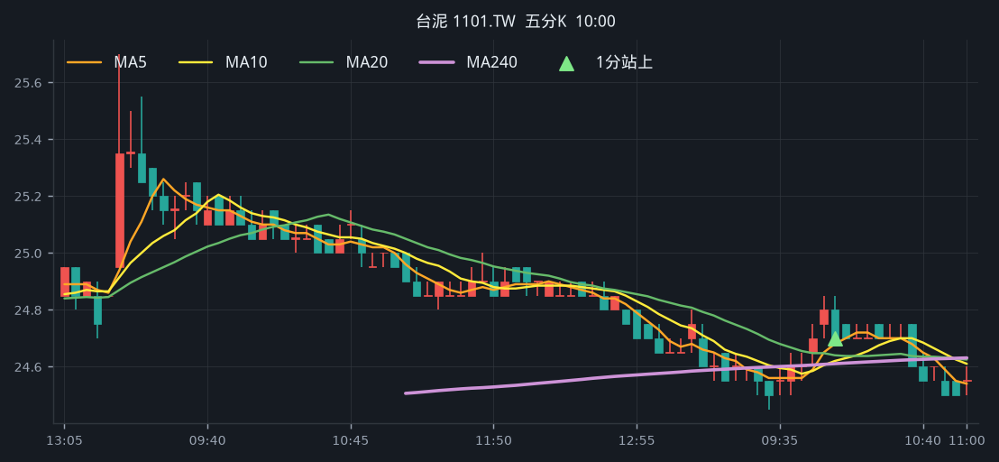

## 51. 上詮 [3363.TWO](https://tw.stock.yahoo.com/quote/3363.TWO)

- 價格 567.00 -5.50%　成交額排名 #133　11.26 億
- 1分站上 11:01　收 574.00 > MA240 571.48
- 1分 MA5 571.00 > MA10 570.10 > MA20 569.45
- 五分收盤 / MA240（對照）　576.00 > 588.52（-2.1%）

**一分 K**

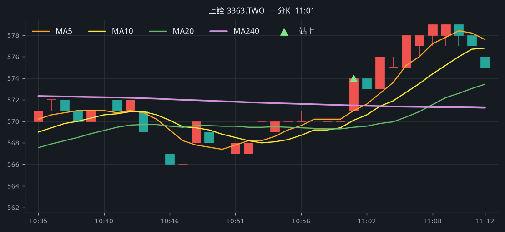

**五分 K（對照）**

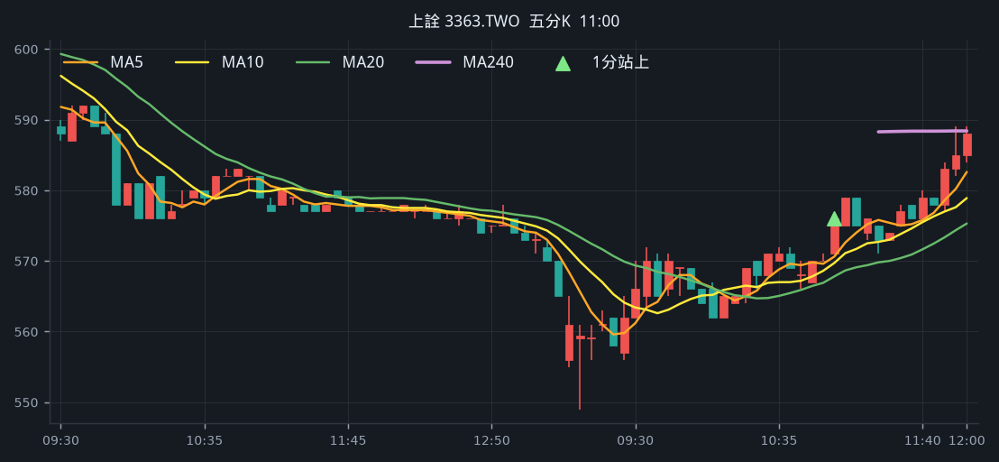

## 52. 新興 [2605.TW](https://tw.stock.yahoo.com/quote/2605.TW)

- 價格 36.60 -3.17%　成交額排名 #135　11.21 億
- 1分站上 09:01　收 37.00 > MA240 36.98
- 1分 MA5 36.61 > MA10 36.53 > MA20 36.44
- 五分收盤 / MA240（對照）　37.20 > 36.69（+1.4%）

**一分 K**

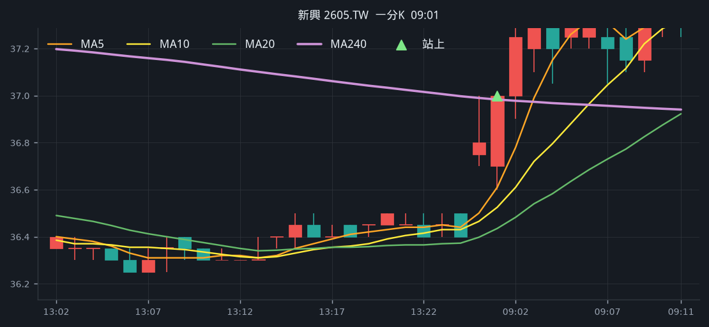

**五分 K（對照）**

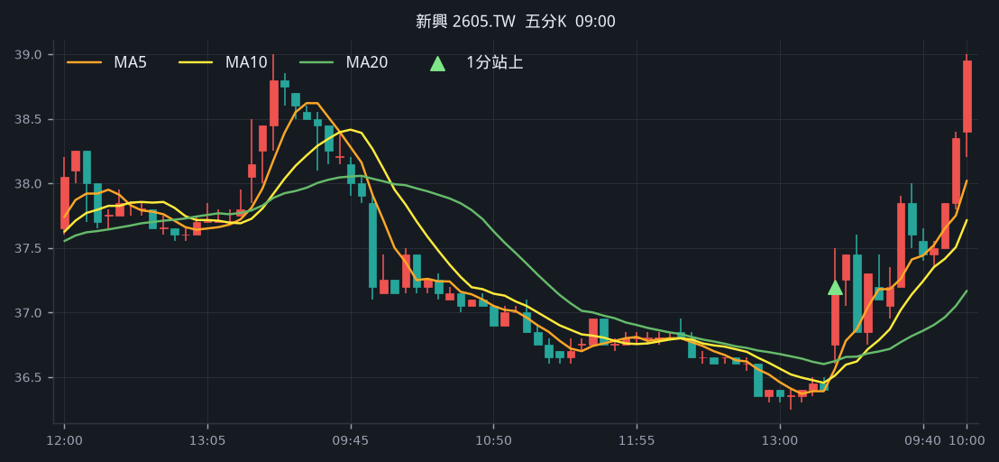

## 53. 大聯大 [3702.TW](https://tw.stock.yahoo.com/quote/3702.TW)

- 價格 111.00 +0.00%　成交額排名 #136　11.16 億
- 1分站上 11:29　收 110.50 > MA240 110.37
- 1分 MA5 110.10 > MA10 109.80 > MA20 109.58
- 五分收盤 / MA240（對照）　110.50 > 108.06（+2.3%）

**一分 K**

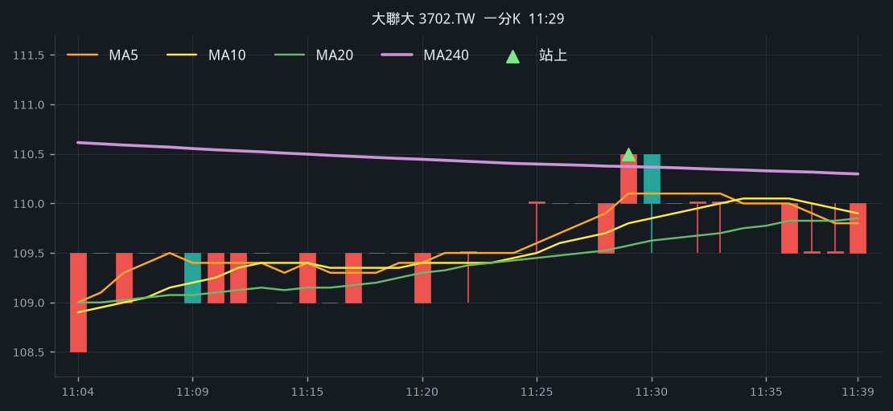

**五分 K（對照）**

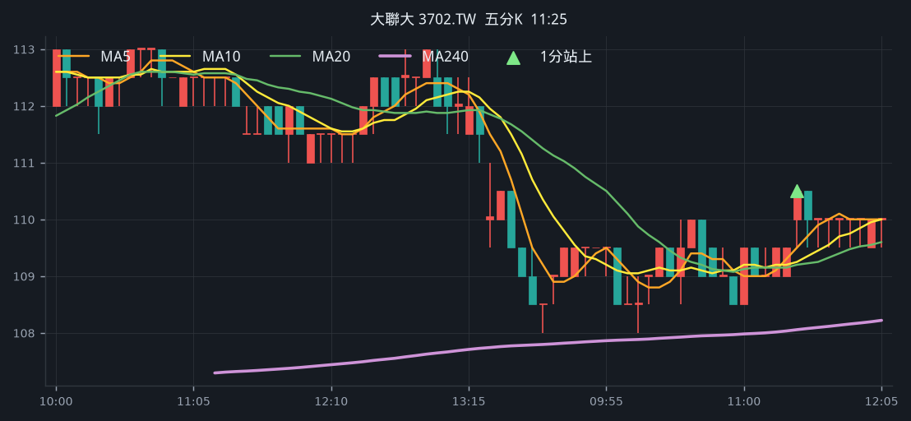

## 54. 訊芯-KY [6451.TW](https://tw.stock.yahoo.com/quote/6451.TW)

- 價格 400.00 -4.31%　成交額排名 #138　11.03 億
- 1分站上 11:40　收 399.00 > MA240 397.34
- 1分 MA5 398.20 > MA10 397.85 > MA20 396.88
- 五分收盤 / MA240（對照）　402.00 > 416.71（-3.5%）

**一分 K**

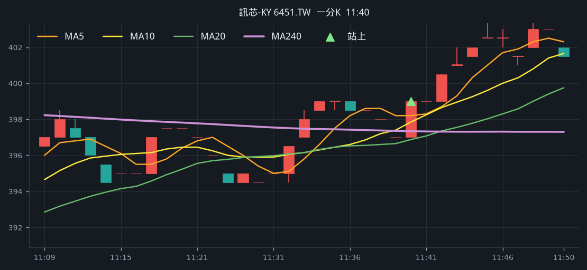

**五分 K（對照）**

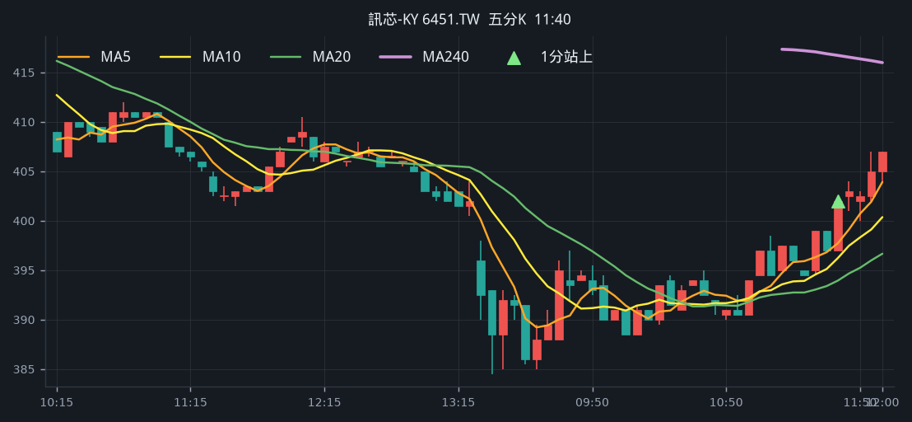

## 55. 台玻 [1802.TW](https://tw.stock.yahoo.com/quote/1802.TW)

- 價格 56.90 -1.22%　成交額排名 #144　10.34 億
- 1分站上 12:02　收 56.50 > MA240 56.44
- 1分 MA5 56.32 > MA10 56.25 > MA20 56.14
- 五分收盤 / MA240（對照）　56.60 > 57.05（-0.8%）

**一分 K**

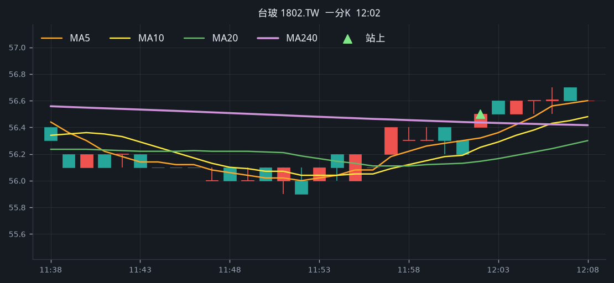

**五分 K（對照）**

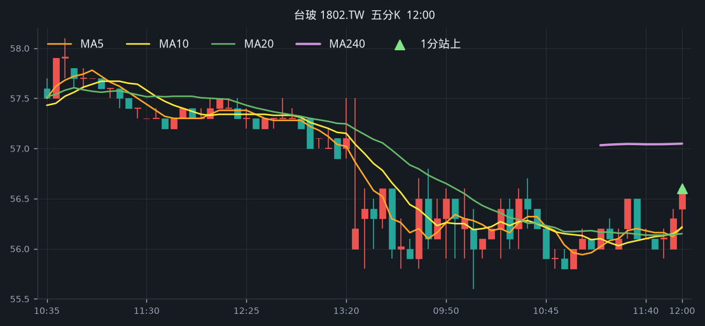

## 56. 台半 [5425.TWO](https://tw.stock.yahoo.com/quote/5425.TWO)

- 價格 86.10 -2.38%　成交額排名 #150　9.72 億
- 1分站上 12:00　收 85.40 > MA240 85.35
- 1分 MA5 85.30 > MA10 85.16 > MA20 85.16
- 五分收盤 / MA240（對照）　85.80 > 88.77（-3.3%）

**一分 K**

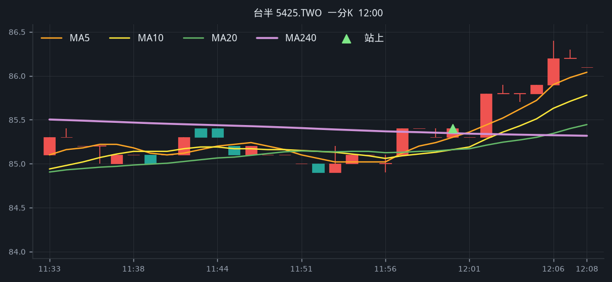

**五分 K（對照）**

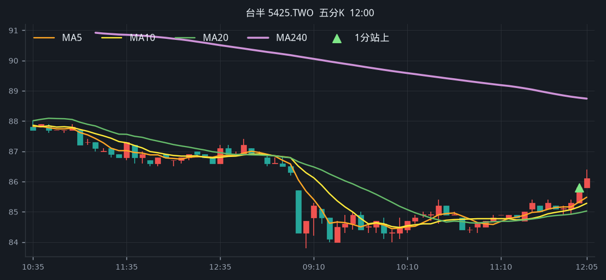

## 57. 永擎 [7711.TW](https://tw.stock.yahoo.com/quote/7711.TW)

- 價格 497.50 +7.80%　成交額排名 #152　9.68 億
- 1分站上 10:33　收 496.50 > MA240 494.17
- 1分 MA5 494.10 > MA10 493.55 > MA20 491.38
- 五分收盤 / MA240（對照）　495.00 > 476.86（+3.8%）

**一分 K**

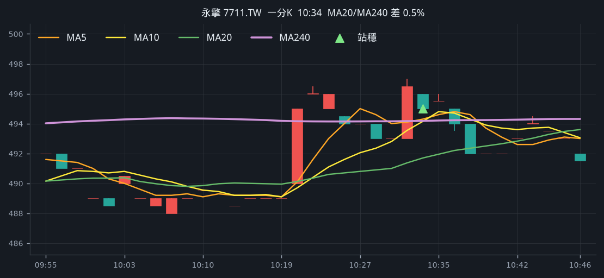

**五分 K（對照）**

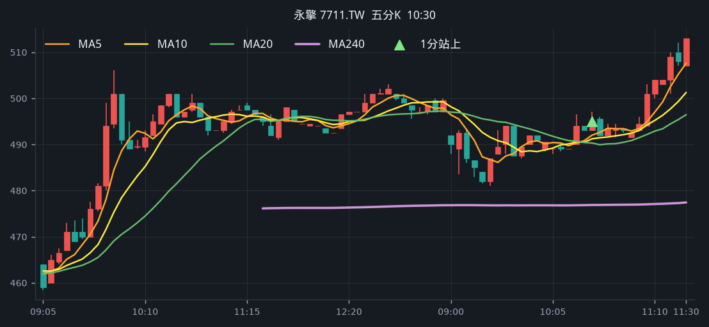

## 58. 技嘉 [2376.TW](https://tw.stock.yahoo.com/quote/2376.TW)

- 價格 341.00 +0.44%　成交額排名 #155　9.53 億
- 1分站上 11:27　收 340.00 > MA240 339.66
- 1分 MA5 339.50 > MA10 339.20 > MA20 338.23
- 五分收盤 / MA240（對照）　340.50 > 342.87（-0.7%）

**一分 K**

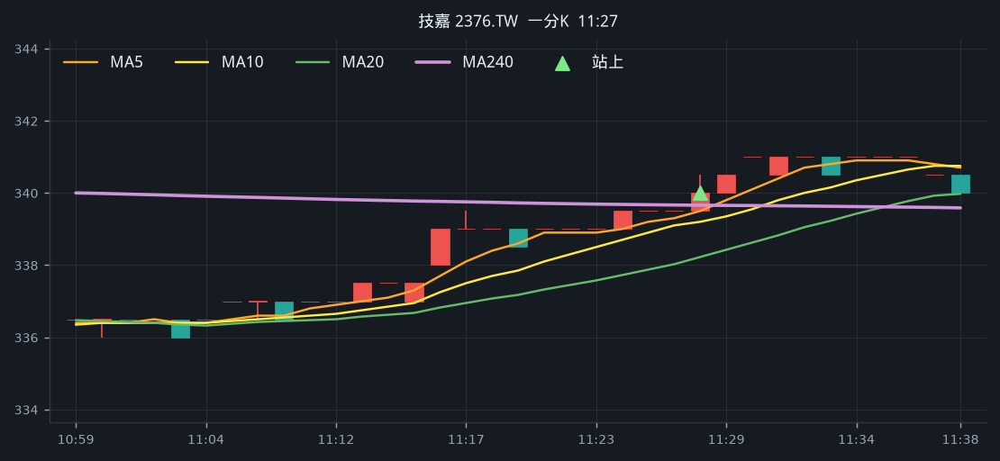

**五分 K（對照）**

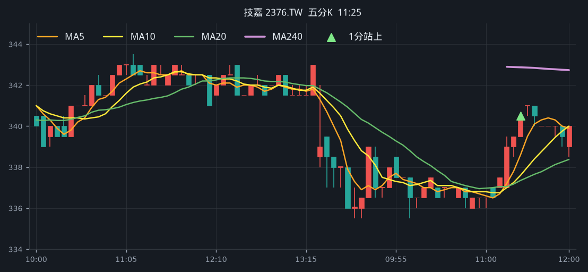

## 59. 保瑞 [6472.TW](https://tw.stock.yahoo.com/quote/6472.TW)

- 價格 453.00 -0.44%　成交額排名 #157　9.40 億
- 1分站上 10:18　收 454.50 > MA240 453.99
- 1分 MA5 452.50 > MA10 451.05 > MA20 450.32
- 五分收盤 / MA240（對照）　456.00 > 437.23（+4.3%）

**一分 K**

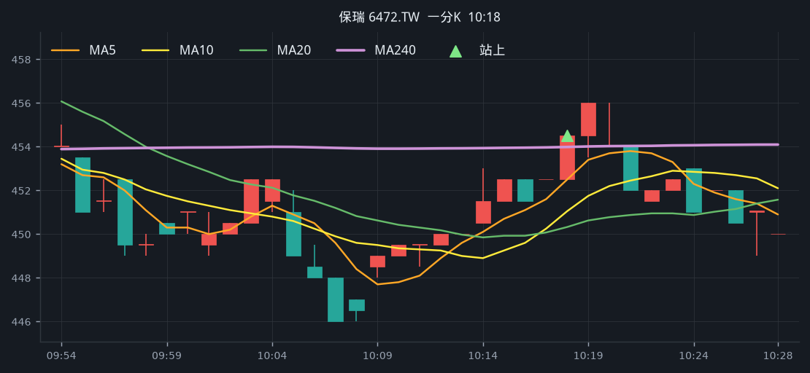

**五分 K（對照）**

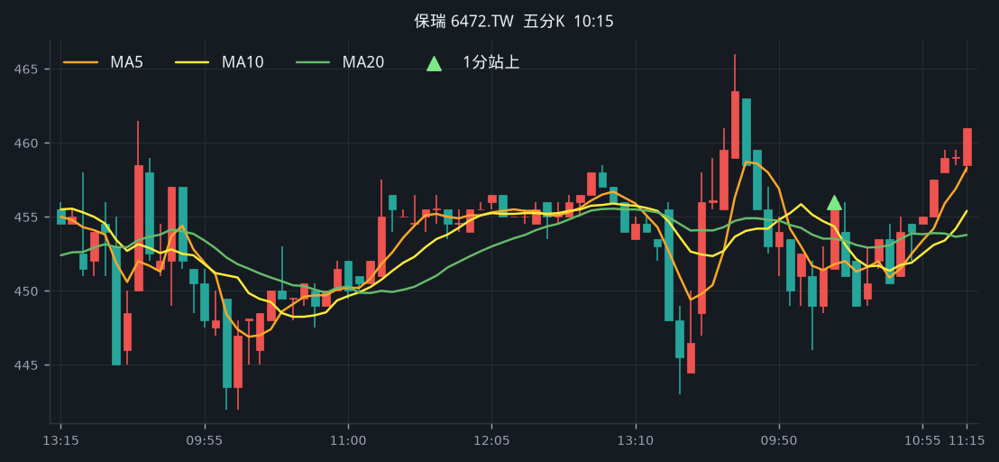

## 60. 長榮航 [2618.TW](https://tw.stock.yahoo.com/quote/2618.TW)

- 價格 42.65 +0.12%　成交額排名 #161　8.72 億
- 1分站上 09:43　收 42.75 > MA240 42.74
- 1分 MA5 42.63 > MA10 42.59 > MA20 42.54
- 五分收盤 / MA240（對照）　42.70 > 42.14（+1.3%）

**一分 K**

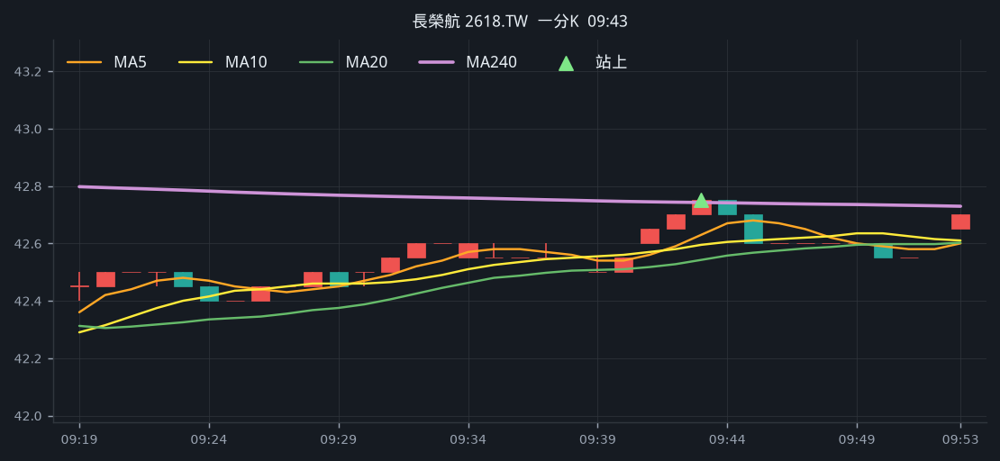

**五分 K（對照）**

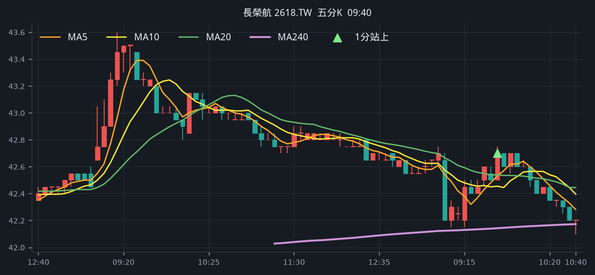

## 61. 希華 [2484.TW](https://tw.stock.yahoo.com/quote/2484.TW)

- 價格 72.10 +0.00%　成交額排名 #170　8.04 億
- 1分站上 10:35　收 72.40 > MA240 72.35
- 1分 MA5 71.70 > MA10 71.35 > MA20 70.96
- 五分收盤 / MA240（對照）　71.90 > 73.54（-2.2%）

**一分 K**

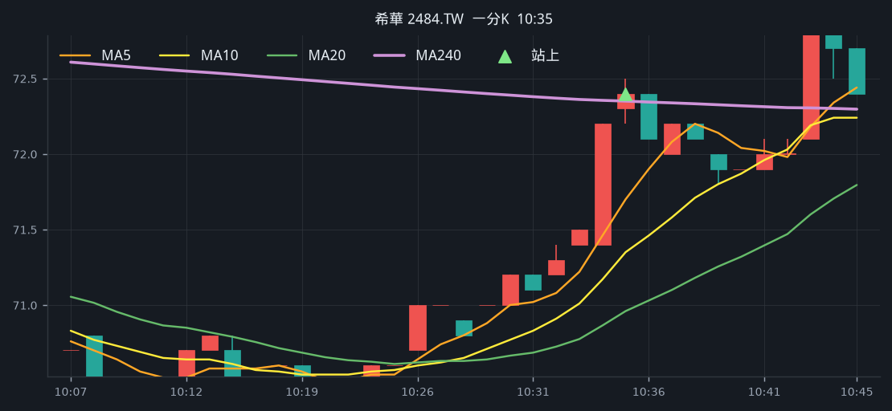

**五分 K（對照）**

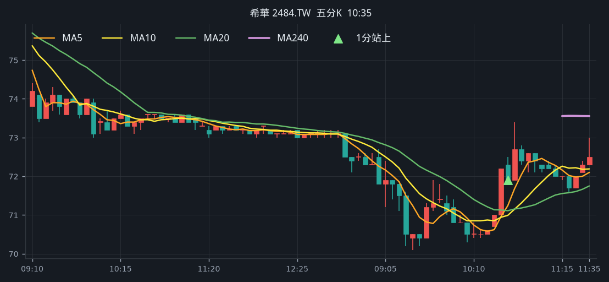

## 62. 遠東新 [1402.TW](https://tw.stock.yahoo.com/quote/1402.TW)

- 價格 29.45 -2.97%　成交額排名 #173　7.78 億
- 1分站上 09:48　收 29.45 > MA240 29.45
- 1分 MA5 29.45 > MA10 29.40 > MA20 29.34
- 五分收盤 / MA240（對照）　29.45 > 29.01（+1.5%）

**一分 K**

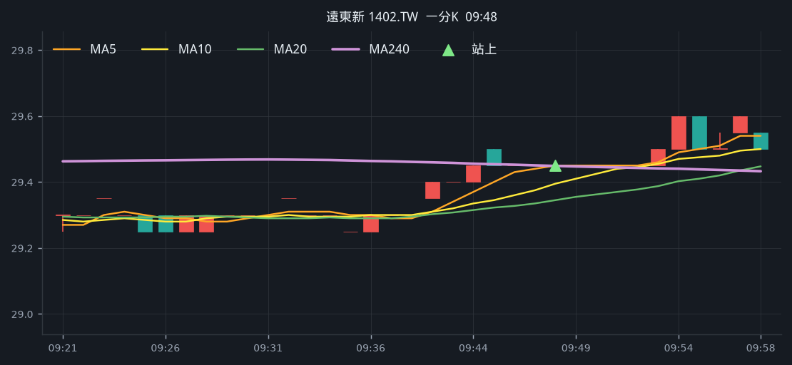

**五分 K（對照）**

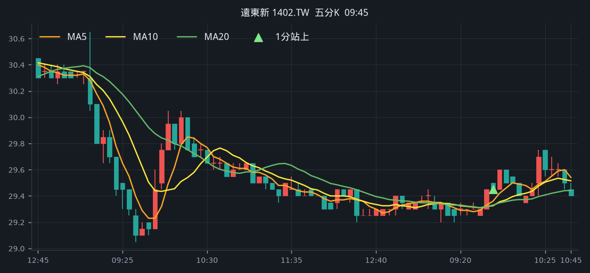

## 63. 騰輝電子-KY [6672.TW](https://tw.stock.yahoo.com/quote/6672.TW)

- 價格 259.00 -3.18%　成交額排名 #176　7.60 億
- 1分站上 09:17　收 261.50 > MA240 261.36
- 1分 MA5 259.80 > MA10 258.80 > MA20 257.93
- 五分收盤 / MA240（對照）　260.00 > 279.02（-6.8%）

**一分 K**

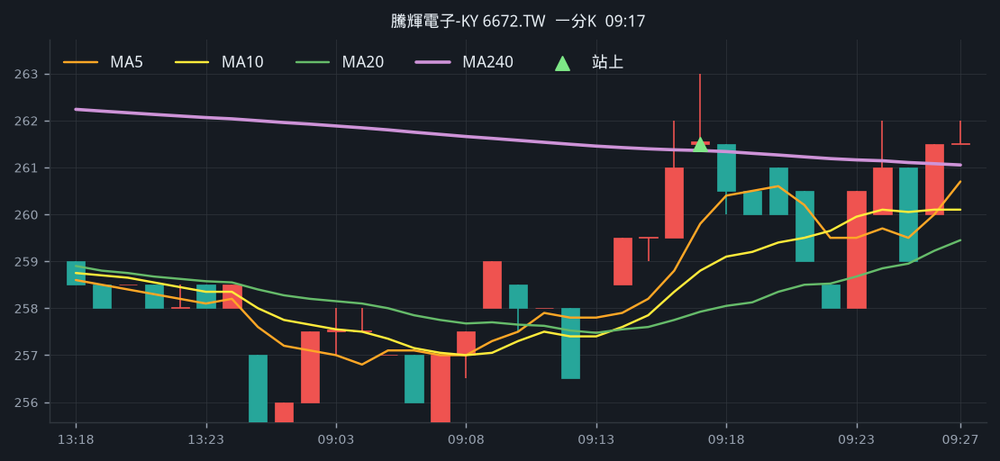

**五分 K（對照）**

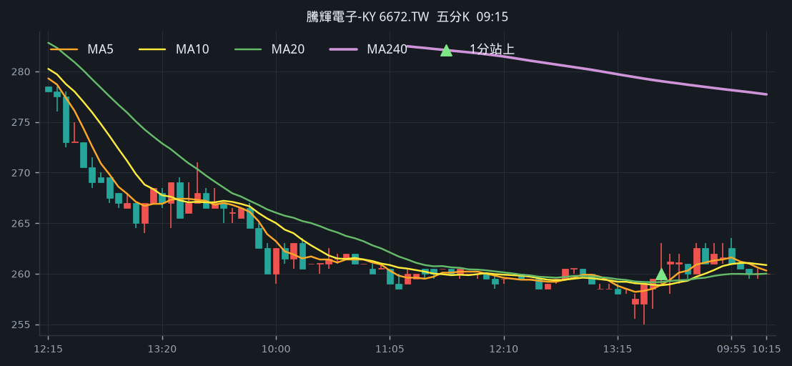

## 64. 和益 [1709.TW](https://tw.stock.yahoo.com/quote/1709.TW)

- 價格 34.65 +4.05%　成交額排名 #180　7.22 億
- 1分站上 11:28　收 34.15 > MA240 34.01
- 1分 MA5 33.89 > MA10 33.82 > MA20 33.60
- 五分收盤 / MA240（對照）　34.25 > 33.07（+3.6%）

**一分 K**

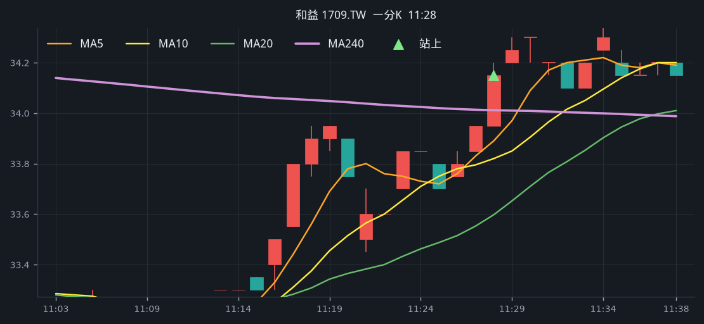

**五分 K（對照）**

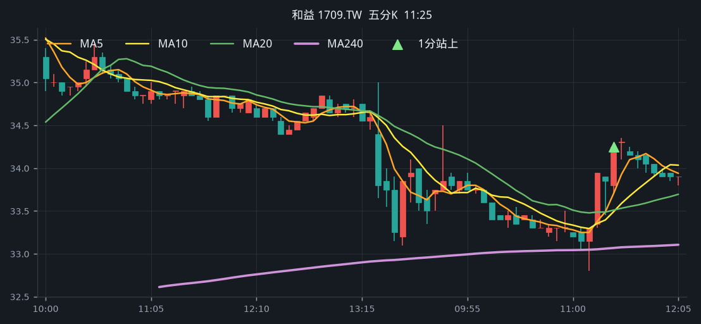

## 65. 富采 [3714.TW](https://tw.stock.yahoo.com/quote/3714.TW)

- 價格 57.20 -0.17%　成交額排名 #181　7.15 億
- 1分站上 12:04　收 57.20 > MA240 57.20
- 1分 MA5 57.14 > MA10 57.03 > MA20 56.99
- 五分收盤 / MA240（對照）　57.20 > 57.09（+0.2%）

**一分 K**

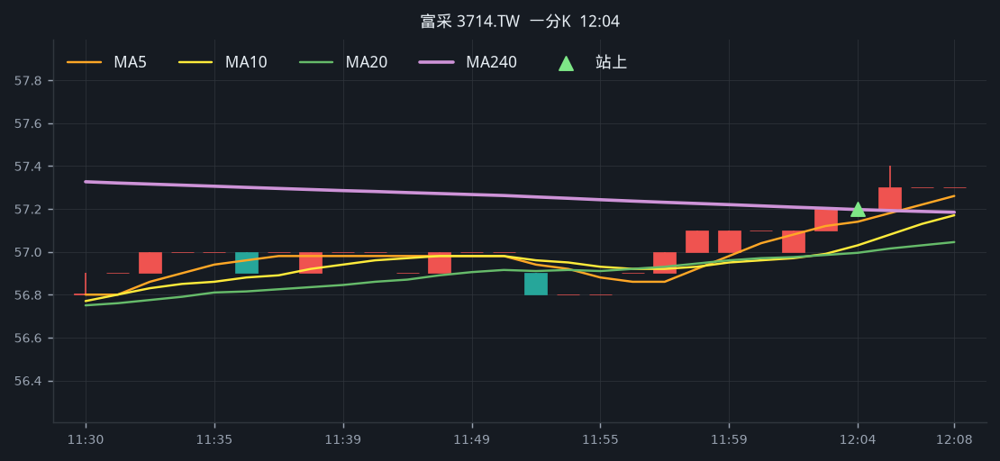

**五分 K（對照）**

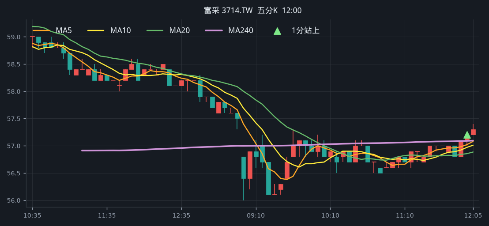

## 66. 元太 [8069.TWO](https://tw.stock.yahoo.com/quote/8069.TWO)

- 價格 158.50 -1.25%　成交額排名 #187　6.56 億
- 1分站上 11:30　收 158.00 > MA240 157.95
- 1分 MA5 157.60 > MA10 157.55 > MA20 157.53
- 五分收盤 / MA240（對照）　158.00 > 159.98（-1.2%）

**一分 K**

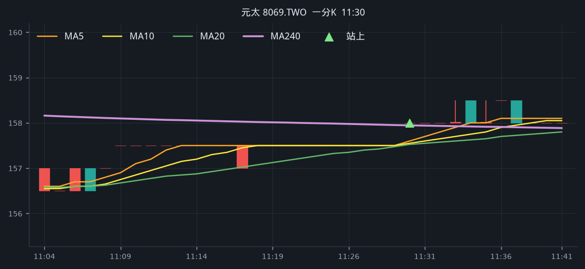

**五分 K（對照）**

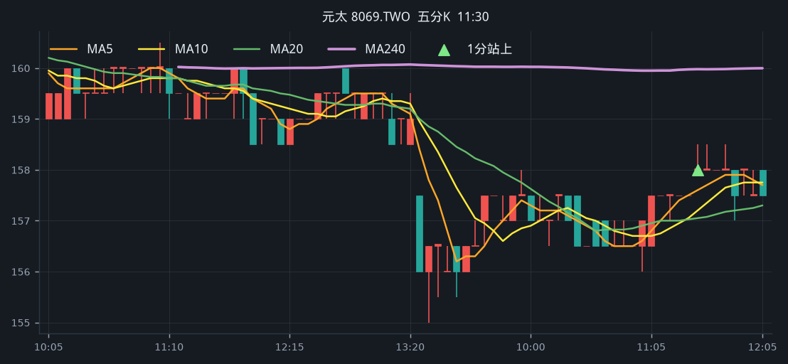

## 67. 立碁 [8111.TWO](https://tw.stock.yahoo.com/quote/8111.TWO)

- 價格 63.10 -2.92%　成交額排名 #189　6.52 億
- 1分站上 09:45　收 64.80 > MA240 63.97
- 1分 MA5 64.22 > MA10 64.00 > MA20 63.37
- 五分收盤 / MA240（對照）　66.00 > 59.92（+10.1%）

**一分 K**

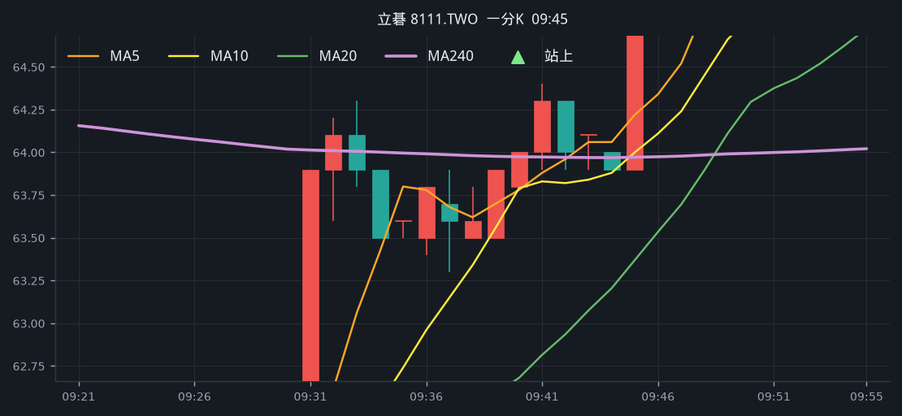

**五分 K（對照）**

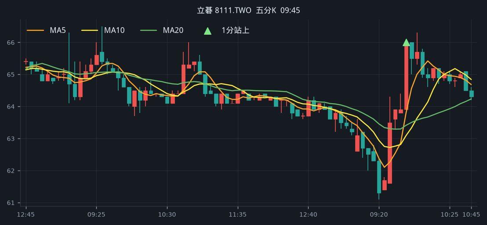

## 68. 瀚荃 [8103.TW](https://tw.stock.yahoo.com/quote/8103.TW)

- 價格 97.20 +3.40%　成交額排名 #193　6.29 億
- 1分站上 10:40　收 98.90 > MA240 98.83
- 1分 MA5 98.68 > MA10 98.57 > MA20 98.51
- 五分收盤 / MA240（對照）　98.40 > 91.53（+7.5%）

**一分 K**

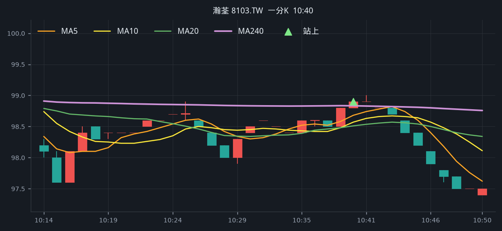

**五分 K（對照）**

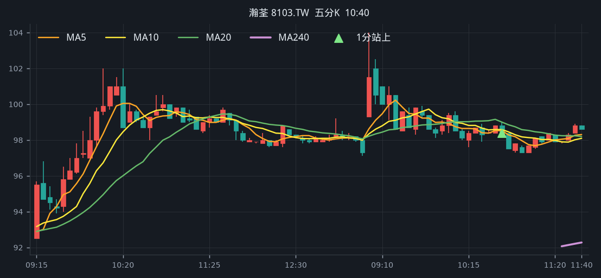

## 69. 華航 [2610.TW](https://tw.stock.yahoo.com/quote/2610.TW)

- 價格 20.50 +0.49%　成交額排名 #194　6.09 億
- 1分站上 09:53　收 20.55 > MA240 20.54
- 1分 MA5 20.50 > MA10 20.48 > MA20 20.46
- 五分收盤 / MA240（對照）　20.55 > 20.19（+1.8%）

**一分 K**

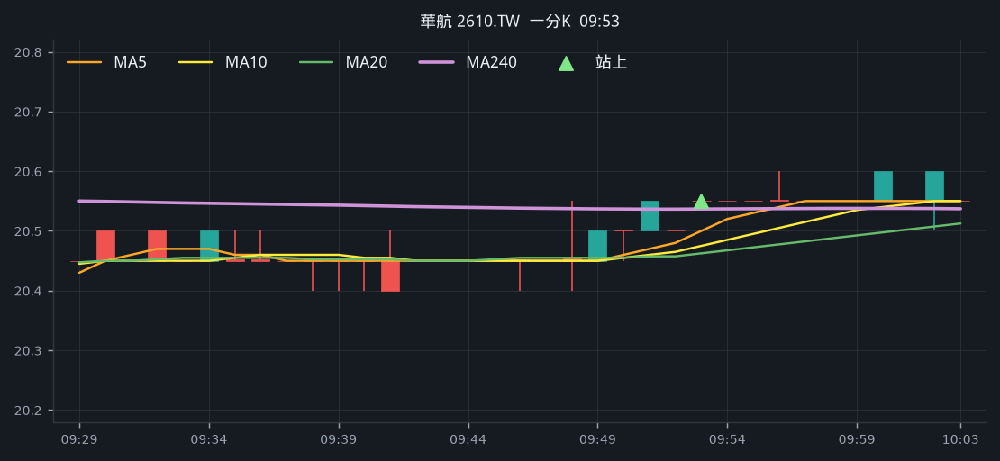

**五分 K（對照）**

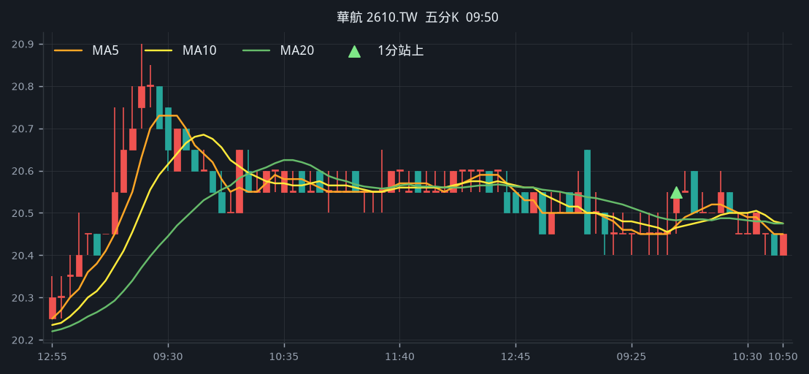

## 70. TPK-KY [3673.TW](https://tw.stock.yahoo.com/quote/3673.TW)

- 價格 63.10 -0.32%　成交額排名 #195　5.99 億
- 1分站上 10:33　收 63.50 > MA240 63.23
- 1分 MA5 63.18 > MA10 63.06 > MA20 62.80
- 五分收盤 / MA240（對照）　63.80 > 62.52（+2.1%）

**一分 K**

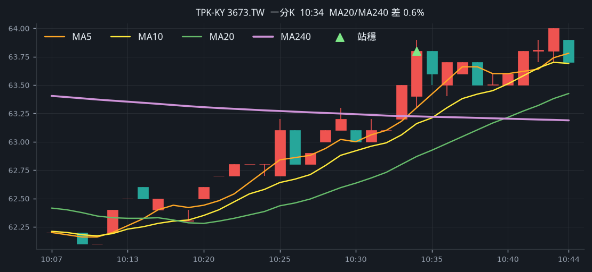

**五分 K（對照）**

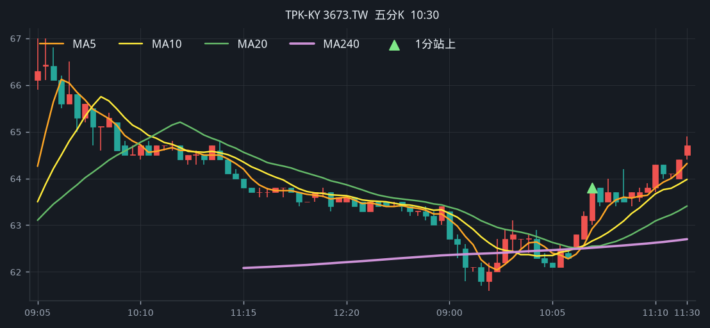

## 71. 彩晶 [6116.TW](https://tw.stock.yahoo.com/quote/6116.TW)

- 價格 14.20 +2.90%　成交額排名 #200　5.47 億
- 1分站上 12:07　收 14.05 > MA240 14.04
- 1分 MA5 14.01 > MA10 13.98 > MA20 13.97
- 五分收盤 / MA240（對照）　14.00 > 14.06（-0.4%）

**一分 K**

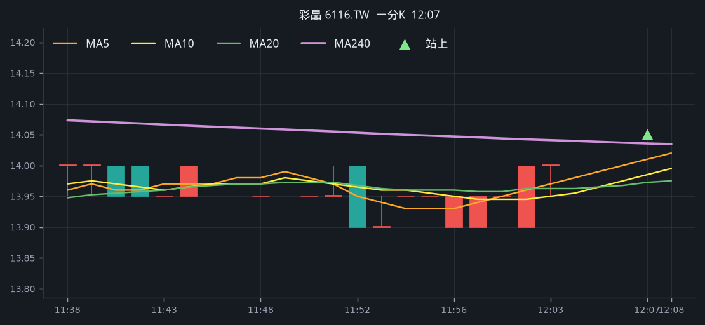

**五分 K（對照）**

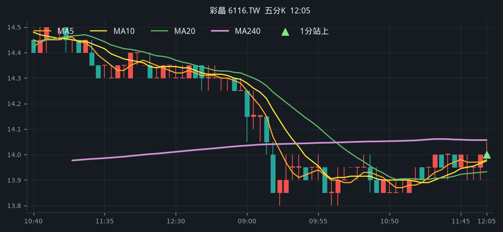

