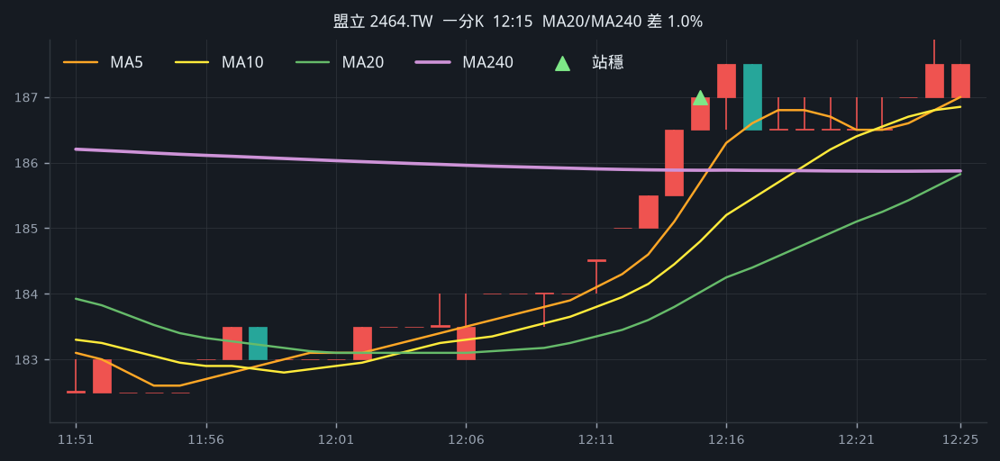
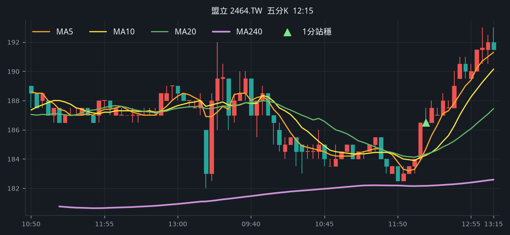
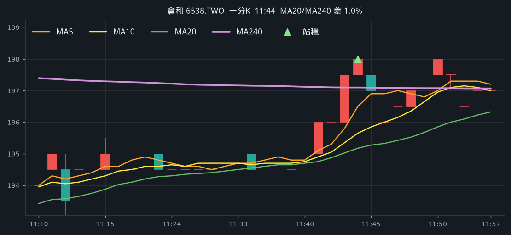
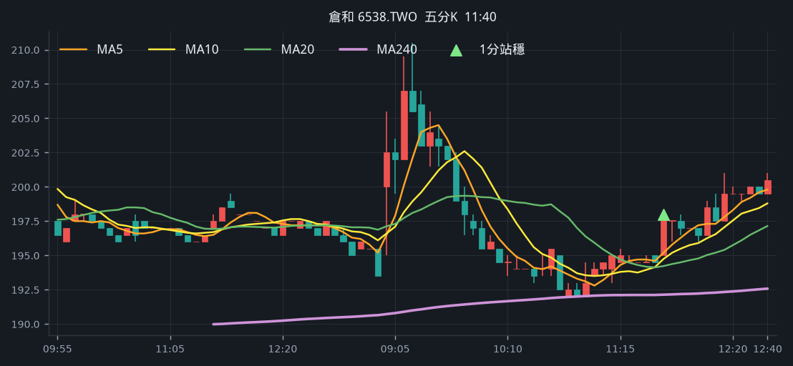
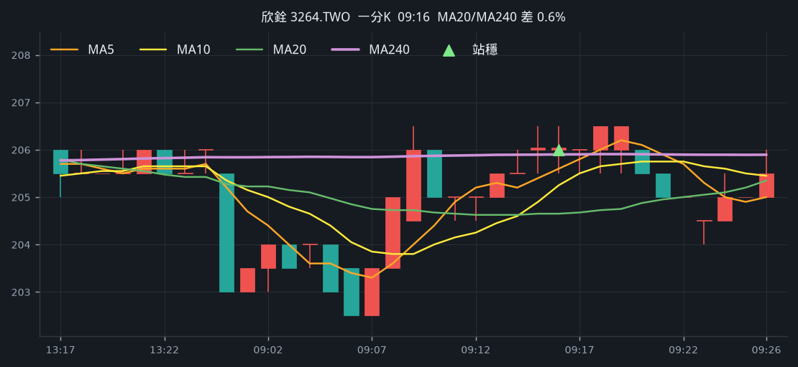
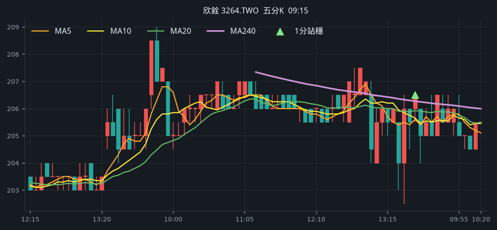
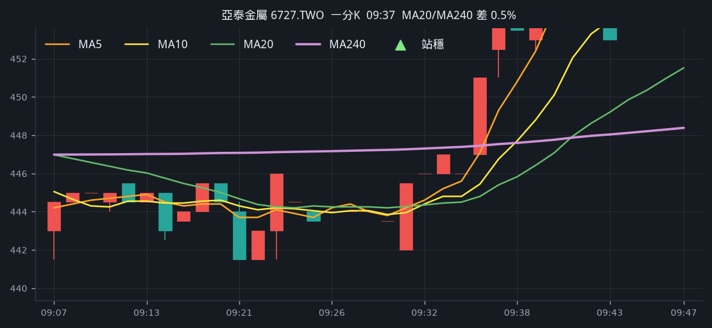
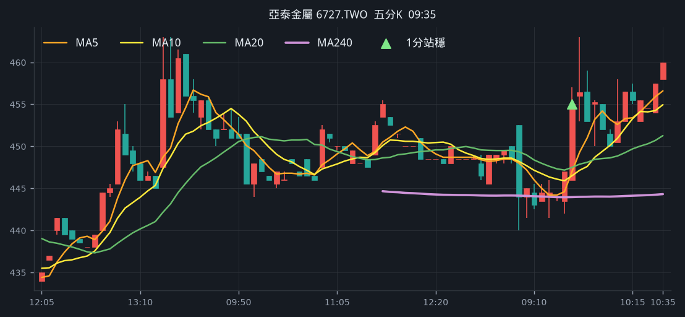

# 回測 2026-08-25（週二）· 一分K站穩 MA240

用 2026-08-25（週二）當天上市＋上櫃成交額前 200（盤後），濾掉 ETF、金融股與收盤價 650 以上。一分K MA5>MA10>MA20 且拉開（MA5−MA20 ≥ 0.4%），MA20 與 MA240 差距 0.4%～1.0%，從 240 下面穿上、連續兩根收盤站穩，時間 09:10 以後（開盤跳空不算）；含該根的五分K收盤也必須高於五分 MA240。

- 命中 **10** 檔
- 掃描時間 2026-08-25 15:26:52（台北）
- 排行 2026-08-25 盤後成交額
- 前 200 → 濾掉股價 54、ETF 18、金融 14 → 掃描 114 → 均線糾結 0 → MA20/MA240不符 0 → 五分MA240底下 10

## 1. 光寶科 [2301.TW](https://tw.stock.yahoo.com/quote/2301.TW)

- 價格 296.00 +3.14%　成交額排名 #3　212.35 億
- 1分站穩 11:33　收 287.00 > MA240 284.85
- 1分 MA5 284.80 > MA10 283.70 > MA20 282.98　MA20/MA240 差 0.7%
- 五分收盤 / MA240　286.00 > 274.29（+4.3%）

**一分 K**

**五分 K（對照）**

## 2. 鼎元 [2426.TW](https://tw.stock.yahoo.com/quote/2426.TW)

- 價格 90.80 +9.93%　成交額排名 #49　51.83 億
- 1分站穩 10:36　收 84.50 > MA240 83.48
- 1分 MA5 83.72 > MA10 83.31 > MA20 82.96　MA20/MA240 差 0.6%
- 五分收盤 / MA240　84.30 > 77.60（+8.6%）

**一分 K**

**五分 K（對照）**

## 3. 富喬 [1815.TWO](https://tw.stock.yahoo.com/quote/1815.TWO)

- 價格 109.00 +1.40%　成交額排名 #60　38.71 億
- 1分站穩 11:34　收 106.00 > MA240 105.82
- 1分 MA5 105.50 > MA10 105.00 > MA20 104.78　MA20/MA240 差 1.0%
- 五分收盤 / MA240　106.00 > 105.26（+0.7%）

**一分 K**

**五分 K（對照）**

## 4. 聯一光 [3441.TWO](https://tw.stock.yahoo.com/quote/3441.TWO)

- 價格 114.00 +1.33%　成交額排名 #71　30.40 億
- 1分站穩 11:37　收 111.50 > MA240 111.03
- 1分 MA5 111.10 > MA10 110.75 > MA20 110.35　MA20/MA240 差 0.6%
- 五分收盤 / MA240　110.00 > 100.56（+9.4%）

**一分 K**

**五分 K（對照）**

## 5. 盟立 [2464.TW](https://tw.stock.yahoo.com/quote/2464.TW)

- 價格 193.00 +2.93%　成交額排名 #80　26.67 億
- 1分站穩 12:15　收 187.00 > MA240 185.88
- 1分 MA5 185.70 > MA10 184.80 > MA20 184.03　MA20/MA240 差 1.0%
- 五分收盤 / MA240　186.50 > 182.16（+2.4%）

**一分 K**

**五分 K（對照）**

## 6. 保瑞 [6472.TW](https://tw.stock.yahoo.com/quote/6472.TW)

- 價格 470.00 +3.75%　成交額排名 #113　15.11 億
- 1分站穩 10:19　收 456.00 > MA240 454.01
- 1分 MA5 453.40 > MA10 451.75 > MA20 450.62　MA20/MA240 差 0.7%
- 五分收盤 / MA240　456.00 > 437.23（+4.3%）

**一分 K**

**五分 K（對照）**

## 7. 倉和 [6538.TWO](https://tw.stock.yahoo.com/quote/6538.TWO)

- 價格 205.50 +6.48%　成交額排名 #144　10.67 億
- 1分站穩 11:44　收 198.00 > MA240 197.10
- 1分 MA5 196.50 > MA10 195.65 > MA20 195.18　MA20/MA240 差 1.0%
- 五分收盤 / MA240　198.00 > 192.14（+3.1%）

**一分 K**

**五分 K（對照）**

## 8. 永擎 [7711.TW](https://tw.stock.yahoo.com/quote/7711.TW)

- 價格 515.00 +3.52%　成交額排名 #165　8.43 億
- 1分站穩 10:34　收 495.00 > MA240 494.18
- 1分 MA5 494.30 > MA10 494.15 > MA20 491.70　MA20/MA240 差 0.5%
- 五分收盤 / MA240　495.00 > 476.86（+3.8%）

**一分 K**

**五分 K（對照）**

## 9. 欣銓 [3264.TWO](https://tw.stock.yahoo.com/quote/3264.TWO)

- 價格 213.00 +3.65%　成交額排名 #168　8.19 億
- 1分站穩 09:16　收 206.00 > MA240 205.90
- 1分 MA5 205.60 > MA10 205.25 > MA20 204.65　MA20/MA240 差 0.6%
- 五分收盤 / MA240　206.50 > 206.27（+0.1%）

**一分 K**

**五分 K（對照）**

## 10. 亞泰金屬 [6727.TWO](https://tw.stock.yahoo.com/quote/6727.TWO)

- 價格 470.50 +5.73%　成交額排名 #182　6.76 億
- 1分站穩 09:37　收 456.50 > MA240 447.53
- 1分 MA5 449.30 > MA10 446.75 > MA20 445.40　MA20/MA240 差 0.5%
- 五分收盤 / MA240　455.00 > 443.96（+2.5%）

**一分 K**

**五分 K（對照）**

