# 回測 2026-08-27（週四）· 一分K站穩 MA240

用 2026-08-27（週四）當天上市＋上櫃成交額前 200（盤後），濾掉 ETF、金融股與收盤價 650 以上。一分K MA5>MA10>MA20 且拉開（MA5−MA20 ≥ 0.4%），MA20 與 MA240 差距 0.4%～1.0%，從 240 下面穿上、連續兩根收盤站穩，時間 09:10 以後（開盤跳空不算）；含該根的五分K收盤也必須高於五分 MA240。

- 命中 **10** 檔
- 掃描時間 2026-08-28 06:46:57（台北）
- 排行 2026-08-27 盤後成交額
- 前 200 → 濾掉股價 57、ETF 14、金融 9 → 掃描 120 → 均線糾結 0 → MA20/MA240不符 0 → 五分MA240底下 0

## 1. 聯茂 [6213.TW](https://tw.stock.yahoo.com/quote/6213.TW)

- 價格 563.00 -3.43%　成交額排名 #11　207.81 億
- 1分站穩 09:36　收 583.00 > MA240 579.48
- 1分 MA5 579.80 > MA10 578.30 > MA20 576.75　MA20/MA240 差 0.5%
- 五分收盤 / MA240　580.00 > 523.92（+10.7%）

**一分 K**

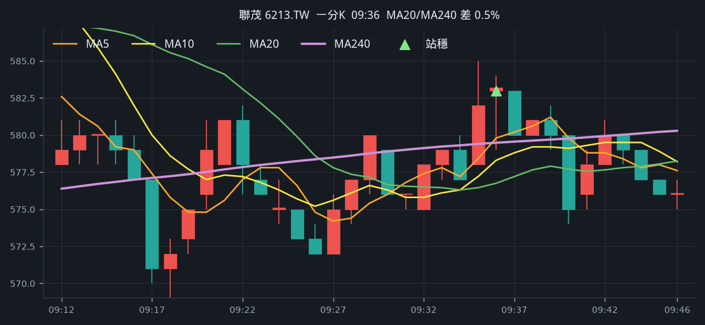

**五分 K（對照）**

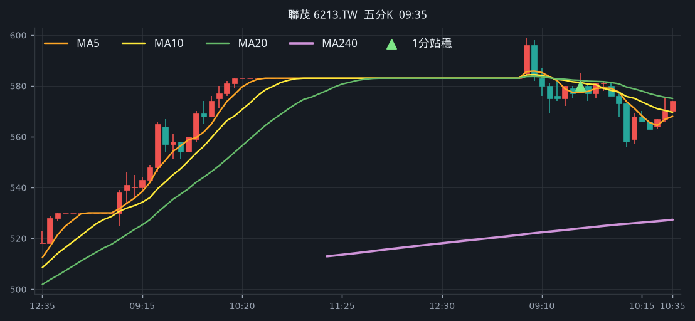

## 2. 金居 [8358.TWO](https://tw.stock.yahoo.com/quote/8358.TWO)

- 價格 494.00 +9.90%　成交額排名 #17　174.64 億
- 1分站穩 12:36　收 453.50 > MA240 453.37
- 1分 MA5 453.10 > MA10 451.75 > MA20 449.48　MA20/MA240 差 0.9%
- 五分收盤 / MA240　455.50 > 431.50（+5.6%）

**一分 K**

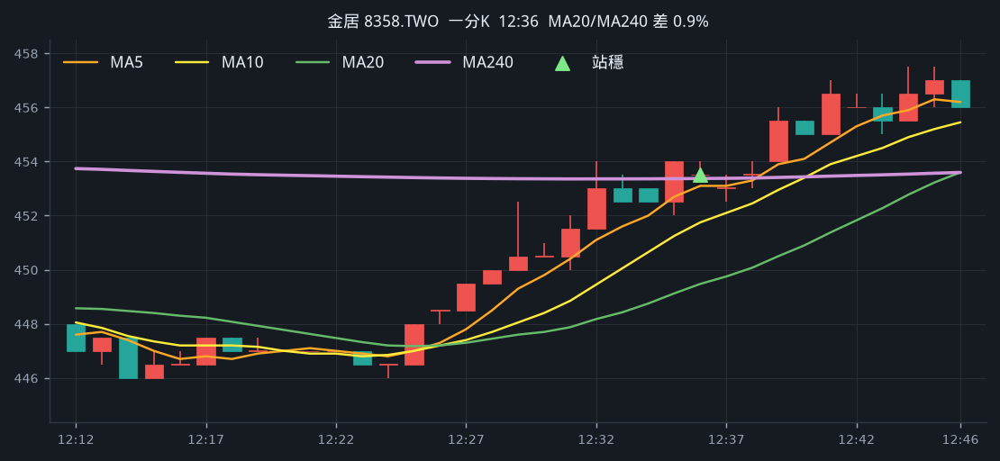

**五分 K（對照）**

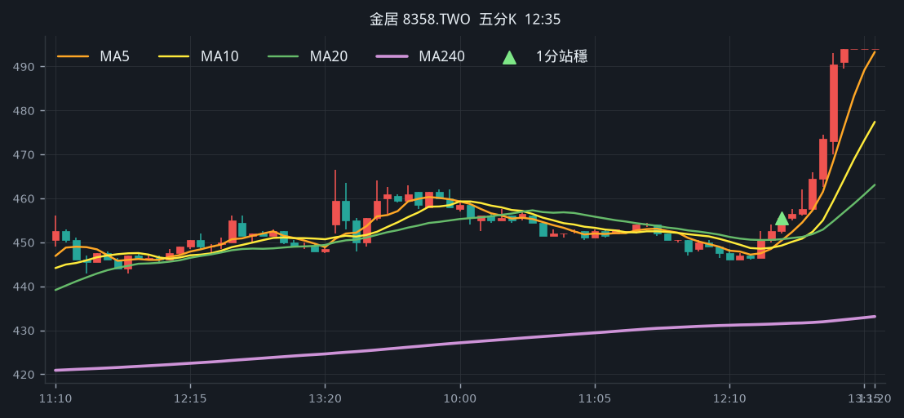

## 3. 富喬 [1815.TWO](https://tw.stock.yahoo.com/quote/1815.TWO)

- 價格 116.50 -1.27%　成交額排名 #35　87.49 億
- 1分站穩 09:37　收 118.00 > MA240 117.70
- 1分 MA5 117.70 > MA10 117.35 > MA20 117.12　MA20/MA240 差 0.5%
- 五分收盤 / MA240　118.00 > 110.44（+6.8%）

**一分 K**

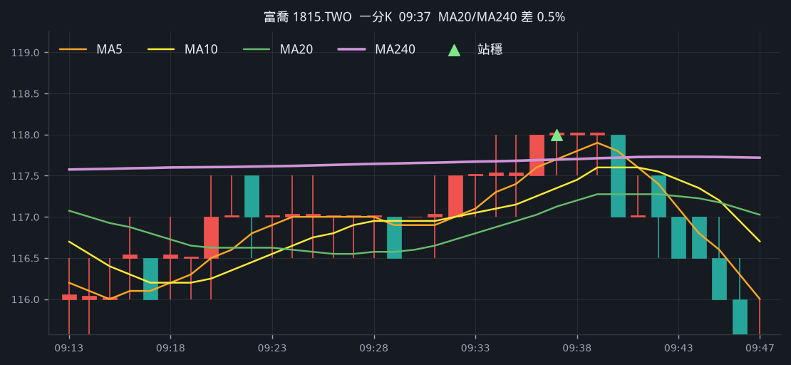

**五分 K（對照）**

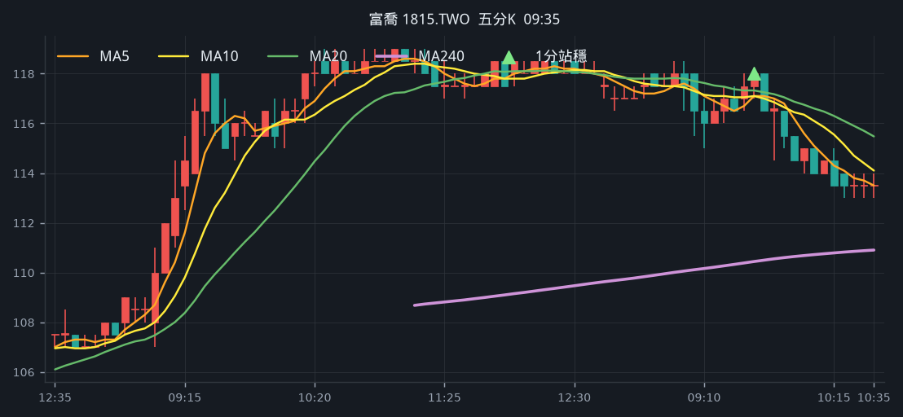

## 4. 合晶 [6182.TWO](https://tw.stock.yahoo.com/quote/6182.TWO)

- 價格 109.00 +1.87%　成交額排名 #69　44.55 億
- 1分站穩 09:33　收 109.00 > MA240 107.59
- 1分 MA5 107.90 > MA10 107.65 > MA20 107.15　MA20/MA240 差 0.4%
- 五分收盤 / MA240　109.50 > 108.13（+1.3%）

**一分 K**

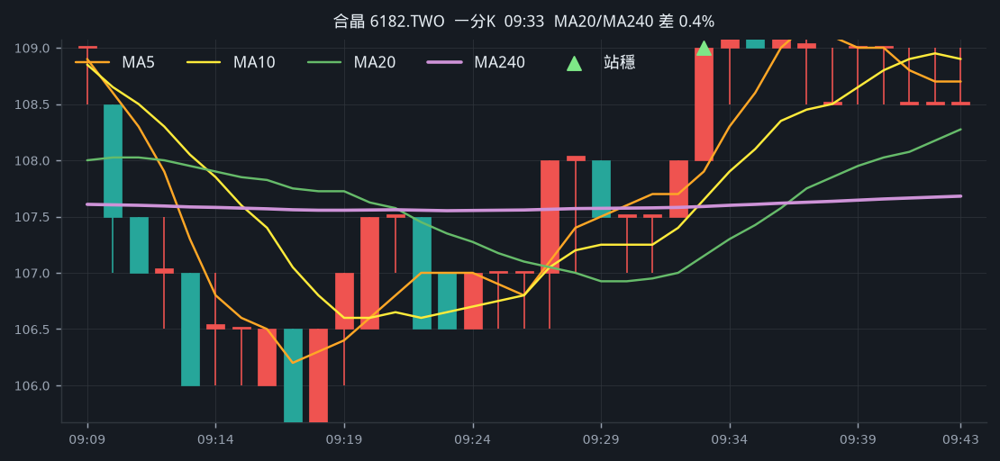

**五分 K（對照）**

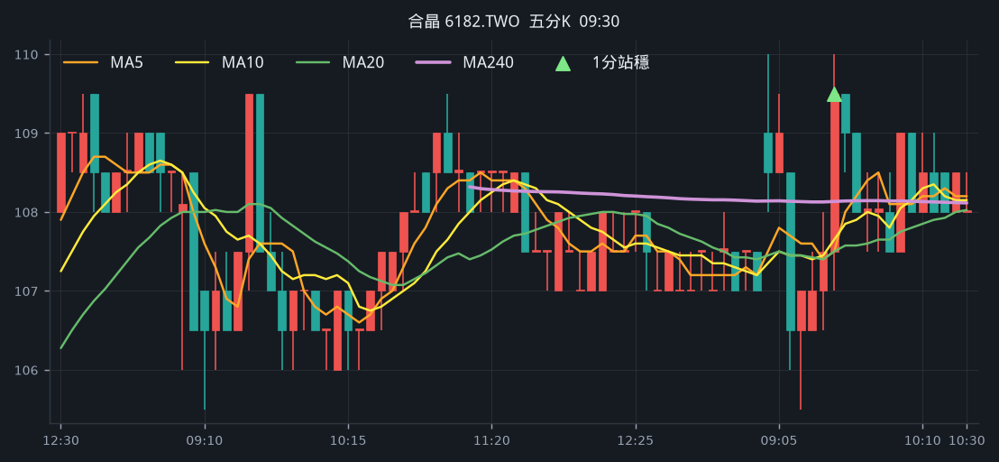

## 5. 尖點 [8021.TW](https://tw.stock.yahoo.com/quote/8021.TW)

- 價格 422.50 +0.96%　成交額排名 #107　21.56 億
- 1分站穩 13:03　收 421.00 > MA240 420.16
- 1分 MA5 420.20 > MA10 419.00 > MA20 418.40　MA20/MA240 差 0.4%
- 五分收盤 / MA240　421.50 > 405.32（+4.0%）

**一分 K**

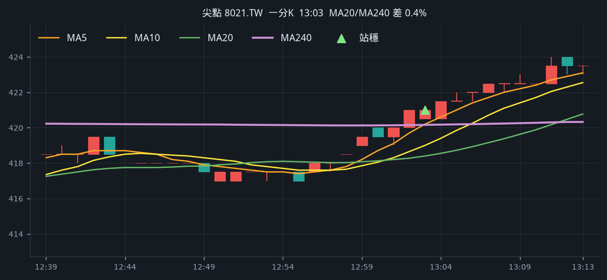

**五分 K（對照）**

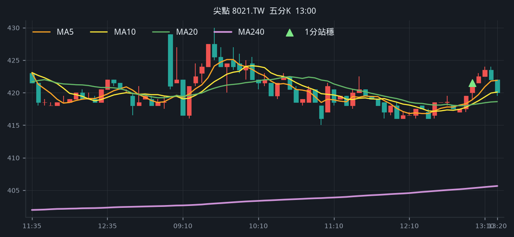

## 6. 中美晶 [5483.TWO](https://tw.stock.yahoo.com/quote/5483.TWO)

- 價格 182.00 +1.11%　成交額排名 #110　20.95 億
- 1分站穩 09:28　收 181.00 > MA240 180.16
- 1分 MA5 180.10 > MA10 179.70 > MA20 179.22　MA20/MA240 差 0.5%
- 五分收盤 / MA240　180.50 > 179.77（+0.4%）

**一分 K**

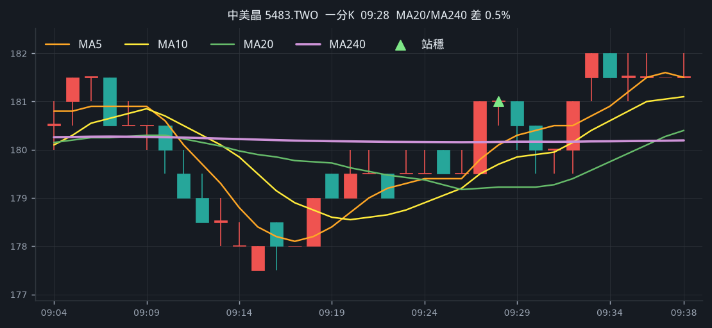

**五分 K（對照）**

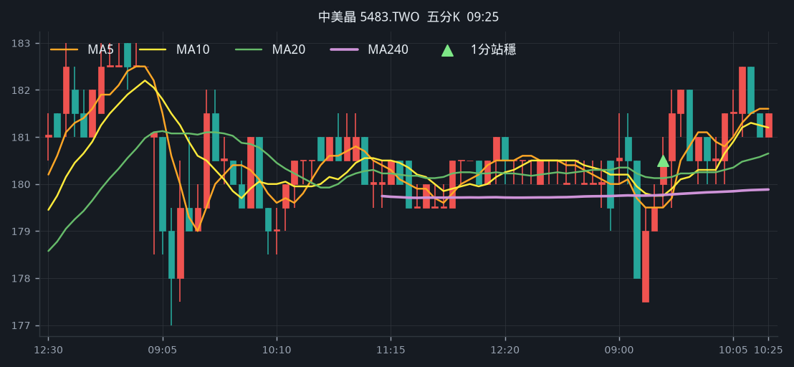

## 7. 汎銓 [6830.TW](https://tw.stock.yahoo.com/quote/6830.TW)

- 價格 530.00 +0.76%　成交額排名 #122　18.40 億
- 1分站穩 13:11　收 529.00 > MA240 527.01
- 1分 MA5 527.40 > MA10 526.30 > MA20 524.25　MA20/MA240 差 0.5%
- 五分收盤 / MA240　529.00 > 491.69（+7.6%）

**一分 K**

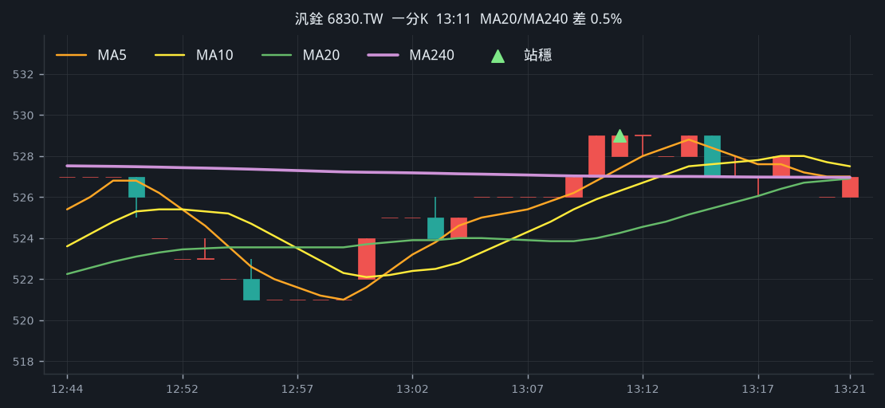

**五分 K（對照）**

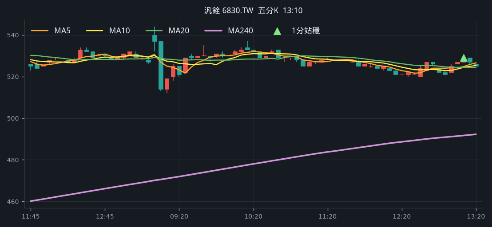

## 8. 世界 [5347.TWO](https://tw.stock.yahoo.com/quote/5347.TWO)

- 價格 151.00 -0.66%　成交額排名 #132　16.29 億
- 1分站穩 10:53　收 152.00 > MA240 151.83
- 1分 MA5 151.70 > MA10 151.40 > MA20 151.07　MA20/MA240 差 0.5%
- 五分收盤 / MA240　151.50 > 151.25（+0.2%）

**一分 K**

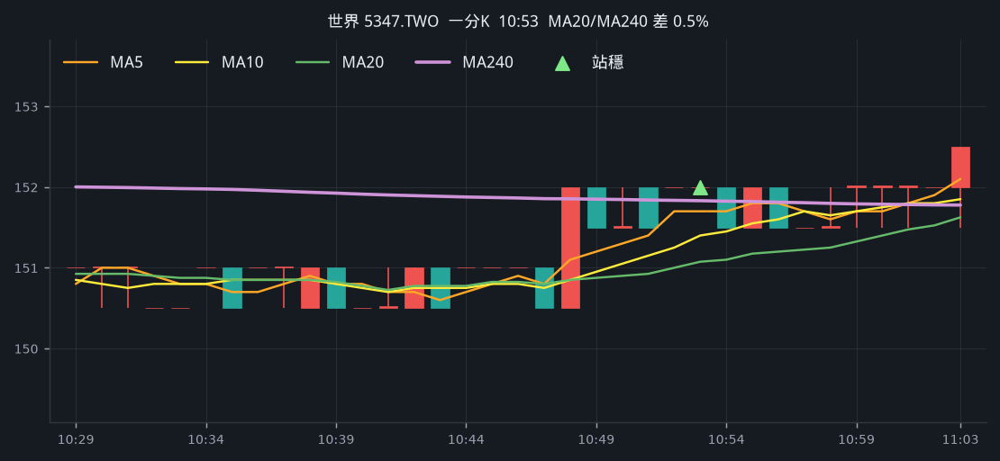

**五分 K（對照）**

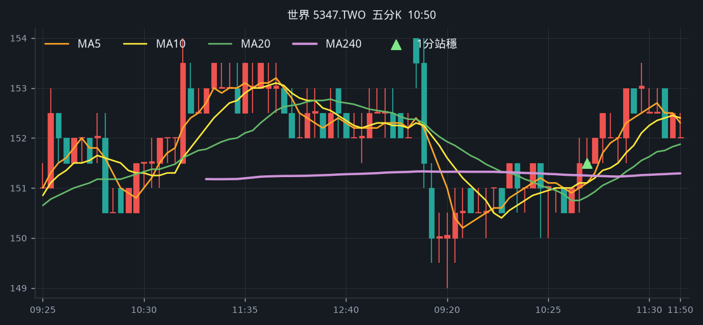

## 9. 欣銓 [3264.TWO](https://tw.stock.yahoo.com/quote/3264.TWO)

- 價格 219.50 +0.92%　成交額排名 #154　13.33 億
- 1分站穩 10:03　收 218.00 > MA240 217.82
- 1分 MA5 217.60 > MA10 217.25 > MA20 216.62　MA20/MA240 差 0.5%
- 五分收盤 / MA240　218.50 > 208.91（+4.6%）

**一分 K**

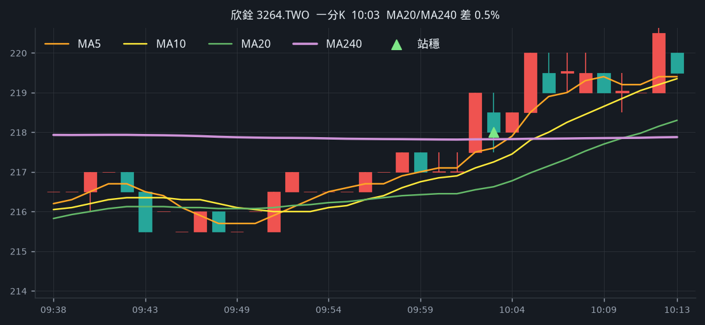

**五分 K（對照）**

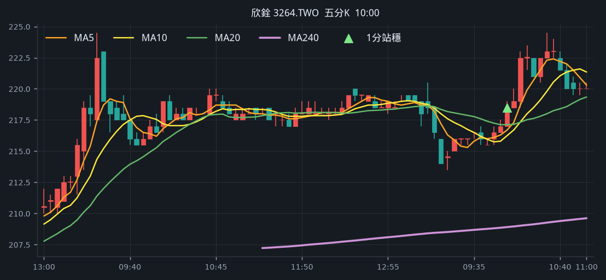

## 10. 富采 [3714.TW](https://tw.stock.yahoo.com/quote/3714.TW)

- 價格 63.50 +1.28%　成交額排名 #185　9.58 億
- 1分站穩 09:38　收 62.90 > MA240 62.63
- 1分 MA5 62.66 > MA10 62.50 > MA20 62.24　MA20/MA240 差 0.6%
- 五分收盤 / MA240　63.00 > 58.95（+6.9%）

**一分 K**

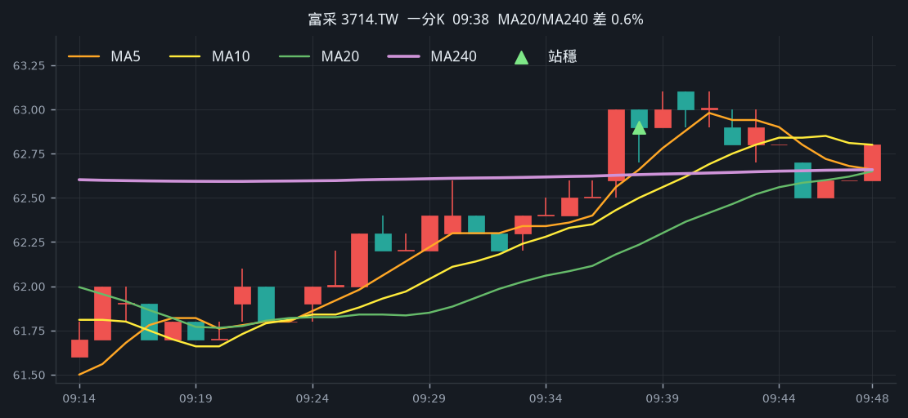

**五分 K（對照）**

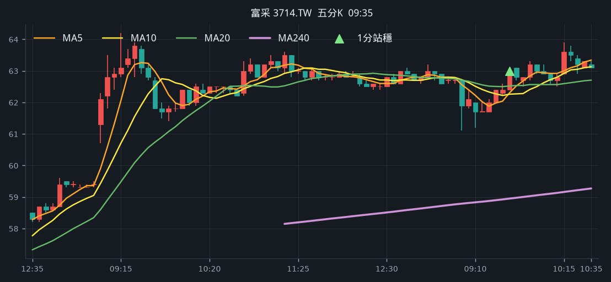

