# 回測 2026-08-31（週一）· 一分K站穩 MA240

用 2026-08-31（週一）當天上市＋上櫃成交額前 200（盤後），濾掉 ETF、金融股與收盤價 650 以上。一分K MA5>MA10>MA20 且拉開（MA5−MA20 ≥ 0.4%），MA20 與 MA240 差距 0.4%～1.0%，從 240 下面穿上、連續兩根收盤站穩，時間 09:10 以後（開盤跳空不算）；含該根的五分K收盤也必須高於五分 MA240。

- 命中 **9** 檔
- 掃描時間 2026-09-06 15:53:16（台北）
- 排行 2026-08-31 盤後成交額
- 前 200 → 濾掉股價 55、ETF 16、金融 15 → 掃描 114 → 均線糾結 0 → MA20/MA240不符 0 → 五分MA240底下 4

## 1. 穩懋 [3105.TWO](https://tw.stock.yahoo.com/quote/3105.TWO)

- 價格 447.50 +1.94%　成交額排名 #15　227.63 億
- 1分站穩 12:03　收 439.50 > MA240 439.44
- 1分 MA5 438.90 > MA10 437.25 > MA20 435.70　MA20/MA240 差 0.8%
- 五分收盤 / MA240　439.50 > 418.79（+4.9%）

**一分 K**

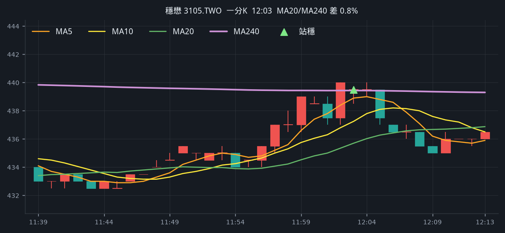

**五分 K（對照）**

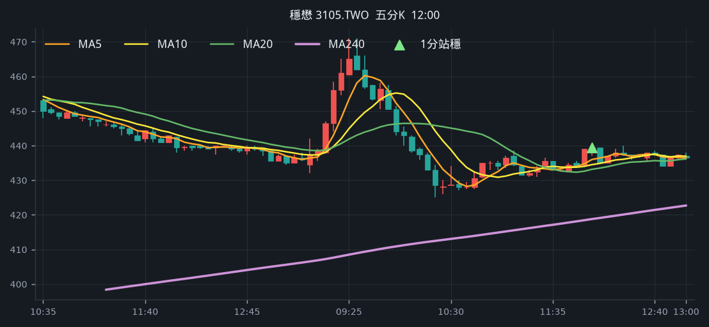

## 2. 華新科 [2492.TW](https://tw.stock.yahoo.com/quote/2492.TW)

- 價格 295.00 -5.90%　成交額排名 #17　172.94 億
- 1分站穩 13:08　收 294.00 > MA240 293.42
- 1分 MA5 293.30 > MA10 292.45 > MA20 290.85　MA20/MA240 差 0.9%
- 五分收盤 / MA240　294.00 > 283.03（+3.9%）

**一分 K**

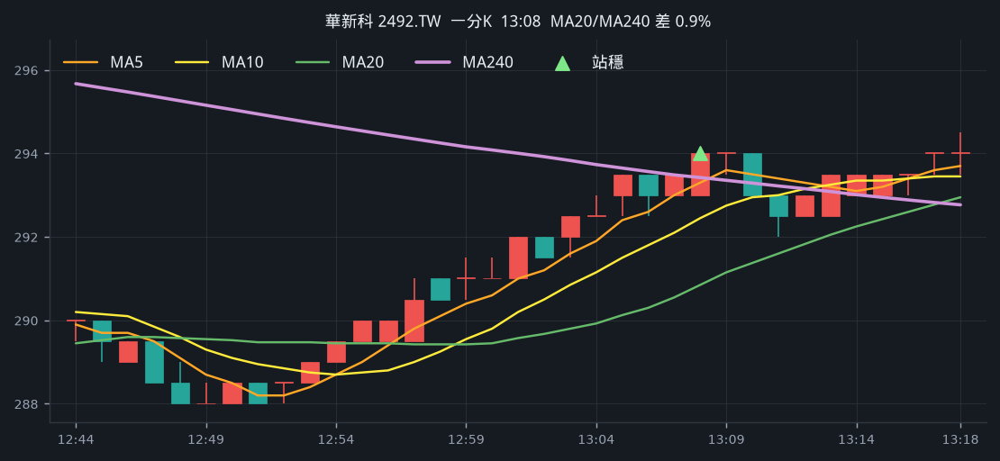

**五分 K（對照）**

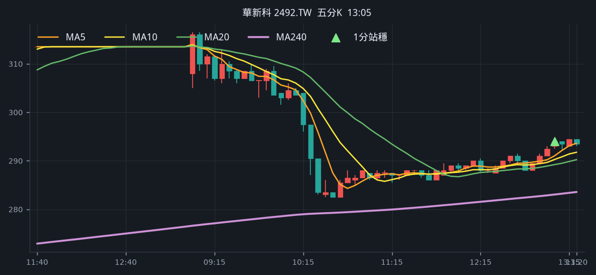

## 3. 廣達 [2382.TW](https://tw.stock.yahoo.com/quote/2382.TW)

- 價格 338.50 +1.80%　成交額排名 #64　61.17 億
- 1分站穩 09:39　收 332.00 > MA240 331.27
- 1分 MA5 330.70 > MA10 329.45 > MA20 328.52　MA20/MA240 差 0.8%
- 五分收盤 / MA240　332.00 > 329.24（+0.8%）

**一分 K**

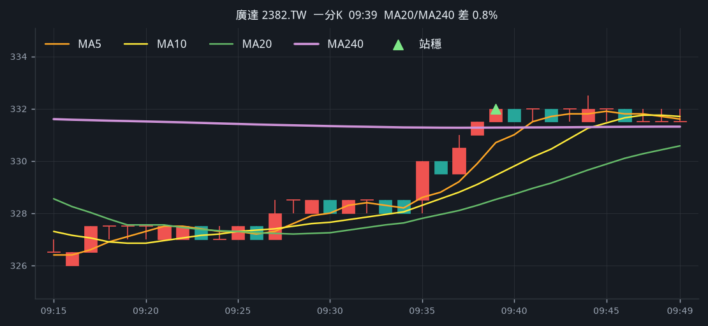

**五分 K（對照）**

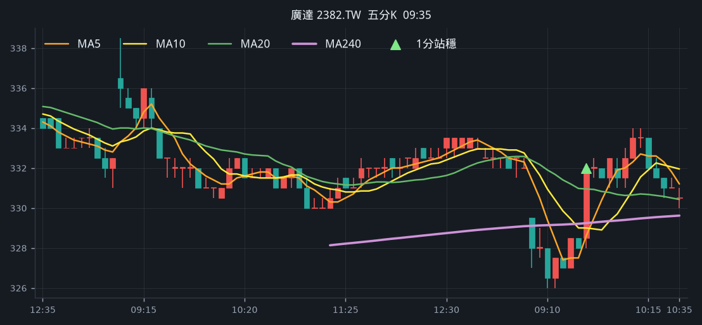

## 4. 尖點 [8021.TW](https://tw.stock.yahoo.com/quote/8021.TW)

- 價格 435.00 -4.19%　成交額排名 #83　40.17 億
- 1分站穩 13:05　收 435.00 > MA240 433.80
- 1分 MA5 433.60 > MA10 433.20 > MA20 431.55　MA20/MA240 差 0.5%
- 五分收盤 / MA240　435.00 > 425.45（+2.2%）

**一分 K**

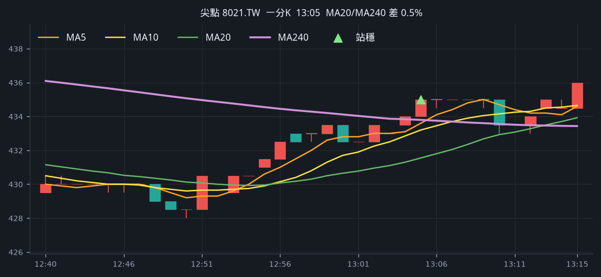

**五分 K（對照）**

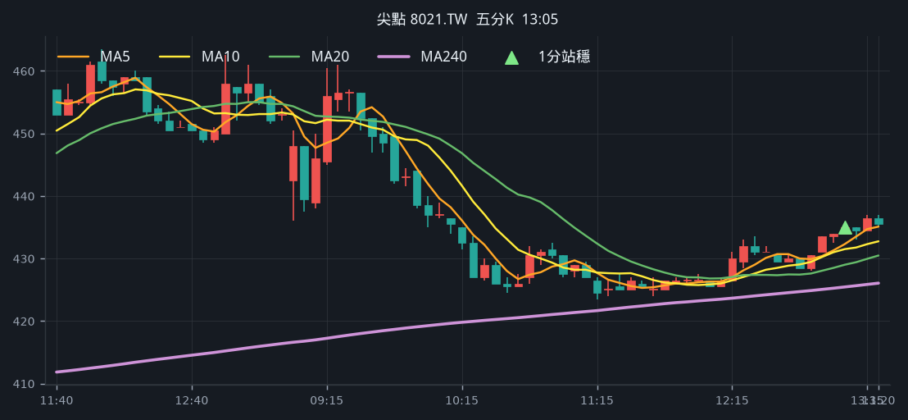

## 5. 環宇-KY [4991.TWO](https://tw.stock.yahoo.com/quote/4991.TWO)

- 價格 539.00 +3.65%　成交額排名 #96　30.92 億
- 1分站穩 10:59　收 520.00 > MA240 518.88
- 1分 MA5 518.40 > MA10 516.90 > MA20 514.15　MA20/MA240 差 0.9%
- 五分收盤 / MA240　520.00 > 494.64（+5.1%）

**一分 K**

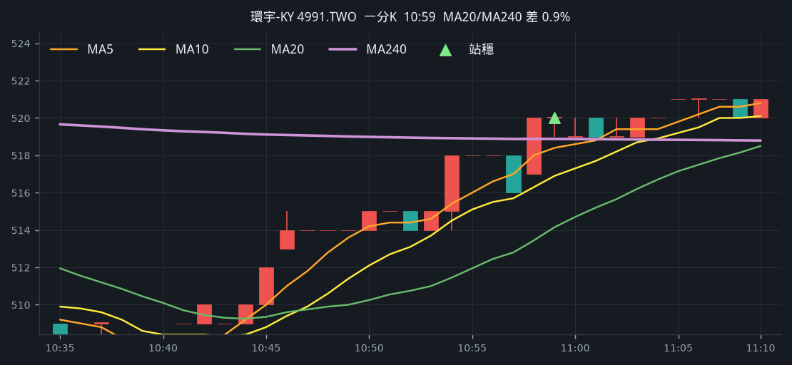

**五分 K（對照）**

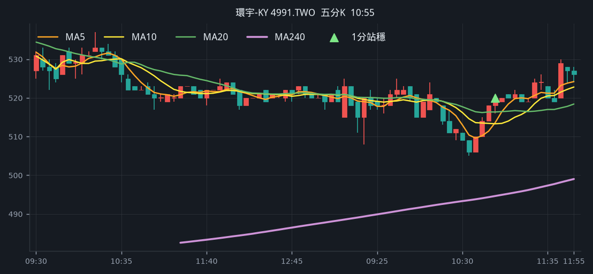

## 6. 南俊國際 [6584.TWO](https://tw.stock.yahoo.com/quote/6584.TWO)

- 價格 629.00 -7.77%　成交額排名 #106　26.54 億
- 1分站穩 09:32　收 669.00 > MA240 668.37
- 1分 MA5 667.00 > MA10 663.70 > MA20 662.40　MA20/MA240 差 0.9%
- 五分收盤 / MA240　665.00 > 617.14（+7.8%）

**一分 K**

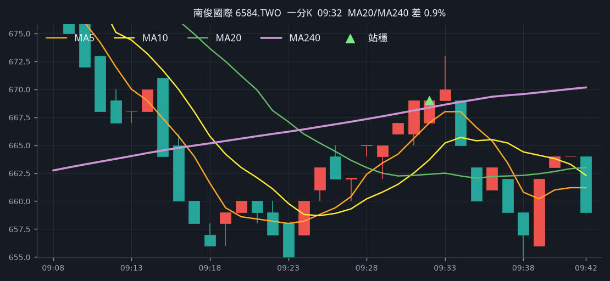

**五分 K（對照）**

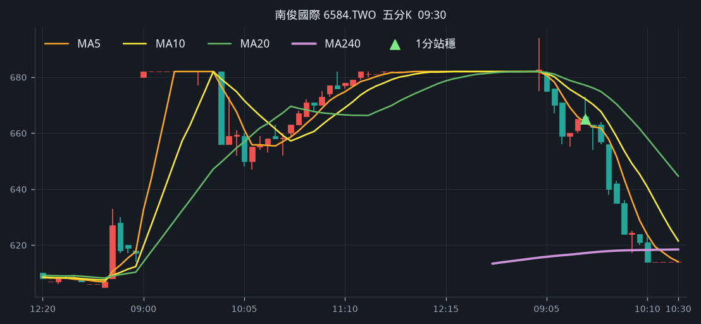

## 7. 訊芯-KY [6451.TW](https://tw.stock.yahoo.com/quote/6451.TW)

- 價格 456.00 +0.55%　成交額排名 #145　16.66 億
- 1分站穩 12:43　收 443.00 > MA240 440.52
- 1分 MA5 440.50 > MA10 438.85 > MA20 438.32　MA20/MA240 差 0.5%
- 五分收盤 / MA240　444.50 > 443.21（+0.3%）

**一分 K**

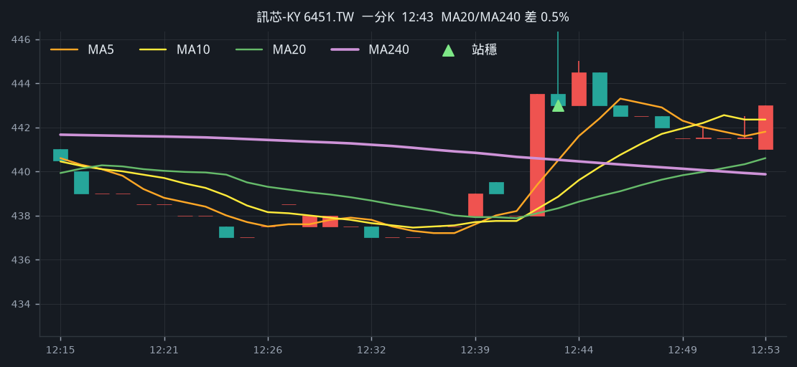

**五分 K（對照）**

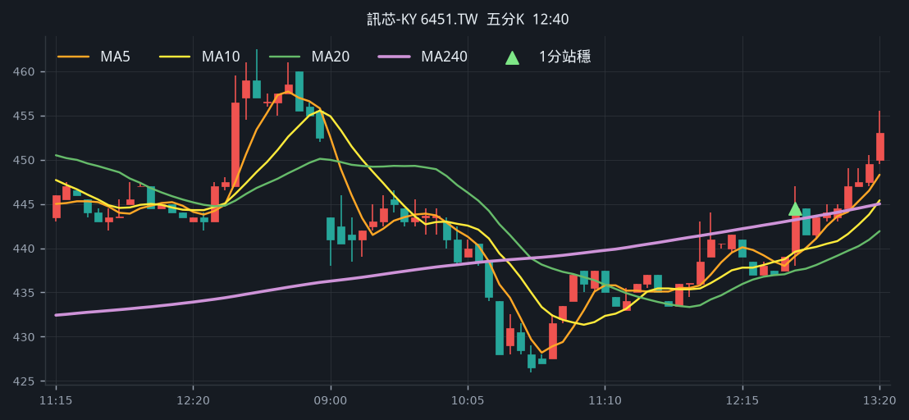

## 8. 啟碁 [6285.TW](https://tw.stock.yahoo.com/quote/6285.TW)

- 價格 244.00 -1.21%　成交額排名 #152　15.67 億
- 1分站穩 09:20　收 249.00 > MA240 248.63
- 1分 MA5 247.40 > MA10 246.95 > MA20 246.30　MA20/MA240 差 0.9%
- 五分收盤 / MA240　253.00 > 240.14（+5.4%）

**一分 K**

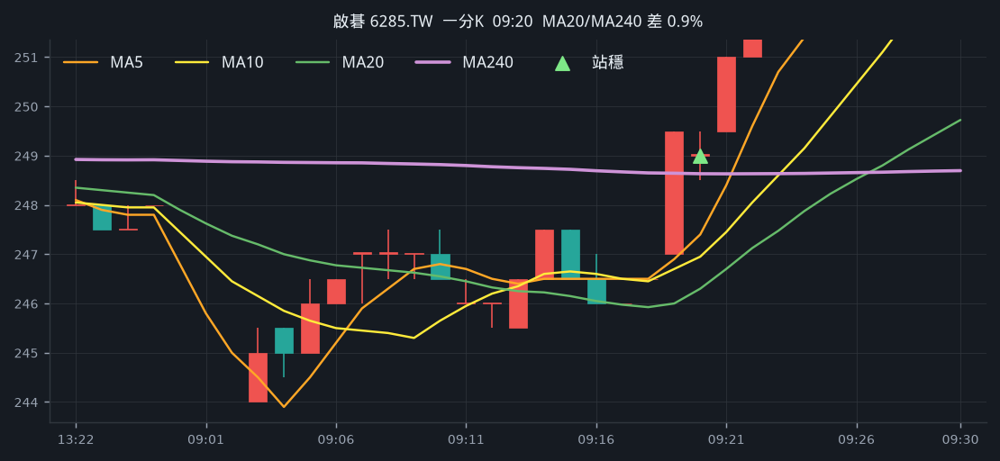

**五分 K（對照）**

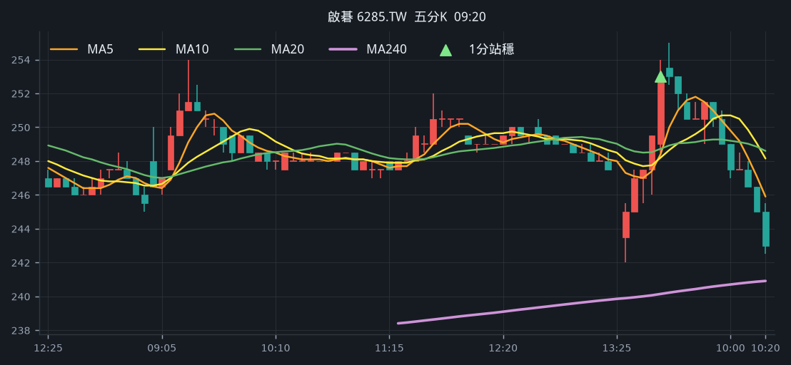

## 9. 華星光 [4979.TWO](https://tw.stock.yahoo.com/quote/4979.TWO)

- 價格 609.00 -0.16%　成交額排名 #165　11.97 億
- 1分站穩 11:24　收 613.00 > MA240 605.78
- 1分 MA5 606.60 > MA10 603.90 > MA20 600.35　MA20/MA240 差 0.9%
- 五分收盤 / MA240　613.00 > 601.04（+2.0%）

**一分 K**

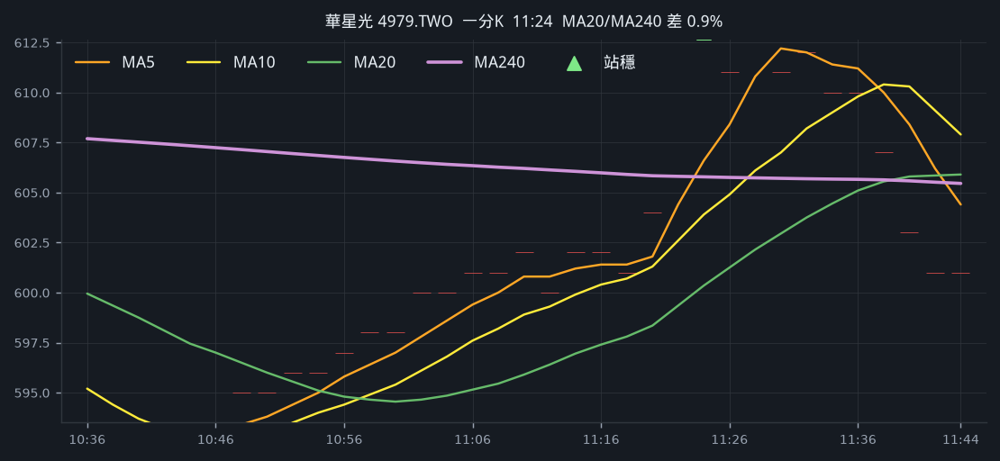

**五分 K（對照）**

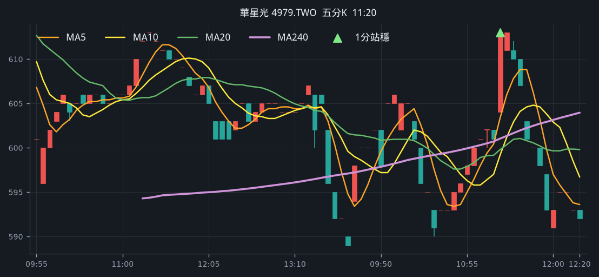

