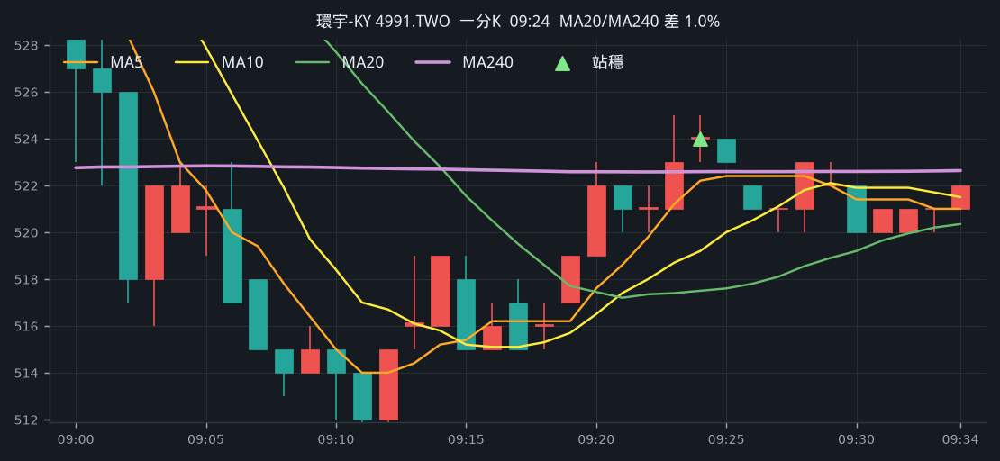
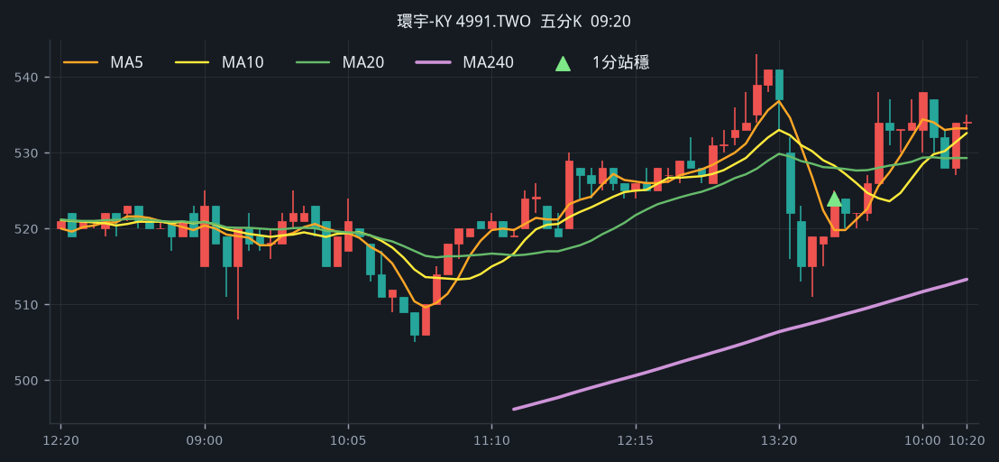
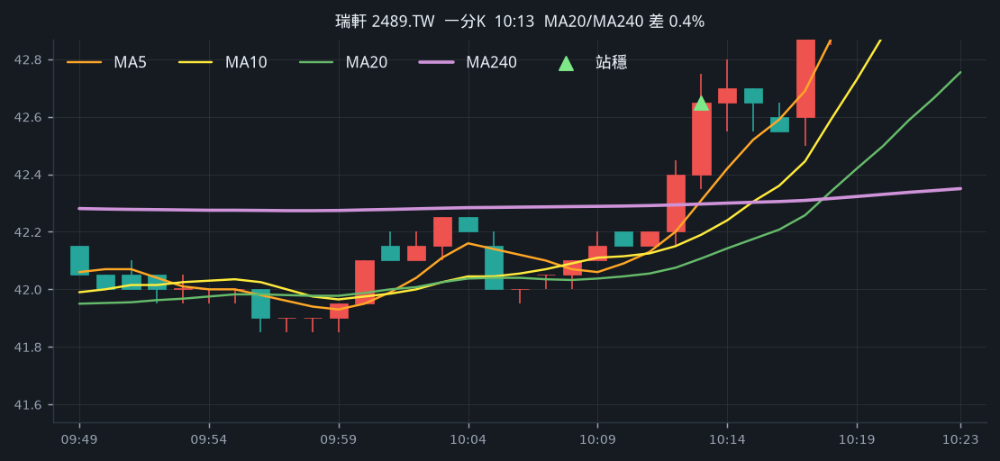
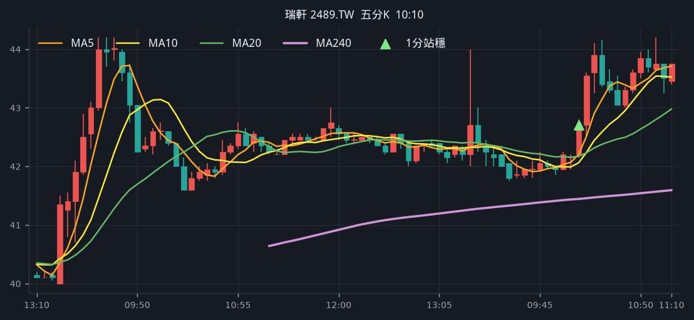
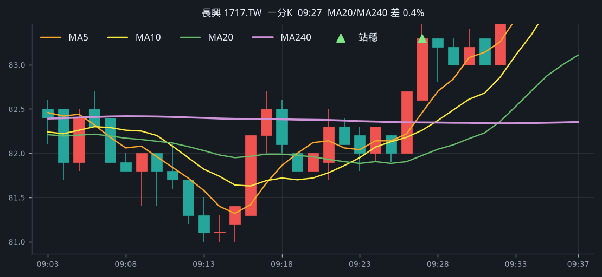
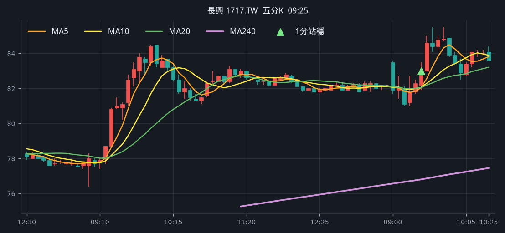
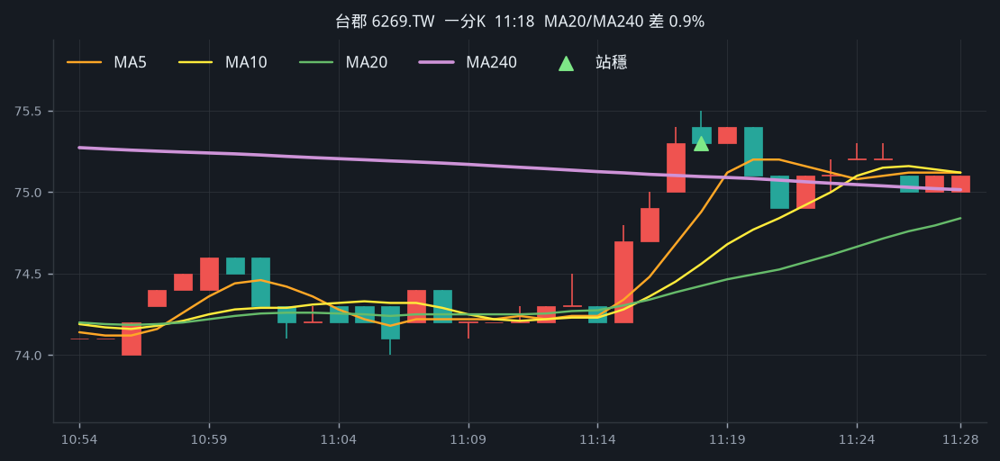
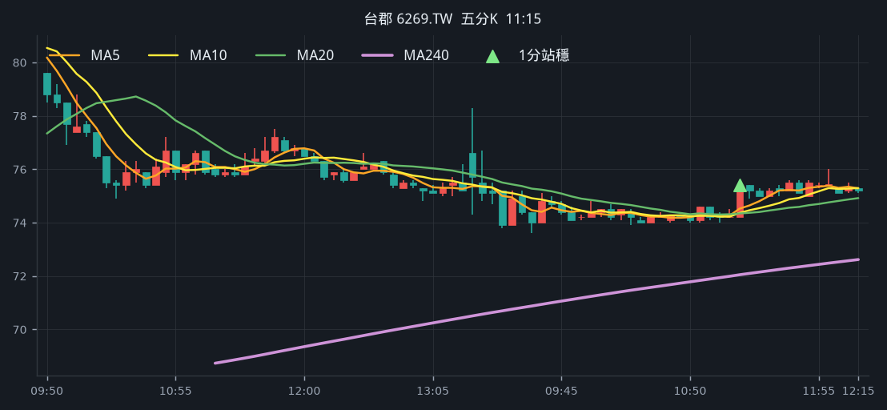
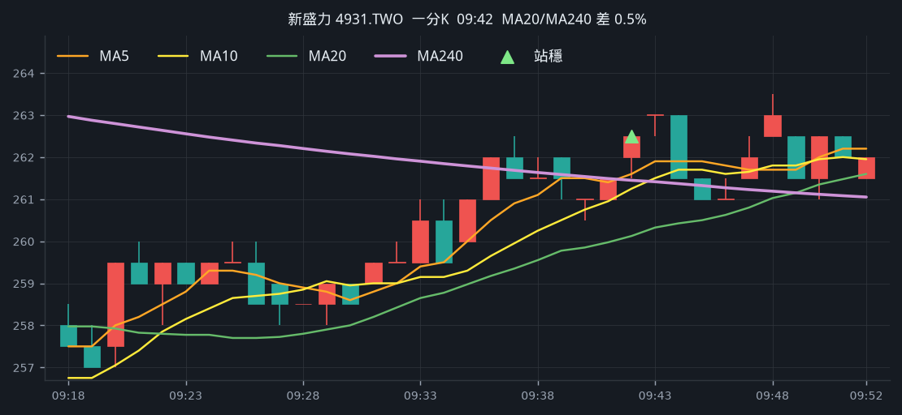
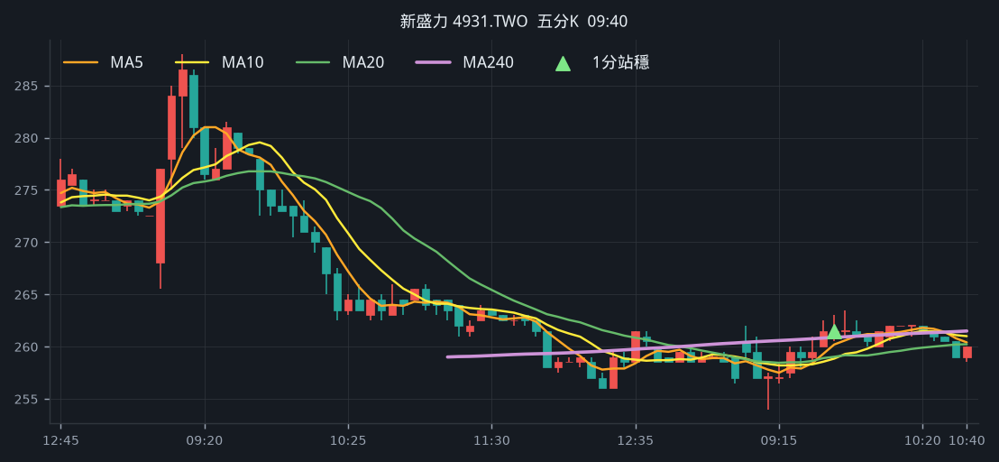

# 回測 2026-09-01（週二）· 一分K站穩 MA240

用 2026-09-01（週二）當天上市＋上櫃成交額前 200（盤後），濾掉 ETF、金融股與收盤價 650 以上。一分K MA5>MA10>MA20 且拉開（MA5−MA20 ≥ 0.4%），MA20 與 MA240 差距 0.4%～1.0%，從 240 下面穿上、連續兩根收盤站穩，時間 09:10 以後（開盤跳空不算）；含該根的五分K收盤也必須高於五分 MA240。

- 命中 **5** 檔
- 掃描時間 2026-09-06 15:53:35（台北）
- 排行 2026-09-01 盤後成交額
- 前 200 → 濾掉股價 56、ETF 22、金融 13 → 掃描 109 → 均線糾結 0 → MA20/MA240不符 0 → 五分MA240底下 0

## 1. 環宇-KY [4991.TWO](https://tw.stock.yahoo.com/quote/4991.TWO)

- 價格 544.00 +0.93%　成交額排名 #65　47.91 億
- 1分站穩 09:24　收 524.00 > MA240 522.59
- 1分 MA5 522.20 > MA10 519.20 > MA20 517.50　MA20/MA240 差 1.0%
- 五分收盤 / MA240　524.00 > 508.33（+3.1%）

**一分 K**

**五分 K（對照）**

## 2. 瑞軒 [2489.TW](https://tw.stock.yahoo.com/quote/2489.TW)

- 價格 42.80 +1.42%　成交額排名 #69　44.41 億
- 1分站穩 10:13　收 42.65 > MA240 42.30
- 1分 MA5 42.31 > MA10 42.19 > MA20 42.11　MA20/MA240 差 0.4%
- 五分收盤 / MA240　42.70 > 41.44（+3.0%）

**一分 K**

**五分 K（對照）**

## 3. 長興 [1717.TW](https://tw.stock.yahoo.com/quote/1717.TW)

- 價格 84.70 +2.67%　成交額排名 #70　44.18 億
- 1分站穩 09:27　收 83.30 > MA240 82.35
- 1分 MA5 82.46 > MA10 82.26 > MA20 81.98　MA20/MA240 差 0.4%
- 五分收盤 / MA240　83.00 > 76.80（+8.1%）

**一分 K**

**五分 K（對照）**

## 4. 台郡 [6269.TW](https://tw.stock.yahoo.com/quote/6269.TW)

- 價格 75.20 +0.40%　成交額排名 #141　16.34 億
- 1分站穩 11:18　收 75.30 > MA240 75.10
- 1分 MA5 74.88 > MA10 74.56 > MA20 74.42　MA20/MA240 差 0.9%
- 五分收盤 / MA240　75.40 > 72.04（+4.7%）

**一分 K**

**五分 K（對照）**

## 5. 新盛力 [4931.TWO](https://tw.stock.yahoo.com/quote/4931.TWO)

- 價格 260.50 +0.58%　成交額排名 #164　13.49 億
- 1分站穩 09:42　收 262.50 > MA240 261.45
- 1分 MA5 261.60 > MA10 261.25 > MA20 260.12　MA20/MA240 差 0.5%
- 五分收盤 / MA240　261.50 > 260.88（+0.2%）

**一分 K**

**五分 K（對照）**

