# 回測 2026-09-02（週三）· 一分K站穩 MA240

用 2026-09-02（週三）當天上市＋上櫃成交額前 200（盤後），濾掉 ETF、金融股與收盤價 650 以上。一分K MA5>MA10>MA20 且拉開（MA5−MA20 ≥ 0.4%），MA20 與 MA240 差距 0.4%～1.0%，從 240 下面穿上、連續兩根收盤站穩，時間 09:10 以後（開盤跳空不算）；含該根的五分K收盤也必須高於五分 MA240。

- 命中 **6** 檔
- 掃描時間 2026-09-06 15:53:55（台北）
- 排行 2026-09-02 盤後成交額
- 前 200 → 濾掉股價 57、ETF 21、金融 14 → 掃描 108 → 均線糾結 0 → MA20/MA240不符 0 → 五分MA240底下 4

## 1. 鼎元 [2426.TW](https://tw.stock.yahoo.com/quote/2426.TW)

- 價格 104.50 -2.79%　成交額排名 #29　81.84 億
- 1分站穩 11:52　收 104.50 > MA240 104.26
- 1分 MA5 104.10 > MA10 104.05 > MA20 103.58　MA20/MA240 差 0.7%
- 五分收盤 / MA240　104.50 > 99.18（+5.4%）

**一分 K**

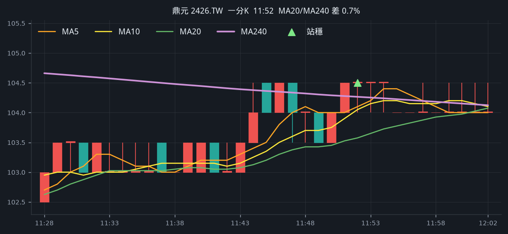

**五分 K（對照）**

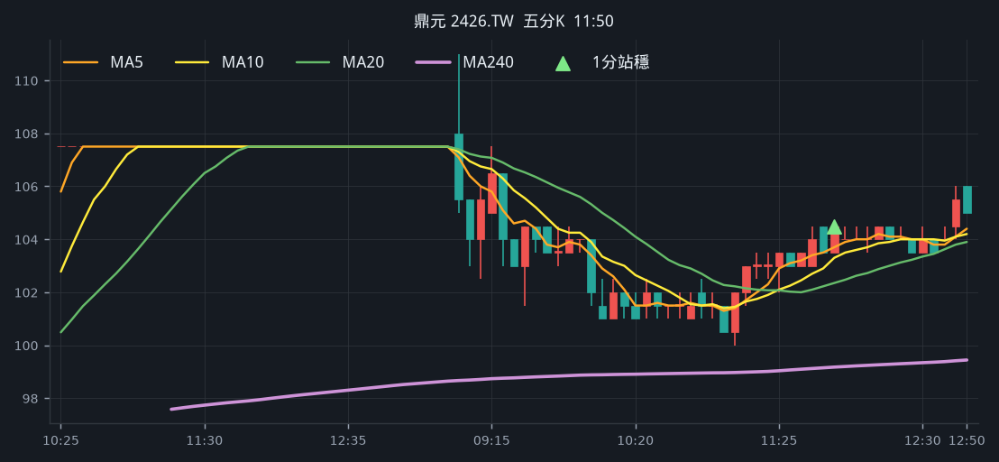

## 2. 華通 [2313.TW](https://tw.stock.yahoo.com/quote/2313.TW)

- 價格 249.00 -1.19%　成交額排名 #36　72.77 億
- 1分站穩 10:11　收 252.50 > MA240 251.89
- 1分 MA5 250.50 > MA10 249.70 > MA20 249.45　MA20/MA240 差 1.0%
- 五分收盤 / MA240　250.50 > 245.63（+2.0%）

**一分 K**

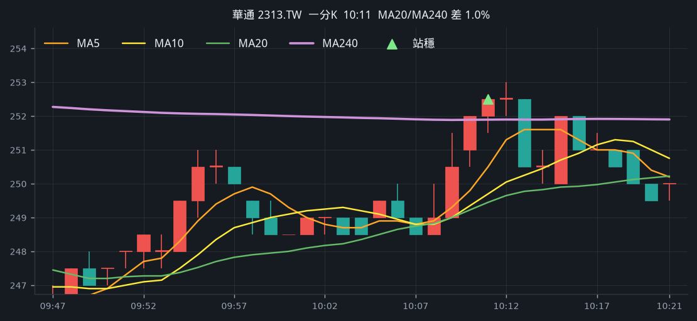

**五分 K（對照）**

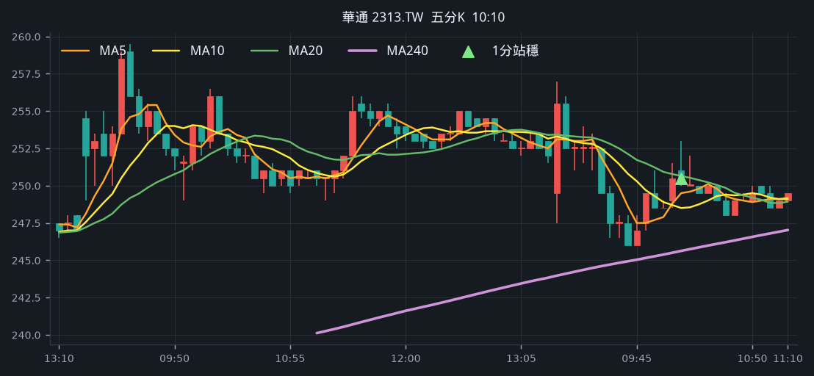

## 3. 台化 [1326.TW](https://tw.stock.yahoo.com/quote/1326.TW)

- 價格 72.80 -2.02%　成交額排名 #63　45.29 億
- 1分站穩 12:44　收 71.90 > MA240 71.88
- 1分 MA5 71.86 > MA10 71.66 > MA20 71.31　MA20/MA240 差 0.8%
- 五分收盤 / MA240　71.90 > 67.74（+6.1%）

**一分 K**

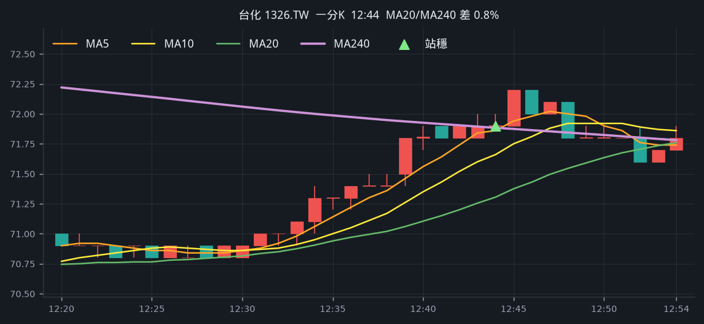

**五分 K（對照）**

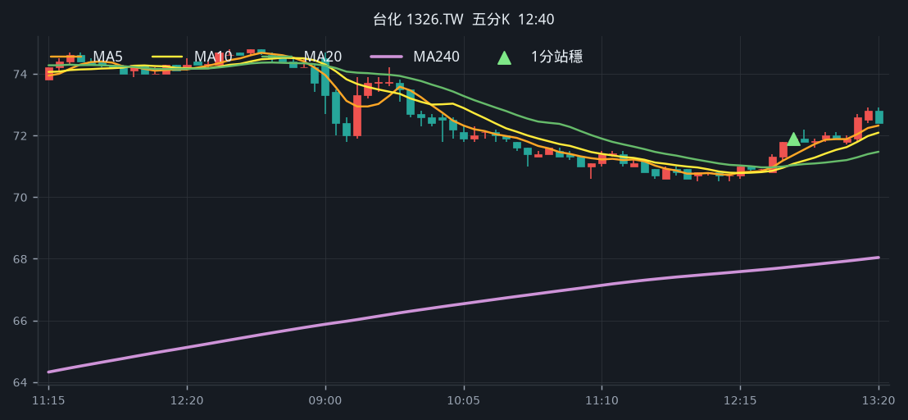

## 4. 頎邦 [6147.TWO](https://tw.stock.yahoo.com/quote/6147.TWO)

- 價格 182.50 -0.54%　成交額排名 #87　28.14 億
- 1分站穩 12:22　收 184.50 > MA240 181.41
- 1分 MA5 181.10 > MA10 180.35 > MA20 179.95　MA20/MA240 差 0.8%
- 五分收盤 / MA240　184.50 > 181.96（+1.4%）

**一分 K**

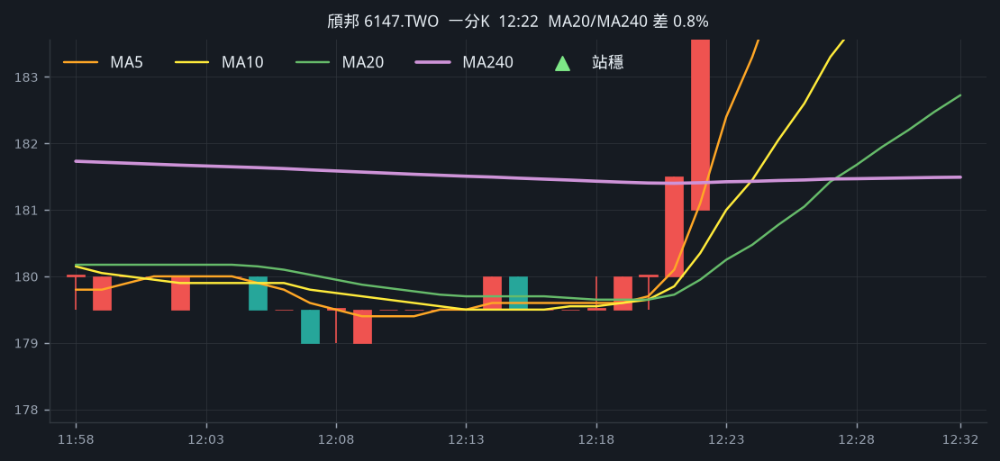

**五分 K（對照）**

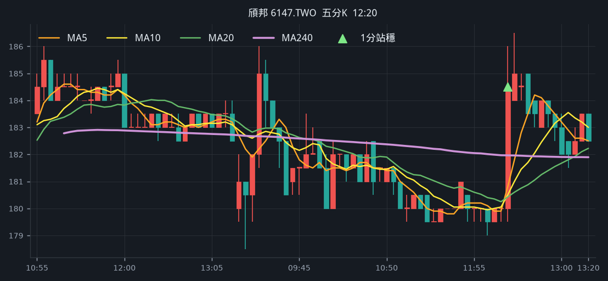

## 5. 信昌電 [6173.TWO](https://tw.stock.yahoo.com/quote/6173.TWO)

- 價格 260.50 -0.38%　成交額排名 #100　24.51 億
- 1分站穩 13:05　收 261.00 > MA240 258.05
- 1分 MA5 258.50 > MA10 256.55 > MA20 255.88　MA20/MA240 差 0.8%
- 五分收盤 / MA240　259.50 > 246.63（+5.2%）

**一分 K**

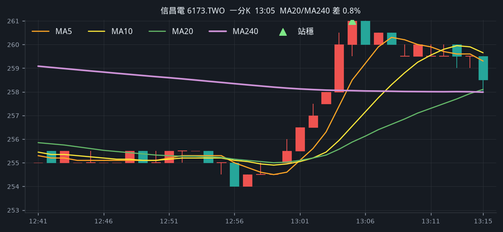

**五分 K（對照）**

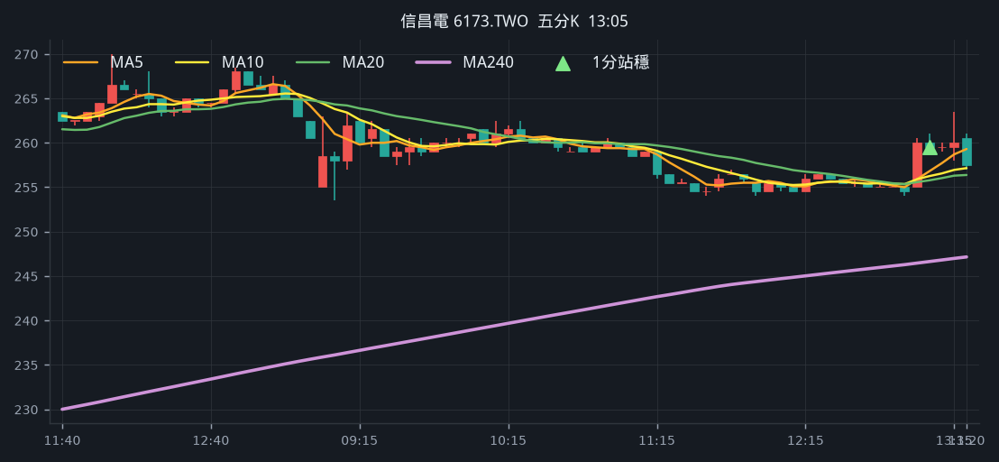

## 6. 建準 [2421.TW](https://tw.stock.yahoo.com/quote/2421.TW)

- 價格 168.00 -5.08%　成交額排名 #164　11.59 億
- 1分站穩 09:17　收 178.00 > MA240 177.97
- 1分 MA5 177.50 > MA10 176.65 > MA20 176.20　MA20/MA240 差 1.0%
- 五分收盤 / MA240　177.50 > 167.88（+5.7%）

**一分 K**

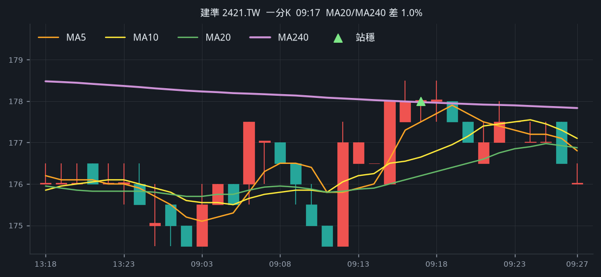

**五分 K（對照）**

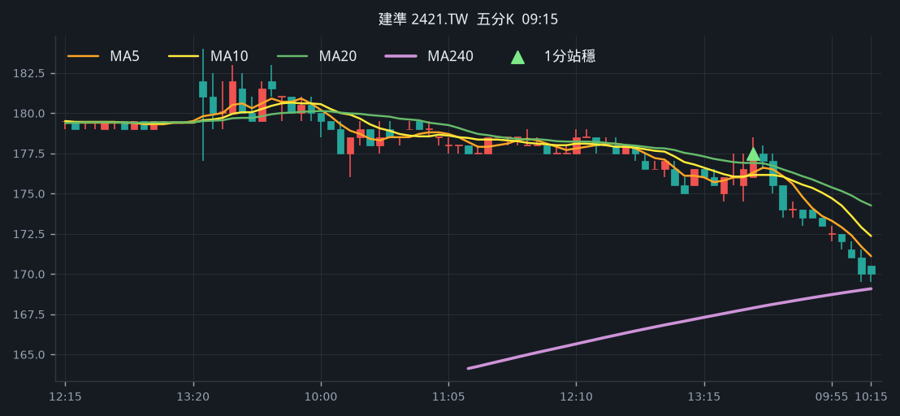

