# 回測 2026-09-03（週四）· 一分K站穩 MA240

用 2026-09-03（週四）當天上市＋上櫃成交額前 200（盤後），濾掉 ETF、金融股與收盤價 650 以上。一分K MA5>MA10>MA20 且拉開（MA5−MA20 ≥ 0.4%），MA20 與 MA240 差距 0.4%～1.0%，從 240 下面穿上、連續兩根收盤站穩，時間 09:10 以後（開盤跳空不算）；含該根的五分K收盤也必須高於五分 MA240。

- 命中 **7** 檔
- 掃描時間 2026-09-06 15:54:15（台北）
- 排行 2026-09-03 盤後成交額
- 前 200 → 濾掉股價 54、ETF 15、金融 14 → 掃描 117 → 均線糾結 0 → MA20/MA240不符 0 → 五分MA240底下 9

## 1. 晶豪科 [3006.TW](https://tw.stock.yahoo.com/quote/3006.TW)

- 價格 277.00 -1.60%　成交額排名 #22　124.03 億
- 1分站穩 11:04　收 291.00 > MA240 289.77
- 1分 MA5 289.80 > MA10 288.40 > MA20 287.38　MA20/MA240 差 0.8%
- 五分收盤 / MA240　291.00 > 280.08（+3.9%）

**一分 K**

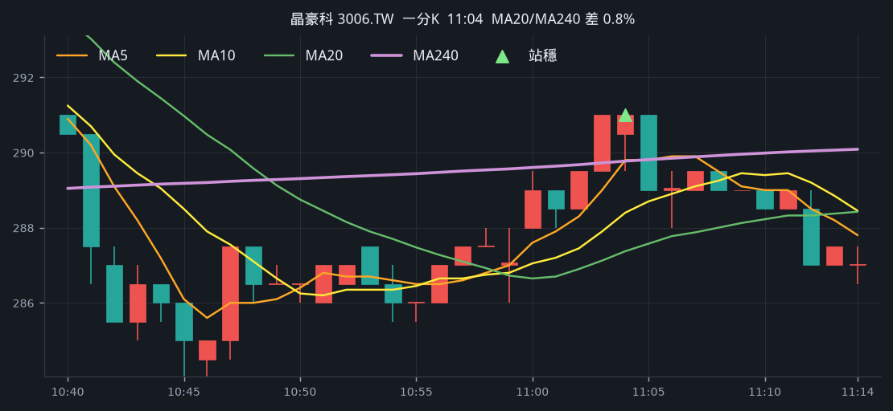

**五分 K（對照）**

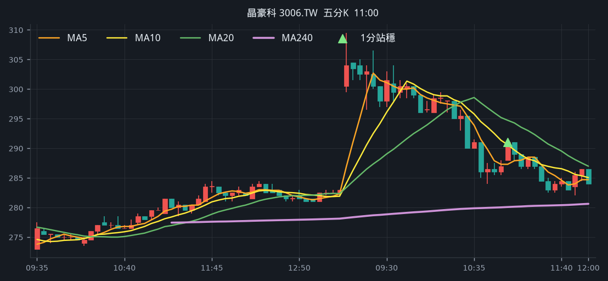

## 2. 京元電子 [2449.TW](https://tw.stock.yahoo.com/quote/2449.TW)

- 價格 261.00 -3.51%　成交額排名 #45　67.51 億
- 1分站穩 11:18　收 270.00 > MA240 269.79
- 1分 MA5 269.10 > MA10 268.50 > MA20 267.57　MA20/MA240 差 0.8%
- 五分收盤 / MA240　270.50 > 267.52（+1.1%）

**一分 K**

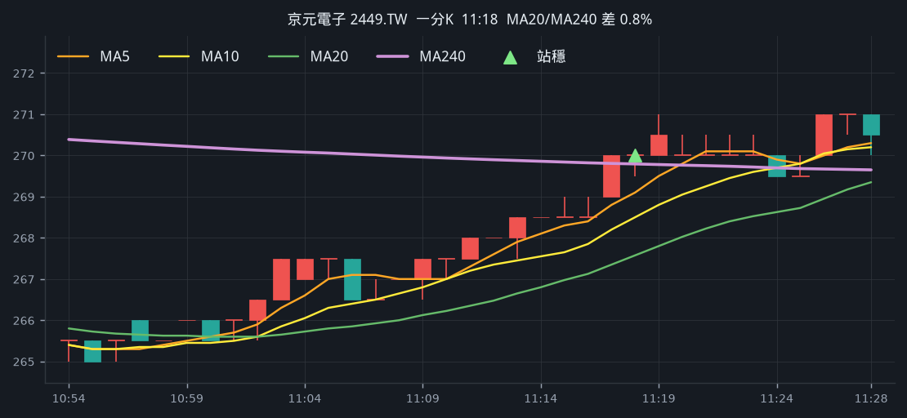

**五分 K（對照）**

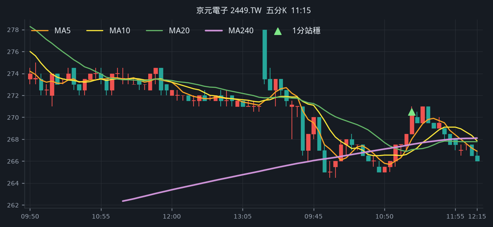

## 3. 汎銓 [6830.TW](https://tw.stock.yahoo.com/quote/6830.TW)

- 價格 590.00 -1.34%　成交額排名 #83　32.44 億
- 1分站穩 10:59　收 608.00 > MA240 607.33
- 1分 MA5 607.60 > MA10 606.00 > MA20 604.75　MA20/MA240 差 0.4%
- 五分收盤 / MA240　608.00 > 554.36（+9.7%）

**一分 K**

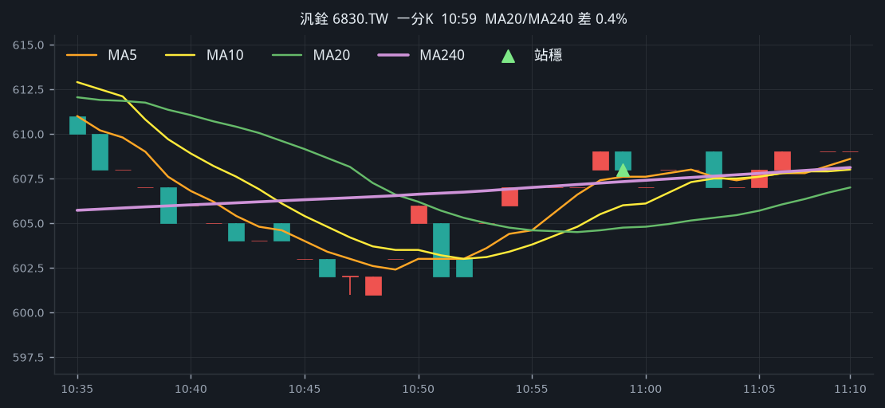

**五分 K（對照）**

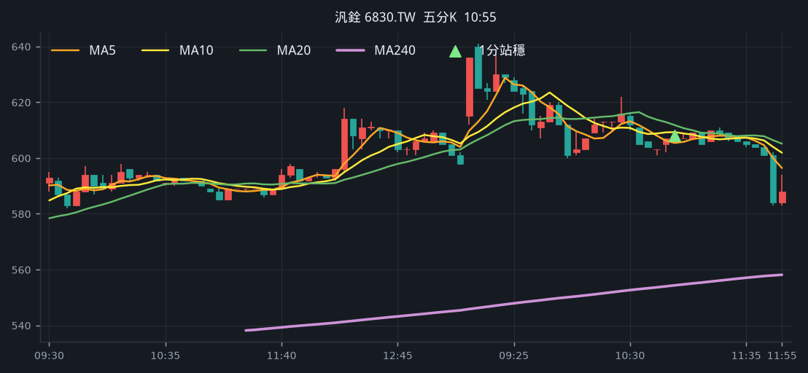

## 4. 台勝科 [3532.TW](https://tw.stock.yahoo.com/quote/3532.TW)

- 價格 381.00 -1.30%　成交額排名 #103　23.52 億
- 1分站穩 09:41　收 393.00 > MA240 391.48
- 1分 MA5 391.20 > MA10 390.90 > MA20 387.68　MA20/MA240 差 1.0%
- 五分收盤 / MA240　394.00 > 392.16（+0.5%）

**一分 K**

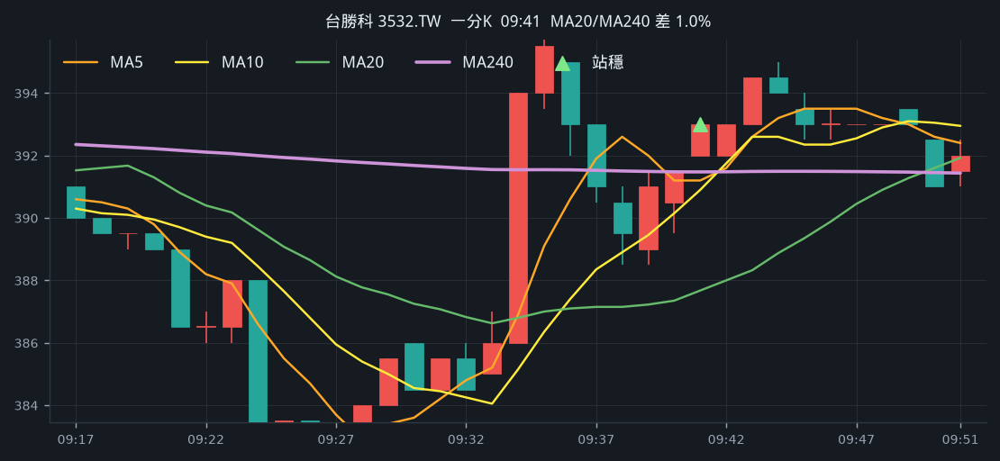

**五分 K（對照）**

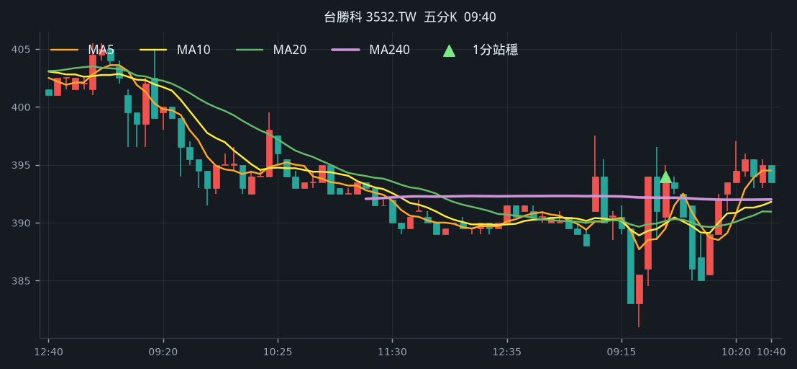

## 5. 南茂 [8150.TW](https://tw.stock.yahoo.com/quote/8150.TW)

- 價格 89.10 -1.22%　成交額排名 #114　21.31 億
- 1分站穩 10:19　收 91.50 > MA240 90.71
- 1分 MA5 90.70 > MA10 90.29 > MA20 89.84　MA20/MA240 差 1.0%
- 五分收盤 / MA240　91.50 > 91.10（+0.4%）

**一分 K**

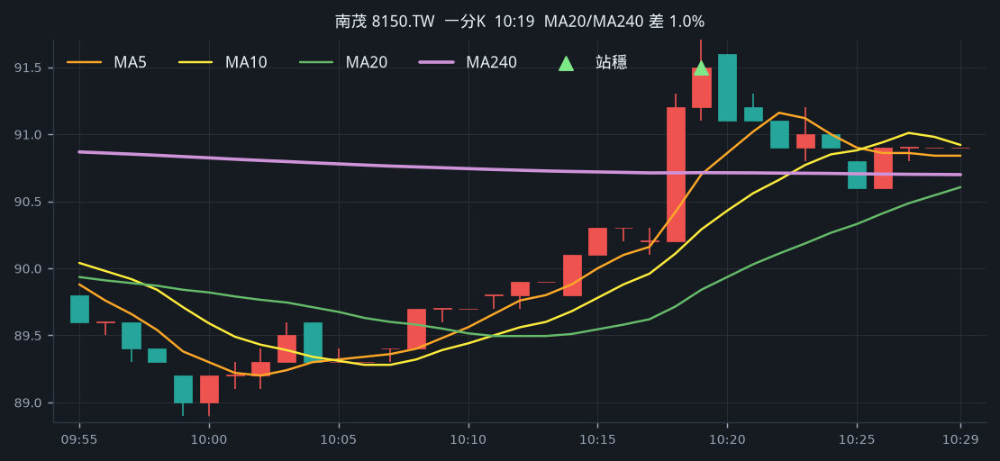

**五分 K（對照）**

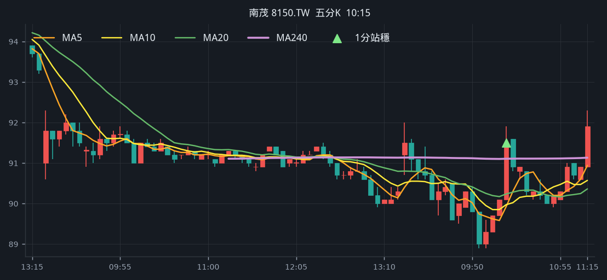

## 6. 亞泰金屬 [6727.TWO](https://tw.stock.yahoo.com/quote/6727.TWO)

- 價格 550.00 -5.17%　成交額排名 #166　11.68 億
- 1分站穩 10:59　收 578.00 > MA240 576.43
- 1分 MA5 576.40 > MA10 572.30 > MA20 571.10　MA20/MA240 差 0.9%
- 五分收盤 / MA240　578.00 > 555.97（+4.0%）

**一分 K**

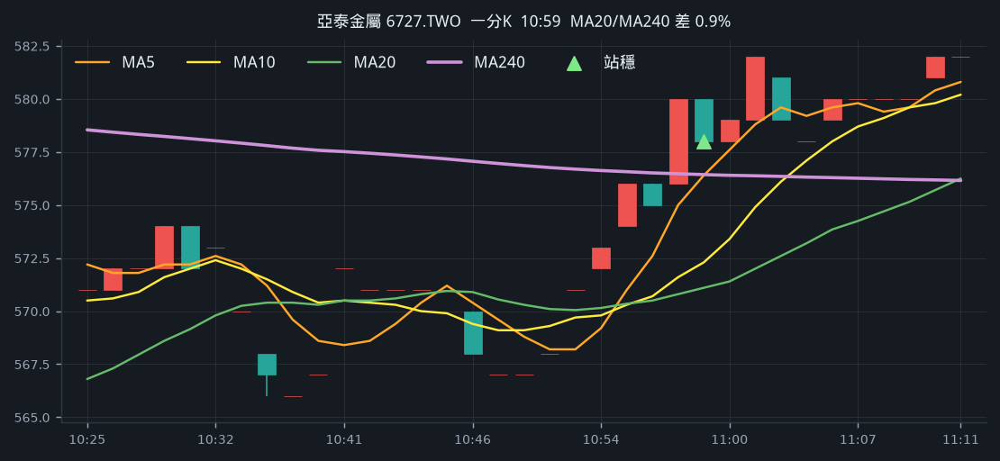

**五分 K（對照）**

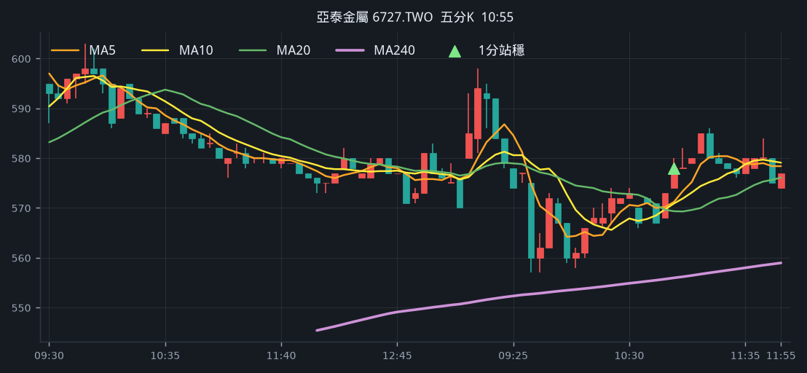

## 7. 統新 [6426.TW](https://tw.stock.yahoo.com/quote/6426.TW)

- 價格 265.50 +3.31%　成交額排名 #193　9.36 億
- 1分站穩 11:51　收 265.50 > MA240 257.89
- 1分 MA5 259.60 > MA10 257.55 > MA20 256.57　MA20/MA240 差 0.5%
- 五分收盤 / MA240　266.50 > 263.22（+1.2%）

**一分 K**

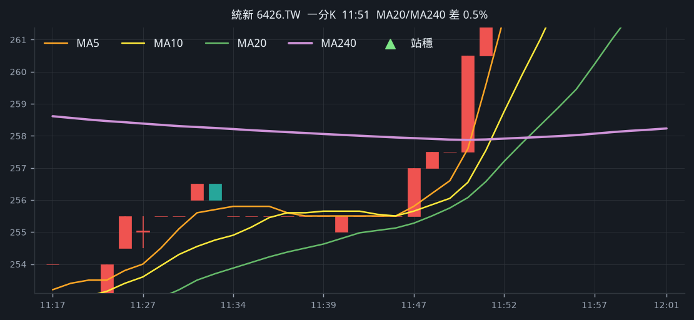

**五分 K（對照）**

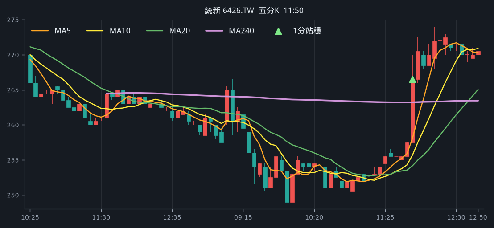

