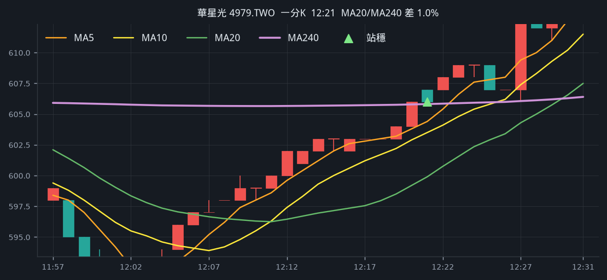
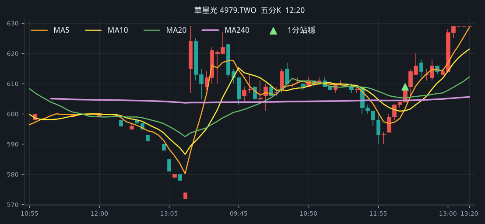
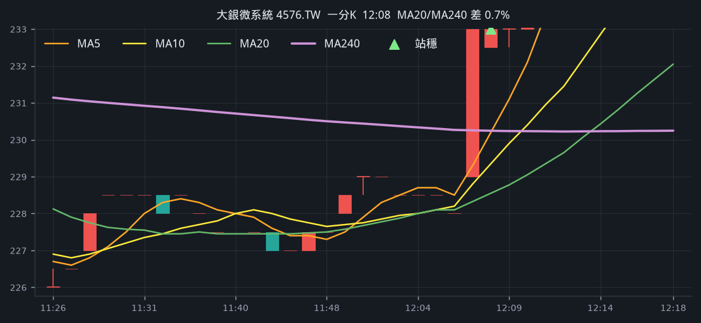
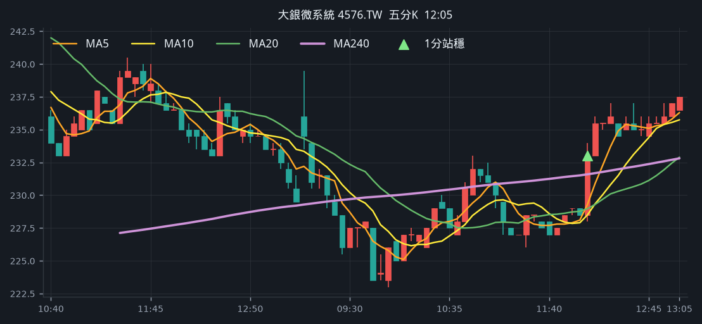
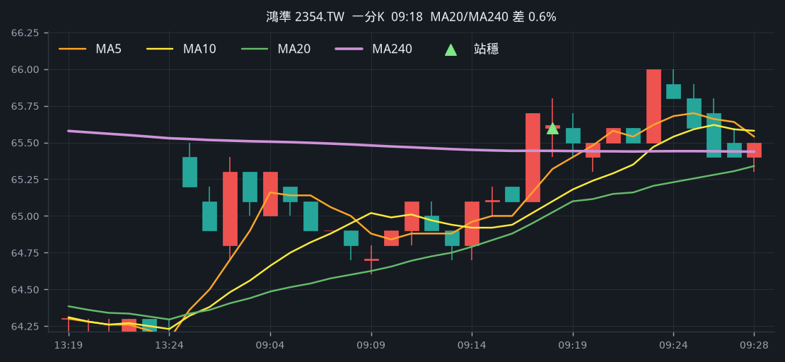
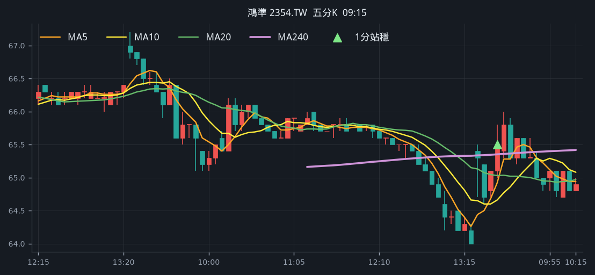

# 回測 2026-09-04（週五）· 一分K站穩 MA240

用 2026-09-04（週五）當天上市＋上櫃成交額前 200（盤後），濾掉 ETF、金融股與收盤價 650 以上。一分K MA5>MA10>MA20 且拉開（MA5−MA20 ≥ 0.4%），MA20 與 MA240 差距 0.4%～1.0%，從 240 下面穿上、連續兩根收盤站穩，時間 09:10 以後（開盤跳空不算）；含該根的五分K收盤也必須高於五分 MA240。

- 命中 **3** 檔
- 掃描時間 2026-09-06 15:54:36（台北）
- 排行 2026-09-04 盤後成交額
- 前 200 → 濾掉股價 56、ETF 17、金融 12 → 掃描 115 → 均線糾結 0 → MA20/MA240不符 0 → 五分MA240底下 10

## 1. 華星光 [4979.TWO](https://tw.stock.yahoo.com/quote/4979.TWO)

- 價格 629.00 +9.97%　成交額排名 #23　114.39 億
- 1分站穩 12:21　收 606.00 > MA240 605.82
- 1分 MA5 604.40 > MA10 603.50 > MA20 599.90　MA20/MA240 差 1.0%
- 五分收盤 / MA240　609.00 > 604.43（+0.8%）

**一分 K**

**五分 K（對照）**

## 2. 大銀微系統 [4576.TW](https://tw.stock.yahoo.com/quote/4576.TW)

- 價格 238.00 +3.03%　成交額排名 #188　8.18 億
- 1分站穩 12:08　收 233.00 > MA240 230.24
- 1分 MA5 230.20 > MA10 229.35 > MA20 228.55　MA20/MA240 差 0.7%
- 五分收盤 / MA240　233.00 > 231.59（+0.6%）

**一分 K**

**五分 K（對照）**

## 3. 鴻準 [2354.TW](https://tw.stock.yahoo.com/quote/2354.TW)

- 價格 65.60 +2.98%　成交額排名 #191　8.14 億
- 1分站穩 09:18　收 65.60 > MA240 65.44
- 1分 MA5 65.32 > MA10 65.10 > MA20 65.03　MA20/MA240 差 0.6%
- 五分收盤 / MA240　65.50 > 65.35（+0.2%）

**一分 K**

**五分 K（對照）**

