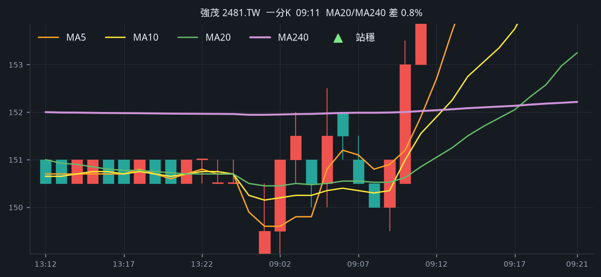
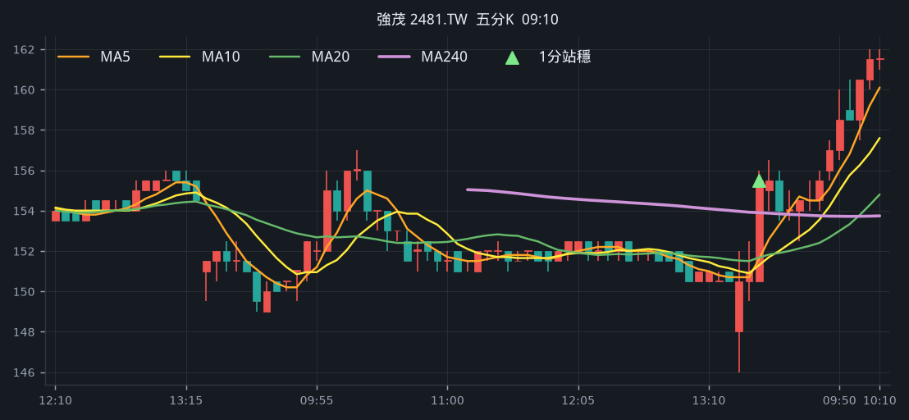
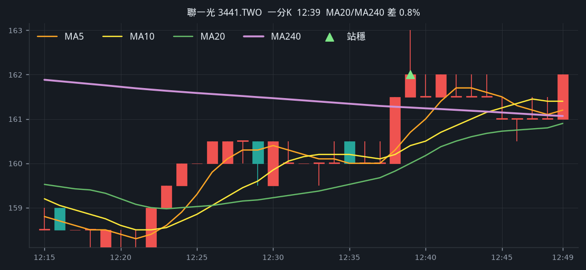
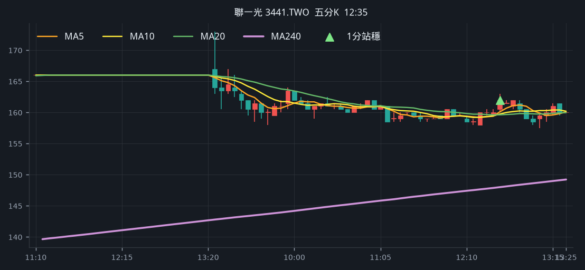
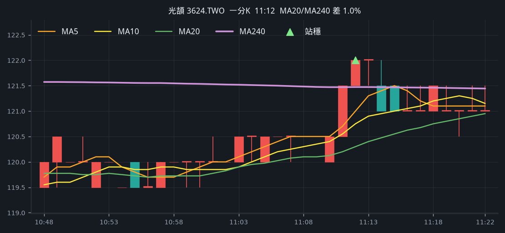
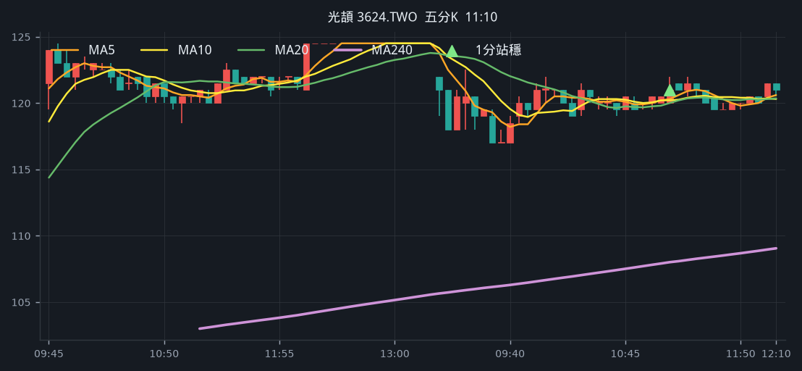
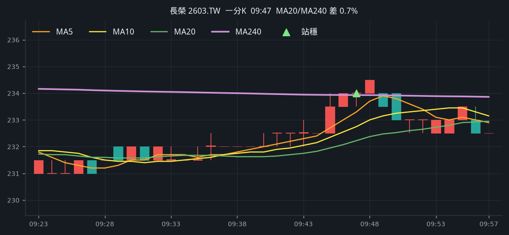
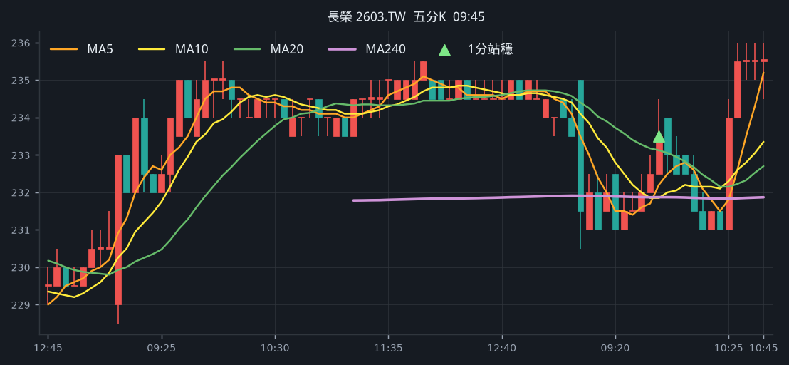
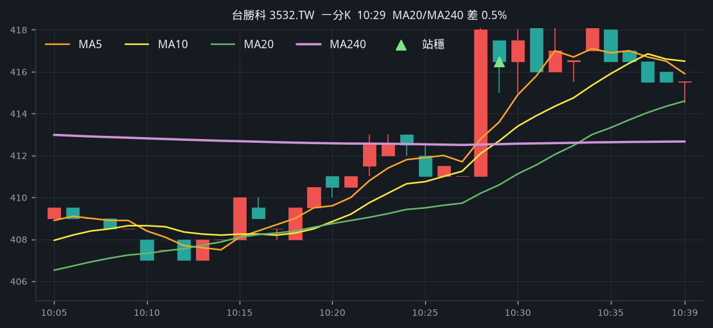
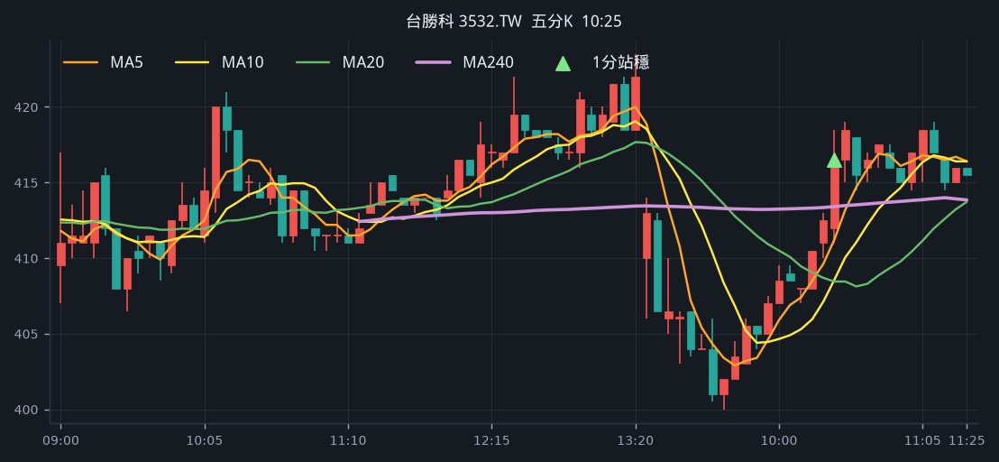

# 回測 2026-09-14（週一）· 一分K站穩 MA240

用 2026-09-14（週一）當天上市＋上櫃成交額前 200（盤後），濾掉 ETF、金融股與收盤價 650 以上。一分K MA5>MA10>MA20 且拉開（MA5−MA20 ≥ 0.4%），MA20 與 MA240 差距 0.4%～1.0%，從 240 下面穿上、連續兩根收盤站穩，時間 09:10 以後（開盤跳空不算）；含該根的五分K收盤也必須高於五分 MA240。

- 命中 **5** 檔
- 掃描時間 2026-09-19 02:10:33（台北）
- 排行 2026-09-14 盤後成交額
- 前 200 → 濾掉股價 57、ETF 20、金融 15 → 掃描 108 → 均線糾結 0 → MA20/MA240不符 0 → 五分MA240底下 14

## 1. 強茂 [2481.TW](https://tw.stock.yahoo.com/quote/2481.TW)

- 價格 159.00 +6.00%　成交額排名 #15　96.60 億
- 1分站穩 09:11　收 155.00 > MA240 152.02
- 1分 MA5 151.90 > MA10 151.55 > MA20 150.85　MA20/MA240 差 0.8%
- 五分收盤 / MA240　155.50 > 153.90（+1.0%）

**一分 K**

**五分 K（對照）**

## 2. 聯一光 [3441.TWO](https://tw.stock.yahoo.com/quote/3441.TWO)

- 價格 160.50 -3.31%　成交額排名 #37　58.62 億
- 1分站穩 12:39　收 162.00 > MA240 161.26
- 1分 MA5 160.70 > MA10 160.40 > MA20 160.00　MA20/MA240 差 0.8%
- 五分收盤 / MA240　162.00 > 148.00（+9.5%）

**一分 K**

**五分 K（對照）**

## 3. 光頡 [3624.TWO](https://tw.stock.yahoo.com/quote/3624.TWO)

- 價格 124.00 -0.40%　成交額排名 #42　54.48 億
- 1分站穩 11:12　收 122.00 > MA240 121.47
- 1分 MA5 121.00 > MA10 120.75 > MA20 120.30　MA20/MA240 差 1.0%
- 五分收盤 / MA240　121.00 > 108.00（+12.0%）

**一分 K**

**五分 K（對照）**

## 4. 長榮 [2603.TW](https://tw.stock.yahoo.com/quote/2603.TW)

- 價格 237.00 +1.07%　成交額排名 #62　30.37 億
- 1分站穩 09:47　收 234.00 > MA240 233.93
- 1分 MA5 233.30 > MA10 232.75 > MA20 232.22　MA20/MA240 差 0.7%
- 五分收盤 / MA240　233.50 > 231.87（+0.7%）

**一分 K**

**五分 K（對照）**

## 5. 台勝科 [3532.TW](https://tw.stock.yahoo.com/quote/3532.TW)

- 價格 416.00 -1.65%　成交額排名 #85　22.12 億
- 1分站穩 10:29　收 416.50 > MA240 412.54
- 1分 MA5 413.60 > MA10 412.70 > MA20 410.60　MA20/MA240 差 0.5%
- 五分收盤 / MA240　416.50 > 413.40（+0.7%）

**一分 K**

**五分 K（對照）**

