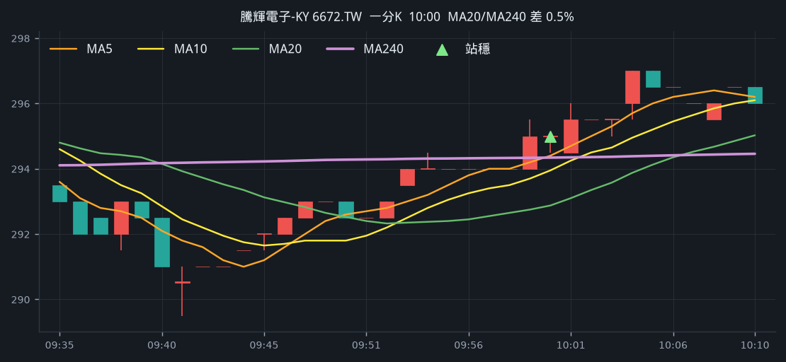
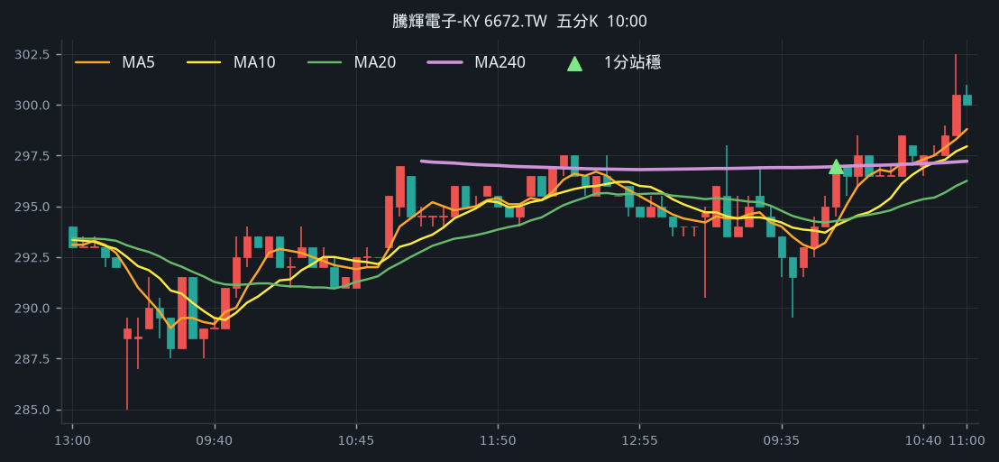

# 回測 2026-09-15（週二）· 一分K站穩 MA240

用 2026-09-15（週二）當天上市＋上櫃成交額前 200（盤後），濾掉 ETF、金融股與收盤價 650 以上。一分K MA5>MA10>MA20 且拉開（MA5−MA20 ≥ 0.4%），MA20 與 MA240 差距 0.4%～1.0%，從 240 下面穿上、連續兩根收盤站穩，時間 09:10 以後（開盤跳空不算）；含該根的五分K收盤也必須高於五分 MA240。

- 命中 **1** 檔
- 掃描時間 2026-09-19 02:10:50（台北）
- 排行 2026-09-15 盤後成交額
- 前 200 → 濾掉股價 53、ETF 20、金融 15 → 掃描 112 → 均線糾結 0 → MA20/MA240不符 0 → 五分MA240底下 5

## 1. 騰輝電子-KY [6672.TW](https://tw.stock.yahoo.com/quote/6672.TW)

- 價格 291.00 -1.19%　成交額排名 #124　12.46 億
- 1分站穩 10:00　收 295.00 > MA240 294.34
- 1分 MA5 294.40 > MA10 293.95 > MA20 292.88　MA20/MA240 差 0.5%
- 五分收盤 / MA240　297.00 > 296.95（+0.0%）

**一分 K**

**五分 K（對照）**

