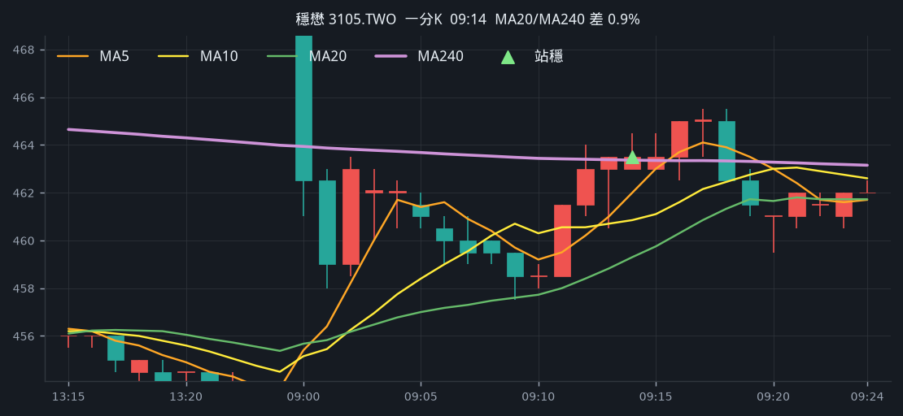
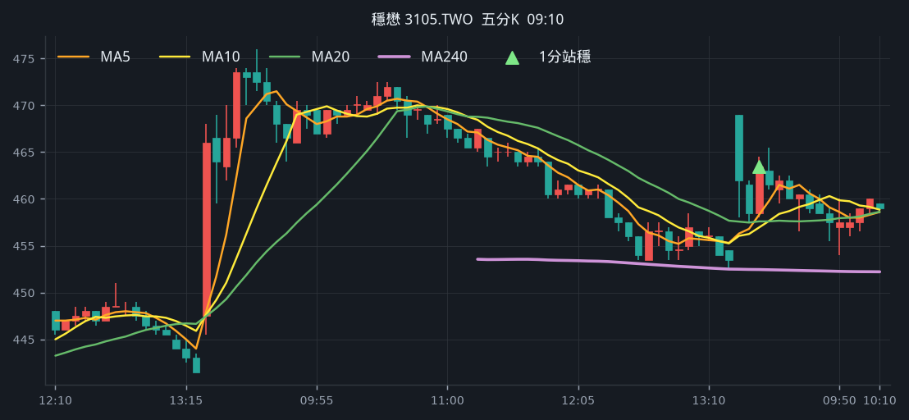
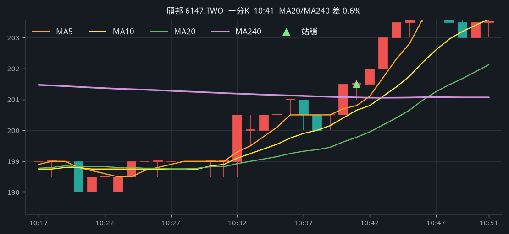
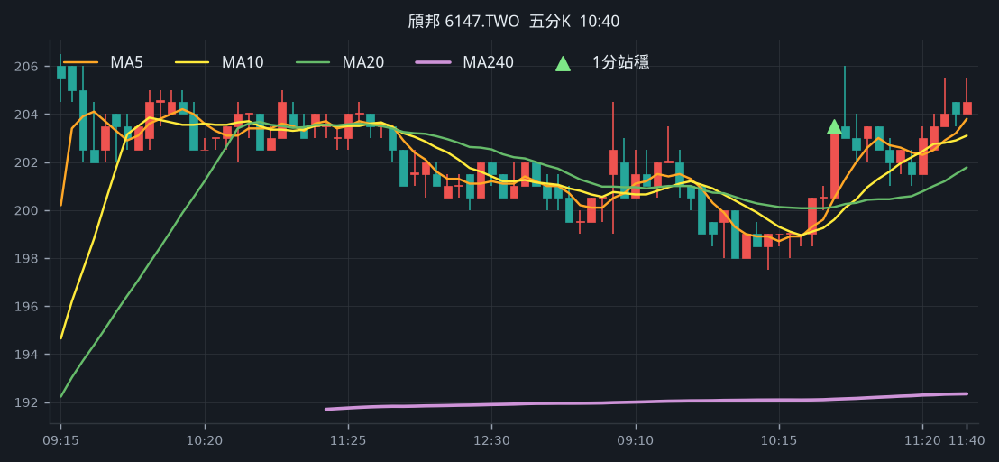
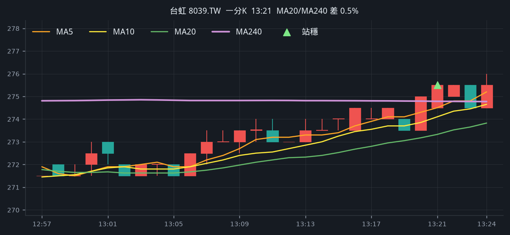
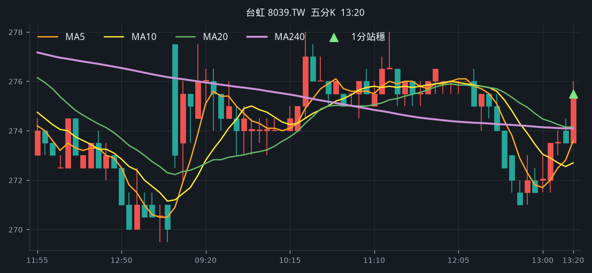
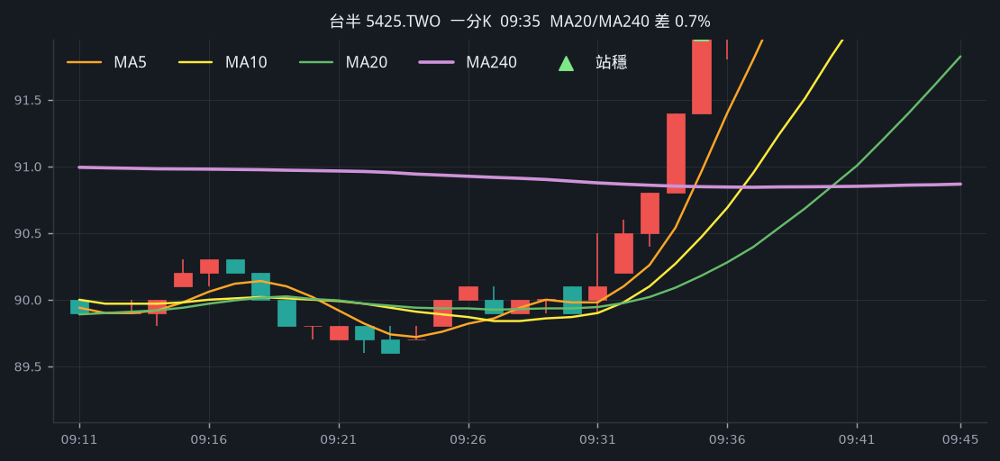
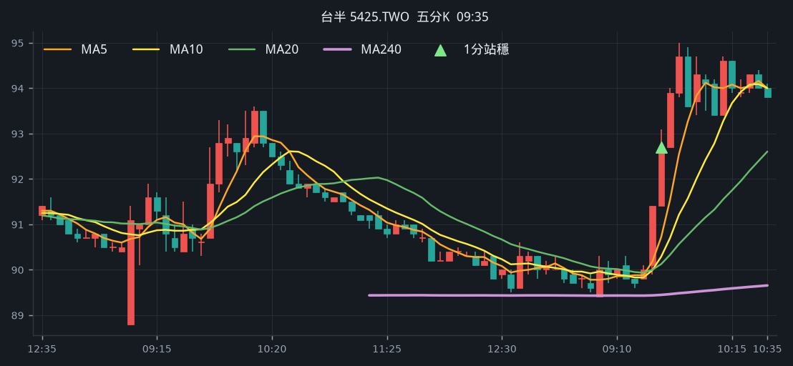
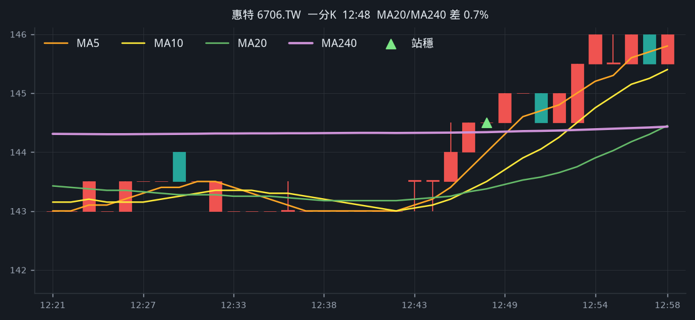
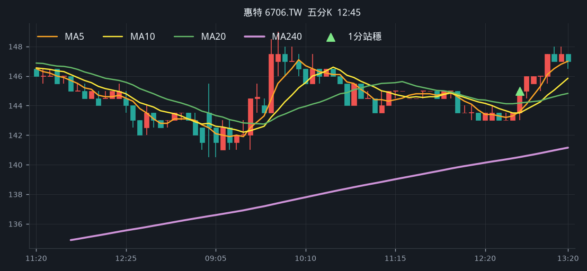

# 回測 2026-09-16（週三）· 一分K站穩 MA240

用 2026-09-16（週三）當天上市＋上櫃成交額前 200（盤後），濾掉 ETF、金融股與收盤價 650 以上。一分K MA5>MA10>MA20 且拉開（MA5−MA20 ≥ 0.4%），MA20 與 MA240 差距 0.4%～1.0%，從 240 下面穿上、連續兩根收盤站穩，時間 09:10 以後（開盤跳空不算）；含該根的五分K收盤也必須高於五分 MA240。

- 命中 **5** 檔
- 掃描時間 2026-09-19 02:11:04（台北）
- 排行 2026-09-16 盤後成交額
- 前 200 → 濾掉股價 54、ETF 19、金融 13 → 掃描 114 → 均線糾結 0 → MA20/MA240不符 0 → 五分MA240底下 5

## 1. 穩懋 [3105.TWO](https://tw.stock.yahoo.com/quote/3105.TWO)

- 價格 472.50 +4.07%　成交額排名 #11　134.10 億
- 1分站穩 09:14　收 463.50 > MA240 463.36
- 1分 MA5 462.00 > MA10 460.85 > MA20 459.30　MA20/MA240 差 0.9%
- 五分收盤 / MA240　463.50 > 452.45（+2.4%）

**一分 K**

**五分 K（對照）**

## 2. 頎邦 [6147.TWO](https://tw.stock.yahoo.com/quote/6147.TWO)

- 價格 207.50 +3.75%　成交額排名 #12　130.52 億
- 1分站穩 10:41　收 201.50 > MA240 201.07
- 1分 MA5 200.80 > MA10 200.65 > MA20 199.78　MA20/MA240 差 0.6%
- 五分收盤 / MA240　203.50 > 192.12（+5.9%）

**一分 K**

**五分 K（對照）**

## 3. 台虹 [8039.TW](https://tw.stock.yahoo.com/quote/8039.TW)

- 價格 275.50 +2.04%　成交額排名 #62　34.14 億
- 1分站穩 13:21　收 275.50 > MA240 274.78
- 1分 MA5 274.50 > MA10 274.10 > MA20 273.32　MA20/MA240 差 0.5%
- 五分收盤 / MA240　275.50 > 274.09（+0.5%）

**一分 K**

**五分 K（對照）**

## 4. 台半 [5425.TWO](https://tw.stock.yahoo.com/quote/5425.TWO)

- 價格 94.80 +6.04%　成交額排名 #84　23.60 億
- 1分站穩 09:35　收 92.00 > MA240 90.85
- 1分 MA5 90.96 > MA10 90.47 > MA20 90.18　MA20/MA240 差 0.7%
- 五分收盤 / MA240　92.70 > 89.45（+3.6%）

**一分 K**

**五分 K（對照）**

## 5. 惠特 [6706.TW](https://tw.stock.yahoo.com/quote/6706.TW)

- 價格 147.00 +2.44%　成交額排名 #107　16.73 億
- 1分站穩 12:48　收 144.50 > MA240 144.34
- 1分 MA5 144.00 > MA10 143.50 > MA20 143.38　MA20/MA240 差 0.7%
- 五分收盤 / MA240　145.00 > 140.51（+3.2%）

**一分 K**

**五分 K（對照）**

