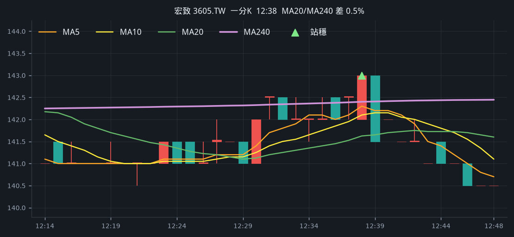
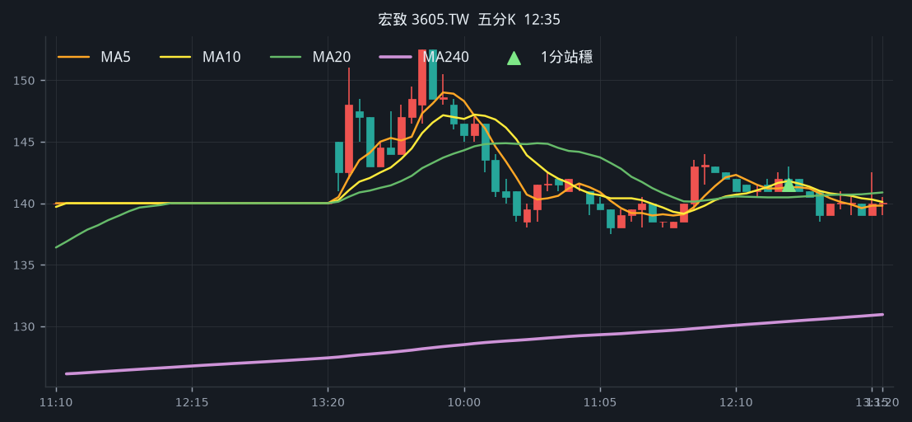
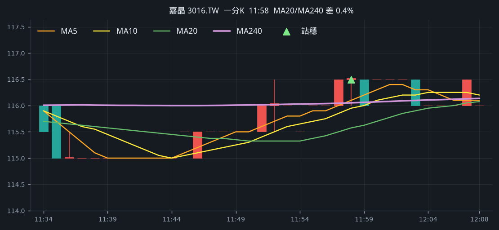
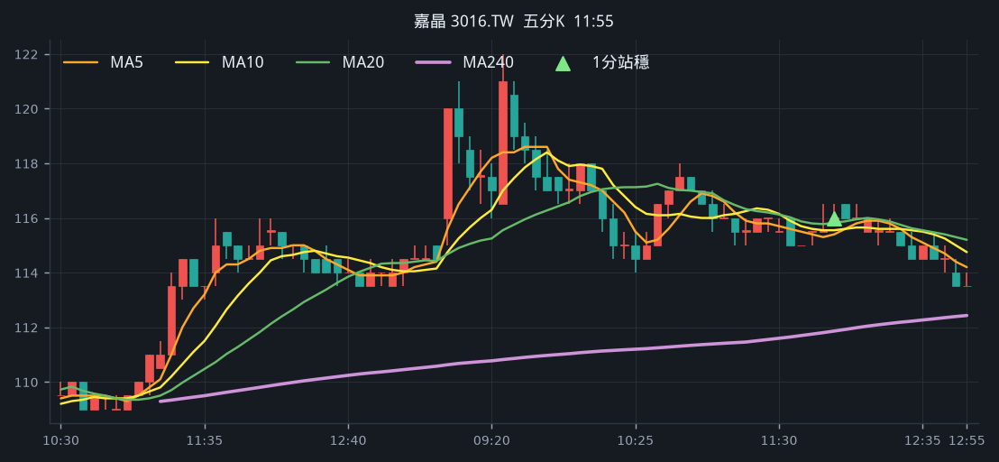
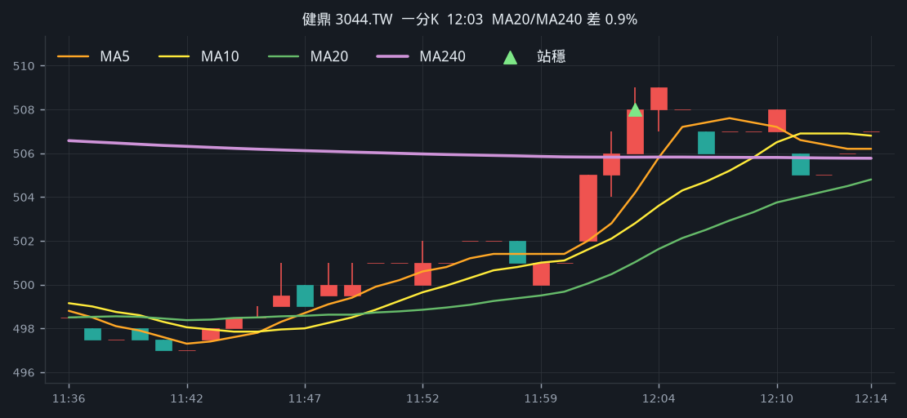
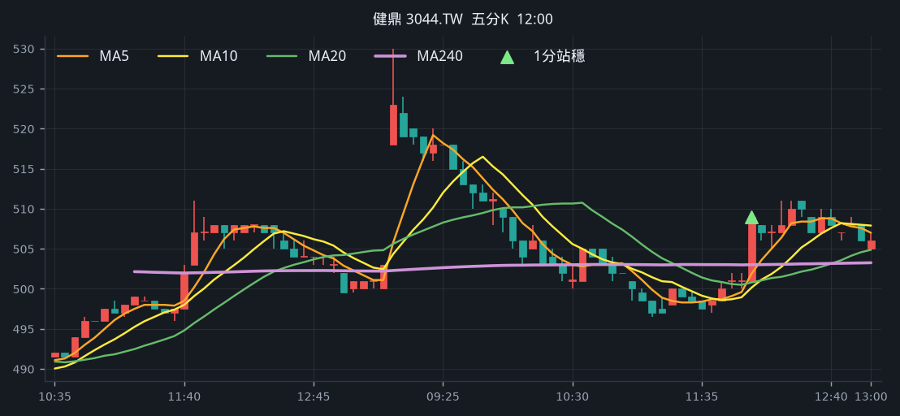
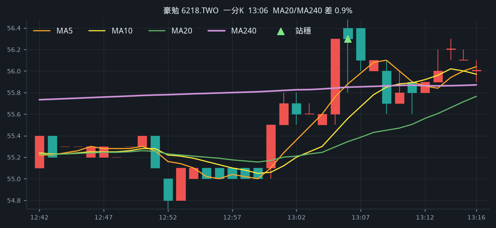
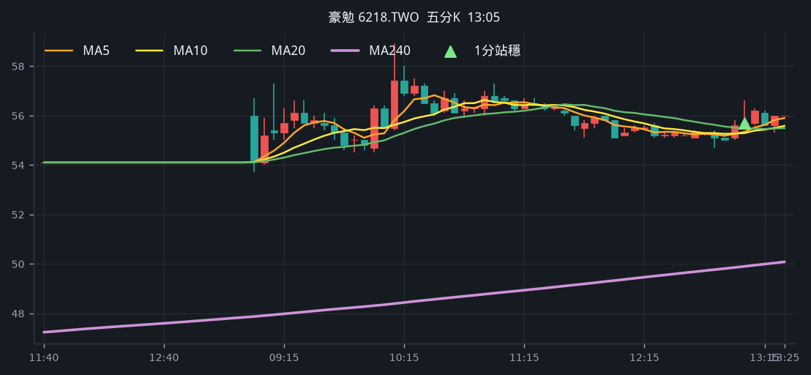

# 回測 2026-09-17（週四）· 一分K站穩 MA240

用 2026-09-17（週四）當天上市＋上櫃成交額前 200（盤後），濾掉 ETF、金融股與收盤價 650 以上。一分K MA5>MA10>MA20 且拉開（MA5−MA20 ≥ 0.4%），MA20 與 MA240 差距 0.4%～1.0%，從 240 下面穿上、連續兩根收盤站穩，時間 09:10 以後（開盤跳空不算）；含該根的五分K收盤也必須高於五分 MA240。

- 命中 **4** 檔
- 掃描時間 2026-09-19 02:11:22（台北）
- 排行 2026-09-17 盤後成交額
- 前 200 → 濾掉股價 56、ETF 17、金融 14 → 掃描 113 → 均線糾結 0 → MA20/MA240不符 0 → 五分MA240底下 1

## 1. 宏致 [3605.TW](https://tw.stock.yahoo.com/quote/3605.TW)

- 價格 140.00 +0.00%　成交額排名 #50　60.25 億
- 1分站穩 12:38　收 143.00 > MA240 142.40
- 1分 MA5 142.30 > MA10 142.10 > MA20 141.62　MA20/MA240 差 0.5%
- 五分收盤 / MA240　141.50 > 130.39（+8.5%）

**一分 K**

**五分 K（對照）**

## 2. 嘉晶 [3016.TW](https://tw.stock.yahoo.com/quote/3016.TW)

- 價格 115.50 +0.00%　成交額排名 #87　28.60 億
- 1分站穩 11:58　收 116.50 > MA240 116.05
- 1分 MA5 116.10 > MA10 115.95 > MA20 115.58　MA20/MA240 差 0.4%
- 五分收盤 / MA240　116.00 > 111.86（+3.7%）

**一分 K**

**五分 K（對照）**

## 3. 健鼎 [3044.TW](https://tw.stock.yahoo.com/quote/3044.TW)

- 價格 502.00 -0.40%　成交額排名 #101　24.43 億
- 1分站穩 12:03　收 508.00 > MA240 505.82
- 1分 MA5 504.20 > MA10 502.80 > MA20 501.02　MA20/MA240 差 0.9%
- 五分收盤 / MA240　509.00 > 503.01（+1.2%）

**一分 K**

**五分 K（對照）**

## 4. 豪勉 [6218.TWO](https://tw.stock.yahoo.com/quote/6218.TWO)

- 價格 56.00 +3.51%　成交額排名 #141　13.70 億
- 1分站穩 13:06　收 56.30 > MA240 55.85
- 1分 MA5 55.88 > MA10 55.56 > MA20 55.34　MA20/MA240 差 0.9%
- 五分收盤 / MA240　55.70 > 49.90（+11.6%）

**一分 K**

**五分 K（對照）**

