# 回測 2026-09-18（週五）· 一分K站穩 MA240

用 2026-09-18（週五）當天上市＋上櫃成交額前 200（盤後），濾掉 ETF、金融股與收盤價 650 以上。一分K MA5>MA10>MA20 且拉開（MA5−MA20 ≥ 0.4%），MA20 與 MA240 差距 0.4%～1.0%，從 240 下面穿上、連續兩根收盤站穩，時間 09:10 以後（開盤跳空不算）；含該根的五分K收盤也必須高於五分 MA240。

- 命中 **10** 檔
- 掃描時間 2026-09-19 02:11:38（台北）
- 排行 2026-09-18 盤後成交額
- 前 200 → 濾掉股價 59、ETF 14、金融 13 → 掃描 114 → 均線糾結 0 → MA20/MA240不符 0 → 五分MA240底下 1

## 1. 全新 [2455.TW](https://tw.stock.yahoo.com/quote/2455.TW)

- 價格 556.00 +4.12%　成交額排名 #34　108.96 億
- 1分站穩 10:06　收 531.00 > MA240 528.89
- 1分 MA5 528.60 > MA10 527.10 > MA20 526.20　MA20/MA240 差 0.5%
- 五分收盤 / MA240　532.00 > 524.95（+1.3%）

**一分 K**

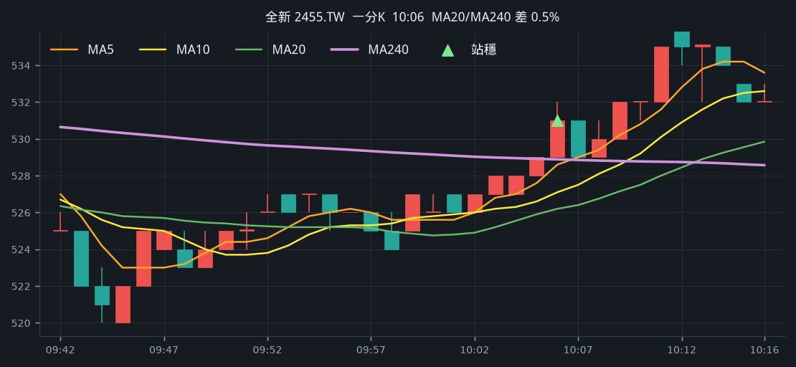

**五分 K（對照）**

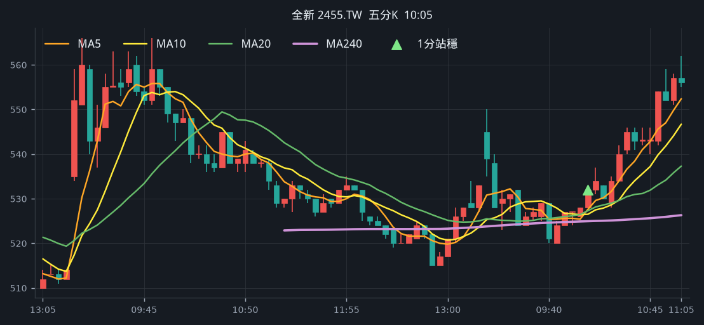

## 2. 友達 [2409.TW](https://tw.stock.yahoo.com/quote/2409.TW)

- 價格 30.35 +1.17%　成交額排名 #36　104.72 億
- 1分站穩 12:51　收 29.95 > MA240 29.73
- 1分 MA5 29.73 > MA10 29.65 > MA20 29.59　MA20/MA240 差 0.5%
- 五分收盤 / MA240　30.05 > 29.18（+3.0%）

**一分 K**

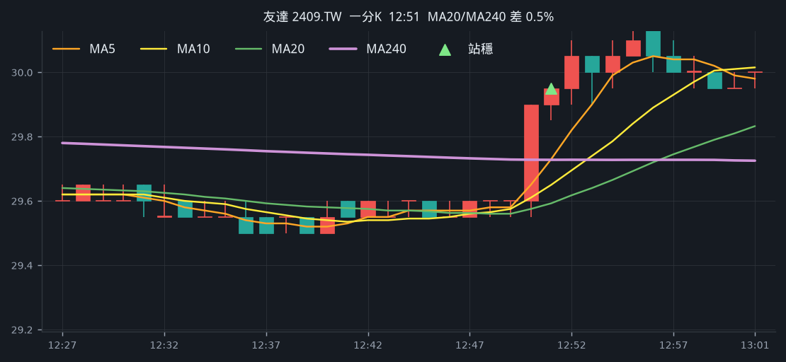

**五分 K（對照）**

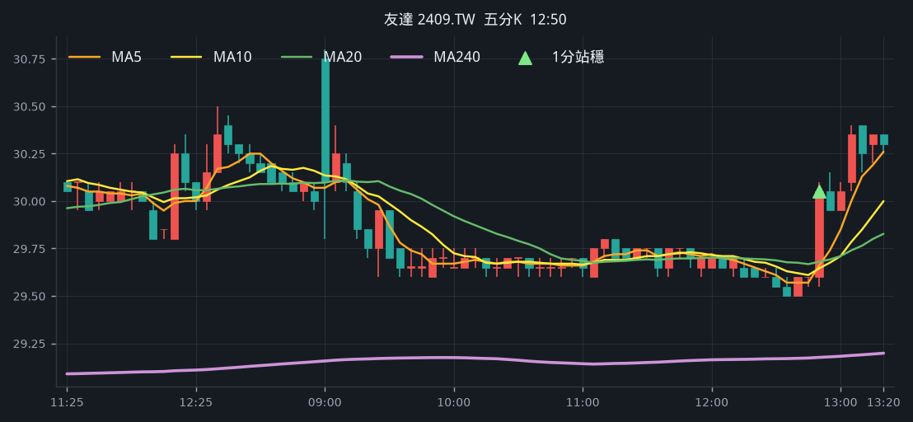

## 3. 世界 [5347.TWO](https://tw.stock.yahoo.com/quote/5347.TWO)

- 價格 172.00 +3.93%　成交額排名 #66　54.59 億
- 1分站穩 13:08　收 170.00 > MA240 169.63
- 1分 MA5 169.30 > MA10 168.35 > MA20 167.97　MA20/MA240 差 1.0%
- 五分收盤 / MA240　170.00 > 161.07（+5.5%）

**一分 K**

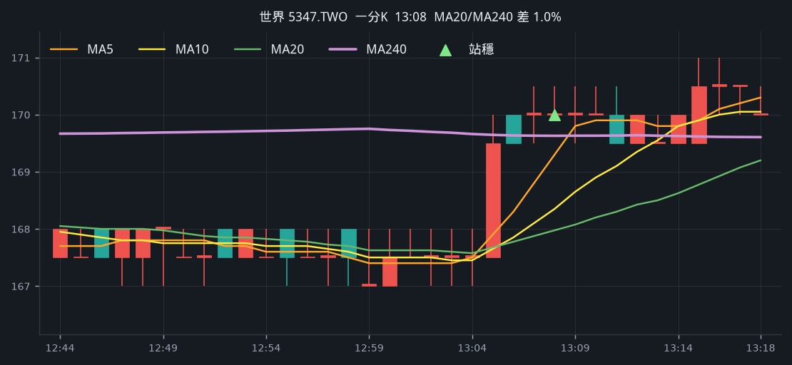

**五分 K（對照）**

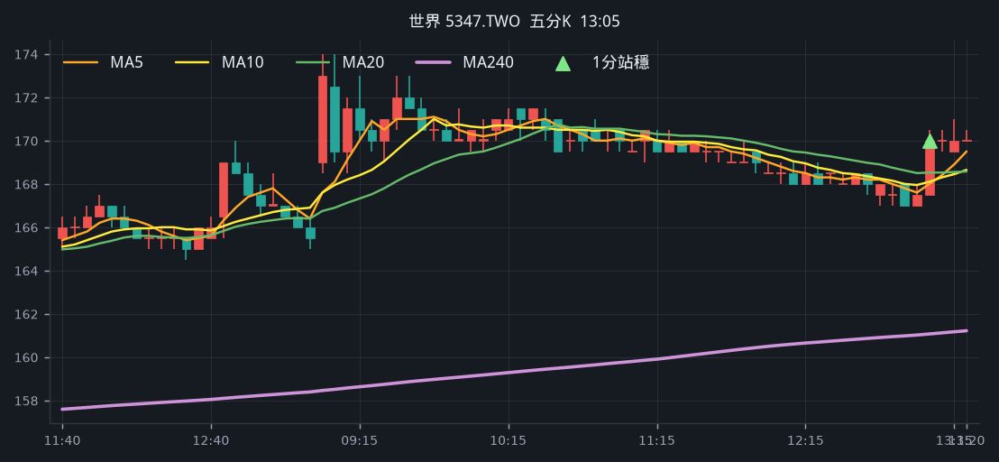

## 4. 尖點 [8021.TW](https://tw.stock.yahoo.com/quote/8021.TW)

- 價格 460.00 +2.22%　成交額排名 #86　38.19 億
- 1分站穩 13:01　收 454.00 > MA240 453.37
- 1分 MA5 453.70 > MA10 452.15 > MA20 450.98　MA20/MA240 差 0.5%
- 五分收盤 / MA240　453.50 > 443.14（+2.3%）

**一分 K**

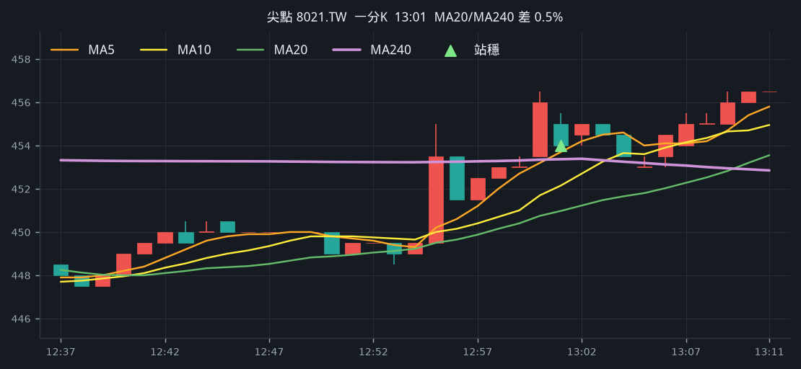

**五分 K（對照）**

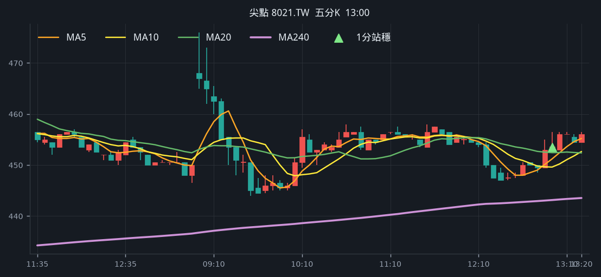

## 5. 瑞軒 [2489.TW](https://tw.stock.yahoo.com/quote/2489.TW)

- 價格 44.15 +2.20%　成交額排名 #93　34.83 億
- 1分站穩 10:23　收 43.50 > MA240 43.37
- 1分 MA5 43.29 > MA10 43.06 > MA20 43.00　MA20/MA240 差 0.9%
- 五分收盤 / MA240　43.55 > 40.36（+7.9%）

**一分 K**

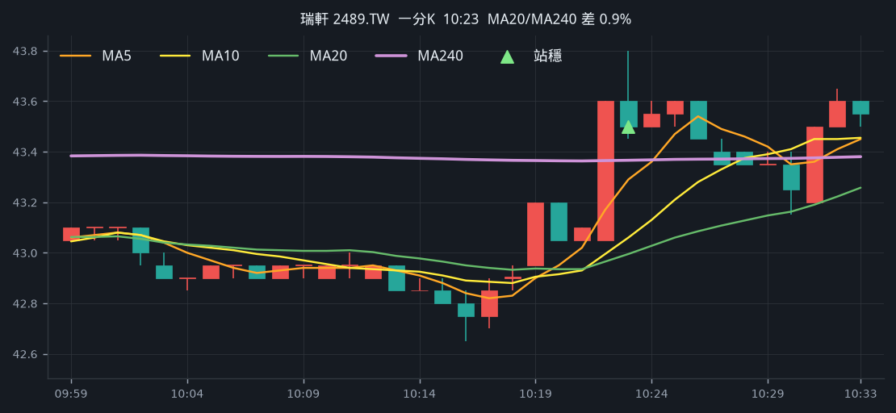

**五分 K（對照）**

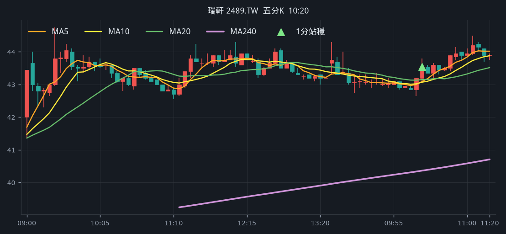

## 6. 嘉基 [6715.TW](https://tw.stock.yahoo.com/quote/6715.TW)

- 價格 433.00 +9.90%　成交額排名 #131　19.10 億
- 1分站穩 09:43　收 416.00 > MA240 408.87
- 1分 MA5 408.40 > MA10 406.15 > MA20 405.05　MA20/MA240 差 0.9%
- 五分收盤 / MA240　415.50 > 369.93（+12.3%）

**一分 K**

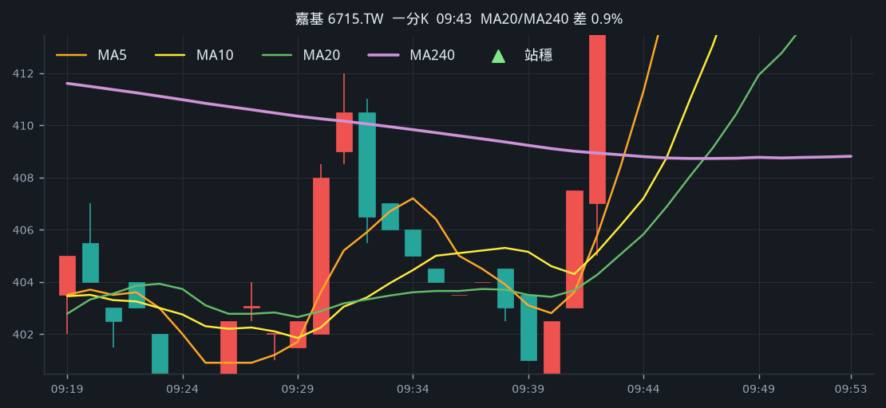

**五分 K（對照）**

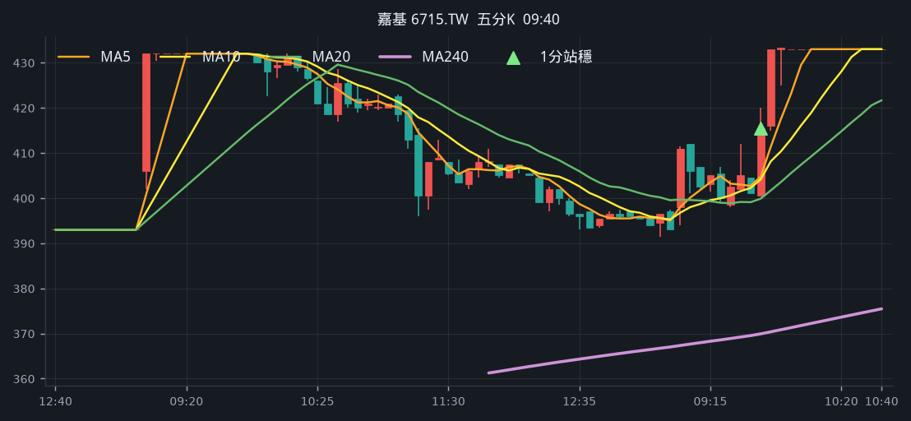

## 7. 前鼎 [4908.TWO](https://tw.stock.yahoo.com/quote/4908.TWO)

- 價格 243.50 +2.31%　成交額排名 #138　18.22 億
- 1分站穩 12:42　收 236.50 > MA240 235.89
- 1分 MA5 235.80 > MA10 235.10 > MA20 234.70　MA20/MA240 差 0.5%
- 五分收盤 / MA240　236.50 > 234.66（+0.8%）

**一分 K**

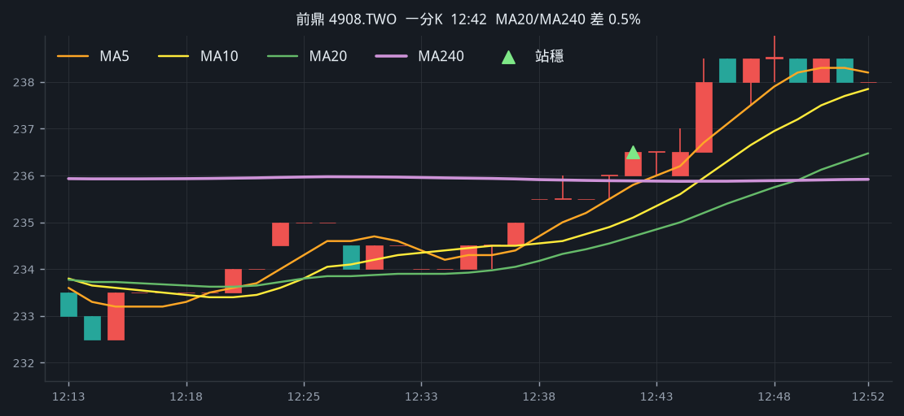

**五分 K（對照）**

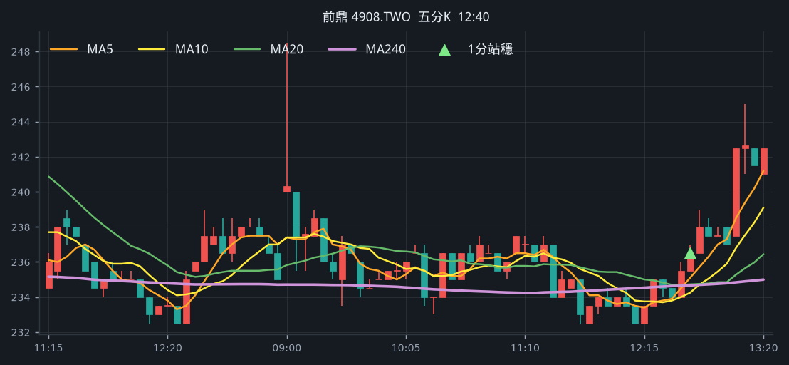

## 8. 中華化 [1727.TW](https://tw.stock.yahoo.com/quote/1727.TW)

- 價格 106.00 +0.95%　成交額排名 #143　17.43 億
- 1分站穩 10:24　收 104.50 > MA240 104.42
- 1分 MA5 104.20 > MA10 104.00 > MA20 103.42　MA20/MA240 差 1.0%
- 五分收盤 / MA240　104.50 > 94.95（+10.1%）

**一分 K**

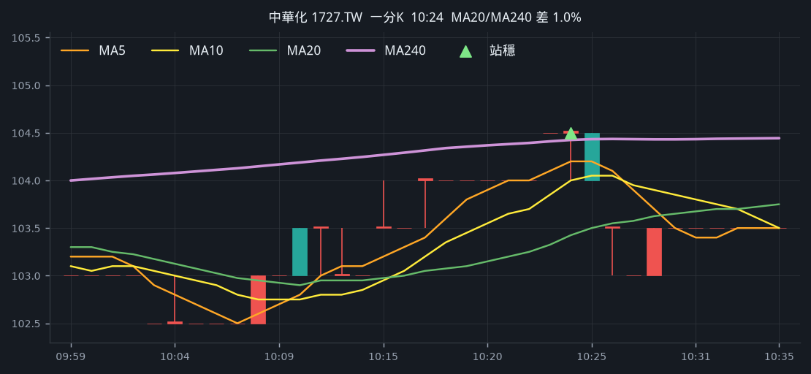

**五分 K（對照）**

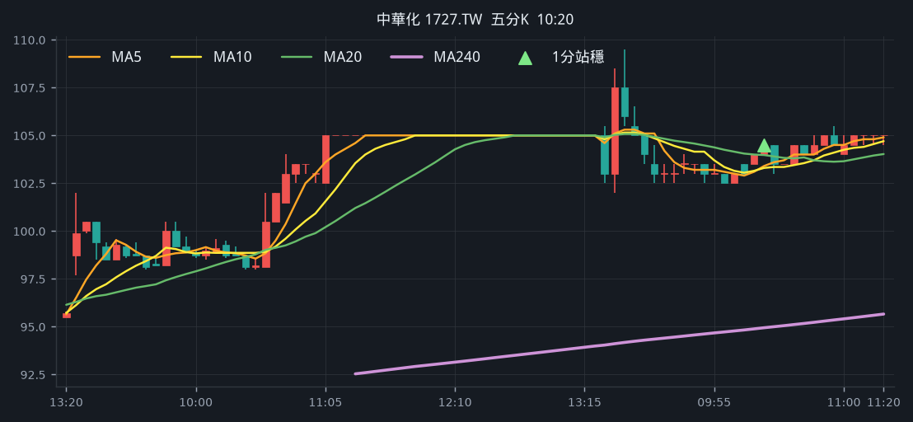

## 9. 萊德光電-KY [7717.TWO](https://tw.stock.yahoo.com/quote/7717.TWO)

- 價格 600.00 +3.63%　成交額排名 #172　12.47 億
- 1分站穩 13:04　收 605.00 > MA240 603.48
- 1分 MA5 603.60 > MA10 602.80 > MA20 600.15　MA20/MA240 差 0.5%
- 五分收盤 / MA240　605.00 > 539.11（+12.2%）

**一分 K**

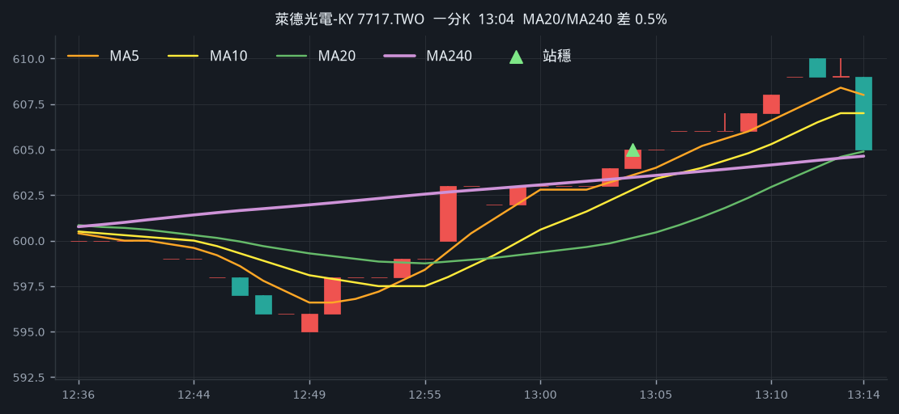

**五分 K（對照）**

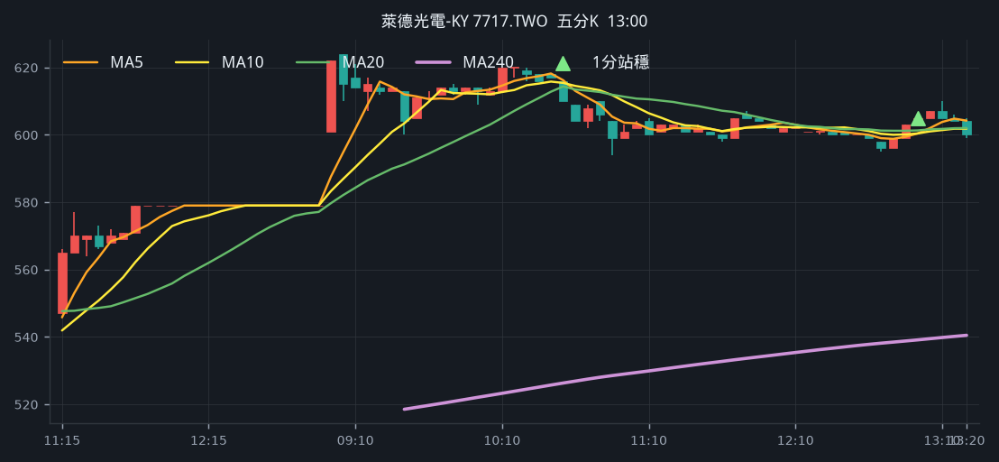

## 10. IET-KY [4971.TWO](https://tw.stock.yahoo.com/quote/4971.TWO)

- 價格 592.00 +6.67%　成交額排名 #175　12.25 億
- 1分站穩 09:50　收 567.00 > MA240 566.60
- 1分 MA5 566.40 > MA10 564.40 > MA20 562.60　MA20/MA240 差 0.7%
- 五分收盤 / MA240　568.00 > 556.09（+2.1%）

**一分 K**

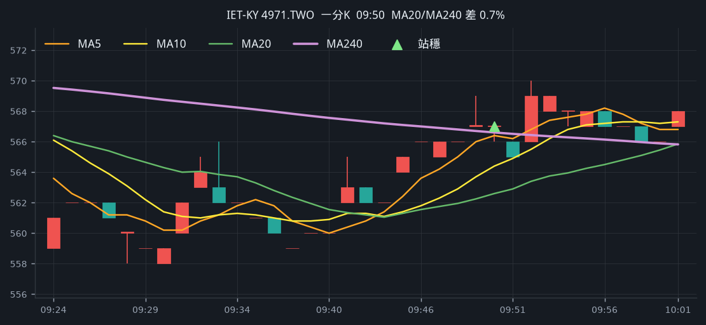

**五分 K（對照）**

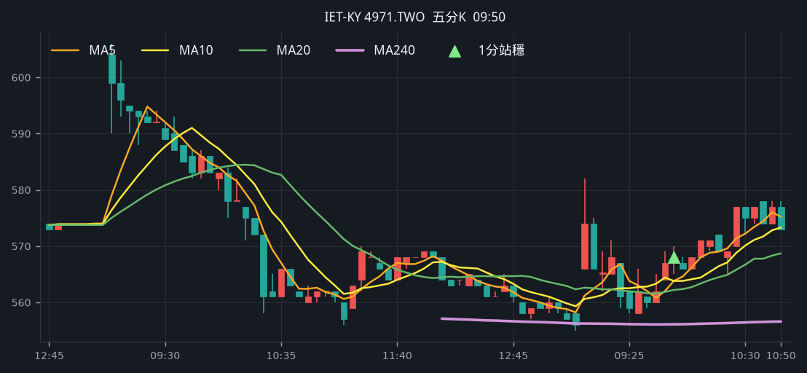

