# 回測 2026-09-21（週一）· 一分K站穩 MA240

用 2026-09-21（週一）當天上市＋上櫃成交額前 200（盤後），濾掉 ETF、金融股與收盤價 650 以上。一分K MA5>MA10>MA20 且拉開（MA5−MA20 ≥ 0.4%），MA20 與 MA240 差距 0.4%～1.0%，從 240 下面穿上、連續兩根收盤站穩，時間 09:10 以後（開盤跳空不算）；含該根的五分K收盤也必須高於五分 MA240。

- 命中 **13** 檔
- 掃描時間 2026-09-22 01:28:09（台北）
- 排行 2026-09-21 盤後成交額
- 前 200 → 濾掉股價 58、ETF 19、金融 9 → 掃描 114 → 均線糾結 0 → MA20/MA240不符 0 → 五分MA240底下 1

## 1. 聯電 [2303.TW](https://tw.stock.yahoo.com/quote/2303.TW)

- 價格 157.00 +0.64%　成交額排名 #5　247.27 億
- 1分站穩 10:10　收 155.50 > MA240 155.21
- 1分 MA5 155.10 > MA10 154.60 > MA20 154.28　MA20/MA240 差 0.6%
- 五分收盤 / MA240　155.00 > 146.25（+6.0%）

**一分 K**

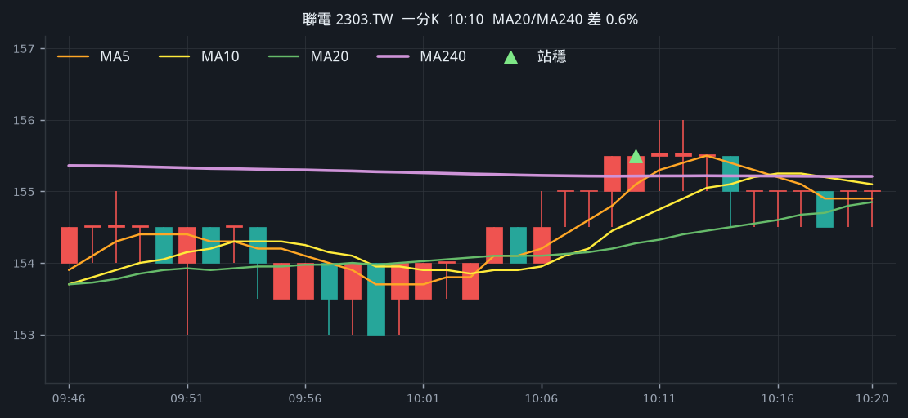

**五分 K（對照）**

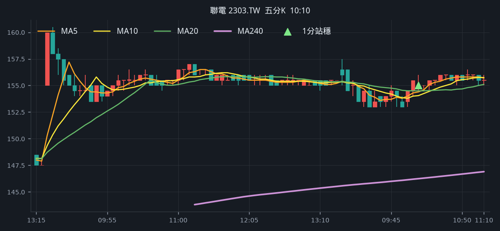

## 2. 京元電子 [2449.TW](https://tw.stock.yahoo.com/quote/2449.TW)

- 價格 301.50 +3.43%　成交額排名 #10　169.51 億
- 1分站穩 13:10　收 302.00 > MA240 301.35
- 1分 MA5 301.30 > MA10 300.55 > MA20 300.07　MA20/MA240 差 0.4%
- 五分收盤 / MA240　301.00 > 275.70（+9.2%）

**一分 K**

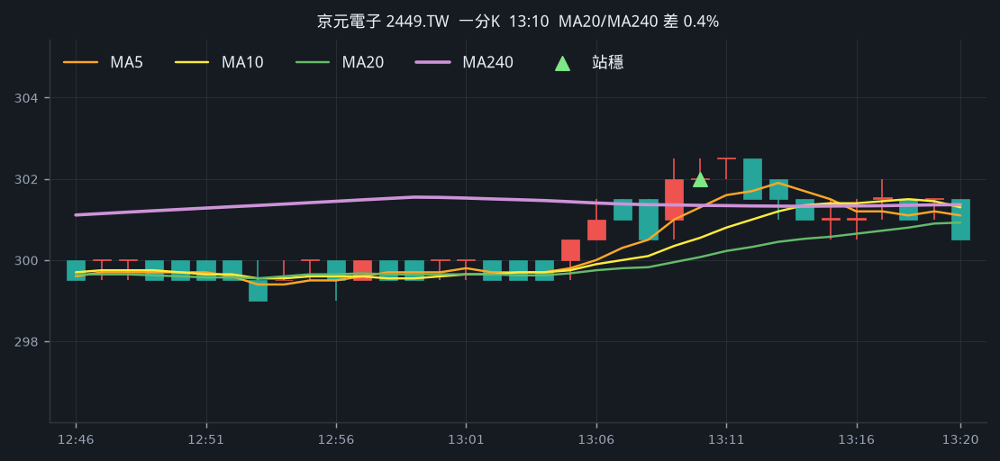

**五分 K（對照）**

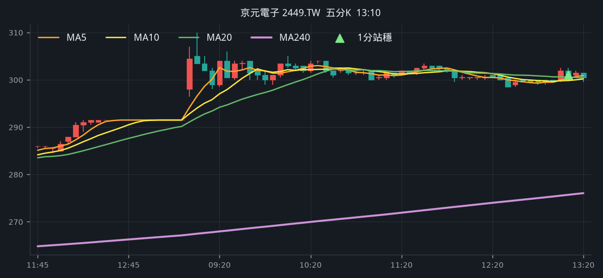

## 3. 光頡 [3624.TWO](https://tw.stock.yahoo.com/quote/3624.TWO)

- 價格 132.50 +5.16%　成交額排名 #61　44.24 億
- 1分站穩 13:08　收 136.50 > MA240 134.07
- 1分 MA5 134.50 > MA10 133.95 > MA20 133.45　MA20/MA240 差 0.5%
- 五分收盤 / MA240　135.00 > 124.18（+8.7%）

**一分 K**

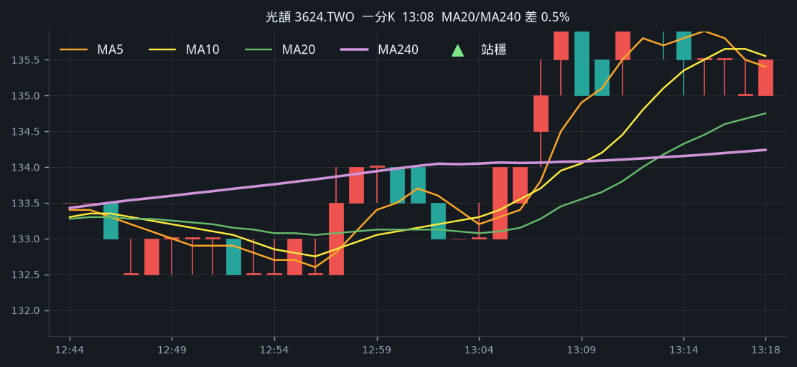

**五分 K（對照）**

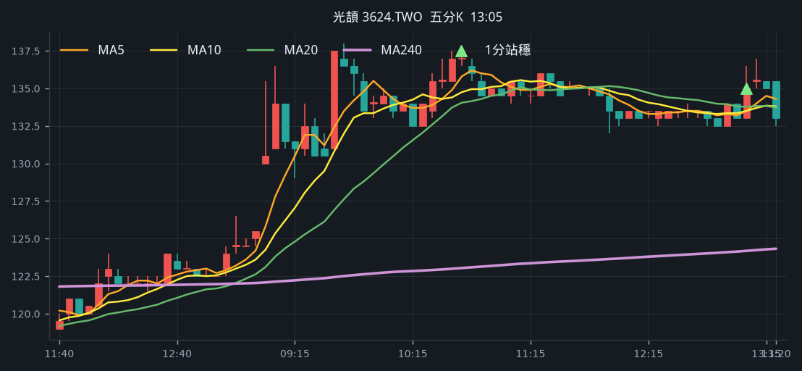

## 4. 精材 [3374.TWO](https://tw.stock.yahoo.com/quote/3374.TWO)

- 價格 443.00 -0.34%　成交額排名 #64　42.90 億
- 1分站穩 10:21　收 437.50 > MA240 437.45
- 1分 MA5 437.20 > MA10 436.40 > MA20 435.35　MA20/MA240 差 0.5%
- 五分收盤 / MA240　436.50 > 428.03（+2.0%）

**一分 K**

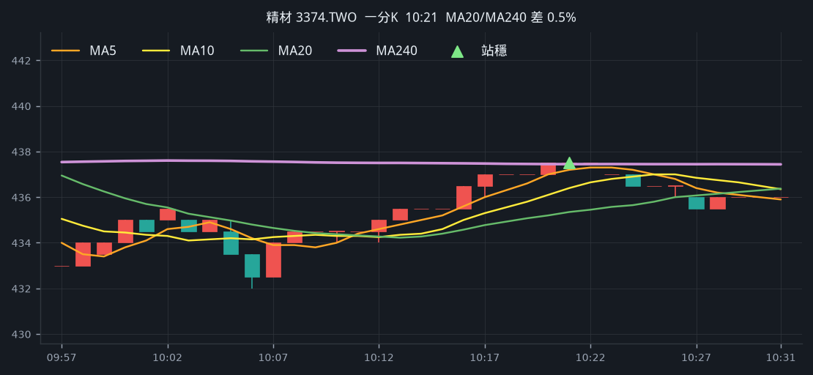

**五分 K（對照）**

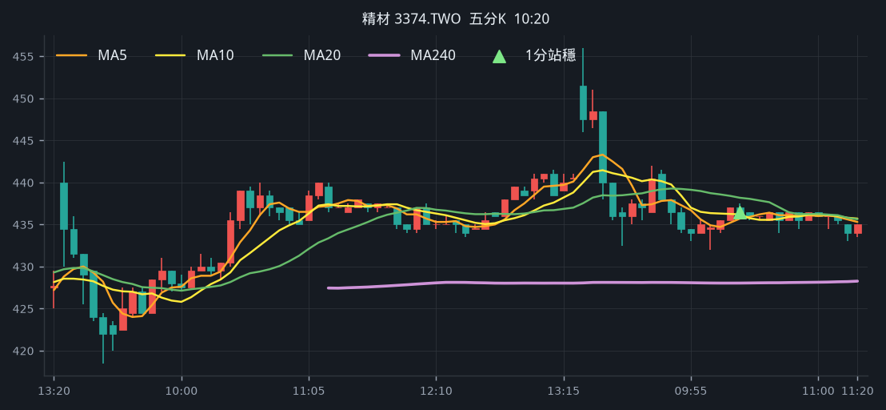

## 5. 尖點 [8021.TW](https://tw.stock.yahoo.com/quote/8021.TW)

- 價格 466.00 +1.30%　成交額排名 #70　39.62 億
- 1分站穩 12:36　收 467.50 > MA240 465.40
- 1分 MA5 465.20 > MA10 463.85 > MA20 462.23　MA20/MA240 差 0.7%
- 五分收盤 / MA240　465.00 > 448.81（+3.6%）

**一分 K**

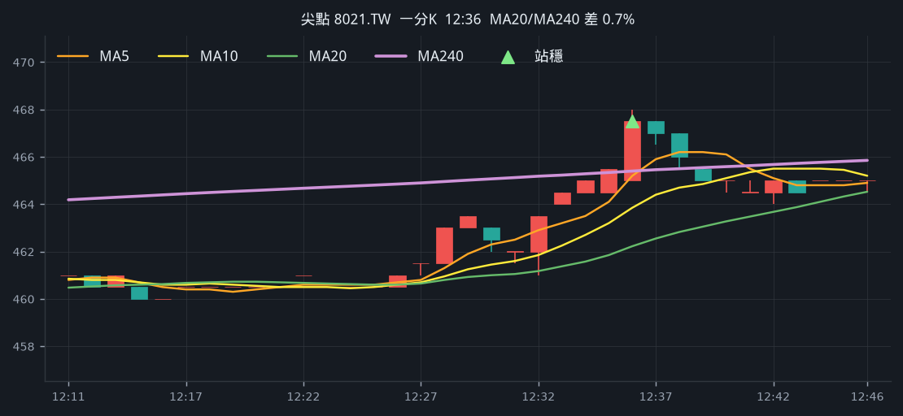

**五分 K（對照）**

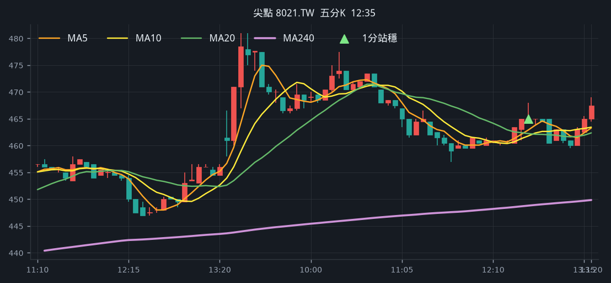

## 6. 晶豪科 [3006.TW](https://tw.stock.yahoo.com/quote/3006.TW)

- 價格 285.00 -2.06%　成交額排名 #76　32.09 億
- 1分站穩 11:46　收 286.00 > MA240 285.45
- 1分 MA5 285.40 > MA10 284.80 > MA20 284.12　MA20/MA240 差 0.5%
- 五分收盤 / MA240　285.00 > 278.57（+2.3%）

**一分 K**

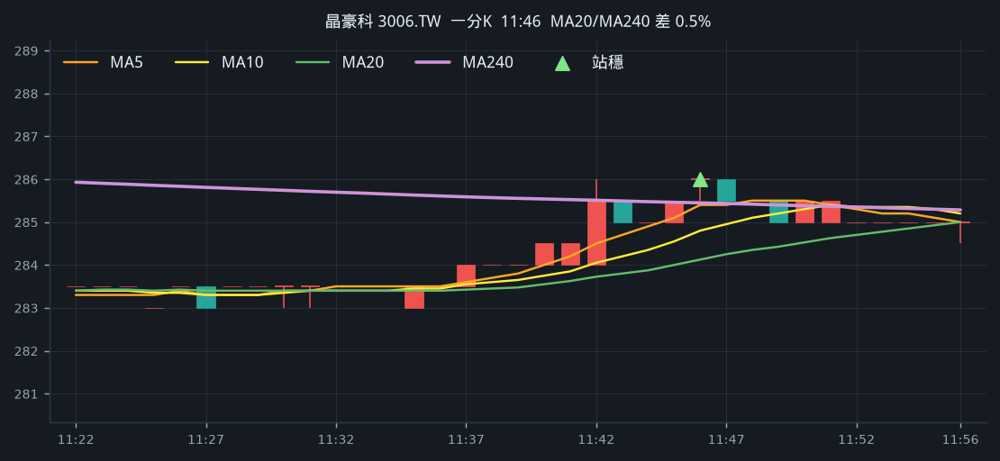

**五分 K（對照）**

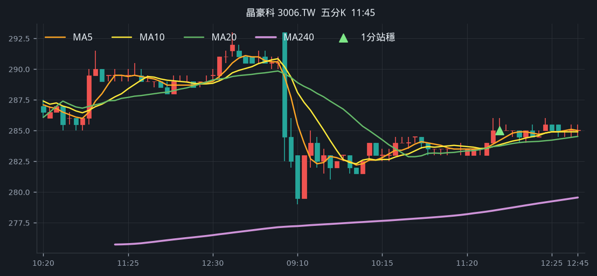

## 7. 長榮 [2603.TW](https://tw.stock.yahoo.com/quote/2603.TW)

- 價格 242.00 +0.62%　成交額排名 #118　15.13 億
- 1分站穩 09:43　收 240.00 > MA240 239.93
- 1分 MA5 239.40 > MA10 238.60 > MA20 238.15　MA20/MA240 差 0.7%
- 五分收盤 / MA240　240.00 > 237.58（+1.0%）

**一分 K**

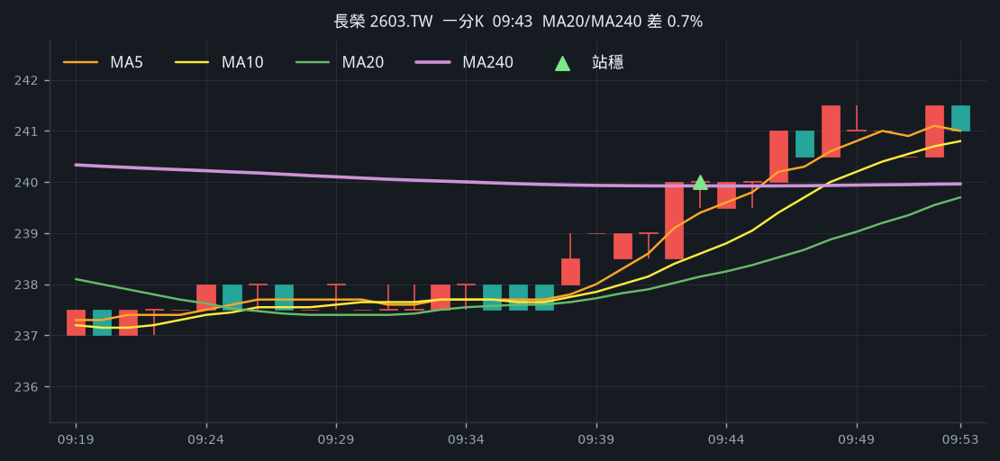

**五分 K（對照）**

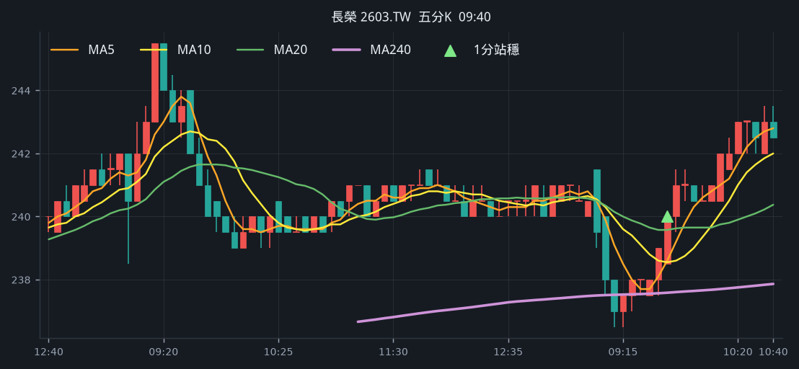

## 8. 環科 [2413.TW](https://tw.stock.yahoo.com/quote/2413.TW)

- 價格 54.00 +1.69%　成交額排名 #126　14.06 億
- 1分站穩 09:17　收 53.70 > MA240 53.47
- 1分 MA5 53.24 > MA10 53.10 > MA20 52.99　MA20/MA240 差 0.9%
- 五分收盤 / MA240　53.50 > 51.87（+3.1%）

**一分 K**

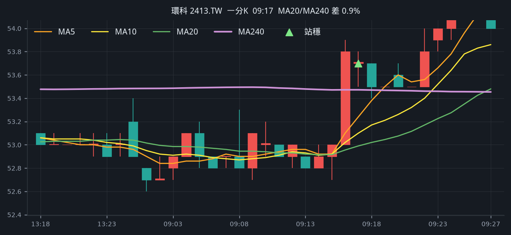

**五分 K（對照）**

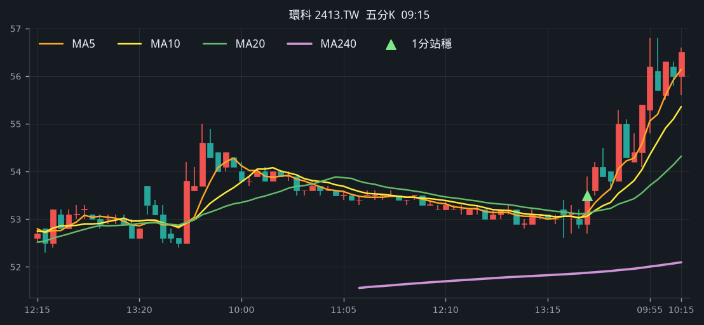

## 9. 陽明 [2609.TW](https://tw.stock.yahoo.com/quote/2609.TW)

- 價格 61.10 +0.16%　成交額排名 #128　13.52 億
- 1分站穩 09:43　收 60.80 > MA240 60.71
- 1分 MA5 60.64 > MA10 60.42 > MA20 60.32　MA20/MA240 差 0.6%
- 五分收盤 / MA240　60.90 > 60.24（+1.1%）

**一分 K**

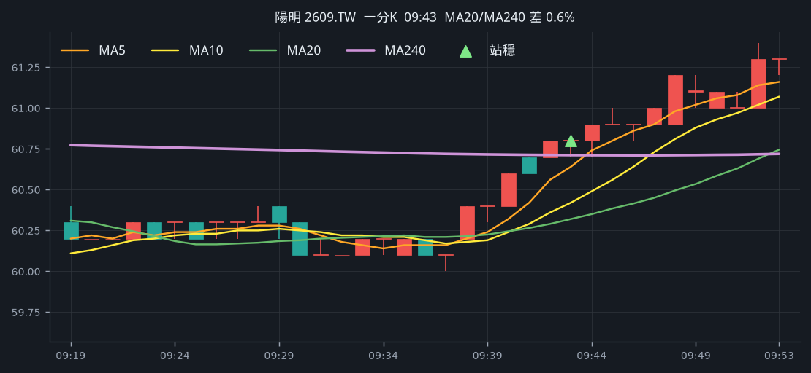

**五分 K（對照）**

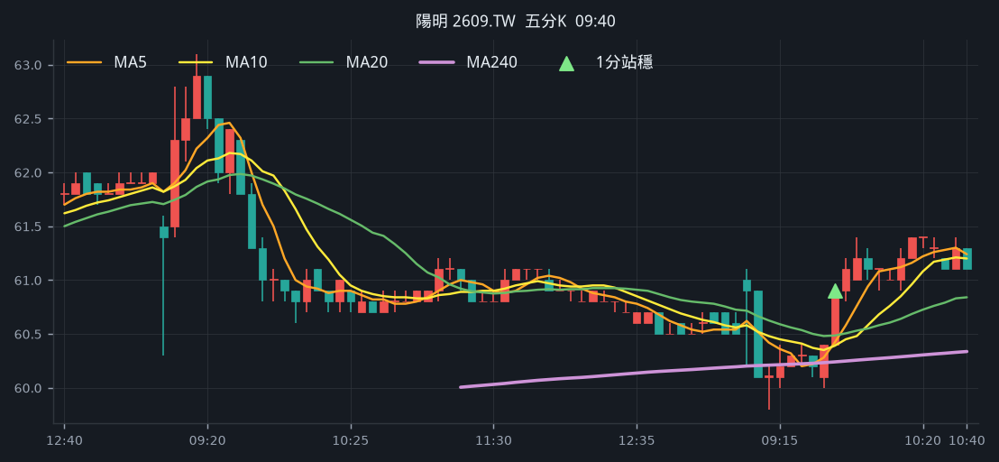

## 10. 瀚荃 [8103.TW](https://tw.stock.yahoo.com/quote/8103.TW)

- 價格 128.50 -0.77%　成交額排名 #145　10.64 億
- 1分站穩 10:49　收 126.50 > MA240 125.86
- 1分 MA5 125.80 > MA10 125.40 > MA20 125.22　MA20/MA240 差 0.5%
- 五分收盤 / MA240　126.50 > 122.42（+3.3%）

**一分 K**

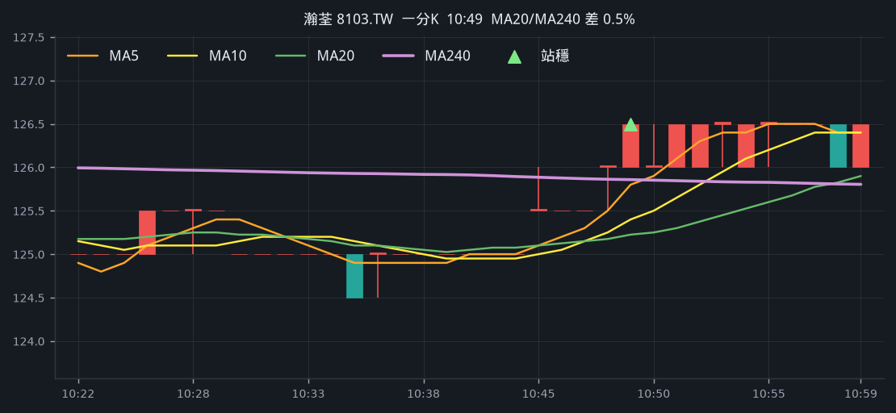

**五分 K（對照）**

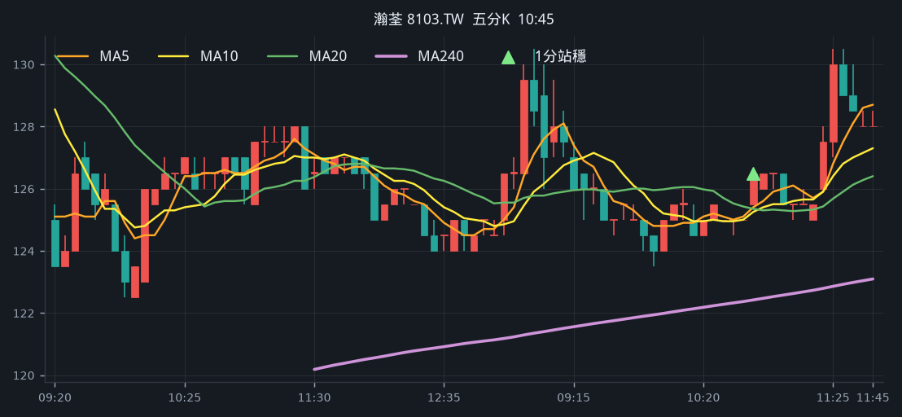

## 11. 前鼎 [4908.TWO](https://tw.stock.yahoo.com/quote/4908.TWO)

- 價格 232.00 -4.72%　成交額排名 #152　10.18 億
- 1分站穩 11:29　收 238.00 > MA240 237.58
- 1分 MA5 237.70 > MA10 237.30 > MA20 236.38　MA20/MA240 差 0.5%
- 五分收盤 / MA240　238.00 > 236.23（+0.7%）

**一分 K**

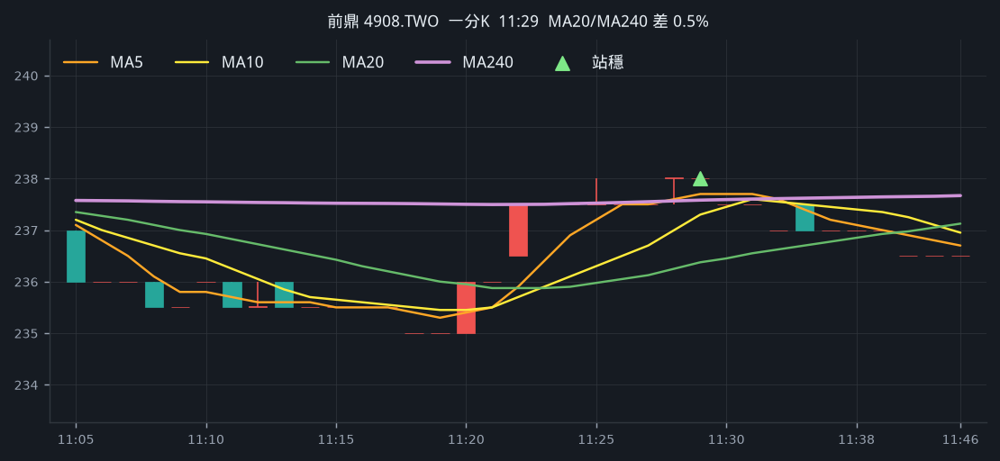

**五分 K（對照）**

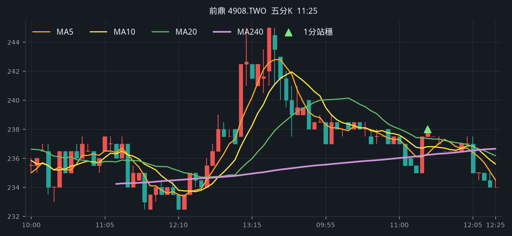

## 12. 統新 [6426.TW](https://tw.stock.yahoo.com/quote/6426.TW)

- 價格 374.00 +0.13%　成交額排名 #155　9.74 億
- 1分站穩 13:01　收 367.00 > MA240 365.28
- 1分 MA5 365.00 > MA10 363.35 > MA20 362.75　MA20/MA240 差 0.7%
- 五分收盤 / MA240　372.50 > 347.27（+7.3%）

**一分 K**

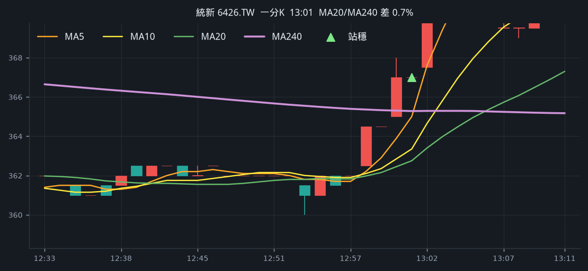

**五分 K（對照）**

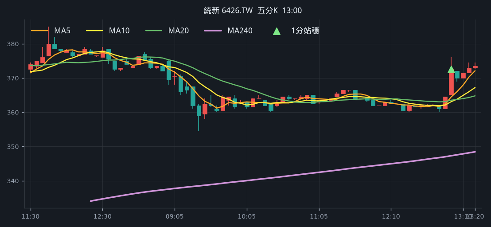

## 13. 良維 [6290.TWO](https://tw.stock.yahoo.com/quote/6290.TWO)

- 價格 281.00 -0.53%　成交額排名 #171　8.75 億
- 1分站穩 10:02　收 282.50 > MA240 282.33
- 1分 MA5 282.00 > MA10 280.80 > MA20 280.38　MA20/MA240 差 0.7%
- 五分收盤 / MA240　281.00 > 268.55（+4.6%）

**一分 K**

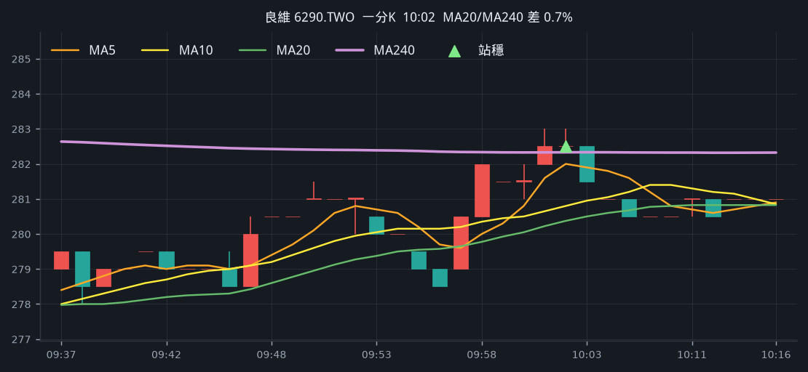

**五分 K（對照）**

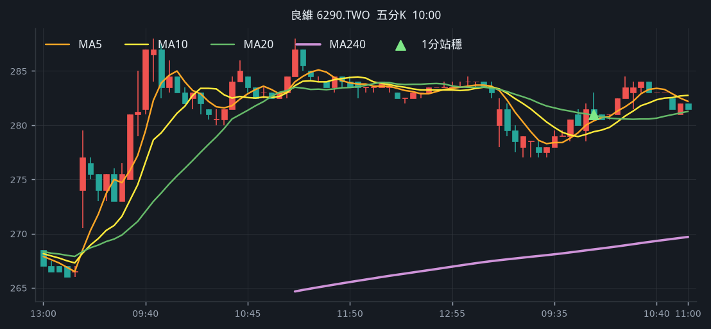

