# 回測 2026-09-22（週二）· 一分K站穩 MA240

用 2026-09-22（週二）當天上市＋上櫃成交額前 200（盤後），濾掉 ETF、金融股與收盤價 650 以上。一分K MA5>MA10>MA20 且拉開（MA5−MA20 ≥ 0.4%），MA20 與 MA240 差距 0.4%～1.0%，從 240 下面穿上、連續兩根收盤站穩，時間 09:10 以後（開盤跳空不算）；含該根的五分K收盤也必須高於五分 MA240。

- 命中 **8** 檔
- 掃描時間 2026-09-30 22:54:25（台北）
- 排行 2026-09-22 盤後成交額
- 前 200 → 濾掉股價 58、ETF 25、金融 8 → 掃描 109 → 均線糾結 0 → MA20/MA240不符 0 → 五分MA240底下 1

## 1. 聯鈞 [3450.TW](https://tw.stock.yahoo.com/quote/3450.TW)

- 價格 526.00 -3.49%　成交額排名 #72　46.60 億
- 1分站穩 09:34　收 549.00 > MA240 546.82
- 1分 MA5 545.00 > MA10 544.10 > MA20 542.15　MA20/MA240 差 0.9%
- 五分收盤 / MA240　549.00 > 534.69（+2.7%）

**一分 K**

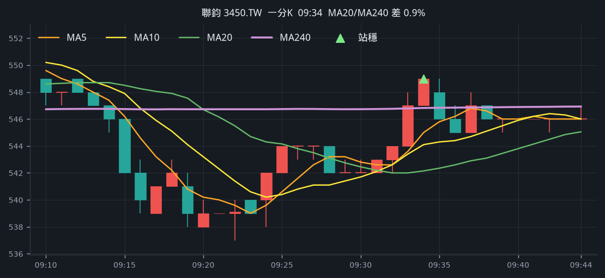

**五分 K（對照）**

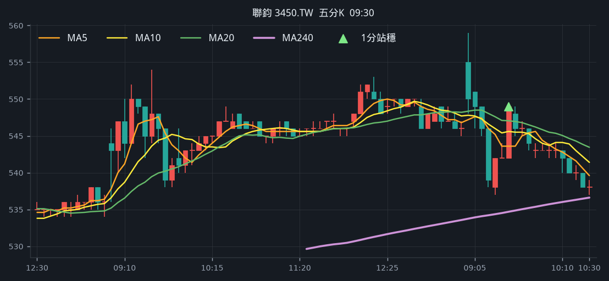

## 2. 晶豪科 [3006.TW](https://tw.stock.yahoo.com/quote/3006.TW)

- 價格 278.50 -2.28%　成交額排名 #96　27.53 億
- 1分站穩 11:22　收 283.50 > MA240 283.09
- 1分 MA5 282.70 > MA10 282.00 > MA20 281.38　MA20/MA240 差 0.6%
- 五分收盤 / MA240　283.50 > 282.21（+0.5%）

**一分 K**

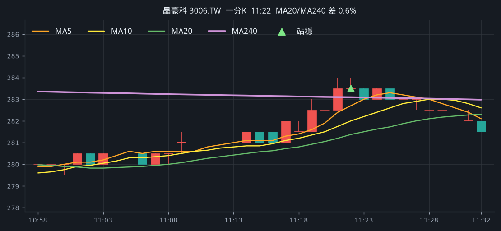

**五分 K（對照）**

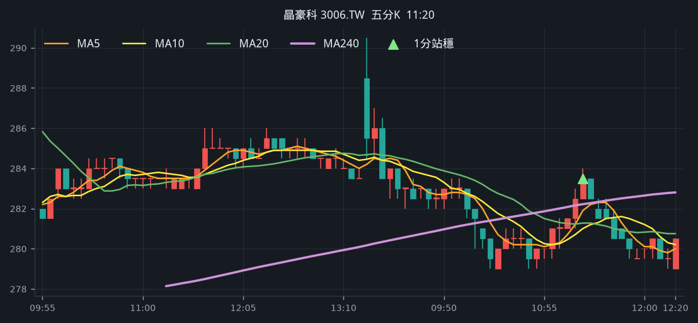

## 3. 東捷 [8064.TWO](https://tw.stock.yahoo.com/quote/8064.TWO)

- 價格 134.00 -2.90%　成交額排名 #138　15.54 億
- 1分站穩 11:02　收 139.00 > MA240 138.57
- 1分 MA5 138.50 > MA10 138.00 > MA20 137.65　MA20/MA240 差 0.7%
- 五分收盤 / MA240　138.00 > 129.78（+6.3%）

**一分 K**

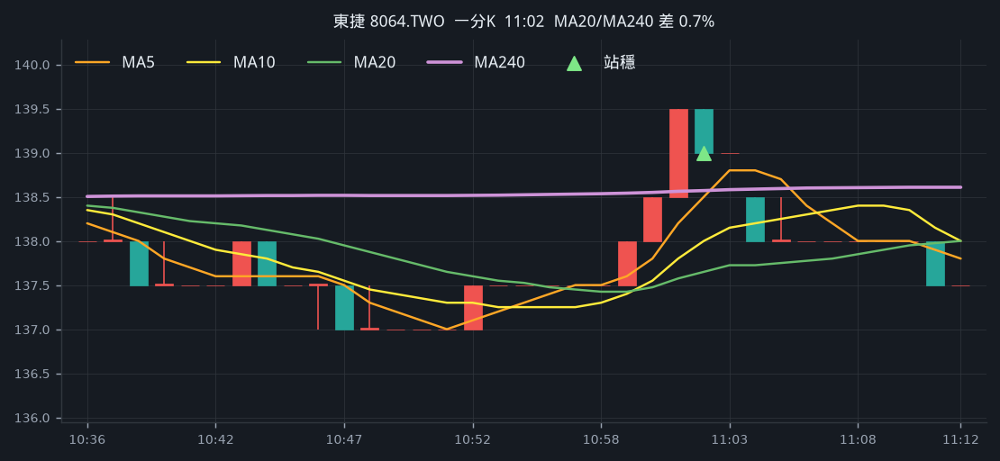

**五分 K（對照）**

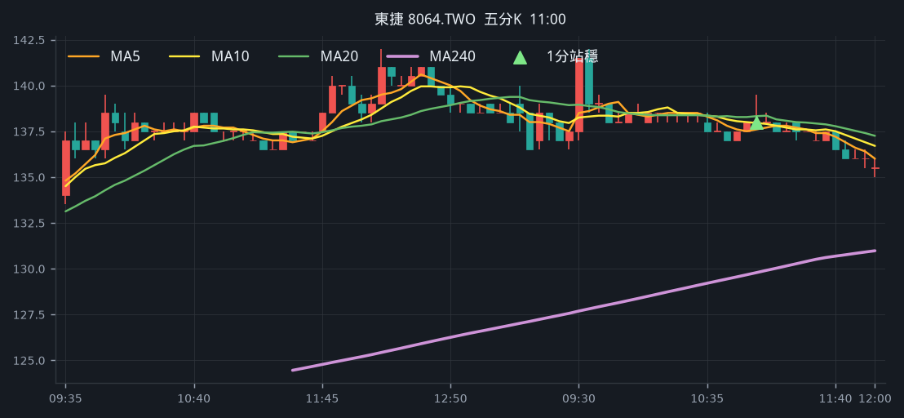

## 4. 嘉基 [6715.TW](https://tw.stock.yahoo.com/quote/6715.TW)

- 價格 451.50 +0.00%　成交額排名 #144　14.59 億
- 1分站穩 12:29　收 454.50 > MA240 453.95
- 1分 MA5 453.90 > MA10 452.45 > MA20 450.82　MA20/MA240 差 0.7%
- 五分收盤 / MA240　454.50 > 426.77（+6.5%）

**一分 K**

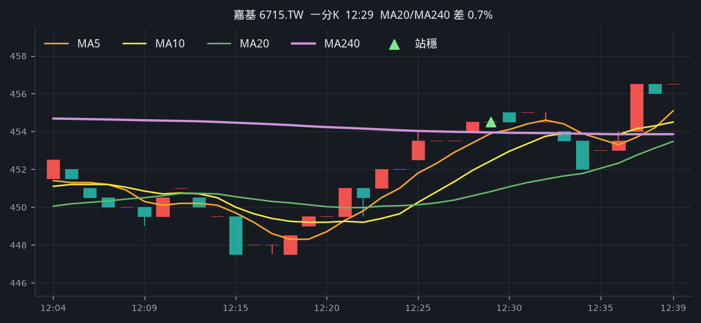

**五分 K（對照）**

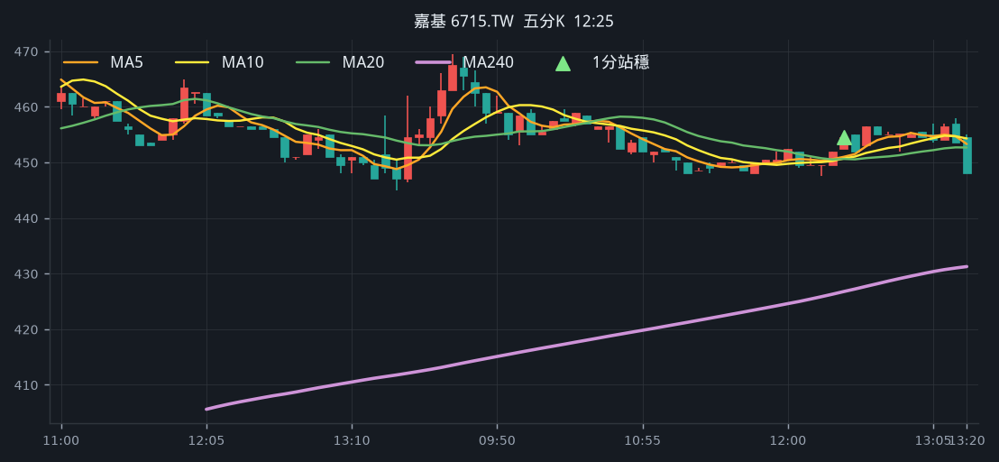

## 5. 新盛力 [4931.TWO](https://tw.stock.yahoo.com/quote/4931.TWO)

- 價格 240.50 +0.42%　成交額排名 #155　12.55 億
- 1分站穩 09:28　收 244.00 > MA240 242.17
- 1分 MA5 242.60 > MA10 241.50 > MA20 240.80　MA20/MA240 差 0.6%
- 五分收盤 / MA240　244.00 > 236.37（+3.2%）

**一分 K**

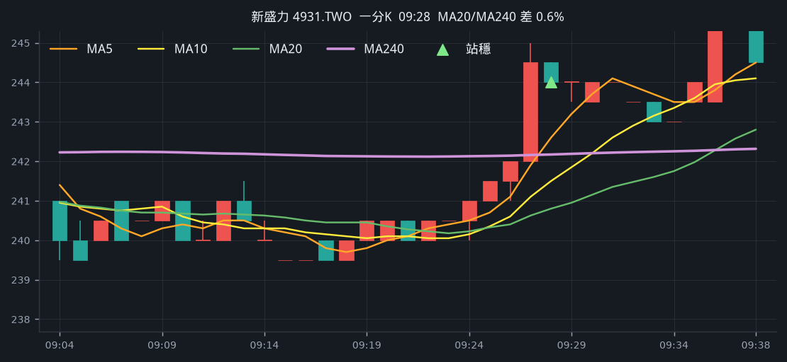

**五分 K（對照）**

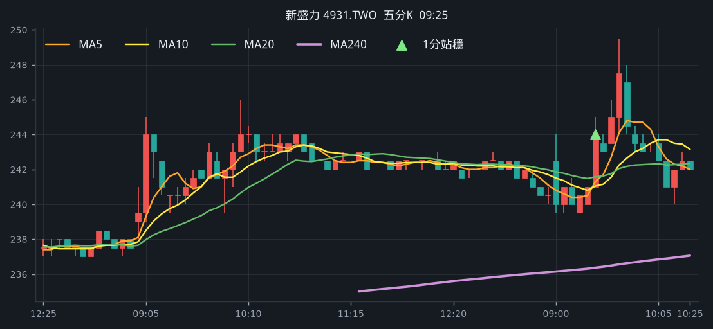

## 6. 大聯大 [3702.TW](https://tw.stock.yahoo.com/quote/3702.TW)

- 價格 113.00 -0.88%　成交額排名 #167　11.14 億
- 1分站穩 09:39　收 114.50 > MA240 114.44
- 1分 MA5 114.20 > MA10 113.85 > MA20 113.70　MA20/MA240 差 0.6%
- 五分收盤 / MA240　114.50 > 110.79（+3.3%）

**一分 K**

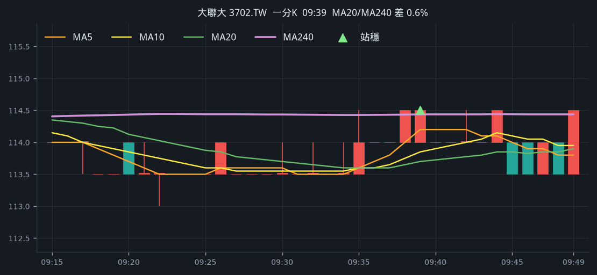

**五分 K（對照）**

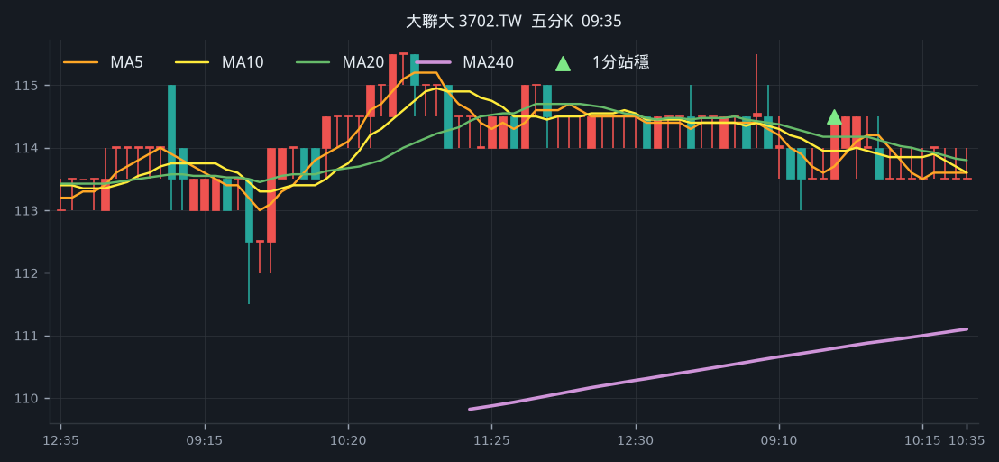

## 7. 濱川 [1569.TWO](https://tw.stock.yahoo.com/quote/1569.TWO)

- 價格 64.20 +5.25%　成交額排名 #190　9.23 億
- 1分站穩 12:37　收 64.60 > MA240 64.58
- 1分 MA5 64.52 > MA10 64.46 > MA20 64.20　MA20/MA240 差 0.6%
- 五分收盤 / MA240　64.60 > 56.47（+14.4%）

**一分 K**

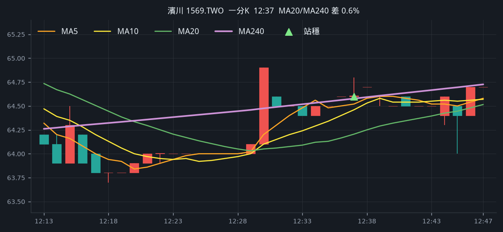

**五分 K（對照）**

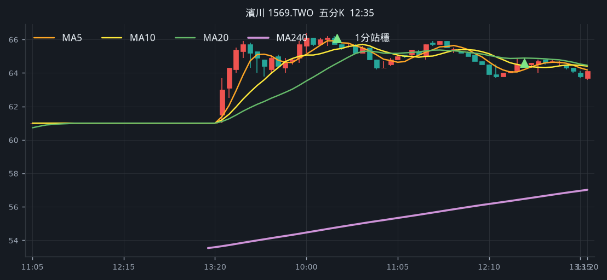

## 8. 汎銓 [6830.TW](https://tw.stock.yahoo.com/quote/6830.TW)

- 價格 547.00 -1.08%　成交額排名 #197　8.65 億
- 1分站穩 12:34　收 552.00 > MA240 551.26
- 1分 MA5 550.80 > MA10 548.80 > MA20 546.30　MA20/MA240 差 0.9%
- 五分收盤 / MA240　552.00 > 545.87（+1.1%）

**一分 K**

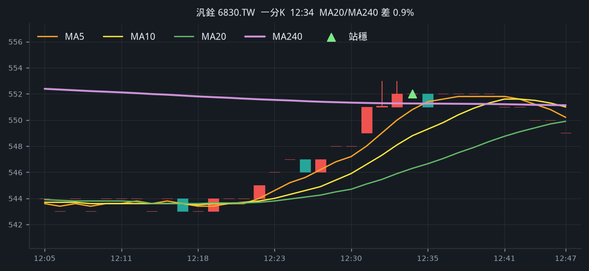

**五分 K（對照）**

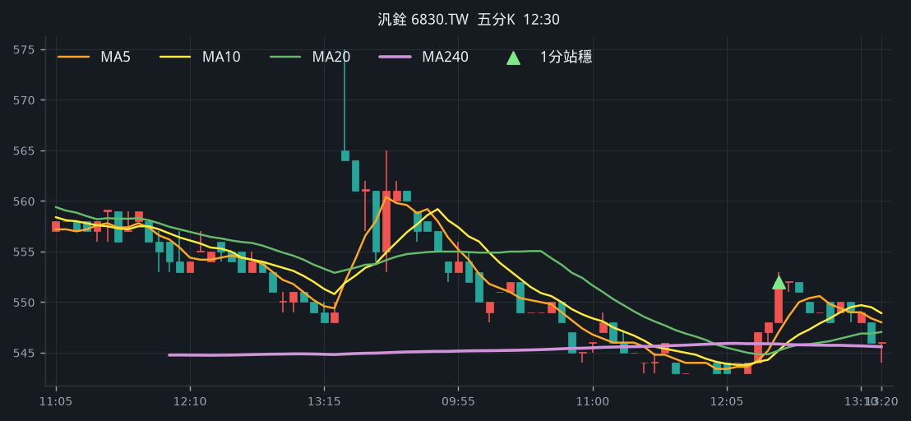

