# 回測 2026-09-23（週三）· 一分K站穩 MA240

用 2026-09-23（週三）當天上市＋上櫃成交額前 200（盤後），濾掉 ETF、金融股與收盤價 650 以上。一分K MA5>MA10>MA20 且拉開（MA5−MA20 ≥ 0.4%），MA20 與 MA240 差距 0.4%～1.0%，從 240 下面穿上、連續兩根收盤站穩，時間 09:10 以後（開盤跳空不算）；含該根的五分K收盤也必須高於五分 MA240。

- 命中 **12** 檔
- 掃描時間 2026-09-30 22:54:44（台北）
- 排行 2026-09-23 盤後成交額
- 前 200 → 濾掉股價 58、ETF 18、金融 13 → 掃描 111 → 均線糾結 0 → MA20/MA240不符 0 → 五分MA240底下 4

## 1. 友達 [2409.TW](https://tw.stock.yahoo.com/quote/2409.TW)

- 價格 34.70 -5.32%　成交額排名 #3　332.65 億
- 1分站穩 12:13　收 35.30 > MA240 35.08
- 1分 MA5 35.09 > MA10 35.02 > MA20 34.80　MA20/MA240 差 0.8%
- 五分收盤 / MA240　35.25 > 32.81（+7.4%）

**一分 K**

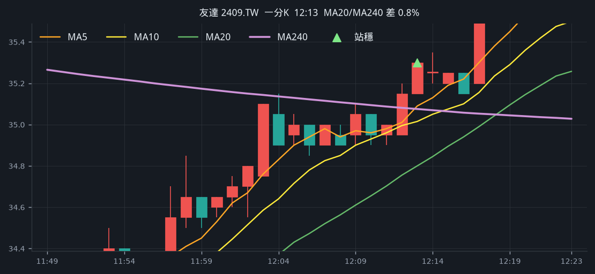

**五分 K（對照）**

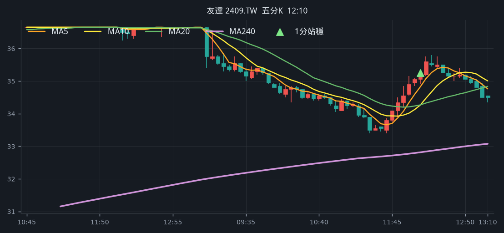

## 2. 國巨* [2327.TW](https://tw.stock.yahoo.com/quote/2327.TW)

- 價格 573.00 +0.35%　成交額排名 #8　248.23 億
- 1分站穩 10:32　收 583.00 > MA240 579.55
- 1分 MA5 579.80 > MA10 578.30 > MA20 576.80　MA20/MA240 差 0.5%
- 五分收盤 / MA240　587.00 > 555.53（+5.7%）

**一分 K**

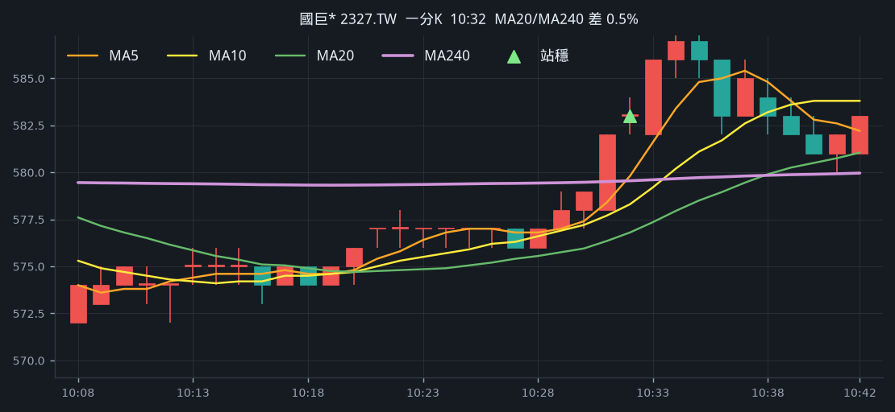

**五分 K（對照）**

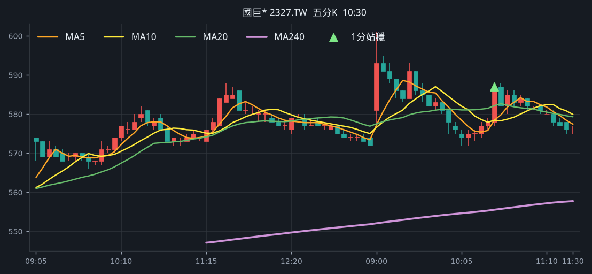

## 3. 穩懋 [3105.TWO](https://tw.stock.yahoo.com/quote/3105.TWO)

- 價格 497.00 -0.80%　成交額排名 #17　134.28 億
- 1分站穩 13:11　收 494.50 > MA240 491.25
- 1分 MA5 491.60 > MA10 490.10 > MA20 488.98　MA20/MA240 差 0.5%
- 五分收盤 / MA240　497.00 > 490.72（+1.3%）

**一分 K**

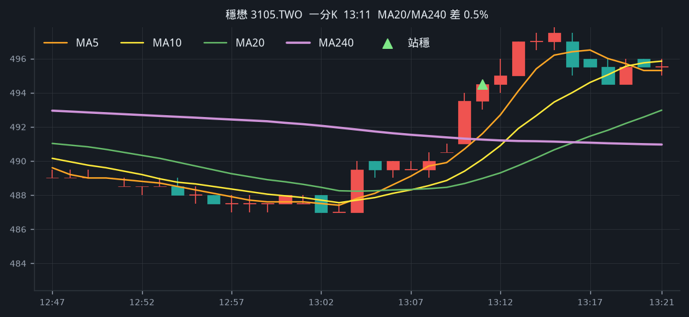

**五分 K（對照）**

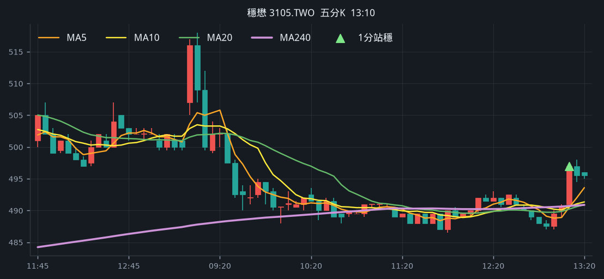

## 4. 力積電 [6770.TW](https://tw.stock.yahoo.com/quote/6770.TW)

- 價格 73.10 +1.81%　成交額排名 #33　86.96 億
- 1分站穩 09:53　收 72.90 > MA240 72.76
- 1分 MA5 72.62 > MA10 72.33 > MA20 72.26　MA20/MA240 差 0.7%
- 五分收盤 / MA240　73.10 > 72.40（+1.0%）

**一分 K**

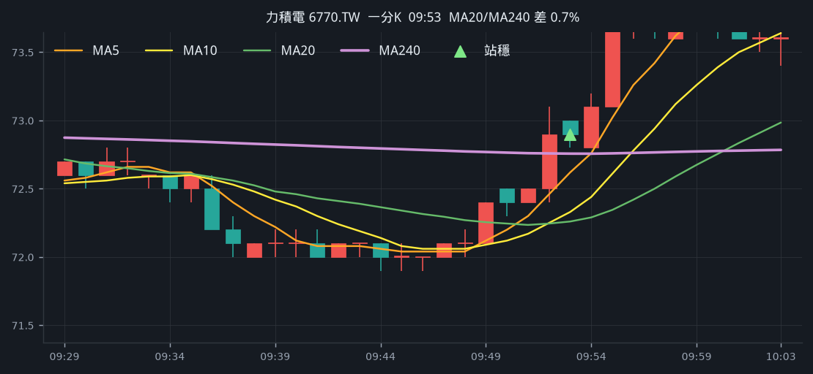

**五分 K（對照）**

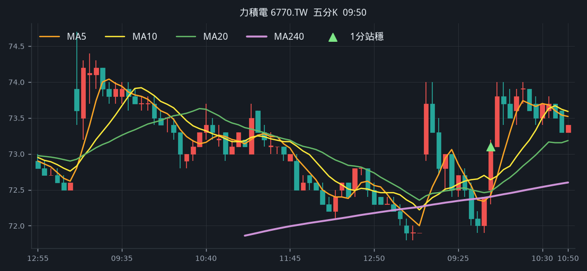

## 5. 精材 [3374.TWO](https://tw.stock.yahoo.com/quote/3374.TWO)

- 價格 472.00 -3.08%　成交額排名 #36　82.78 億
- 1分站穩 11:26　收 480.50 > MA240 476.60
- 1分 MA5 477.10 > MA10 476.00 > MA20 474.48　MA20/MA240 差 0.4%
- 五分收盤 / MA240　477.50 > 449.96（+6.1%）

**一分 K**

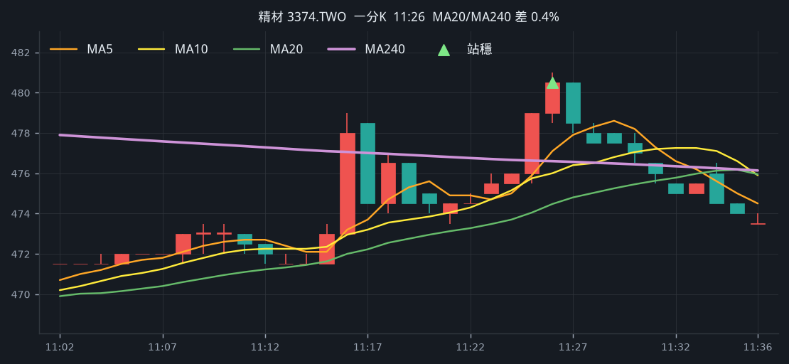

**五分 K（對照）**

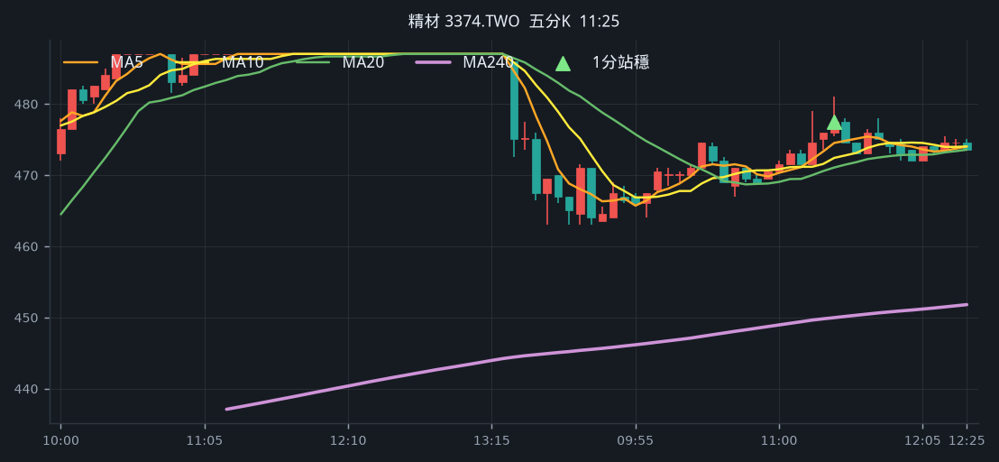

## 6. 盟立 [2464.TW](https://tw.stock.yahoo.com/quote/2464.TW)

- 價格 195.00 +2.36%　成交額排名 #79　35.86 億
- 1分站穩 13:05　收 191.50 > MA240 189.84
- 1分 MA5 189.70 > MA10 189.15 > MA20 188.90　MA20/MA240 差 0.5%
- 五分收盤 / MA240　191.50 > 190.54（+0.5%）

**一分 K**

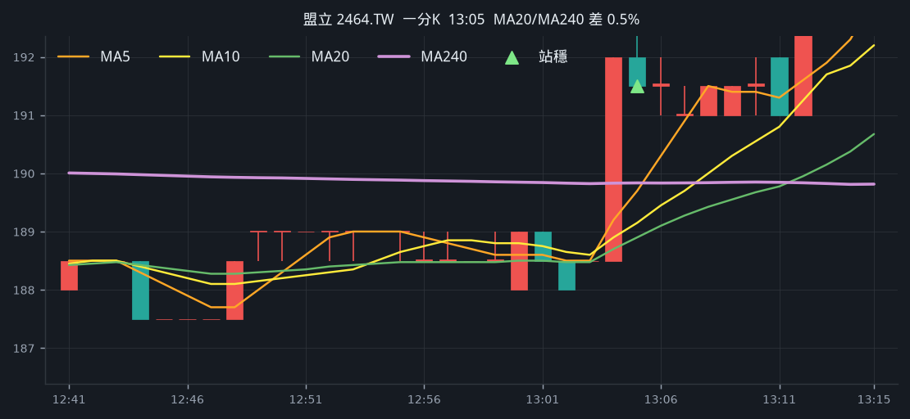

**五分 K（對照）**

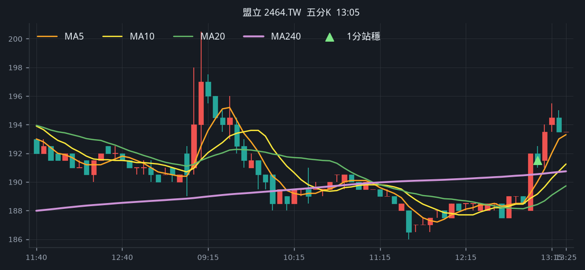

## 7. 光頡 [3624.TWO](https://tw.stock.yahoo.com/quote/3624.TWO)

- 價格 134.00 +9.84%　成交額排名 #87　29.89 億
- 1分站穩 09:48　收 128.50 > MA240 126.89
- 1分 MA5 126.90 > MA10 126.60 > MA20 126.17　MA20/MA240 差 0.6%
- 五分收盤 / MA240　128.50 > 125.75（+2.2%）

**一分 K**

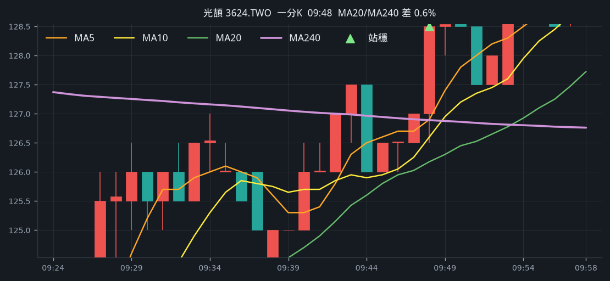

**五分 K（對照）**

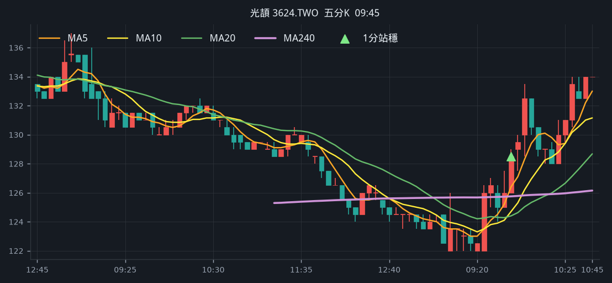

## 8. 世界 [5347.TWO](https://tw.stock.yahoo.com/quote/5347.TWO)

- 價格 173.00 +0.00%　成交額排名 #102　21.81 億
- 1分站穩 10:01　收 174.50 > MA240 174.06
- 1分 MA5 174.00 > MA10 173.65 > MA20 172.88　MA20/MA240 差 0.7%
- 五分收盤 / MA240　174.00 > 169.69（+2.5%）

**一分 K**

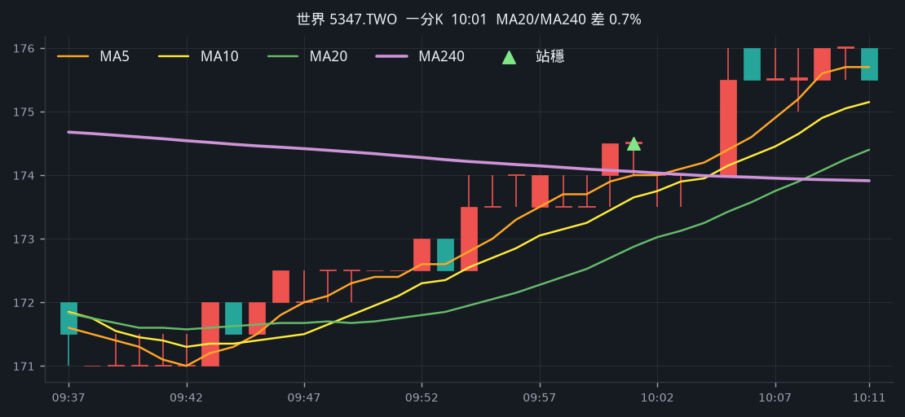

**五分 K（對照）**

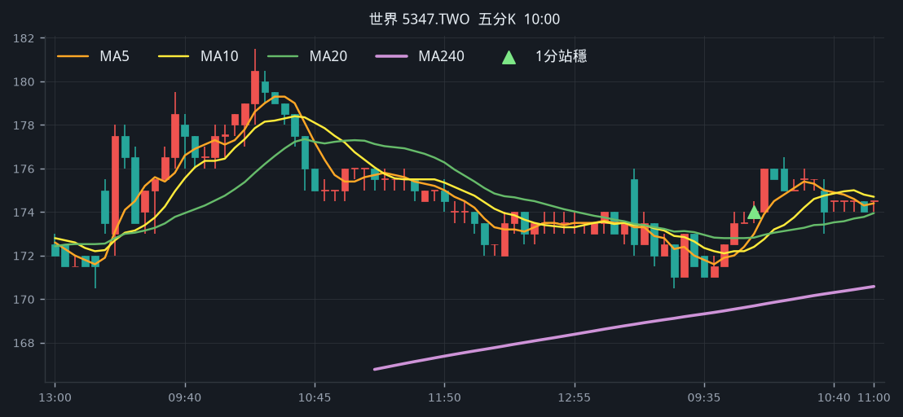

## 9. 智原 [3035.TW](https://tw.stock.yahoo.com/quote/3035.TW)

- 價格 204.00 +0.49%　成交額排名 #122　15.29 億
- 1分站穩 10:06　收 205.50 > MA240 204.32
- 1分 MA5 204.40 > MA10 203.75 > MA20 203.05　MA20/MA240 差 0.6%
- 五分收盤 / MA240　206.00 > 190.65（+8.1%）

**一分 K**

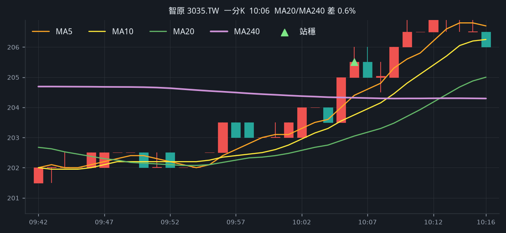

**五分 K（對照）**

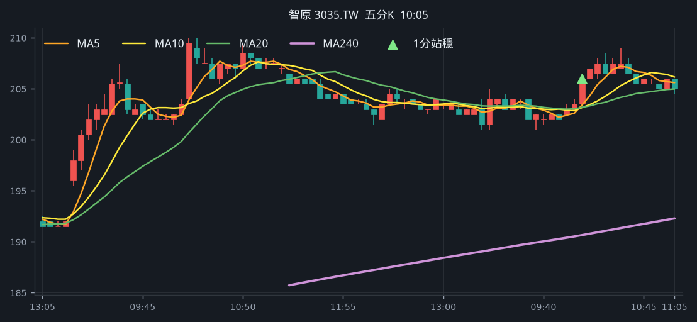

## 10. 聯傑 [3094.TW](https://tw.stock.yahoo.com/quote/3094.TW)

- 價格 54.30 +3.23%　成交額排名 #123　15.14 億
- 1分站穩 09:12　收 53.80 > MA240 53.50
- 1分 MA5 53.44 > MA10 53.26 > MA20 53.02　MA20/MA240 差 0.9%
- 五分收盤 / MA240　53.00 > 51.35（+3.2%）

**一分 K**

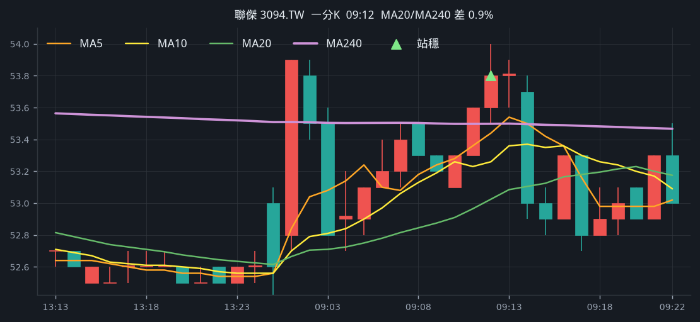

**五分 K（對照）**

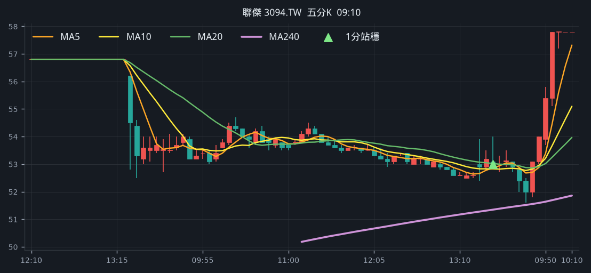

## 11. 光鋐 [4956.TW](https://tw.stock.yahoo.com/quote/4956.TW)

- 價格 43.55 +3.20%　成交額排名 #136　12.98 億
- 1分站穩 12:56　收 44.60 > MA240 44.51
- 1分 MA5 44.46 > MA10 44.22 > MA20 44.15　MA20/MA240 差 0.8%
- 五分收盤 / MA240　44.35 > 43.38（+2.2%）

**一分 K**

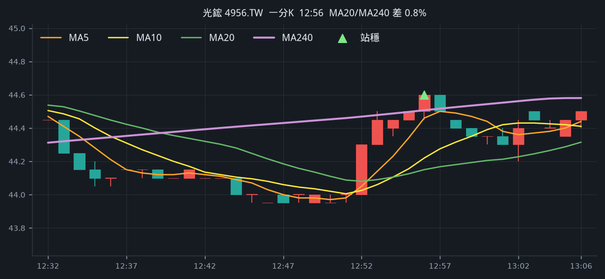

**五分 K（對照）**

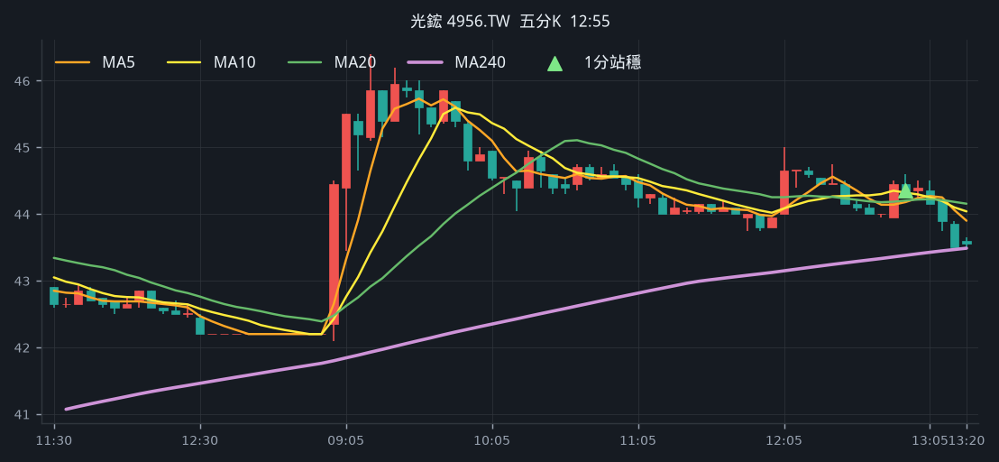

## 12. 騰輝電子-KY [6672.TW](https://tw.stock.yahoo.com/quote/6672.TW)

- 價格 307.00 +1.66%　成交額排名 #163　9.97 億
- 1分站穩 10:35　收 303.00 > MA240 302.55
- 1分 MA5 302.70 > MA10 302.10 > MA20 301.30　MA20/MA240 差 0.4%
- 五分收盤 / MA240　303.00 > 302.59（+0.1%）

**一分 K**

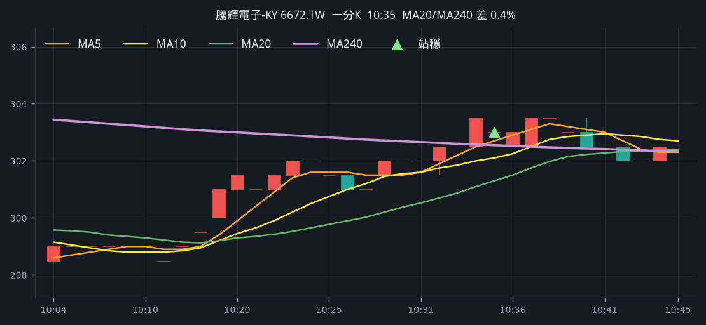

**五分 K（對照）**

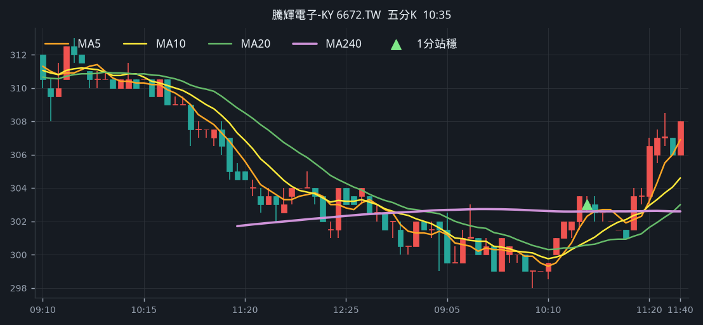

