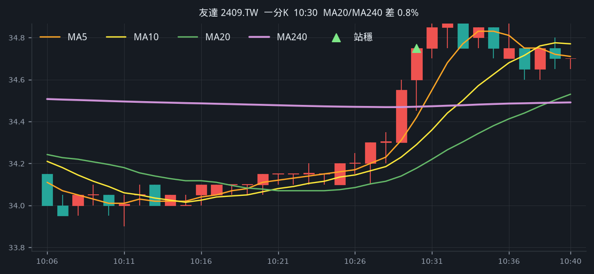
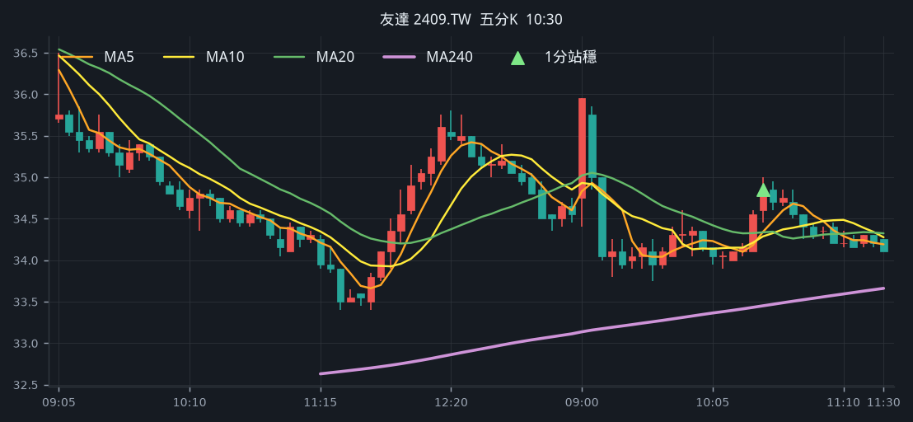
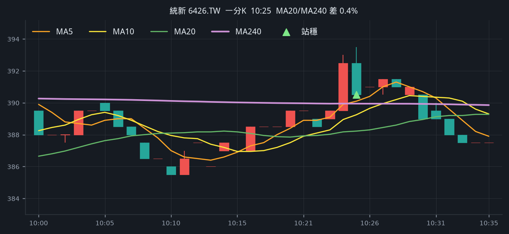
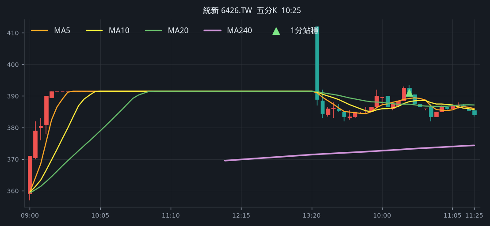
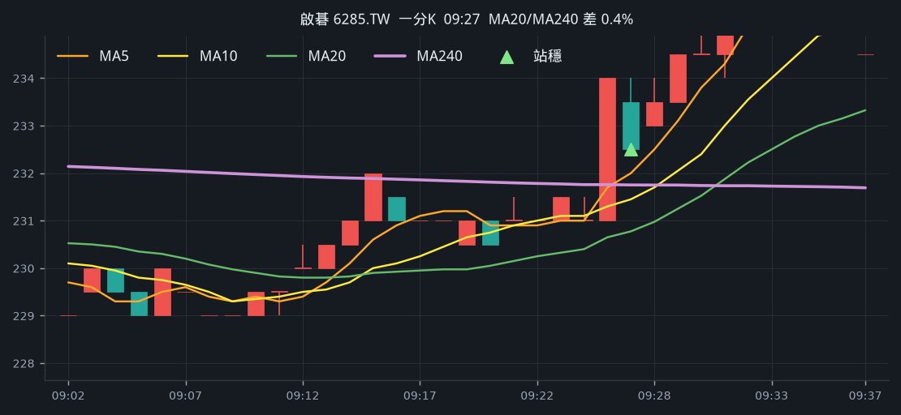
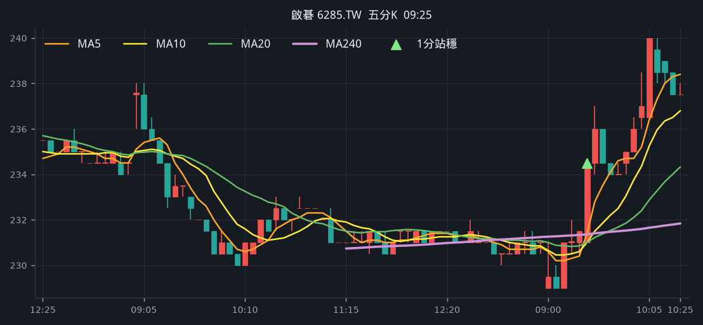
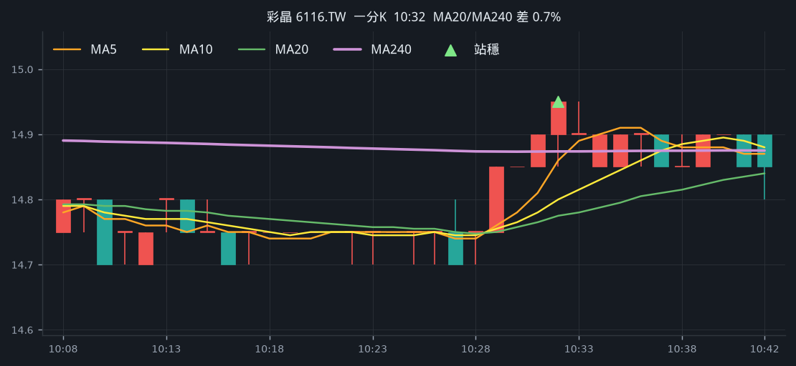
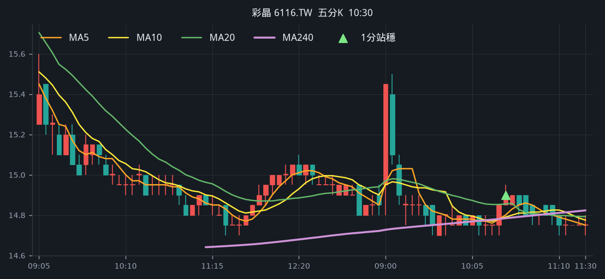

# 回測 2026-09-24（週四）· 一分K站穩 MA240

用 2026-09-24（週四）當天上市＋上櫃成交額前 200（盤後），濾掉 ETF、金融股與收盤價 650 以上。一分K MA5>MA10>MA20 且拉開（MA5−MA20 ≥ 0.4%），MA20 與 MA240 差距 0.4%～1.0%，從 240 下面穿上、連續兩根收盤站穩，時間 09:10 以後（開盤跳空不算）；含該根的五分K收盤也必須高於五分 MA240。

- 命中 **4** 檔
- 掃描時間 2026-09-30 22:55:04（台北）
- 排行 2026-09-24 盤後成交額
- 前 200 → 濾掉股價 58、ETF 21、金融 7 → 掃描 114 → 均線糾結 0 → MA20/MA240不符 0 → 五分MA240底下 5

## 1. 友達 [2409.TW](https://tw.stock.yahoo.com/quote/2409.TW)

- 價格 34.20 -1.44%　成交額排名 #8　187.09 億
- 1分站穩 10:30　收 34.75 > MA240 34.47
- 1分 MA5 34.42 > MA10 34.29 > MA20 34.18　MA20/MA240 差 0.8%
- 五分收盤 / MA240　34.85 > 33.45（+4.2%）

**一分 K**

**五分 K（對照）**

## 2. 統新 [6426.TW](https://tw.stock.yahoo.com/quote/6426.TW)

- 價格 389.00 -0.64%　成交額排名 #96　19.15 億
- 1分站穩 10:25　收 390.50 > MA240 389.95
- 1分 MA5 390.10 > MA10 389.25 > MA20 388.23　MA20/MA240 差 0.4%
- 五分收盤 / MA240　391.00 > 373.23（+4.8%）

**一分 K**

**五分 K（對照）**

## 3. 啟碁 [6285.TW](https://tw.stock.yahoo.com/quote/6285.TW)

- 價格 238.00 +3.48%　成交額排名 #134　12.01 億
- 1分站穩 09:27　收 232.50 > MA240 231.75
- 1分 MA5 232.00 > MA10 231.45 > MA20 230.78　MA20/MA240 差 0.4%
- 五分收盤 / MA240　234.50 > 231.36（+1.4%）

**一分 K**

**五分 K（對照）**

## 4. 彩晶 [6116.TW](https://tw.stock.yahoo.com/quote/6116.TW)

- 價格 14.90 -0.67%　成交額排名 #195　6.24 億
- 1分站穩 10:32　收 14.95 > MA240 14.87
- 1分 MA5 14.86 > MA10 14.80 > MA20 14.78　MA20/MA240 差 0.7%
- 五分收盤 / MA240　14.90 > 14.78（+0.8%）

**一分 K**

**五分 K（對照）**

