# 台股一分K · 剛站上 MA200

成交額前 100、濾掉 ETF 與股價 650 以上。一分K MA5>MA10>MA20，且這根收盤剛站上 MA200；含該金叉的五分K收盤也必須高於五分 MA200。

- 命中 **20** 檔
- 掃描時間 2026-08-17 13:51:56（台北）
- 排行 2026-08-17T13:50:55+08:00
- 前 100 → 濾掉股價 37、ETF 7 → 掃描 56 → 五分MA200底下 15

## 1. 南亞科 [2408.TW](https://tw.stock.yahoo.com/quote/2408.TW)

- 價格 524.00 +2.34%　成交額排名 #4　319.26 億
- 1分金叉 13:10　收 523.00 > MA200 522.73
- 1分 MA5 521.00 > MA10 520.40 > MA20 520.35
- 五分收盤 / MA200　525.00 > 511.76

**一分 K**

**五分 K（對照）**

## 2. 南亞 [1303.TW](https://tw.stock.yahoo.com/quote/1303.TW)

- 價格 200.50 -3.37%　成交額排名 #6　287.16 億
- 1分金叉 09:05　收 209.00 > MA200 207.51
- 1分 MA5 207.80 > MA10 207.65 > MA20 207.57
- 五分收盤 / MA200　213.00 > 193.37

**一分 K**

**五分 K（對照）**

## 3. 華邦電 [2344.TW](https://tw.stock.yahoo.com/quote/2344.TW)

- 價格 181.50 -1.09%　成交額排名 #9　234.40 億
- 1分金叉 12:01　收 185.00 > MA200 184.54
- 1分 MA5 184.70 > MA10 184.50 > MA20 184.38
- 五分收盤 / MA200　184.50 > 181.75

**一分 K**

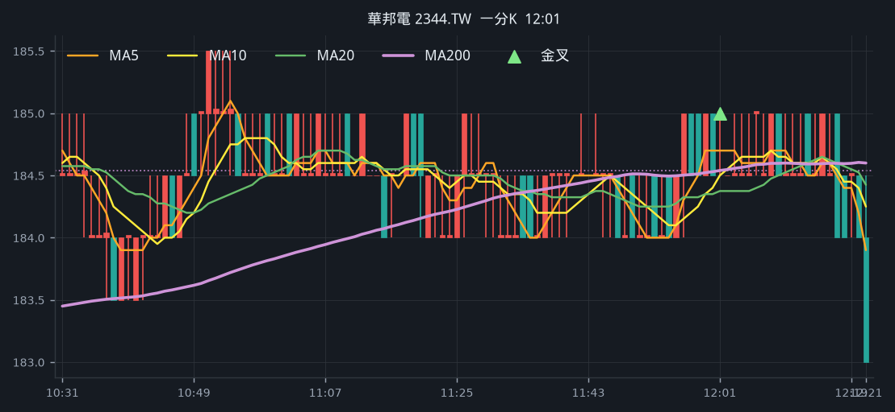

**五分 K（對照）**

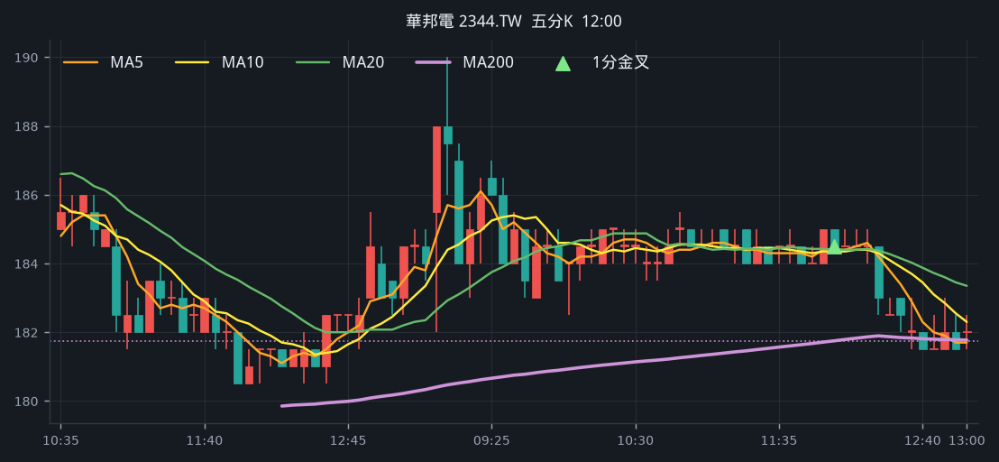

## 4. 臻鼎-KY [4958.TW](https://tw.stock.yahoo.com/quote/4958.TW)

- 價格 503.00 +2.76%　成交額排名 #10　224.32 億
- 1分金叉 12:42　收 506.00 > MA200 505.60
- 1分 MA5 505.20 > MA10 504.90 > MA20 504.35
- 五分收盤 / MA200　505.00 > 489.12

**一分 K**

**五分 K（對照）**

## 5. 仁寶 [2324.TW](https://tw.stock.yahoo.com/quote/2324.TW)

- 價格 41.65 -3.59%　成交額排名 #18　111.72 億
- 1分金叉 12:40　收 41.75 > MA200 41.66
- 1分 MA5 41.69 > MA10 41.68 > MA20 41.62
- 五分收盤 / MA200　41.75 > 41.14

**一分 K**

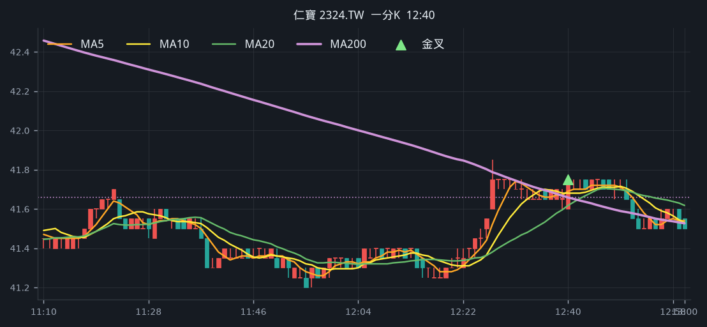

**五分 K（對照）**

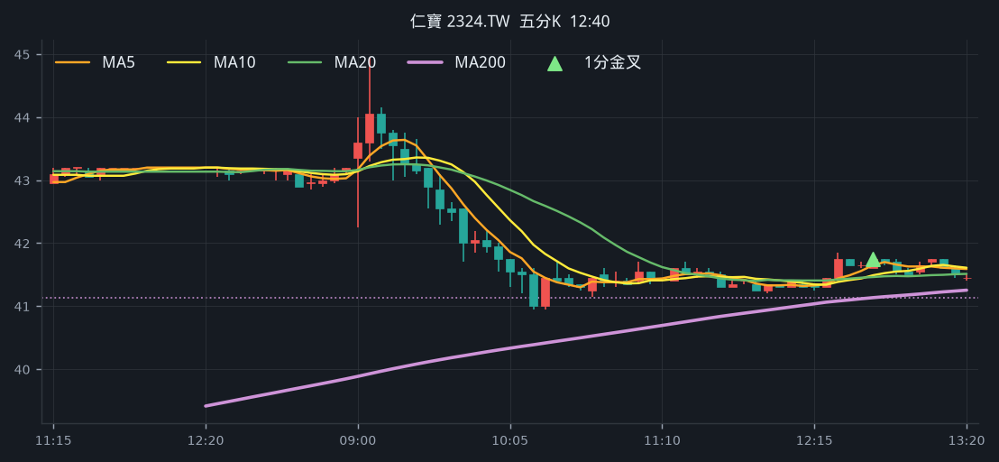

## 6. 穩懋 [3105.TWO](https://tw.stock.yahoo.com/quote/3105.TWO)

- 價格 398.00 +5.29%　成交額排名 #22　98.55 億
- 1分金叉 13:00　收 393.50 > MA200 393.27
- 1分 MA5 393.30 > MA10 393.25 > MA20 393.10
- 五分收盤 / MA200　396.00 > 391.23

**一分 K**

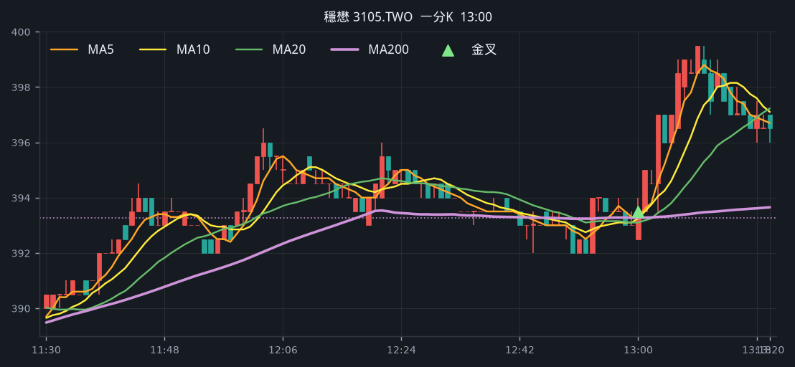

**五分 K（對照）**

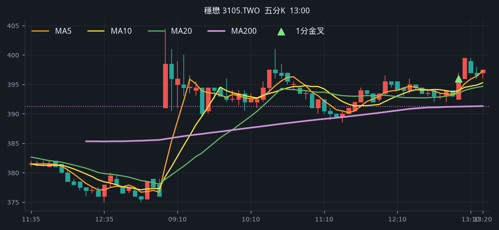

## 7. 合晶 [6182.TWO](https://tw.stock.yahoo.com/quote/6182.TWO)

- 價格 122.50 +9.87%　成交額排名 #23　98.35 億
- 1分金叉 09:11　收 112.50 > MA200 112.36
- 1分 MA5 112.80 > MA10 112.40 > MA20 111.50
- 五分收盤 / MA200　111.50 > 106.63

**一分 K**

**五分 K（對照）**

## 8. 漢翔 [2634.TW](https://tw.stock.yahoo.com/quote/2634.TW)

- 價格 71.00 +0.57%　成交額排名 #27　93.58 億
- 1分金叉 11:55　收 69.40 > MA200 69.31
- 1分 MA5 69.22 > MA10 69.18 > MA20 69.16
- 五分收盤 / MA200　69.40 > 65.41

**一分 K**

**五分 K（對照）**

## 9. 長榮 [2603.TW](https://tw.stock.yahoo.com/quote/2603.TW)

- 價格 231.50 +5.71%　成交額排名 #32　84.81 億
- 1分金叉 13:02　收 231.00 > MA200 230.55
- 1分 MA5 230.80 > MA10 230.70 > MA20 230.68
- 五分收盤 / MA200　231.00 > 219.15

**一分 K**

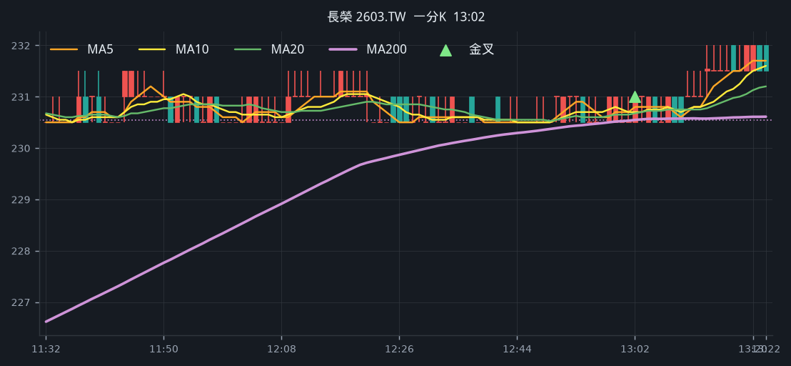

**五分 K（對照）**

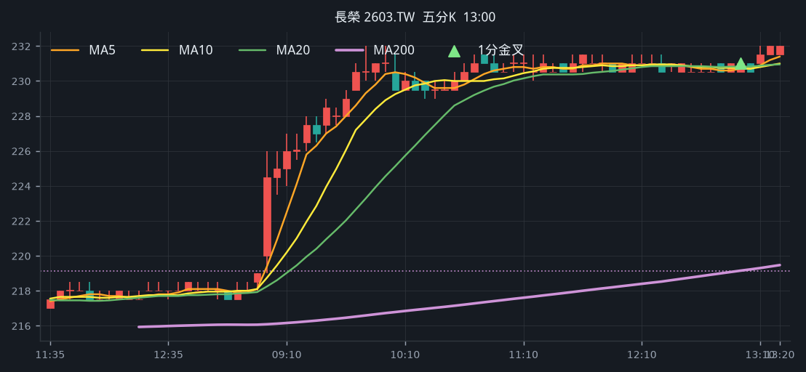

## 10. 台虹 [8039.TW](https://tw.stock.yahoo.com/quote/8039.TW)

- 價格 259.00 -4.95%　成交額排名 #33　84.76 億
- 1分金叉 10:00　收 272.00 > MA200 271.87
- 1分 MA5 271.00 > MA10 269.50 > MA20 268.85
- 五分收盤 / MA200　268.50 > 243.42

**一分 K**

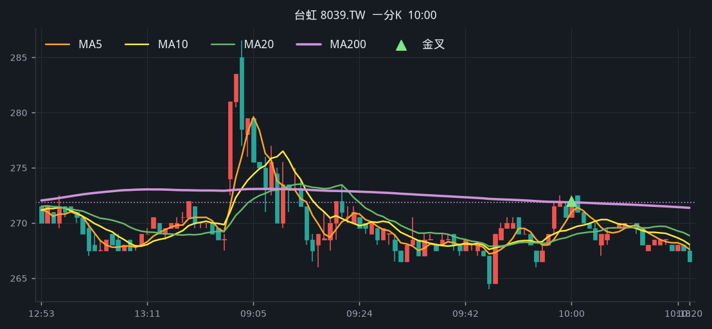

**五分 K（對照）**

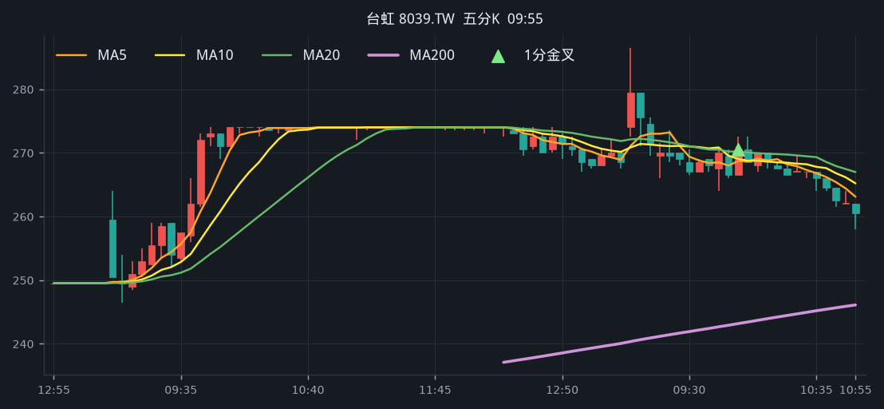

## 11. 雷虎 [8033.TW](https://tw.stock.yahoo.com/quote/8033.TW)

- 價格 191.50 -4.96%　成交額排名 #44　61.66 億
- 1分金叉 12:18　收 193.50 > MA200 193.46
- 1分 MA5 193.00 > MA10 192.95 > MA20 192.28
- 五分收盤 / MA200　194.00 > 184.99

**一分 K**

**五分 K（對照）**

## 12. 光寶科 [2301.TW](https://tw.stock.yahoo.com/quote/2301.TW)

- 價格 263.50 -1.31%　成交額排名 #45　61.66 億
- 1分金叉 12:37　收 268.00 > MA200 267.61
- 1分 MA5 267.90 > MA10 267.80 > MA20 267.15
- 五分收盤 / MA200　267.50 > 265.89

**一分 K**

**五分 K（對照）**

## 13. 頎邦 [6147.TWO](https://tw.stock.yahoo.com/quote/6147.TWO)

- 價格 168.50 +6.98%　成交額排名 #52　54.37 億
- 1分金叉 09:09　收 161.50 > MA200 160.18
- 1分 MA5 159.70 > MA10 159.15 > MA20 159.03
- 五分收盤 / MA200　161.50 > 160.37

**一分 K**

**五分 K（對照）**

## 14. 中美晶 [5483.TWO](https://tw.stock.yahoo.com/quote/5483.TWO)

- 價格 186.50 -0.80%　成交額排名 #63　42.08 億
- 1分金叉 12:05　收 190.00 > MA200 189.78
- 1分 MA5 189.80 > MA10 189.50 > MA20 189.38
- 五分收盤 / MA200　189.50 > 187.87

**一分 K**

**五分 K（對照）**

## 15. 精誠 [6214.TW](https://tw.stock.yahoo.com/quote/6214.TW)

- 價格 175.50 +2.03%　成交額排名 #64　41.02 億
- 1分金叉 13:23　收 175.50 > MA200 175.03
- 1分 MA5 174.80 > MA10 174.75 > MA20 174.62
- 五分收盤 / MA200　175.50 > 162.39

**一分 K**

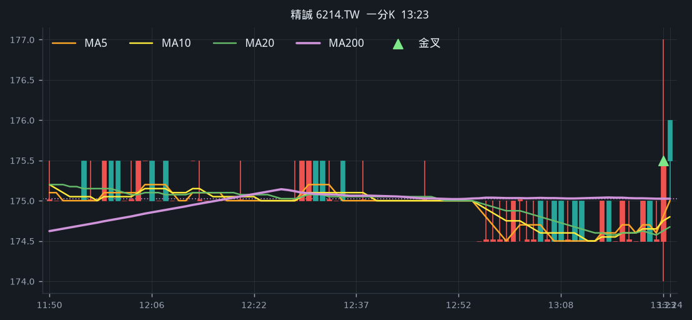

**五分 K（對照）**

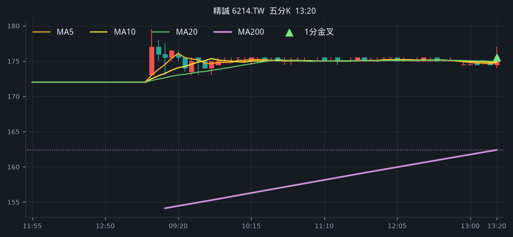

## 16. 信昌電 [6173.TWO](https://tw.stock.yahoo.com/quote/6173.TWO)

- 價格 211.00 +0.48%　成交額排名 #66　39.60 億
- 1分金叉 09:58　收 211.00 > MA200 209.68
- 1分 MA5 208.20 > MA10 207.95 > MA20 207.65
- 五分收盤 / MA200　210.50 > 206.94

**一分 K**

**五分 K（對照）**

## 17. 台新新光金 [2887.TW](https://tw.stock.yahoo.com/quote/2887.TW)

- 價格 37.15 -1.59%　成交額排名 #78　29.21 億
- 1分金叉 13:24　收 37.35 > MA200 37.30
- 1分 MA5 37.31 > MA10 37.30 > MA20 37.29
- 五分收盤 / MA200　37.35 > 36.46

**一分 K**

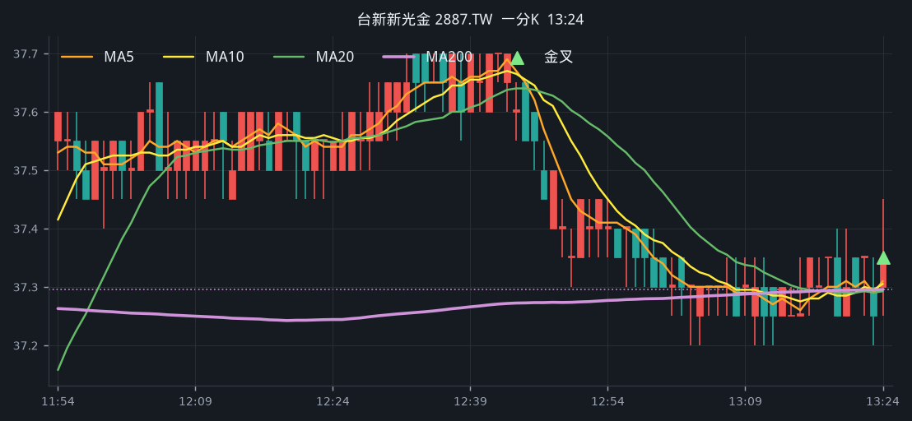

**五分 K（對照）**

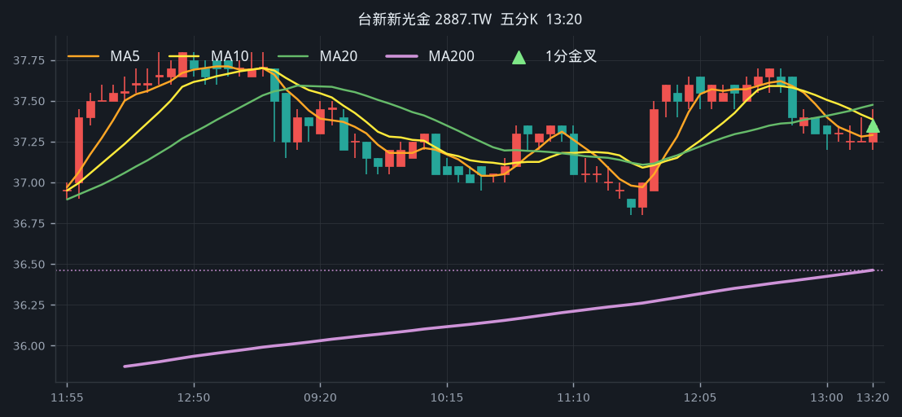

## 18. 華通 [2313.TW](https://tw.stock.yahoo.com/quote/2313.TW)

- 價格 211.00 -2.09%　成交額排名 #79　28.87 億
- 1分金叉 10:19　收 214.50 > MA200 214.44
- 1分 MA5 214.10 > MA10 213.25 > MA20 212.80
- 五分收盤 / MA200　214.50 > 213.53

**一分 K**

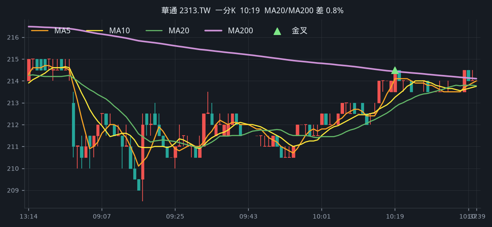

**五分 K（對照）**

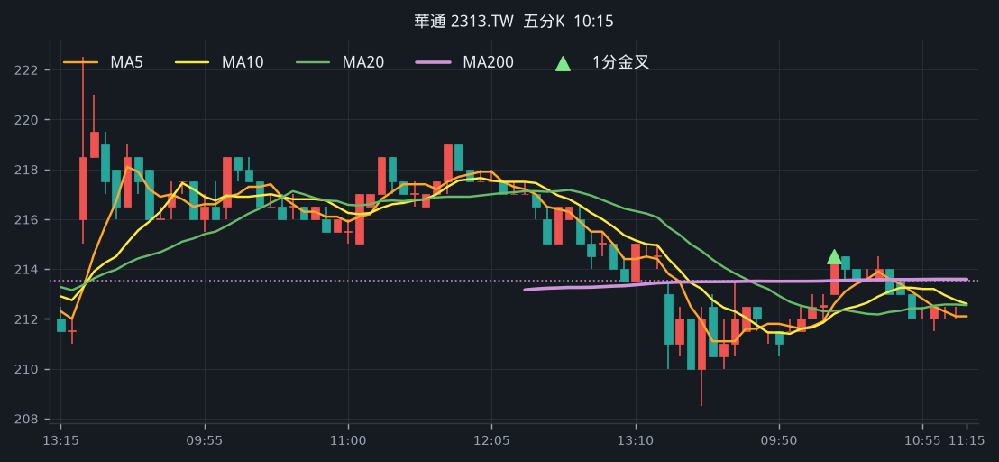

## 19. 一詮 [2486.TW](https://tw.stock.yahoo.com/quote/2486.TW)

- 價格 238.00 +5.54%　成交額排名 #94　21.58 億
- 1分金叉 09:05　收 233.00 > MA200 230.32
- 1分 MA5 229.20 > MA10 227.55 > MA20 227.38
- 五分收盤 / MA200　236.00 > 231.85

**一分 K**

**五分 K（對照）**

## 20. 玉山金 [2884.TW](https://tw.stock.yahoo.com/quote/2884.TW)

- 價格 37.75 +0.27%　成交額排名 #97　20.80 億
- 1分金叉 11:44　收 37.10 > MA200 37.06
- 1分 MA5 36.86 > MA10 36.83 > MA20 36.81
- 五分收盤 / MA200　37.10 > 36.95

**一分 K**

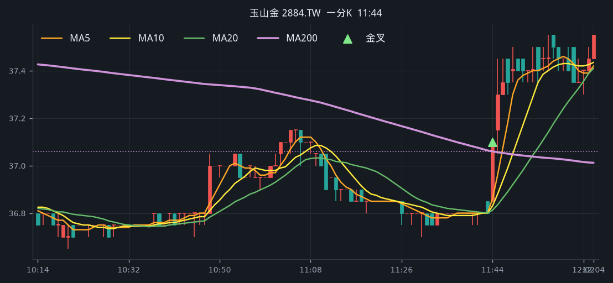

**五分 K（對照）**

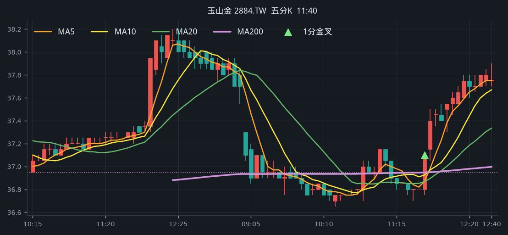

