# 台股一分K · 站穩 MA200

成交額前 100、濾掉 ETF、金融股與股價 650 以上。一分K MA5>MA10>MA20 且拉開（MA5−MA20 ≥ 0.2%），MA20 與 MA200 差距 ≤ 1.5%，且連續兩根收盤站穩 MA200（開盤跳空不算）；含該根的五分K收盤也必須高於五分 MA200。

- 命中 **11** 檔
- 掃描時間 2026-08-17 20:43:36（台北）
- 排行 2026-08-17T14:35:36+08:00
- 前 100 → 濾掉股價 37、ETF 7、金融 6 → 掃描 50 → 均線糾結 7 → MA20離MA200太遠 0 → 五分MA200底下 5

## 1. 南亞科 [2408.TW](https://tw.stock.yahoo.com/quote/2408.TW)

- 價格 524.00 +2.34%　成交額排名 #4　319.95 億
- 1分站穩 12:07　收 524.00 > MA200 523.37
- 1分 MA5 523.60 > MA10 523.40 > MA20 522.50　MA20/MA200 差 0.2%
- 五分收盤 / MA200　523.00 > 510.20（+2.5%）

**一分 K**

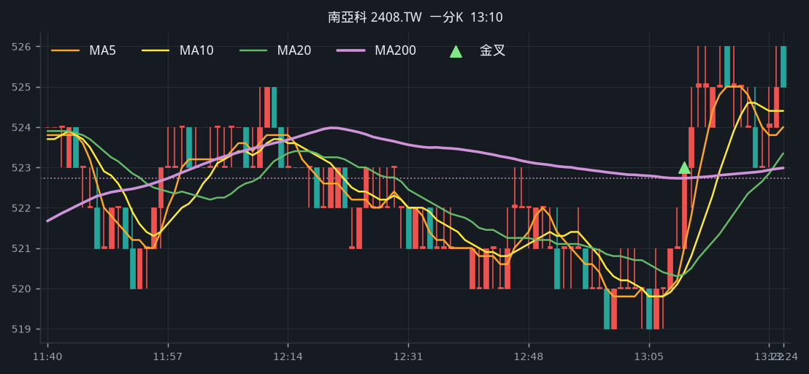

**五分 K（對照）**

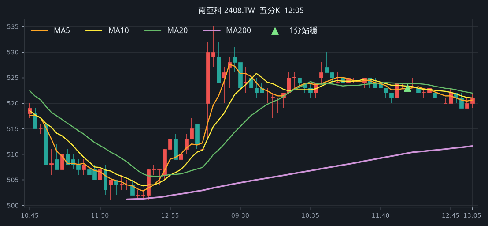

## 2. 南亞 [1303.TW](https://tw.stock.yahoo.com/quote/1303.TW)

- 價格 200.50 -3.37%　成交額排名 #6　287.53 億
- 1分站穩 09:06　收 212.00 > MA200 207.53
- 1分 MA5 208.90 > MA10 208.10 > MA20 207.80　MA20/MA200 差 0.1%
- 五分收盤 / MA200　213.00 > 193.37（+10.2%）

**一分 K**

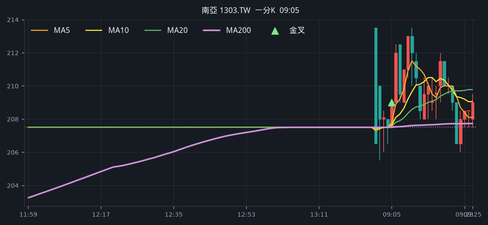

**五分 K（對照）**

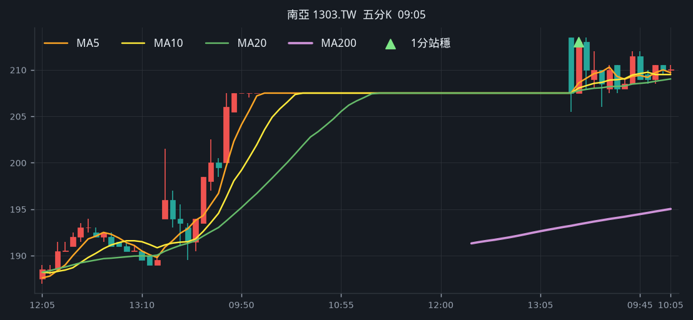

## 3. 臻鼎-KY [4958.TW](https://tw.stock.yahoo.com/quote/4958.TW)

- 價格 503.00 +2.76%　成交額排名 #10　224.67 億
- 1分站穩 12:03　收 505.00 > MA200 504.52
- 1分 MA5 504.20 > MA10 503.10 > MA20 501.95　MA20/MA200 差 0.5%
- 五分收盤 / MA200　505.00 > 488.22（+3.4%）

**一分 K**

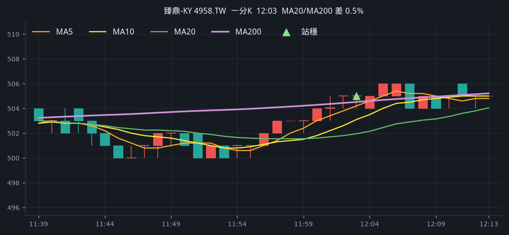

**五分 K（對照）**

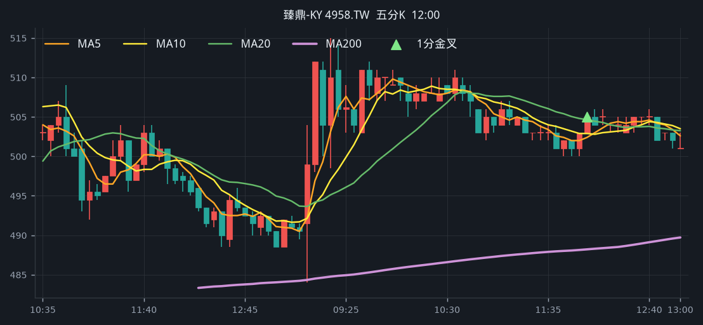

## 4. 合晶 [6182.TWO](https://tw.stock.yahoo.com/quote/6182.TWO)

- 價格 122.50 +9.87%　成交額排名 #23　98.38 億
- 1分站穩 09:06　收 112.50 > MA200 112.43
- 1分 MA5 112.00 > MA10 111.25 > MA20 110.88　MA20/MA200 差 1.4%
- 五分收盤 / MA200　113.00 > 106.54（+6.1%）

**一分 K**

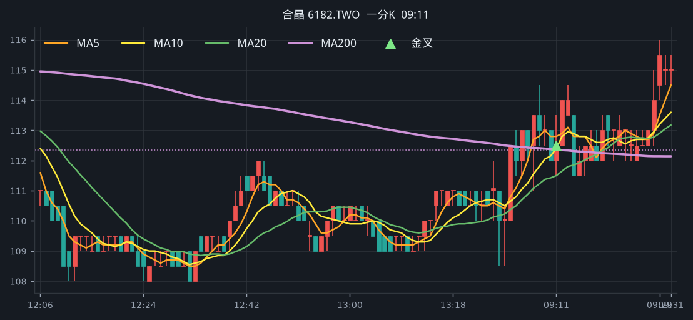

**五分 K（對照）**

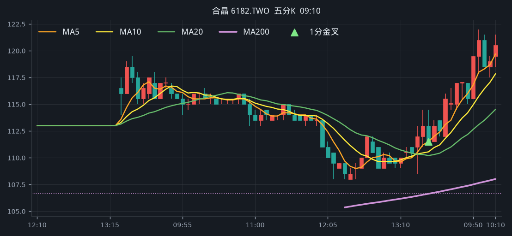

## 5. 漢翔 [2634.TW](https://tw.stock.yahoo.com/quote/2634.TW)

- 價格 71.00 +0.57%　成交額排名 #28　93.68 億
- 1分站穩 11:26　收 69.70 > MA200 69.51
- 1分 MA5 69.48 > MA10 69.32 > MA20 69.27　MA20/MA200 差 0.3%
- 五分收盤 / MA200　69.40 > 65.24（+6.4%）

**一分 K**

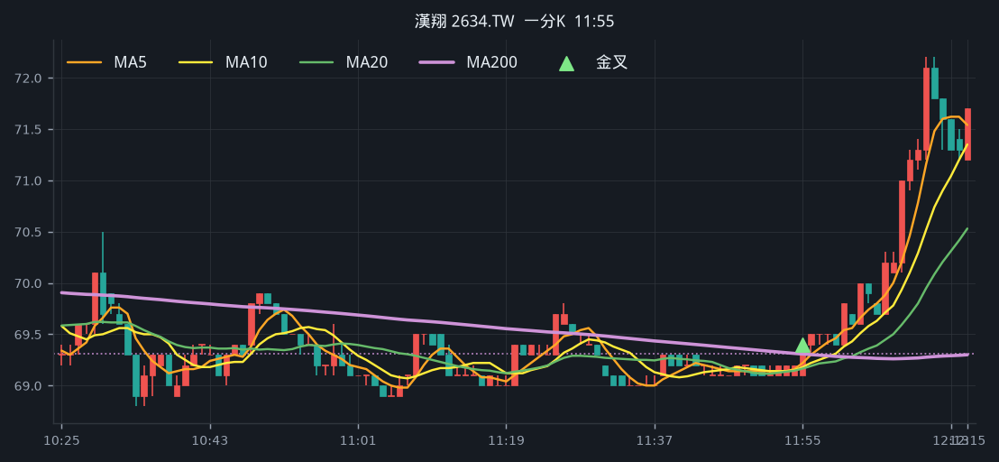

**五分 K（對照）**

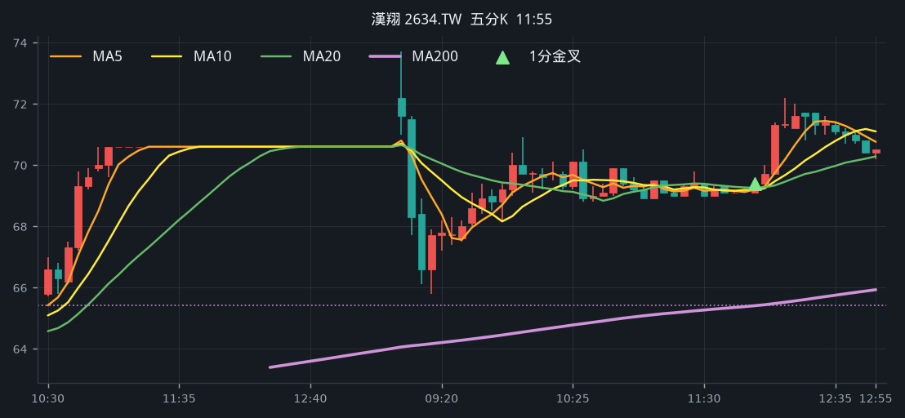

## 6. 光寶科 [2301.TW](https://tw.stock.yahoo.com/quote/2301.TW)

- 價格 263.50 -1.31%　成交額排名 #44　61.74 億
- 1分站穩 12:30　收 268.00 > MA200 267.75
- 1分 MA5 267.60 > MA10 267.10 > MA20 266.68　MA20/MA200 差 0.4%
- 五分收盤 / MA200　268.00 > 265.86（+0.8%）

**一分 K**

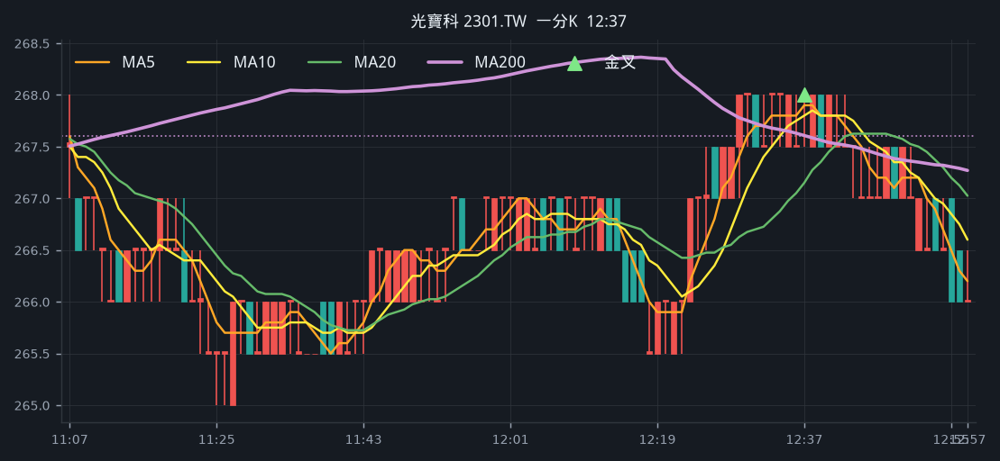

**五分 K（對照）**

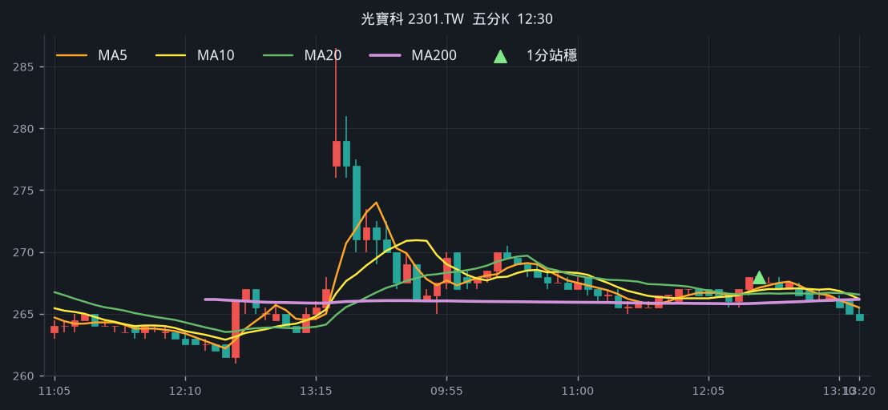

## 7. 雷虎 [8033.TW](https://tw.stock.yahoo.com/quote/8033.TW)

- 價格 191.50 -4.96%　成交額排名 #45　61.73 億
- 1分站穩 12:19　收 194.00 > MA200 193.42
- 1分 MA5 193.30 > MA10 193.05 > MA20 192.45　MA20/MA200 差 0.5%
- 五分收盤 / MA200　194.00 > 184.99（+4.9%）

**一分 K**

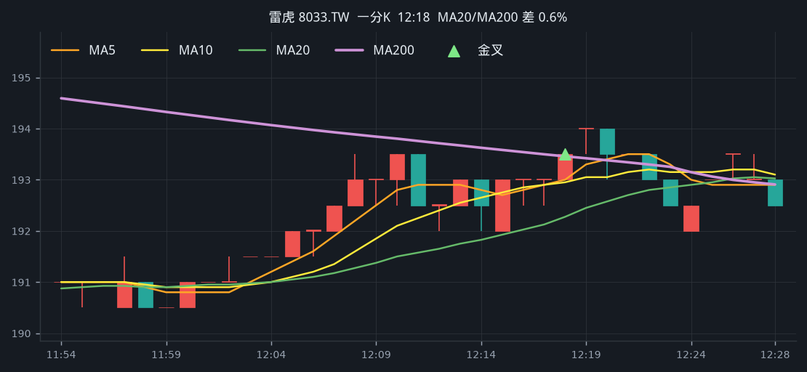

**五分 K（對照）**

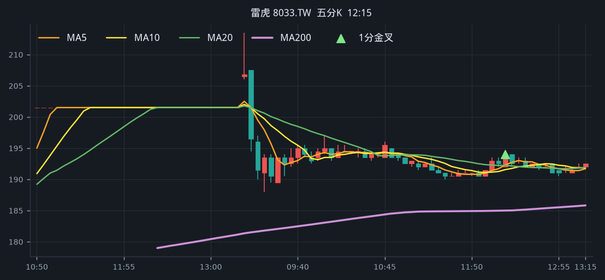

## 8. 頎邦 [6147.TWO](https://tw.stock.yahoo.com/quote/6147.TWO)

- 價格 168.50 +6.98%　成交額排名 #51　54.44 億
- 1分站穩 09:10　收 162.50 > MA200 160.19
- 1分 MA5 160.60 > MA10 159.70 > MA20 159.18　MA20/MA200 差 0.6%
- 五分收盤 / MA200　164.50 > 160.46（+2.5%）

**一分 K**

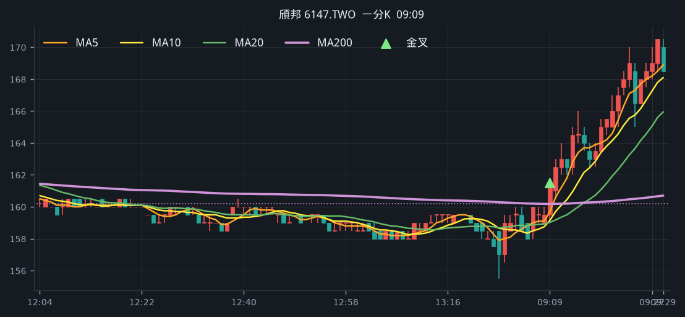

**五分 K（對照）**

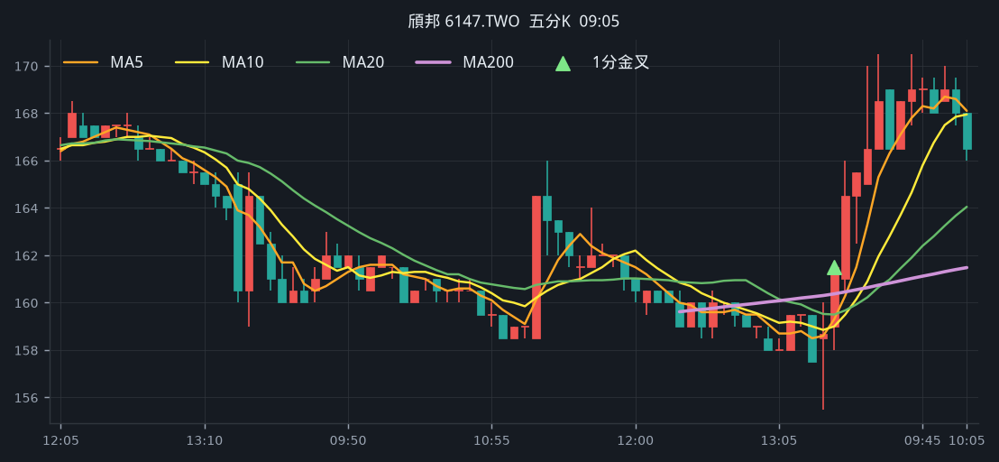

## 9. 中美晶 [5483.TWO](https://tw.stock.yahoo.com/quote/5483.TWO)

- 價格 186.50 -0.80%　成交額排名 #63　42.16 億
- 1分站穩 12:06　收 190.00 > MA200 189.80
- 1分 MA5 189.90 > MA10 189.60 > MA20 189.43　MA20/MA200 差 0.2%
- 五分收盤 / MA200　189.50 > 187.87（+0.9%）

**一分 K**

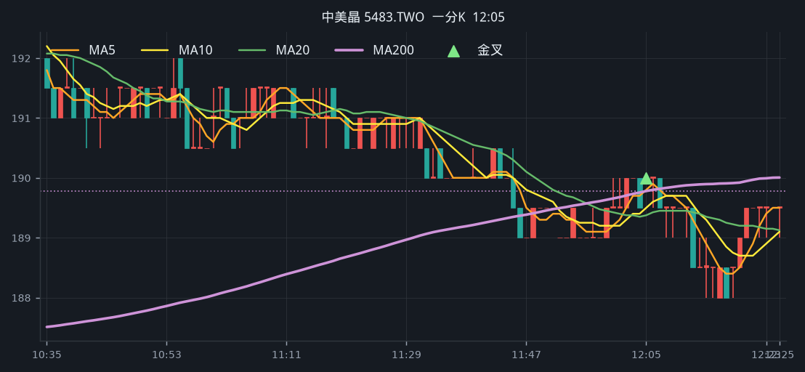

**五分 K（對照）**

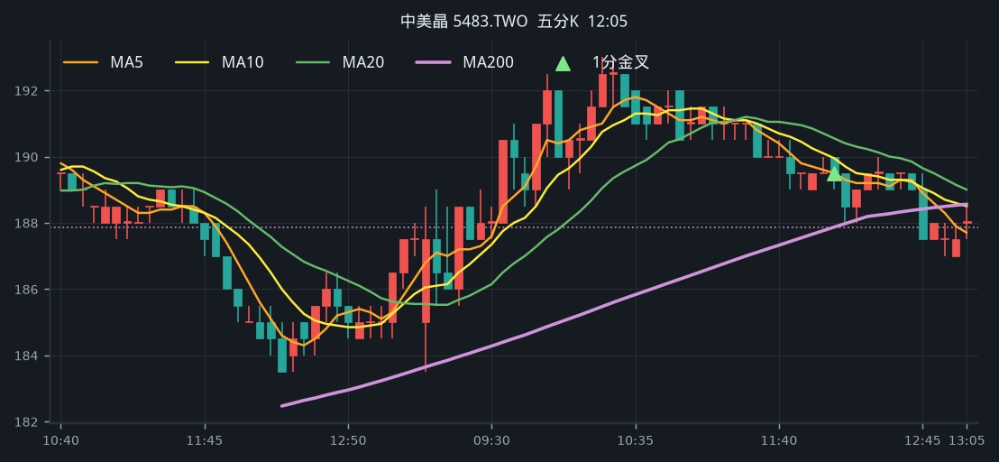

## 10. 信昌電 [6173.TWO](https://tw.stock.yahoo.com/quote/6173.TWO)

- 價格 211.00 +0.48%　成交額排名 #66　39.66 億
- 1分站穩 09:59　收 210.50 > MA200 209.66
- 1分 MA5 209.00 > MA10 208.20 > MA20 207.78　MA20/MA200 差 0.9%
- 五分收盤 / MA200　210.50 > 206.94（+1.7%）

**一分 K**

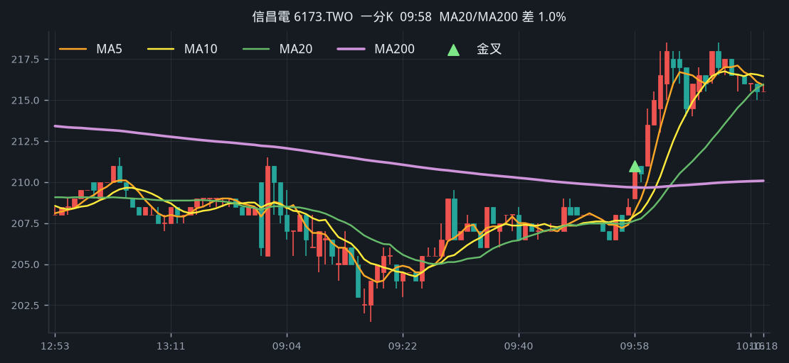

**五分 K（對照）**

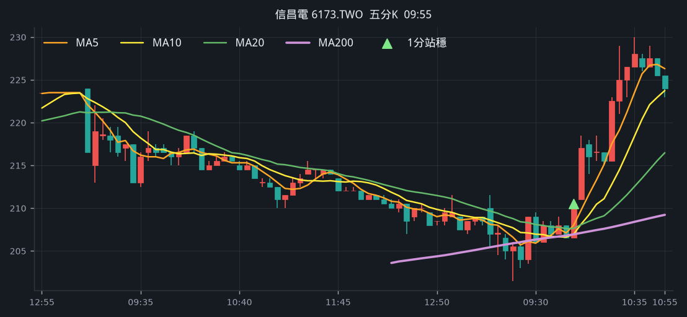

## 11. 一詮 [2486.TW](https://tw.stock.yahoo.com/quote/2486.TW)

- 價格 238.00 +5.54%　成交額排名 #94　21.60 億
- 1分站穩 09:06　收 236.00 > MA200 230.35
- 1分 MA5 231.00 > MA10 228.40 > MA20 227.82　MA20/MA200 差 1.1%
- 五分收盤 / MA200　236.00 > 231.85（+1.8%）

**一分 K**

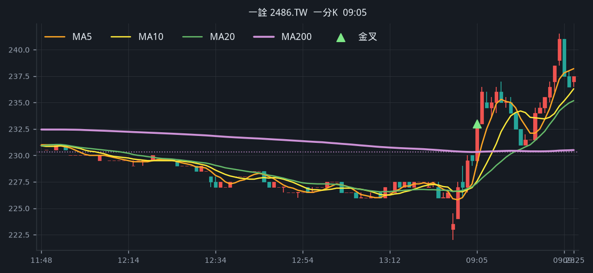

**五分 K（對照）**

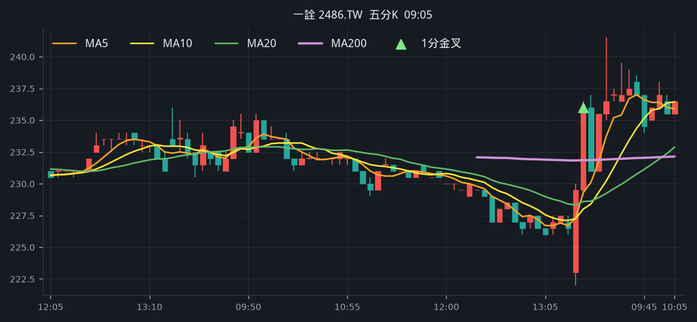

