# MA240 回測：成交額前 200

規則已改成純一分K：**MA5>MA10>MA20，收盤剛上 MA240 就通知**。不再要求兩根站穩、09:10、三根在下、MA 間距、五分K過濾。盤中仍用前一交易日成交額前 200。

## 週二 2026-08-25 盤中（截至 12:28，71 檔）

完整頁： [backtest-2026-08-25.md](backtest-2026-08-25.md) · [HTML](backtest-2026-08-25.html)

盤中用週一成交額前 200（今天盤後名單還沒出）。純一分K MA5>MA10>MA20、收盤剛上 MA240，掃 119 檔命中 71。

## 週五＋週一（舊規則：兩根站穩＋09:10＋五分）

單檔 HTML（含圖）： [backtest-2026-08-21-24.html](backtest-2026-08-21-24.html)

相對前 100：週五多 6 檔、週一多 3 檔。先進光週五正式排名 #110，前 200 就進得去，不必再靠週四名單。

## 週五 2026-08-21（9 檔）

完整頁： [backtest-2026-08-21.md](backtest-2026-08-21.md)

前 100 就有：台虹 10:17、先進光 10:52、聯一光 12:35。  
多出來：統新 09:50、TPK-KY 10:25、亞電 10:31、順德 12:05、雅特力-KY 12:08、瀚荃 13:04。

### 統新 6426.TW　09:50

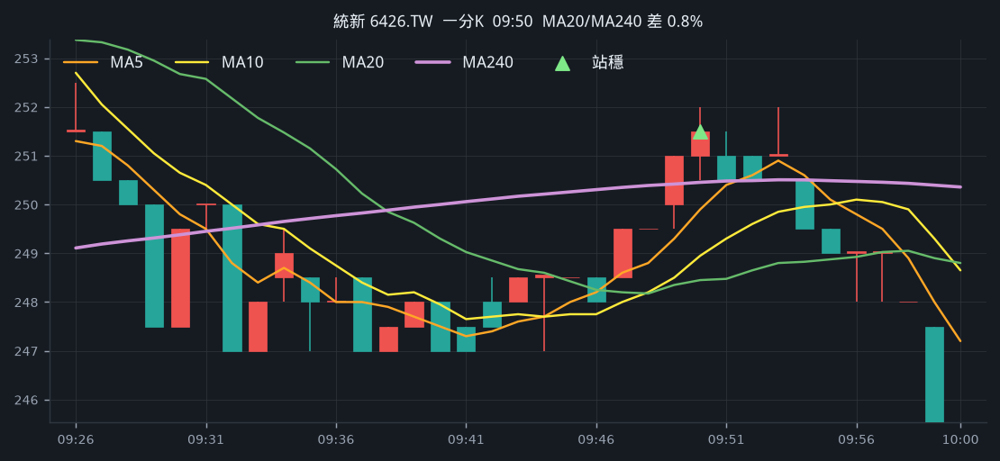

### 台虹 8039.TW　10:17

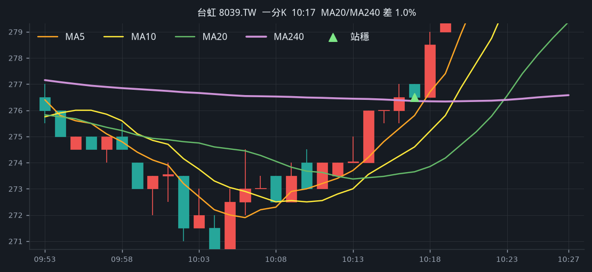

### TPK-KY 3673.TW　10:25

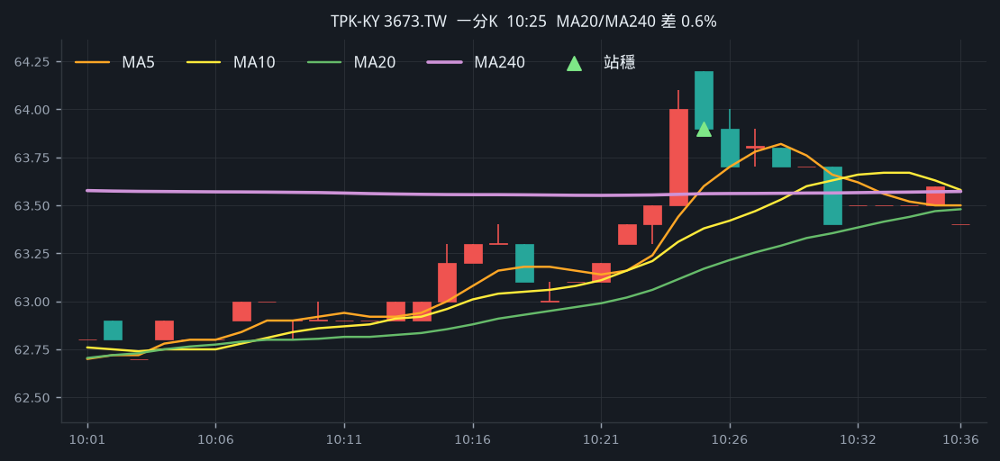

### 亞電 4939.TWO　10:31

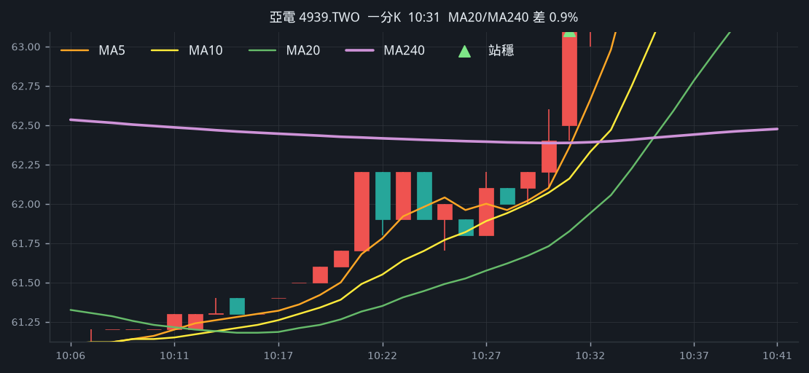

### 先進光 3362.TWO　10:52

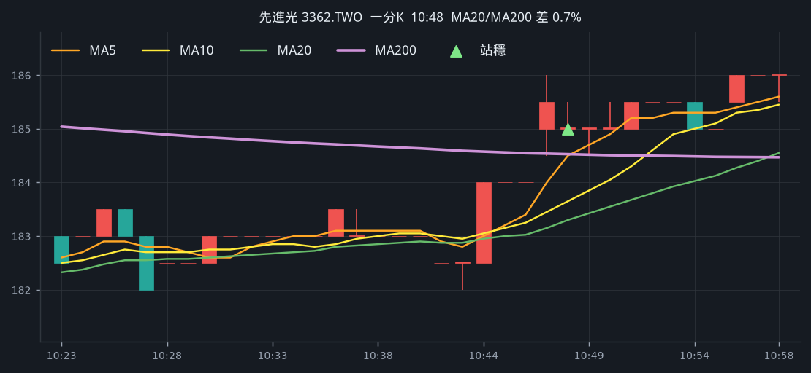

### 順德 2351.TW　12:05

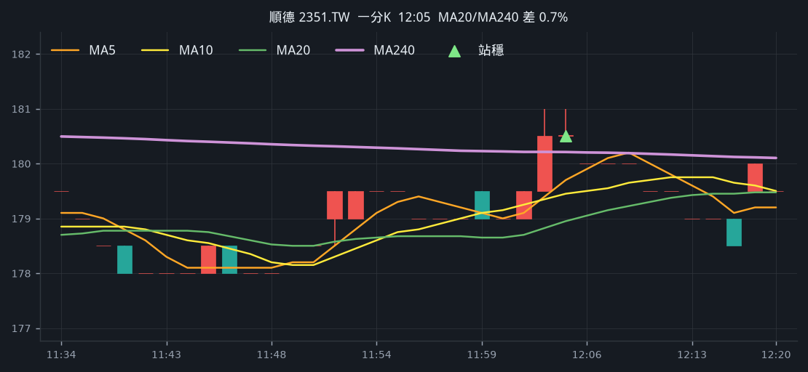

### 雅特力-KY 6907.TWO　12:08

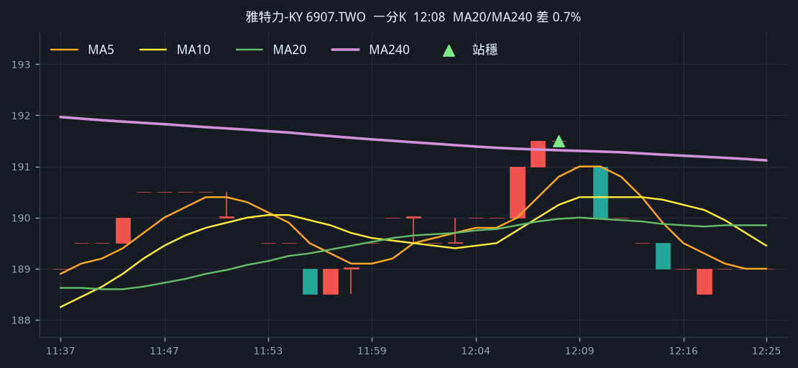

### 聯一光 3441.TWO　12:35

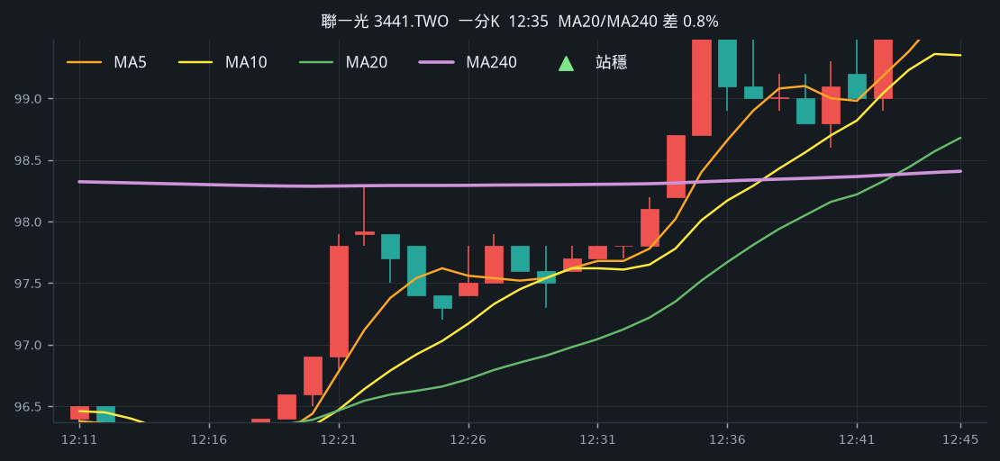

### 瀚荃 8103.TW　13:04

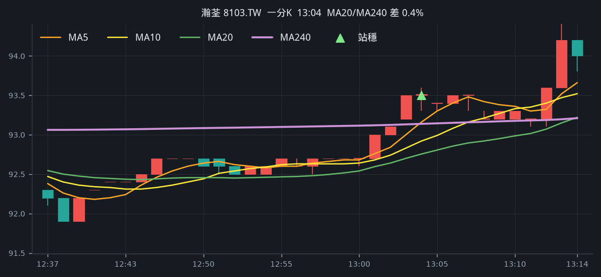

## 週一 2026-08-24（5 檔）

完整頁： [backtest-2026-08-24.md](backtest-2026-08-24.md)

前 100 就有：萬海 11:31、聯一光 12:59。  
多出來：保瑞 10:31、立碁 10:48、和益 12:52。仁寶、力積電仍沒過一分站穩。

### 保瑞 6472.TW　10:31

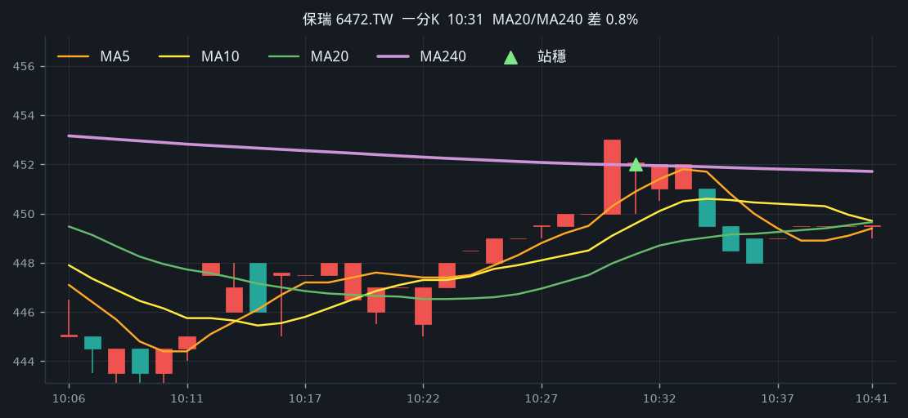

### 立碁 8111.TWO　10:48

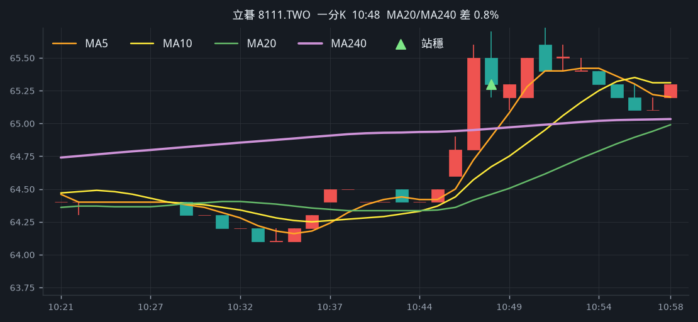

### 萬海 2615.TW　11:31

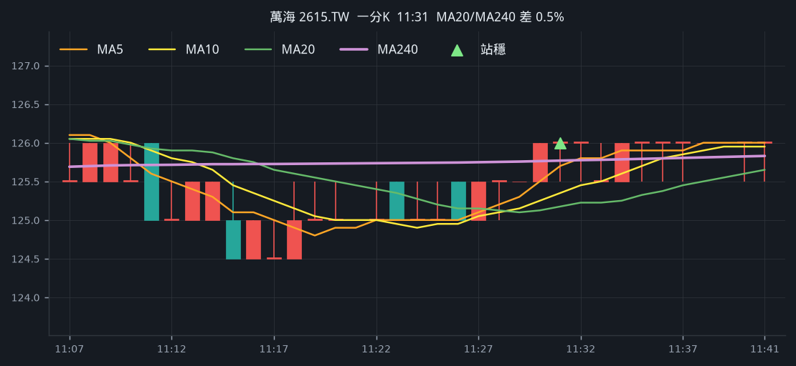

### 和益 1709.TW　12:52

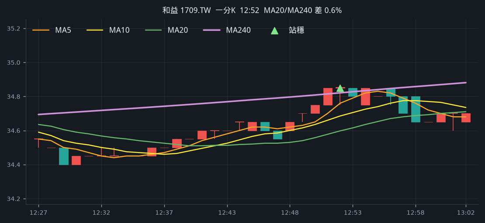

### 聯一光 3441.TWO　12:59

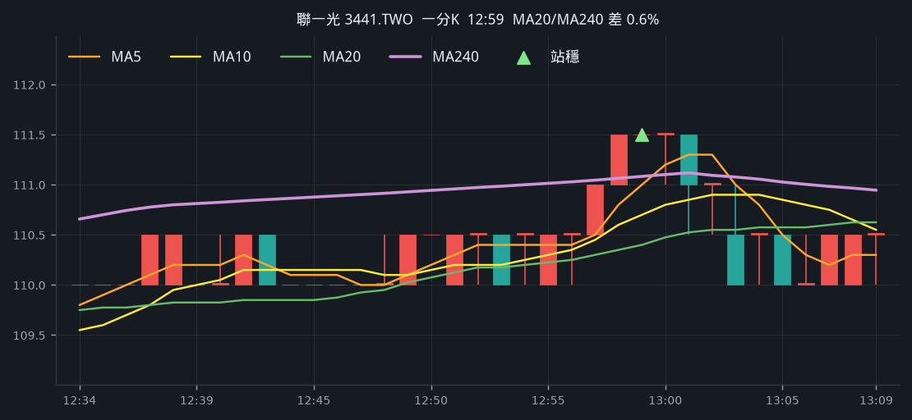
