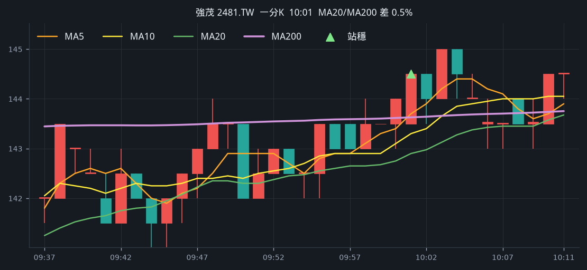
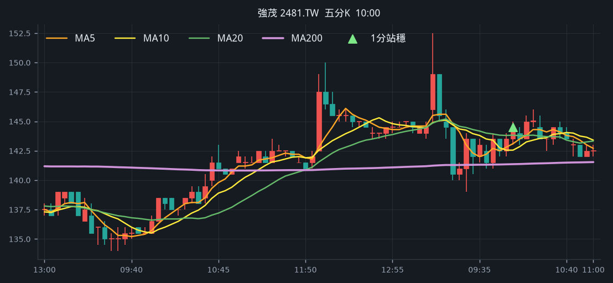
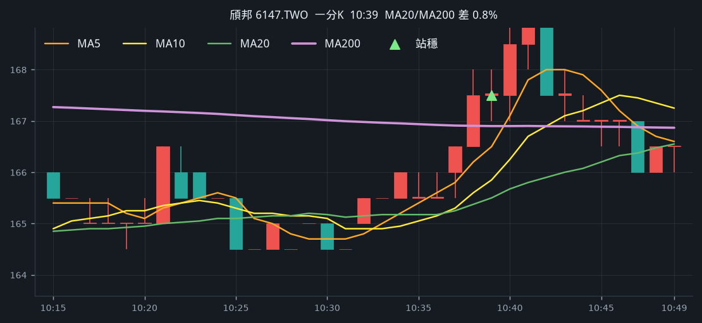
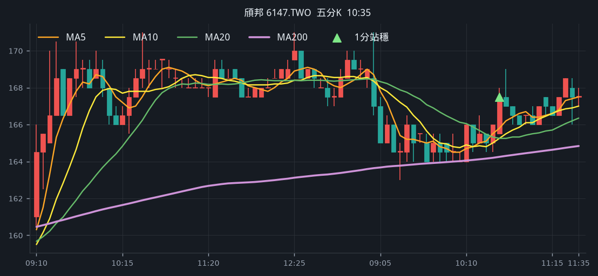
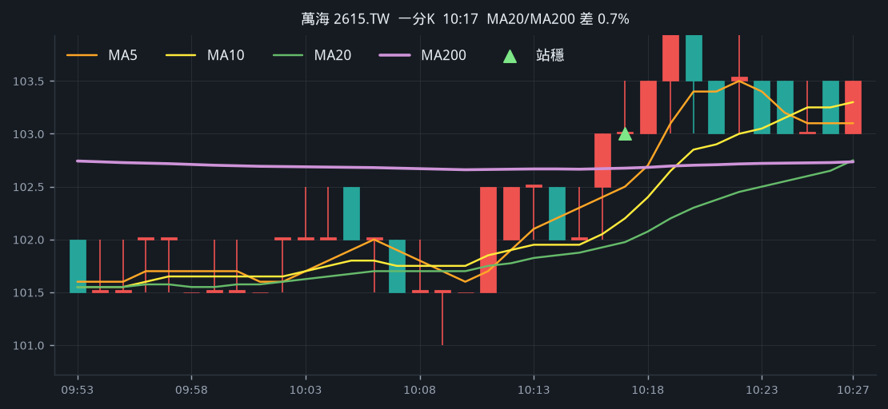
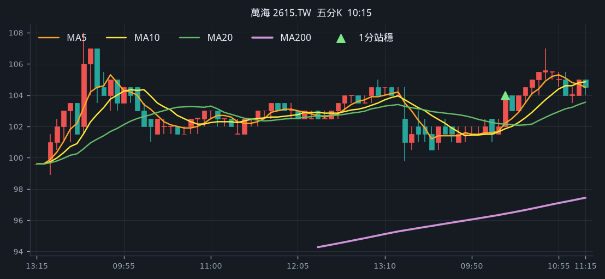
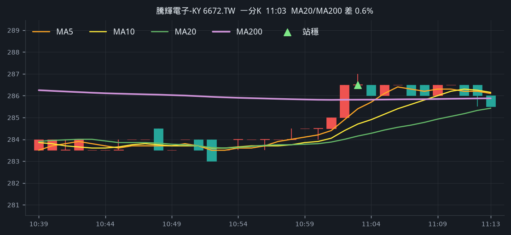
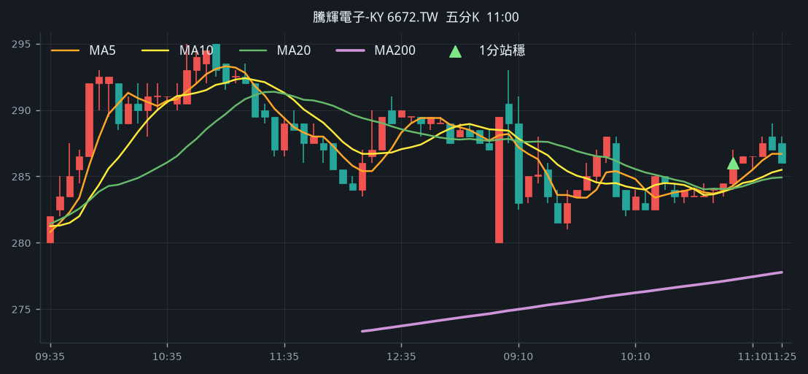

# 這兩天訊號圖

同一套規則：從 MA200 下面穿上、連續兩根站穩、09:10 以後。

## 週二 2026-08-18（2 檔）

完整頁： [backtest-2026-08-18.md](backtest-2026-08-18.md)

### 強茂 2481.TW　10:01

### 頎邦 6147.TWO　10:39

## 週三 2026-08-19（盤中 2 檔）

盤後排行還沒出，用盤中成交額前 100。完整頁： [backtest-2026-08-19.md](backtest-2026-08-19.md)

### 萬海 2615.TW　10:17

### 騰輝電子-KY 6672.TW　11:03

